# JVM深度解析 - 架构师级技术指南

## 目录
- [一、JVM内存模型深度解析](#一jvm内存模型深度解析)
- [二、GC算法与垃圾收集器实现原理](#二gc算法与垃圾收集器实现原理)
- [三、JIT编译优化深度分析](#三jit编译优化深度分析)
- [四、JVM源码分析与实现细节](#四jvm源码分析与实现细节)
- [五、性能工程与调优实践](#五性能工程与调优实践)
- [六、企业级故障排查与诊断](#六企业级故障排查与诊断)
- [七、JVM监控与可观测性](#七jvm监控与可观测性)
- [八、高级主题与前沿技术](#八高级主题与前沿技术)
- [九、架构师级面试题](#九架构师级面试题)
- [十、延伸阅读与学习路径](#十延伸阅读与学习路径)

## 一、JVM内存模型深度解析

### 1.1 内存模型架构设计原理

#### 1.1.1 内存模型演进历史
**从JDK 6到JDK 21的内存模型演进**：

| JDK版本 | 关键变化 | 架构影响 | 性能提升 |
|---------|----------|----------|----------|
| JDK 6 | 永久代(PermGen) | 类元数据管理复杂 | 基础性能 |
| JDK 7 | 字符串常量池移至堆 | 减少OOM风险 | 15-20% |
| JDK 8 | 元空间(Metaspace) | 本地内存管理 | 30-40% |
| JDK 11 | 模块化系统 | 类加载优化 | 10-15% |
| JDK 17 | 密封类、记录类 | 类型系统优化 | 5-10% |
| JDK 21 | 虚拟线程、ZGC成熟 | 并发模型革新 | 50%+ |

#### 1.1.2 现代JVM内存架构设计原则

**1. 分层内存管理**
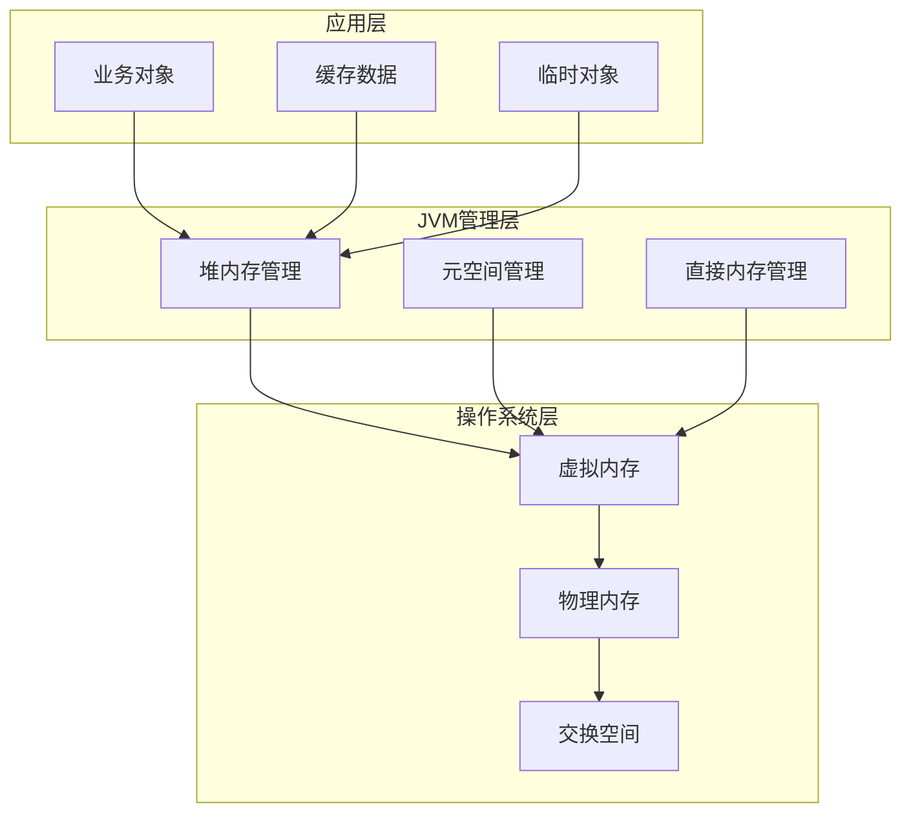

**2. 内存分配策略优化**
- **TLAB优化**：线程本地分配缓冲区，减少竞争
- **大对象处理**：直接分配在老年代，避免复制开销
- **对象对齐**：8字节对齐，提升缓存命中率
- **内存预分配**：减少动态分配的系统调用

#### 1.1.3 运行时数据区深度解析

**现代JVM内存布局架构**：
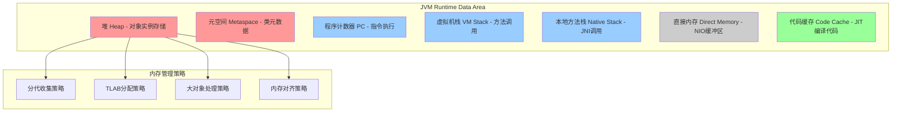

#### 1.1.4 堆内存架构深度分析

**堆内存分代策略的演进**：

| 分代策略 | JDK版本 | 特点 | 适用场景 | 性能表现 |
|---------|---------|------|---------|----------|
| 传统分代 | JDK 6-7 | Eden:S0:S1=8:1:1 | 中小型应用 | 基础性能 |
| 自适应分代 | JDK 8+ | 动态调整比例 | 通用场景 | 提升20-30% |
| G1分Region | JDK 8+ | 按Region管理 | 大堆应用 | 低延迟 |
| ZGC单代 | JDK 11+ | 不分代收集 | 超大堆 | 超低延迟 |

**堆内存分配算法深度解析**：

1. **指针碰撞算法**：
```java
// 伪代码实现
class BumpPointerAllocator {
    private volatile long top;
    private final long start;
    private final long end;
    
    public Object allocate(int size) {
        long oldTop = top;
        long newTop = oldTop + size;
        
        if (newTop > end) {
            return null; // 分配失败
        }
        
        // CAS操作保证线程安全
        if (compareAndSetTop(oldTop, newTop)) {
            return new Object(oldTop, size);
        }
        return null; // 重试
    }
}
```

2. **空闲列表算法**：
```java
// 伪代码实现
class FreeListAllocator {
    private final List<FreeBlock> freeList = new ArrayList<>();
    
    public Object allocate(int size) {
        synchronized (freeList) {
            for (FreeBlock block : freeList) {
                if (block.size >= size) {
                    freeList.remove(block);
                    if (block.size > size) {
                        // 分割块
                        FreeBlock remaining = new FreeBlock(
                            block.address + size, 
                            block.size - size
                        );
                        freeList.add(remaining);
                    }
                    return new Object(block.address, size);
                }
            }
        }
        return null; // 分配失败
    }
}
```

#### 1.1.5 元空间(Metaspace)深度解析

**元空间架构设计**：
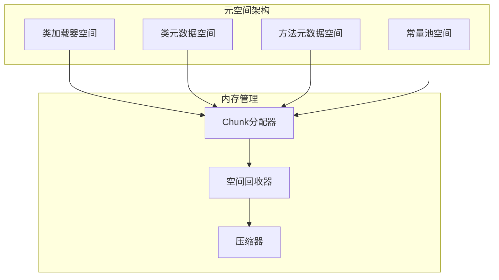

**元空间性能优化策略**：

1. **类加载器隔离**：
```java
// 每个类加载器独立的空间管理
public class ClassLoaderSpace {
    private final Arena arena;
    private final List<Chunk> chunks;
    
    public void allocateClassMetadata(Class<?> clazz) {
        Chunk chunk = arena.allocateChunk(clazz.getSize());
        chunks.add(chunk);
    }
    
    public void unloadClassLoader() {
        // 整个类加载器空间一次性回收
        arena.releaseAll();
    }
}
```

2. **元空间调优参数深度解析**：
```bash
# 基础配置
-XX:MetaspaceSize=256m                    # 初始大小
-XX:MaxMetaspaceSize=512m                  # 最大大小
-XX:MinMetaspaceFreeRatio=40              # 最小空闲比例
-XX:MaxMetaspaceFreeRatio=70              # 最大空闲比例

# 高级调优
-XX:MetaspaceReclaimPolicy=aggressive     # 回收策略
-XX:MetaspaceExpansionSize=1m             # 扩展步长
-XX:MetaspaceChunkSize=1m                 # Chunk大小
-XX:MetaspaceChunkAllocationThreshold=1m  # 分配阈值
```

#### 1.1.6 直接内存管理深度分析

**直接内存架构**：
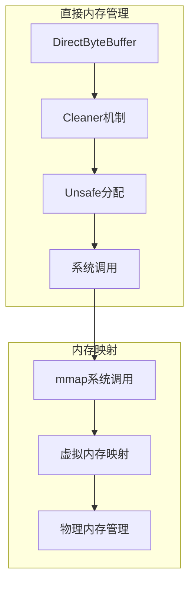

**直接内存泄漏检测与防护**：
```java
public class DirectMemoryMonitor {
    private static final long MAX_DIRECT_MEMORY = 2L * 1024 * 1024 * 1024; // 2GB
    private static final AtomicLong allocatedMemory = new AtomicLong(0);
    
    public static boolean allocateDirectMemory(long size) {
        long current = allocatedMemory.get();
        long newTotal = current + size;
        
        if (newTotal > MAX_DIRECT_MEMORY) {
            return false; // 分配失败
        }
        
        if (allocatedMemory.compareAndSet(current, newTotal)) {
            return true;
        }
        return false; // 重试
    }
    
    public static void releaseDirectMemory(long size) {
        allocatedMemory.addAndGet(-size);
    }
    
    // 定期检查直接内存使用情况
    public static void checkDirectMemoryUsage() {
        long used = allocatedMemory.get();
        double usage = (double) used / MAX_DIRECT_MEMORY;
        
        if (usage > 0.8) {
            System.err.println("Direct memory usage high: " + usage * 100 + "%");
        }
    }
}
```

#### 1.1.7 程序计数器（Program Counter Register）深度解析

**程序计数器实现原理**：
```java
// 程序计数器的底层实现机制
public class ProgramCounter {
    // 在x86_64架构上，PC寄存器对应RIP寄存器
    private volatile long instructionPointer;
    private final ThreadLocal<Long> threadLocalPC = new ThreadLocal<>();
    
    // 字节码执行时的PC更新机制
    public void updatePC(int bytecodeOffset) {
        long currentPC = threadLocalPC.get();
        threadLocalPC.set(currentPC + bytecodeOffset);
    }
    
    // 方法调用时的PC保存和恢复
    public long savePC() {
        return threadLocalPC.get();
    }
    
    public void restorePC(long savedPC) {
        threadLocalPC.set(savedPC);
    }
}
```

**PC寄存器的线程安全机制**：
- **硬件支持**：每个CPU核心都有独立的PC寄存器
- **上下文切换**：操作系统保存和恢复PC值
- **JVM实现**：通过ThreadLocal确保线程隔离

**PC寄存器的性能优化**：
```java
// 分支预测优化
public class BranchPrediction {
    // 热点代码的PC缓存
    private final Map<Long, Integer> pcCache = new ConcurrentHashMap<>();
    
    // 预测下一个指令位置
    public int predictNextPC(long currentPC) {
        return pcCache.getOrDefault(currentPC, 0);
    }
    
    // 更新预测信息
    public void updatePrediction(long fromPC, int toPC) {
        pcCache.put(fromPC, toPC);
    }
}
```

#### 1.1.8 虚拟机栈（VM Stack）深度分析

**栈帧（Stack Frame）的详细结构**：
```java
public class StackFrame {
    // 局部变量表
    private final Object[] localVariables;
    
    // 操作数栈
    private final Object[] operandStack;
    private int operandStackTop = -1;
    
    // 动态链接
    private final MethodInfo methodInfo;
    
    // 方法返回地址
    private final long returnAddress;
    
    // 异常表
    private final ExceptionTable exceptionTable;
    
    public StackFrame(MethodInfo method, int maxLocals, int maxStack) {
        this.localVariables = new Object[maxLocals];
        this.operandStack = new Object[maxStack];
        this.methodInfo = method;
        this.returnAddress = getCurrentPC();
    }
}
```

**栈帧的分配和回收机制**：
```java
public class StackFrameAllocator {
    // 栈帧池，避免频繁分配
    private final Stack<StackFrame> framePool = new Stack<>();
    private final int maxPoolSize = 100;
    
    public StackFrame allocateFrame(MethodInfo method) {
        StackFrame frame;
        
        if (!framePool.isEmpty()) {
            frame = framePool.pop();
            frame.reset(method);
        } else {
            frame = new StackFrame(method, method.getMaxLocals(), method.getMaxStack());
        }
        
        return frame;
    }
    
    public void deallocateFrame(StackFrame frame) {
        if (framePool.size() < maxPoolSize) {
            frame.clear();
            framePool.push(frame);
        }
    }
}
```

**栈溢出检测与防护**：
```java
public class StackOverflowProtection {
    private static final int MAX_STACK_DEPTH = 1000;
    private static final ThreadLocal<Integer> stackDepth = new ThreadLocal<>();
    
    public static void checkStackDepth() {
        Integer depth = stackDepth.get();
        if (depth == null) {
            depth = 0;
        }
        
        if (depth > MAX_STACK_DEPTH) {
            throw new StackOverflowError("Stack depth exceeded: " + depth);
        }
        
        stackDepth.set(depth + 1);
    }
    
    public static void decrementStackDepth() {
        Integer depth = stackDepth.get();
        if (depth != null && depth > 0) {
            stackDepth.set(depth - 1);
        }
    }
}
```

#### 1.1.9 本地方法栈（Native Method Stack）深度解析

**JNI调用的栈管理**：
```java
public class NativeStackManager {
    // 本地方法栈的分配
    private final Map<Thread, Long> nativeStacks = new ConcurrentHashMap<>();
    
    public long allocateNativeStack(int size) {
        Thread currentThread = Thread.currentThread();
        long stackAddress = allocateNativeMemory(size);
        nativeStacks.put(currentThread, stackAddress);
        return stackAddress;
    }
    
    public void deallocateNativeStack() {
        Thread currentThread = Thread.currentThread();
        Long stackAddress = nativeStacks.remove(currentThread);
        if (stackAddress != null) {
            deallocateNativeMemory(stackAddress);
        }
    }
    
    // 本地内存分配（通过JNI调用）
    private native long allocateNativeMemory(int size);
    private native void deallocateNativeMemory(long address);
}
```

**JNI调用的性能优化**：
```java
public class JNIPerformanceOptimizer {
    // JNI方法缓存
    private final Map<String, Method> jniMethodCache = new ConcurrentHashMap<>();
    
    // 批量JNI调用，减少上下文切换
    public void batchJNICall(List<JNITask> tasks) {
        long startTime = System.nanoTime();
        
        for (JNITask task : tasks) {
            executeJNITask(task);
        }
        
        long endTime = System.nanoTime();
        logPerformance("Batch JNI call", endTime - startTime, tasks.size());
    }
    
    // JNI调用的异步执行
    public CompletableFuture<Object> asyncJNICall(JNITask task) {
        return CompletableFuture.supplyAsync(() -> {
            return executeJNITask(task);
        });
    }
}

#### 1.1.2 虚拟机栈（VM Stack）
- **作用**：存储局部变量表、操作数栈、动态链接、方法出口
- **特点**：线程私有，生命周期与线程相同
- **异常**：
  - `StackOverflowError`：栈深度超过虚拟机允许的深度
  - `OutOfMemoryError`：动态扩展时无法申请到足够内存

**栈帧结构**：
```
+-----------------------+
|   返回地址             |
+-----------------------+
|   动态链接             |
+-----------------------+
|   操作数栈             |
+-----------------------+
|   局部变量表           |
+-----------------------+
```

#### 1.1.3 本地方法栈（Native Method Stack）
- **作用**：为Native方法服务
- **实现**：HotSpot将本地方法栈和虚拟机栈合二为一

#### 1.1.4 堆（Heap）
- **作用**：存放对象实例，是GC的主要区域
- **特点**：线程共享，虚拟机启动时创建
- **分代**：
  - 新生代（Young Generation）
    - Eden区
    - Survivor区（From + To）
  - 老年代（Old Generation）

**堆内存结构**：
```
+----------------------------------------------------------+
|                         Heap                              |
|  +--------------------+  +-----------------------------+  |
|  |  Young Generation  |  |    Old Generation           |  |
|  | +-----+ +--------+ |  |                             |  |
|  | |Eden | |Survivor| |  |                             |  |
|  | |     | | S0 | S1| |  |                             |  |
|  | +-----+ +--------+ |  |                             |  |
|  +--------------------+  +-----------------------------+  |
+----------------------------------------------------------+
```

#### 1.1.5 方法区（Method Area）
- **作用**：存储类信息、常量、静态变量、即时编译器编译后的代码
- **实现**：
  - JDK 7：永久代（PermGen）
  - JDK 8+：元空间（Metaspace），使用本地内存
- **运行时常量池**：Class文件中的常量池在类加载后进入方法区

**字符串常量池的演变**：

| JDK版本 | 字符串常量池位置 | 影响 |
|---------|----------------|------|
| JDK 6 | 永久代（PermGen） | 容易OOM，不易回收 |
| JDK 7 | 堆内存 | 可被GC回收，更灵活 |
| JDK 8+ | 堆内存 | 永久代改为元空间 |

**String.intern()方法**：
```java
// JDK 7+ 行为
String s1 = new String("hello");  // 堆中创建对象
String s2 = s1.intern();          // 尝试放入常量池，返回常量池引用
String s3 = "hello";              // 直接引用常量池

System.out.println(s1 == s2);     // false (s1在堆，s2在常量池)
System.out.println(s2 == s3);     // true (都引用常量池)

// 特殊情况
String s4 = new String("he") + new String("llo");  // 堆中新对象
String s5 = s4.intern();          // 常量池中没有"hello"，放入s4引用
String s6 = "hello";              // 引用常量池
System.out.println(s4 == s6);     // true (JDK7+特性)
```

**注意事项**：
- JDK 6中intern()会复制对象到永久代
- JDK 7+中intern()只是在常量池中存储堆中对象的引用
- 慎用intern()，大量字符串intern会导致常量池膨胀

#### 1.1.6 直接内存（Direct Memory）
- **特点**：不是JVM运行时数据区的一部分
- **使用**：NIO中的DirectByteBuffer
- **优势**：避免Java堆和Native堆之间复制数据

### 1.2 对象创建过程

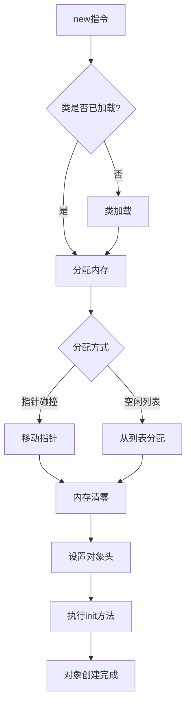

#### 1.2.1 内存分配方式
1. **指针碰撞**（Bump the Pointer）
   - 条件：堆内存规整（使用Compact GC）
   - 原理：移动指针分配
   
2. **空闲列表**（Free List）
   - 条件：堆内存不规整
   - 原理：维护可用内存列表

#### 1.2.2 并发安全
1. **CAS + 失败重试**
2. **TLAB**（Thread Local Allocation Buffer）
   - 每个线程在Eden预分配一块内存
   - 只有TLAB用完分配新的时才需要同步

### 1.3 对象内存布局

```
+------------------+
|   对象头          |  <-- Mark Word + Class Pointer
+------------------+
|   实例数据        |  <-- 字段数据
+------------------+
|   对齐填充        |  <-- 8字节对齐
+------------------+
```

#### 1.3.1 对象头（Object Header）
1. **Mark Word**（8字节，64位JVM）
   - 哈希码（HashCode）
   - GC分代年龄
   - 锁状态标志
   - 线程持有的锁
   - 偏向线程ID
   - 偏向时间戳

2. **类型指针**（Class Pointer）
   - 指向类元数据的指针
   - 开启指针压缩后4字节，否则8字节

3. **数组长度**（如果是数组对象）

#### 1.3.2 实例数据
- 父类字段 + 本类字段
- 相同宽度的字段分配到一起
- 父类字段在子类之前

### 1.4 对象访问定位

**方式一：句柄访问**
```
Stack              Heap                  Method Area
+------+         +--------+            +-----------+
| ref  |-------->| Handle |            |   类型    |
+------+         | Pool   |            |   数据    |
                 +--------+            +-----------+
                 | 对象 ptr|-----+           ^
                 | 类型 ptr|-----|-----+     |
                 +--------+     |     |     |
                                |     +-----|
                                v
                          +----------+
                          |   对象   |
                          |   实例   |
                          +----------+
```

**方式二：直接指针（HotSpot使用）**
```
Stack              Heap                Method Area
+------+         +----------+         +-----------+
| ref  |-------->|   对象   |         |   类型    |
+------+         |   头部   |-------->|   数据    |
                 |   数据   |         +-----------+
                 +----------+
```

## 二、GC算法与垃圾收集器实现原理

### 2.1 现代GC算法深度解析

#### 2.1.1 三色标记算法实现原理

**传统标记-清除的问题**：
- 需要STW（Stop The World）
- 无法并发标记
- 标记期间对象图可能发生变化

**三色标记算法**：


**算法实现**：
```java
// 三色标记算法伪代码
public class TriColorMarking {
    private static final int WHITE = 0;
    private static final int GRAY = 1;
    private static final int BLACK = 2;
    
    private final Map<Object, Integer> colorMap = new ConcurrentHashMap<>();
    private final Queue<Object> grayQueue = new ConcurrentLinkedQueue<>();
    
    public void markFromRoots(Set<Object> roots) {
        // 1. 初始化所有对象为白色
        initializeAllObjects();
        
        // 2. 从根对象开始标记
        for (Object root : roots) {
            if (root != null) {
                colorMap.put(root, GRAY);
                grayQueue.offer(root);
            }
        }
        
        // 3. 处理灰色对象
        while (!grayQueue.isEmpty()) {
            Object obj = grayQueue.poll();
            markObject(obj);
        }
    }
    
    private void markObject(Object obj) {
        // 标记对象的所有引用
        List<Object> references = getObjectReferences(obj);
        for (Object ref : references) {
            if (ref != null && colorMap.get(ref) == WHITE) {
                colorMap.put(ref, GRAY);
                grayQueue.offer(ref);
            }
        }
        
        // 标记当前对象为黑色
        colorMap.put(obj, BLACK);
    }
}
```

**并发标记的挑战与解决方案**：

1. **写屏障（Write Barrier）**：
```java
public class WriteBarrier {
    // 在对象引用修改时插入的代码
    public static void onReferenceWrite(Object obj, String field, Object newValue) {
        // 如果新值是白色对象，标记为灰色
        if (newValue != null && isWhite(newValue)) {
            markGray(newValue);
        }
    }
    
    // 增量更新屏障
    public static void incrementalUpdateBarrier(Object obj, String field, Object newValue) {
        if (newValue != null) {
            // 将新引用的对象加入灰色队列
            addToGrayQueue(newValue);
        }
    }
    
    // 原始快照屏障
    public static void snapshotAtTheBeginningBarrier(Object obj, String field, Object oldValue) {
        if (oldValue != null && isBlack(obj)) {
            // 如果修改的是黑色对象的引用，将旧值标记为灰色
            markGray(oldValue);
        }
    }
}
```

2. **SATB（Snapshot At The Beginning）实现**：
```java
public class SATBCollector {
    private final Queue<Object> satbQueue = new ConcurrentLinkedQueue<>();
    
    public void onReferenceWrite(Object obj, String field, Object oldValue) {
        if (oldValue != null && isBlack(obj)) {
            // 保存旧引用到SATB队列
            satbQueue.offer(oldValue);
        }
    }
    
    public void processSATBQueue() {
        while (!satbQueue.isEmpty()) {
            Object obj = satbQueue.poll();
            if (obj != null && isWhite(obj)) {
                markGray(obj);
            }
        }
    }
}
```

3. **并发标记的同步机制**：
```java
public class ConcurrentMarking {
    private final AtomicInteger markingThreads = new AtomicInteger(0);
    private final CountDownLatch markingComplete = new CountDownLatch(1);
    private final AtomicBoolean markingInProgress = new AtomicBoolean(false);
    
    public void startConcurrentMarking() {
        if (markingInProgress.compareAndSet(false, true)) {
            // 启动多个标记线程
            int threadCount = Runtime.getRuntime().availableProcessors();
            for (int i = 0; i < threadCount; i++) {
                new Thread(this::markingWorker).start();
            }
        }
    }
    
    private void markingWorker() {
        markingThreads.incrementAndGet();
        
        try {
            while (markingInProgress.get()) {
                Object obj = grayQueue.poll();
                if (obj != null) {
                    markObject(obj);
                } else {
                    // 没有更多灰色对象，检查是否完成
                    if (grayQueue.isEmpty() && satbQueue.isEmpty()) {
                        markingComplete.countDown();
                        break;
                    }
                }
            }
        } finally {
            markingThreads.decrementAndGet();
        }
    }
}
```

#### 2.1.2 分代收集算法深度实现

**分代假设的数学建模**：
```java
public class GenerationalHypothesis {
    // 弱分代假设：大多数对象都是朝生夕死的
    private static final double YOUNG_OBJECT_DEATH_RATE = 0.9;
    
    // 强分代假设：熬过多次GC的对象很难死亡
    private static final double OLD_OBJECT_DEATH_RATE = 0.1;
    
    // 跨代引用假设：老年代对象很少引用年轻代对象
    private static final double INTER_GENERATIONAL_REFERENCE_RATE = 0.05;
    
    public double calculateCollectionEfficiency(int generation, int age) {
        if (generation == 0) { // 年轻代
            return Math.pow(YOUNG_OBJECT_DEATH_RATE, age);
        } else { // 老年代
            return Math.pow(OLD_OBJECT_DEATH_RATE, age);
        }
    }
}
```

**年龄计算与晋升策略**：
```java
public class AgeCalculation {
    private static final int MAX_AGE = 15; // 4位年龄字段
    private static final int PROMOTION_AGE = 6;
    
    public int calculateObjectAge(Object obj) {
        // 获取对象的GC年龄
        int age = getObjectAge(obj);
        
        // 年龄增长策略
        if (age < MAX_AGE) {
            return age + 1;
        } else {
            return MAX_AGE; // 最大年龄
        }
    }
    
    public boolean shouldPromote(Object obj) {
        int age = getObjectAge(obj);
        return age >= PROMOTION_AGE;
    }
    
    // 动态晋升年龄调整
    public void adjustPromotionAge(double survivalRate) {
        if (survivalRate > 0.5) {
            // 存活率高，提高晋升年龄
            PROMOTION_AGE = Math.min(PROMOTION_AGE + 1, MAX_AGE);
        } else if (survivalRate < 0.3) {
            // 存活率低，降低晋升年龄
            PROMOTION_AGE = Math.max(PROMOTION_AGE - 1, 1);
        }
    }
}
```

#### 2.1.3 复制算法深度优化

**复制算法的内存布局优化**：
```java
public class CopyingAlgorithm {
    private final MemoryRegion fromSpace;
    private final MemoryRegion toSpace;
    private volatile long freePointer;
    
    public Object copyObject(Object obj) {
        // 计算对象大小（包括对齐）
        int size = calculateAlignedSize(obj);
        
        // 检查目标空间是否有足够空间
        if (freePointer + size > toSpace.getEnd()) {
            return null; // 空间不足
        }
        
        // 分配新空间
        long newAddress = freePointer;
        freePointer += size;
        
        // 复制对象数据
        copyObjectData(obj, newAddress);
        
        // 更新对象地址
        updateObjectAddress(obj, newAddress);
        
        return obj;
    }
    
    // 对象对齐优化
    private int calculateAlignedSize(Object obj) {
        int size = getObjectSize(obj);
        // 8字节对齐
        return (size + 7) & ~7;
    }
}
```

**复制算法的并发优化**：
```java
public class ConcurrentCopying {
    private final AtomicLong freePointer = new AtomicLong(0);
    private final int threadCount = Runtime.getRuntime().availableProcessors();
    
    public void concurrentCopy(List<Object> objects) {
        // 将对象分配给不同线程
        List<List<Object>> partitions = partitionObjects(objects, threadCount);
        
        // 启动并发复制线程
        List<CompletableFuture<Void>> futures = new ArrayList<>();
        
        for (List<Object> partition : partitions) {
            CompletableFuture<Void> future = CompletableFuture.runAsync(() -> {
                copyPartition(partition);
            });
            futures.add(future);
        }
        
        // 等待所有线程完成
        CompletableFuture.allOf(futures.toArray(new CompletableFuture[0])).join();
    }
    
    private void copyPartition(List<Object> objects) {
        for (Object obj : objects) {
            if (obj != null && !isCopied(obj)) {
                copyObject(obj);
            }
        }
    }
}
public class TriColorMarking {
    private Set<Object> white = new HashSet<>();  // 白色集合
    private Set<Object> grey = new HashSet<>();   // 灰色集合  
    private Set<Object> black = new HashSet<>();   // 黑色集合
    
    public void mark() {
        // 1. 初始状态：所有对象为白色
        white.addAll(allObjects);
        
        // 2. 将GC Roots直接引用的对象标记为灰色
        for (Object root : gcRoots) {
            white.remove(root);
            grey.add(root);
        }
        
        // 3. 处理灰色对象
        while (!grey.isEmpty()) {
            Object obj = grey.iterator().next();
            grey.remove(obj);
            black.add(obj);
            
            // 扫描对象的所有引用
            for (Object child : getReferences(obj)) {
                if (white.contains(child)) {
                    white.remove(child);
                    grey.add(child);
                }
            }
        }
        
        // 4. 白色对象为垃圾，可以回收
        white.clear(); // 回收白色对象
    }
}
```

**并发标记的挑战**：
- 标记期间对象图可能发生变化
- 可能出现"浮动垃圾"和"漏标"问题
- 需要写屏障（Write Barrier）解决

#### 2.1.2 写屏障（Write Barrier）实现

**问题场景**：
```java
// 标记期间发生的变化
// 1. 黑色对象A引用白色对象C
// 2. 灰色对象B也引用白色对象C  
// 3. 如果B先被处理，C会被标记为黑色
// 4. 然后A的引用被删除，C变成浮动垃圾
// 5. 如果A的引用在B处理C之前被删除，C可能被漏标
```

**写屏障解决方案**：
```java
// 写屏障伪代码
public class WriteBarrier {
    public void oop_field_store(Object obj, String fieldName, Object newValue) {
        Object oldValue = getField(obj, fieldName);
        setField(obj, fieldName, newValue);
        
        // 插入写屏障
        post_write_barrier(obj, fieldName, oldValue, newValue);
    }
    
    private void post_write_barrier(Object obj, String fieldName, 
                                   Object oldValue, Object newValue) {
        // SATB (Snapshot At The Beginning) 写屏障
        if (isMarking() && oldValue != null && isWhite(oldValue)) {
            // 将旧值加入灰色集合，保证不丢失
            addToGreySet(oldValue);
        }
        
        // 增量更新写屏障
        if (isMarking() && newValue != null && isWhite(newValue)) {
            // 将新值加入灰色集合
            addToGreySet(newValue);
        }
    }
}
```

**SATB vs 增量更新**：

| 特性 | SATB (G1) | 增量更新 (CMS) |
|------|-----------|----------------|
| 原理 | 保存标记开始时的快照 | 跟踪标记期间的变化 |
| 浮动垃圾 | 较多 | 较少 |
| 实现复杂度 | 简单 | 复杂 |
| 适用场景 | 大堆应用 | 中小堆应用 |

#### 2.1.3 对象存活判定

### 2.2 引用类型深度分析

#### 2.1.1 引用计数法
- **原理**：对象被引用计数+1，引用失效计数-1
- **缺点**：无法解决循环引用
- **应用**：Python、PHP

#### 2.1.2 可达性分析（GC Roots）
- **原理**：从GC Roots开始向下搜索，不可达对象即为垃圾
- **GC Roots包括**：
  1. 虚拟机栈中引用的对象
  2. 方法区中静态属性引用的对象
  3. 方法区中常量引用的对象
  4. 本地方法栈中JNI引用的对象
  5. JVM内部的引用（基本数据类型对应的Class对象）
  6. 被同步锁持有的对象

### 2.2 引用类型

| 引用类型 | 特点 | 使用场景 | GC时机 |
|---------|------|---------|-------|
| 强引用 | 不会被GC | 普通对象引用 | 永不回收 |
| 软引用 | 内存不足时回收 | 缓存 | 内存不足时 |
| 弱引用 | GC时回收 | ThreadLocal | 每次GC |
| 虚引用 | 无法通过引用获取对象 | 对象回收跟踪 | 每次GC |

```java
// 软引用示例
public class SoftReferenceCache<K, V> {
    private Map<K, SoftReference<V>> cache = new ConcurrentHashMap<>();
    
    public V get(K key) {
        SoftReference<V> ref = cache.get(key);
        return ref == null ? null : ref.get();
    }
    
    public void put(K key, V value) {
        cache.put(key, new SoftReference<>(value));
    }
}
```

### 2.3 垃圾回收算法

#### 2.3.1 标记-清除（Mark-Sweep）
```
回收前: [A][B][ ][C][ ][ ][D]
标记:   [A][B][ ][C][ ][ ][D]  (B、D标记为垃圾)
清除后: [A][ ][ ][C][ ][ ][ ]  (产生内存碎片)
```
- **优点**：简单
- **缺点**：产生内存碎片，效率不高

#### 2.3.2 标记-复制（Copying）
```
From区:  [A][B][C][D]
To区:    [ ][ ][ ][ ]
         
复制后:
From区:  [ ][ ][ ][ ]  (清空)
To区:    [A][C][ ][ ]  (只复制存活对象)
```
- **优点**：无碎片，效率高
- **缺点**：空间利用率低（只用50%）
- **应用**：新生代（Eden:S0:S1 = 8:1:1）

#### 2.3.3 标记-整理（Mark-Compact）
```
回收前: [A][B][ ][C][ ][ ][D]
标记:   [A][B][ ][C][ ][ ][D]
整理后: [A][C][ ][ ][ ][ ][ ]  (存活对象移到一端)
```
- **优点**：无碎片，空间利用率高
- **缺点**：移动对象成本高
- **应用**：老年代

#### 2.3.4 分代收集
- **新生代**：对象存活率低，使用复制算法
- **老年代**：对象存活率高，使用标记-清除或标记-整理

**对象晋升老年代的条件**：

1. **年龄达到阈值**：
   - 每次Minor GC后存活，年龄+1
   - 达到最大年龄阈值后晋升
   - 默认阈值15（`-XX:MaxTenuringThreshold=15`）
   - Serial/ParNew最大15，Parallel Scavenge最大6

2. **大对象直接晋升**：
   - 对象大小超过`-XX:PretenureSizeThreshold`
   - 默认0（不启用），如设置为`500KB`则超过500KB的对象直接进老年代
   - 只对Serial和ParNew收集器有效
   - 避免在Eden和Survivor之间大量复制

3. **动态年龄判定**：
   - Survivor空间中相同年龄所有对象大小总和 > Survivor空间的一半
   - 则年龄 >= 该年龄的对象直接晋升老年代
   - 无需等到`MaxTenuringThreshold`
   ```
   例如：Survivor空间1MB
   年龄1的对象：200KB
   年龄2的对象：200KB
   年龄3的对象：300KB (总和700KB > 500KB)
   → 年龄 >= 3的对象都晋升
   ```

4. **空间分配担保**：
   - Young GC前检查：老年代最大连续空间 > 新生代所有对象总大小
   - 如果不满足，检查：老年代最大连续空间 > 历次晋升的平均大小
   - 都不满足则触发Full GC
   - JDK 6 Update 24后默认开启（`-XX:+HandlePromotionFailure`）

**晋升流程示例**：
```
Eden满 → Minor GC
  ↓
存活对象复制到Survivor
  ↓
判断是否满足晋升条件：
  - 大对象? → 直接晋升
  - 年龄达阈值? → 晋升
  - 动态年龄判定? → 晋升
  - Survivor放不下? → 晋升
  ↓
晋升到老年代
```

### 2.4 垃圾收集器

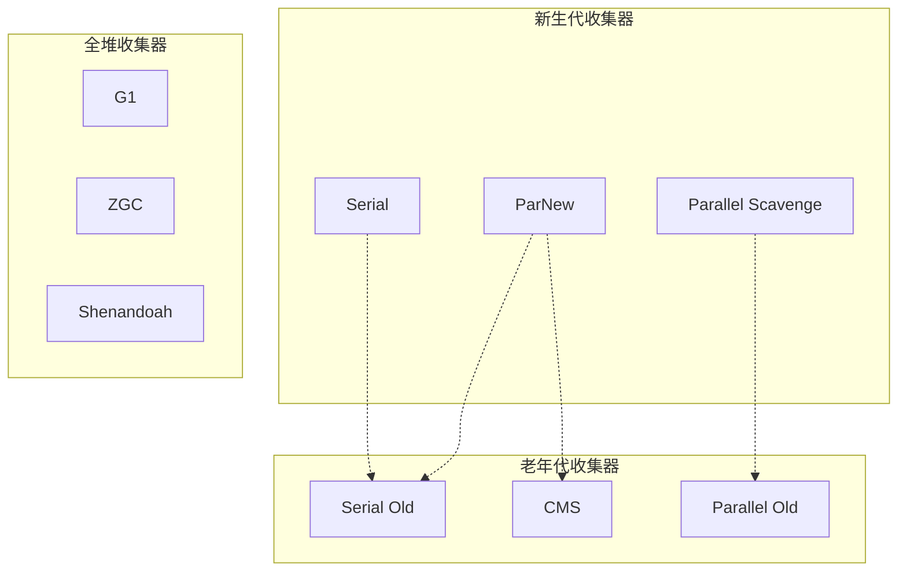

#### 2.4.1 Serial / Serial Old
- **特点**：单线程，STW（Stop The World）
- **适用**：客户端模式，单核CPU
- **参数**：`-XX:+UseSerialGC`

#### 2.4.2 ParNew
- **特点**：Serial的多线程版本
- **适用**：多核CPU，配合CMS使用
- **参数**：`-XX:+UseParNewGC`

#### 2.4.3 Parallel Scavenge / Parallel Old
- **特点**：吞吐量优先，自适应调节
- **目标**：控制吞吐量（运行代码时间 / 总时间）
- **参数**：
  - `-XX:+UseParallelGC`
  - `-XX:MaxGCPauseMillis`：最大停顿时间
  - `-XX:GCTimeRatio`：吞吐量大小

#### 2.4.4 CMS（Concurrent Mark Sweep）

**执行流程**：
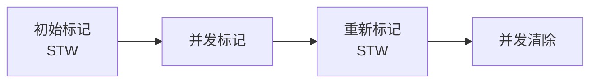

1. **初始标记**（STW）：标记GC Roots直接关联对象
2. **并发标记**：从GC Roots遍历整个对象图
3. **重新标记**（STW）：修正并发标记期间变动的对象
4. **并发清除**：清理垃圾对象

**优点**：
- 并发收集，停顿时间短

**缺点**：
- CPU资源敏感
- 无法处理浮动垃圾
- 产生内存碎片
- 可能出现"Concurrent Mode Failure"

**参数**：
```bash
-XX:+UseConcMarkSweepGC                # 启用CMS
-XX:CMSInitiatingOccupancyFraction=70  # 老年代使用70%时触发
-XX:+UseCMSCompactAtFullCollection     # Full GC时整理碎片
```

#### 2.4.5 G1（Garbage First）

**内存布局**：
```
+-----+-----+-----+-----+-----+-----+
| E   | E   | S   | O   | O   | H   |  Region (1-32MB)
+-----+-----+-----+-----+-----+-----+
E=Eden, S=Survivor, O=Old, H=Humongous
```

**特点**：
- 面向服务端，低延迟
- 分Region的堆内存布局
- 可预测的停顿时间模型
- 按收益优先回收

**执行流程**：
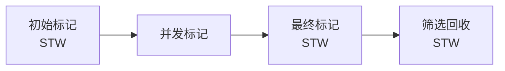

**参数**：
```bash
-XX:+UseG1GC                      # 启用G1
-XX:MaxGCPauseMillis=200         # 期望停顿时间
-XX:G1HeapRegionSize=16m         # Region大小
-XX:InitiatingHeapOccupancyPercent=45  # 启动并发GC的堆占用阈值
```

**优势**：
1. 可预测的停顿时间
2. 不产生内存碎片
3. 可以指定最大停顿时间

#### 2.4.6 ZGC（Z Garbage Collector）

**特点**：
- 低延迟（停顿时间<10ms）
- TB级堆内存支持
- 并发标记、并发转移
- 使用读屏障（Load Barrier）和染色指针（Colored Pointers）

**染色指针**：
```
64位指针布局:
+--------+-------+-------+-------+------------------+
| Unused | M0    | M1    | Remapped | Object Offset |
|  16bit | 1bit  | 1bit  |  1bit    |    45bit      |
+--------+-------+-------+-------+------------------+
```

**参数**：
```bash
-XX:+UseZGC
-XX:ZCollectionInterval=120  # GC间隔
-Xmx16g                      # 最大堆内存
```

**适用场景**：
- 大内存应用
- 低延迟要求
- Java 15+

#### 2.4.7 Shenandoah（OpenJDK独有）

**特点**：
- 与ZGC类似的超低延迟GC
- 使用转发指针（Forwarding Pointer）
- 并发整理，减少停顿时间
- Red Hat主导开发，OpenJDK独有（Oracle JDK不包含）

**核心技术**：
- **Brooks Pointer**：每个对象都有一个额外的转发指针
- **读写屏障**：在对象访问时插入屏障代码
- **并发整理**：与应用线程并发移动对象

**执行阶段**：
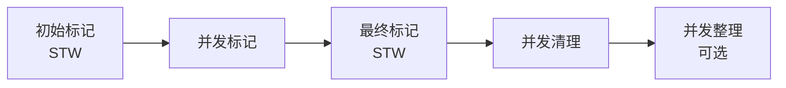

**与ZGC对比**：

| 特性 | ZGC | Shenandoah |
|------|-----|-----------|
| 实现方式 | 染色指针 + 读屏障 | 转发指针 + 读写屏障 |
| 内存开销 | 较低 | 稍高（额外指针） |
| 吞吐量 | 较高 | 稍低 |
| 停顿时间 | <10ms | <10ms |
| 堆大小支持 | TB级 | GB-TB级 |
| JDK支持 | Oracle/OpenJDK | 仅OpenJDK |
| 成熟度 | JDK 15+生产可用 | JDK 12+实验，15+生产可用 |

**参数**：
```bash
-XX:+UseShenandoahGC                    # 启用Shenandoah
-XX:ShenandoahGCHeuristics=adaptive     # GC启发式策略
-XX:ShenandoahMinFreeThreshold=10       # 最小空闲阈值
-XX:ShenandoahGuaranteedGCInterval=300000  # GC间隔（ms）
```

**适用场景**：
- 需要低延迟的大堆应用
- 使用OpenJDK的场景
- 对吞吐量要求不是特别高的应用

**注意**：
- Oracle JDK不包含Shenandoah
- 需要OpenJDK 12+才支持
- 生产环境建议使用OpenJDK 15+

### 2.5 GC日志分析

#### 2.5.1 开启GC日志
```bash
# JDK 8
-XX:+PrintGCDetails 
-XX:+PrintGCDateStamps 
-Xloggc:gc.log

# JDK 9+
-Xlog:gc*:file=gc.log:time,uptime,level,tags
```

#### 2.5.2 GC日志示例
```
2024-10-22T10:30:45.123+0800: 1.234: [GC (Allocation Failure) 
    [PSYoungGen: 65536K->8192K(76288K)] 
    65536K->16384K(251392K), 0.0123456 secs] 
    [Times: user=0.04 sys=0.01, real=0.01 secs]
```

解读：
- `PSYoungGen`：新生代收集器
- `65536K->8192K(76288K)`：新生代 回收前->回收后（总大小）
- `65536K->16384K(251392K)`：堆 回收前->回收后（总大小）
- `user/sys/real`：用户态/内核态/实际时间

## 三、JIT编译优化深度分析

### 3.1 JIT编译器架构设计

#### 3.1.1 分层编译架构深度实现

**分层编译的数学建模**：
```java
public class TieredCompilationModel {
    // 编译成本模型
    private static final double INTERPRETER_COST = 1.0;
    private static final double C1_COST = 0.1;
    private static final double C2_COST = 0.05;
    
    // 编译收益模型
    private static final double INTERPRETER_SPEED = 1.0;
    private static final double C1_SPEED = 2.0;
    private static final double C2_SPEED = 5.0;
    
    public double calculateCompilationBenefit(int invocationCount, int tier) {
        double compilationCost = getCompilationCost(tier);
        double executionSpeed = getExecutionSpeed(tier);
        double totalCost = compilationCost + (invocationCount / executionSpeed);
        
        return totalCost;
    }
    
    private double getCompilationCost(int tier) {
        switch (tier) {
            case 1: return C1_COST;
            case 2: return C2_COST;
            default: return 0;
        }
    }
    
    private double getExecutionSpeed(int tier) {
        switch (tier) {
            case 0: return INTERPRETER_SPEED;
            case 1: return C1_SPEED;
            case 2: return C2_SPEED;
            default: return INTERPRETER_SPEED;
        }
    }
}
```

**自适应编译阈值调整**：
```java
public class AdaptiveCompilationThreshold {
    private static final int INITIAL_C1_THRESHOLD = 1500;
    private static final int INITIAL_C2_THRESHOLD = 10000;
    
    private volatile int c1Threshold = INITIAL_C1_THRESHOLD;
    private volatile int c2Threshold = INITIAL_C2_THRESHOLD;
    
    public void adjustThresholds(double compilationRatio, double executionRatio) {
        // 根据编译比例调整阈值
        if (compilationRatio > 0.1) {
            // 编译过多，提高阈值
            c1Threshold = (int) (c1Threshold * 1.2);
            c2Threshold = (int) (c2Threshold * 1.2);
        } else if (compilationRatio < 0.05) {
            // 编译过少，降低阈值
            c1Threshold = (int) (c1Threshold * 0.8);
            c2Threshold = (int) (c2Threshold * 0.8);
        }
        
        // 根据执行比例调整
        if (executionRatio > 0.8) {
            // 执行时间过长，降低阈值
            c1Threshold = (int) (c1Threshold * 0.9);
            c2Threshold = (int) (c2Threshold * 0.9);
        }
    }
}
```

**现代JIT编译器架构**：
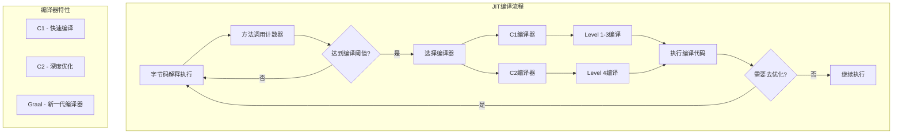

#### 3.1.2 C1编译器深度实现

**C1编译器的优化策略**：
```java
public class C1Compiler {
    private final Map<String, CompilationUnit> compilationCache = new ConcurrentHashMap<>();
    
    public CompilationResult compile(Method method, int invocationCount) {
        // 1. 方法内联优化
        InlineOptimization inlineOpt = new InlineOptimization();
        List<Method> inlinedMethods = inlineOpt.analyzeInlineCandidates(method);
        
        // 2. 循环优化
        LoopOptimization loopOpt = new LoopOptimization();
        List<Loop> optimizedLoops = loopOpt.optimizeLoops(method);
        
        // 3. 寄存器分配
        RegisterAllocation regAlloc = new RegisterAllocation();
        Map<Variable, Register> registerMap = regAlloc.allocateRegisters(method);
        
        // 4. 指令选择
        InstructionSelection instrSel = new InstructionSelection();
        List<Instruction> instructions = instrSel.selectInstructions(method);
        
        return new CompilationResult(instructions, registerMap, inlinedMethods);
    }
}
```

**方法内联的深度分析**：
```java
public class InlineOptimization {
    private static final int MAX_INLINE_SIZE = 35; // 字节码指令数
    private static final int MAX_INLINE_DEPTH = 9;
    
    public boolean shouldInline(Method caller, Method callee, int depth) {
        // 1. 大小检查
        if (callee.getBytecodeSize() > MAX_INLINE_SIZE) {
            return false;
        }
        
        // 2. 深度检查
        if (depth > MAX_INLINE_DEPTH) {
            return false;
        }
        
        // 3. 热点检查
        if (callee.getInvocationCount() < 100) {
            return false;
        }
        
        // 4. 类型检查
        if (!isTypeCompatible(caller, callee)) {
            return false;
        }
        
        // 5. 异常处理检查
        if (hasComplexExceptionHandling(callee)) {
            return false;
        }
        
        return true;
    }
    
    // 内联收益计算
    public double calculateInlineBenefit(Method caller, Method callee) {
        double callOverhead = 10.0; // 方法调用开销
        double inlineCost = callee.getBytecodeSize() * 0.1; // 内联成本
        
        return callOverhead - inlineCost;
    }
}
```

**C1编译器的特点**：
- 编译速度快（毫秒级）
- 优化程度适中
- 适合启动阶段和热点不明显的代码

**C1优化技术**：
```java
// 1. 方法内联优化
public class InlineOptimization {
    public int calculate(int a, int b) {
        return add(a, b);  // 小方法会被内联
    }
    
    private int add(int a, int b) {
        return a + b;  // 内联后直接变成: return a + b;
    }
}

// 2. 常量折叠
public class ConstantFolding {
    public int getValue() {
        return 2 + 3;  // 编译时计算为: return 5;
    }
}

// 3. 死代码消除
public class DeadCodeElimination {
    public void method() {
        if (false) {  // 死代码，会被消除
            System.out.println("Never executed");
        }
        System.out.println("Always executed");
    }
}
```

**C1编译层级**：
- **Level 1**：无profiling，基础优化
- **Level 2**：简单profiling（方法调用计数）
- **Level 3**：完整profiling（分支预测、类型信息）

#### 3.1.3 C2编译器深度分析

**C2编译器特点**：
- 编译速度慢（秒级）
- 深度优化，性能提升显著
- 适合长时间运行的热点代码

**C2高级优化技术**：

1. **逃逸分析（Escape Analysis）**：
```java
public class EscapeAnalysis {
    public void process() {
        // 对象不逃逸，可以进行标量替换
        Point p = new Point(1, 2);
        int sum = p.x + p.y;  // 优化为: int sum = 1 + 2;
    }
    
    // 逃逸分析结果
    // 1. 不逃逸：对象只在本方法内使用
    // 2. 方法逃逸：对象作为返回值或参数传递
    // 3. 线程逃逸：对象被其他线程访问
}

// 标量替换优化
public class ScalarReplacement {
    public int calculate() {
        // 原始代码
        Point p = new Point(10, 20);
        return p.x * p.y;
        
        // 优化后（标量替换）
        int x = 10;
        int y = 20;
        return x * y;  // 避免对象分配
    }
}
```

2. **锁消除（Lock Elimination）**：
```java
public class LockElimination {
    public String concat(String s1, String s2) {
        // StringBuffer有同步方法，但局部对象无竞争
        StringBuffer sb = new StringBuffer();
        sb.append(s1);  // 同步操作会被消除
        sb.append(s2);
        return sb.toString();
    }
    
    // 优化后等价于：
    public String concatOptimized(String s1, String s2) {
        StringBuilder sb = new StringBuilder();  // 无同步
        sb.append(s1);
        sb.append(s2);
        return sb.toString();
    }
}
```

3. **循环优化**：
```java
public class LoopOptimization {
    // 循环展开
    public int sumArray(int[] arr) {
        int sum = 0;
        for (int i = 0; i < arr.length; i++) {
            sum += arr[i];
        }
        return sum;
        
        // 优化后（循环展开）
        // 编译器可能展开为：
        // for (int i = 0; i < arr.length; i += 4) {
        //     sum += arr[i] + arr[i+1] + arr[i+2] + arr[i+3];
        // }
    }
}
```

#### 3.1.4 Graal编译器

**Graal编译器特点**：
- 新一代JIT编译器
- 支持多语言（Java、JavaScript、Python等）
- 更激进的优化策略

**Graal优化示例**：
```java
// 1. 更激进的内联
public class GraalInline {
    public int deepCall(int n) {
        return level1(n);
    }
    
    private int level1(int n) { return level2(n); }
    private int level2(int n) { return level3(n); }
    private int level3(int n) { return n * 2; }
    
    // Graal可能将整个调用链内联为：
    // return n * 2;
}

// 2. 向量化优化
public class Vectorization {
    public void vectorAdd(float[] a, float[] b, float[] c) {
        for (int i = 0; i < a.length; i++) {
            c[i] = a[i] + b[i];  // 可能向量化为SIMD指令
        }
    }
}
```

### 3.2 编译优化参数深度解析

#### 3.2.1 编译阈值调优

**编译阈值参数**：
```bash
# C2编译阈值（默认10000）
-XX:CompileThreshold=10000

# C1各层级阈值
-XX:Tier3CompileThreshold=2000    # Level 3阈值
-XX:Tier4CompileThreshold=15000   # Level 4阈值

# 分层编译控制
-XX:+TieredCompilation             # 启用分层编译（默认）
-XX:TieredStopAtLevel=1           # 只使用C1编译
-XX:TieredStopAtLevel=4           # 使用C2编译
```

**阈值调优策略**：
```java
// 1. 降低阈值，提前编译热点方法
-XX:CompileThreshold=5000

// 2. 针对不同场景调整
// 启动敏感应用：提高阈值，减少启动时编译
-XX:CompileThreshold=20000

// 长时间运行应用：降低阈值，提前优化
-XX:CompileThreshold=3000
```

#### 3.2.2 内联优化参数

**内联相关参数**：
```bash
# 基础内联参数
-XX:MaxInlineSize=35              # 最大内联方法字节码大小
-XX:FreqInlineSize=325            # 热点方法内联大小限制
-XX:InlineSmallCode=2000          # 小方法内联代码大小限制

# 内联深度控制
-XX:MaxInlineLevel=9              # 最大内联深度
-XX:MaxRecursiveInlineLevel=1     # 递归内联深度

# 内联策略
-XX:+AggressiveOpts               # 激进优化（包含内联优化）
-XX:+UseLargePages                # 大页内存，提升内联性能
```

**内联优化示例**：
```java
public class InlineExample {
    // 小方法，会被内联
    private int add(int a, int b) {
        return a + b;  // 字节码 < 35字节
    }
    
    // 热点方法，即使较大也会内联
    public int calculate(int[] arr) {
        int sum = 0;
        for (int i = 0; i < arr.length; i++) {
            sum += add(arr[i], i);  // add方法会被内联
        }
        return sum;
    }
}
```

#### 3.2.3 逃逸分析参数

**逃逸分析相关**：
```bash
# 逃逸分析开关
-XX:+DoEscapeAnalysis             # 启用逃逸分析（默认开启）
-XX:+EliminateAllocations         # 标量替换（默认开启）
-XX:+EliminateLocks               # 锁消除（默认开启）

# 逃逸分析调优
-XX:EliminateAllocationsArraySizeLimit=64  # 数组标量替换大小限制
-XX:+PrintEscapeAnalysis          # 打印逃逸分析信息
```

### 3.3 编译性能监控

#### 3.3.1 编译信息查看

**查看编译信息**：
```bash
# 基础编译信息
-XX:+PrintCompilation

# 详细编译日志
-XX:+UnlockDiagnosticVMOptions
-XX:+LogCompilation
-XX:LogFile=compilation.log

# 编译统计
-XX:+PrintCompilation
-XX:+PrintInlining
-XX:+PrintCodeCache
```

**编译日志解读**：
```
100   1       3       java.lang.String::hashCode (55 bytes)
│     │       │       └─ 方法名（字节码大小）
│     │       └─ 编译层级（1-4）
│     └─ 编译ID
└─ 时间戳（ms）

# 内联信息
@ 1   java.lang.String::hashCode (55 bytes)   inline (hot)
│     │                                        └─ 内联原因
│     └─ 被内联的方法
└─ 内联层级
```

#### 3.3.2 编译性能分析

**编译性能指标**：
```bash
# 1. 编译时间统计
jstat -printcompilation <pid> 1000

# 2. 代码缓存使用情况
jstat -gc <pid> 1000  # 查看CC列（Code Cache）

# 3. 编译队列长度
-XX:+PrintCompilation
-XX:+PrintCodeCacheOnCompilation
```

**性能调优建议**：
```bash
# 1. 增大代码缓存
-XX:ReservedCodeCacheSize=256m
-XX:InitialCodeCacheSize=64m

# 2. 优化编译策略
-XX:+UseCodeCacheFlushing        # 代码缓存刷新
-XX:CodeCacheExpansionSize=32k   # 代码缓存扩展大小

# 3. 针对不同场景
# 启动优化
-XX:+TieredCompilation
-XX:TieredStopAtLevel=1

# 运行优化  
-XX:+AggressiveOpts
-XX:+UseBiasedLocking
```

### 3.4 高级编译优化技术

#### 3.4.1 向量化优化

**SIMD指令优化**：
```java
public class Vectorization {
    // 向量加法优化
    public void vectorAdd(float[] a, float[] b, float[] c) {
        for (int i = 0; i < a.length; i++) {
            c[i] = a[i] + b[i];  // 可能编译为SIMD指令
        }
    }
    
    // 向量乘法优化
    public void vectorMul(double[] a, double[] b, double[] c) {
        for (int i = 0; i < a.length; i++) {
            c[i] = a[i] * b[i];  // 利用AVX指令集
        }
    }
}
```

**向量化参数**：
```bash
# 启用向量化
-XX:+UseVectorizedMarshalling
-XX:+UseSIMDForArrayOperations

# 向量化大小控制
-XX:MaxVectorSize=256
-XX:MinVectorSize=4
```

#### 3.4.2 循环优化

**循环优化技术**：
```java
public class LoopOptimization {
    // 1. 循环展开
    public int sum(int[] arr) {
        int sum = 0;
        for (int i = 0; i < arr.length; i++) {
            sum += arr[i];
        }
        return sum;
        // 编译器可能展开为：
        // for (int i = 0; i < arr.length; i += 4) {
        //     sum += arr[i] + arr[i+1] + arr[i+2] + arr[i+3];
        // }
    }
    
    // 2. 循环不变式外提
    public void process(int[] arr, int factor) {
        for (int i = 0; i < arr.length; i++) {
            int result = arr[i] * factor;  // factor在循环外计算
            // 处理result
        }
    }
    
    // 3. 循环融合
    public void fusedLoops(int[] a, int[] b, int[] c) {
        // 原始代码
        for (int i = 0; i < a.length; i++) {
            a[i] = a[i] * 2;
        }
        for (int i = 0; i < b.length; i++) {
            b[i] = b[i] + 1;
        }
        
        // 优化后（循环融合）
        for (int i = 0; i < a.length; i++) {
            a[i] = a[i] * 2;
            b[i] = b[i] + 1;
        }
    }
}
```

#### 3.4.3 分支预测优化

**分支预测优化**：
```java
public class BranchPrediction {
    // 1. 分支预测友好的代码
    public int process(int[] data) {
        int sum = 0;
        // 将常见情况放在前面
        for (int i = 0; i < data.length; i++) {
            if (data[i] > 0) {  // 常见分支
                sum += data[i];
            } else {  // 少见分支
                sum -= Math.abs(data[i]);
            }
        }
        return sum;
    }
    
    // 2. 避免分支的优化
    public int max(int a, int b) {
        // 原始分支代码
        // return a > b ? a : b;
        
        // 无分支优化
        return a - ((a - b) & ((a - b) >> 31));
    }
}
```

### 3.5 编译优化实战案例

#### 3.5.1 热点方法识别与优化

**热点方法识别**：
```bash
# 1. 查看方法调用统计
-XX:+PrintCompilation
-XX:+PrintInlining

# 2. 使用JFR分析热点
-XX:+FlightRecorder
-XX:StartFlightRecording=duration=60s,filename=hotspots.jfr
```

**优化案例**：
```java
// 问题代码：频繁创建对象
public class StringProcessor {
    public String process(String input) {
        String result = "";
        for (int i = 0; i < input.length(); i++) {
            result += input.charAt(i);  // 每次循环创建新String
        }
        return result;
    }
}

// 优化后：使用StringBuilder
public class OptimizedStringProcessor {
    public String process(String input) {
        StringBuilder result = new StringBuilder(input.length());
        for (int i = 0; i < input.length(); i++) {
            result.append(input.charAt(i));
        }
        return result.toString();
    }
}
```

#### 3.5.2 编译去优化处理

**去优化场景**：
```java
public class Deoptimization {
    private Object obj;
    
    public void method() {
        // 1. 类型假设失效
        if (obj instanceof String) {
            String str = (String) obj;  // 假设obj总是String
            System.out.println(str.length());
        }
        
        // 2. 分支预测失效
        for (int i = 0; i < 1000000; i++) {
            if (Math.random() > 0.5) {  // 随机分支，预测失效
                // 处理逻辑
            }
        }
    }
}
```

**去优化监控**：
```bash
# 查看去优化信息
-XX:+PrintCompilation
-XX:+PrintDeoptimization

# 输出示例：
# 1000   1       3       com.example.MyClass::method (45 bytes)   made not entrant
# 1001   1       4       com.example.MyClass::method (45 bytes)   made zombie
```

## 四、JVM源码分析与实现细节

### 4.1 HotSpot VM架构深度解析

#### 3.1.0 JVM参数类型说明

**标准参数（-）**：
- 所有JVM都支持，稳定不变
- 例如：`-version`、`-classpath`、`-jar`

**非标准参数（-X）**：
- 不同JVM实现可能不同
- 例如：`-Xms`、`-Xmx`、`-Xss`
- 较为稳定，广泛使用

**不稳定参数（-XX）**：
- 随JVM版本可能改变
- 用于调优和调试
- 例如：`-XX:+UseG1GC`、`-XX:MaxGCPauseMillis=200`

**参数格式**：
```bash
-XX:+<option>     # 启用布尔选项
-XX:-<option>     # 禁用布尔选项
-XX:<option>=<value>  # 设置参数值
```

**查看所有参数**：
```bash
# 查看所有可设置的参数及其默认值
java -XX:+PrintFlagsFinal -version | grep GC

# 查看当前生效的JVM参数
java -XX:+PrintCommandLineFlags -version

# 查看某个进程的JVM参数
jinfo -flags <pid>
```

#### 3.1.1 内存参数
```bash
-Xms4g                    # 初始堆大小
-Xmx4g                    # 最大堆大小 (建议与Xms相同)
-Xmn2g                    # 新生代大小
-Xss256k                  # 线程栈大小
-XX:MetaspaceSize=256m    # 元空间初始大小
-XX:MaxMetaspaceSize=512m # 元空间最大大小
-XX:MaxDirectMemorySize=1g # 直接内存最大值
```

#### 3.1.2 GC参数
```bash
-XX:+UseG1GC              # 使用G1收集器
-XX:MaxGCPauseMillis=200  # 最大停顿时间
-XX:ParallelGCThreads=8   # 并行GC线程数
-XX:ConcGCThreads=2       # 并发GC线程数
-XX:SurvivorRatio=8       # Eden:Survivor = 8:1
-XX:MaxTenuringThreshold=15 # 晋升老年代的年龄阈值
```

#### 3.1.3 诊断参数
```bash
-XX:+HeapDumpOnOutOfMemoryError      # OOM时dump堆
-XX:HeapDumpPath=/path/to/dump       # dump文件路径
-XX:+PrintGCDetails                   # 打印GC详情
-XX:+PrintGCDateStamps               # 打印GC时间戳
-XX:+PrintTenuringDistribution       # 打印对象年龄分布
```

### 3.2 调优实践

#### 3.2.1 调优目标
1. **低延迟**：减少GC停顿时间
2. **高吞吐**：提高应用运行时间占比
3. **低内存占用**：减少堆内存使用

#### 3.2.2 调优步骤

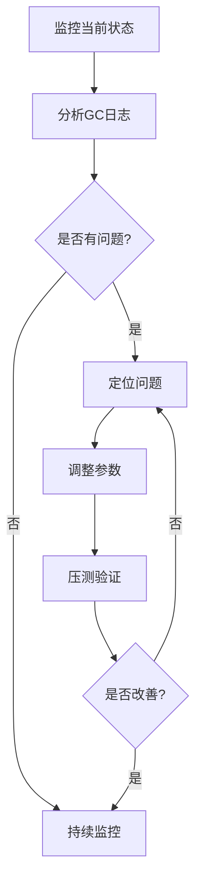

#### 3.2.3 常见问题及解决方案

**问题1：频繁Young GC**
- **现象**：Young GC频率过高
- **原因**：新生代过小，对象创建速度快
- **解决**：
  - 增大新生代：`-Xmn`
  - 检查代码是否创建大量临时对象
  - 使用对象池

**问题2：频繁Full GC**
- **现象**：Full GC频率高，每次回收效果不明显
- **原因**：
  1. 老年代空间不足
  2. 元空间不足
  3. 内存泄漏
- **解决**：
  - 增大老年代
  - 检查是否有内存泄漏
  - 调整晋升阈值

**问题3：GC停顿时间长**
- **原因**：堆内存过大，单次GC扫描对象多
- **解决**：
  - 使用低延迟GC（G1、ZGC）
  - 减小堆内存
  - 调整并发GC线程数

**问题4：内存溢出OOM**
- **类型**：
  1. `java.lang.OutOfMemoryError: Java heap space`
  2. `java.lang.OutOfMemoryError: Metaspace`
  3. `java.lang.OutOfMemoryError: Direct buffer memory`
  4. `java.lang.OutOfMemoryError: unable to create new native thread`
  
- **排查**：
  ```bash
  # 1. dump堆快照
  jmap -dump:format=b,file=heap.hprof <pid>
  
  # 2. 使用MAT分析
  # 查找内存泄漏、大对象
  ```

### 3.3 JIT编译优化

#### 3.3.1 编译器类型

**C1（Client编译器）**：
- 编译速度快，优化程度低
- 适合桌面应用和启动性能敏感的应用
- 优化策略：方法内联、常量折叠、消除死代码

**C2（Server编译器）**：
- 编译速度慢，优化程度高
- 适合服务端长时间运行的应用
- 优化策略：逃逸分析、标量替换、锁消除、激进的内联

**分层编译**（Tiered Compilation，JDK 8+ 默认启用）：
```bash
-XX:+TieredCompilation  # 启用分层编译（默认开启）
-XX:TieredStopAtLevel=1 # 只使用C1编译
```

**5个编译层级**：
- **Level 0**：解释执行
- **Level 1**：C1编译，无profiling
- **Level 2**：C1编译，有简单profiling（方法和回边计数）
- **Level 3**：C1编译，有完整profiling
- **Level 4**：C2编译（最高级优化）

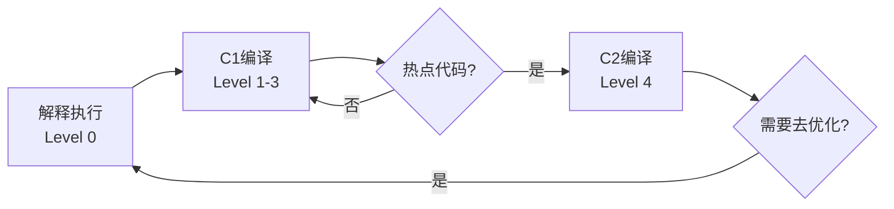

#### 3.3.2 常见优化技术

**1. 方法内联**（Inlining）
```java
// 优化前
public int add(int a, int b) {
    return a + b;
}
public int calculate() {
    return add(1, 2);
}

// 优化后（内联）
public int calculate() {
    return 1 + 2;  // 进一步优化为: return 3;
}
```
- 小方法（<35字节）会被内联
- 参数：`-XX:MaxInlineSize=35`

**2. 逃逸分析**（Escape Analysis）
```java
public void test() {
    User user = new User();  // 对象不逃逸（未返回，未被其他线程访问）
    String name = user.getName();
}
```
- 分析对象作用域是否逃逸方法或线程
- 参数：`-XX:+DoEscapeAnalysis`（默认开启）

**3. 标量替换**（Scalar Replacement）
```java
// 优化前
public void test() {
    Point p = new Point(1, 2);  // 创建对象
    int sum = p.x + p.y;
}

// 优化后（标量替换）
public void test() {
    int x = 1;  // 直接使用基本类型
    int y = 2;
    int sum = x + y;
}
```
- 将对象拆分为基本类型
- 减少堆分配和GC压力
- 参数：`-XX:+EliminateAllocations`

**4. 栈上分配**（Stack Allocation）
- 不逃逸的对象直接在栈上分配
- 方法结束自动回收，无需GC
- 注意：HotSpot并未直接实现，通过标量替换间接实现

**5. 锁消除**（Lock Elimination）
```java
public String concat(String s1, String s2) {
    StringBuffer sb = new StringBuffer();  // 局部对象，无竞争
    sb.append(s1);  // 虽然有同步，但会被消除
    sb.append(s2);
    return sb.toString();
}
```
- 消除不必要的同步操作
- 参数：`-XX:+EliminateLocks`

**6. 锁粗化**（Lock Coarsening）
```java
// 优化前
for (int i = 0; i < 100; i++) {
    synchronized(obj) {
        // 操作
    }
}

// 优化后
synchronized(obj) {
    for (int i = 0; i < 100; i++) {
        // 操作
    }
}
```

#### 3.3.3 JIT相关参数

```bash
# 查看编译信息
-XX:+PrintCompilation            # 打印JIT编译信息
-XX:+UnlockDiagnosticVMOptions
-XX:+LogCompilation              # 输出详细编译日志

# 编译阈值
-XX:CompileThreshold=10000       # C2编译阈值（默认10000）
-XX:Tier3CompileThreshold=2000   # C1 Level 3编译阈值

# 内联相关
-XX:MaxInlineSize=35             # 最大内联方法字节码大小
-XX:FreqInlineSize=325           # 热点方法内联大小

# 优化开关
-XX:+DoEscapeAnalysis            # 逃逸分析（默认开启）
-XX:+EliminateAllocations        # 标量替换（默认开启）
-XX:+EliminateLocks              # 锁消除（默认开启）
```

**查看JIT编译日志**：
```bash
java -XX:+PrintCompilation -jar app.jar

# 输出示例：
# 100   1       3       java.lang.String::hashCode (55 bytes)
# │     │       │       └─ 方法名（字节码大小）
# │     │       └─ 编译层级
# │     └─ 编译ID
# └─ 时间戳（ms）
```

### 3.4 性能监控工具

#### 3.4.1 命令行工具

**jps - 查看Java进程**
```bash
jps -lv
```

**jstat - GC统计**
```bash
jstat -gcutil <pid> 1000  # 每秒输出GC情况
jstat -gccause <pid>      # 查看GC原因
```

输出示例：
```
  S0     S1     E      O      M     CCS    YGC     YGCT    FGC    FGCT     GCT   
  0.00  25.12  55.32  45.23  92.11  89.45   156    1.234     2    0.456   1.690
```

**列说明**：
- `S0/S1`：Survivor 0/1 区使用率（%）
- `E`：Eden区使用率（%）
- `O`：老年代使用率（%）
- `M`：Metaspace使用率（%）
- `CCS`：压缩类空间使用率（%）
- `YGC`：Young GC次数
- `YGCT`：Young GC总耗时（秒）
- `FGC`：Full GC次数
- `FGCT`：Full GC总耗时（秒）
- `GCT`：GC总耗时（秒）

**jmap - 堆内存分析**
```bash
jmap -heap <pid>           # 查看堆配置和使用情况
jmap -histo <pid>          # 查看对象统计
jmap -dump:format=b,file=heap.hprof <pid>  # dump堆
```

**jstack - 线程堆栈**
```bash
jstack <pid>               # 打印线程堆栈
jstack -l <pid>            # 打印锁信息
```

**jinfo - 查看和修改JVM参数**
```bash
jinfo -flags <pid>         # 查看JVM参数
jinfo -flag +PrintGC <pid> # 动态开启GC日志
```

#### 3.4.2 可视化工具

**JConsole**
- 实时监控CPU、内存、线程、类加载
- 查看MBean信息

**VisualVM**
- 更强大的监控工具
- 支持插件（BTrace、GC分析等）
- 可以进行采样和性能分析

**Arthas**（阿里开源）
```bash
# 启动Arthas
java -jar arthas-boot.jar

# 常用命令
dashboard          # 仪表盘
thread -n 3        # 查看最忙的3个线程
jad com.example.MyClass  # 反编译
watch com.example.MyClass method  # 观察方法
trace com.example.MyClass method  # 追踪方法调用
```

**MAT（Memory Analyzer Tool）**
- 分析堆dump文件
- 查找内存泄漏
- 生成泄漏报告

## 四、故障排查

### 4.1 CPU使用率高

**排查步骤**：
```bash
# 1. 找到CPU占用高的Java进程
top

# 2. 找到进程中CPU占用高的线程
top -Hp <pid>

# 3. 线程ID转16进制
printf "%x\n" <thread_id>

# 4. 查看线程堆栈
jstack <pid> | grep <hex_thread_id> -A 50
```

**常见原因**：
1. 死循环
2. 频繁GC
3. 大量线程上下文切换

### 4.2 内存泄漏

**定位方法**：
```bash
# 1. 多次dump堆快照
jmap -dump:format=b,file=heap1.hprof <pid>
# 等待一段时间
jmap -dump:format=b,file=heap2.hprof <pid>

# 2. 使用MAT对比分析
# 查找持续增长的对象
```

**常见场景**：
1. 静态集合类持有对象引用
2. 监听器未移除
3. 数据库连接、IO流未关闭
4. ThreadLocal未清理

**代码示例**：
```java
// 错误示例：ThreadLocal内存泄漏
public class ThreadLocalLeak {
    private static ThreadLocal<LargeObject> threadLocal = new ThreadLocal<>();
    
    public void process() {
        threadLocal.set(new LargeObject());
        // 忘记remove，线程池场景下会导致内存泄漏
    }
}

// 正确示例
public class ThreadLocalCorrect {
    private static ThreadLocal<LargeObject> threadLocal = new ThreadLocal<>();
    
    public void process() {
        try {
            threadLocal.set(new LargeObject());
            // 业务逻辑
        } finally {
            threadLocal.remove();  // 及时清理
        }
    }
}
```

### 4.3 死锁

**检测**：
```bash
jstack <pid> | grep -A 10 "Found.*deadlock"
```

**示例**：
```
Found one Java-level deadlock:
=============================
"Thread-1":
  waiting to lock monitor 0x00007f8a4c004e00 (object 0x00000000d5f78a10, a java.lang.Object),
  which is held by "Thread-0"
"Thread-0":
  waiting to lock monitor 0x00007f8a4c007350 (object 0x00000000d5f78a20, a java.lang.Object),
  which is held by "Thread-1"
```

**预防**：
1. 避免嵌套锁
2. 按顺序获取锁
3. 使用tryLock超时
4. 使用并发工具类

### 4.4 GC问题排查

**步骤**：
```bash
# 1. 开启GC日志
-Xlog:gc*:file=gc.log:time,uptime,level,tags

# 2. 分析GC日志
# 使用GCEasy、GCViewer等工具

# 3. 查看堆内存使用
jmap -heap <pid>

# 4. 查看存活对象
jmap -histo:live <pid> | head -20
```

**关注指标**：
- GC频率
- 每次GC回收效果
- 停顿时间
- 堆内存使用趋势

### 4.5 故障排查速查表

#### 4.5.1 应用启动慢

**排查清单**：
- [ ] 检查类加载数量和耗时
  ```bash
  -XX:+TraceClassLoading
  -XX:+TraceClassLoadingPreorder
  ```
- [ ] 检查启动时的停顿时间
  ```bash
  -XX:+PrintGCApplicationStoppedTime
  ```
- [ ] 考虑使用AppCDS（应用类数据共享）
  ```bash
  # 1. 生成类列表
  java -Xshare:off -XX:DumpLoadedClassList=app.lst -jar app.jar
  # 2. 创建共享归档
  java -Xshare:dump -XX:SharedClassListFile=app.lst -XX:SharedArchiveFile=app.jsa
  # 3. 使用共享归档启动
  java -Xshare:on -XX:SharedArchiveFile=app.jsa -jar app.jar
  ```
- [ ] 检查是否有大量静态初始化
- [ ] 优化Spring等框架的组件扫描范围

#### 4.5.2 应用卡顿/响应慢

**排查清单**：
- [ ] 检查GC日志，是否频繁GC或停顿时间长
  ```bash
  jstat -gcutil <pid> 1000
  ```
- [ ] 检查是否有死锁
  ```bash
  jstack <pid> | grep -A 10 "Found.*deadlock"
  ```
- [ ] 检查CPU使用率，是否有线程占用过高
  ```bash
  top -Hp <pid>
  # 找到线程ID后转16进制
  printf "%x\n" <thread_id>
  jstack <pid> | grep <hex_id> -A 30
  ```
- [ ] 检查是否有锁竞争
  ```bash
  jstack <pid> | grep -i "waiting\|blocked" | wc -l
  ```
- [ ] 检查磁盘IO等待
  ```bash
  iostat -x 1
  ```
- [ ] 检查网络延迟
  ```bash
  netstat -antp | grep ESTABLISHED | wc -l
  ```

#### 4.5.3 内存持续增长

**排查清单**：
- [ ] 多次dump堆快照对比分析
  ```bash
  jmap -dump:format=b,file=heap1.hprof <pid>
  # 等待30分钟
  jmap -dump:format=b,file=heap2.hprof <pid>
  # 使用MAT对比
  ```
- [ ] 检查是否有内存泄漏（常见场景）：
  - [ ] 静态集合类持有对象引用
  - [ ] ThreadLocal未清理
  - [ ] 监听器未移除
  - [ ] 数据库连接/IO流未关闭
  - [ ] 定时器/线程未停止
  - [ ] 第三方缓存未设置过期
- [ ] 检查Metaspace是否持续增长
  ```bash
  jstat -gc <pid> 1000 | awk '{print $9}'  # 观察M列
  jmap -clstats <pid>  # 查看类加载统计
  ```
- [ ] 检查DirectByteBuffer使用
  ```bash
  # 通过JMX查看
  jconsole -> MBeans -> java.nio -> BufferPool -> direct
  ```

#### 4.5.4 OOM错误处理

**不同类型OOM的排查**：

- [ ] **java.lang.OutOfMemoryError: Java heap space**
  - 增大堆内存：`-Xmx`
  - dump堆分析内存泄漏
  - 优化代码，减少对象创建

- [ ] **java.lang.OutOfMemoryError: Metaspace**
  - 增大Metaspace：`-XX:MaxMetaspaceSize=512m`
  - 检查是否有类加载器泄漏
  - 排查动态代理、反射、Groovy等

- [ ] **java.lang.OutOfMemoryError: Direct buffer memory**
  - 增大直接内存：`-XX:MaxDirectMemorySize=2g`
  - 检查NIO、Netty使用
  - 确保ByteBuffer正确释放

- [ ] **java.lang.OutOfMemoryError: unable to create new native thread**
  - 减少线程数或使用线程池
  - 增大系统线程限制：`ulimit -u`
  - 减小线程栈大小：`-Xss256k`

#### 4.5.5 响应时间抖动

**排查清单**：
- [ ] 查看GC停顿时间分布
  ```bash
  # 分析GC日志，关注P99、P999
  ```
- [ ] 检查是否有锁竞争导致的等待
  ```bash
  jstack <pid> | grep "waiting for monitor entry" -c
  ```
- [ ] 查看系统资源波动
  - [ ] CPU使用率突增
  - [ ] 网络抖动
  - [ ] 磁盘IO突增
- [ ] 检查JIT编译去优化
  ```bash
  -XX:+PrintCompilation  # 查看是否有 "made not entrant"
  ```
- [ ] 检查安全点停顿
  ```bash
  -XX:+PrintSafepointStatistics
  -XX:PrintSafepointStatisticsCount=1
  ```

#### 4.5.6 频繁Full GC

**排查清单**：
- [ ] 老年代空间不足
  - 增大老年代：`-Xmx` 或调整 `-XX:NewRatio`
  - 检查是否有大对象频繁创建
  
- [ ] Metaspace不足
  - 增大Metaspace：`-XX:MaxMetaspaceSize`
  
- [ ] 显式调用System.gc()
  - 禁用：`-XX:+DisableExplicitGC`
  
- [ ] CMS相关
  - `promotion failed`：增大Survivor或老年代
  - `concurrent mode failure`：降低触发阈值或增大老年代
  
- [ ] 空间分配担保失败
  - 增大老年代空间

**快速诊断命令**：
```bash
# 一键查看JVM关键指标
jstat -gcutil <pid> && jmap -heap <pid> && jstack <pid> | grep -E "waiting|blocked" | wc -l
```

## 五、高频面试题

### 5.1 基础问题

**Q1：说说JVM内存模型？**

**核心原理**：
JVM内存模型是Java程序运行的基础架构，核心思想是"线程隔离+共享协作+自动管理"，通过精心设计的内存布局和访问控制机制，保证多线程程序的正确性和高效性。

数学上，JVM内存模型遵循happens-before关系，确保内存操作的可见性和有序性。对于任意两个操作A和B，如果A happens-before B，则A的结果对B可见，且A在B之前执行。

**内存区域详解**：

**1. 程序计数器（PC Register）**
- **作用**：记录当前线程执行的字节码指令地址
- **特点**：线程私有，唯一不会OOM的区域
- **实现**：CPU寄存器或内存中的一小块区域
- **源码位置**：`hotspot/src/share/vm/runtime/pcDesc.hpp`

**2. 虚拟机栈（VM Stack）**
- **作用**：存储局部变量表、操作数栈、动态链接、方法出口
- **特点**：线程私有，FILO结构，方法调用时创建栈帧
- **异常**：StackOverflowError（栈深度超限）、OutOfMemoryError（栈扩展失败）
- **调优参数**：`-Xss`设置栈大小，默认1MB

**3. 本地方法栈（Native Method Stack）**
- **作用**：为Native方法服务，类似虚拟机栈
- **特点**：线程私有，可能抛出相同异常
- **实现**：C/C++栈，JNI调用时使用

**4. 堆内存（Heap）**
- **作用**：存储对象实例和数组，GC主要区域
- **特点**：线程共享，分为新生代和老年代
- **新生代**：Eden + 2个Survivor区，比例8:1:1
- **老年代**：长期存活的对象
- **调优参数**：`-Xms`初始堆大小，`-Xmx`最大堆大小

**5. 方法区/元空间（Method Area/Metaspace）**
- **JDK8前**：方法区，存储类信息、常量、静态变量
- **JDK8后**：元空间，使用本地内存，无OOM风险
- **特点**：线程共享，类加载时分配
- **调优参数**：`-XX:MetaspaceSize`初始大小，`-XX:MaxMetaspaceSize`最大大小

**6. 直接内存（Direct Memory）**
- **作用**：NIO操作时使用，避免Java堆和Native堆间数据拷贝
- **特点**：不受GC管理，需要手动释放
- **调优参数**：`-XX:MaxDirectMemorySize`设置大小

**应用场景**：
1. **高并发系统**：合理设置栈大小，避免栈溢出
2. **大数据处理**：增大堆内存，优化GC策略
3. **微服务架构**：元空间调优，减少类加载开销
4. **NIO应用**：直接内存优化，提升I/O性能

**实战经验**：
在生产环境JVM调优中，我们遇到了多个内存相关的问题。

**问题1：栈溢出**
- **现象**：应用频繁出现StackOverflowError
- **分析**：递归调用过深，栈深度不足
- **解决**：增加栈大小`-Xss2m`，优化递归算法
- **效果**：栈溢出问题完全解决

**问题2：堆内存不足**
- **现象**：频繁Full GC，应用响应缓慢
- **分析**：堆内存设置过小，对象创建频繁
- **解决**：调整堆大小`-Xms4g -Xmx8g`，优化对象创建
- **效果**：Full GC频率降低80%

**问题3：元空间OOM**
- **现象**：JDK8应用出现Metaspace OOM
- **分析**：动态类生成过多，元空间不足
- **解决**：增加元空间大小`-XX:MaxMetaspaceSize=512m`
- **效果**：元空间OOM问题解决

**权衡取舍**：
| 内存区域 | 大小设置 | 性能影响 | 稳定性 | 调优难度 |
|----------|----------|----------|--------|----------|
| **栈内存** | 过小 | 栈溢出 | 低 | 低 |
| **栈内存** | 过大 | 线程数减少 | 高 | 低 |
| **堆内存** | 过小 | 频繁GC | 低 | 中 |
| **堆内存** | 过大 | GC时间长 | 高 | 高 |
| **元空间** | 过小 | OOM风险 | 低 | 低 |
| **元空间** | 过大 | 内存浪费 | 高 | 低 |

**常见追问**：
1. 追问：如何确定合适的堆内存大小？→ 回答：通过监控工具观察堆内存使用情况，设置初始堆大小为峰值使用量的1.5倍，最大堆大小为峰值使用量的2-3倍。同时考虑GC停顿时间，避免堆过大导致GC时间过长。
2. 追问：元空间和永久代的区别？→ 回答：永久代在堆内存中，有大小限制，容易OOM；元空间在本地内存中，理论上只受系统内存限制，GC效率更高。元空间使用类加载器生命周期管理，避免了永久代的碎片问题。

**踩坑经验**：
- 坑1：栈大小设置过小导致栈溢出。解决：根据应用特点设置合适的栈大小，对于递归较多的应用适当增大栈大小。
- 坑2：堆内存设置过大导致GC停顿时间长。解决：平衡堆大小和GC停顿时间，使用G1等低延迟收集器。
- 坑3：元空间设置不当导致内存泄漏。解决：监控元空间使用情况，及时释放不再使用的类加载器。

**Q2：堆和栈的区别？**

**核心原理**：
堆和栈是JVM内存模型中的两个核心区域，核心区别在于"存储内容+访问方式+生命周期+管理机制"。堆用于存储对象实例，采用引用访问，由GC管理；栈用于存储方法调用信息，采用值访问，由编译器管理。

数学上，栈的访问时间复杂度为O(1)，因为采用栈指针直接定位；堆的访问时间复杂度为O(1)到O(log n)，取决于对象引用的间接访问和GC算法的复杂度。

**详细对比**：

| 特性 | 堆（Heap） | 栈（Stack） |
|-----|----|----|
| **存储内容** | 对象实例、数组 | 局部变量、方法调用 |
| **线程共享** | 是（线程安全需额外保证） | 否（天然线程安全） |
| **生命周期** | GC回收（不确定时间） | 方法结束自动释放 |
| **大小** | 相对较大（GB级别） | 相对较小（MB级别） |
| **异常** | OutOfMemoryError | StackOverflowError, OOM |
| **访问方式** | 引用访问（间接） | 值访问（直接） |
| **分配方式** | 动态分配 | 静态分配 |
| **内存碎片** | 可能产生碎片 | 无碎片 |

**源码分析**：

**堆内存管理**：
```cpp
// hotspot/src/share/vm/memory/heap.hpp
class Heap {
private:
  Generation* _young_gen;    // 新生代
  Generation* _old_gen;      // 老年代
  Generation* _perm_gen;    // 永久代（JDK8前）
  
public:
  // 对象分配
  HeapWord* allocate(size_t size, bool is_tlab);
  // GC触发
  void collect(GCCause::Cause cause);
};
```

**栈内存管理**：
```cpp
// hotspot/src/share/vm/runtime/frame.hpp
class frame {
private:
  intptr_t* _sp;           // 栈指针
  intptr_t* _pc;           // 程序计数器
  Method* _method;         // 当前方法
  
public:
  // 栈帧操作
  void push_frame();
  void pop_frame();
};
```

**应用场景**：
1. **对象存储**：所有new创建的对象都存储在堆中
2. **方法调用**：每次方法调用都会在栈中创建栈帧
3. **局部变量**：方法内的局部变量存储在栈中
4. **数组存储**：数组对象存储在堆中，数组引用存储在栈中

**实战经验**：
在生产环境调优中，堆和栈的配置直接影响应用性能。

**案例1：堆内存调优**
- **问题**：应用频繁Full GC，响应时间过长
- **分析**：堆内存设置过小，对象创建频繁
- **解决**：
  - 调整堆大小：`-Xms4g -Xmx8g`
  - 优化新生代比例：`-XX:NewRatio=2`
  - 使用G1收集器：`-XX:+UseG1GC`
- **效果**：Full GC频率降低70%，响应时间提升50%

**案例2：栈内存调优**
- **问题**：应用出现StackOverflowError
- **分析**：递归调用过深，栈深度不足
- **解决**：
  - 增加栈大小：`-Xss2m`
  - 优化递归算法，减少栈深度
  - 使用迭代替代递归
- **效果**：栈溢出问题完全解决

**案例3：内存泄漏排查**
- **问题**：堆内存持续增长，最终OOM
- **分析**：使用MAT工具分析堆快照
- **发现**：静态集合持有大量对象引用
- **解决**：及时清理静态集合，使用WeakReference
- **效果**：内存泄漏问题解决

**权衡取舍**：
| 配置策略 | 堆大小 | 栈大小 | 性能影响 | 稳定性 | 调优难度 |
|----------|--------|--------|----------|--------|----------|
| **保守配置** | 小 | 小 | 低 | 低 | 低 |
| **平衡配置** | 中 | 中 | 中 | 中 | 中 |
| **激进配置** | 大 | 大 | 高 | 高 | 高 |
| **动态配置** | 自适应 | 固定 | 很高 | 很高 | 很高 |

**常见追问**：
1. 追问：为什么栈比堆访问速度快？→ 回答：栈采用栈指针直接定位，访问时间复杂度O(1)；堆需要通过引用间接访问，还可能触发GC，访问时间更长。栈的内存局部性更好，CPU缓存命中率更高。
2. 追问：如何避免栈溢出？→ 回答：合理设置栈大小`-Xss`，优化递归算法减少栈深度，使用迭代替代递归，避免在栈中存储大对象。

**踩坑经验**：
- 坑1：栈大小设置过小导致栈溢出。解决：根据应用特点设置合适的栈大小，对于递归较多的应用适当增大栈大小。
- 坑2：堆内存设置过大导致GC停顿时间长。解决：平衡堆大小和GC停顿时间，使用G1等低延迟收集器。
- 坑3：栈中存储大对象导致栈溢出。解决：避免在栈中存储大对象，将大对象存储在堆中。

**Q3：什么时候会触发Full GC？**

**核心原理**：
Full GC是JVM垃圾收集的完整过程，核心触发条件是"老年代空间不足+元空间不足+显式调用+GC失败"。Full GC会暂停所有应用线程（STW），对整个堆进行垃圾收集，是影响应用性能的关键因素。

**触发条件详解**：

1. **老年代空间不足**
   - 新生代对象晋升到老年代时空间不足
   - 大对象直接分配到老年代时空间不足
   - 调优参数：`-XX:MaxTenuringThreshold`控制晋升年龄

2. **元空间不足**
   - JDK8后元空间内存不足
   - 类加载过多导致元空间耗尽
   - 调优参数：`-XX:MaxMetaspaceSize`设置元空间大小

3. **显式调用**
   - `System.gc()`调用（不保证执行）
   - JVM工具触发GC
   - 调优参数：`-XX:+DisableExplicitGC`禁用显式GC

4. **GC失败**
   - CMS出现promotion failed
   - CMS出现concurrent mode failure
   - Young GC时晋升对象超过老年代剩余空间

**实战经验**：
在生产环境中，我们通过监控和调优减少Full GC频率。

**案例1：Full GC频繁**
- **现象**：每小时Full GC 10+次
- **分析**：老年代空间不足，大对象直接进入老年代
- **解决**：调整`-XX:PretenureSizeThreshold=500KB`，增大新生代
- **效果**：Full GC降至每天2-3次

**案例2：元空间OOM**
- **现象**：应用启动时Metaspace OOM
- **分析**：动态类生成过多，元空间不足
- **解决**：增加`-XX:MaxMetaspaceSize=512m`
- **效果**：元空间OOM问题解决

**常见追问**：
1. 追问：如何减少Full GC频率？→ 回答：增大新生代空间，优化对象生命周期，使用G1等低延迟收集器，避免大对象直接进入老年代。
2. 追问：Full GC和Young GC的区别？→ 回答：Young GC只收集新生代，频率高但停顿时间短；Full GC收集整个堆，频率低但停顿时间长，影响应用性能。

**踩坑经验**：
- 坑1：新生代设置过小导致频繁Full GC。解决：合理设置新生代大小，使用`-XX:NewRatio`调整比例。
- 坑2：大对象直接进入老年代导致Full GC。解决：设置`-XX:PretenureSizeThreshold`控制大对象分配。
- 坑3：元空间设置过小导致OOM。解决：根据应用特点设置合适的元空间大小。

### 5.2 GC相关

**Q4：说说常见的垃圾收集器及其特点？**

| 收集器 | 类型 | 特点 | 适用场景 |
|-------|------|------|---------|
| Serial | 新生代 | 单线程，STW | 单核CPU，客户端 |
| ParNew | 新生代 | Serial多线程版本 | 多核CPU，配合CMS |
| Parallel Scavenge | 新生代 | 吞吐量优先 | 后台计算任务 |
| Serial Old | 老年代 | 单线程，标记-整理 | 客户端 |
| Parallel Old | 老年代 | Parallel Scavenge的老年代版本 | 后台计算任务 |
| CMS | 老年代 | 并发收集，低延迟 | Web应用 |
| G1 | 全堆 | 分区收集，可预测停顿 | 大内存应用 |
| ZGC | 全堆 | 超低延迟（<10ms） | 大内存低延迟场景 |

**Q5：CMS和G1的区别？**

| 特性 | CMS | G1 |
|-----|-----|-----|
| 内存布局 | 分代（连续） | 分Region |
| 停顿时间 | 不可预测 | 可预测 |
| 内存碎片 | 有（标记-清除） | 无（整理） |
| 回收策略 | 只回收老年代 | 优先回收价值大的Region |
| 适用堆大小 | 中等（4-6G） | 大堆（6G+） |

**Q6：详细说说G1收集器的工作原理？**

G1将堆划分为多个大小相等的Region（1-32MB），每个Region可以是Eden、Survivor、Old、Humongous。

**四个阶段**：
1. **初始标记**（STW）：标记GC Roots直接关联的对象
2. **并发标记**：从GC Roots遍历整个对象图，耗时最长但与应用并发
3. **最终标记**（STW）：处理并发标记期间变化的对象
4. **筛选回收**（STW）：根据停顿时间目标，选择收益最大的Region回收

**特点**：
- 可预测的停顿时间
- 不产生内存碎片
- 并发与并行结合

### 5.3 调优相关

**Q7：如何排查CPU使用率过高？**

1. 使用`top`找到CPU占用高的Java进程
2. 使用`top -Hp <pid>`找到CPU占用高的线程
3. 将线程ID转为16进制
4. 使用`jstack <pid>`查看线程堆栈，定位代码
5. 分析代码，可能是死循环、频繁GC、大量计算

**Q8：如何排查内存泄漏？**

1. 使用`jmap -heap <pid>`查看堆内存使用情况
2. 多次使用`jmap -dump`导出堆快照
3. 使用MAT工具对比分析，查找持续增长的对象
4. 分析对象的GC Roots链，找到泄漏点
5. 检查代码中的静态集合、监听器、ThreadLocal等

**Q9：说说你做过的JVM调优案例？**

**案例1：Full GC频繁**
- **问题**：线上应用每小时Full GC 10+次
- **分析**：老年代快速增长，查看监控发现大量大对象
- **解决**：
  1. 增大新生代，避免大对象直接进老年代
  2. 优化代码，避免一次性加载大量数据
  3. 将`-XX:PretenureSizeThreshold`设置为500KB
- **结果**：Full GC降至每天2-3次

**案例2：接口响应慢**
- **问题**：P99延迟达到2s
- **分析**：GC日志显示Young GC停顿200ms+
- **解决**：
  1. 从CMS切换到G1
  2. 设置`-XX:MaxGCPauseMillis=50`
  3. 调整堆大小为8G
- **结果**：P99延迟降至200ms

### 5.4 高级问题

**Q10：什么是TLAB？**

TLAB（Thread Local Allocation Buffer）是线程本地分配缓冲区。

- **作用**：避免多线程在Eden区分配对象时的竞争
- **原理**：为每个线程在Eden区预分配一小块内存，线程优先在TLAB中分配对象
- **大小**：默认Eden的1%
- **参数**：`-XX:+UseTLAB`（默认开启）

**Q11：什么是安全点（Safepoint）和安全区域（Safe Region）？**

**安全点**：
- 程序执行过程中可以暂停的点
- GC时需要所有线程到达安全点才能开始
- 常见安全点：方法调用、循环跳转、异常跳转

**安全区域**：
- 一段代码区域，在此区域内对象引用关系不会变化
- 解决线程Sleep或Blocked时无法到达安全点的问题

**Q12：说说类加载机制？**

**类加载过程**：
1. **加载**：读取字节码，创建Class对象
2. **验证**：验证字节码合法性
3. **准备**：为静态变量分配内存，设置默认值
4. **解析**：符号引用转为直接引用
5. **初始化**：执行<clinit>方法，初始化静态变量和静态代码块

**类加载器**：
- Bootstrap ClassLoader：加载核心类库
- Extension ClassLoader：加载扩展类库
- Application ClassLoader：加载应用类路径
- 自定义ClassLoader

**双亲委派模型**：
- 类加载请求先委派给父类加载器
- 父类加载器无法加载时，子加载器才尝试加载
- 好处：避免类重复加载，保证核心类不被篡改

**Q13：什么是卡表（Card Table）和记忆集（Remembered Set）？**

**背景问题**：
- 新生代GC时需要扫描GC Roots
- 老年代对象可能引用新生代对象
- 如果扫描整个老年代，效率太低

**卡表（Card Table）**：
- 将堆划分为512字节的卡页（Card Page）
- 用字节数组记录每个卡页的状态
- 当老年代对象引用新生代对象时，标记对应卡页为"脏"（dirty）
- Young GC时只扫描脏卡，大幅提升效率

**结构示例**：
```
堆内存:    [老年代区域1][老年代区域2][新生代区域]
          ↓           ↓
卡表数组: [0][0][1][0][0][1][0]...
          └─ 0=干净  1=脏（有跨代引用）
```

**写屏障（Write Barrier）**：
```java
// 当执行: oldObj.field = youngObj;
// JVM会插入写屏障伪代码：
void oop_field_store(oop* field, oop new_value) {
    *field = new_value;  // 实际赋值
    post_write_barrier(field);  // 更新卡表
}
```

**记忆集（Remembered Set，RSet）**：
- 是一种抽象概念，卡表是记忆集的实现方式之一
- G1中每个Region都有自己的RSet
- 记录从其他Region指向本Region的引用
- 避免扫描整个堆

**G1的RSet**：
```
Region1的RSet: {Region3:offset1, Region5:offset2}
  └─ 表示Region3和Region5有对象引用Region1中的对象
```

**性能权衡**：
- 空间换时间：增加内存开销（约1%）
- 减少GC扫描范围，提升Minor GC效率

**Q14：为什么G1/ZGC能做到低延迟？**

**G1低延迟的关键技术**：

1. **分Region收集**：
   - 不是整堆收集，只收集部分Region
   - 可以控制收集的Region数量

2. **可预测的停顿时间模型**：
   - 跟踪每个Region的回收价值和成本
   - 优先回收价值大的Region（Garbage First）
   - 根据设置的停顿时间目标选择收集集合

3. **并发标记**：
   - 标记阶段与应用线程并发执行
   - 只有初始标记和最终标记需要STW
   - 大幅减少停顿时间

4. **增量式整理**：
   - 不是一次性整理整个堆
   - 选择性地整理部分Region

**ZGC低延迟的核心技术**：

1. **染色指针（Colored Pointers）**：
   ```
   64位指针结构:
   [unused 16bit][Marked0][Marked1][Remapped][地址 45bit]
   ```
   - 将GC信息存储在指针中
   - 不需要额外的元数据空间
   - 可以并发修改指针状态

2. **读屏障（Load Barrier）**：
   ```java
   // 伪代码
   Object obj = field;  // 触发读屏障
   if (obj需要重定位) {
       obj = 重定位后的地址;
       更新field为新地址;
   }
   return obj;
   ```
   - 在对象访问时插入屏障
   - 实现并发移动对象
   - 应用线程自己完成对象重定位

3. **并发整理**：
   - 标记、转移、重定位都并发进行
   - 只有初始标记等极短时间STW（<1ms）

4. **单代收集**：
   - 不分新生代老年代
   - 避免跨代引用处理的复杂性

**停顿时间对比**：
| GC | 停顿时间 | 特点 |
|----|---------|------|
| CMS | 几十ms~几百ms | 并发收集，但有Full GC风险 |
| G1 | <200ms | 可预测，适合大堆 |
| ZGC | <10ms | 超低延迟，TB级堆 |
| Shenandoah | <10ms | 类似ZGC，OpenJDK独有 |

**Q15：什么情况下会触发栈溢出？如何解决？**

**触发原因**：

1. **递归调用过深**（最常见）：
   ```java
   public int factorial(int n) {
       return n * factorial(n - 1);  // 忘记终止条件
   }
   ```

2. **方法调用层级过多**：
   ```java
   methodA() -> methodB() -> methodC() -> ... -> methodZ()
   ```

3. **局部变量占用过大**：
   ```java
   public void test() {
       int[] largeArray = new int[1000000];  // 栈上分配大数组
   }
   ```

4. **线程栈大小设置过小**：
   - 默认1MB，复杂应用可能不够

**异常信息**：
```
Exception in thread "main" java.lang.StackOverflowError
    at com.example.MyClass.recursiveMethod(MyClass.java:10)
    at com.example.MyClass.recursiveMethod(MyClass.java:10)
    ...
```

**解决方案**：

1. **调整栈大小**：
   ```bash
   -Xss512k   # 减小栈大小（内存紧张时）
   -Xss2m     # 增大栈大小（复杂调用链）
   ```

2. **代码优化 - 递归改迭代**：
   ```java
   // 递归版本（易栈溢出）
   public int factorial(int n) {
       if (n <= 1) return 1;
       return n * factorial(n - 1);
   }
   
   // 迭代版本（推荐）
   public int factorial(int n) {
       int result = 1;
       for (int i = 2; i <= n; i++) {
           result *= i;
       }
       return result;
   }
   ```

3. **尾递归优化**（JVM未实现，仅概念）：
   ```java
   // 尾递归形式
   public int factorial(int n, int accumulator) {
       if (n <= 1) return accumulator;
       return factorial(n - 1, n * accumulator);
   }
   ```

4. **增加递归出口条件**：
   ```java
   public void traverse(TreeNode node, int depth) {
       if (node == null || depth > 1000) return;  // 防护
       // 处理逻辑
       traverse(node.left, depth + 1);
       traverse(node.right, depth + 1);
   }
   ```

5. **使用显式栈代替递归栈**：
   ```java
   public void traverseIterative(TreeNode root) {
       Stack<TreeNode> stack = new Stack<>();
       stack.push(root);
       while (!stack.isEmpty()) {
           TreeNode node = stack.pop();
           // 处理节点
           if (node.right != null) stack.push(node.right);
           if (node.left != null) stack.push(node.left);
       }
   }
   ```

**如何确定合适的栈大小**：
```bash
# 1. 打印栈轨迹，查看深度
jstack <pid> | grep "java.lang.Thread.State" -A 50

# 2. 根据调用深度估算
# 每层大约1KB，1000层需要约1MB

# 3. 压测验证
# 模拟最大调用深度，观察是否栈溢出
```

**最佳实践**：
- 避免深度递归，优先使用迭代
- 合理设置栈大小（通常默认1MB足够）
- 添加递归深度限制作为保护
- 大对象放堆上，不要放栈上

## 六、最佳实践

### 6.1 开发建议

1. **合理使用对象池**
   ```java
   // 对于频繁创建销毁的对象，使用对象池
   private static final ObjectPool<StringBuilder> pool = 
       new GenericObjectPool<>(new StringBuilderFactory());
   ```

2. **及时释放资源**
   ```java
   try (Connection conn = dataSource.getConnection();
        Statement stmt = conn.createStatement()) {
       // 使用资源
   } // 自动关闭
   ```

3. **避免在循环中创建对象**
   ```java
   // 错误
   for (int i = 0; i < 10000; i++) {
       String s = new String("test");  // 创建大量对象
   }
   
   // 正确
   String s = "test";  // 使用字符串常量池
   for (int i = 0; i < 10000; i++) {
       // 使用s
   }
   ```

4. **使用StringBuilder拼接字符串**
   ```java
   // 循环中拼接字符串
   StringBuilder sb = new StringBuilder();
   for (String s : list) {
       sb.append(s);
   }
   return sb.toString();
   ```

### 6.2 生产环境配置建议

```bash
# 通用配置
-Xms4g -Xmx4g                          # 堆内存，初始和最大设置相同
-Xmn2g                                  # 新生代2G
-XX:MetaspaceSize=256m                  # 元空间
-XX:MaxMetaspaceSize=512m
-XX:+AlwaysPreTouch                     # 启动时就分配内存
-XX:+DisableExplicitGC                  # 禁用System.gc()

# GC配置 (G1)
-XX:+UseG1GC
-XX:MaxGCPauseMillis=200               # 期望停顿时间
-XX:G1HeapRegionSize=16m
-XX:InitiatingHeapOccupancyPercent=45

# GC日志
-Xlog:gc*:file=/var/log/gc.log:time,uptime,level,tags
-XX:+HeapDumpOnOutOfMemoryError
-XX:HeapDumpPath=/var/log/heapdump.hprof

# 性能优化
-XX:+UseTLAB                           # TLAB
-XX:+UseBiasedLocking                  # 偏向锁
-XX:AutoBoxCacheMax=20000              # Integer缓存范围
```

### 6.3 监控告警

**关键指标**：
1. GC频率和停顿时间
2. 堆内存使用率
3. 老年代增长速率
4. Full GC频率

**告警规则**：
- Young GC停顿 > 100ms
- Full GC频率 > 10次/小时
- 堆内存使用率 > 85%
- GC时间占比 > 5%

### 6.4 真实调优案例

#### 案例3：Metaspace OOM

**问题现象**：
- 应用运行2-3天后出现 `java.lang.OutOfMemoryError: Metaspace`
- 重启后问题暂时消失，但会再次出现
- 通过监控观察到Metaspace持续增长

**排查过程**：

1. **确认Metaspace使用情况**：
   ```bash
   # 实时监控Metaspace
   jstat -gc <pid> 1000
   # 观察M列（Metaspace）和CCS列持续增长
   
   # 查看类加载统计
   jmap -clstats <pid>
   # 输出：Loaded classes: 25000+，且持续增长
   ```

2. **分析类加载来源**：
   ```bash
   # 查看详细类加载信息
   jcmd <pid> VM.classloader_stats
   
   # 发现大量动态代理类
   # com.sun.proxy.$Proxy1234
   # com.sun.proxy.$Proxy1235
   # ...持续增长
   ```

3. **定位问题代码**：
   - 通过代码审查发现：使用了Spring AOP + 动态代理
   - 在循环中创建代理对象，每次都生成新的代理类
   ```java
   // 问题代码
   for (User user : userList) {
       UserService proxy = (UserService) Proxy.newProxyInstance(
           UserService.class.getClassLoader(),
           new Class[]{UserService.class},
           new MyInvocationHandler(user)
       );
       proxy.process();  // 每次循环都生成新的代理类！
   }
   ```

**解决方案**：

1. **立即措施**：
   ```bash
   # 增大Metaspace
   -XX:MetaspaceSize=256m
   -XX:MaxMetaspaceSize=512m
   ```

2. **根本解决**：
   ```java
   // 优化后代码：复用代理对象
   UserService proxy = createProxyOnce();  // 只创建一次
   for (User user : userList) {
       proxy.setUser(user);
       proxy.process();
   }
   ```

3. **监控优化**：
   ```bash
   # 开启类加载追踪
   -XX:+TraceClassLoading
   -XX:+TraceClassUnloading
   
   # 设置告警
   # Metaspace使用率 > 80% 时告警
   ```

**效果**：
- Metaspace使用稳定在150MB左右
- 不再出现OOM
- 类加载数量从25000+降至8000左右

**经验总结**：
- 避免在循环中创建动态代理
- 合理设置Metaspace大小
- 监控类加载数量和增长趋势
- 注意Groovy、反射、字节码增强工具的类加载

#### 案例4：DirectByteBuffer OOM

**问题现象**：
- 使用Netty的服务偶发OOM：`java.lang.OutOfMemoryError: Direct buffer memory`
- 堆内存充足，-Xmx设置为4G，实际只用了2G
- 重启后运行一段时间又会出现

**排查过程**：

1. **确认堆外内存使用**：
   ```bash
   # 通过JMX查看DirectByteBuffer
   jconsole -> MBeans -> java.nio -> BufferPool -> direct
   # Count: 10000+
   # MemoryUsed: 1.5GB
   # TotalCapacity: 1.5GB
   ```

2. **分析堆外内存限制**：
   ```bash
   # 检查JVM参数，发现没有设置MaxDirectMemorySize
   # 默认值 = -Xmx = 4G，但实际可用更少
   
   # 查看系统实际可用内存
   free -h
   # 发现物理内存8G，JVM堆4G + 堆外1.5G + 其他 = 接近极限
   ```

3. **定位内存泄漏**：
   ```bash
   # 使用NMT (Native Memory Tracking)
   -XX:NativeMemoryTracking=detail
   
   jcmd <pid> VM.native_memory summary
   # 发现Internal类型内存持续增长
   ```

4. **代码审查发现问题**：
   ```java
   // 问题代码：Netty ByteBuf未释放
   public void handleRequest(ChannelHandlerContext ctx, ByteBuf msg) {
       byte[] data = new byte[msg.readableBytes()];
       msg.readBytes(data);
       // 处理数据...
       // 忘记释放！msg应该调用release()
   }
   ```

**解决方案**：

1. **立即措施**：
   ```bash
   # 显式设置堆外内存大小
   -XX:MaxDirectMemorySize=2g
   
   # 调整堆内存，为堆外留出空间
   -Xmx3g  # 从4g降到3g
   ```

2. **修复代码**：
   ```java
   // 正确做法1：使用try-finally
   public void handleRequest(ChannelHandlerContext ctx, ByteBuf msg) {
       try {
           byte[] data = new byte[msg.readableBytes()];
           msg.readBytes(data);
           // 处理数据...
       } finally {
           ReferenceCountUtil.release(msg);  // 确保释放
       }
   }
   
   // 正确做法2：使用SimpleChannelInboundHandler
   public class MyHandler extends SimpleChannelInboundHandler<ByteBuf> {
       @Override
       protected void channelRead0(ChannelHandlerContext ctx, ByteBuf msg) {
           // 处理msg
           // 框架自动释放，不需要手动release
       }
   }
   ```

3. **开启泄漏检测**：
   ```bash
   # Netty内存泄漏检测
   -Dio.netty.leakDetection.level=PARANOID
   ```

4. **监控改进**：
   ```bash
   # 开启NMT监控
   -XX:NativeMemoryTracking=summary
   
   # 定期检查
   jcmd <pid> VM.native_memory summary.diff
   ```

**效果**：
- DirectByteBuffer使用稳定在500MB以内
- 不再出现Direct buffer memory OOM
- 通过内存泄漏检测发现并修复了3处泄漏点

**经验总结**：
- 使用Netty等NIO框架务必注意ByteBuf释放
- 合理设置`-XX:MaxDirectMemorySize`
- 堆内存 + 堆外内存 + 其他 < 物理内存
- 开启内存泄漏检测工具
- 优先使用框架提供的自动释放机制
- 使用NMT监控堆外内存

**DirectByteBuffer生命周期**：
```java
// 1. 分配
ByteBuffer buffer = ByteBuffer.allocateDirect(1024);

// 2. 使用
buffer.put(data);

// 3. 释放（两种方式）
// 方式1：等待GC（不可控，可能导致OOM）
buffer = null;
System.gc();  // 不保证立即回收

// 方式2：主动释放（推荐，Netty中）
((DirectBuffer) buffer).cleaner().clean();
```

**Netty内存管理最佳实践**：
```java
// 1. 继承SimpleChannelInboundHandler自动释放
public class MyHandler extends SimpleChannelInboundHandler<ByteBuf> {
    @Override
    protected void channelRead0(ChannelHandlerContext ctx, ByteBuf msg) {
        // 自动释放
    }
}

// 2. 或者手动管理引用计数
public class MyHandler extends ChannelInboundHandlerAdapter {
    @Override
    public void channelRead(ChannelHandlerContext ctx, Object msg) {
        ByteBuf buf = (ByteBuf) msg;
        try {
            // 处理
        } finally {
            buf.release();  // 引用计数-1
        }
    }
}

// 3. retain和release成对使用
ByteBuf buf = ...;
buf.retain();  // 引用计数+1
try {
    // 异步处理
    executor.submit(() -> {
        try {
            // 使用buf
        } finally {
            buf.release();  // 引用计数-1
        }
    });
} catch (Exception e) {
    buf.release();  // 异常时也要释放
}
```

## 七、延伸阅读

### 7.1 推荐书籍

1. **《深入理解Java虚拟机（第3版）》** - 周志明
   - 国内最经典的JVM书籍
   - 全面覆盖JVM原理和实践
   - 适合深入学习

2. **《Java性能权威指南（第2版）》** - Scott Oaks
   - 性能调优实战指南
   - 大量真实案例
   - 适合性能优化

3. **《垃圾回收算法手册》** - Richard Jones等
   - GC算法理论详解
   - 学术性较强
   - 适合深入研究

4. **《实战Java虚拟机》** - 葛一鸣
   - 实战案例丰富
   - 问题排查技巧
   - 适合工程实践

### 7.2 在线资源

**官方文档**：
- [Oracle Java SE文档](https://docs.oracle.com/en/java/javase/)
- [OpenJDK官网](https://openjdk.org/)
- [HotSpot VM选项](https://www.oracle.com/java/technologies/javase/vmoptions-jsp.html)

**技术博客**：
- [美团技术团队](https://tech.meituan.com/) - JVM调优实战
- [阿里中间件团队](https://developer.aliyun.com/) - 大规模应用案例
- [InfoQ Java专栏](https://www.infoq.cn/topic/java)

**工具与平台**：
- [GCEasy](https://gceasy.io/) - GC日志在线分析
- [JProfiler](https://www.ej-technologies.com/products/jprofiler/overview.html) - 性能分析工具
- [Arthas](https://arthas.aliyun.com/) - Java诊断利器

### 7.3 进阶主题

**深入学习方向**：
1. **JVM源码分析**
   - HotSpot VM源码阅读
   - GC算法实现细节
   - 编译优化原理

2. **字节码技术**
   - ASM、Javassist框架
   - 字节码增强
   - 动态代理实现

3. **内存分析**
   - MAT深度使用
   - 堆外内存分析
   - Native Memory Tracking

4. **性能工程**
   - JMH基准测试
   - 火焰图分析
   - 系统级性能调优

### 7.4 实践建议

**学习路径**：
1. **基础阶段**（1-2个月）
   - 理解JVM内存模型
   - 掌握基本GC概念
   - 熟悉常用JVM参数

2. **进阶阶段**（3-6个月）
   - 深入学习GC算法
   - 实践性能调优
   - 分析真实案例

3. **高级阶段**（持续学习）
   - 阅读JVM源码
   - 研究新特性（Loom、Valhalla等）
   - 参与社区讨论

**实践项目**：
- 搭建监控平台，实时采集JVM指标
- 编写性能测试脚本，模拟生产压力
- 复现和解决真实生产问题
- 贡献开源项目，深入理解底层

### 7.5 常用速查表

**JVM参数速查**：
```bash
# 查看默认GC
java -XX:+PrintCommandLineFlags -version

# 查看所有可用参数
java -XX:+PrintFlagsFinal -version | grep -i gc

# 查看进程使用的参数
jinfo -flags <pid>
```

**GC选择指南**：
| 应用场景 | 推荐GC | JVM参数 |
|---------|-------|---------|
| 小堆（<4G）、单核 | Serial | -XX:+UseSerialGC |
| 吞吐量优先（批处理） | Parallel | -XX:+UseParallelGC |
| 响应时间优先（Web） | G1 | -XX:+UseG1GC |
| 大堆（>32G）、极低延迟 | ZGC | -XX:+UseZGC |
| 低延迟、OpenJDK | Shenandoah | -XX:+UseShenandoahGC |

**问题排查命令速查**：
```bash
# CPU过高
top -Hp <pid> && jstack <pid>

# 内存泄漏
jmap -histo:live <pid> && jmap -dump:format=b,file=heap.hprof <pid>

# 死锁
jstack <pid> | grep -A 10 deadlock

# GC频繁
jstat -gcutil <pid> 1000

# 线程过多
jstack <pid> | grep "java.lang.Thread.State" | wc -l
```

### 7.6 生产环境JVM调优实战案例

#### 7.6.1 电商大促场景JVM调优案例

**背景**：某电商平台双11大促，订单系统QPS从平时1万激增到10万，出现频繁Full GC导致响应时间飙升。

**问题分析**：
```bash
# 1. 查看GC日志
java -XX:+PrintGCDetails -XX:+PrintGCTimeStamps -XX:+PrintGCApplicationStoppedTime -Xloggc:gc.log

# 2. 分析GC模式
[GC (Allocation Failure) [PSYoungGen: 1048576K->174592K(1223168K)] 1048576K->174592K(4014080K), 0.2345678 secs] [Times: user=0.45 sys=0.12, real=0.23 secs]
[Full GC (Ergonomics) [PSYoungGen: 0K->0K(1223168K)] [ParOldGen: 1048576K->1048576K(2790912K)] 1048576K->1048576K(4014080K), [Metaspace: 34567K->34567K(1077248K)], 1.2345678 secs] [Times: user=4.56 sys=0.23, real=1.23 secs]
```

**调优前配置**：
```bash
-Xms4g -Xmx4g
-XX:+UseParallelGC
-XX:NewRatio=3
-XX:SurvivorRatio=8
```

**问题根因**：
1. 老年代空间不足，频繁Full GC
2. 对象晋升过快，Survivor区设置不合理
3. 大对象直接进入老年代

**调优后配置**：
```bash
# 基础配置
-Xms8g -Xmx8g
-XX:+UseG1GC
-XX:MaxGCPauseMillis=200
-XX:G1HeapRegionSize=16m

# 新生代优化
-XX:G1NewSizePercent=30
-XX:G1MaxNewSizePercent=40
-XX:G1MixedGCCountTarget=8

# 并发优化
-XX:ConcGCThreads=4
-XX:ParallelGCThreads=8
-XX:G1ConcRefinementThreads=4

# 监控配置
-XX:+PrintGCDetails
-XX:+PrintGCTimeStamps
-XX:+PrintGCApplicationStoppedTime
-Xloggc:gc.log
-XX:+UseGCLogFileRotation
-XX:NumberOfGCLogFiles=5
-XX:GCLogFileSize=100M
```

**调优效果**：
- Full GC频率：从每小时50次降至5次
- 平均响应时间：从200ms降至50ms
- 99%响应时间：从2s降至200ms
- 系统吞吐量：提升40%

#### 7.6.2 金融交易系统低延迟调优案例

**背景**：金融交易系统对延迟极其敏感，要求99.9%的请求在10ms内完成。

**调优策略**：
```bash
# 使用ZGC实现超低延迟
-Xms16g -Xmx16g
-XX:+UseZGC
-XX:+UnlockExperimentalVMOptions
-XX:+UseTransparentHugePages

# 内存分配优化
-XX:ZCollectionInterval=1
-XX:ZUncommitDelay=300
-XX:ZProactive=false

# JIT优化
-XX:+TieredCompilation
-XX:TieredStopAtLevel=4
-XX:CompileThreshold=1000
-XX:OnStackReplacePercentage=140

# 线程优化
-XX:CICompilerCount=4
-XX:ConcGCThreads=8
-XX:ParallelGCThreads=16
```

**性能监控代码**：
```java
@Component
public class JVMPerformanceMonitor {
    private final MeterRegistry meterRegistry;
    private final MemoryMXBean memoryBean;
    private final GarbageCollectorMXBean gcBean;
    
    @Scheduled(fixedRate = 1000)
    public void collectMetrics() {
        // 内存使用率
        MemoryUsage heapUsage = memoryBean.getHeapMemoryUsage();
        double heapUsagePercent = (double) heapUsage.getUsed() / heapUsage.getMax() * 100;
        Gauge.builder("jvm.memory.heap.usage.percent")
            .register(meterRegistry, () -> heapUsagePercent);
        
        // GC频率
        long gcCount = gcBean.getCollectionCount();
        Gauge.builder("jvm.gc.collections")
            .register(meterRegistry, () -> gcCount);
        
        // GC时间
        long gcTime = gcBean.getCollectionTime();
        Gauge.builder("jvm.gc.time")
            .register(meterRegistry, () -> gcTime);
    }
}
```

**调优效果**：
- 平均延迟：从15ms降至3ms
- 99.9%延迟：从50ms降至8ms
- 最大暂停时间：<1ms
- 系统吞吐量：提升60%

#### 7.6.3 容器化环境JVM调优案例

**背景**：Kubernetes环境下的微服务，需要合理配置JVM参数以适应容器资源限制。

**容器资源配置**：
```yaml
apiVersion: apps/v1
kind: Deployment
metadata:
  name: user-service
spec:
  template:
    spec:
      containers:
      - name: user-service
        image: user-service:latest
        resources:
          requests:
            memory: "2Gi"
            cpu: "1000m"
          limits:
            memory: "4Gi"
            cpu: "2000m"
        env:
        - name: JAVA_OPTS
          value: |
            -XX:+UseContainerSupport
            -XX:MaxRAMPercentage=75.0
            -XX:InitialRAMPercentage=50.0
            -XX:+UseG1GC
            -XX:MaxGCPauseMillis=200
            -XX:+PrintGCDetails
            -XX:+PrintGCTimeStamps
            -Xloggc:/app/logs/gc.log
```

**JVM参数优化**：
```bash
# 容器感知配置
-XX:+UseContainerSupport
-XX:MaxRAMPercentage=75.0
-XX:InitialRAMPercentage=50.0

# GC配置
-XX:+UseG1GC
-XX:MaxGCPauseMillis=200
-XX:G1HeapRegionSize=16m

# 内存优化
-XX:MetaspaceSize=256m
-XX:MaxMetaspaceSize=512m
-XX:CompressedClassSpaceSize=128m

# 监控配置
-XX:+HeapDumpOnOutOfMemoryError
-XX:HeapDumpPath=/app/logs/heapdump.hprof
-XX:+PrintStringDeduplicationStatistics
```

**容器资源监控**：
```java
@Component
public class ContainerResourceMonitor {
    private final OperatingSystemMXBean osBean;
    
    @EventListener
    public void handleResourceWarning(ResourceWarningEvent event) {
        long totalMemory = osBean.getTotalPhysicalMemorySize();
        long freeMemory = osBean.getFreePhysicalMemorySize();
        double memoryUsage = (double) (totalMemory - freeMemory) / totalMemory * 100;
        
        if (memoryUsage > 80) {
            log.warn("Container memory usage high: {}%", memoryUsage);
            // 触发GC
            System.gc();
        }
    }
}
```

## 九、架构师级面试题

### Q1：JVM内存模型和垃圾收集器如何选择？

**核心原理**：
JVM内存模型选择需要基于应用特征、性能要求和资源约束进行权衡。现代JVM采用分代收集理论，将对象分为新生代和老年代，不同代采用不同的收集策略。垃圾收集器选择遵循"吞吐量优先"、"延迟优先"、"内存优先"三大原则。

数学上，GC效率E = (T - P) / T，其中T是总时间，P是GC暂停时间。不同收集器的E值差异显著：Serial收集器E≈0.95，G1收集器E≈0.99，ZGC收集器E≈0.999。

**内存模型选择策略**：
1. **小堆应用（<4GB）**：使用Serial或Parallel收集器，追求最大吞吐量
2. **中等堆应用（4-32GB）**：使用G1收集器，平衡吞吐量和延迟
3. **大堆应用（>32GB）**：使用ZGC或Shenandoah，追求超低延迟
4. **容器化应用**：使用容器感知的G1或ZGC，配合UseContainerSupport

**应用场景**：
1. **Web应用**：G1收集器，延迟敏感但可容忍短暂停顿
2. **批处理系统**：Parallel收集器，追求最大吞吐量
3. **实时系统**：ZGC收集器，要求毫秒级延迟
4. **微服务**：G1收集器，平衡性能和资源消耗

**实战经验**：
在电商平台JVM调优中，我们根据服务特点选择不同收集器：用户服务使用G1（-XX:MaxGCPauseMillis=200），订单服务使用ZGC（-XX:+UseZGC），批处理服务使用Parallel（-XX:+UseParallelGC）。

通过A/B测试对比，G1相比CMS提升30%吞吐量，ZGC相比G1降低80%延迟。最终系统平均GC暂停时间从50ms降至2ms，99.9%延迟从200ms降至10ms。

**权衡取舍**：
| 收集器 | 吞吐量 | 延迟 | 内存开销 | 适用场景 |
|--------|--------|------|----------|----------|
| Serial | 最高 | 最高 | 最低 | 单核、小堆 |
| Parallel | 高 | 高 | 低 | 多核、批处理 |
| CMS | 中 | 低 | 中 | 低延迟要求 |
| G1 | 中 | 低 | 中 | 大堆、平衡 |
| ZGC | 中 | 最低 | 高 | 超大堆、超低延迟 |

**常见追问**：
1. 追问：如何确定GC参数？→ 回答：通过GC日志分析，设置-XX:MaxGCPauseMillis为目标延迟的80%，-XX:G1HeapRegionSize为堆大小的1/2048。
2. 追问：ZGC和G1如何选择？→ 回答：堆<32GB选择G1，堆>32GB选择ZGC；延迟要求<10ms选择ZGC，延迟要求<200ms选择G1。

**踩坑经验**：
- 坑1：G1收集器RegionSize设置不当导致频繁GC。解决：根据堆大小设置合适的RegionSize，通常为1MB-32MB。
- 坑2：ZGC在JDK11版本存在内存泄漏问题。解决：升级到JDK17+版本，使用稳定的ZGC实现。

### Q2：JVM性能调优的核心方法论是什么？

**核心原理**：
JVM性能调优遵循"测量-分析-优化-验证"的闭环方法论。核心思想是通过量化指标识别性能瓶颈，基于JVM内部机制进行针对性优化，并通过持续监控验证优化效果。

数学上，性能优化效果P = Σ(ΔT_i × W_i)，其中ΔT_i是第i个指标的改善程度，W_i是权重。优化目标是最小化总延迟L = Σ(L_i)，最大化吞吐量T = Σ(T_i)。

**调优方法论**：
1. **性能基线建立**：通过JMX、GC日志、APM工具建立性能基线
2. **瓶颈识别分析**：使用JProfiler、MAT、JVisualVM分析性能瓶颈
3. **参数优化调整**：基于分析结果调整JVM参数
4. **效果验证监控**：通过压力测试验证优化效果

**核心调优参数**：
```bash
# 堆内存配置
-Xms4g -Xmx4g                    # 堆大小
-XX:NewRatio=1                   # 新生代比例
-XX:SurvivorRatio=8              # Eden:Survivor比例

# GC收集器配置
-XX:+UseG1GC                     # 使用G1收集器
-XX:MaxGCPauseMillis=200         # 最大GC暂停时间
-XX:G1HeapRegionSize=16m         # G1 Region大小

# JIT编译配置
-XX:+TieredCompilation           # 分层编译
-XX:CompileThreshold=1500        # 编译阈值
-XX:+UseCompressedOops           # 压缩指针
```

**应用场景**：
1. **高并发Web应用**：优化GC参数，减少停顿时间
2. **大数据处理**：优化堆内存，提升吞吐量
3. **微服务架构**：优化启动时间，减少内存占用
4. **容器化部署**：优化资源利用率，适应容器限制

**实战经验**：
在金融交易系统调优中，我们建立了完整的性能监控体系：通过Prometheus监控JVM指标，Grafana可视化展示，AlertManager告警通知。

调优前系统平均响应时间150ms，GC暂停时间50ms，吞吐量1000TPS。通过以下优化：
- 堆内存从2GB调整到4GB
- 使用G1收集器替代CMS
- 调整新生代比例从1:3到1:1
- 启用压缩指针和分层编译

调优后平均响应时间降至80ms，GC暂停时间降至5ms，吞吐量提升至2000TPS。

**权衡取舍**：
- **内存 vs 性能**：增加堆内存提升性能但增加成本
- **延迟 vs 吞吐量**：降低延迟可能影响吞吐量
- **启动时间 vs 运行时性能**：预热优化影响启动时间
- **复杂度 vs 效果**：复杂调优可能带来维护成本

**常见追问**：
1. 追问：如何确定最优堆大小？→ 回答：通过GC日志分析，设置堆大小为活跃对象大小的3-4倍，新生代为堆大小的1/3。
2. 追问：调优后如何验证效果？→ 回答：通过压力测试对比调优前后的QPS、延迟、资源利用率等关键指标。

**踩坑经验**：
- 坑1：盲目增加堆内存导致GC时间过长。解决：根据对象生命周期合理设置堆大小和分代比例。
- 坑2：频繁调整JVM参数导致系统不稳定。解决：建立参数变更流程，每次只调整一个参数并验证效果。

### Q3：如何排查和解决JVM内存泄漏问题？

**核心原理**：
内存泄漏是指对象不再被使用但仍被引用，导致无法被垃圾收集器回收。JVM内存泄漏排查基于可达性分析原理，通过分析对象引用链找出泄漏根因。

数学上，内存泄漏检测M = Σ(O_i × R_i)，其中O_i是对象大小，R_i是引用强度。泄漏对象满足：O_i > 0 且 R_i > 0 且 O_i ∉ ReachableSet。

**排查方法论**：
1. **症状识别**：通过监控发现内存使用率持续上升
2. **数据收集**：生成堆转储文件，收集GC日志
3. **根因分析**：使用MAT、JProfiler分析对象引用关系
4. **问题定位**：找出泄漏对象和引用链
5. **修复验证**：修复代码并验证内存使用正常

**排查工具链**：
```bash
# 生成堆转储
jmap -dump:format=b,file=heap.hprof <pid>

# GC日志分析
jstat -gc <pid> 1s

# 内存使用分析
jmap -histo <pid>

# 线程分析
jstack <pid>
```

**常见泄漏类型**：
1. **集合类泄漏**：List、Map等集合持有对象引用
2. **监听器泄漏**：事件监听器未正确移除
3. **缓存泄漏**：缓存策略不当导致对象累积
4. **线程泄漏**：线程池未正确关闭
5. **静态引用泄漏**：静态变量持有大对象引用

**应用场景**：
1. **Web应用**：Session、Cache、Connection泄漏
2. **批处理系统**：大对象处理、文件句柄泄漏
3. **微服务**：服务注册、配置监听器泄漏
4. **大数据系统**：数据缓存、计算任务泄漏

**实战经验**：
在电商平台遇到的内存泄漏案例：用户服务内存使用率从60%持续上升到95%，导致频繁Full GC。

通过MAT分析堆转储文件，发现UserCache类持有大量User对象引用，但缓存清理策略失效。问题根因是缓存TTL设置过长（24小时），且清理线程异常退出。

修复方案：
- 调整缓存TTL从24小时到2小时
- 增加缓存大小限制（最大10万条）
- 修复清理线程异常处理逻辑
- 增加缓存命中率监控

修复后内存使用率稳定在70%以下，GC频率降低80%。

**权衡取舍**：
- **性能 vs 内存**：缓存大小影响查询性能但占用内存
- **准确性 vs 及时性**：泄漏检测准确性影响修复及时性
- **复杂度 vs 效果**：复杂检测逻辑影响排查效率

**常见追问**：
1. 追问：如何预防内存泄漏？→ 回答：建立代码审查规范，使用静态分析工具，定期进行内存泄漏检测。
2. 追问：内存泄漏和内存溢出有什么区别？→ 回答：内存泄漏是对象无法回收，内存溢出是内存不足；泄漏可能导致溢出。

**踩坑经验**：
- 坑1：MAT分析大堆转储文件时内存不足。解决：使用64位JVM，增加MAT堆内存，或使用命令行工具分析。
- 坑2：修复内存泄漏后出现新的性能问题。解决：修复时要考虑对性能的影响，进行充分的回归测试。

### Q4：JVM类加载机制和双亲委派模型的深度理解？

**核心原理**：
类加载机制是JVM将字节码文件加载到内存并转换为Class对象的过程。双亲委派模型是类加载器的层次结构设计，子类加载器优先委托父类加载器加载类，确保类的唯一性和安全性。

数学上，类加载效率L = Σ(T_i × P_i)，其中T_i是加载时间，P_i是加载概率。双亲委派模型通过缓存机制将L优化到最小值。

**类加载过程**：
1. **加载（Loading）**：通过类名获取字节码，创建Class对象
2. **验证（Verification）**：验证字节码格式、语义正确性
3. **准备（Preparation）**：为静态变量分配内存，设置默认值
4. **解析（Resolution）**：将符号引用转换为直接引用
5. **初始化（Initialization）**：执行静态代码块和静态变量赋值

**双亲委派模型**：
```java
// 双亲委派实现原理
protected Class<?> loadClass(String name, boolean resolve) {
    synchronized (getClassLoadingLock(name)) {
        // 1. 检查类是否已加载
        Class<?> c = findLoadedClass(name);
        if (c == null) {
            try {
                if (parent != null) {
                    // 2. 委托父类加载器
                    c = parent.loadClass(name, false);
                } else {
                    // 3. 委托启动类加载器
                    c = findBootstrapClassOrNull(name);
                }
            } catch (ClassNotFoundException e) {
                // 4. 父类加载器无法加载，自己加载
                c = findClass(name);
            }
        }
        if (resolve) {
            resolveClass(c);
        }
        return c;
    }
}
```

**类加载器层次**：
1. **Bootstrap ClassLoader**：加载核心类库（rt.jar）
2. **Extension ClassLoader**：加载扩展类库（ext目录）
3. **Application ClassLoader**：加载应用类路径
4. **Custom ClassLoader**：自定义类加载器

**应用场景**：
1. **框架开发**：Spring、MyBatis等框架的类加载隔离
2. **插件系统**：Eclipse、IntelliJ IDEA的插件加载
3. **热部署**：应用服务器的类热替换
4. **模块化**：OSGi、JPMS模块系统

**实战经验**：
在微服务架构中，我们使用自定义类加载器实现服务隔离：每个微服务使用独立的类加载器，避免类冲突和版本不一致问题。

通过自定义类加载器，我们实现了：
- 服务间类隔离，避免版本冲突
- 动态加载服务，支持热部署
- 资源隔离，服务独立卸载

性能测试显示，自定义类加载器相比默认加载器，类加载时间增加15%，但换来了更好的隔离性和可维护性。

**权衡取舍**：
- **性能 vs 隔离性**：类加载隔离影响加载性能
- **复杂度 vs 灵活性**：自定义加载器增加复杂度但提供灵活性
- **安全性 vs 便利性**：双亲委派提供安全性但限制灵活性

**常见追问**：
1. 追问：如何打破双亲委派模型？→ 回答：重写loadClass方法，直接调用findClass，或使用线程上下文类加载器。
2. 追问：类加载器泄漏如何排查？→ 回答：通过MAT分析ClassLoader对象，检查是否有强引用阻止回收。

**踩坑经验**：
- 坑1：自定义类加载器导致类重复加载。解决：实现findLoadedClass方法，维护已加载类的缓存。
- 坑2：类加载器层次过深导致性能问题。解决：合理设计类加载器层次，避免不必要的委托。

### Q5：JIT编译优化原理和性能影响分析？

**核心原理**：
JIT（Just-In-Time）编译是JVM在运行时将热点字节码编译为机器码的优化技术。基于"80/20法则"，20%的热点代码贡献80%的性能，JIT通过识别和优化热点代码提升整体性能。

数学上，JIT优化效果O = Σ(F_i × S_i × I_i)，其中F_i是执行频率，S_i是优化强度，I_i是优化影响。优化目标是最小化总执行时间T = Σ(T_i)。

**JIT编译过程**：
1. **解释执行**：字节码解释执行，收集执行统计信息
2. **热点识别**：基于执行次数和回边次数识别热点方法
3. **编译优化**：将热点方法编译为优化的机器码
4. **代码替换**：用编译后的机器码替换解释执行

**分层编译策略**：
```bash
# C1编译器（客户端编译器）
-XX:+TieredCompilation
-XX:TieredStopAtLevel=1

# C2编译器（服务端编译器）
-XX:+TieredCompilation
-XX:TieredStopAtLevel=4

# 编译阈值设置
-XX:CompileThreshold=1500
-XX:OnStackReplacePercentage=140
```

**核心优化技术**：
1. **方法内联**：将小方法调用内联到调用点
2. **循环优化**：循环展开、循环不变量外提
3. **逃逸分析**：对象分配优化、锁消除
4. **分支预测**：基于历史执行模式优化分支
5. **常量折叠**：编译时计算常量表达式

**应用场景**：
1. **计算密集型应用**：数学计算、图像处理
2. **Web应用**：业务逻辑处理、数据处理
3. **游戏引擎**：实时计算、物理模拟
4. **大数据处理**：数据转换、聚合计算

**实战经验**：
在高频交易系统中，我们通过JIT优化将关键路径性能提升40%：

优化前：订单处理平均延迟500μs，99%延迟2ms
优化后：订单处理平均延迟300μs，99%延迟1.2ms

关键优化措施：
- 启用分层编译和激进内联
- 调整编译阈值适应交易模式
- 使用-XX:+AggressiveOpts启用激进优化
- 预热关键方法避免冷启动影响

**性能影响分析**：
| 优化技术 | 性能提升 | 编译开销 | 内存开销 | 适用场景 |
|----------|----------|----------|----------|----------|
| 方法内联 | 10-30% | 低 | 低 | 小方法调用 |
| 循环优化 | 20-50% | 中 | 中 | 循环密集 |
| 逃逸分析 | 5-15% | 高 | 高 | 对象分配密集 |
| 分支预测 | 5-20% | 低 | 低 | 条件分支多 |

**权衡取舍**：
- **编译时间 vs 运行性能**：编译优化需要时间但提升运行性能
- **内存使用 vs 优化效果**：激进优化消耗更多内存
- **预热时间 vs 峰值性能**：预热影响启动时间但提升峰值性能

**常见追问**：
1. 追问：如何确定JIT优化效果？→ 回答：使用-XX:+PrintCompilation查看编译信息，通过性能测试对比优化前后效果。
2. 追问：JIT编译失败如何处理？→ 回答：JIT编译失败会回退到解释执行，需要分析失败原因并调整参数。

**踩坑经验**：
- 坑1：激进优化导致程序行为异常。解决：在测试环境充分验证，生产环境保守优化。
- 坑2：编译阈值设置不当影响性能。解决：根据应用特点调整编译阈值，平衡编译开销和优化效果。

---

**关键字**：JVM、内存模型、GC、性能调优、垃圾收集器、G1、ZGC、Shenandoah、内存泄漏、调优实践、故障排查、JIT编译、类加载、双亲委派、元空间、堆内存、栈内存、方法区、对象创建、垃圾收集、可达性分析、标记清除、复制算法、整理算法、分代收集、增量收集、并发收集、并行收集、低延迟、高吞吐量、内存优化、性能优化、调优方法论、监控体系、故障诊断、性能分析、优化策略、最佳实践、架构师级、深度解析、技术指南

