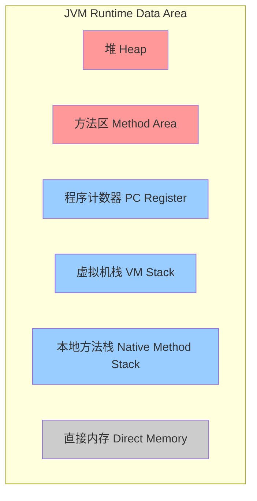
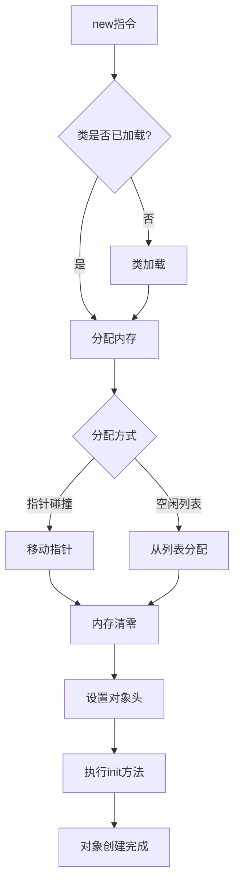
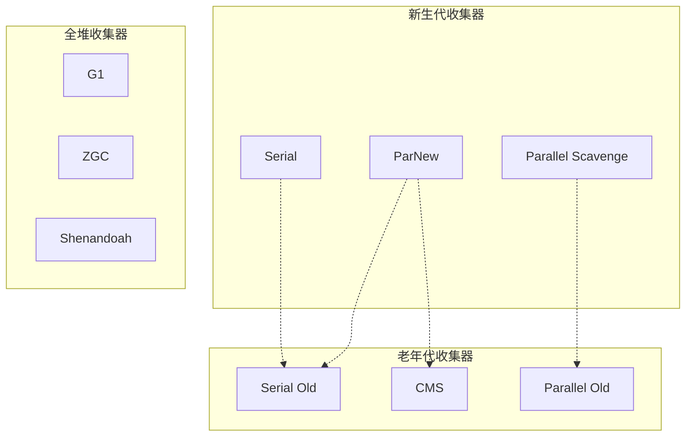
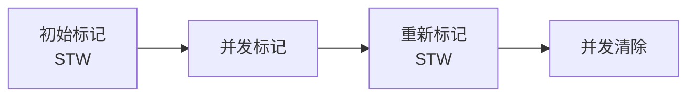
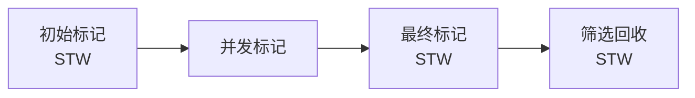
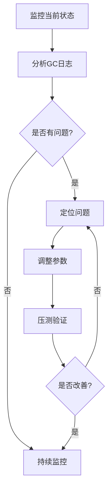

# JVM深度解析

## 目录
- [一、JVM内存模型](#一jvm内存模型)
- [二、GC算法与垃圾收集器](#二gc算法与垃圾收集器)
- [三、性能调优](#三性能调优)
- [四、故障排查](#四故障排查)
- [五、高频面试题](#五高频面试题)

## 一、JVM内存模型

### 1.1 运行时数据区



#### 1.1.1 程序计数器（Program Counter Register）
- **作用**：记录当前线程执行的字节码行号
- **特点**：线程私有，不会OutOfMemoryError
- **大小**：占用内存很小

#### 1.1.2 虚拟机栈（VM Stack）
- **作用**：存储局部变量表、操作数栈、动态链接、方法出口
- **特点**：线程私有，生命周期与线程相同
- **异常**：
  - `StackOverflowError`：栈深度超过虚拟机允许的深度
  - `OutOfMemoryError`：动态扩展时无法申请到足够内存

**栈帧结构**：
```
+-----------------------+
|   返回地址             |
+-----------------------+
|   动态链接             |
+-----------------------+
|   操作数栈             |
+-----------------------+
|   局部变量表           |
+-----------------------+
```

#### 1.1.3 本地方法栈（Native Method Stack）
- **作用**：为Native方法服务
- **实现**：HotSpot将本地方法栈和虚拟机栈合二为一

#### 1.1.4 堆（Heap）
- **作用**：存放对象实例，是GC的主要区域
- **特点**：线程共享，虚拟机启动时创建
- **分代**：
  - 新生代（Young Generation）
    - Eden区
    - Survivor区（From + To）
  - 老年代（Old Generation）

**堆内存结构**：
```
+----------------------------------------------------------+
|                         Heap                              |
|  +--------------------+  +-----------------------------+  |
|  |  Young Generation  |  |    Old Generation           |  |
|  | +-----+ +--------+ |  |                             |  |
|  | |Eden | |Survivor| |  |                             |  |
|  | |     | | S0 | S1| |  |                             |  |
|  | +-----+ +--------+ |  |                             |  |
|  +--------------------+  +-----------------------------+  |
+----------------------------------------------------------+
```

#### 1.1.5 方法区（Method Area）
- **作用**：存储类信息、常量、静态变量、即时编译器编译后的代码
- **实现**：
  - JDK 7：永久代（PermGen）
  - JDK 8+：元空间（Metaspace），使用本地内存
- **运行时常量池**：Class文件中的常量池在类加载后进入方法区

#### 1.1.6 直接内存（Direct Memory）
- **特点**：不是JVM运行时数据区的一部分
- **使用**：NIO中的DirectByteBuffer
- **优势**：避免Java堆和Native堆之间复制数据

### 1.2 对象创建过程



#### 1.2.1 内存分配方式
1. **指针碰撞**（Bump the Pointer）
   - 条件：堆内存规整（使用Compact GC）
   - 原理：移动指针分配
   
2. **空闲列表**（Free List）
   - 条件：堆内存不规整
   - 原理：维护可用内存列表

#### 1.2.2 并发安全
1. **CAS + 失败重试**
2. **TLAB**（Thread Local Allocation Buffer）
   - 每个线程在Eden预分配一块内存
   - 只有TLAB用完分配新的时才需要同步

### 1.3 对象内存布局

```
+------------------+
|   对象头          |  <-- Mark Word + Class Pointer
+------------------+
|   实例数据        |  <-- 字段数据
+------------------+
|   对齐填充        |  <-- 8字节对齐
+------------------+
```

#### 1.3.1 对象头（Object Header）
1. **Mark Word**（8字节，64位JVM）
   - 哈希码（HashCode）
   - GC分代年龄
   - 锁状态标志
   - 线程持有的锁
   - 偏向线程ID
   - 偏向时间戳

2. **类型指针**（Class Pointer）
   - 指向类元数据的指针
   - 开启指针压缩后4字节，否则8字节

3. **数组长度**（如果是数组对象）

#### 1.3.2 实例数据
- 父类字段 + 本类字段
- 相同宽度的字段分配到一起
- 父类字段在子类之前

### 1.4 对象访问定位

**方式一：句柄访问**
```
Stack              Heap                  Method Area
+------+         +--------+            +-----------+
| ref  |-------->| Handle |            |   类型    |
+------+         | Pool   |            |   数据    |
                 +--------+            +-----------+
                 | 对象 ptr|-----+           ^
                 | 类型 ptr|-----|-----+     |
                 +--------+     |     |     |
                                |     +-----|
                                v
                          +----------+
                          |   对象   |
                          |   实例   |
                          +----------+
```

**方式二：直接指针（HotSpot使用）**
```
Stack              Heap                Method Area
+------+         +----------+         +-----------+
| ref  |-------->|   对象   |         |   类型    |
+------+         |   头部   |-------->|   数据    |
                 |   数据   |         +-----------+
                 +----------+
```

## 二、GC算法与垃圾收集器

### 2.1 对象存活判定

#### 2.1.1 引用计数法
- **原理**：对象被引用计数+1，引用失效计数-1
- **缺点**：无法解决循环引用
- **应用**：Python、PHP

#### 2.1.2 可达性分析（GC Roots）
- **原理**：从GC Roots开始向下搜索，不可达对象即为垃圾
- **GC Roots包括**：
  1. 虚拟机栈中引用的对象
  2. 方法区中静态属性引用的对象
  3. 方法区中常量引用的对象
  4. 本地方法栈中JNI引用的对象
  5. JVM内部的引用（基本数据类型对应的Class对象）
  6. 被同步锁持有的对象

### 2.2 引用类型

| 引用类型 | 特点 | 使用场景 | GC时机 |
|---------|------|---------|-------|
| 强引用 | 不会被GC | 普通对象引用 | 永不回收 |
| 软引用 | 内存不足时回收 | 缓存 | 内存不足时 |
| 弱引用 | GC时回收 | ThreadLocal | 每次GC |
| 虚引用 | 无法通过引用获取对象 | 对象回收跟踪 | 每次GC |

```java
// 软引用示例
public class SoftReferenceCache<K, V> {
    private Map<K, SoftReference<V>> cache = new ConcurrentHashMap<>();
    
    public V get(K key) {
        SoftReference<V> ref = cache.get(key);
        return ref == null ? null : ref.get();
    }
    
    public void put(K key, V value) {
        cache.put(key, new SoftReference<>(value));
    }
}
```

### 2.3 垃圾回收算法

#### 2.3.1 标记-清除（Mark-Sweep）
```
回收前: [A][B][ ][C][ ][ ][D]
标记:   [A][B][ ][C][ ][ ][D]  (B、D标记为垃圾)
清除后: [A][ ][ ][C][ ][ ][ ]  (产生内存碎片)
```
- **优点**：简单
- **缺点**：产生内存碎片，效率不高

#### 2.3.2 标记-复制（Copying）
```
From区:  [A][B][C][D]
To区:    [ ][ ][ ][ ]
         
复制后:
From区:  [ ][ ][ ][ ]  (清空)
To区:    [A][C][ ][ ]  (只复制存活对象)
```
- **优点**：无碎片，效率高
- **缺点**：空间利用率低（只用50%）
- **应用**：新生代（Eden:S0:S1 = 8:1:1）

#### 2.3.3 标记-整理（Mark-Compact）
```
回收前: [A][B][ ][C][ ][ ][D]
标记:   [A][B][ ][C][ ][ ][D]
整理后: [A][C][ ][ ][ ][ ][ ]  (存活对象移到一端)
```
- **优点**：无碎片，空间利用率高
- **缺点**：移动对象成本高
- **应用**：老年代

#### 2.3.4 分代收集
- **新生代**：对象存活率低，使用复制算法
- **老年代**：对象存活率高，使用标记-清除或标记-整理

### 2.4 垃圾收集器



#### 2.4.1 Serial / Serial Old
- **特点**：单线程，STW（Stop The World）
- **适用**：客户端模式，单核CPU
- **参数**：`-XX:+UseSerialGC`

#### 2.4.2 ParNew
- **特点**：Serial的多线程版本
- **适用**：多核CPU，配合CMS使用
- **参数**：`-XX:+UseParNewGC`

#### 2.4.3 Parallel Scavenge / Parallel Old
- **特点**：吞吐量优先，自适应调节
- **目标**：控制吞吐量（运行代码时间 / 总时间）
- **参数**：
  - `-XX:+UseParallelGC`
  - `-XX:MaxGCPauseMillis`：最大停顿时间
  - `-XX:GCTimeRatio`：吞吐量大小

#### 2.4.4 CMS（Concurrent Mark Sweep）

**执行流程**：


1. **初始标记**（STW）：标记GC Roots直接关联对象
2. **并发标记**：从GC Roots遍历整个对象图
3. **重新标记**（STW）：修正并发标记期间变动的对象
4. **并发清除**：清理垃圾对象

**优点**：
- 并发收集，停顿时间短

**缺点**：
- CPU资源敏感
- 无法处理浮动垃圾
- 产生内存碎片
- 可能出现"Concurrent Mode Failure"

**参数**：
```bash
-XX:+UseConcMarkSweepGC                # 启用CMS
-XX:CMSInitiatingOccupancyFraction=70  # 老年代使用70%时触发
-XX:+UseCMSCompactAtFullCollection     # Full GC时整理碎片
```

#### 2.4.5 G1（Garbage First）

**内存布局**：
```
+-----+-----+-----+-----+-----+-----+
| E   | E   | S   | O   | O   | H   |  Region (1-32MB)
+-----+-----+-----+-----+-----+-----+
E=Eden, S=Survivor, O=Old, H=Humongous
```

**特点**：
- 面向服务端，低延迟
- 分Region的堆内存布局
- 可预测的停顿时间模型
- 按收益优先回收

**执行流程**：


**参数**：
```bash
-XX:+UseG1GC                      # 启用G1
-XX:MaxGCPauseMillis=200         # 期望停顿时间
-XX:G1HeapRegionSize=16m         # Region大小
-XX:InitiatingHeapOccupancyPercent=45  # 启动并发GC的堆占用阈值
```

**优势**：
1. 可预测的停顿时间
2. 不产生内存碎片
3. 可以指定最大停顿时间

#### 2.4.6 ZGC（Z Garbage Collector）

**特点**：
- 低延迟（停顿时间<10ms）
- TB级堆内存支持
- 并发标记、并发转移
- 使用读屏障（Load Barrier）和染色指针（Colored Pointers）

**染色指针**：
```
64位指针布局:
+--------+-------+-------+-------+------------------+
| Unused | M0    | M1    | Remapped | Object Offset |
|  16bit | 1bit  | 1bit  |  1bit    |    45bit      |
+--------+-------+-------+-------+------------------+
```

**参数**：
```bash
-XX:+UseZGC
-XX:ZCollectionInterval=120  # GC间隔
-Xmx16g                      # 最大堆内存
```

**适用场景**：
- 大内存应用
- 低延迟要求
- Java 15+

### 2.5 GC日志分析

#### 2.5.1 开启GC日志
```bash
# JDK 8
-XX:+PrintGCDetails 
-XX:+PrintGCDateStamps 
-Xloggc:gc.log

# JDK 9+
-Xlog:gc*:file=gc.log:time,uptime,level,tags
```

#### 2.5.2 GC日志示例
```
2024-10-22T10:30:45.123+0800: 1.234: [GC (Allocation Failure) 
    [PSYoungGen: 65536K->8192K(76288K)] 
    65536K->16384K(251392K), 0.0123456 secs] 
    [Times: user=0.04 sys=0.01, real=0.01 secs]
```

解读：
- `PSYoungGen`：新生代收集器
- `65536K->8192K(76288K)`：新生代 回收前->回收后（总大小）
- `65536K->16384K(251392K)`：堆 回收前->回收后（总大小）
- `user/sys/real`：用户态/内核态/实际时间

## 三、性能调优

### 3.1 JVM参数

#### 3.1.1 内存参数
```bash
-Xms4g                    # 初始堆大小
-Xmx4g                    # 最大堆大小 (建议与Xms相同)
-Xmn2g                    # 新生代大小
-Xss256k                  # 线程栈大小
-XX:MetaspaceSize=256m    # 元空间初始大小
-XX:MaxMetaspaceSize=512m # 元空间最大大小
-XX:MaxDirectMemorySize=1g # 直接内存最大值
```

#### 3.1.2 GC参数
```bash
-XX:+UseG1GC              # 使用G1收集器
-XX:MaxGCPauseMillis=200  # 最大停顿时间
-XX:ParallelGCThreads=8   # 并行GC线程数
-XX:ConcGCThreads=2       # 并发GC线程数
-XX:SurvivorRatio=8       # Eden:Survivor = 8:1
-XX:MaxTenuringThreshold=15 # 晋升老年代的年龄阈值
```

#### 3.1.3 诊断参数
```bash
-XX:+HeapDumpOnOutOfMemoryError      # OOM时dump堆
-XX:HeapDumpPath=/path/to/dump       # dump文件路径
-XX:+PrintGCDetails                   # 打印GC详情
-XX:+PrintGCDateStamps               # 打印GC时间戳
-XX:+PrintTenuringDistribution       # 打印对象年龄分布
```

### 3.2 调优实践

#### 3.2.1 调优目标
1. **低延迟**：减少GC停顿时间
2. **高吞吐**：提高应用运行时间占比
3. **低内存占用**：减少堆内存使用

#### 3.2.2 调优步骤



#### 3.2.3 常见问题及解决方案

**问题1：频繁Young GC**
- **现象**：Young GC频率过高
- **原因**：新生代过小，对象创建速度快
- **解决**：
  - 增大新生代：`-Xmn`
  - 检查代码是否创建大量临时对象
  - 使用对象池

**问题2：频繁Full GC**
- **现象**：Full GC频率高，每次回收效果不明显
- **原因**：
  1. 老年代空间不足
  2. 元空间不足
  3. 内存泄漏
- **解决**：
  - 增大老年代
  - 检查是否有内存泄漏
  - 调整晋升阈值

**问题3：GC停顿时间长**
- **原因**：堆内存过大，单次GC扫描对象多
- **解决**：
  - 使用低延迟GC（G1、ZGC）
  - 减小堆内存
  - 调整并发GC线程数

**问题4：内存溢出OOM**
- **类型**：
  1. `java.lang.OutOfMemoryError: Java heap space`
  2. `java.lang.OutOfMemoryError: Metaspace`
  3. `java.lang.OutOfMemoryError: Direct buffer memory`
  4. `java.lang.OutOfMemoryError: unable to create new native thread`
  
- **排查**：
  ```bash
  # 1. dump堆快照
  jmap -dump:format=b,file=heap.hprof <pid>
  
  # 2. 使用MAT分析
  # 查找内存泄漏、大对象
  ```

### 3.3 性能监控工具

#### 3.3.1 命令行工具

**jps - 查看Java进程**
```bash
jps -lv
```

**jstat - GC统计**
```bash
jstat -gcutil <pid> 1000  # 每秒输出GC情况
jstat -gccause <pid>      # 查看GC原因
```

输出示例：
```
  S0     S1     E      O      M     CCS    YGC     YGCT    FGC    FGCT     GCT   
  0.00  25.12  55.32  45.23  92.11  89.45   156    1.234     2    0.456   1.690
```

**jmap - 堆内存分析**
```bash
jmap -heap <pid>           # 查看堆配置和使用情况
jmap -histo <pid>          # 查看对象统计
jmap -dump:format=b,file=heap.hprof <pid>  # dump堆
```

**jstack - 线程堆栈**
```bash
jstack <pid>               # 打印线程堆栈
jstack -l <pid>            # 打印锁信息
```

**jinfo - 查看和修改JVM参数**
```bash
jinfo -flags <pid>         # 查看JVM参数
jinfo -flag +PrintGC <pid> # 动态开启GC日志
```

#### 3.3.2 可视化工具

**JConsole**
- 实时监控CPU、内存、线程、类加载
- 查看MBean信息

**VisualVM**
- 更强大的监控工具
- 支持插件（BTrace、GC分析等）
- 可以进行采样和性能分析

**Arthas**（阿里开源）
```bash
# 启动Arthas
java -jar arthas-boot.jar

# 常用命令
dashboard          # 仪表盘
thread -n 3        # 查看最忙的3个线程
jad com.example.MyClass  # 反编译
watch com.example.MyClass method  # 观察方法
trace com.example.MyClass method  # 追踪方法调用
```

**MAT（Memory Analyzer Tool）**
- 分析堆dump文件
- 查找内存泄漏
- 生成泄漏报告

## 四、故障排查

### 4.1 CPU使用率高

**排查步骤**：
```bash
# 1. 找到CPU占用高的Java进程
top

# 2. 找到进程中CPU占用高的线程
top -Hp <pid>

# 3. 线程ID转16进制
printf "%x\n" <thread_id>

# 4. 查看线程堆栈
jstack <pid> | grep <hex_thread_id> -A 50
```

**常见原因**：
1. 死循环
2. 频繁GC
3. 大量线程上下文切换

### 4.2 内存泄漏

**定位方法**：
```bash
# 1. 多次dump堆快照
jmap -dump:format=b,file=heap1.hprof <pid>
# 等待一段时间
jmap -dump:format=b,file=heap2.hprof <pid>

# 2. 使用MAT对比分析
# 查找持续增长的对象
```

**常见场景**：
1. 静态集合类持有对象引用
2. 监听器未移除
3. 数据库连接、IO流未关闭
4. ThreadLocal未清理

**代码示例**：
```java
// 错误示例：ThreadLocal内存泄漏
public class ThreadLocalLeak {
    private static ThreadLocal<LargeObject> threadLocal = new ThreadLocal<>();
    
    public void process() {
        threadLocal.set(new LargeObject());
        // 忘记remove，线程池场景下会导致内存泄漏
    }
}

// 正确示例
public class ThreadLocalCorrect {
    private static ThreadLocal<LargeObject> threadLocal = new ThreadLocal<>();
    
    public void process() {
        try {
            threadLocal.set(new LargeObject());
            // 业务逻辑
        } finally {
            threadLocal.remove();  // 及时清理
        }
    }
}
```

### 4.3 死锁

**检测**：
```bash
jstack <pid> | grep -A 10 "Found.*deadlock"
```

**示例**：
```
Found one Java-level deadlock:
=============================
"Thread-1":
  waiting to lock monitor 0x00007f8a4c004e00 (object 0x00000000d5f78a10, a java.lang.Object),
  which is held by "Thread-0"
"Thread-0":
  waiting to lock monitor 0x00007f8a4c007350 (object 0x00000000d5f78a20, a java.lang.Object),
  which is held by "Thread-1"
```

**预防**：
1. 避免嵌套锁
2. 按顺序获取锁
3. 使用tryLock超时
4. 使用并发工具类

### 4.4 GC问题排查

**步骤**：
```bash
# 1. 开启GC日志
-Xlog:gc*:file=gc.log:time,uptime,level,tags

# 2. 分析GC日志
# 使用GCEasy、GCViewer等工具

# 3. 查看堆内存使用
jmap -heap <pid>

# 4. 查看存活对象
jmap -histo:live <pid> | head -20
```

**关注指标**：
- GC频率
- 每次GC回收效果
- 停顿时间
- 堆内存使用趋势

## 五、高频面试题

### 5.1 基础问题

**Q1：说说JVM内存模型？**

A：JVM内存分为：
1. **程序计数器**：线程私有，记录字节码行号
2. **虚拟机栈**：线程私有，存储局部变量、操作数栈等
3. **本地方法栈**：为Native方法服务
4. **堆**：线程共享，存放对象实例，是GC主要区域
5. **方法区**：线程共享，存储类信息、常量、静态变量（JDK8后改为元空间）
6. **直接内存**：非JVM内存，NIO使用

**Q2：堆和栈的区别？**

| 特性 | 堆 | 栈 |
|-----|----|----|
| 存储内容 | 对象实例 | 局部变量、方法调用 |
| 线程共享 | 是 | 否 |
| 生命周期 | GC回收 | 方法结束自动释放 |
| 大小 | 相对较大 | 相对较小 |
| 异常 | OutOfMemoryError | StackOverflowError, OOM |

**Q3：什么时候会触发Full GC？**

1. 老年代空间不足
2. 元空间不足
3. 调用`System.gc()`（不保证一定执行）
4. CMS GC时出现promotion failed、concurrent mode failure
5. Young GC时，晋升对象大小超过老年代剩余空间

### 5.2 GC相关

**Q4：说说常见的垃圾收集器及其特点？**

| 收集器 | 类型 | 特点 | 适用场景 |
|-------|------|------|---------|
| Serial | 新生代 | 单线程，STW | 单核CPU，客户端 |
| ParNew | 新生代 | Serial多线程版本 | 多核CPU，配合CMS |
| Parallel Scavenge | 新生代 | 吞吐量优先 | 后台计算任务 |
| Serial Old | 老年代 | 单线程，标记-整理 | 客户端 |
| Parallel Old | 老年代 | Parallel Scavenge的老年代版本 | 后台计算任务 |
| CMS | 老年代 | 并发收集，低延迟 | Web应用 |
| G1 | 全堆 | 分区收集，可预测停顿 | 大内存应用 |
| ZGC | 全堆 | 超低延迟（<10ms） | 大内存低延迟场景 |

**Q5：CMS和G1的区别？**

| 特性 | CMS | G1 |
|-----|-----|-----|
| 内存布局 | 分代（连续） | 分Region |
| 停顿时间 | 不可预测 | 可预测 |
| 内存碎片 | 有（标记-清除） | 无（整理） |
| 回收策略 | 只回收老年代 | 优先回收价值大的Region |
| 适用堆大小 | 中等（4-6G） | 大堆（6G+） |

**Q6：详细说说G1收集器的工作原理？**

G1将堆划分为多个大小相等的Region（1-32MB），每个Region可以是Eden、Survivor、Old、Humongous。

**四个阶段**：
1. **初始标记**（STW）：标记GC Roots直接关联的对象
2. **并发标记**：从GC Roots遍历整个对象图，耗时最长但与应用并发
3. **最终标记**（STW）：处理并发标记期间变化的对象
4. **筛选回收**（STW）：根据停顿时间目标，选择收益最大的Region回收

**特点**：
- 可预测的停顿时间
- 不产生内存碎片
- 并发与并行结合

### 5.3 调优相关

**Q7：如何排查CPU使用率过高？**

1. 使用`top`找到CPU占用高的Java进程
2. 使用`top -Hp <pid>`找到CPU占用高的线程
3. 将线程ID转为16进制
4. 使用`jstack <pid>`查看线程堆栈，定位代码
5. 分析代码，可能是死循环、频繁GC、大量计算

**Q8：如何排查内存泄漏？**

1. 使用`jmap -heap <pid>`查看堆内存使用情况
2. 多次使用`jmap -dump`导出堆快照
3. 使用MAT工具对比分析，查找持续增长的对象
4. 分析对象的GC Roots链，找到泄漏点
5. 检查代码中的静态集合、监听器、ThreadLocal等

**Q9：说说你做过的JVM调优案例？**

**案例1：Full GC频繁**
- **问题**：线上应用每小时Full GC 10+次
- **分析**：老年代快速增长，查看监控发现大量大对象
- **解决**：
  1. 增大新生代，避免大对象直接进老年代
  2. 优化代码，避免一次性加载大量数据
  3. 将`-XX:PretenureSizeThreshold`设置为500KB
- **结果**：Full GC降至每天2-3次

**案例2：接口响应慢**
- **问题**：P99延迟达到2s
- **分析**：GC日志显示Young GC停顿200ms+
- **解决**：
  1. 从CMS切换到G1
  2. 设置`-XX:MaxGCPauseMillis=50`
  3. 调整堆大小为8G
- **结果**：P99延迟降至200ms

### 5.4 高级问题

**Q10：什么是TLAB？**

TLAB（Thread Local Allocation Buffer）是线程本地分配缓冲区。

- **作用**：避免多线程在Eden区分配对象时的竞争
- **原理**：为每个线程在Eden区预分配一小块内存，线程优先在TLAB中分配对象
- **大小**：默认Eden的1%
- **参数**：`-XX:+UseTLAB`（默认开启）

**Q11：什么是安全点（Safepoint）和安全区域（Safe Region）？**

**安全点**：
- 程序执行过程中可以暂停的点
- GC时需要所有线程到达安全点才能开始
- 常见安全点：方法调用、循环跳转、异常跳转

**安全区域**：
- 一段代码区域，在此区域内对象引用关系不会变化
- 解决线程Sleep或Blocked时无法到达安全点的问题

**Q12：说说类加载机制？**

**类加载过程**：
1. **加载**：读取字节码，创建Class对象
2. **验证**：验证字节码合法性
3. **准备**：为静态变量分配内存，设置默认值
4. **解析**：符号引用转为直接引用
5. **初始化**：执行<clinit>方法，初始化静态变量和静态代码块

**类加载器**：
- Bootstrap ClassLoader：加载核心类库
- Extension ClassLoader：加载扩展类库
- Application ClassLoader：加载应用类路径
- 自定义ClassLoader

**双亲委派模型**：
- 类加载请求先委派给父类加载器
- 父类加载器无法加载时，子加载器才尝试加载
- 好处：避免类重复加载，保证核心类不被篡改

## 六、最佳实践

### 6.1 开发建议

1. **合理使用对象池**
   ```java
   // 对于频繁创建销毁的对象，使用对象池
   private static final ObjectPool<StringBuilder> pool = 
       new GenericObjectPool<>(new StringBuilderFactory());
   ```

2. **及时释放资源**
   ```java
   try (Connection conn = dataSource.getConnection();
        Statement stmt = conn.createStatement()) {
       // 使用资源
   } // 自动关闭
   ```

3. **避免在循环中创建对象**
   ```java
   // 错误
   for (int i = 0; i < 10000; i++) {
       String s = new String("test");  // 创建大量对象
   }
   
   // 正确
   String s = "test";  // 使用字符串常量池
   for (int i = 0; i < 10000; i++) {
       // 使用s
   }
   ```

4. **使用StringBuilder拼接字符串**
   ```java
   // 循环中拼接字符串
   StringBuilder sb = new StringBuilder();
   for (String s : list) {
       sb.append(s);
   }
   return sb.toString();
   ```

### 6.2 生产环境配置建议

```bash
# 通用配置
-Xms4g -Xmx4g                          # 堆内存，初始和最大设置相同
-Xmn2g                                  # 新生代2G
-XX:MetaspaceSize=256m                  # 元空间
-XX:MaxMetaspaceSize=512m
-XX:+AlwaysPreTouch                     # 启动时就分配内存
-XX:+DisableExplicitGC                  # 禁用System.gc()

# GC配置 (G1)
-XX:+UseG1GC
-XX:MaxGCPauseMillis=200               # 期望停顿时间
-XX:G1HeapRegionSize=16m
-XX:InitiatingHeapOccupancyPercent=45

# GC日志
-Xlog:gc*:file=/var/log/gc.log:time,uptime,level,tags
-XX:+HeapDumpOnOutOfMemoryError
-XX:HeapDumpPath=/var/log/heapdump.hprof

# 性能优化
-XX:+UseTLAB                           # TLAB
-XX:+UseBiasedLocking                  # 偏向锁
-XX:AutoBoxCacheMax=20000              # Integer缓存范围
```

### 6.3 监控告警

**关键指标**：
1. GC频率和停顿时间
2. 堆内存使用率
3. 老年代增长速率
4. Full GC频率

**告警规则**：
- Young GC停顿 > 100ms
- Full GC频率 > 10次/小时
- 堆内存使用率 > 85%
- GC时间占比 > 5%

## 七、延伸阅读

1. 《深入理解Java虚拟机》- 周志明
2. 《Java性能权威指南》
3. 《垃圾回收算法手册》
4. Oracle官方JVM文档
5. OpenJDK源码

---

**关键字**：JVM、内存模型、GC、性能调优、垃圾收集器、G1、ZGC、内存泄漏、调优实践

