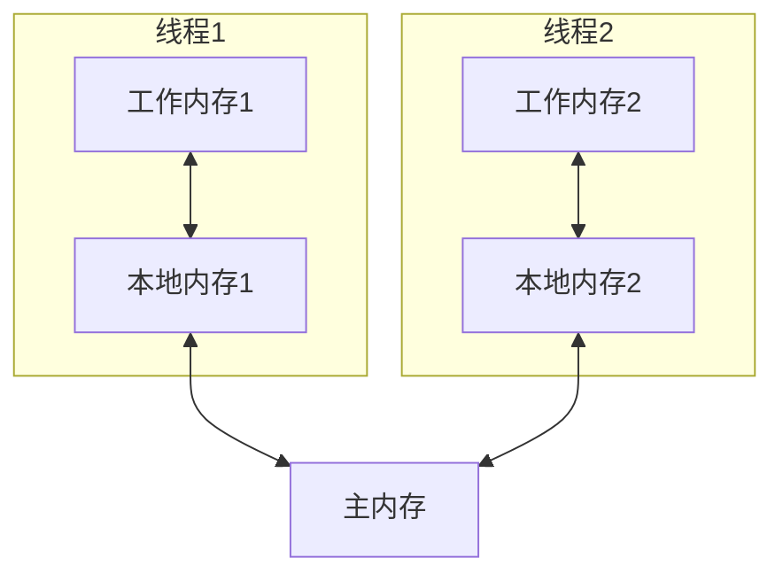
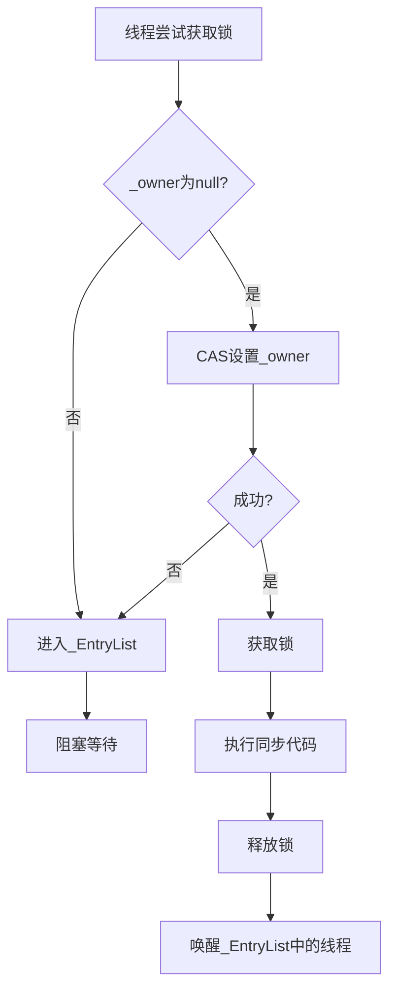
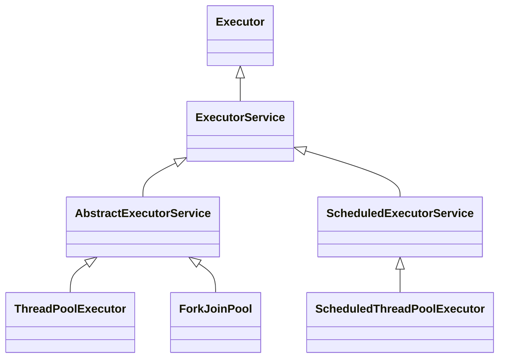
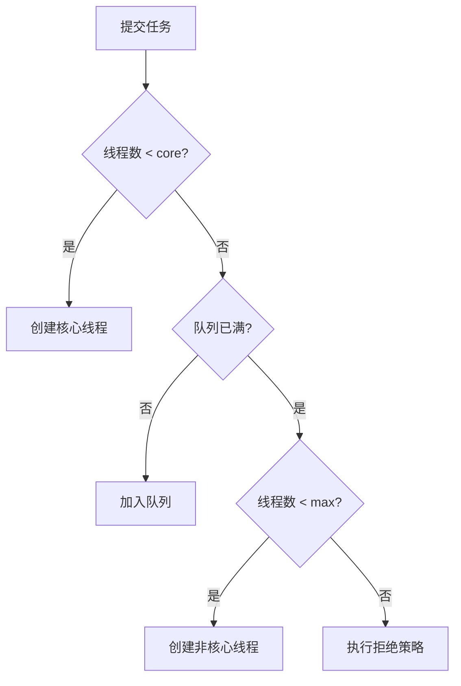

# Java并发编程深度解析

## 目录
- [一、Java内存模型(JMM)](#一java内存模型jmm)
- [二、synchronized与锁优化](#二synchronized与锁优化)
- [三、AQS与显式锁](#三aqs与显式锁)
- [四、线程池](#四线程池)
- [五、并发容器](#五并发容器)
- [六、并发工具类](#六并发工具类)
- [七、高频面试题](#七高频面试题)

## 一、Java内存模型(JMM)

### 1.1 JMM概述

Java内存模型（Java Memory Model）定义了线程与主内存之间的抽象关系。



**关键概念**：
- **主内存**：所有线程共享的内存区域
- **工作内存**：每个线程私有的内存区域
- **变量**：实例字段、静态字段、数组元素（不包括局部变量和方法参数）

### 1.2 内存交互操作

8个原子操作：

| 操作 | 作用域 | 说明 |
|------|--------|------|
| lock | 主内存 | 锁定变量 |
| unlock | 主内存 | 解锁变量 |
| read | 主内存 | 读取变量值 |
| load | 工作内存 | 把read的值放入工作内存 |
| use | 工作内存 | 把值传给执行引擎 |
| assign | 工作内存 | 把执行引擎的值赋给工作内存 |
| store | 工作内存 | 把值传到主内存 |
| write | 主内存 | 把store的值写入主内存 |

### 1.3 三大特性

#### 1.3.1 原子性（Atomicity）

**定义**：操作不可分割，要么全部执行，要么全部不执行。

```java
// 原子操作
int a = 1;        // 原子
a = 2;            // 原子

// 非原子操作
int b = a;        // read + load + use + assign (非原子)
a++;              // read + load + use + add + assign + store + write (非原子)

// 保证原子性
synchronized (lock) {
    a++;          // 加锁后整体原子
}

AtomicInteger atomicInt = new AtomicInteger(0);
atomicInt.incrementAndGet();  // CAS保证原子
```

#### 1.3.2 可见性（Visibility）

**定义**：一个线程修改了变量的值，其他线程能立即看到。

```java
public class VisibilityDemo {
    private boolean flag = false;  // 可能不可见
    
    public void writer() {
        flag = true;  // 线程1修改
    }
    
    public void reader() {
        while (!flag) {  // 线程2可能看不到修改
            // 可能死循环
        }
    }
}

// 解决方案1：volatile
private volatile boolean flag = false;

// 解决方案2：synchronized
public synchronized void writer() {
    flag = true;
}
public synchronized void reader() {
    while (!flag) { }
}

// 解决方案3：final
private final int value = 42;  // final保证可见
```

#### 1.3.3 有序性（Ordering）

**指令重排序**：
```java
// 原始代码
int a = 1;  // 1
int b = 2;  // 2
int c = a + b;  // 3

// 可能重排序为：
int b = 2;  // 2
int a = 1;  // 1
int c = a + b;  // 3
```

**as-if-serial语义**：
- 单线程中，重排序不影响结果
- 多线程中，可能出现问题

**经典案例：双重检查锁（DCL）**
```java
public class Singleton {
    // 错误版本：可能返回未初始化完成的对象
    private static Singleton instance;
    
    public static Singleton getInstance() {
        if (instance == null) {  // 1
            synchronized (Singleton.class) {
                if (instance == null) {  // 2
                    // 可能重排序为：
                    // 1. 分配内存
                    // 2. instance指向内存 (重排序后提前)
                    // 3. 初始化对象
                    instance = new Singleton();  // 3
                }
            }
        }
        return instance;
    }
}

// 正确版本：使用volatile禁止重排序
public class Singleton {
    private static volatile Singleton instance;
    
    public static Singleton getInstance() {
        if (instance == null) {
            synchronized (Singleton.class) {
                if (instance == null) {
                    instance = new Singleton();
                }
            }
        }
        return instance;
    }
}
```

### 1.4 happens-before原则

**定义**：如果A happens-before B，则A的结果对B可见。

**8条规则**：

1. **程序次序规则**：单线程中，代码顺序执行
2. **锁定规则**：unlock happens-before lock
3. **volatile规则**：volatile写 happens-before volatile读
4. **传递性**：A hb B，B hb C => A hb C
5. **线程启动规则**：Thread.start() happens-before 线程中的操作
6. **线程终止规则**：线程中的操作 happens-before Thread.join()
7. **中断规则**：interrupt() happens-before 检测到中断
8. **对象终结规则**：构造函数 happens-before finalize()

```java
// 示例：volatile的happens-before
class VolatileExample {
    private int a = 0;
    private volatile boolean flag = false;
    
    public void writer() {
        a = 1;           // 1
        flag = true;     // 2 volatile写
    }
    
    public void reader() {
        if (flag) {      // 3 volatile读
            int i = a;   // 4 一定能看到a=1
        }
    }
}
// 1 happens-before 2 (程序次序)
// 2 happens-before 3 (volatile规则)
// 3 happens-before 4 (程序次序)
// 因此 1 happens-before 4 (传递性)
```

### 1.5 volatile关键字

**作用**：
1. 保证可见性
2. 禁止指令重排序
3. **不保证原子性**

**实现原理**：
- 写：插入StoreStore屏障，刷新到主内存
- 读：插入LoadLoad屏障，从主内存读取

**内存屏障**：
```java
// volatile写
Store1
Store2
写volatile变量
StoreLoad屏障  // 禁止上面的写和下面的读/写重排序
Load1

// volatile读
Load1
读volatile变量
LoadLoad屏障   // 禁止下面的读重排序
LoadStore屏障  // 禁止下面的写重排序
Load2
Store2
```

**适用场景**：
```java
// 1. 状态标志
private volatile boolean shutdown = false;

public void shutdown() {
    shutdown = true;
}

public void work() {
    while (!shutdown) {
        // do work
    }
}

// 2. 双重检查锁
private volatile Singleton instance;

// 3. 读多写少的状态
private volatile int counter;  // 只有一个线程写，多个线程读

// 不适用：i++操作
private volatile int count = 0;
public void increment() {
    count++;  // 非原子，volatile无法保证线程安全
}
```

## 二、synchronized与锁优化

### 2.1 synchronized使用

```java
// 1. 同步实例方法 - 锁是this
public synchronized void method1() {
    // ...
}
// 等价于
public void method1() {
    synchronized (this) {
        // ...
    }
}

// 2. 同步静态方法 - 锁是Class对象
public static synchronized void method2() {
    // ...
}
// 等价于
public static void method2() {
    synchronized (MyClass.class) {
        // ...
    }
}

// 3. 同步代码块
public void method3() {
    synchronized (lock) {
        // ...
    }
}
```

### 2.2 synchronized原理

**字节码层面**：
```
public void synchronized method();
    descriptor: ()V
    flags: (0x0021) ACC_PUBLIC, ACC_SYNCHRONIZED  // 方法标志
    
public void method();
    Code:
       0: aload_0
       1: dup
       2: astore_1
       3: monitorenter      // 进入同步
       4: aload_1
       5: monitorexit       // 退出同步
       6: goto             14
       9: astore_2
      10: aload_1
      11: monitorexit       // 异常时也要退出
      12: aload_2
      13: athrow
```

**对象头结构**（64位JVM）：
```
|-----------------------------------------------------------------------------------------------|
|                                    Object Header (128 bits)                                   |
|-----------------------------------------------------------------------------------------------|
|                        Mark Word (64 bits)                    | Klass Pointer (64 bits)      |
|-----------------------------------------------------------------------------------------------|
```

**Mark Word结构**：
```
|-----------------------------------------------------------------------|-----------------------|
|                          Mark Word (64 bits)                          |      State            |
|-----------------------------------------------------------------------|-----------------------|
| unused:25 | hashcode:31 | unused:1 | age:4 | biased_lock:0 | lock:01 | Normal (无锁)         |
|-----------------------------------------------------------------------|-----------------------|
| thread:54 | epoch:2 | unused:1 | age:4 | biased_lock:1 | lock:01     | Biased (偏向锁)       |
|-----------------------------------------------------------------------|-----------------------|
| ptr_to_lock_record:62                                    | lock:00    | Lightweight (轻量锁)  |
|-----------------------------------------------------------------------|-----------------------|
| ptr_to_heavyweight_monitor:62                            | lock:10    | Heavyweight (重量锁)  |
|-----------------------------------------------------------------------|-----------------------|
| marked for GC                                            | lock:11    | GC Marked             |
|-----------------------------------------------------------------------|-----------------------|
```

### 2.3 锁升级过程


#### 2.3.1 偏向锁

**场景**：大多数情况下，锁不仅不存在多线程竞争，而且总是由同一个线程获取。

**原理**：
1. 首次获取锁时，在对象头记录线程ID
2. 下次该线程进入同步块时，检查线程ID是否一致
3. 一致则直接进入，无需CAS操作

**撤销**：
- 其他线程尝试获取锁
- 调用对象的hashCode()
- 调用wait()/notify()

```java
// 开启/关闭偏向锁
-XX:+UseBiasedLocking         // 开启（默认）
-XX:BiasedLockingStartupDelay=0  // 启动延迟（默认4s）
-XX:-UseBiasedLocking         // 关闭
```

#### 2.3.2 轻量级锁

**场景**：线程交替执行同步块，不存在竞争。

**原理**：
1. 线程在栈帧中创建Lock Record
2. CAS将对象头的Mark Word复制到Lock Record
3. CAS将对象头指向Lock Record
4. 成功则获取锁，失败则自旋
5. 自旋一定次数后升级为重量级锁

#### 2.3.3 重量级锁

**原理**：
- 基于操作系统的互斥量（Mutex）实现
- 需要进行用户态和内核态的切换
- 性能开销大

**Monitor对象**：
```
ObjectMonitor {
    _header       // Mark Word备份
    _object       // 关联的对象
    _owner        // 持有锁的线程
    _WaitSet      // wait()的线程队列
    _EntryList    // 等待锁的线程队列
    _recursions   // 重入次数
    _count        // 计数器
}
```



### 2.4 锁优化技术

#### 2.4.1 自旋锁与自适应自旋

**自旋锁**：
```java
// 伪代码
while (!CAS(lock, null, currentThread)) {
    // 自旋等待
}
```

**自适应自旋**：
- 如果上次自旋成功，则增加自旋次数
- 如果上次自旋失败，则减少自旋次数甚至不自旋

**参数**：
```bash
-XX:+UseSpinning               # JDK 6后默认开启
-XX:PreBlockSpin=10            # 自旋次数
```

#### 2.4.2 锁消除

**场景**：JIT编译器检测到不可能存在共享数据竞争时，消除锁。

```java
public String concat(String s1, String s2) {
    StringBuffer sb = new StringBuffer();  // 局部变量，不存在竞争
    sb.append(s1);  // StringBuffer的append是synchronized的
    sb.append(s2);
    return sb.toString();
}
// JIT会消除StringBuffer内部的锁

// 开启锁消除
-XX:+EliminateLocks
```

#### 2.4.3 锁粗化

**场景**：连续对同一对象加锁，JIT会扩大锁的范围。

```java
// 优化前
for (int i = 0; i < 1000; i++) {
    synchronized (lock) {
        // ...
    }
}

// JIT优化后
synchronized (lock) {
    for (int i = 0; i < 1000; i++) {
        // ...
    }
}
```

### 2.5 synchronized vs ReentrantLock

| 特性 | synchronized | ReentrantLock |
|------|--------------|---------------|
| 实现 | JVM层面 | JDK层面（AQS） |
| 释放 | 自动释放 | 必须手动释放 |
| 可中断 | 不可中断 | 可中断（lockInterruptibly） |
| 公平锁 | 非公平 | 支持公平/非公平 |
| 条件队列 | 一个（wait/notify） | 多个（Condition） |
| 性能 | JDK 6后与Lock相当 | - |
| 便利性 | 简单 | 需要手动释放 |

**使用建议**：
- 简单场景：使用synchronized
- 需要高级功能（可中断、超时、公平锁、多条件）：使用ReentrantLock

## 三、AQS与显式锁

### 3.1 AQS原理

**AbstractQueuedSynchronizer**是Java并发工具的基础框架。

**核心思想**：
- state：同步状态（volatile int）
- FIFO队列：等待线程队列
- CAS操作：修改state

```java
public abstract class AbstractQueuedSynchronizer {
    private volatile int state;  // 同步状态
    
    // 获取state
    protected final int getState() {
        return state;
    }
    
    // 设置state
    protected final void setState(int newState) {
        state = newState;
    }
    
    // CAS更新state
    protected final boolean compareAndSetState(int expect, int update) {
        return unsafe.compareAndSwapInt(this, stateOffset, expect, update);
    }
}
```

**队列结构**：
```
     +------+  prev +-------+  prev +-------+
head |      | <---- |       | <---- |       |  tail
     | Node |       | Node  |       | Node  |
     |      | ----> |       | ----> |       |
     +------+  next +-------+  next +-------+
```

**Node节点**：
```java
static final class Node {
    volatile int waitStatus;    // 等待状态
    volatile Node prev;         // 前驱节点
    volatile Node next;         // 后继节点
    volatile Thread thread;     // 等待线程
    Node nextWaiter;            // Condition队列的后继节点
}
```

### 3.2 AQS使用示例

```java
// 自定义独占锁
public class Mutex implements Lock {
    private static class Sync extends AbstractQueuedSynchronizer {
        // 尝试获取锁
        protected boolean tryAcquire(int arg) {
            if (compareAndSetState(0, 1)) {
                setExclusiveOwnerThread(Thread.currentThread());
                return true;
            }
            return false;
        }
        
        // 尝试释放锁
        protected boolean tryRelease(int arg) {
            if (getState() == 0) {
                throw new IllegalMonitorStateException();
            }
            setExclusiveOwnerThread(null);
            setState(0);
            return true;
        }
        
        // 是否持有锁
        protected boolean isHeldExclusively() {
            return getState() == 1;
        }
        
        Condition newCondition() {
            return new ConditionObject();
        }
    }
    
    private final Sync sync = new Sync();
    
    public void lock() {
        sync.acquire(1);
    }
    
    public void unlock() {
        sync.release(1);
    }
    
    public boolean tryLock() {
        return sync.tryAcquire(1);
    }
    
    // ...其他Lock接口方法
}
```

### 3.3 ReentrantLock

**可重入性**：
```java
public class ReentrantExample {
    private ReentrantLock lock = new ReentrantLock();
    
    public void method1() {
        lock.lock();
        try {
            method2();  // 可以再次获取锁
        } finally {
            lock.unlock();
        }
    }
    
    public void method2() {
        lock.lock();  // state+1
        try {
            // ...
        } finally {
            lock.unlock();  // state-1
        }
    }
}
```

**公平锁与非公平锁**：
```java
// 公平锁：按照等待时间顺序获取锁
ReentrantLock fairLock = new ReentrantLock(true);

// 非公平锁（默认）：允许插队
ReentrantLock unfairLock = new ReentrantLock(false);
```

**tryLock超时**：
```java
if (lock.tryLock(100, TimeUnit.MILLISECONDS)) {
    try {
        // 获取到锁
    } finally {
        lock.unlock();
    }
} else {
    // 超时未获取到锁
}
```

**可中断**：
```java
try {
    lock.lockInterruptibly();  // 可以被interrupt()中断
    try {
        // ...
    } finally {
        lock.unlock();
    }
} catch (InterruptedException e) {
    // 处理中断
}
```

### 3.4 ReadWriteLock

**特点**：
- 读锁共享：多个线程可同时持有读锁
- 写锁独占：只有一个线程可持有写锁
- 读写互斥：读锁和写锁不能同时持有

```java
public class Cache {
    private Map<String, Object> map = new HashMap<>();
    private ReadWriteLock rwLock = new ReentrantReadWriteLock();
    private Lock readLock = rwLock.readLock();
    private Lock writeLock = rwLock.writeLock();
    
    // 读取
    public Object get(String key) {
        readLock.lock();
        try {
            return map.get(key);
        } finally {
            readLock.unlock();
        }
    }
    
    // 写入
    public void put(String key, Object value) {
        writeLock.lock();
        try {
            map.put(key, value);
        } finally {
            writeLock.unlock();
        }
    }
}
```

**锁降级**：
```java
// 写锁可以降级为读锁，但读锁不能升级为写锁
writeLock.lock();
try {
    // 更新数据
    readLock.lock();  // 降级：先获取读锁
} finally {
    writeLock.unlock();  // 释放写锁
}
try {
    // 读取数据
} finally {
    readLock.unlock();
}
```

### 3.5 StampedLock（JDK 8）

**特点**：
- 比ReadWriteLock更快
- 支持乐观读
- 不支持重入
- 不支持Condition

```java
public class Point {
    private double x, y;
    private final StampedLock sl = new StampedLock();
    
    // 移动点
    void move(double deltaX, double deltaY) {
        long stamp = sl.writeLock();  // 写锁
        try {
            x += deltaX;
            y += deltaY;
        } finally {
            sl.unlockWrite(stamp);
        }
    }
    
    // 计算距离（乐观读）
    double distanceFromOrigin() {
        long stamp = sl.tryOptimisticRead();  // 乐观读
        double currentX = x, currentY = y;
        if (!sl.validate(stamp)) {  // 验证是否被修改
            stamp = sl.readLock();  // 升级为读锁
            try {
                currentX = x;
                currentY = y;
            } finally {
                sl.unlockRead(stamp);
            }
        }
        return Math.sqrt(currentX * currentX + currentY * currentY);
    }
}
```

## 四、线程池

### 4.1 线程池架构



### 4.2 ThreadPoolExecutor

**核心参数**：
```java
public ThreadPoolExecutor(
    int corePoolSize,              // 核心线程数
    int maximumPoolSize,           // 最大线程数
    long keepAliveTime,            // 空闲线程存活时间
    TimeUnit unit,                 // 时间单位
    BlockingQueue<Runnable> workQueue,  // 工作队列
    ThreadFactory threadFactory,   // 线程工厂
    RejectedExecutionHandler handler  // 拒绝策略
)
```

**执行流程**：


**工作队列**：
```java
// 1. ArrayBlockingQueue - 有界队列
new ArrayBlockingQueue<>(100);

// 2. LinkedBlockingQueue - 可选有界队列
new LinkedBlockingQueue<>();  // 无界
new LinkedBlockingQueue<>(100);  // 有界

// 3. SynchronousQueue - 不存储元素
new SynchronousQueue<>();

// 4. PriorityBlockingQueue - 优先级队列
new PriorityBlockingQueue<>();

// 5. DelayQueue - 延迟队列
new DelayQueue<>();
```

**拒绝策略**：
```java
// 1. AbortPolicy - 抛出异常（默认）
new ThreadPoolExecutor.AbortPolicy();

// 2. CallerRunsPolicy - 调用者线程执行
new ThreadPoolExecutor.CallerRunsPolicy();

// 3. DiscardPolicy - 静默丢弃
new ThreadPoolExecutor.DiscardPolicy();

// 4. DiscardOldestPolicy - 丢弃最老的任务
new ThreadPoolExecutor.DiscardOldestPolicy();

// 5. 自定义
new RejectedExecutionHandler() {
    public void rejectedExecution(Runnable r, ThreadPoolExecutor e) {
        // 记录日志
        // 保存到数据库/MQ
    }
}
```

### 4.3 Executors工具类

```java
// 1. newFixedThreadPool - 固定大小线程池
ExecutorService pool = Executors.newFixedThreadPool(10);
// 特点：core = max = 10, 队列无界

// 2. newCachedThreadPool - 缓存线程池
ExecutorService pool = Executors.newCachedThreadPool();
// 特点：core = 0, max = Integer.MAX_VALUE, SynchronousQueue
// 适合：大量短期任务

// 3. newSingleThreadExecutor - 单线程线程池
ExecutorService pool = Executors.newSingleThreadExecutor();
// 特点：core = max = 1, 队列无界
// 适合：顺序执行任务

// 4. newScheduledThreadPool - 定时线程池
ScheduledExecutorService pool = Executors.newScheduledThreadPool(5);
// 适合：定时任务、周期任务
```

**注意**：
- 阿里巴巴Java开发手册不推荐使用Executors创建线程池
- 原因：默认队列无界，可能导致OOM
- 建议：手动创建ThreadPoolExecutor，明确参数

### 4.4 线程池最佳实践

#### 4.4.1 合理配置线程数

**CPU密集型**：
```java
// 线程数 = CPU核心数 + 1
int poolSize = Runtime.getRuntime().availableProcessors() + 1;
```

**IO密集型**：
```java
// 线程数 = CPU核心数 * 2
// 或 = CPU核心数 / (1 - 阻塞系数)  阻塞系数0.8~0.9
int poolSize = Runtime.getRuntime().availableProcessors() * 2;
```

#### 4.4.2 优雅关闭

```java
// 1. shutdown() - 不接受新任务，等待已有任务完成
pool.shutdown();

// 2. shutdownNow() - 不接受新任务，尝试停止正在执行的任务
List<Runnable> notExecuted = pool.shutdownNow();

// 3. 等待终止
pool.awaitTermination(60, TimeUnit.SECONDS);

// 4. 优雅关闭示例
pool.shutdown();
try {
    if (!pool.awaitTermination(60, TimeUnit.SECONDS)) {
        pool.shutdownNow();
        if (!pool.awaitTermination(60, TimeUnit.SECONDS)) {
            System.err.println("Pool did not terminate");
        }
    }
} catch (InterruptedException e) {
    pool.shutdownNow();
    Thread.currentThread().interrupt();
}
```

#### 4.4.3 监控线程池

```java
ThreadPoolExecutor pool = ...;

// 任务数量
long taskCount = pool.getTaskCount();          // 总任务数
long completedCount = pool.getCompletedTaskCount();  // 完成数
int queueSize = pool.getQueue().size();        // 队列中的任务数

// 线程数量
int poolSize = pool.getPoolSize();             // 当前线程数
int activeCount = pool.getActiveCount();       // 活动线程数
int largestPoolSize = pool.getLargestPoolSize();  // 历史最大线程数

// 动态调整
pool.setCorePoolSize(20);
pool.setMaximumPoolSize(50);
```

### 4.5 ForkJoinPool

**特点**：
- 分治算法
- 工作窃取（Work Stealing）
- JDK 7引入

**使用**：
```java
// 1. 继承RecursiveTask（有返回值）
class SumTask extends RecursiveTask<Long> {
    private static final int THRESHOLD = 100;
    private int[] array;
    private int start, end;
    
    protected Long compute() {
        if (end - start <= THRESHOLD) {
            // 直接计算
            long sum = 0;
            for (int i = start; i < end; i++) {
                sum += array[i];
            }
            return sum;
        } else {
            // 分割任务
            int mid = (start + end) / 2;
            SumTask left = new SumTask(array, start, mid);
            SumTask right = new SumTask(array, mid, end);
            left.fork();  // 异步执行
            right.fork();
            return left.join() + right.join();  // 等待结果
        }
    }
}

// 使用
ForkJoinPool pool = new ForkJoinPool();
long result = pool.invoke(new SumTask(array, 0, array.length));
```

## 五、并发容器

### 5.1 ConcurrentHashMap

**JDK 7实现**：
- Segment数组（继承ReentrantLock）
- 每个Segment是一个小HashMap
- 并发度 = Segment数量

**JDK 8实现**：
- Node数组 + 链表/红黑树
- CAS + synchronized
- 并发度更高

```java
// put操作（JDK 8简化版）
final V putVal(K key, V value) {
    int hash = spread(key.hashCode());
    for (Node<K,V>[] tab = table;;) {
        Node<K,V> f; int n, i, fh;
        if (tab == null || (n = tab.length) == 0)
            tab = initTable();  // 初始化
        else if ((f = tabAt(tab, i = (n - 1) & hash)) == null) {
            if (casTabAt(tab, i, null, new Node<K,V>(hash, key, value)))
                break;  // CAS成功
        }
        else if ((fh = f.hash) == MOVED)
            tab = helpTransfer(tab, f);  // 帮助扩容
        else {
            synchronized (f) {  // 锁住头节点
                // 链表或红黑树插入
            }
        }
    }
    addCount(1L, binCount);
    return null;
}
```

**size()实现**：
```java
// counterCells数组 + baseCount
// 类似LongAdder的设计
public int size() {
    long n = sumCount();
    return ((n < 0L) ? 0 :
            (n > (long)Integer.MAX_VALUE) ? Integer.MAX_VALUE :
            (int)n);
}

final long sumCount() {
    CounterCell[] as = counterCells; CounterCell a;
    long sum = baseCount;
    if (as != null) {
        for (int i = 0; i < as.length; ++i) {
            if ((a = as[i]) != null)
                sum += a.value;
        }
    }
    return sum;
}
```

### 5.2 CopyOnWriteArrayList

**原理**：
- 写时复制（Copy-On-Write）
- 读不加锁，写加锁
- 适合读多写少场景

```java
public boolean add(E e) {
    final ReentrantLock lock = this.lock;
    lock.lock();
    try {
        Object[] elements = getArray();
        int len = elements.length;
        Object[] newElements = Arrays.copyOf(elements, len + 1);  // 复制
        newElements[len] = e;
        setArray(newElements);  // 替换
        return true;
    } finally {
        lock.unlock();
    }
}

public E get(int index) {
    return get(getArray(), index);  // 无锁读取
}
```

**缺点**：
- 内存占用大（两份数组）
- 数据一致性问题（读取的可能是旧数据）

### 5.3 BlockingQueue

**常用实现**：
```java
// 1. ArrayBlockingQueue - 数组实现，有界
BlockingQueue<Integer> queue = new ArrayBlockingQueue<>(100);

// 2. LinkedBlockingQueue - 链表实现，可选有界
BlockingQueue<Integer> queue = new LinkedBlockingQueue<>();

// 3. PriorityBlockingQueue - 优先级队列，无界
BlockingQueue<Integer> queue = new PriorityBlockingQueue<>();

// 4. DelayQueue - 延迟队列
BlockingQueue<Delayed> queue = new DelayQueue<>();

// 5. SynchronousQueue - 不存储元素，直接传递
BlockingQueue<Integer> queue = new SynchronousQueue<>();
```

**主要方法**：
| 操作 | 抛异常 | 返回特殊值 | 阻塞 | 超时 |
|------|--------|-----------|------|------|
| 插入 | add(e) | offer(e) | put(e) | offer(e, time, unit) |
| 移除 | remove() | poll() | take() | poll(time, unit) |
| 检查 | element() | peek() | - | - |

**生产者-消费者**：
```java
public class ProducerConsumer {
    private BlockingQueue<Integer> queue = new ArrayBlockingQueue<>(10);
    
    class Producer implements Runnable {
        public void run() {
            try {
                for (int i = 0; i < 100; i++) {
                    queue.put(i);  // 队列满时阻塞
                    System.out.println("Produced: " + i);
                }
            } catch (InterruptedException e) {
                Thread.currentThread().interrupt();
            }
        }
    }
    
    class Consumer implements Runnable {
        public void run() {
            try {
                while (true) {
                    Integer item = queue.take();  // 队列空时阻塞
                    System.out.println("Consumed: " + item);
                }
            } catch (InterruptedException e) {
                Thread.currentThread().interrupt();
            }
        }
    }
}
```

## 六、并发工具类

### 6.1 CountDownLatch

**用途**：一个或多个线程等待其他线程完成操作。

```java
public class CountDownLatchDemo {
    public static void main(String[] args) throws InterruptedException {
        int N = 5;
        CountDownLatch latch = new CountDownLatch(N);
        
        for (int i = 0; i < N; i++) {
            new Thread(() -> {
                System.out.println(Thread.currentThread().getName() + " working");
                try {
                    Thread.sleep(1000);
                } catch (InterruptedException e) {
                }
                latch.countDown();  // 计数-1
                System.out.println(Thread.currentThread().getName() + " done");
            }).start();
        }
        
        latch.await();  // 等待计数归零
        System.out.println("All threads done");
    }
}
```

### 6.2 CyclicBarrier

**用途**：让一组线程到达屏障时被阻塞，直到最后一个线程到达。

```java
public class CyclicBarrierDemo {
    public static void main(String[] args) {
        int N = 5;
        CyclicBarrier barrier = new CyclicBarrier(N, () -> {
            System.out.println("All arrived, continue");  // 所有线程到达后执行
        });
        
        for (int i = 0; i < N; i++) {
            new Thread(() -> {
                try {
                    System.out.println(Thread.currentThread().getName() + " arrived");
                    barrier.await();  // 等待其他线程
                    System.out.println(Thread.currentThread().getName() + " continue");
                } catch (Exception e) {
                }
            }).start();
        }
    }
}
```

**CountDownLatch vs CyclicBarrier**：
| 特性 | CountDownLatch | CyclicBarrier |
|------|----------------|---------------|
| 复用 | 不可复用 | 可复用（reset） |
| 等待对象 | 一个线程等多个线程 | 多个线程互相等待 |
| 计数 | 减法（countDown） | 加法（await） |

### 6.3 Semaphore

**用途**：控制同时访问资源的线程数量。

```java
public class SemaphoreDemo {
    public static void main(String[] args) {
        Semaphore semaphore = new Semaphore(3);  // 3个许可
        
        for (int i = 0; i < 10; i++) {
            new Thread(() -> {
                try {
                    semaphore.acquire();  // 获取许可
                    System.out.println(Thread.currentThread().getName() + " acquired");
                    Thread.sleep(2000);
                    System.out.println(Thread.currentThread().getName() + " release");
                } catch (InterruptedException e) {
                } finally {
                    semaphore.release();  // 释放许可
                }
            }).start();
        }
    }
}
```

**应用场景**：
- 数据库连接池
- 限流

### 6.4 Exchanger

**用途**：两个线程交换数据。

```java
public class ExchangerDemo {
    public static void main(String[] args) {
        Exchanger<String> exchanger = new Exchanger<>();
        
        new Thread(() -> {
            try {
                String data = "Thread-1 data";
                String received = exchanger.exchange(data);
                System.out.println("Thread-1 received: " + received);
            } catch (InterruptedException e) {
            }
        }).start();
        
        new Thread(() -> {
            try {
                String data = "Thread-2 data";
                String received = exchanger.exchange(data);
                System.out.println("Thread-2 received: " + received);
            } catch (InterruptedException e) {
            }
        }).start();
    }
}
```

## 七、高频面试题

### Q1：synchronized和volatile的区别？

| 特性 | synchronized | volatile |
|------|--------------|----------|
| 原子性 | 保证 | 不保证 |
| 可见性 | 保证 | 保证 |
| 有序性 | 保证 | 保证（禁止重排序） |
| 使用 | 方法、代码块 | 变量 |
| 阻塞 | 会阻塞 | 不会阻塞 |

### Q2：happens-before是什么？

happens-before规定了操作之间的可见性关系。如果A happens-before B，则A的结果对B可见。

8条规则：程序次序、锁定、volatile、传递性、线程启动、线程终止、中断、对象终结。

### Q3：CAS的ABA问题如何解决？

**ABA问题**：
```
时刻1: A
时刻2: B (其他线程修改)
时刻3: A (其他线程再次修改)
CAS认为没有变化，但实际变化了
```

**解决方案**：
1. **版本号**：AtomicStampedReference
```java
AtomicStampedReference<Integer> ref = new AtomicStampedReference<>(100, 0);

int stamp = ref.getStamp();
ref.compareAndSet(100, 101, stamp, stamp + 1);
```

2. **布尔标记**：AtomicMarkableReference

### Q4：线程池的核心参数及执行流程？

**核心参数**：
- corePoolSize：核心线程数
- maximumPoolSize：最大线程数
- keepAliveTime：空闲线程存活时间
- workQueue：工作队列
- threadFactory：线程工厂
- handler：拒绝策略

**执行流程**：
1. 线程数 < core：创建核心线程
2. 核心线程满，加入队列
3. 队列满，创建非核心线程
4. 线程数达到max，执行拒绝策略

### Q5：如何设计一个线程安全的单例？

```java
// 方式1：枚举（推荐）
public enum Singleton {
    INSTANCE;
    
    public void method() {
        // ...
    }
}

// 方式2：静态内部类
public class Singleton {
    private Singleton() {}
    
    private static class Holder {
        private static final Singleton INSTANCE = new Singleton();
    }
    
    public static Singleton getInstance() {
        return Holder.INSTANCE;
    }
}

// 方式3：双重检查锁
public class Singleton {
    private static volatile Singleton instance;
    
    private Singleton() {}
    
    public static Singleton getInstance() {
        if (instance == null) {
            synchronized (Singleton.class) {
                if (instance == null) {
                    instance = new Singleton();
                }
            }
        }
        return instance;
    }
}
```

### Q6：如何实现一个线程安全的LRU缓存？

```java
public class LRUCache<K, V> {
    private final int capacity;
    private final Map<K, V> cache;
    
    public LRUCache(int capacity) {
        this.capacity = capacity;
        this.cache = Collections.synchronizedMap(
            new LinkedHashMap<K, V>(capacity, 0.75f, true) {
                protected boolean removeEldestEntry(Map.Entry<K, V> eldest) {
                    return size() > LRUCache.this.capacity;
                }
            }
        );
    }
    
    public V get(K key) {
        return cache.get(key);
    }
    
    public void put(K key, V value) {
        cache.put(key, value);
    }
}
```

### Q7：ThreadLocal原理及内存泄漏问题？

**原理**：
- 每个Thread有一个ThreadLocalMap
- ThreadLocalMap的key是ThreadLocal对象（弱引用）
- value是实际存储的值（强引用）

**内存泄漏**：
- key被GC后为null
- value仍然被ThreadLocalMap强引用
- 线程池场景下，线程不销毁，value一直存在

**解决**：
```java
ThreadLocal<Object> threadLocal = new ThreadLocal<>();
try {
    threadLocal.set(value);
    // 使用
} finally {
    threadLocal.remove();  // 及时清理
}
```

### Q8：说说你对AQS的理解？

AQS是Java并发工具的基础框架，核心思想：
1. **state**：volatile int表示同步状态
2. **队列**：FIFO队列存储等待线程
3. **CAS**：修改state
4. **模板方法**：tryAcquire、tryRelease等由子类实现

基于AQS实现的类：
- ReentrantLock
- Semaphore
- CountDownLatch
- ReentrantReadWriteLock

---

**关键字**：并发、JMM、synchronized、AQS、线程池、ConcurrentHashMap、volatile、锁优化

