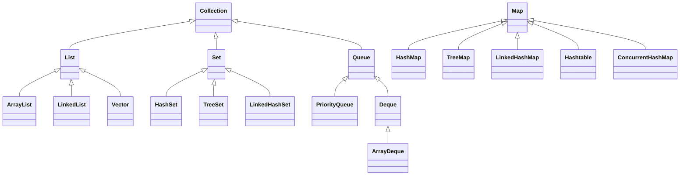

# Java集合与数据结构深度解析

## 目录
- [一、集合框架体系](#一集合框架体系)
- [二、List系列](#二list系列)
- [三、Set系列](#三set系列)
- [四、Map系列](#四map系列)
- [五、Queue系列](#五queue系列)
- [六、数据结构与算法](#六数据结构与算法)
- [七、高频面试题](#七高频面试题)

## 一、集合框架体系

### 1.1 整体架构



### 1.2 接口层次结构

**Collection接口**：
```java
public interface Collection<E> extends Iterable<E> {
    int size();
    boolean isEmpty();
    boolean contains(Object o);
    Iterator<E> iterator();
    Object[] toArray();
    boolean add(E e);
    boolean remove(Object o);
    boolean containsAll(Collection<?> c);
    boolean addAll(Collection<? extends E> c);
    boolean removeAll(Collection<?> c);
    boolean retainAll(Collection<?> c);
    void clear();
}
```

## 二、List系列

### 2.1 ArrayList

**底层实现**：动态数组

```java
public class ArrayList<E> extends AbstractList<E>
        implements List<E>, RandomAccess, Cloneable, java.io.Serializable {
    
    private static final int DEFAULT_CAPACITY = 10;
    transient Object[] elementData;  // 存储元素的数组
    private int size;                // 元素数量
}
```

**扩容机制**：
```java
private void grow(int minCapacity) {
    int oldCapacity = elementData.length;
    int newCapacity = oldCapacity + (oldCapacity >> 1);  // 1.5倍扩容
    if (newCapacity - minCapacity < 0)
        newCapacity = minCapacity;
    if (newCapacity - MAX_ARRAY_SIZE > 0)
        newCapacity = hugeCapacity(minCapacity);
    elementData = Arrays.copyOf(elementData, newCapacity);
}
```

**性能分析**：
| 操作 | 时间复杂度 | 说明 |
|------|-----------|------|
| get(index) | O(1) | 随机访问 |
| add(e) | O(1) 均摊 | 尾部添加，可能扩容 |
| add(index, e) | O(n) | 需要移动元素 |
| remove(index) | O(n) | 需要移动元素 |
| contains(o) | O(n) | 遍历查找 |

### 2.2 LinkedList

**底层实现**：双向链表

```java
public class LinkedList<E> extends AbstractSequentialList<E>
        implements List<E>, Deque<E>, Cloneable, java.io.Serializable {
    
    transient int size = 0;
    transient Node<E> first;  // 头节点
    transient Node<E> last;   // 尾节点
    
    private static class Node<E> {
        E item;
        Node<E> next;
        Node<E> prev;
        
        Node(Node<E> prev, E element, Node<E> next) {
            this.item = element;
            this.next = next;
            this.prev = prev;
        }
    }
}
```

**添加元素**：
```java
void linkLast(E e) {
    final Node<E> l = last;
    final Node<E> newNode = new Node<>(l, e, null);
    last = newNode;
    if (l == null)
        first = newNode;
    else
        l.next = newNode;
    size++;
}
```

**性能分析**：
| 操作 | 时间复杂度 | 说明 |
|------|-----------|------|
| get(index) | O(n) | 需要遍历 |
| add(e) | O(1) | 尾部添加 |
| add(index, e) | O(n) | 需要先定位 |
| remove(index) | O(n) | 需要先定位 |
| addFirst/Last | O(1) | 直接操作头尾 |

### 2.3 ArrayList vs LinkedList

| 特性 | ArrayList | LinkedList |
|------|-----------|------------|
| 底层结构 | 动态数组 | 双向链表 |
| 随机访问 | O(1) | O(n) |
| 插入删除（头部） | O(n) | O(1) |
| 插入删除（尾部） | O(1) | O(1) |
| 内存占用 | 连续内存 | 分散内存 + 额外指针 |
| 适用场景 | 随机访问多 | 频繁插入删除 |

**使用建议**：
```java
// 推荐：随机访问多，插入删除少
List<String> list1 = new ArrayList<>();

// 推荐：频繁头尾插入删除（作为栈或队列使用）
Deque<String> deque = new LinkedList<>();

// 不推荐：LinkedList作为List使用（性能差）
List<String> list2 = new LinkedList<>();  // 避免这样用
```

## 三、Set系列

### 3.1 HashSet

**底层实现**：基于HashMap

```java
public class HashSet<E> extends AbstractSet<E>
        implements Set<E>, Cloneable, java.io.Serializable {
    
    private transient HashMap<E, Object> map;
    private static final Object PRESENT = new Object();
    
    public boolean add(E e) {
        return map.put(e, PRESENT) == null;
    }
    
    public boolean remove(Object o) {
        return map.remove(o) == PRESENT;
    }
}
```

**特点**：
- 无序、不重复
- 允许null
- 非线程安全
- 时间复杂度：O(1)

### 3.2 TreeSet

**底层实现**：基于TreeMap（红黑树）

```java
public class TreeSet<E> extends AbstractSet<E>
        implements NavigableSet<E>, Cloneable, java.io.Serializable {
    
    private transient NavigableMap<E, Object> m;
    
    public TreeSet() {
        this(new TreeMap<E, Object>());
    }
}
```

**特点**：
- 有序（自然排序或自定义Comparator）
- 不允许null
- 时间复杂度：O(log n)

**使用示例**：
```java
// 自然排序
TreeSet<Integer> set1 = new TreeSet<>();
set1.addAll(Arrays.asList(5, 2, 8, 1));
System.out.println(set1);  // [1, 2, 5, 8]

// 自定义排序
TreeSet<String> set2 = new TreeSet<>((a, b) -> b.compareTo(a));
set2.addAll(Arrays.asList("c", "a", "b"));
System.out.println(set2);  // [c, b, a]
```

### 3.3 LinkedHashSet

**底层实现**：基于LinkedHashMap

**特点**：
- 按插入顺序排序
- 其他特性同HashSet

```java
LinkedHashSet<String> set = new LinkedHashSet<>();
set.addAll(Arrays.asList("c", "a", "b"));
System.out.println(set);  // [c, a, b] 保持插入顺序
```

### 3.4 Set选择指南

| 需求 | 选择 |
|------|------|
| 无序、高性能 | HashSet |
| 有序（自然/自定义） | TreeSet |
| 保持插入顺序 | LinkedHashSet |
| 线程安全 | ConcurrentHashMap.newKeySet() |

## 四、Map系列

### 4.1 HashMap

#### 4.1.1 底层结构

**JDK 7**：数组 + 链表
**JDK 8+**：数组 + 链表/红黑树

```java
public class HashMap<K,V> extends AbstractMap<K,V>
        implements Map<K,V>, Cloneable, Serializable {
    
    static final int DEFAULT_INITIAL_CAPACITY = 16;  // 默认容量
    static final float DEFAULT_LOAD_FACTOR = 0.75f;  // 负载因子
    static final int TREEIFY_THRESHOLD = 8;          // 链表转红黑树阈值
    static final int UNTREEIFY_THRESHOLD = 6;        // 红黑树转链表阈值
    
    transient Node<K,V>[] table;  // 哈希桶数组
    transient int size;           // 键值对数量
    int threshold;                // 扩容阈值 = capacity * loadFactor
    
    static class Node<K,V> implements Map.Entry<K,V> {
        final int hash;
        final K key;
        V value;
        Node<K,V> next;
    }
}
```

**结构示意图**：
```
table数组:
+---+     +-------+     +-------+
| 0 | --> | Node1 | --> | Node2 |
+---+     +-------+     +-------+
| 1 | --> null
+---+
| 2 | --> TreeNode (红黑树根节点)
+---+
| 3 | --> | Node3 |
+---+     +-------+
```

#### 4.1.2 核心方法

**hash方法**：
```java
static final int hash(Object key) {
    int h;
    // 高16位异或低16位，减少哈希冲突
    return (key == null) ? 0 : (h = key.hashCode()) ^ (h >>> 16);
}
```

**put方法流程**：
```java
public V put(K key, V value) {
    return putVal(hash(key), key, value, false, true);
}

final V putVal(int hash, K key, V value, boolean onlyIfAbsent, boolean evict) {
    Node<K,V>[] tab; Node<K,V> p; int n, i;
    
    // 1. 如果table为空，进行初始化
    if ((tab = table) == null || (n = tab.length) == 0)
        n = (tab = resize()).length;
    
    // 2. 计算索引位置，如果该位置为空，直接插入
    if ((p = tab[i = (n - 1) & hash]) == null)
        tab[i] = newNode(hash, key, value, null);
    else {
        Node<K,V> e; K k;
        
        // 3. 如果key已存在，直接覆盖
        if (p.hash == hash && ((k = p.key) == key || (key != null && key.equals(k))))
            e = p;
        
        // 4. 如果是红黑树节点，按红黑树方式插入
        else if (p instanceof TreeNode)
            e = ((TreeNode<K,V>)p).putTreeVal(this, tab, hash, key, value);
        
        // 5. 链表插入
        else {
            for (int binCount = 0; ; ++binCount) {
                if ((e = p.next) == null) {
                    p.next = newNode(hash, key, value, null);
                    // 链表长度超过8，转换为红黑树
                    if (binCount >= TREEIFY_THRESHOLD - 1)
                        treeifyBin(tab, hash);
                    break;
                }
                if (e.hash == hash && ((k = e.key) == key || (key != null && key.equals(k))))
                    break;
                p = e;
            }
        }
        
        // 6. 更新value
        if (e != null) {
            V oldValue = e.value;
            if (!onlyIfAbsent || oldValue == null)
                e.value = value;
            return oldValue;
        }
    }
    
    // 7. 判断是否需要扩容
    if (++size > threshold)
        resize();
    
    return null;
}
```

**扩容机制**：
```java
final Node<K,V>[] resize() {
    Node<K,V>[] oldTab = table;
    int oldCap = (oldTab == null) ? 0 : oldTab.length;
    int newCap = oldCap << 1;  // 2倍扩容
    
    Node<K,V>[] newTab = (Node<K,V>[])new Node[newCap];
    table = newTab;
    
    // 重新hash所有元素
    if (oldTab != null) {
        for (int j = 0; j < oldCap; ++j) {
            Node<K,V> e;
            if ((e = oldTab[j]) != null) {
                oldTab[j] = null;
                if (e.next == null)
                    newTab[e.hash & (newCap - 1)] = e;
                else if (e instanceof TreeNode)
                    ((TreeNode<K,V>)e).split(this, newTab, j, oldCap);
                else {
                    // 链表拆分为两个链表
                    Node<K,V> loHead = null, loTail = null;
                    Node<K,V> hiHead = null, hiTail = null;
                    // ...
                }
            }
        }
    }
    return newTab;
}
```

#### 4.1.3 为什么容量必须是2的幂次？

**原因**：
1. 快速取模：`hash & (n-1)` 等价于 `hash % n`
2. 扩容时重新分配更高效

```java
// 如果n=16（0001 0000），n-1=15（0000 1111）
hash & (n - 1)  // 只保留hash的低4位，相当于 hash % 16

// 扩容后n=32（0010 0000），n-1=31（0001 1111）
// 元素要么在原位置，要么在原位置+16
```

### 4.2 TreeMap

**底层实现**：红黑树

```java
public class TreeMap<K,V> extends AbstractMap<K,V>
        implements NavigableMap<K,V>, Cloneable, Serializable {
    
    private final Comparator<? super K> comparator;
    private transient Entry<K,V> root;  // 红黑树根节点
    private transient int size = 0;
    
    static final class Entry<K,V> implements Map.Entry<K,V> {
        K key;
        V value;
        Entry<K,V> left;
        Entry<K,V> right;
        Entry<K,V> parent;
        boolean color = BLACK;
    }
}
```

**特点**：
- 有序（按key排序）
- 基于红黑树，保证O(log n)性能
- 不允许key为null

**红黑树性质**：
1. 每个节点是红色或黑色
2. 根节点是黑色
3. 叶子节点（NIL）是黑色
4. 红色节点的子节点必须是黑色
5. 从任一节点到其叶子节点的所有路径包含相同数量的黑色节点

### 4.3 LinkedHashMap

**底层实现**：HashMap + 双向链表

```java
public class LinkedHashMap<K,V> extends HashMap<K,V> implements Map<K,V> {
    
    transient LinkedHashMap.Entry<K,V> head;  // 链表头
    transient LinkedHashMap.Entry<K,V> tail;  // 链表尾
    final boolean accessOrder;  // true=访问顺序, false=插入顺序
    
    static class Entry<K,V> extends HashMap.Node<K,V> {
        Entry<K,V> before, after;  // 维护顺序的指针
        Entry(int hash, K key, V value, Node<K,V> next) {
            super(hash, key, value, next);
        }
    }
}
```

**LRU缓存实现**：
```java
public class LRUCache<K, V> extends LinkedHashMap<K, V> {
    private final int maxCapacity;
    
    public LRUCache(int maxCapacity) {
        super(16, 0.75f, true);  // accessOrder=true
        this.maxCapacity = maxCapacity;
    }
    
    @Override
    protected boolean removeEldestEntry(Map.Entry<K, V> eldest) {
        return size() > maxCapacity;  // 超过容量时删除最老的
    }
}

// 使用
LRUCache<String, String> cache = new LRUCache<>(3);
cache.put("1", "a");
cache.put("2", "b");
cache.put("3", "c");
cache.get("1");  // 访问1
cache.put("4", "d");  // 插入4，会删除最久未访问的2
System.out.println(cache.keySet());  // [3, 1, 4]
```

### 4.4 Map选择指南

| 需求 | 选择 |
|------|------|
| 无序、高性能 | HashMap |
| 有序（按key） | TreeMap |
| 保持插入顺序 | LinkedHashMap |
| LRU缓存 | LinkedHashMap(accessOrder=true) |
| 线程安全 | ConcurrentHashMap |
| 不允许null | TreeMap, ConcurrentHashMap |

## 五、Queue系列

### 5.1 PriorityQueue

**底层实现**：小顶堆（数组实现）

```java
public class PriorityQueue<E> extends AbstractQueue<E> {
    transient Object[] queue;  // 堆数组
    private int size = 0;
    private final Comparator<? super E> comparator;
}
```

**堆结构**：
```
数组: [1, 2, 3, 4, 5, 6, 7]

二叉树表示:
      1
     / \
    2   3
   / \ / \
  4  5 6  7
  
父节点: i
左子节点: 2*i + 1
右子节点: 2*i + 2
```

**使用示例**：
```java
// 小顶堆（默认）
PriorityQueue<Integer> minHeap = new PriorityQueue<>();
minHeap.addAll(Arrays.asList(5, 2, 8, 1));
System.out.println(minHeap.poll());  // 1

// 大顶堆
PriorityQueue<Integer> maxHeap = new PriorityQueue<>((a, b) -> b - a);
maxHeap.addAll(Arrays.asList(5, 2, 8, 1));
System.out.println(maxHeap.poll());  // 8

// Top K问题
public List<Integer> topK(int[] nums, int k) {
    PriorityQueue<Integer> heap = new PriorityQueue<>(k);
    for (int num : nums) {
        if (heap.size() < k) {
            heap.offer(num);
        } else if (num > heap.peek()) {
            heap.poll();
            heap.offer(num);
        }
    }
    return new ArrayList<>(heap);
}
```

### 5.2 Deque（双端队列）

**ArrayDeque vs LinkedList**：

```java
// ArrayDeque：循环数组实现，性能更好
Deque<String> deque1 = new ArrayDeque<>();

// LinkedList：双向链表实现
Deque<String> deque2 = new LinkedList<>();
```

| 操作 | ArrayDeque | LinkedList |
|------|------------|------------|
| 头部插入/删除 | O(1) 均摊 | O(1) |
| 尾部插入/删除 | O(1) 均摊 | O(1) |
| 随机访问 | 不支持 | O(n) |
| 内存占用 | 连续内存 | 分散 + 指针 |

**作为栈使用**：
```java
Deque<Integer> stack = new ArrayDeque<>();
stack.push(1);
stack.push(2);
System.out.println(stack.pop());  // 2
```

**作为队列使用**：
```java
Deque<Integer> queue = new ArrayDeque<>();
queue.offer(1);
queue.offer(2);
System.out.println(queue.poll());  // 1
```

## 六、数据结构与算法

### 6.1 常见数据结构实现

#### 6.1.1 跳表（SkipList）

```java
public class SkipList<K extends Comparable<K>, V> {
    private static final int MAX_LEVEL = 16;
    private final Node<K, V> head = new Node<>(null, null, MAX_LEVEL);
    private int level = 0;
    
    static class Node<K, V> {
        K key;
        V value;
        Node<K, V>[] forward;
        
        @SuppressWarnings("unchecked")
        Node(K key, V value, int level) {
            this.key = key;
            this.value = value;
            this.forward = new Node[level + 1];
        }
    }
    
    public V search(K key) {
        Node<K, V> current = head;
        for (int i = level; i >= 0; i--) {
            while (current.forward[i] != null && 
                   current.forward[i].key.compareTo(key) < 0) {
                current = current.forward[i];
            }
        }
        current = current.forward[0];
        if (current != null && current.key.equals(key)) {
            return current.value;
        }
        return null;
    }
    
    private int randomLevel() {
        int lvl = 0;
        while (Math.random() < 0.5 && lvl < MAX_LEVEL) {
            lvl++;
        }
        return lvl;
    }
}
```

#### 6.1.2 布隆过滤器

```java
public class BloomFilter {
    private final BitSet bitSet;
    private final int size;
    private final int hashFunctions;
    
    public BloomFilter(int expectedElements, double falsePositiveRate) {
        this.size = optimalSize(expectedElements, falsePositiveRate);
        this.hashFunctions = optimalHashFunctions(size, expectedElements);
        this.bitSet = new BitSet(size);
    }
    
    public void add(String element) {
        for (int i = 0; i < hashFunctions; i++) {
            int hash = hash(element, i);
            bitSet.set(Math.abs(hash % size));
        }
    }
    
    public boolean mightContain(String element) {
        for (int i = 0; i < hashFunctions; i++) {
            int hash = hash(element, i);
            if (!bitSet.get(Math.abs(hash % size))) {
                return false;
            }
        }
        return true;
    }
    
    private int hash(String element, int seed) {
        return element.hashCode() * seed;
    }
    
    private static int optimalSize(int n, double p) {
        return (int) (-n * Math.log(p) / (Math.log(2) * Math.log(2)));
    }
    
    private static int optimalHashFunctions(int m, int n) {
        return Math.max(1, (int) Math.round((double) m / n * Math.log(2)));
    }
}
```

### 6.2 算法题精选

#### 6.2.1 两数之和

```java
public int[] twoSum(int[] nums, int target) {
    Map<Integer, Integer> map = new HashMap<>();
    for (int i = 0; i < nums.length; i++) {
        int complement = target - nums[i];
        if (map.containsKey(complement)) {
            return new int[] { map.get(complement), i };
        }
        map.put(nums[i], i);
    }
    throw new IllegalArgumentException("No solution");
}
```

#### 6.2.2 LRU缓存

```java
public class LRUCache {
    private class Node {
        int key, value;
        Node prev, next;
        Node(int key, int value) {
            this.key = key;
            this.value = value;
        }
    }
    
    private Map<Integer, Node> cache;
    private Node head, tail;
    private int capacity;
    
    public LRUCache(int capacity) {
        this.capacity = capacity;
        this.cache = new HashMap<>();
        this.head = new Node(0, 0);
        this.tail = new Node(0, 0);
        head.next = tail;
        tail.prev = head;
    }
    
    public int get(int key) {
        Node node = cache.get(key);
        if (node == null) return -1;
        moveToHead(node);
        return node.value;
    }
    
    public void put(int key, int value) {
        Node node = cache.get(key);
        if (node != null) {
            node.value = value;
            moveToHead(node);
        } else {
            node = new Node(key, value);
            cache.put(key, node);
            addToHead(node);
            if (cache.size() > capacity) {
                Node removed = removeTail();
                cache.remove(removed.key);
            }
        }
    }
    
    private void addToHead(Node node) {
        node.next = head.next;
        node.prev = head;
        head.next.prev = node;
        head.next = node;
    }
    
    private void removeNode(Node node) {
        node.prev.next = node.next;
        node.next.prev = node.prev;
    }
    
    private void moveToHead(Node node) {
        removeNode(node);
        addToHead(node);
    }
    
    private Node removeTail() {
        Node node = tail.prev;
        removeNode(node);
        return node;
    }
}
```

## 七、高频面试题

### Q1：HashMap和Hashtable的区别？

| 特性 | HashMap | Hashtable |
|------|---------|-----------|
| 线程安全 | 否 | 是（synchronized） |
| null键值 | 允许 | 不允许 |
| 性能 | 高 | 低 |
| 继承 | AbstractMap | Dictionary |
| 推荐 | 是 | 否（已过时） |

### Q2：HashMap的put流程？

1. 计算key的hash值
2. 根据hash值和数组长度确定索引位置
3. 如果位置为空，直接插入
4. 如果位置不为空：
   - key相同，覆盖value
   - 红黑树节点，按树方式插入
   - 链表节点，遍历链表插入，超过8个转红黑树
5. size超过threshold，进行扩容

### Q3：为什么HashMap线程不安全？

**JDK 7死循环问题**：
- 扩容时使用头插法
- 多线程并发扩容可能形成环形链表
- get操作死循环

**JDK 8数据丢失问题**：
```java
// 线程1和线程2同时put
if ((p = tab[i = (n - 1) & hash]) == null)
    tab[i] = newNode(hash, key, value, null);  // 可能覆盖
```

**解决方案**：
- 使用ConcurrentHashMap
- 使用Collections.synchronizedMap()
- 外部加锁

### Q4：ConcurrentHashMap原理？

**JDK 7**：
- Segment数组 + HashEntry数组
- 分段锁，并发度 = Segment数量

**JDK 8**：
- Node数组 + 链表/红黑树
- CAS + synchronized
- 锁粒度更小，只锁头节点

```java
final V putVal(K key, V value, boolean onlyIfAbsent) {
    for (Node<K,V>[] tab = table;;) {
        if ((f = tabAt(tab, i = (n - 1) & hash)) == null) {
            if (casTabAt(tab, i, null, new Node<K,V>(hash, key, value)))
                break;  // CAS成功
        } else {
            synchronized (f) {  // 锁住头节点
                // 插入逻辑
            }
        }
    }
}
```

### Q5：ArrayList和LinkedList的区别？

见 2.3 节对比表。

**面试追问**：
- **Q**: ArrayList扩容机制？
- **A**: 1.5倍扩容，通过Arrays.copyOf()复制到新数组

- **Q**: 如何线程安全？
- **A**: 
  1. Collections.synchronizedList()
  2. CopyOnWriteArrayList
  3. 外部加锁

### Q6：如何实现一个线程安全的ArrayList？

```java
// 方式1：synchronized包装
List<String> list = Collections.synchronizedList(new ArrayList<>());

// 方式2：CopyOnWriteArrayList（读多写少）
List<String> list = new CopyOnWriteArrayList<>();

// 方式3：手动实现
public class SynchronizedArrayList<E> {
    private final List<E> list = new ArrayList<>();
    private final Object lock = new Object();
    
    public boolean add(E e) {
        synchronized (lock) {
            return list.add(e);
        }
    }
    
    public E get(int index) {
        synchronized (lock) {
            return list.get(index);
        }
    }
}
```

### Q7：红黑树和AVL树的区别？

| 特性 | 红黑树 | AVL树 |
|------|--------|-------|
| 平衡条件 | 宽松（最长路径 ≤ 2倍最短路径） | 严格（左右子树高度差 ≤ 1） |
| 插入删除 | O(log n)，旋转少 | O(log n)，旋转多 |
| 查询 | O(log n)，略慢 | O(log n)，更快 |
| 适用场景 | 插入删除频繁（HashMap） | 查询频繁 |

### Q8：如何设计一个HashMap？

**核心要点**：
1. **数组 + 链表/红黑树**结构
2. **hash函数**：高低位异或，减少冲突
3. **扩容**：2倍扩容，重新hash
4. **负载因子**：0.75平衡时间空间
5. **链表转红黑树**：阈值8（泊松分布）

```java
public class MyHashMap<K, V> {
    static final int DEFAULT_CAPACITY = 16;
    static final float LOAD_FACTOR = 0.75f;
    
    static class Node<K, V> {
        final int hash;
        final K key;
        V value;
        Node<K, V> next;
    }
    
    Node<K, V>[] table;
    int size;
    int threshold;
    
    public V put(K key, V value) {
        if (table == null) {
            table = new Node[DEFAULT_CAPACITY];
            threshold = (int) (DEFAULT_CAPACITY * LOAD_FACTOR);
        }
        
        int hash = hash(key);
        int index = (table.length - 1) & hash;
        
        // 查找或插入
        Node<K, V> node = table[index];
        if (node == null) {
            table[index] = new Node<>(hash, key, value, null);
        } else {
            // 遍历链表
            while (true) {
                if (node.key.equals(key)) {
                    node.value = value;
                    return value;
                }
                if (node.next == null) {
                    node.next = new Node<>(hash, key, value, null);
                    break;
                }
                node = node.next;
            }
        }
        
        if (++size > threshold) {
            resize();
        }
        return value;
    }
    
    private int hash(K key) {
        int h = key.hashCode();
        return h ^ (h >>> 16);
    }
    
    private void resize() {
        // 2倍扩容并重新hash
    }
}
```

---

**关键字**：ArrayList、LinkedList、HashMap、TreeMap、ConcurrentHashMap、红黑树、LRU、集合框架

