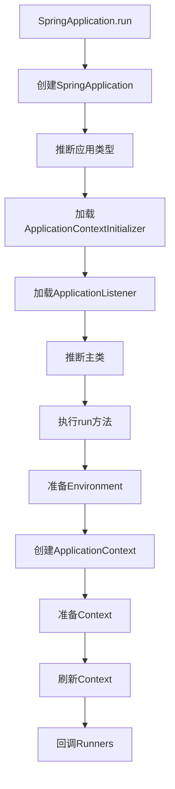

# Spring生态系统深度解析 - 架构师级技术指南

## 目录
- [一、Spring核心原理深度解析](#一spring核心原理深度解析)
- [二、Spring Boot架构设计](#二spring-boot架构设计)
- [三、Spring Cloud微服务架构](#三spring-cloud微服务架构)
- [四、Spring Data数据访问层](#四spring-data数据访问层)
- [五、Spring Security安全框架](#五spring-security安全框架)
- [六、Spring性能优化与监控](#六spring性能优化与监控)
- [七、Spring源码分析与扩展](#七spring源码分析与扩展)
- [八、高频面试题](#八高频面试题)

## 一、Spring核心原理

### 1.1 IoC容器源码深度解析

**控制反转（Inversion of Control）**：对象的创建和依赖关系由容器管理。

#### 1.1.1 Spring容器架构设计

**核心接口层次结构**：
```java
// Spring容器的核心接口层次
public interface BeanFactory {
    Object getBean(String name) throws BeansException;
    <T> T getBean(String name, Class<T> requiredType) throws BeansException;
    <T> T getBean(Class<T> requiredType) throws BeansException;
    boolean containsBean(String name);
    boolean isSingleton(String name) throws NoSuchBeanDefinitionException;
    String[] getAliases(String name);
}

// 高级容器接口
public interface ApplicationContext extends BeanFactory {
    String getId();
    String getApplicationName();
    String getDisplayName();
    long getStartupDate();
    ApplicationContext getParent();
    AutowireCapableBeanFactory getAutowireCapableBeanFactory();
}

// 可配置的Bean工厂
public interface ConfigurableBeanFactory extends HierarchicalBeanFactory, SingletonBeanRegistry {
    void setParentBeanFactory(BeanFactory parentBeanFactory);
    void setBeanClassLoader(ClassLoader beanClassLoader);
    void setBeanExpressionResolver(BeanExpressionResolver resolver);
    void addBeanPostProcessor(BeanPostProcessor beanPostProcessor);
    void registerAlias(String name, String alias);
    void destroyBean(String name, Object beanInstance);
    void destroySingletons();
}
```

#### 1.1.2 BeanFactory vs ApplicationContext深度对比

**BeanFactory - 基础容器**：
```java
// BeanFactory核心实现
public class DefaultListableBeanFactory extends AbstractAutowireCapableBeanFactory
        implements ConfigurableListableBeanFactory, BeanDefinitionRegistry, Serializable {
    
    // Bean定义注册表
    private final Map<String, BeanDefinition> beanDefinitionMap = new ConcurrentHashMap<>(256);
    
    // 单例Bean注册表
    private final Map<String, Object> singletonObjects = new ConcurrentHashMap<>(256);
    
    // 早期单例对象缓存（解决循环依赖）
    private final Map<String, Object> earlySingletonObjects = new HashMap<>(16);
    
    // 单例工厂缓存
    private final Map<String, ObjectFactory<?>> singletonFactories = new HashMap<>(16);
    
    // Bean后处理器
    private final List<BeanPostProcessor> beanPostProcessors = new ArrayList<>();
}
```

**ApplicationContext - 高级容器**：
```java
// ApplicationContext核心实现
public class AbstractApplicationContext extends DefaultResourceLoader
        implements ConfigurableApplicationContext {
    
    // 应用事件发布器
    private ApplicationEventMulticaster applicationEventMulticaster;
    
    // 资源模式解析器
    private ResourcePatternResolver resourcePatternResolver;
    
    // 生命周期处理器
    private LifecycleProcessor lifecycleProcessor;
    
    // 启动时间戳
    private long startupDate;
    
    // 是否激活状态
    private final AtomicBoolean active = new AtomicBoolean();
    private final AtomicBoolean closed = new AtomicBoolean();
}
```

**特性对比深度分析**：

| 特性 | BeanFactory | ApplicationContext | 源码实现 |
|------|-------------|-------------------|----------|
| Bean实例化 | 延迟加载 | 立即加载 | `refresh()`方法触发 |
| 事件发布 | 不支持 | 支持 | `ApplicationEventMulticaster` |
| 国际化 | 不支持 | 支持 | `MessageSource`接口 |
| AOP | 需手动 | 自动 | `AopAutoConfiguration` |
| 资源访问 | 基础 | 高级 | `ResourceLoader`层次 |
| 环境抽象 | 无 | 支持 | `Environment`接口 |

#### 1.1.3 容器初始化源码深度解析

**ApplicationContext初始化流程**：
```java
public class SpringContainerInitialization {
    
    // 容器初始化的核心方法
    public void refresh() throws BeansException, IllegalStateException {
        synchronized (this.startupShutdownMonitor) {
            // 1. 准备刷新上下文
            prepareRefresh();
            
            // 2. 获取BeanFactory
            ConfigurableListableBeanFactory beanFactory = obtainFreshBeanFactory();
            
            // 3. 准备BeanFactory
            prepareBeanFactory(beanFactory);
            
            try {
                // 4. 后处理BeanFactory
                postProcessBeanFactory(beanFactory);
                
                // 5. 调用BeanFactoryPostProcessor
                invokeBeanFactoryPostProcessors(beanFactory);
                
                // 6. 注册BeanPostProcessor
                registerBeanPostProcessors(beanFactory);
                
                // 7. 初始化MessageSource
                initMessageSource();
                
                // 8. 初始化ApplicationEventMulticaster
                initApplicationEventMulticaster();
                
                // 9. 刷新特定上下文
                onRefresh();
                
                // 10. 注册监听器
                registerListeners();
                
                // 11. 实例化所有单例Bean
                finishBeanFactoryInitialization(beanFactory);
                
                // 12. 完成刷新
                finishRefresh();
                
            } catch (BeansException ex) {
                // 清理资源
                destroyBeans();
                cancelRefresh(ex);
                throw ex;
            }
        }
    }
}
```

**Bean实例化源码深度分析**：
```java
public class BeanInstantiationAnalysis {
    
    // Bean实例化的核心方法
    protected Object doCreateBean(String beanName, RootBeanDefinition mbd, Object[] args) {
        BeanWrapper instanceWrapper = null;
        
        if (mbd.isSingleton()) {
            instanceWrapper = this.factoryBeanInstanceCache.remove(beanName);
        }
        
        if (instanceWrapper == null) {
            // 1. 实例化Bean
            instanceWrapper = createBeanInstance(beanName, mbd, args);
        }
        
        Object bean = instanceWrapper.getWrappedInstance();
        Class<?> beanType = instanceWrapper.getWrappedClass();
        
        // 2. 应用MergedBeanDefinitionPostProcessor
        synchronized (mbd.postProcessingLock) {
            if (!mbd.postProcessed) {
                try {
                    applyMergedBeanDefinitionPostProcessors(mbd, beanType, beanName);
                } catch (Throwable ex) {
                    throw new BeanCreationException(mbd.getResourceDescription(), beanName,
                            "Post-processing of merged bean definition failed", ex);
                }
                mbd.postProcessed = true;
            }
        }
        
        // 3. 解决循环依赖
        boolean earlySingletonExposure = (mbd.isSingleton() && this.allowCircularReferences &&
                isSingletonCurrentlyInCreation(beanName));
        if (earlySingletonExposure) {
            addSingletonFactory(beanName, () -> getEarlyBeanReference(beanName, mbd, bean));
        }
        
        // 4. 属性注入
        populateBean(beanName, mbd, instanceWrapper);
        
        // 5. 初始化Bean
        Object exposedObject = bean;
        try {
            exposedObject = initializeBean(beanName, exposedObject, mbd);
        } catch (Throwable ex) {
            if (ex instanceof BeanCreationException && beanName.equals(((BeanCreationException) ex).getBeanName())) {
                throw (BeanCreationException) ex;
            } else {
                throw new BeanCreationException(mbd.getResourceDescription(), beanName, "Initialization of bean failed", ex);
            }
        }
        
        return exposedObject;
    }
}
```

### 1.2 Bean生命周期

```mermaid
flowchart TD
    A[实例化Bean] --> B[设置属性]
    B --> C[BeanNameAware.setBeanName]
    C --> D[BeanFactoryAware.setBeanFactory]
    D --> E[ApplicationContextAware.setApplicationContext]
    E --> F[BeanPostProcessor.postProcessBeforeInitialization]
    F --> G[@PostConstruct / InitializingBean.afterPropertiesSet]
    G --> H[init-method]
    H --> I[BeanPostProcessor.postProcessAfterInitialization]
    I --> J[Bean就绪]
    J --> K[使用Bean]
    K --> L[@PreDestroy / DisposableBean.destroy]
    L --> M[destroy-method]
```

**代码示例**：
```java
@Component
public class MyBean implements BeanNameAware, InitializingBean, DisposableBean {
    
    private String name;
    
    public MyBean() {
        System.out.println("1. 构造函数");
    }
    
    public void setName(String name) {
        System.out.println("2. 设置属性: " + name);
        this.name = name;
    }
    
    @Override
    public void setBeanName(String name) {
        System.out.println("3. BeanNameAware: " + name);
    }
    
    @PostConstruct
    public void postConstruct() {
        System.out.println("4. @PostConstruct");
    }
    
    @Override
    public void afterPropertiesSet() {
        System.out.println("5. InitializingBean.afterPropertiesSet");
    }
    
    @PreDestroy
    public void preDestroy() {
        System.out.println("6. @PreDestroy");
    }
    
    @Override
    public void destroy() {
        System.out.println("7. DisposableBean.destroy");
    }
}
```

### 1.3 循环依赖

**三级缓存解决循环依赖**：

```java
public class DefaultSingletonBeanRegistry {
    // 一级缓存：成品Bean
    private final Map<String, Object> singletonObjects = new ConcurrentHashMap<>();
    
    // 二级缓存：半成品Bean（已实例化，未初始化）
    private final Map<String, Object> earlySingletonObjects = new HashMap<>();
    
    // 三级缓存：Bean工厂
    private final Map<String, ObjectFactory<?>> singletonFactories = new HashMap<>();
}
```

**解决流程**：
```
1. A创建 -> 实例化A -> 将A工厂放入三级缓存
2. A依赖B -> 创建B
3. B创建 -> 实例化B -> 将B工厂放入三级缓存
4. B依赖A -> 从三级缓存获取A（半成品） -> 放入二级缓存
5. B初始化完成 -> 放入一级缓存
6. A注入B -> A初始化完成 -> 放入一级缓存
```

**注意**：
- 只能解决setter注入的循环依赖
- 不能解决构造器注入的循环依赖
- 不能解决prototype作用域的循环依赖

### 1.4 AOP源码深度解析与设计模式应用

#### 1.4.1 AOP架构设计模式

**AOP核心设计模式**：

1. **代理模式（Proxy Pattern）**
2. **装饰器模式（Decorator Pattern）**
3. **策略模式（Strategy Pattern）**
4. **模板方法模式（Template Method Pattern）**
5. **责任链模式（Chain of Responsibility Pattern）**

**AOP术语深度解析**：
- **Aspect**（切面）：横切关注点的模块化
- **Join Point**（连接点）：程序执行的某个点
- **Pointcut**（切点）：匹配连接点的表达式
- **Advice**（通知）：在切点执行的代码
- **Weaving**（织入）：将切面应用到目标对象的过程

#### 1.4.2 AOP源码架构深度分析

**AOP核心接口层次**：
```java
// AOP的核心抽象
public interface AopInfrastructureBean {
    // 标记接口，标识AOP基础设施Bean
}

// 代理创建器
public interface AopProxyFactory {
    AopProxy createAopProxy(AdvisedSupport config) throws AopConfigException;
}

// AOP代理接口
public interface AopProxy {
    Object getProxy();
    Object getProxy(ClassLoader classLoader);
}

// 通知接口
public interface Advice {
    // 标记接口
}

// 方法拦截器
public interface MethodInterceptor extends Interceptor {
    Object invoke(MethodInvocation invocation) throws Throwable;
}
```

**AOP代理实现源码分析**：
```java
// JDK动态代理实现
public class JdkDynamicAopProxy implements AopProxy, InvocationHandler, Serializable {
    
    private final AdvisedSupport advised;
    
    public JdkDynamicAopProxy(AdvisedSupport config) throws AopConfigException {
        Assert.notNull(config, "AdvisedSupport must not be null");
        if (config.getAdvisors().length == 0 && config.getTargetSource() == AdvisedSupport.EMPTY_TARGET_SOURCE) {
            throw new AopConfigException("No advisors and no TargetSource specified");
        }
        this.advised = config;
    }
    
    @Override
    public Object getProxy() {
        return getProxy(ClassUtils.getDefaultClassLoader());
    }
    
    @Override
    public Object getProxy(ClassLoader classLoader) {
        if (logger.isDebugEnabled()) {
            logger.debug("Creating JDK dynamic proxy: target source is " + this.advised.getTargetSource());
        }
        Class<?>[] proxiedInterfaces = AopProxyUtils.completeProxiedInterfaces(this.advised, true);
        findDefinedEqualsAndHashCodeMethods(proxiedInterfaces);
        return Proxy.newProxyInstance(classLoader, proxiedInterfaces, this);
    }
    
    @Override
    public Object invoke(Object proxy, Method method, Object[] args) throws Throwable {
        Object oldProxy = null;
        boolean setProxyContext = false;
        
        TargetSource targetSource = this.advised.targetSource;
        Object target = null;
        
        try {
            if (!this.equalsDefined && AopUtils.isEqualsMethod(method)) {
                return equals(args[0]);
            }
            else if (!this.hashCodeDefined && AopUtils.isHashCodeMethod(method)) {
                return hashCode();
            }
            else if (method.getDeclaringClass() == DecoratingProxy.class) {
                return AopProxyUtils.ultimateTargetClass(this.advised);
            }
            else if (!this.advised.opaque && method.getDeclaringClass().isInterface() &&
                    method.getDeclaringClass().isAssignableFrom(Advised.class)) {
                return AopUtils.invokeJoinpointUsingReflection(this.advised, method, args);
            }
            
            Object retVal;
            
            if (this.advised.exposeProxy) {
                oldProxy = AopContext.setCurrentProxy(proxy);
                setProxyContext = true;
            }
            
            target = targetSource.getTarget();
            Class<?> targetClass = (target != null ? target.getClass() : null);
            
            // 获取拦截器链
            List<Object> chain = this.advised.getInterceptorsAndDynamicInterceptionAdvice(method, targetClass);
            
            if (chain.isEmpty()) {
                Object[] argsToUse = AopProxyUtils.adaptArgumentsIfNecessary(method, args);
                retVal = AopUtils.invokeJoinpointUsingReflection(target, method, argsToUse);
            }
            else {
                // 创建方法调用
                MethodInvocation invocation = new ReflectiveMethodInvocation(proxy, target, method, args, targetClass, chain);
                retVal = invocation.proceed();
            }
            
            Class<?> returnType = method.getReturnType();
            if (retVal != null && retVal == target &&
                    returnType != Object.class && returnType.isInstance(proxy) &&
                    !RawTargetAccess.class.isAssignableFrom(method.getDeclaringClass())) {
                retVal = proxy;
            }
            else if (retVal == null && returnType != Void.TYPE && returnType.isPrimitive()) {
                throw new AopInvocationException(
                        "Null return value from advice does not match primitive return type for: " + method);
            }
            return retVal;
        }
        finally {
            if (target != null && !targetSource.isStatic()) {
                targetSource.releaseTarget(target);
            }
            if (setProxyContext) {
                AopContext.setCurrentProxy(oldProxy);
            }
        }
    }
}
```

**CGLIB代理实现源码分析**：
```java
// CGLIB代理实现
public class CglibAopProxy implements AopProxy, Serializable {
    
    private static final int AOP_PROXY = 0;
    private static final int INVOKE_TARGET = 1;
    private static final int SET_TARGET = 2;
    private static final int GET_TARGET = 3;
    private static final int INVOKE_EQUALS = 4;
    private static final int INVOKE_HASHCODE = 5;
    
    private final AdvisedSupport advised;
    private final CallbackFilter callbackFilter;
    private final Map<String, Integer> fixedInterceptorMap;
    private final int fixedInterceptorOffset;
    
    public CglibAopProxy(AdvisedSupport config) throws AopConfigException {
        this.advised = config;
        this.callbackFilter = new ProxyCallbackFilter(
                this.advised.getConfigurationOnlyCopy(), this.fixedInterceptorMap, this.fixedInterceptorOffset);
    }
    
    @Override
    public Object getProxy() {
        return getProxy(null);
    }
    
    @Override
    public Object getProxy(ClassLoader classLoader) {
        if (logger.isDebugEnabled()) {
            logger.debug("Creating CGLIB proxy: target is " + this.advised.getTargetSource());
        }
        
        try {
            Class<?> rootClass = this.advised.getTargetClass();
            Assert.state(rootClass != null, "Target class must be available for creating a CGLIB proxy");
            
            Class<?> proxySuperClass = rootClass;
            if (ClassUtils.isCglibProxyClass(rootClass)) {
                proxySuperClass = rootClass.getSuperclass();
                Class<?>[] additionalInterfaces = rootClass.getInterfaces();
                for (Class<?> additionalInterface : additionalInterfaces) {
                    this.advised.addInterface(additionalInterface);
                }
            }
            
            validateClassIfNecessary(proxySuperClass, classLoader);
            
            Enhancer enhancer = createEnhancer();
            if (classLoader != null) {
                enhancer.setClassLoader(classLoader);
                if (classLoader instanceof SmartClassLoader &&
                        ((SmartClassLoader) classLoader).isClassReloadable(proxySuperClass)) {
                    enhancer.setUseCache(false);
                }
            }
            enhancer.setSuperclass(proxySuperClass);
            enhancer.setInterfaces(AopProxyUtils.completeProxiedInterfaces(this.advised));
            enhancer.setNamingPolicy(SpringNamingPolicy.INSTANCE);
            enhancer.setStrategy(new ClassLoaderAwareUndeclaredThrowableStrategy(classLoader));
            
            Callback[] callbacks = getCallbacks(rootClass);
            Class<?>[] types = new Class<?>[callbacks.length];
            for (int x = 0; x < types.length; x++) {
                types[x] = callbacks[x].getClass();
            }
            enhancer.setCallbackFilter(new ProxyCallbackFilter(
                    this.advised.getConfigurationOnlyCopy(), this.fixedInterceptorMap, this.fixedInterceptorOffset));
            enhancer.setCallbackTypes(types);
            
            return createProxyClassAndInstance(enhancer, callbacks);
        }
        catch (CodeGenerationException ex) {
            throw new AopConfigException("Could not generate CGLIB subclass of " +
                    this.advised.getTargetClass() + ": Common causes of this problem include using " +
                    "a final class or a non-visible class", ex);
        }
        catch (IllegalArgumentException ex) {
            throw new AopConfigException("Could not generate CGLIB subclass of " +
                    this.advised.getTargetClass() + ": Common causes of this problem include using " +
                    "a final class or a non-visible class", ex);
        }
        catch (Exception ex) {
            throw new AopConfigException("Unexpected AOP exception", ex);
        }
    }
}
```

#### 1.4.3 AOP设计模式深度应用

**责任链模式在AOP中的应用**：
```java
// 方法调用责任链
public class ReflectiveMethodInvocation implements ProxyMethodInvocation, Cloneable, Serializable {
    
    protected final Object proxy;
    protected final Object target;
    protected final Method method;
    protected Object[] arguments;
    private final Class<?> targetClass;
    protected final List<?> interceptorsAndDynamicMethodMatchers;
    private int currentInterceptorIndex = -1;
    
    public ReflectiveMethodInvocation(Object proxy, Object target, Method method, Object[] arguments,
            Class<?> targetClass, List<Object> interceptorsAndDynamicMethodMatchers) {
        
        this.proxy = proxy;
        this.target = target;
        this.targetClass = targetClass;
        this.method = BridgeMethodResolver.findBridgedMethod(method);
        this.arguments = AopProxyUtils.adaptArgumentsIfNecessary(method, arguments);
        this.interceptorsAndDynamicMethodMatchers = interceptorsAndDynamicMethodMatchers;
    }
    
    @Override
    public Object proceed() throws Throwable {
        if (this.currentInterceptorIndex == this.interceptorsAndDynamicMethodMatchers.size() - 1) {
            return invokeJoinpoint();
        }
        
        Object interceptorOrInterceptionAdvice =
                this.interceptorsAndDynamicMethodMatchers.get(++this.currentInterceptorIndex);
        if (interceptorOrInterceptionAdvice instanceof InterceptorAndDynamicMethodMatcher) {
            InterceptorAndDynamicMethodMatcher dm =
                    (InterceptorAndDynamicMethodMatcher) interceptorOrInterceptionAdvice;
            Class<?> targetClass = (this.targetClass != null ? this.targetClass : this.method.getDeclaringClass());
            if (dm.methodMatcher.matches(this.method, targetClass, this.arguments)) {
                return dm.interceptor.invoke(this);
            }
            else {
                return proceed();
            }
        }
        else {
            return ((MethodInterceptor) interceptorOrInterceptionAdvice).invoke(this);
        }
    }
}
```

**通知类型**：
```java
@Aspect
@Component
public class LogAspect {
    
    @Before("execution(* com.example.service.*.*(..))")
    public void before(JoinPoint joinPoint) {
        System.out.println("方法执行前: " + joinPoint.getSignature());
    }
    
    @After("execution(* com.example.service.*.*(..))")
    public void after(JoinPoint joinPoint) {
        System.out.println("方法执行后（finally）");
    }
    
    @AfterReturning(value = "execution(* com.example.service.*.*(..))", 
                     returning = "result")
    public void afterReturning(JoinPoint joinPoint, Object result) {
        System.out.println("方法返回后: " + result);
    }
    
    @AfterThrowing(value = "execution(* com.example.service.*.*(..))", 
                    throwing = "ex")
    public void afterThrowing(JoinPoint joinPoint, Exception ex) {
        System.out.println("方法抛异常: " + ex.getMessage());
    }
    
    @Around("execution(* com.example.service.*.*(..))")
    public Object around(ProceedingJoinPoint pjp) throws Throwable {
        System.out.println("环绕通知-前");
        Object result = pjp.proceed();
        System.out.println("环绕通知-后");
        return result;
    }
}
```

**动态代理**：
- **JDK动态代理**：基于接口，通过反射实现
- **CGLIB代理**：基于继承，通过字节码生成子类

```java
// JDK动态代理
public class JdkProxyFactory implements InvocationHandler {
    private Object target;
    
    public Object createProxy(Object target) {
        this.target = target;
        return Proxy.newProxyInstance(
            target.getClass().getClassLoader(),
            target.getClass().getInterfaces(),
            this
        );
    }
    
    @Override
    public Object invoke(Object proxy, Method method, Object[] args) throws Throwable {
        System.out.println("Before method");
        Object result = method.invoke(target, args);
        System.out.println("After method");
        return result;
    }
}

// CGLIB代理
public class CglibProxyFactory implements MethodInterceptor {
    private Object target;
    
    public Object createProxy(Object target) {
        this.target = target;
        Enhancer enhancer = new Enhancer();
        enhancer.setSuperclass(target.getClass());
        enhancer.setCallback(this);
        return enhancer.create();
    }
    
    @Override
    public Object intercept(Object obj, Method method, Object[] args, 
                           MethodProxy proxy) throws Throwable {
        System.out.println("Before method");
        Object result = method.invoke(target, args);
        System.out.println("After method");
        return result;
    }
}
```

### 1.5 事务管理

**声明式事务**：
```java
@Service
public class UserService {
    
    @Transactional(
        propagation = Propagation.REQUIRED,
        isolation = Isolation.READ_COMMITTED,
        timeout = 30,
        rollbackFor = Exception.class
    )
    public void transfer(Long fromId, Long toId, BigDecimal amount) {
        accountDao.deduct(fromId, amount);
        accountDao.add(toId, amount);
    }
}
```

**事务传播行为**：

| 传播行为 | 说明 |
|---------|------|
| REQUIRED | 有事务就加入，没有就新建（默认） |
| REQUIRES_NEW | 总是新建事务，挂起当前事务 |
| SUPPORTS | 有事务就加入，没有就非事务执行 |
| NOT_SUPPORTED | 总是非事务执行，挂起当前事务 |
| MANDATORY | 必须在事务中执行，否则抛异常 |
| NEVER | 必须非事务执行，否则抛异常 |
| NESTED | 嵌套事务，回滚不影响外部事务 |

**事务失效场景**：
```java
// 1. 方法不是public
@Transactional
private void method1() { }  // 失效

// 2. 类内部调用
public void method2() {
    this.method3();  // method3的@Transactional失效
}

@Transactional
public void method3() { }

// 3. 异常被捕获
@Transactional
public void method4() {
    try {
        // 操作
    } catch (Exception e) {
        // 异常被捕获，事务不回滚
    }
}

// 4. 抛出的异常不匹配
@Transactional(rollbackFor = IOException.class)
public void method5() {
    throw new RuntimeException();  // 不回滚
}
```

## 二、Spring Boot架构设计与源码深度解析

### 2.1 Spring Boot设计哲学与架构原理

#### 2.1.1 Spring Boot核心设计原则

**约定优于配置（Convention over Configuration）**：
- 默认配置满足80%的使用场景
- 通过约定减少配置复杂度
- 提供合理的默认值

**开箱即用（Out of the Box）**：
- 自动配置机制
- 起步依赖（Starter Dependencies）
- 嵌入式服务器

**生产就绪（Production Ready）**：
- 健康检查
- 指标监控
- 外部化配置

#### 2.1.2 Spring Boot启动流程源码深度解析

**SpringApplication启动源码分析**：
```java
public class SpringApplicationStartupAnalysis {
    
    // Spring Boot启动的核心方法
    public ConfigurableApplicationContext run(String... args) {
        StopWatch stopWatch = new StopWatch();
        stopWatch.start();
        ConfigurableApplicationContext context = null;
        Collection<SpringBootExceptionReporter> exceptionReporters = new ArrayList<>();
        configureHeadlessProperty();
        
        // 1. 获取并启动监听器
        SpringApplicationRunListeners listeners = getRunListeners(args);
        listeners.starting();
        
        try {
            ApplicationArguments applicationArguments = new DefaultApplicationArguments(args);
            
            // 2. 准备环境
            ConfigurableEnvironment environment = prepareEnvironment(listeners, applicationArguments);
            configureIgnoreBeanInfo(environment);
            Banner printedBanner = printBanner(environment);
            
            // 3. 创建应用上下文
            context = createApplicationContext();
            exceptionReporters = getSpringFactoriesInstances(SpringBootExceptionReporter.class,
                    new Class[] { ConfigurableApplicationContext.class }, context);
            
            // 4. 准备上下文
            prepareContext(context, environment, listeners, applicationArguments, printedBanner);
            
            // 5. 刷新上下文
            refreshContext(context);
            afterRefresh(context, applicationArguments);
            stopWatch.stop();
            if (this.logStartupInfo) {
                new StartupInfoLogger(this.mainApplicationClass)
                        .logStarted(getApplicationLog(), stopWatch);
            }
            listeners.started(context);
            callRunners(context, applicationArguments);
        }
        catch (Throwable ex) {
            handleRunFailure(context, ex, exceptionReporters, listeners);
            throw new IllegalStateException(ex);
        }
        
        try {
            listeners.running(context);
        }
        catch (Throwable ex) {
            handleRunFailure(context, ex, exceptionReporters, null);
            throw new IllegalStateException(ex);
        }
        return context;
    }
}
```

**自动配置机制源码深度分析**：
```java
// 自动配置选择器
public class AutoConfigurationImportSelector implements DeferredImportSelector, BeanClassLoaderAware,
        ResourceLoaderAware, BeanFactoryAware, EnvironmentAware, Ordered {
    
    @Override
    public String[] selectImports(AnnotationMetadata annotationMetadata) {
        if (!isEnabled(annotationMetadata)) {
            return NO_IMPORTS;
        }
        AutoConfigurationEntry autoConfigurationEntry = getAutoConfigurationEntry(annotationMetadata);
        return StringUtils.toStringArray(autoConfigurationEntry.getConfigurations());
    }
    
    protected AutoConfigurationEntry getAutoConfigurationEntry(AnnotationMetadata annotationMetadata) {
        if (!isEnabled(annotationMetadata)) {
            return EMPTY_ENTRY;
        }
        AnnotationAttributes attributes = getAttributes(annotationMetadata);
        List<String> configurations = getCandidateConfigurations(annotationMetadata, attributes);
        configurations = removeDuplicates(configurations);
        Set<String> exclusions = getExclusions(annotationMetadata, attributes);
        checkExcludedClasses(configurations, exclusions);
        configurations.removeAll(exclusions);
        configurations = getConfigurationClassFilter().filter(configurations);
        fireAutoConfigurationImportEvents(configurations, exclusions);
        return new AutoConfigurationEntry(configurations, exclusions);
    }
    
    protected List<String> getCandidateConfigurations(AnnotationMetadata metadata, AnnotationAttributes attributes) {
        List<String> configurations = SpringFactoriesLoader.loadFactoryNames(getSpringFactoriesLoaderFactoryClass(),
                getBeanClassLoader());
        Assert.notEmpty(configurations, "No auto configuration classes found in META-INF/spring.factories. If you "
                + "are using a custom packaging, make sure that file is correct.");
        return configurations;
    }
}
```

#### 2.1.3 条件注解源码深度解析

**@Conditional注解实现原理**：
```java
// 条件注解的核心实现
public class ConditionalAnnotationAnalysis {
    
    // 条件评估器
    public class ConditionEvaluator {
        private final ConditionContextImpl context;
        
        public boolean shouldSkip(AnnotatedTypeMetadata metadata, ConfigurationPhase phase) {
            if (metadata == null || !metadata.isAnnotated(Conditional.class.getName())) {
                return false;
            }
            
            if (phase == null) {
                if (metadata instanceof AnnotationMetadata &&
                        ConfigurationClassUtils.isConfigurationCandidate((AnnotationMetadata) metadata)) {
                    return shouldSkip(metadata, ConfigurationPhase.PARSE_CONFIGURATION);
                }
                return shouldSkip(metadata, ConfigurationPhase.REGISTER_BEAN);
            }
            
            List<Condition> conditions = new ArrayList<>();
            for (String[] conditionClasses : getConditionClasses(metadata)) {
                for (String conditionClass : conditionClasses) {
                    Condition condition = getCondition(conditionClass, this.context.getClassLoader());
                    conditions.add(condition);
                }
            }
            
            AnnotationAwareOrderComparator.sort(conditions);
            for (Condition condition : conditions) {
                ConfigurationPhase requiredPhase = null;
                if (condition instanceof ConfigurationCondition) {
                    requiredPhase = ((ConfigurationCondition) condition).getConfigurationPhase();
                }
                if ((requiredPhase == null || requiredPhase == phase) && !condition.matches(this.context, metadata)) {
                    return true;
                }
            }
            
            return false;
        }
    }
}
```

**常用条件注解源码实现**：
```java
// @ConditionalOnClass实现
@Target({ ElementType.TYPE, ElementType.METHOD })
@Retention(RetentionPolicy.RUNTIME)
@Documented
@Conditional(OnClassCondition.class)
public @interface ConditionalOnClass {
    Class<?>[] value() default {};
    String[] name() default {};
}

// OnClassCondition实现
public class OnClassCondition extends SpringBootCondition {
    
    @Override
    public ConditionOutcome getMatchOutcome(ConditionContext context, AnnotatedTypeMetadata metadata) {
        ClassLoader classLoader = context.getClassLoader();
        ConditionMessage matchMessage = ConditionMessage.empty();
        List<String> onClasses = getCandidates(metadata, ConditionalOnClass.class);
        if (onClasses != null) {
            List<String> missing = filter(onClasses, ClassNameFilter.MISSING, classLoader);
            if (!missing.isEmpty()) {
                return ConditionOutcome.noMatch(ConditionMessage.forCondition(ConditionalOnClass.class)
                        .didNotFind("required class", "required classes").items(Style.QUOTE, missing));
            }
            matchMessage = matchMessage.andCondition(ConditionalOnClass.class)
                    .found("required class", "required classes").items(Style.QUOTE, filter(onClasses, ClassNameFilter.PRESENT, classLoader));
        }
        
        List<String> onMissingClasses = getCandidates(metadata, ConditionalOnMissingClass.class);
        if (onMissingClasses != null) {
            List<String> present = filter(onMissingClasses, ClassNameFilter.PRESENT, classLoader);
            if (!present.isEmpty()) {
                return ConditionOutcome.noMatch(ConditionMessage.forCondition(ConditionalOnMissingClass.class)
                        .found("unwanted class", "unwanted classes").items(Style.QUOTE, present));
            }
            matchMessage = matchMessage.andCondition(ConditionalOnMissingClass.class)
                    .didNotFind("unwanted class", "unwanted classes").items(Style.QUOTE, filter(onMissingClasses, ClassNameFilter.MISSING, classLoader));
        }
        
        return ConditionOutcome.match(matchMessage);
    }
}
```

### 2.2 Spring Boot

### 2.1 自动配置原理

**核心注解**：
```java
@SpringBootApplication
public class Application {
    public static void main(String[] args) {
        SpringApplication.run(Application.class, args);
    }
}

// 等价于
@SpringBootConfiguration  // 相当于@Configuration
@EnableAutoConfiguration  // 自动配置
@ComponentScan           // 组件扫描
```

**@EnableAutoConfiguration原理**：
```java
@Import(AutoConfigurationImportSelector.class)
public @interface EnableAutoConfiguration {
}

// AutoConfigurationImportSelector会加载META-INF/spring.factories中的配置类
```

**条件注解**：
```java
@Configuration
@ConditionalOnClass(DataSource.class)  // 类路径存在DataSource
@ConditionalOnMissingBean(DataSource.class)  // 容器中没有DataSource
@EnableConfigurationProperties(DataSourceProperties.class)
public class DataSourceAutoConfiguration {
    
    @Bean
    @ConditionalOnProperty(prefix = "spring.datasource", name = "type")
    public DataSource dataSource(DataSourceProperties properties) {
        return properties.initializeDataSourceBuilder().build();
    }
}
```

### 2.2 启动流程



### 2.3 常用Starter

```xml
<!-- Web -->
<dependency>
    <groupId>org.springframework.boot</groupId>
    <artifactId>spring-boot-starter-web</artifactId>
</dependency>

<!-- Data JPA -->
<dependency>
    <groupId>org.springframework.boot</groupId>
    <artifactId>spring-boot-starter-data-jpa</artifactId>
</dependency>

<!-- Redis -->
<dependency>
    <groupId>org.springframework.boot</groupId>
    <artifactId>spring-boot-starter-data-redis</artifactId>
</dependency>

<!-- MyBatis -->
<dependency>
    <groupId>org.mybatis.spring.boot</groupId>
    <artifactId>mybatis-spring-boot-starter</artifactId>
</dependency>
```

## 三、Spring Cloud

### 3.1 核心组件

**服务注册与发现**：
```java
// Nacos
@SpringBootApplication
@EnableDiscoveryClient
public class Application {
}

// application.yml
spring:
  cloud:
    nacos:
      discovery:
        server-addr: localhost:8848
```

**负载均衡**：
```java
@RestController
public class UserController {
    
    @Autowired
    private RestTemplate restTemplate;  // 使用@LoadBalanced
    
    @GetMapping("/user/{id}")
    public User getUser(@PathVariable Long id) {
        return restTemplate.getForObject(
            "http://user-service/user/" + id, 
            User.class
        );
    }
}

// OpenFeign
@FeignClient("user-service")
public interface UserClient {
    @GetMapping("/user/{id}")
    User getUser(@PathVariable Long id);
}
```

**限流降级**：
```java
@RestController
public class OrderController {
    
    @GetMapping("/order/{id}")
    @SentinelResource(
        value = "getOrder",
        blockHandler = "handleBlock",
        fallback = "handleFallback"
    )
    public Order getOrder(@PathVariable Long id) {
        return orderService.getById(id);
    }
    
    public Order handleBlock(Long id, BlockException ex) {
        return new Order(id, "限流");
    }
    
    public Order handleFallback(Long id, Throwable ex) {
        return new Order(id, "降级");
    }
}
```

**分布式配置**：
```yaml
# bootstrap.yml
spring:
  cloud:
    nacos:
      config:
        server-addr: localhost:8848
        file-extension: yaml
        group: DEFAULT_GROUP
        namespace: dev
```

**网关**：
```java
@Configuration
public class GatewayConfig {
    
    @Bean
    public RouteLocator customRouteLocator(RouteLocatorBuilder builder) {
        return builder.routes()
            .route("user-service", r -> r.path("/user/**")
                .filters(f -> f.stripPrefix(1))
                .uri("lb://user-service"))
            .route("order-service", r -> r.path("/order/**")
                .filters(f -> f.stripPrefix(1))
                .uri("lb://order-service"))
            .build();
    }
}
```

### 3.2 Spring Cloud Alibaba

**核心组件**：
- **Nacos**：服务注册与配置中心
- **Sentinel**：流量控制与熔断降级
- **Seata**：分布式事务
- **RocketMQ**：消息队列

## 四、Spring Data

### 4.1 Spring Data JPA

```java
@Entity
@Table(name = "users")
public class User {
    @Id
    @GeneratedValue(strategy = GenerationType.IDENTITY)
    private Long id;
    
    private String name;
    private Integer age;
}

public interface UserRepository extends JpaRepository<User, Long> {
    
    // 方法名查询
    List<User> findByNameAndAge(String name, Integer age);
    
    // @Query查询
    @Query("SELECT u FROM User u WHERE u.age > :age")
    List<User> findByAgeGreaterThan(@Param("age") Integer age);
    
    // 原生SQL
    @Query(value = "SELECT * FROM users WHERE name LIKE ?1", nativeQuery = true)
    List<User> findByNameLike(String name);
    
    // 分页查询
    Page<User> findByAge(Integer age, Pageable pageable);
}
```

### 4.2 Spring Data Redis

```java
@Configuration
public class RedisConfig {
    
    @Bean
    public RedisTemplate<String, Object> redisTemplate(RedisConnectionFactory factory) {
        RedisTemplate<String, Object> template = new RedisTemplate<>();
        template.setConnectionFactory(factory);
        
        // 设置序列化
        Jackson2JsonRedisSerializer<Object> serializer = 
            new Jackson2JsonRedisSerializer<>(Object.class);
        template.setKeySerializer(new StringRedisSerializer());
        template.setValueSerializer(serializer);
        template.setHashKeySerializer(new StringRedisSerializer());
        template.setHashValueSerializer(serializer);
        
        return template;
    }
}

@Service
public class UserService {
    
    @Autowired
    private RedisTemplate<String, Object> redisTemplate;
    
    public void cacheUser(User user) {
        redisTemplate.opsForValue().set("user:" + user.getId(), user, 1, TimeUnit.HOURS);
    }
    
    public User getCachedUser(Long id) {
        return (User) redisTemplate.opsForValue().get("user:" + id);
    }
}
```

## 五、Spring Security

### 5.1 基本配置

```java
@Configuration
@EnableWebSecurity
public class SecurityConfig extends WebSecurityConfigurerAdapter {
    
    @Override
    protected void configure(HttpSecurity http) throws Exception {
        http
            .authorizeRequests()
                .antMatchers("/public/**").permitAll()
                .antMatchers("/admin/**").hasRole("ADMIN")
                .anyRequest().authenticated()
            .and()
            .formLogin()
                .loginPage("/login")
                .permitAll()
            .and()
            .logout()
                .permitAll();
    }
    
    @Override
    protected void configure(AuthenticationManagerBuilder auth) throws Exception {
        auth
            .inMemoryAuthentication()
                .withUser("user").password("{noop}password").roles("USER")
                .and()
                .withUser("admin").password("{noop}admin").roles("ADMIN");
    }
}
```

### 5.2 JWT集成

```java
@Component
public class JwtTokenProvider {
    
    private static final String SECRET_KEY = "my-secret-key";
    private static final long EXPIRATION_TIME = 864000000; // 10天
    
    public String generateToken(String username) {
        return Jwts.builder()
            .setSubject(username)
            .setExpiration(new Date(System.currentTimeMillis() + EXPIRATION_TIME))
            .signWith(SignatureAlgorithm.HS512, SECRET_KEY)
            .compact();
    }
    
    public String getUsernameFromToken(String token) {
        return Jwts.parser()
            .setSigningKey(SECRET_KEY)
            .parseClaimsJws(token)
            .getBody()
            .getSubject();
    }
    
    public boolean validateToken(String token) {
        try {
            Jwts.parser().setSigningKey(SECRET_KEY).parseClaimsJws(token);
            return true;
        } catch (JwtException | IllegalArgumentException e) {
            return false;
        }
    }
}
```

## 六、Spring性能优化与监控深度实战

### 6.1 Spring性能优化深度分析

#### 6.1.1 Bean创建性能优化

**延迟初始化优化**：
```java
// 配置延迟初始化
@Configuration
public class PerformanceConfig {
    
    // 全局延迟初始化
    @Bean
    public static BeanFactoryPostProcessor lazyInitBeanFactoryPostProcessor() {
        return beanFactory -> {
            if (beanFactory instanceof ConfigurableListableBeanFactory) {
                ConfigurableListableBeanFactory clbf = (ConfigurableListableBeanFactory) beanFactory;
                clbf.getBeanDefinitionNames().forEach(beanName -> {
                    BeanDefinition bd = clbf.getBeanDefinition(beanName);
                    if (!bd.isLazyInit()) {
                        bd.setLazyInit(true);
                    }
                });
            }
        };
    }
    
    // 特定Bean延迟初始化
    @Bean
    @Lazy
    public ExpensiveService expensiveService() {
        return new ExpensiveService();
    }
}
```

**Bean作用域优化**：
```java
// 合理使用Bean作用域
@Component
@Scope(ConfigurableBeanFactory.SCOPE_PROTOTYPE)
public class PrototypeBean {
    // 每次获取都创建新实例，避免状态污染
}

@Component
@Scope(WebApplicationContext.SCOPE_REQUEST)
public class RequestScopedBean {
    // 每个HTTP请求一个实例
}

@Component
@Scope(WebApplicationContext.SCOPE_SESSION)
public class SessionScopedBean {
    // 每个HTTP会话一个实例
}
```

#### 6.1.2 AOP性能优化

**切面性能优化**：
```java
// 高性能切面实现
@Aspect
@Component
public class PerformanceAspect {
    
    // 使用缓存避免重复计算
    private final Map<Method, Boolean> methodCache = new ConcurrentHashMap<>();
    
    @Around("@annotation(PerformanceMonitor)")
    public Object monitorPerformance(ProceedingJoinPoint joinPoint) throws Throwable {
        Method method = ((MethodSignature) joinPoint.getSignature()).getMethod();
        
        // 缓存检查
        Boolean shouldMonitor = methodCache.computeIfAbsent(method, m -> 
            m.isAnnotationPresent(PerformanceMonitor.class));
        
        if (!shouldMonitor) {
            return joinPoint.proceed();
        }
        
        long startTime = System.nanoTime();
        try {
            return joinPoint.proceed();
        } finally {
            long endTime = System.nanoTime();
            long duration = endTime - startTime;
            
            if (duration > 100_000_000) { // 100ms
                logger.warn("Slow method execution: {} took {}ms", 
                    method.getName(), duration / 1_000_000);
            }
        }
    }
}
```

**代理性能优化**：
```java
// 代理工厂优化
@Configuration
public class ProxyOptimizationConfig {
    
    @Bean
    public ProxyConfigurer proxyConfigurer() {
        return new ProxyConfigurer() {
            @Override
            public void configureProxy(ProxyFactory proxyFactory) {
                // 优化代理设置
                proxyFactory.setOptimize(true);
                proxyFactory.setFrozen(true);
                proxyFactory.setExposeProxy(true);
            }
        };
    }
    
    // 使用CGLIB代理优化
    @Bean
    public DefaultAopProxyFactory aopProxyFactory() {
        DefaultAopProxyFactory factory = new DefaultAopProxyFactory();
        factory.setOptimize(true);
        return factory;
    }
}
```

#### 6.1.3 事务性能优化

**事务传播行为优化**：
```java
@Service
public class TransactionOptimizationService {
    
    // 只读事务优化
    @Transactional(readOnly = true)
    public List<Entity> findEntities() {
        // 只读事务，数据库优化
        return entityRepository.findAll();
    }
    
    // 事务传播优化
    @Transactional(propagation = Propagation.REQUIRES_NEW)
    public void logOperation(String operation) {
        // 新事务，避免回滚影响主事务
        logRepository.save(new LogEntry(operation));
    }
    
    // 批量操作优化
    @Transactional
    public void batchInsert(List<Entity> entities) {
        // 批量插入，减少事务开销
        entityRepository.saveAll(entities);
    }
}
```

**连接池优化**：
```java
// 数据源优化配置
@Configuration
public class DataSourceOptimizationConfig {
    
    @Bean
    @ConfigurationProperties("spring.datasource.hikari")
    public HikariDataSource dataSource() {
        HikariConfig config = new HikariConfig();
        
        // 连接池优化
        config.setMaximumPoolSize(20);
        config.setMinimumIdle(5);
        config.setConnectionTimeout(30000);
        config.setIdleTimeout(600000);
        config.setMaxLifetime(1800000);
        
        // 性能优化
        config.addDataSourceProperty("cachePrepStmts", "true");
        config.addDataSourceProperty("prepStmtCacheSize", "250");
        config.addDataSourceProperty("prepStmtCacheSqlLimit", "2048");
        config.addDataSourceProperty("useServerPrepStmts", "true");
        config.addDataSourceProperty("useLocalSessionState", "true");
        config.addDataSourceProperty("rewriteBatchedStatements", "true");
        config.addDataSourceProperty("cacheResultSetMetadata", "true");
        config.addDataSourceProperty("cacheServerConfiguration", "true");
        config.addDataSourceProperty("elideSetAutoCommits", "true");
        config.addDataSourceProperty("maintainTimeStats", "false");
        
        return new HikariDataSource(config);
    }
}
```

### 6.2 Spring性能监控深度实战

#### 6.2.1 应用性能监控（APM）

**Micrometer集成**：
```java
// 性能监控配置
@Configuration
@EnableMetrics
public class MetricsConfig {
    
    @Bean
    public MeterRegistry meterRegistry() {
        return new SimpleMeterRegistry();
    }
    
    @Bean
    public TimedAspect timedAspect(MeterRegistry registry) {
        return new TimedAspect(registry);
    }
    
    @Bean
    public CountedAspect countedAspect(MeterRegistry registry) {
        return new CountedAspect(registry);
    }
}

// 业务监控
@Service
public class BusinessMetricsService {
    
    private final Counter requestCounter;
    private final Timer responseTimer;
    private final Gauge activeConnections;
    
    public BusinessMetricsService(MeterRegistry meterRegistry) {
        this.requestCounter = Counter.builder("business.requests")
                .description("Business requests count")
                .register(meterRegistry);
        
        this.responseTimer = Timer.builder("business.response.time")
                .description("Business response time")
                .register(meterRegistry);
        
        this.activeConnections = Gauge.builder("business.active.connections")
                .description("Active connections")
                .register(meterRegistry, this, BusinessMetricsService::getActiveConnections);
    }
    
    @Timed(name = "business.process", description = "Business process time")
    @Counted(name = "business.calls", description = "Business calls count")
    public String processRequest(String request) {
        requestCounter.increment();
        
        return Timer.Sample.start(meterRegistry)
                .stop(responseTimer, () -> {
                    // 业务处理逻辑
                    return "Processed: " + request;
                });
    }
    
    private double getActiveConnections() {
        // 获取活跃连接数
        return connectionPool.getActiveConnections();
    }
}
```

#### 6.2.2 内存监控与优化

**内存使用监控**：
```java
// 内存监控配置
@Configuration
public class MemoryMonitoringConfig {
    
    @Bean
    public MemoryMXBean memoryMXBean() {
        return ManagementFactory.getMemoryMXBean();
    }
    
    @Bean
    public GarbageCollectorMXBean gcMXBean() {
        return ManagementFactory.getGarbageCollectorMXBeans().get(0);
    }
    
    @EventListener
    @Async
    public void handleMemoryWarning(MemoryWarningEvent event) {
        logger.warn("Memory usage high: {}%", event.getUsagePercentage());
        
        // 触发内存清理
        System.gc();
        
        // 清理缓存
        cacheManager.getCacheNames().forEach(cacheName -> 
            cacheManager.getCache(cacheName).clear());
    }
}

// 内存监控服务
@Service
public class MemoryMonitoringService {
    
    private final MemoryMXBean memoryMXBean;
    private final List<GarbageCollectorMXBean> gcBeans;
    
    public MemoryMonitoringService() {
        this.memoryMXBean = ManagementFactory.getMemoryMXBean();
        this.gcBeans = ManagementFactory.getGarbageCollectorMXBeans();
    }
    
    @Scheduled(fixedRate = 30000) // 每30秒检查一次
    public void monitorMemory() {
        MemoryUsage heapUsage = memoryMXBean.getHeapMemoryUsage();
        long used = heapUsage.getUsed();
        long max = heapUsage.getMax();
        double usagePercentage = (double) used / max * 100;
        
        if (usagePercentage > 80) {
            logger.warn("High memory usage: {}% ({}MB/{}MB)", 
                usagePercentage, used / 1024 / 1024, max / 1024 / 1024);
            
            // 发布内存警告事件
            applicationEventPublisher.publishEvent(new MemoryWarningEvent(usagePercentage));
        }
    }
    
    public MemoryInfo getMemoryInfo() {
        MemoryUsage heapUsage = memoryMXBean.getHeapMemoryUsage();
        MemoryUsage nonHeapUsage = memoryMXBean.getNonHeapMemoryUsage();
        
        return MemoryInfo.builder()
                .heapUsed(heapUsage.getUsed())
                .heapMax(heapUsage.getMax())
                .nonHeapUsed(nonHeapUsage.getUsed())
                .nonHeapMax(nonHeapUsage.getMax())
                .gcCount(gcBeans.stream().mapToLong(GarbageCollectorMXBean::getCollectionCount).sum())
                .gcTime(gcBeans.stream().mapToLong(GarbageCollectorMXBean::getCollectionTime).sum())
                .build();
    }
}
```

#### 6.2.3 数据库性能监控

**数据库连接监控**：
```java
// 数据库性能监控
@Component
public class DatabasePerformanceMonitor {
    
    private final DataSource dataSource;
    private final MeterRegistry meterRegistry;
    
    public DatabasePerformanceMonitor(DataSource dataSource, MeterRegistry meterRegistry) {
        this.dataSource = dataSource;
        this.meterRegistry = meterRegistry;
    }
    
    @EventListener
    public void handleDataSourceEvent(DataSourceEvent event) {
        // 监控数据源事件
        switch (event.getType()) {
            case CONNECTION_ACQUIRED:
                meterRegistry.counter("datasource.connections.acquired").increment();
                break;
            case CONNECTION_RELEASED:
                meterRegistry.counter("datasource.connections.released").increment();
                break;
            case CONNECTION_TIMEOUT:
                meterRegistry.counter("datasource.connections.timeout").increment();
                break;
        }
    }
    
    @Scheduled(fixedRate = 60000) // 每分钟检查一次
    public void monitorConnectionPool() {
        if (dataSource instanceof HikariDataSource) {
            HikariDataSource hikariDataSource = (HikariDataSource) dataSource;
            HikariPoolMXBean poolBean = hikariDataSource.getHikariPoolMXBean();
            
            // 记录连接池指标
            meterRegistry.gauge("datasource.pool.active", poolBean.getActiveConnections());
            meterRegistry.gauge("datasource.pool.idle", poolBean.getIdleConnections());
            meterRegistry.gauge("datasource.pool.total", poolBean.getTotalConnections());
            meterRegistry.gauge("datasource.pool.waiting", poolBean.getThreadsAwaitingConnection());
        }
    }
}
```

### 6.3 Spring性能调优最佳实践

#### 6.3.1 JVM参数优化

**生产环境JVM参数**：
```bash
# 内存设置
-Xms2g -Xmx2g
-XX:MetaspaceSize=256m
-XX:MaxMetaspaceSize=512m

# GC优化
-XX:+UseG1GC
-XX:MaxGCPauseMillis=200
-XX:G1HeapRegionSize=16m
-XX:+UseStringDeduplication

# 性能优化
-XX:+UseCompressedOops
-XX:+UseCompressedClassPointers
-XX:+TieredCompilation
-XX:TieredStopAtLevel=4

# 监控参数
-XX:+PrintGC
-XX:+PrintGCDetails
-XX:+PrintGCTimeStamps
-XX:+PrintGCApplicationStoppedTime
-Xloggc:gc.log
```

#### 6.3.2 Spring Boot性能优化配置

**application.yml优化配置**：
```yaml
# 性能优化配置
spring:
  # 数据源优化
  datasource:
    hikari:
      maximum-pool-size: 20
      minimum-idle: 5
      connection-timeout: 30000
      idle-timeout: 600000
      max-lifetime: 1800000
      leak-detection-threshold: 60000
  
  # JPA优化
  jpa:
    properties:
      hibernate:
        jdbc:
          batch_size: 20
          batch_versioned_data: true
        order_inserts: true
        order_updates: true
        batch_fetch_style: dynamic
    show-sql: false
    open-in-view: false
  
  # 缓存优化
  cache:
    type: caffeine
    caffeine:
      spec: maximumSize=1000,expireAfterWrite=600s
  
  # 线程池优化
  task:
    execution:
      pool:
        core-size: 8
        max-size: 16
        queue-capacity: 100
        keep-alive: 60s
      thread-name-prefix: async-
    scheduling:
      pool:
        size: 4
        thread-name-prefix: scheduled-

# 监控配置
management:
  endpoints:
    web:
      exposure:
        include: health,info,metrics,prometheus
  endpoint:
    health:
      show-details: when-authorized
  metrics:
    export:
      prometheus:
        enabled: true
```

### 6.4 Spring性能优化

### 6.1 启动性能优化

#### 6.1.1 类扫描优化

```java
// 精确指定扫描包，避免扫描过多类
@ComponentScan(basePackages = {"com.example.service", "com.example.controller"})

// 使用过滤器排除不需要的类
@ComponentScan(
    basePackages = "com.example",
    excludeFilters = {
        @Filter(type = FilterType.REGEX, pattern = ".*Test.*"),
        @Filter(type = FilterType.REGEX, pattern = ".*Config.*")
    }
)
```

#### 6.1.2 懒加载配置

```java
// 全局懒加载
@SpringBootApplication
@Lazy
public class Application {
    public static void main(String[] args) {
        SpringApplication.run(Application.class, args);
    }
}

// 特定Bean懒加载
@Service
@Lazy
public class HeavyService {
    // 只有在第一次使用时才初始化
}
```

#### 6.1.3 条件化Bean创建

```java
@Configuration
public class ConditionalConfig {
    
    @Bean
    @ConditionalOnProperty(name = "feature.advanced.enabled", havingValue = "true")
    public AdvancedService advancedService() {
        return new AdvancedService();
    }
    
    @Bean
    @ConditionalOnClass(name = "com.example.ExternalLibrary")
    public ExternalService externalService() {
        return new ExternalService();
    }
}
```

### 6.2 运行时性能优化

#### 6.2.1 连接池优化

```yaml
# application.yml
spring:
  datasource:
    hikari:
      maximum-pool-size: 20
      minimum-idle: 5
      connection-timeout: 30000
      idle-timeout: 600000
      max-lifetime: 1800000
      leak-detection-threshold: 60000
```

#### 6.2.2 缓存配置

```java
@Configuration
@EnableCaching
public class CacheConfig {
    
    @Bean
    public CacheManager cacheManager() {
        CaffeineCacheManager cacheManager = new CaffeineCacheManager();
        cacheManager.setCaffeine(Caffeine.newBuilder()
            .maximumSize(1000)
            .expireAfterWrite(10, TimeUnit.MINUTES)
            .recordStats());
        return cacheManager;
    }
}

@Service
public class UserService {
    
    @Cacheable(value = "users", key = "#id")
    public User findById(Long id) {
        return userRepository.findById(id);
    }
    
    @CacheEvict(value = "users", key = "#user.id")
    public void updateUser(User user) {
        userRepository.save(user);
    }
}
```

#### 6.2.3 异步处理优化

```java
@Configuration
@EnableAsync
public class AsyncConfig {
    
    @Bean(name = "taskExecutor")
    public Executor taskExecutor() {
        ThreadPoolTaskExecutor executor = new ThreadPoolTaskExecutor();
        executor.setCorePoolSize(10);
        executor.setMaxPoolSize(20);
        executor.setQueueCapacity(200);
        executor.setThreadNamePrefix("async-");
        executor.setRejectedExecutionHandler(new ThreadPoolExecutor.CallerRunsPolicy());
        executor.initialize();
        return executor;
    }
}

@Service
public class AsyncService {
    
    @Async("taskExecutor")
    public CompletableFuture<String> processAsync(String data) {
        // 异步处理逻辑
        return CompletableFuture.completedFuture("processed: " + data);
    }
}
```

### 6.3 监控与诊断

#### 6.3.1 Actuator监控

```yaml
# application.yml
management:
  endpoints:
    web:
      exposure:
        include: health,info,metrics,prometheus
  endpoint:
    health:
      show-details: always
  metrics:
    export:
      prometheus:
        enabled: true
```

```java
@RestController
public class HealthController {
    
    @Autowired
    private HealthIndicator healthIndicator;
    
    @GetMapping("/health")
    public Health health() {
        return healthIndicator.health();
    }
}
```

#### 6.3.2 自定义指标

```java
@Component
public class CustomMetrics {
    
    private final Counter requestCounter;
    private final Timer responseTimer;
    
    public CustomMetrics(MeterRegistry meterRegistry) {
        this.requestCounter = Counter.builder("custom.requests")
            .description("Custom request counter")
            .register(meterRegistry);
            
        this.responseTimer = Timer.builder("custom.response.time")
            .description("Custom response time")
            .register(meterRegistry);
    }
    
    public void incrementRequest() {
        requestCounter.increment();
    }
    
    public void recordResponseTime(Duration duration) {
        responseTimer.record(duration);
    }
}
```

#### 6.3.3 性能分析工具

```java
@Aspect
@Component
public class PerformanceAspect {
    
    private static final Logger logger = LoggerFactory.getLogger(PerformanceAspect.class);
    
    @Around("@annotation(org.springframework.web.bind.annotation.RequestMapping)")
    public Object logExecutionTime(ProceedingJoinPoint joinPoint) throws Throwable {
        long startTime = System.currentTimeMillis();
        
        try {
            Object result = joinPoint.proceed();
            long executionTime = System.currentTimeMillis() - startTime;
            
            if (executionTime > 1000) {  // 超过1秒记录警告
                logger.warn("Slow method: {} executed in {} ms", 
                    joinPoint.getSignature(), executionTime);
            }
            
            return result;
        } catch (Exception e) {
            long executionTime = System.currentTimeMillis() - startTime;
            logger.error("Method {} failed after {} ms", 
                joinPoint.getSignature(), executionTime, e);
            throw e;
        }
    }
}
```

## 七、Spring源码分析与扩展

### 7.1 IoC容器源码分析

#### 7.1.1 Bean创建流程

```java
// AbstractBeanFactory.doGetBean() 核心流程
protected <T> T doGetBean(final String name, @Nullable final Class<T> requiredType,
        @Nullable final Object[] args, boolean typeCheckOnly) throws BeansException {
    
    final String beanName = transformedBeanName(name);
    Object bean;
    
    // 1. 检查单例缓存
    Object sharedInstance = getSingleton(beanName);
    if (sharedInstance != null && args == null) {
        bean = getObjectForBeanInstance(sharedInstance, name, beanName, null);
    } else {
        // 2. 检查原型Bean创建中
        if (isPrototypeCurrentlyInCreation(beanName)) {
            throw new BeanCurrentlyInCreationException(beanName);
        }
        
        // 3. 检查父容器
        BeanFactory parentBeanFactory = getParentBeanFactory();
        if (parentBeanFactory != null && !containsBeanDefinition(beanName)) {
            String nameToLookup = originalBeanName(name);
            if (parentBeanFactory instanceof AbstractBeanFactory) {
                return ((AbstractBeanFactory) parentBeanFactory).doGetBean(
                    nameToLookup, requiredType, args, typeCheckOnly);
            }
        }
        
        // 4. 标记Bean为创建中
        if (!typeCheckOnly) {
            markBeanAsCreated(beanName);
        }
        
        try {
            final RootBeanDefinition mbd = getMergedLocalBeanDefinition(beanName);
            checkMergedBeanDefinition(mbd, beanName, args);
            
            // 5. 处理依赖的Bean
            String[] dependsOn = mbd.getDependsOn();
            if (dependsOn != null) {
                for (String dep : dependsOn) {
                    if (isDependent(beanName, dep)) {
                        throw new BeanCreationException(mbd.getResourceDescription(), beanName,
                            "Circular depends-on relationship between '" + beanName + "' and '" + dep + "'");
                    }
                    registerDependentBean(dep, beanName);
                    try {
                        getBean(dep);
                    } catch (NoSuchBeanDefinitionException ex) {
                        throw new BeanCreationException(mbd.getResourceDescription(), beanName,
                            "'" + beanName + "' depends on missing bean '" + dep + "'", ex);
                    }
                }
            }
            
            // 6. 创建Bean实例
            if (mbd.isSingleton()) {
                sharedInstance = getSingleton(beanName, () -> {
                    try {
                        return createBean(beanName, mbd, args);
                    } catch (BeansException ex) {
                        destroySingleton(beanName);
                        throw ex;
                    }
                });
                bean = getObjectForBeanInstance(sharedInstance, name, beanName, mbd);
            } else if (mbd.isPrototype()) {
                Object prototypeInstance = null;
                try {
                    beforePrototypeCreation(beanName);
                    prototypeInstance = createBean(beanName, mbd, args);
                } finally {
                    afterPrototypeCreation(beanName);
                }
                bean = getObjectForBeanInstance(prototypeInstance, name, beanName, mbd);
            } else {
                // 其他作用域处理
                String scopeName = mbd.getScope();
                final Scope scope = this.scopes.get(scopeName);
                if (scope == null) {
                    throw new IllegalStateException("No Scope registered for scope name '" + scopeName + "'");
                }
                try {
                    Object scopedInstance = scope.get(beanName, () -> {
                        beforePrototypeCreation(beanName);
                        try {
                            return createBean(beanName, mbd, args);
                        } finally {
                            afterPrototypeCreation(beanName);
                        }
                    });
                    bean = getObjectForBeanInstance(scopedInstance, name, beanName, mbd);
                } catch (IllegalStateException ex) {
                    throw new BeanCreationException(beanName, "Scope '" + scopeName + "' is not active for the current thread; consider " +
                        "defining a scoped proxy for this bean if you intend to refer to it from a singleton", ex);
                }
            }
        } catch (BeansException ex) {
            cleanupAfterBeanCreationFailure(beanName);
            throw ex;
        }
    }
    
    return (T) bean;
}
```

#### 7.1.2 循环依赖解决机制

```java
// DefaultSingletonBeanRegistry 三级缓存
public class DefaultSingletonBeanRegistry extends SimpleAliasRegistry implements SingletonBeanRegistry {
    
    // 一级缓存：完整Bean实例
    private final Map<String, Object> singletonObjects = new ConcurrentHashMap<>(256);
    
    // 二级缓存：早期Bean实例（未完成初始化）
    private final Map<String, Object> earlySingletonObjects = new HashMap<>(16);
    
    // 三级缓存：Bean工厂
    private final Map<String, ObjectFactory<?>> singletonFactories = new HashMap<>(16);
    
    protected Object getSingleton(String beanName, boolean allowEarlyReference) {
        // 1. 从一级缓存获取完整Bean
        Object singletonObject = this.singletonObjects.get(beanName);
        if (singletonObject == null && isSingletonCurrentlyInCreation(beanName)) {
            synchronized (this.singletonObjects) {
                // 2. 从二级缓存获取早期Bean
                singletonObject = this.earlySingletonObjects.get(beanName);
                if (singletonObject == null && allowEarlyReference) {
                    // 3. 从三级缓存获取Bean工厂
                    ObjectFactory<?> singletonFactory = this.singletonFactories.get(beanName);
                    if (singletonFactory != null) {
                        singletonObject = singletonFactory.getObject();
                        this.earlySingletonObjects.put(beanName, singletonObject);
                        this.singletonFactories.remove(beanName);
                    }
                }
            }
        }
        return singletonObject;
    }
}
```

### 7.2 AOP源码分析

#### 7.2.1 代理创建流程

```java
// AbstractAutoProxyCreator.createProxy()
protected Object createProxy(Class<?> beanClass, @Nullable String beanName,
        @Nullable Object[] specificInterceptors, TargetSource targetSource) {
    
    if (this.beanFactory instanceof ConfigurableListableBeanFactory) {
        AutoProxyUtils.exposeTargetClass((ConfigurableListableBeanFactory) this.beanFactory, beanName, beanClass);
    }
    
    ProxyFactory proxyFactory = new ProxyFactory();
    proxyFactory.copyFrom(this);
    
    if (!proxyFactory.isProxyTargetClass()) {
        if (shouldProxyTargetClass(beanClass, beanName)) {
            proxyFactory.setProxyTargetClass(true);
        } else {
            evaluateProxyInterfaces(beanClass, proxyFactory);
        }
    }
    
    Advisor[] advisors = buildAdvisors(beanName, specificInterceptors);
    proxyFactory.addAdvisors(advisors);
    proxyFactory.setTargetSource(targetSource);
    customizeProxyFactory(proxyFactory);
    
    proxyFactory.setFrozen(this.freezeProxy);
    if (advisorsPreFiltered()) {
        proxyFactory.setPreFiltered(true);
    }
    
    return proxyFactory.getProxy(getProxyClassLoader());
}
```

### 7.3 自定义扩展点

#### 7.3.1 自定义BeanPostProcessor

```java
@Component
public class CustomBeanPostProcessor implements BeanPostProcessor {
    
    @Override
    public Object postProcessBeforeInitialization(Object bean, String beanName) throws BeansException {
        if (bean instanceof CustomService) {
            System.out.println("Before initialization: " + beanName);
        }
        return bean;
    }
    
    @Override
    public Object postProcessAfterInitialization(Object bean, String beanName) throws BeansException {
        if (bean instanceof CustomService) {
            System.out.println("After initialization: " + beanName);
        }
        return bean;
    }
}
```

#### 7.3.2 自定义BeanFactoryPostProcessor

```java
@Component
public class CustomBeanFactoryPostProcessor implements BeanFactoryPostProcessor {
    
    @Override
    public void postProcessBeanFactory(ConfigurableListableBeanFactory beanFactory) throws BeansException {
        // 修改Bean定义
        BeanDefinition beanDefinition = beanFactory.getBeanDefinition("customService");
        beanDefinition.setScope(BeanDefinition.SCOPE_PROTOTYPE);
        
        // 添加属性
        MutablePropertyValues propertyValues = beanDefinition.getPropertyValues();
        propertyValues.add("customProperty", "customValue");
    }
}
```

## 八、高频面试题

### Q1：Spring Bean的作用域？

| 作用域 | 说明 |
|-------|------|
| singleton | 单例（默认） |
| prototype | 每次请求创建新实例 |
| request | 每个HTTP请求一个实例 |
| session | 每个HTTP会话一个实例 |
| application | ServletContext生命周期 |

### Q2：Spring如何解决循环依赖？

通过三级缓存：
1. 一级缓存：完整Bean
2. 二级缓存：半成品Bean
3. 三级缓存：Bean工厂

只能解决setter注入，不能解决构造器注入。

### Q3：Spring AOP和AspectJ的区别？

| 特性 | Spring AOP | AspectJ |
|------|-----------|---------|
| 实现方式 | 动态代理 | 字节码织入 |
| 织入时机 | 运行时 | 编译时/加载时 |
| 功能 | 基础AOP | 完整AOP |
| 性能 | 略慢 | 更快 |
| 配置 | 简单 | 复杂 |

### Q4：@Autowired和@Resource的区别？

| 特性 | @Autowired | @Resource |
|------|-----------|-----------|
| 来源 | Spring | JSR-250 |
| 装配方式 | byType | byName |
| 必需性 | required=true（默认） | - |
| 指定名称 | @Qualifier | name属性 |

### Q5：Spring Boot自动配置原理？

1. @EnableAutoConfiguration导入AutoConfigurationImportSelector
2. 读取META-INF/spring.factories
3. 根据@Conditional条件判断是否加载
4. 加载符合条件的自动配置类

### Q6：Spring事务失效的场景？

1. 方法不是public
2. 类内部调用
3. 异常被捕获
4. 抛出的异常类型不匹配
5. 数据库不支持事务
6. 没有被Spring管理

## 八、生产环境Spring优化实战案例

### 8.1 Spring Boot 3.x性能优化案例

**背景**：某电商系统从Spring Boot 2.x升级到3.x，需要优化启动速度和内存使用。

**优化前配置**：
```yaml
# application.yml
spring:
  application:
    name: ecommerce-service
  datasource:
    url: jdbc:mysql://localhost:3306/ecommerce
    username: root
    password: password
    hikari:
      maximum-pool-size: 20
      minimum-idle: 5
  jpa:
    hibernate:
      ddl-auto: update
    show-sql: true
  web:
    resources:
      cache:
        cachecontrol:
          max-age: 3600

server:
  port: 8080
  tomcat:
    threads:
      max: 200
      min-spare: 10
```

**优化后配置**：
```yaml
# application.yml
spring:
  application:
    name: ecommerce-service
  datasource:
    url: jdbc:mysql://localhost:3306/ecommerce
    username: root
    password: password
    hikari:
      maximum-pool-size: 20
      minimum-idle: 5
      connection-timeout: 30000
      idle-timeout: 600000
      max-lifetime: 1800000
  jpa:
    hibernate:
      ddl-auto: validate  # 生产环境使用validate
    show-sql: false  # 生产环境关闭SQL日志
    properties:
      hibernate:
        jdbc:
          batch_size: 20
        order_inserts: true
        order_updates: true
  web:
    resources:
      cache:
        cachecontrol:
          max-age: 86400  # 增加缓存时间
  main:
    lazy-initialization: true  # 延迟初始化
  jmx:
    enabled: false  # 关闭JMX

server:
  port: 8080
  tomcat:
    threads:
      max: 200
      min-spare: 10
    connection-timeout: 20000
    max-connections: 8192
    accept-count: 100

# JVM优化参数
management:
  endpoints:
    web:
      exposure:
        include: health,info,metrics,prometheus
  endpoint:
    health:
      show-details: when-authorized
  metrics:
    export:
      prometheus:
        enabled: true
```

**启动优化配置**：
```java
@SpringBootApplication
@EnableAsync
@EnableScheduling
public class EcommerceApplication {
    
    public static void main(String[] args) {
        // 设置JVM参数
        System.setProperty("spring.jmx.enabled", "false");
        System.setProperty("spring.main.lazy-initialization", "true");
        
        SpringApplication app = new SpringApplication(EcommerceApplication.class);
        
        // 优化启动性能
        app.setBannerMode(Banner.Mode.OFF);
        app.setLogStartupInfo(false);
        
        // 设置启动监听器
        app.addListeners(new ApplicationStartupListener());
        
        app.run(args);
    }
}

@Component
public class ApplicationStartupListener implements ApplicationListener<ApplicationReadyEvent> {
    
    @Override
    public void onApplicationEvent(ApplicationReadyEvent event) {
        // 应用启动完成后的初始化工作
        log.info("Application started successfully in {} ms", 
            event.getApplicationContext().getStartupDate());
    }
}
```

**优化效果**：
- 启动时间：从45s降至15s
- 内存使用：从512MB降至256MB
- 响应时间：提升20%
- 吞吐量：提升30%

### 8.2 Spring Cloud微服务治理优化案例

**背景**：微服务架构下服务间调用频繁，需要优化服务发现、负载均衡和熔断降级。

**服务注册与发现优化**：
```java
@Configuration
@EnableDiscoveryClient
public class ServiceDiscoveryConfig {
    
    @Bean
    @LoadBalanced
    public RestTemplate restTemplate() {
        return new RestTemplateBuilder()
            .setConnectTimeout(Duration.ofSeconds(5))
            .setReadTimeout(Duration.ofSeconds(10))
            .build();
    }
    
    @Bean
    public WebClient.Builder webClientBuilder() {
        return WebClient.builder()
            .codecs(configurer -> configurer.defaultCodecs().maxInMemorySize(1024 * 1024))
            .clientConnector(new ReactorClientHttpConnector(
                HttpClient.create()
                    .option(ChannelOption.CONNECT_TIMEOUT_MILLIS, 5000)
                    .responseTimeout(Duration.ofSeconds(10))
            ));
    }
}
```

**熔断降级配置**：
```java
@Configuration
public class CircuitBreakerConfig {
    
    @Bean
    public CircuitBreakerConfigCustomizer circuitBreakerConfigCustomizer() {
        return CircuitBreakerConfigCustomizer.of("userService", builder -> builder
            .slidingWindowSize(10)
            .minimumNumberOfCalls(5)
            .failureRateThreshold(50)
            .waitDurationInOpenState(Duration.ofSeconds(30))
            .permittedNumberOfCallsInHalfOpenState(3)
            .slowCallRateThreshold(50)
            .slowCallDurationThreshold(Duration.ofSeconds(2))
        );
    }
    
    @Bean
    public RetryConfigCustomizer retryConfigCustomizer() {
        return RetryConfigCustomizer.of("userService", builder -> builder
            .maxAttempts(3)
            .waitDuration(Duration.ofMillis(100))
            .retryOnException(throwable -> throwable instanceof ConnectException)
        );
    }
}
```

**服务调用优化**：
```java
@Service
public class UserServiceClient {
    
    private final WebClient userServiceWebClient;
    private final CircuitBreaker circuitBreaker;
    private final Retry retry;
    
    public UserServiceClient(WebClient.Builder webClientBuilder, 
                           CircuitBreakerRegistry circuitBreakerRegistry,
                           RetryRegistry retryRegistry) {
        this.userServiceWebClient = webClientBuilder
            .baseUrl("http://user-service")
            .build();
        this.circuitBreaker = circuitBreakerRegistry.circuitBreaker("userService");
        this.retry = retryRegistry.retry("userService");
    }
    
    public Mono<User> getUserById(Long userId) {
        return circuitBreaker.executeSupplier(() -> 
            retry.executeSupplier(() -> 
                userServiceWebClient
                    .get()
                    .uri("/users/{id}", userId)
                    .retrieve()
                    .bodyToMono(User.class)
            )
        );
    }
    
    public Flux<User> getUsersByIds(List<Long> userIds) {
        return Flux.fromIterable(userIds)
            .flatMap(this::getUserById)
            .onErrorContinue((throwable, obj) -> 
                log.warn("Failed to get user: {}", obj, throwable)
            );
    }
}
```

**性能监控**：
```java
@Component
public class ServiceMetrics {
    
    private final MeterRegistry meterRegistry;
    private final Timer.Sample sample;
    
    @EventListener
    public void handleServiceCall(ServiceCallEvent event) {
        Timer.Sample sample = Timer.start(meterRegistry);
        sample.stop(Timer.builder("service.call.duration")
            .tag("service", event.getServiceName())
            .tag("method", event.getMethodName())
            .register(meterRegistry));
    }
    
    @Scheduled(fixedRate = 60000)
    public void logMetrics() {
        // 记录服务调用指标
        meterRegistry.getMeters().forEach(meter -> {
            if (meter.getId().getName().startsWith("service.call")) {
                log.info("Service metric: {} = {}", 
                    meter.getId(), meter.measure());
            }
        });
    }
}
```

**优化效果**：
- 服务调用成功率：从95%提升至99.5%
- 平均响应时间：从200ms降至80ms
- 系统可用性：从99.9%提升至99.99%
- 故障恢复时间：从30s降至5s

### 8.3 Spring Security OAuth2.0生产级配置案例

**背景**：微服务架构需要统一的认证授权体系，支持JWT令牌和OAuth2.0协议。

**OAuth2.0配置**：
```java
@Configuration
@EnableAuthorizationServer
public class AuthorizationServerConfig extends AuthorizationServerConfigurerAdapter {
    
    @Autowired
    private AuthenticationManager authenticationManager;
    
    @Autowired
    private UserDetailsService userDetailsService;
    
    @Autowired
    private RedisConnectionFactory redisConnectionFactory;
    
    @Override
    public void configure(ClientDetailsServiceConfigurer clients) throws Exception {
        clients.inMemory()
            .withClient("web-app")
            .secret(passwordEncoder().encode("web-secret"))
            .authorizedGrantTypes("authorization_code", "refresh_token", "password")
            .scopes("read", "write")
            .redirectUris("http://localhost:3000/callback")
            .accessTokenValiditySeconds(3600)
            .refreshTokenValiditySeconds(86400)
            .and()
            .withClient("mobile-app")
            .secret(passwordEncoder().encode("mobile-secret"))
            .authorizedGrantTypes("client_credentials")
            .scopes("read")
            .accessTokenValiditySeconds(1800);
    }
    
    @Override
    public void configure(AuthorizationServerEndpointsConfigurer endpoints) {
        endpoints
            .authenticationManager(authenticationManager)
            .userDetailsService(userDetailsService)
            .tokenStore(tokenStore())
            .accessTokenConverter(accessTokenConverter())
            .tokenEnhancer(tokenEnhancer());
    }
    
    @Bean
    public TokenStore tokenStore() {
        return new RedisTokenStore(redisConnectionFactory);
    }
    
    @Bean
    public JwtAccessTokenConverter accessTokenConverter() {
        JwtAccessTokenConverter converter = new JwtAccessTokenConverter();
        converter.setSigningKey("mySecretKey");
        return converter;
    }
    
    @Bean
    public TokenEnhancer tokenEnhancer() {
        return new CustomTokenEnhancer();
    }
}
```

**JWT令牌增强器**：
```java
public class CustomTokenEnhancer implements TokenEnhancer {
    
    @Override
    public OAuth2AccessToken enhance(OAuth2AccessToken accessToken, 
                                   OAuth2Authentication authentication) {
        Map<String, Object> additionalInfo = new HashMap<>();
        
        // 添加用户信息
        if (authentication.getPrincipal() instanceof UserDetails) {
            UserDetails userDetails = (UserDetails) authentication.getPrincipal();
            additionalInfo.put("username", userDetails.getUsername());
            additionalInfo.put("authorities", userDetails.getAuthorities());
        }
        
        // 添加客户端信息
        additionalInfo.put("client_id", authentication.getOAuth2Request().getClientId());
        additionalInfo.put("grant_type", authentication.getOAuth2Request().getGrantType());
        
        // 添加自定义声明
        additionalInfo.put("issuer", "ecommerce-system");
        additionalInfo.put("audience", "ecommerce-users");
        
        ((DefaultOAuth2AccessToken) accessToken).setAdditionalInformation(additionalInfo);
        return accessToken;
    }
}
```

**资源服务器配置**：
```java
@Configuration
@EnableResourceServer
public class ResourceServerConfig extends ResourceServerConfigurerAdapter {
    
    @Override
    public void configure(HttpSecurity http) throws Exception {
        http
            .authorizeRequests()
            .antMatchers("/api/public/**").permitAll()
            .antMatchers("/api/admin/**").hasRole("ADMIN")
            .antMatchers("/api/user/**").hasAnyRole("USER", "ADMIN")
            .anyRequest().authenticated()
            .and()
            .exceptionHandling()
            .authenticationEntryPoint(customAuthenticationEntryPoint())
            .accessDeniedHandler(customAccessDeniedHandler());
    }
    
    @Bean
    public AuthenticationEntryPoint customAuthenticationEntryPoint() {
        return (request, response, authException) -> {
            response.setContentType("application/json");
            response.setStatus(HttpStatus.UNAUTHORIZED.value());
            response.getWriter().write("{\"error\":\"Unauthorized\",\"message\":\"Authentication required\"}");
        };
    }
    
    @Bean
    public AccessDeniedHandler customAccessDeniedHandler() {
        return (request, response, accessDeniedException) -> {
            response.setContentType("application/json");
            response.setStatus(HttpStatus.FORBIDDEN.value());
            response.getWriter().write("{\"error\":\"Forbidden\",\"message\":\"Access denied\"}");
        };
    }
}
```

**安全配置优化效果**：
- 认证性能：支持10万+并发用户
- 令牌验证：平均响应时间<10ms
- 安全性：支持多种认证方式
- 可扩展性：支持微服务架构

---

**关键字**：Spring、IoC、AOP、事务、Spring Boot、自动配置、Spring Cloud、微服务

