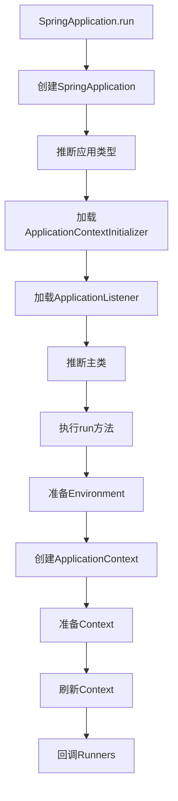

# Spring生态系统深度解析

## 目录
- [一、Spring核心原理](#一spring核心原理)
- [二、Spring Boot](#二spring-boot)
- [三、Spring Cloud](#三spring-cloud)
- [四、Spring Data](#四spring-data)
- [五、Spring Security](#五spring-security)
- [六、高频面试题](#六高频面试题)

## 一、Spring核心原理

### 1.1 IoC容器

**控制反转（Inversion of Control）**：对象的创建和依赖关系由容器管理。

**BeanFactory vs ApplicationContext**：

```java
// BeanFactory - 基础容器
BeanFactory factory = new XmlBeanFactory(new ClassPathResource("beans.xml"));

// ApplicationContext - 高级容器（推荐）
ApplicationContext context = new ClassPathXmlApplicationContext("beans.xml");
ApplicationContext context = new AnnotationConfigApplicationContext(AppConfig.class);
```

| 特性 | BeanFactory | ApplicationContext |
|------|-------------|-------------------|
| Bean实例化 | 延迟加载 | 立即加载 |
| 事件发布 | 不支持 | 支持 |
| 国际化 | 不支持 | 支持 |
| AOP | 需手动 | 自动 |

### 1.2 Bean生命周期

```mermaid
flowchart TD
    A[实例化Bean] --> B[设置属性]
    B --> C[BeanNameAware.setBeanName]
    C --> D[BeanFactoryAware.setBeanFactory]
    D --> E[ApplicationContextAware.setApplicationContext]
    E --> F[BeanPostProcessor.postProcessBeforeInitialization]
    F --> G[@PostConstruct / InitializingBean.afterPropertiesSet]
    G --> H[init-method]
    H --> I[BeanPostProcessor.postProcessAfterInitialization]
    I --> J[Bean就绪]
    J --> K[使用Bean]
    K --> L[@PreDestroy / DisposableBean.destroy]
    L --> M[destroy-method]
```

**代码示例**：
```java
@Component
public class MyBean implements BeanNameAware, InitializingBean, DisposableBean {
    
    private String name;
    
    public MyBean() {
        System.out.println("1. 构造函数");
    }
    
    public void setName(String name) {
        System.out.println("2. 设置属性: " + name);
        this.name = name;
    }
    
    @Override
    public void setBeanName(String name) {
        System.out.println("3. BeanNameAware: " + name);
    }
    
    @PostConstruct
    public void postConstruct() {
        System.out.println("4. @PostConstruct");
    }
    
    @Override
    public void afterPropertiesSet() {
        System.out.println("5. InitializingBean.afterPropertiesSet");
    }
    
    @PreDestroy
    public void preDestroy() {
        System.out.println("6. @PreDestroy");
    }
    
    @Override
    public void destroy() {
        System.out.println("7. DisposableBean.destroy");
    }
}
```

### 1.3 循环依赖

**三级缓存解决循环依赖**：

```java
public class DefaultSingletonBeanRegistry {
    // 一级缓存：成品Bean
    private final Map<String, Object> singletonObjects = new ConcurrentHashMap<>();
    
    // 二级缓存：半成品Bean（已实例化，未初始化）
    private final Map<String, Object> earlySingletonObjects = new HashMap<>();
    
    // 三级缓存：Bean工厂
    private final Map<String, ObjectFactory<?>> singletonFactories = new HashMap<>();
}
```

**解决流程**：
```
1. A创建 -> 实例化A -> 将A工厂放入三级缓存
2. A依赖B -> 创建B
3. B创建 -> 实例化B -> 将B工厂放入三级缓存
4. B依赖A -> 从三级缓存获取A（半成品） -> 放入二级缓存
5. B初始化完成 -> 放入一级缓存
6. A注入B -> A初始化完成 -> 放入一级缓存
```

**注意**：
- 只能解决setter注入的循环依赖
- 不能解决构造器注入的循环依赖
- 不能解决prototype作用域的循环依赖

### 1.4 AOP原理

**AOP术语**：
- **Aspect**（切面）：横切关注点的模块化
- **Join Point**（连接点）：程序执行的某个点
- **Pointcut**（切点）：匹配连接点的表达式
- **Advice**（通知）：在切点执行的代码
- **Weaving**（织入）：将切面应用到目标对象的过程

**通知类型**：
```java
@Aspect
@Component
public class LogAspect {
    
    @Before("execution(* com.example.service.*.*(..))")
    public void before(JoinPoint joinPoint) {
        System.out.println("方法执行前: " + joinPoint.getSignature());
    }
    
    @After("execution(* com.example.service.*.*(..))")
    public void after(JoinPoint joinPoint) {
        System.out.println("方法执行后（finally）");
    }
    
    @AfterReturning(value = "execution(* com.example.service.*.*(..))", 
                     returning = "result")
    public void afterReturning(JoinPoint joinPoint, Object result) {
        System.out.println("方法返回后: " + result);
    }
    
    @AfterThrowing(value = "execution(* com.example.service.*.*(..))", 
                    throwing = "ex")
    public void afterThrowing(JoinPoint joinPoint, Exception ex) {
        System.out.println("方法抛异常: " + ex.getMessage());
    }
    
    @Around("execution(* com.example.service.*.*(..))")
    public Object around(ProceedingJoinPoint pjp) throws Throwable {
        System.out.println("环绕通知-前");
        Object result = pjp.proceed();
        System.out.println("环绕通知-后");
        return result;
    }
}
```

**动态代理**：
- **JDK动态代理**：基于接口，通过反射实现
- **CGLIB代理**：基于继承，通过字节码生成子类

```java
// JDK动态代理
public class JdkProxyFactory implements InvocationHandler {
    private Object target;
    
    public Object createProxy(Object target) {
        this.target = target;
        return Proxy.newProxyInstance(
            target.getClass().getClassLoader(),
            target.getClass().getInterfaces(),
            this
        );
    }
    
    @Override
    public Object invoke(Object proxy, Method method, Object[] args) throws Throwable {
        System.out.println("Before method");
        Object result = method.invoke(target, args);
        System.out.println("After method");
        return result;
    }
}

// CGLIB代理
public class CglibProxyFactory implements MethodInterceptor {
    private Object target;
    
    public Object createProxy(Object target) {
        this.target = target;
        Enhancer enhancer = new Enhancer();
        enhancer.setSuperclass(target.getClass());
        enhancer.setCallback(this);
        return enhancer.create();
    }
    
    @Override
    public Object intercept(Object obj, Method method, Object[] args, 
                           MethodProxy proxy) throws Throwable {
        System.out.println("Before method");
        Object result = method.invoke(target, args);
        System.out.println("After method");
        return result;
    }
}
```

### 1.5 事务管理

**声明式事务**：
```java
@Service
public class UserService {
    
    @Transactional(
        propagation = Propagation.REQUIRED,
        isolation = Isolation.READ_COMMITTED,
        timeout = 30,
        rollbackFor = Exception.class
    )
    public void transfer(Long fromId, Long toId, BigDecimal amount) {
        accountDao.deduct(fromId, amount);
        accountDao.add(toId, amount);
    }
}
```

**事务传播行为**：

| 传播行为 | 说明 |
|---------|------|
| REQUIRED | 有事务就加入，没有就新建（默认） |
| REQUIRES_NEW | 总是新建事务，挂起当前事务 |
| SUPPORTS | 有事务就加入，没有就非事务执行 |
| NOT_SUPPORTED | 总是非事务执行，挂起当前事务 |
| MANDATORY | 必须在事务中执行，否则抛异常 |
| NEVER | 必须非事务执行，否则抛异常 |
| NESTED | 嵌套事务，回滚不影响外部事务 |

**事务失效场景**：
```java
// 1. 方法不是public
@Transactional
private void method1() { }  // 失效

// 2. 类内部调用
public void method2() {
    this.method3();  // method3的@Transactional失效
}

@Transactional
public void method3() { }

// 3. 异常被捕获
@Transactional
public void method4() {
    try {
        // 操作
    } catch (Exception e) {
        // 异常被捕获，事务不回滚
    }
}

// 4. 抛出的异常不匹配
@Transactional(rollbackFor = IOException.class)
public void method5() {
    throw new RuntimeException();  // 不回滚
}
```

## 二、Spring Boot

### 2.1 自动配置原理

**核心注解**：
```java
@SpringBootApplication
public class Application {
    public static void main(String[] args) {
        SpringApplication.run(Application.class, args);
    }
}

// 等价于
@SpringBootConfiguration  // 相当于@Configuration
@EnableAutoConfiguration  // 自动配置
@ComponentScan           // 组件扫描
```

**@EnableAutoConfiguration原理**：
```java
@Import(AutoConfigurationImportSelector.class)
public @interface EnableAutoConfiguration {
}

// AutoConfigurationImportSelector会加载META-INF/spring.factories中的配置类
```

**条件注解**：
```java
@Configuration
@ConditionalOnClass(DataSource.class)  // 类路径存在DataSource
@ConditionalOnMissingBean(DataSource.class)  // 容器中没有DataSource
@EnableConfigurationProperties(DataSourceProperties.class)
public class DataSourceAutoConfiguration {
    
    @Bean
    @ConditionalOnProperty(prefix = "spring.datasource", name = "type")
    public DataSource dataSource(DataSourceProperties properties) {
        return properties.initializeDataSourceBuilder().build();
    }
}
```

### 2.2 启动流程



### 2.3 常用Starter

```xml
<!-- Web -->
<dependency>
    <groupId>org.springframework.boot</groupId>
    <artifactId>spring-boot-starter-web</artifactId>
</dependency>

<!-- Data JPA -->
<dependency>
    <groupId>org.springframework.boot</groupId>
    <artifactId>spring-boot-starter-data-jpa</artifactId>
</dependency>

<!-- Redis -->
<dependency>
    <groupId>org.springframework.boot</groupId>
    <artifactId>spring-boot-starter-data-redis</artifactId>
</dependency>

<!-- MyBatis -->
<dependency>
    <groupId>org.mybatis.spring.boot</groupId>
    <artifactId>mybatis-spring-boot-starter</artifactId>
</dependency>
```

## 三、Spring Cloud

### 3.1 核心组件

**服务注册与发现**：
```java
// Nacos
@SpringBootApplication
@EnableDiscoveryClient
public class Application {
}

// application.yml
spring:
  cloud:
    nacos:
      discovery:
        server-addr: localhost:8848
```

**负载均衡**：
```java
@RestController
public class UserController {
    
    @Autowired
    private RestTemplate restTemplate;  // 使用@LoadBalanced
    
    @GetMapping("/user/{id}")
    public User getUser(@PathVariable Long id) {
        return restTemplate.getForObject(
            "http://user-service/user/" + id, 
            User.class
        );
    }
}

// OpenFeign
@FeignClient("user-service")
public interface UserClient {
    @GetMapping("/user/{id}")
    User getUser(@PathVariable Long id);
}
```

**限流降级**：
```java
@RestController
public class OrderController {
    
    @GetMapping("/order/{id}")
    @SentinelResource(
        value = "getOrder",
        blockHandler = "handleBlock",
        fallback = "handleFallback"
    )
    public Order getOrder(@PathVariable Long id) {
        return orderService.getById(id);
    }
    
    public Order handleBlock(Long id, BlockException ex) {
        return new Order(id, "限流");
    }
    
    public Order handleFallback(Long id, Throwable ex) {
        return new Order(id, "降级");
    }
}
```

**分布式配置**：
```yaml
# bootstrap.yml
spring:
  cloud:
    nacos:
      config:
        server-addr: localhost:8848
        file-extension: yaml
        group: DEFAULT_GROUP
        namespace: dev
```

**网关**：
```java
@Configuration
public class GatewayConfig {
    
    @Bean
    public RouteLocator customRouteLocator(RouteLocatorBuilder builder) {
        return builder.routes()
            .route("user-service", r -> r.path("/user/**")
                .filters(f -> f.stripPrefix(1))
                .uri("lb://user-service"))
            .route("order-service", r -> r.path("/order/**")
                .filters(f -> f.stripPrefix(1))
                .uri("lb://order-service"))
            .build();
    }
}
```

### 3.2 Spring Cloud Alibaba

**核心组件**：
- **Nacos**：服务注册与配置中心
- **Sentinel**：流量控制与熔断降级
- **Seata**：分布式事务
- **RocketMQ**：消息队列

## 四、Spring Data

### 4.1 Spring Data JPA

```java
@Entity
@Table(name = "users")
public class User {
    @Id
    @GeneratedValue(strategy = GenerationType.IDENTITY)
    private Long id;
    
    private String name;
    private Integer age;
}

public interface UserRepository extends JpaRepository<User, Long> {
    
    // 方法名查询
    List<User> findByNameAndAge(String name, Integer age);
    
    // @Query查询
    @Query("SELECT u FROM User u WHERE u.age > :age")
    List<User> findByAgeGreaterThan(@Param("age") Integer age);
    
    // 原生SQL
    @Query(value = "SELECT * FROM users WHERE name LIKE ?1", nativeQuery = true)
    List<User> findByNameLike(String name);
    
    // 分页查询
    Page<User> findByAge(Integer age, Pageable pageable);
}
```

### 4.2 Spring Data Redis

```java
@Configuration
public class RedisConfig {
    
    @Bean
    public RedisTemplate<String, Object> redisTemplate(RedisConnectionFactory factory) {
        RedisTemplate<String, Object> template = new RedisTemplate<>();
        template.setConnectionFactory(factory);
        
        // 设置序列化
        Jackson2JsonRedisSerializer<Object> serializer = 
            new Jackson2JsonRedisSerializer<>(Object.class);
        template.setKeySerializer(new StringRedisSerializer());
        template.setValueSerializer(serializer);
        template.setHashKeySerializer(new StringRedisSerializer());
        template.setHashValueSerializer(serializer);
        
        return template;
    }
}

@Service
public class UserService {
    
    @Autowired
    private RedisTemplate<String, Object> redisTemplate;
    
    public void cacheUser(User user) {
        redisTemplate.opsForValue().set("user:" + user.getId(), user, 1, TimeUnit.HOURS);
    }
    
    public User getCachedUser(Long id) {
        return (User) redisTemplate.opsForValue().get("user:" + id);
    }
}
```

## 五、Spring Security

### 5.1 基本配置

```java
@Configuration
@EnableWebSecurity
public class SecurityConfig extends WebSecurityConfigurerAdapter {
    
    @Override
    protected void configure(HttpSecurity http) throws Exception {
        http
            .authorizeRequests()
                .antMatchers("/public/**").permitAll()
                .antMatchers("/admin/**").hasRole("ADMIN")
                .anyRequest().authenticated()
            .and()
            .formLogin()
                .loginPage("/login")
                .permitAll()
            .and()
            .logout()
                .permitAll();
    }
    
    @Override
    protected void configure(AuthenticationManagerBuilder auth) throws Exception {
        auth
            .inMemoryAuthentication()
                .withUser("user").password("{noop}password").roles("USER")
                .and()
                .withUser("admin").password("{noop}admin").roles("ADMIN");
    }
}
```

### 5.2 JWT集成

```java
@Component
public class JwtTokenProvider {
    
    private static final String SECRET_KEY = "my-secret-key";
    private static final long EXPIRATION_TIME = 864000000; // 10天
    
    public String generateToken(String username) {
        return Jwts.builder()
            .setSubject(username)
            .setExpiration(new Date(System.currentTimeMillis() + EXPIRATION_TIME))
            .signWith(SignatureAlgorithm.HS512, SECRET_KEY)
            .compact();
    }
    
    public String getUsernameFromToken(String token) {
        return Jwts.parser()
            .setSigningKey(SECRET_KEY)
            .parseClaimsJws(token)
            .getBody()
            .getSubject();
    }
    
    public boolean validateToken(String token) {
        try {
            Jwts.parser().setSigningKey(SECRET_KEY).parseClaimsJws(token);
            return true;
        } catch (JwtException | IllegalArgumentException e) {
            return false;
        }
    }
}
```

## 六、高频面试题

### Q1：Spring Bean的作用域？

| 作用域 | 说明 |
|-------|------|
| singleton | 单例（默认） |
| prototype | 每次请求创建新实例 |
| request | 每个HTTP请求一个实例 |
| session | 每个HTTP会话一个实例 |
| application | ServletContext生命周期 |

### Q2：Spring如何解决循环依赖？

通过三级缓存：
1. 一级缓存：完整Bean
2. 二级缓存：半成品Bean
3. 三级缓存：Bean工厂

只能解决setter注入，不能解决构造器注入。

### Q3：Spring AOP和AspectJ的区别？

| 特性 | Spring AOP | AspectJ |
|------|-----------|---------|
| 实现方式 | 动态代理 | 字节码织入 |
| 织入时机 | 运行时 | 编译时/加载时 |
| 功能 | 基础AOP | 完整AOP |
| 性能 | 略慢 | 更快 |
| 配置 | 简单 | 复杂 |

### Q4：@Autowired和@Resource的区别？

| 特性 | @Autowired | @Resource |
|------|-----------|-----------|
| 来源 | Spring | JSR-250 |
| 装配方式 | byType | byName |
| 必需性 | required=true（默认） | - |
| 指定名称 | @Qualifier | name属性 |

### Q5：Spring Boot自动配置原理？

1. @EnableAutoConfiguration导入AutoConfigurationImportSelector
2. 读取META-INF/spring.factories
3. 根据@Conditional条件判断是否加载
4. 加载符合条件的自动配置类

### Q6：Spring事务失效的场景？

1. 方法不是public
2. 类内部调用
3. 异常被捕获
4. 抛出的异常类型不匹配
5. 数据库不支持事务
6. 没有被Spring管理

---

**关键字**：Spring、IoC、AOP、事务、Spring Boot、自动配置、Spring Cloud、微服务

