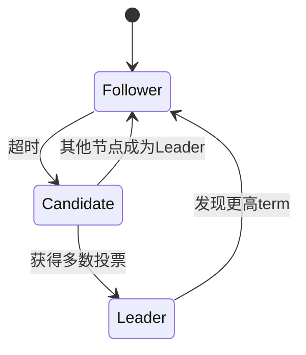

# 分布式系统深度解析

## 目录
- [一、分布式理论](#一分布式理论)
- [二、分布式一致性](#二分布式一致性)
- [三、分布式事务](#三分布式事务)
- [四、分布式锁](#四分布式锁)
- [五、分布式ID](#五分布式id)
- [六、分布式缓存](#六分布式缓存)
- [七、高频面试题](#七高频面试题)

## 一、分布式理论

### 1.1 CAP定理

**CAP三要素**：
- **C (Consistency)**：一致性 - 所有节点同时看到相同数据
- **A (Availability)**：可用性 - 每个请求都能得到响应
- **P (Partition Tolerance)**：分区容错性 - 系统在网络分区时仍能工作

**CAP定理**：最多只能同时满足两个。

```
      C (一致性)
       /\
      /  \
     /    \
    /  CP  \
   /   or   \
  /    AP    \
 /_____________\
A              P
可用性      分区容错性
```

**实际应用**：
- **CP系统**：ZooKeeper、HBase、Redis Cluster（强一致性）
- **AP系统**：Cassandra、DynamoDB（最终一致性）
- **CA系统**：单机数据库（不存在真正的分布式CA系统）

### 1.2 BASE理论

**BASE**：
- **BA (Basically Available)**：基本可用
- **S (Soft State)**：软状态
- **E (Eventually Consistent)**：最终一致性

BASE是对CAP中AP的延伸，允许短时间不一致，但最终达到一致。

### 1.3 Paxos与Raft

**Paxos算法**（理论）：
- 解决分布式一致性问题
- 复杂难懂

**Raft算法**（工程实践）：
```
Leader Election → Log Replication → Safety
```

**Raft核心概念**：
- **Leader**：处理所有客户端请求
- **Follower**：被动响应
- **Candidate**：选举中的节点

**Raft流程**：


## 二、分布式一致性

### 2.1 一致性级别

| 级别 | 说明 | 性能 | 应用 |
|------|------|------|------|
| 强一致性 | 任何时刻数据一致 | 低 | 金融系统 |
| 弱一致性 | 不保证何时一致 | 高 | 缓存 |
| 最终一致性 | 最终会一致 | 高 | 社交网络 |
| 因果一致性 | 因果关系保证一致 | 中 | 分布式数据库 |

### 2.2 2PC（两阶段提交）

**流程**：
```
Coordinator                    Participants
    |                              |
    |-------- Prepare ----------->|
    |                              | (执行但不提交)
    |<------- Vote Yes/No ---------|
    |                              |
    |-------- Commit/Abort ------->|
    |                              | (提交或回滚)
    |<------- ACK -----------------|
```

**代码示例**：
```java
public class TwoPhaseCommitCoordinator {
    
    public boolean executeTransaction(List<Participant> participants, Transaction tx) {
        // 阶段1：准备
        boolean canCommit = true;
        for (Participant p : participants) {
            if (!p.prepare(tx)) {
                canCommit = false;
                break;
            }
        }
        
        // 阶段2：提交或回滚
        if (canCommit) {
            for (Participant p : participants) {
                p.commit(tx);
            }
            return true;
        } else {
            for (Participant p : participants) {
                p.rollback(tx);
            }
            return false;
        }
    }
}
```

**缺点**：
- 同步阻塞
- 单点故障
- 数据不一致（网络分区时）

### 2.3 3PC（三阶段提交）

**改进**：
- 增加CanCommit阶段
- 增加超时机制

**流程**：
```
1. CanCommit - 询问是否可以执行
2. PreCommit - 执行事务但不提交
3. DoCommit - 提交或回滚
```

## 三、分布式事务

### 3.1 TCC（Try-Confirm-Cancel）

**三个阶段**：
- **Try**：尝试执行，预留资源
- **Confirm**：确认执行
- **Cancel**：取消执行，释放资源

**示例：转账**：
```java
public interface AccountService {
    
    // Try：冻结金额
    @TccTransaction
    boolean tryTransfer(Long fromId, Long toId, BigDecimal amount);
    
    // Confirm：确认转账
    void confirmTransfer(TransactionContext context);
    
    // Cancel：解冻金额
    void cancelTransfer(TransactionContext context);
}

@Service
public class AccountServiceImpl implements AccountService {
    
    @Override
    public boolean tryTransfer(Long fromId, Long toId, BigDecimal amount) {
        // 1. 冻结转出账户金额
        Account from = accountRepository.findById(fromId);
        if (from.getBalance().compareTo(amount) < 0) {
            return false;
        }
        from.freeze(amount);
        
        // 2. 预增加转入账户金额
        Account to = accountRepository.findById(toId);
        to.addFrozen(amount);
        
        accountRepository.save(from);
        accountRepository.save(to);
        return true;
    }
    
    @Override
    public void confirmTransfer(TransactionContext context) {
        // 1. 扣减转出账户
        Account from = accountRepository.findById(context.getFromId());
        from.deductFrozen(context.getAmount());
        
        // 2. 增加转入账户
        Account to = accountRepository.findById(context.getToId());
        to.confirmFrozen(context.getAmount());
        
        accountRepository.save(from);
        accountRepository.save(to);
    }
    
    @Override
    public void cancelTransfer(TransactionContext context) {
        // 1. 解冻转出账户
        Account from = accountRepository.findById(context.getFromId());
        from.unfreeze(context.getAmount());
        
        // 2. 取消转入账户预增
        Account to = accountRepository.findById(context.getToId());
        to.cancelFrozen(context.getAmount());
        
        accountRepository.save(from);
        accountRepository.save(to);
    }
}
```

### 3.2 Saga模式

**思想**：将长事务拆分为多个本地事务，每个本地事务都有对应的补偿操作。

**两种实现方式**：

**1. 事件编排（Choreography）**：
```java
@Component
public class OrderSaga {
    
    @Autowired
    private EventBus eventBus;
    
    // 创建订单
    @Transactional
    public void createOrder(Order order) {
        orderRepository.save(order);
        eventBus.publish(new OrderCreatedEvent(order));
    }
    
    // 监听支付成功事件
    @EventListener
    @Transactional
    public void onPaymentSuccess(PaymentSuccessEvent event) {
        Order order = orderRepository.findById(event.getOrderId());
        order.setStatus(OrderStatus.PAID);
        orderRepository.save(order);
        eventBus.publish(new OrderPaidEvent(order));
    }
    
    // 监听支付失败事件（补偿）
    @EventListener
    @Transactional
    public void onPaymentFailed(PaymentFailedEvent event) {
        Order order = orderRepository.findById(event.getOrderId());
        order.setStatus(OrderStatus.CANCELLED);
        orderRepository.save(order);
    }
}
```

**2. 命令编排（Orchestration）**：
```java
@Component
public class OrderSagaOrchestrator {
    
    public void executeOrderSaga(Order order) {
        SagaDefinition<Order> saga = SagaDefinition.create()
            .step()
                .invokeLocal(this::createOrder)
                .onRollback(this::cancelOrder)
            .step()
                .invokeRemote(paymentService::pay)
                .onRollback(paymentService::refund)
            .step()
                .invokeRemote(inventoryService::deduct)
                .onRollback(inventoryService::restore)
            .build();
        
        saga.execute(order);
    }
    
    @Transactional
    public void createOrder(Order order) {
        orderRepository.save(order);
    }
    
    @Transactional
    public void cancelOrder(Order order) {
        order.setStatus(OrderStatus.CANCELLED);
        orderRepository.save(order);
    }
}
```

### 3.3 本地消息表

**流程**：
```
1. 本地事务执行 + 插入消息表
2. 定时任务扫描消息表
3. 发送消息到MQ
4. 消费者处理消息
5. 标记消息为已处理
```

**实现**：
```java
@Service
public class OrderService {
    
    @Autowired
    private OrderRepository orderRepository;
    
    @Autowired
    private MessageRepository messageRepository;
    
    @Transactional
    public void createOrder(Order order) {
        // 1. 保存订单
        orderRepository.save(order);
        
        // 2. 保存本地消息
        Message message = new Message(
            "OrderCreated",
            JSON.toJSONString(order),
            MessageStatus.PENDING
        );
        messageRepository.save(message);
    }
}

@Component
public class MessageSender {
    
    @Scheduled(fixedDelay = 5000)
    public void sendPendingMessages() {
        List<Message> messages = messageRepository.findByStatus(MessageStatus.PENDING);
        for (Message message : messages) {
            try {
                rocketMQTemplate.send("order-topic", message.getContent());
                message.setStatus(MessageStatus.SENT);
                messageRepository.save(message);
            } catch (Exception e) {
                log.error("Failed to send message", e);
            }
        }
    }
}
```

## 四、分布式锁

### 4.1 基于Redis的分布式锁

**单机Redis锁**：
```java
@Component
public class RedisDistributedLock {
    
    @Autowired
    private StringRedisTemplate redisTemplate;
    
    private static final String LOCK_PREFIX = "lock:";
    
    public boolean tryLock(String key, String value, long expireTime) {
        Boolean result = redisTemplate.opsForValue()
            .setIfAbsent(LOCK_PREFIX + key, value, expireTime, TimeUnit.SECONDS);
        return Boolean.TRUE.equals(result);
    }
    
    public void unlock(String key, String value) {
        // Lua脚本保证原子性
        String script = 
            "if redis.call('get', KEYS[1]) == ARGV[1] then " +
            "    return redis.call('del', KEYS[1]) " +
            "else " +
            "    return 0 " +
            "end";
        
        redisTemplate.execute(
            new DefaultRedisScript<>(script, Long.class),
            Collections.singletonList(LOCK_PREFIX + key),
            value
        );
    }
}

// 使用
public void doSomething() {
    String lockKey = "resource:123";
    String lockValue = UUID.randomUUID().toString();
    
    try {
        if (lock.tryLock(lockKey, lockValue, 30)) {
            // 业务逻辑
        }
    } finally {
        lock.unlock(lockKey, lockValue);
    }
}
```

**Redisson分布式锁**：
```java
@Component
public class RedissonLockExample {
    
    @Autowired
    private RedissonClient redissonClient;
    
    public void doSomething() {
        RLock lock = redissonClient.getLock("myLock");
        
        try {
            // 尝试加锁，最多等待100秒，锁超时10秒
            if (lock.tryLock(100, 10, TimeUnit.SECONDS)) {
                // 业务逻辑
            }
        } catch (InterruptedException e) {
            Thread.currentThread().interrupt();
        } finally {
            if (lock.isHeldByCurrentThread()) {
                lock.unlock();
            }
        }
    }
}
```

**RedLock算法**（Redis集群）：
```java
public class RedLockExample {
    
    private List<RedisClient> redisClients;
    
    public boolean tryLock(String resource, int ttl) {
        long startTime = System.currentTimeMillis();
        int successCount = 0;
        
        // 1. 尝试从N个独立的Redis实例获取锁
        for (RedisClient client : redisClients) {
            if (client.setNX(resource, UUID.randomUUID().toString(), ttl)) {
                successCount++;
            }
        }
        
        // 2. 只有超过半数实例加锁成功，且耗时小于锁有效期，才算成功
        long elapsedTime = System.currentTimeMillis() - startTime;
        if (successCount >= (redisClients.size() / 2 + 1) && elapsedTime < ttl) {
            return true;
        }
        
        // 3. 加锁失败，释放所有锁
        unlock(resource);
        return false;
    }
}
```

### 4.2 基于ZooKeeper的分布式锁

**原理**：利用临时顺序节点

```java
@Component
public class ZookeeperDistributedLock {
    
    @Autowired
    private CuratorFramework client;
    
    private static final String LOCK_PATH = "/locks";
    
    public void lock(String lockName) throws Exception {
        String lockPath = LOCK_PATH + "/" + lockName;
        
        // 1. 创建临时顺序节点
        String nodePath = client.create()
            .creatingParentsIfNeeded()
            .withMode(CreateMode.EPHEMERAL_SEQUENTIAL)
            .forPath(lockPath + "/lock_");
        
        // 2. 获取所有子节点
        List<String> children = client.getChildren().forPath(lockPath);
        Collections.sort(children);
        
        // 3. 判断是否是最小节点
        String currentNode = nodePath.substring(nodePath.lastIndexOf("/") + 1);
        if (children.get(0).equals(currentNode)) {
            // 获取锁成功
            return;
        }
        
        // 4. 监听前一个节点
        String prevNode = null;
        for (int i = 0; i < children.size(); i++) {
            if (children.get(i).equals(currentNode) && i > 0) {
                prevNode = children.get(i - 1);
                break;
            }
        }
        
        CountDownLatch latch = new CountDownLatch(1);
        client.getData()
            .usingWatcher((Watcher) event -> latch.countDown())
            .forPath(lockPath + "/" + prevNode);
        
        latch.await();  // 等待前一个节点释放
    }
}

// 使用Curator的InterProcessMutex（推荐）
public class CuratorLockExample {
    
    public void doSomething() throws Exception {
        CuratorFramework client = ...;
        InterProcessMutex lock = new InterProcessMutex(client, "/locks/myLock");
        
        try {
            if (lock.acquire(10, TimeUnit.SECONDS)) {
                // 业务逻辑
            }
        } finally {
            lock.release();
        }
    }
}
```

### 4.3 分布式锁对比

| 特性 | Redis | ZooKeeper | 数据库 |
|------|-------|-----------|-------|
| 性能 | 高 | 中 | 低 |
| 可靠性 | 中（RedLock） | 高 | 高 |
| 实现复杂度 | 低 | 中 | 低 |
| 锁释放 | 超时释放 | 连接断开释放 | 超时/手动释放 |
| 适用场景 | 高性能 | 高可靠性 | 简单场景 |

## 五、分布式ID

### 5.1 UUID

```java
String uuid = UUID.randomUUID().toString();  // 36位字符串
```

**优点**：简单，无需中心化
**缺点**：无序、占用空间大

### 5.2 雪花算法（Snowflake）

**结构**（64位）：
```
0 - 41位时间戳 - 10位机器ID - 12位序列号

| 1bit | 41bit timestamp | 10bit worker | 12bit sequence |
```

**实现**：
```java
public class SnowflakeIdGenerator {
    
    private final long twepoch = 1288834974657L;  // 起始时间戳
    private final long workerIdBits = 10L;
    private final long sequenceBits = 12L;
    
    private final long maxWorkerId = ~(-1L << workerIdBits);
    private final long sequenceMask = ~(-1L << sequenceBits);
    
    private final long workerIdShift = sequenceBits;
    private final long timestampLeftShift = sequenceBits + workerIdBits;
    
    private long workerId;
    private long sequence = 0L;
    private long lastTimestamp = -1L;
    
    public SnowflakeIdGenerator(long workerId) {
        if (workerId > maxWorkerId || workerId < 0) {
            throw new IllegalArgumentException("Worker ID can't be greater than " + maxWorkerId);
        }
        this.workerId = workerId;
    }
    
    public synchronized long nextId() {
        long timestamp = timeGen();
        
        // 时钟回拨
        if (timestamp < lastTimestamp) {
            throw new RuntimeException("Clock moved backwards");
        }
        
        // 同一毫秒内
        if (lastTimestamp == timestamp) {
            sequence = (sequence + 1) & sequenceMask;
            if (sequence == 0) {
                timestamp = tilNextMillis(lastTimestamp);
            }
        } else {
            sequence = 0L;
        }
        
        lastTimestamp = timestamp;
        
        return ((timestamp - twepoch) << timestampLeftShift) |
               (workerId << workerIdShift) |
               sequence;
    }
    
    private long tilNextMillis(long lastTimestamp) {
        long timestamp = timeGen();
        while (timestamp <= lastTimestamp) {
            timestamp = timeGen();
        }
        return timestamp;
    }
    
    private long timeGen() {
        return System.currentTimeMillis();
    }
}
```

### 5.3 美团Leaf

**Leaf-Segment**：数据库号段模式
```java
@Service
public class LeafSegmentIdGenerator {
    
    @Autowired
    private IdSegmentMapper segmentMapper;
    
    private Segment currentSegment;
    private Segment nextSegment;
    
    public synchronized long nextId(String bizTag) {
        if (currentSegment == null || currentSegment.isExhausted()) {
            loadSegment(bizTag);
        }
        
        long id = currentSegment.getAndIncrement();
        
        // 异步加载下一个segment
        if (currentSegment.isHalfUsed() && nextSegment == null) {
            loadNextSegment(bizTag);
        }
        
        return id;
    }
    
    private void loadSegment(String bizTag) {
        Segment segment = segmentMapper.getNextSegment(bizTag);
        currentSegment = nextSegment != null ? nextSegment : segment;
        nextSegment = null;
    }
}
```

### 5.4 分布式ID对比

| 方案 | 优点 | 缺点 | 适用场景 |
|------|------|------|---------|
| UUID | 简单 | 无序、占空间 | 不需要排序 |
| Snowflake | 高性能、有序 | 时钟回拨问题 | 高并发 |
| 数据库自增 | 简单 | 性能瓶颈 | 并发低 |
| Redis | 高性能 | 依赖Redis | 中等并发 |
| Leaf | 高可用 | 复杂 | 大规模系统 |

## 六、分布式缓存

### 6.1 缓存一致性

**Cache Aside模式**（推荐）：
```java
// 读
public User getUser(Long id) {
    User user = cache.get("user:" + id);
    if (user == null) {
        user = db.get(id);
        cache.set("user:" + id, user);
    }
    return user;
}

// 写
public void updateUser(User user) {
    db.update(user);
    cache.delete("user:" + user.getId());  // 删除缓存，不是更新
}
```

**Read/Write Through模式**：
- 缓存自动从数据库加载
- 缓存自动写入数据库

**Write Behind模式**：
- 异步写入数据库
- 高性能，但可能丢数据

### 6.2 缓存穿透、击穿、雪崩

**缓存穿透**（查询不存在的数据）：
```java
// 解决方案1：布隆过滤器
BloomFilter<Long> bloomFilter = BloomFilter.create(...);

public User getUser(Long id) {
    if (!bloomFilter.mightContain(id)) {
        return null;  // 一定不存在
    }
    // 继续查询缓存和数据库
}

// 解决方案2：缓存空值
public User getUser(Long id) {
    User user = cache.get("user:" + id);
    if (user == null) {
        user = db.get(id);
        cache.set("user:" + id, user != null ? user : "NULL", 60);  // 缓存空值，短过期时间
    }
    return user.equals("NULL") ? null : user;
}
```

**缓存击穿**（热点key过期）：
```java
// 解决方案1：互斥锁
public User getUser(Long id) {
    User user = cache.get("user:" + id);
    if (user == null) {
        String lockKey = "lock:user:" + id;
        if (lock.tryLock(lockKey)) {
            try {
                user = db.get(id);
                cache.set("user:" + id, user);
            } finally {
                lock.unlock(lockKey);
            }
        } else {
            Thread.sleep(100);
            return getUser(id);  // 重试
        }
    }
    return user;
}

// 解决方案2：热点数据永不过期
cache.set("user:" + id, user, -1);  // 永不过期
// 异步更新
```

**缓存雪崩**（大量key同时过期）：
```java
// 解决方案1：随机过期时间
int expireTime = 3600 + new Random().nextInt(600);  // 3600~4200秒
cache.set(key, value, expireTime);

// 解决方案2：Redis集群 + 主从复制
// 解决方案3：限流降级
```

## 七、高频面试题

### Q1：CAP定理如何理解？

CAP三者最多只能同时满足两个：
- **CP**：牺牲可用性，保证一致性（ZooKeeper）
- **AP**：牺牲一致性，保证可用性（Cassandra）
- **CA**：不存在真正的分布式CA系统

### Q2：2PC和3PC的区别？

| 特性 | 2PC | 3PC |
|------|-----|-----|
| 阶段数 | 2 | 3 |
| 超时机制 | 无 | 有 |
| 单点故障 | 阻塞 | 可继续 |
| 数据一致性 | 弱 | 较强 |

### Q3：分布式事务有哪些解决方案？

1. **2PC/3PC**：强一致性，性能差
2. **TCC**：性能好，实现复杂
3. **Saga**：长事务，最终一致性
4. **本地消息表**：最终一致性
5. **MQ事务消息**：最终一致性

### Q4：Redis分布式锁的问题？

1. **锁超时**：业务执行时间超过锁过期时间
   - 解决：Redisson的WatchDog自动续期

2. **误删锁**：A的锁被B删除
   - 解决：设置唯一value，删除时校验

3. **不可重入**：
   - 解决：使用Redisson的可重入锁

4. **主从同步延迟**：
   - 解决：使用RedLock算法

### Q5：雪花算法的时钟回拨问题？

**问题**：系统时间被回拨，可能生成重复ID

**解决方案**：
1. 拒绝生成ID，抛出异常
2. 等待时钟追上
3. 使用备用workerId

---

**关键字**：CAP、分布式一致性、2PC、TCC、Saga、分布式锁、雪花算法、缓存一致性

