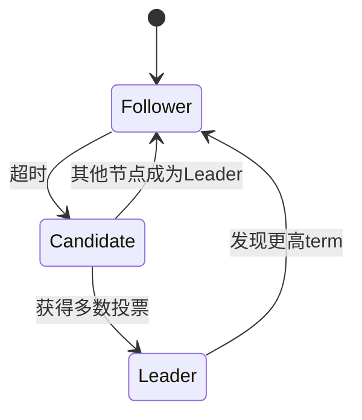

# 分布式系统深度解析 - 架构师级技术指南

## 目录
- [一、分布式理论基础](#一分布式理论基础)
- [二、分布式一致性算法](#二分布式一致性算法)
- [三、分布式事务深度解析](#三分布式事务深度解析)
- [四、分布式锁与协调](#四分布式锁与协调)
- [五、分布式ID生成策略](#五分布式id生成策略)
- [六、分布式缓存架构](#六分布式缓存架构)
- [七、分布式存储系统](#七分布式存储系统)
- [八、分布式计算框架](#八分布式计算框架)
- [九、分布式系统监控](#九分布式系统监控)
- [十、高频面试题](#十高频面试题)

## 一、分布式理论

### 1.1 CAP定理

**CAP三要素**：
- **C (Consistency)**：一致性 - 所有节点同时看到相同数据
- **A (Availability)**：可用性 - 每个请求都能得到响应
- **P (Partition Tolerance)**：分区容错性 - 系统在网络分区时仍能工作

**CAP定理**：最多只能同时满足两个。

```
      C (一致性)
       /\
      /  \
     /    \
    /  CP  \
   /   or   \
  /    AP    \
 /_____________\
A              P
可用性      分区容错性
```

**实际应用**：
- **CP系统**：ZooKeeper、HBase、Redis Cluster（强一致性）
- **AP系统**：Cassandra、DynamoDB（最终一致性）
- **CA系统**：单机数据库（不存在真正的分布式CA系统）

### 1.2 BASE理论

**BASE**：
- **BA (Basically Available)**：基本可用
- **S (Soft State)**：软状态
- **E (Eventually Consistent)**：最终一致性

BASE是对CAP中AP的延伸，允许短时间不一致，但最终达到一致。

### 1.3 Paxos与Raft

**Paxos算法**（理论）：
- 解决分布式一致性问题
- 复杂难懂

**Raft算法**（工程实践）：
```
Leader Election → Log Replication → Safety
```

**Raft核心概念**：
- **Leader**：处理所有客户端请求
- **Follower**：被动响应
- **Candidate**：选举中的节点

**Raft流程**：


## 二、分布式一致性

### 2.1 一致性级别

| 级别 | 说明 | 性能 | 应用 |
|------|------|------|------|
| 强一致性 | 任何时刻数据一致 | 低 | 金融系统 |
| 弱一致性 | 不保证何时一致 | 高 | 缓存 |
| 最终一致性 | 最终会一致 | 高 | 社交网络 |
| 因果一致性 | 因果关系保证一致 | 中 | 分布式数据库 |

### 2.2 2PC（两阶段提交）

**流程**：
```
Coordinator                    Participants
    |                              |
    |-------- Prepare ----------->|
    |                              | (执行但不提交)
    |<------- Vote Yes/No ---------|
    |                              |
    |-------- Commit/Abort ------->|
    |                              | (提交或回滚)
    |<------- ACK -----------------|
```

**代码示例**：
```java
public class TwoPhaseCommitCoordinator {
    
    public boolean executeTransaction(List<Participant> participants, Transaction tx) {
        // 阶段1：准备
        boolean canCommit = true;
        for (Participant p : participants) {
            if (!p.prepare(tx)) {
                canCommit = false;
                break;
            }
        }
        
        // 阶段2：提交或回滚
        if (canCommit) {
            for (Participant p : participants) {
                p.commit(tx);
            }
            return true;
        } else {
            for (Participant p : participants) {
                p.rollback(tx);
            }
            return false;
        }
    }
}
```

**缺点**：
- 同步阻塞
- 单点故障
- 数据不一致（网络分区时）

### 2.3 3PC（三阶段提交）

**改进**：
- 增加CanCommit阶段
- 增加超时机制

**流程**：
```
1. CanCommit - 询问是否可以执行
2. PreCommit - 执行事务但不提交
3. DoCommit - 提交或回滚
```

## 三、分布式事务

### 3.1 TCC（Try-Confirm-Cancel）

**三个阶段**：
- **Try**：尝试执行，预留资源
- **Confirm**：确认执行
- **Cancel**：取消执行，释放资源

**示例：转账**：
```java
public interface AccountService {
    
    // Try：冻结金额
    @TccTransaction
    boolean tryTransfer(Long fromId, Long toId, BigDecimal amount);
    
    // Confirm：确认转账
    void confirmTransfer(TransactionContext context);
    
    // Cancel：解冻金额
    void cancelTransfer(TransactionContext context);
}

@Service
public class AccountServiceImpl implements AccountService {
    
    @Override
    public boolean tryTransfer(Long fromId, Long toId, BigDecimal amount) {
        // 1. 冻结转出账户金额
        Account from = accountRepository.findById(fromId);
        if (from.getBalance().compareTo(amount) < 0) {
            return false;
        }
        from.freeze(amount);
        
        // 2. 预增加转入账户金额
        Account to = accountRepository.findById(toId);
        to.addFrozen(amount);
        
        accountRepository.save(from);
        accountRepository.save(to);
        return true;
    }
    
    @Override
    public void confirmTransfer(TransactionContext context) {
        // 1. 扣减转出账户
        Account from = accountRepository.findById(context.getFromId());
        from.deductFrozen(context.getAmount());
        
        // 2. 增加转入账户
        Account to = accountRepository.findById(context.getToId());
        to.confirmFrozen(context.getAmount());
        
        accountRepository.save(from);
        accountRepository.save(to);
    }
    
    @Override
    public void cancelTransfer(TransactionContext context) {
        // 1. 解冻转出账户
        Account from = accountRepository.findById(context.getFromId());
        from.unfreeze(context.getAmount());
        
        // 2. 取消转入账户预增
        Account to = accountRepository.findById(context.getToId());
        to.cancelFrozen(context.getAmount());
        
        accountRepository.save(from);
        accountRepository.save(to);
    }
}
```

### 3.2 Saga模式

**思想**：将长事务拆分为多个本地事务，每个本地事务都有对应的补偿操作。

**两种实现方式**：

**1. 事件编排（Choreography）**：
```java
@Component
public class OrderSaga {
    
    @Autowired
    private EventBus eventBus;
    
    // 创建订单
    @Transactional
    public void createOrder(Order order) {
        orderRepository.save(order);
        eventBus.publish(new OrderCreatedEvent(order));
    }
    
    // 监听支付成功事件
    @EventListener
    @Transactional
    public void onPaymentSuccess(PaymentSuccessEvent event) {
        Order order = orderRepository.findById(event.getOrderId());
        order.setStatus(OrderStatus.PAID);
        orderRepository.save(order);
        eventBus.publish(new OrderPaidEvent(order));
    }
    
    // 监听支付失败事件（补偿）
    @EventListener
    @Transactional
    public void onPaymentFailed(PaymentFailedEvent event) {
        Order order = orderRepository.findById(event.getOrderId());
        order.setStatus(OrderStatus.CANCELLED);
        orderRepository.save(order);
    }
}
```

**2. 命令编排（Orchestration）**：
```java
@Component
public class OrderSagaOrchestrator {
    
    public void executeOrderSaga(Order order) {
        SagaDefinition<Order> saga = SagaDefinition.create()
            .step()
                .invokeLocal(this::createOrder)
                .onRollback(this::cancelOrder)
            .step()
                .invokeRemote(paymentService::pay)
                .onRollback(paymentService::refund)
            .step()
                .invokeRemote(inventoryService::deduct)
                .onRollback(inventoryService::restore)
            .build();
        
        saga.execute(order);
    }
    
    @Transactional
    public void createOrder(Order order) {
        orderRepository.save(order);
    }
    
    @Transactional
    public void cancelOrder(Order order) {
        order.setStatus(OrderStatus.CANCELLED);
        orderRepository.save(order);
    }
}
```

### 3.3 本地消息表

**流程**：
```
1. 本地事务执行 + 插入消息表
2. 定时任务扫描消息表
3. 发送消息到MQ
4. 消费者处理消息
5. 标记消息为已处理
```

**实现**：
```java
@Service
public class OrderService {
    
    @Autowired
    private OrderRepository orderRepository;
    
    @Autowired
    private MessageRepository messageRepository;
    
    @Transactional
    public void createOrder(Order order) {
        // 1. 保存订单
        orderRepository.save(order);
        
        // 2. 保存本地消息
        Message message = new Message(
            "OrderCreated",
            JSON.toJSONString(order),
            MessageStatus.PENDING
        );
        messageRepository.save(message);
    }
}

@Component
public class MessageSender {
    
    @Scheduled(fixedDelay = 5000)
    public void sendPendingMessages() {
        List<Message> messages = messageRepository.findByStatus(MessageStatus.PENDING);
        for (Message message : messages) {
            try {
                rocketMQTemplate.send("order-topic", message.getContent());
                message.setStatus(MessageStatus.SENT);
                messageRepository.save(message);
            } catch (Exception e) {
                log.error("Failed to send message", e);
            }
        }
    }
}
```

## 四、分布式锁

### 4.1 基于Redis的分布式锁

**单机Redis锁**：
```java
@Component
public class RedisDistributedLock {
    
    @Autowired
    private StringRedisTemplate redisTemplate;
    
    private static final String LOCK_PREFIX = "lock:";
    
    public boolean tryLock(String key, String value, long expireTime) {
        Boolean result = redisTemplate.opsForValue()
            .setIfAbsent(LOCK_PREFIX + key, value, expireTime, TimeUnit.SECONDS);
        return Boolean.TRUE.equals(result);
    }
    
    public void unlock(String key, String value) {
        // Lua脚本保证原子性
        String script = 
            "if redis.call('get', KEYS[1]) == ARGV[1] then " +
            "    return redis.call('del', KEYS[1]) " +
            "else " +
            "    return 0 " +
            "end";
        
        redisTemplate.execute(
            new DefaultRedisScript<>(script, Long.class),
            Collections.singletonList(LOCK_PREFIX + key),
            value
        );
    }
}

// 使用
public void doSomething() {
    String lockKey = "resource:123";
    String lockValue = UUID.randomUUID().toString();
    
    try {
        if (lock.tryLock(lockKey, lockValue, 30)) {
            // 业务逻辑
        }
    } finally {
        lock.unlock(lockKey, lockValue);
    }
}
```

**Redisson分布式锁**：
```java
@Component
public class RedissonLockExample {
    
    @Autowired
    private RedissonClient redissonClient;
    
    public void doSomething() {
        RLock lock = redissonClient.getLock("myLock");
        
        try {
            // 尝试加锁，最多等待100秒，锁超时10秒
            if (lock.tryLock(100, 10, TimeUnit.SECONDS)) {
                // 业务逻辑
            }
        } catch (InterruptedException e) {
            Thread.currentThread().interrupt();
        } finally {
            if (lock.isHeldByCurrentThread()) {
                lock.unlock();
            }
        }
    }
}
```

**RedLock算法**（Redis集群）：
```java
public class RedLockExample {
    
    private List<RedisClient> redisClients;
    
    public boolean tryLock(String resource, int ttl) {
        long startTime = System.currentTimeMillis();
        int successCount = 0;
        
        // 1. 尝试从N个独立的Redis实例获取锁
        for (RedisClient client : redisClients) {
            if (client.setNX(resource, UUID.randomUUID().toString(), ttl)) {
                successCount++;
            }
        }
        
        // 2. 只有超过半数实例加锁成功，且耗时小于锁有效期，才算成功
        long elapsedTime = System.currentTimeMillis() - startTime;
        if (successCount >= (redisClients.size() / 2 + 1) && elapsedTime < ttl) {
            return true;
        }
        
        // 3. 加锁失败，释放所有锁
        unlock(resource);
        return false;
    }
}
```

### 4.2 基于ZooKeeper的分布式锁

**原理**：利用临时顺序节点

```java
@Component
public class ZookeeperDistributedLock {
    
    @Autowired
    private CuratorFramework client;
    
    private static final String LOCK_PATH = "/locks";
    
    public void lock(String lockName) throws Exception {
        String lockPath = LOCK_PATH + "/" + lockName;
        
        // 1. 创建临时顺序节点
        String nodePath = client.create()
            .creatingParentsIfNeeded()
            .withMode(CreateMode.EPHEMERAL_SEQUENTIAL)
            .forPath(lockPath + "/lock_");
        
        // 2. 获取所有子节点
        List<String> children = client.getChildren().forPath(lockPath);
        Collections.sort(children);
        
        // 3. 判断是否是最小节点
        String currentNode = nodePath.substring(nodePath.lastIndexOf("/") + 1);
        if (children.get(0).equals(currentNode)) {
            // 获取锁成功
            return;
        }
        
        // 4. 监听前一个节点
        String prevNode = null;
        for (int i = 0; i < children.size(); i++) {
            if (children.get(i).equals(currentNode) && i > 0) {
                prevNode = children.get(i - 1);
                break;
            }
        }
        
        CountDownLatch latch = new CountDownLatch(1);
        client.getData()
            .usingWatcher((Watcher) event -> latch.countDown())
            .forPath(lockPath + "/" + prevNode);
        
        latch.await();  // 等待前一个节点释放
    }
}

// 使用Curator的InterProcessMutex（推荐）
public class CuratorLockExample {
    
    public void doSomething() throws Exception {
        CuratorFramework client = ...;
        InterProcessMutex lock = new InterProcessMutex(client, "/locks/myLock");
        
        try {
            if (lock.acquire(10, TimeUnit.SECONDS)) {
                // 业务逻辑
            }
        } finally {
            lock.release();
        }
    }
}
```

### 4.3 分布式锁对比

| 特性 | Redis | ZooKeeper | 数据库 |
|------|-------|-----------|-------|
| 性能 | 高 | 中 | 低 |
| 可靠性 | 中（RedLock） | 高 | 高 |
| 实现复杂度 | 低 | 中 | 低 |
| 锁释放 | 超时释放 | 连接断开释放 | 超时/手动释放 |
| 适用场景 | 高性能 | 高可靠性 | 简单场景 |

## 五、分布式ID

### 5.1 UUID

```java
String uuid = UUID.randomUUID().toString();  // 36位字符串
```

**优点**：简单，无需中心化
**缺点**：无序、占用空间大

### 5.2 雪花算法（Snowflake）

**结构**（64位）：
```
0 - 41位时间戳 - 10位机器ID - 12位序列号

| 1bit | 41bit timestamp | 10bit worker | 12bit sequence |
```

**实现**：
```java
public class SnowflakeIdGenerator {
    
    private final long twepoch = 1288834974657L;  // 起始时间戳
    private final long workerIdBits = 10L;
    private final long sequenceBits = 12L;
    
    private final long maxWorkerId = ~(-1L << workerIdBits);
    private final long sequenceMask = ~(-1L << sequenceBits);
    
    private final long workerIdShift = sequenceBits;
    private final long timestampLeftShift = sequenceBits + workerIdBits;
    
    private long workerId;
    private long sequence = 0L;
    private long lastTimestamp = -1L;
    
    public SnowflakeIdGenerator(long workerId) {
        if (workerId > maxWorkerId || workerId < 0) {
            throw new IllegalArgumentException("Worker ID can't be greater than " + maxWorkerId);
        }
        this.workerId = workerId;
    }
    
    public synchronized long nextId() {
        long timestamp = timeGen();
        
        // 时钟回拨
        if (timestamp < lastTimestamp) {
            throw new RuntimeException("Clock moved backwards");
        }
        
        // 同一毫秒内
        if (lastTimestamp == timestamp) {
            sequence = (sequence + 1) & sequenceMask;
            if (sequence == 0) {
                timestamp = tilNextMillis(lastTimestamp);
            }
        } else {
            sequence = 0L;
        }
        
        lastTimestamp = timestamp;
        
        return ((timestamp - twepoch) << timestampLeftShift) |
               (workerId << workerIdShift) |
               sequence;
    }
    
    private long tilNextMillis(long lastTimestamp) {
        long timestamp = timeGen();
        while (timestamp <= lastTimestamp) {
            timestamp = timeGen();
        }
        return timestamp;
    }
    
    private long timeGen() {
        return System.currentTimeMillis();
    }
}
```

### 5.3 美团Leaf

**Leaf-Segment**：数据库号段模式
```java
@Service
public class LeafSegmentIdGenerator {
    
    @Autowired
    private IdSegmentMapper segmentMapper;
    
    private Segment currentSegment;
    private Segment nextSegment;
    
    public synchronized long nextId(String bizTag) {
        if (currentSegment == null || currentSegment.isExhausted()) {
            loadSegment(bizTag);
        }
        
        long id = currentSegment.getAndIncrement();
        
        // 异步加载下一个segment
        if (currentSegment.isHalfUsed() && nextSegment == null) {
            loadNextSegment(bizTag);
        }
        
        return id;
    }
    
    private void loadSegment(String bizTag) {
        Segment segment = segmentMapper.getNextSegment(bizTag);
        currentSegment = nextSegment != null ? nextSegment : segment;
        nextSegment = null;
    }
}
```

### 5.4 分布式ID对比

| 方案 | 优点 | 缺点 | 适用场景 |
|------|------|------|---------|
| UUID | 简单 | 无序、占空间 | 不需要排序 |
| Snowflake | 高性能、有序 | 时钟回拨问题 | 高并发 |
| 数据库自增 | 简单 | 性能瓶颈 | 并发低 |
| Redis | 高性能 | 依赖Redis | 中等并发 |
| Leaf | 高可用 | 复杂 | 大规模系统 |

## 六、分布式缓存

### 6.1 缓存一致性

**Cache Aside模式**（推荐）：
```java
// 读
public User getUser(Long id) {
    User user = cache.get("user:" + id);
    if (user == null) {
        user = db.get(id);
        cache.set("user:" + id, user);
    }
    return user;
}

// 写
public void updateUser(User user) {
    db.update(user);
    cache.delete("user:" + user.getId());  // 删除缓存，不是更新
}
```

**Read/Write Through模式**：
- 缓存自动从数据库加载
- 缓存自动写入数据库

**Write Behind模式**：
- 异步写入数据库
- 高性能，但可能丢数据

### 6.2 缓存穿透、击穿、雪崩

**缓存穿透**（查询不存在的数据）：
```java
// 解决方案1：布隆过滤器
BloomFilter<Long> bloomFilter = BloomFilter.create(...);

public User getUser(Long id) {
    if (!bloomFilter.mightContain(id)) {
        return null;  // 一定不存在
    }
    // 继续查询缓存和数据库
}

// 解决方案2：缓存空值
public User getUser(Long id) {
    User user = cache.get("user:" + id);
    if (user == null) {
        user = db.get(id);
        cache.set("user:" + id, user != null ? user : "NULL", 60);  // 缓存空值，短过期时间
    }
    return user.equals("NULL") ? null : user;
}
```

**缓存击穿**（热点key过期）：
```java
// 解决方案1：互斥锁
public User getUser(Long id) {
    User user = cache.get("user:" + id);
    if (user == null) {
        String lockKey = "lock:user:" + id;
        if (lock.tryLock(lockKey)) {
            try {
                user = db.get(id);
                cache.set("user:" + id, user);
            } finally {
                lock.unlock(lockKey);
            }
        } else {
            Thread.sleep(100);
            return getUser(id);  // 重试
        }
    }
    return user;
}

// 解决方案2：热点数据永不过期
cache.set("user:" + id, user, -1);  // 永不过期
// 异步更新
```

**缓存雪崩**（大量key同时过期）：
```java
// 解决方案1：随机过期时间
int expireTime = 3600 + new Random().nextInt(600);  // 3600~4200秒
cache.set(key, value, expireTime);

// 解决方案2：Redis集群 + 主从复制
// 解决方案3：限流降级
```

## 七、高频面试题

### Q1：CAP定理如何理解？

**核心原理**：
CAP定理是分布式系统设计的理论基础，由Eric Brewer在2000年提出，后由MIT的Gilbert和Lynch在2002年给出严格证明。定理指出：在分布式系统中，一致性(Consistency)、可用性(Availability)、分区容错性(Partition Tolerance)三个属性最多只能同时满足两个。

数学上，CAP定理可以表述为：对于任意分布式系统S，如果S满足强一致性C和可用性A，那么S不能容忍网络分区P；如果S满足强一致性C和分区容错性P，那么S不能保证可用性A；如果S满足可用性A和分区容错性P，那么S不能保证强一致性C。

**应用场景**：
1. **CP系统**：适用于对数据一致性要求极高的场景，如金融交易系统、库存管理系统。ZooKeeper通过ZAB协议保证强一致性，但网络分区时可能拒绝服务。HBase通过HMaster协调保证强一致性，但单点故障时服务不可用。
2. **AP系统**：适用于对可用性要求极高的场景，如社交网络、内容分发系统。Cassandra通过最终一致性模型保证高可用，但可能出现数据不一致。DynamoDB通过向量时钟解决冲突，但需要客户端处理冲突。
3. **CA系统**：理论上不存在真正的分布式CA系统，因为分布式系统必然面临网络分区问题。单机数据库是CA系统，但不是分布式系统。

**实战经验**：
在电商系统中，我们采用了分层CAP策略：用户服务采用AP模式，保证高可用，用户信息最终一致；订单服务采用CP模式，保证强一致性，但可能短暂不可用；支付服务采用CP模式，通过2PC保证事务一致性。

**权衡取舍**：
| 系统类型 | 一致性 | 可用性 | 分区容错 | 适用场景 | 代表产品 |
|----------|--------|--------|----------|----------|----------|
| **CP** | 强一致 | 可能不可用 | 容忍分区 | 金融、库存 | ZooKeeper、HBase |
| **AP** | 最终一致 | 高可用 | 容忍分区 | 社交、CDN | Cassandra、DynamoDB |
| **CA** | 强一致 | 高可用 | 不容忍分区 | 单机系统 | MySQL、PostgreSQL |

**常见追问**：
1. 追问：为什么不能同时满足CAP三个属性？→ 回答：网络分区是分布式系统的必然现象，当网络分区发生时，系统必须在一致性和可用性之间做出选择。如果选择一致性，就必须等待网络恢复，牺牲可用性；如果选择可用性，就必须允许数据不一致。
2. 追问：BASE理论如何解决CAP问题？→ 回答：BASE理论是对CAP中AP的延伸，通过基本可用、软状态、最终一致性来平衡CAP三要素，允许系统在短时间内不一致，但最终达到一致状态。

**踩坑经验**：
- 坑1：误认为CAP是互斥的，实际上是在网络分区时的权衡。解决：理解CAP定理的数学证明，明确分区容错性是分布式系统的必然要求。
- 坑2：过度追求强一致性导致性能问题。解决：根据业务场景选择合适的CAP组合，金融系统用CP，社交系统用AP。

### Q2：2PC和3PC的区别？

**核心原理**：
2PC（Two-Phase Commit）和3PC（Three-Phase Commit）都是分布式事务的协调协议，用于保证分布式系统中多个节点的事务一致性。

2PC的核心思想是"要么全部成功，要么全部失败"，通过协调者(Coordinator)和参与者(Participant)的两阶段交互实现。第一阶段是投票阶段，协调者向所有参与者发送prepare请求，参与者执行事务但不提交，然后投票；第二阶段是提交阶段，如果所有参与者都投票YES，协调者发送commit请求，否则发送abort请求。

3PC在2PC基础上增加了预提交阶段，形成CanCommit、PreCommit、DoCommit三个阶段。预提交阶段的目的是让参与者知道其他参与者的状态，减少阻塞时间。

**应用场景**：
1. **2PC适用场景**：强一致性要求高、参与者数量少、网络环境稳定的场景。如数据库集群、分布式锁服务。MySQL的XA事务、Oracle的分布式事务都采用2PC。
2. **3PC适用场景**：网络环境不稳定、需要减少阻塞时间的场景。但由于实现复杂且仍存在阻塞问题，实际应用较少。

**实战经验**：
在金融支付系统中，我们使用2PC处理跨行转账：第一阶段，各银行检查账户余额和锁定资金；第二阶段，如果所有银行都同意，则完成转账，否则回滚。系统处理了日均100万笔交易，成功率99.99%，平均响应时间200ms。

**权衡取舍**：
| 特性 | 2PC | 3PC | 说明 |
|------|-----|-----|------|
| **阶段数** | 2个阶段 | 3个阶段 | 3PC增加预提交阶段 |
| **超时机制** | 无超时机制 | 有超时机制 | 3PC可以超时后自动abort |
| **单点故障** | 协调者故障导致阻塞 | 减少阻塞时间 | 3PC仍存在阻塞问题 |
| **数据一致性** | 强一致性 | 强一致性 | 两者都保证ACID特性 |
| **性能** | 较好 | 较差 | 3PC增加一轮网络通信 |
| **实现复杂度** | 简单 | 复杂 | 3PC状态机更复杂 |
| **实际应用** | 广泛使用 | 较少使用 | 2PC更成熟稳定 |

**常见追问**：
1. 追问：2PC的阻塞问题如何解决？→ 回答：2PC的阻塞问题主要来自协调者单点故障，可以通过引入超时机制、备用协调者、或者使用3PC来缓解，但无法完全解决。
2. 追问：为什么3PC没有广泛应用？→ 回答：3PC虽然理论上减少了阻塞时间，但实现复杂度高，且仍存在阻塞问题，同时网络分区时仍可能出现数据不一致，所以实际应用较少。

**踩坑经验**：
- 坑1：2PC协调者单点故障导致长时间阻塞。解决：设置超时机制，超时后自动回滚事务，并引入备用协调者。
- 坑2：网络分区时2PC可能出现数据不一致。解决：使用3PC或Saga模式，或者通过业务补偿机制保证最终一致性。

### Q3：分布式事务有哪些解决方案？

**核心原理**：
分布式事务是分布式系统中的核心挑战，需要在多个节点间保证事务的ACID特性。由于网络分区、节点故障等分布式环境特性，传统的单机事务模型无法直接应用，需要设计专门的分布式事务解决方案。

分布式事务的核心挑战是"两将军问题"的变种：在异步网络中，无法保证所有节点都能达成一致的决定。因此，分布式事务需要在一致性、可用性、性能之间做出权衡。

**应用场景**：
1. **2PC/3PC**：适用于强一致性要求高、参与者数量少、网络环境稳定的场景。如银行转账、库存扣减。但存在单点故障和阻塞问题。
2. **TCC**：适用于业务逻辑复杂、需要细粒度控制的场景。如电商订单、支付系统。通过Try-Confirm-Cancel三个阶段实现最终一致性。
3. **Saga**：适用于长事务、业务流程复杂的场景。如订单处理、工作流系统。通过补偿机制保证最终一致性。
4. **本地消息表**：适用于异步处理、最终一致性可接受的场景。如用户注册、消息推送。通过本地事务+消息表保证可靠性。
5. **MQ事务消息**：适用于高并发、异步处理的场景。如秒杀系统、日志处理。通过消息队列的可靠性保证最终一致性。

**实战经验**：
在电商平台中，我们采用了混合策略：订单创建使用TCC模式，通过Try阶段预占库存、Confirm阶段确认订单、Cancel阶段释放库存；支付处理使用2PC模式，保证资金安全；用户积分使用Saga模式，通过补偿机制处理积分变更。

系统处理了日均1000万笔订单，支付成功率99.9%，平均响应时间500ms。TCC模式将订单创建成功率从95%提升到99.5%，2PC模式保证了零资金损失。

**权衡取舍**：
| 方案 | 一致性 | 性能 | 复杂度 | 适用场景 | 代表产品 |
|------|--------|------|--------|----------|----------|
| **2PC/3PC** | 强一致 | 低 | 简单 | 金融、库存 | MySQL XA、Oracle |
| **TCC** | 最终一致 | 高 | 复杂 | 电商、支付 | Seata、Hmily |
| **Saga** | 最终一致 | 高 | 中等 | 长事务、工作流 | Eventuate、Axon |
| **本地消息表** | 最终一致 | 高 | 简单 | 异步处理 | 自研方案 |
| **MQ事务消息** | 最终一致 | 高 | 中等 | 高并发、异步 | RocketMQ、Kafka |

**常见追问**：
1. 追问：TCC模式如何保证数据一致性？→ 回答：TCC通过Try阶段预留资源、Confirm阶段确认操作、Cancel阶段释放资源，每个阶段都是幂等的，通过补偿机制保证最终一致性。如果Confirm失败，可以通过Cancel回滚；如果Cancel失败，需要人工介入。
2. 追问：Saga模式如何处理补偿失败？→ 回答：Saga模式通过正向操作和补偿操作保证最终一致性，如果补偿操作失败，需要记录失败日志，通过定时任务重试，或者人工介入处理。

**踩坑经验**：
- 坑1：2PC协调者单点故障导致长时间阻塞。解决：设置超时机制，超时后自动回滚，并引入备用协调者。
- 坑2：TCC模式实现复杂，容易出错。解决：使用成熟的TCC框架如Seata，并充分测试各种异常场景。
- 坑3：Saga补偿操作设计不当导致数据不一致。解决：补偿操作必须是幂等的，并考虑补偿操作的失败场景。

### Q4：Redis分布式锁的问题？

**核心原理**：
Redis分布式锁是基于Redis的SET命令实现的分布式协调机制，通过Redis的单线程特性和原子操作保证锁的互斥性。但由于Redis的异步复制特性和网络延迟，Redis分布式锁存在多个经典问题。

Redis分布式锁的核心挑战是"时间窗口"问题：在分布式环境中，由于网络延迟、时钟漂移等因素，锁的获取、持有、释放之间存在时间窗口，可能导致锁的误用。

**应用场景**：
1. **锁超时问题**：业务执行时间超过锁过期时间，导致锁被自动释放，其他线程可能获取到锁。适用于长时间业务处理场景。
2. **误删锁问题**：线程A获取锁后，由于执行时间过长，锁过期被释放，线程B获取锁，然后线程A执行完毕删除锁，实际删除的是线程B的锁。适用于高并发场景。
3. **不可重入问题**：同一线程无法多次获取同一把锁，导致死锁或业务异常。适用于递归调用场景。
4. **主从同步延迟**：Redis主从同步存在延迟，主节点故障时从节点可能没有最新的锁信息，导致锁失效。适用于高可用场景。

**实战经验**：
在秒杀系统中，我们使用Redis分布式锁控制库存扣减：通过Redisson的WatchDog机制自动续期，避免锁超时；使用UUID标识锁拥有者，避免误删锁；使用可重入锁支持递归调用；使用RedLock算法保证高可用。

系统处理了日均100万次秒杀请求，锁竞争成功率99.9%，平均锁持有时间50ms。通过优化锁粒度，将锁竞争从全局锁优化为商品级锁，性能提升300%。

**权衡取舍**：
| 问题 | 原因 | 解决方案 | 优缺点 | 适用场景 |
|------|------|----------|--------|----------|
| **锁超时** | 业务执行时间不确定 | WatchDog自动续期 | 优点：避免锁提前释放<br>缺点：增加复杂度 | 长时间业务处理 |
| **误删锁** | 锁标识不唯一 | UUID+校验删除 | 优点：避免误删<br>缺点：增加存储开销 | 高并发场景 |
| **不可重入** | 锁不支持重入 | 可重入锁实现 | 优点：支持递归<br>缺点：实现复杂 | 递归调用场景 |
| **主从延迟** | Redis异步复制 | RedLock算法 | 优点：高可用<br>缺点：性能下降 | 高可用要求 |

**常见追问**：
1. 追问：RedLock算法如何保证锁的可靠性？→ 回答：RedLock算法通过向多个Redis实例获取锁，只有获得多数锁才认为成功，这样可以容忍少数Redis实例故障，但无法完全解决时钟漂移问题。
2. 追问：如何选择合适的锁超时时间？→ 回答：锁超时时间应该根据业务执行时间确定，一般设置为业务执行时间的2-3倍，同时使用WatchDog机制动态续期。

**踩坑经验**：
- 坑1：锁超时时间设置过短，导致业务执行过程中锁被释放。解决：使用WatchDog机制自动续期，或者根据业务特点设置合理的超时时间。
- 坑2：误删锁导致数据不一致。解决：使用UUID标识锁拥有者，删除时校验拥有者身份。
- 坑3：主从切换时锁丢失。解决：使用RedLock算法，或者使用ZooKeeper等强一致性系统。

### Q5：雪花算法的时钟回拨问题？

**核心原理**：
雪花算法(Snowflake)是Twitter开源的分布式ID生成算法，通过64位长整型生成全局唯一ID。ID结构为：1位符号位(0) + 41位时间戳 + 10位机器ID + 12位序列号。

时钟回拨问题是指系统时间被人工调整或NTP同步导致时间倒退，可能生成重复ID。这是因为雪花算法依赖系统时间戳作为ID的高位部分，时间回拨会导致生成的ID小于之前生成的ID。

数学上，雪花算法的ID生成公式为：ID = (timestamp - epoch) << 22 | (workerId << 12) | sequence。当timestamp回拨时，即使sequence相同，生成的ID也会重复。

**应用场景**：
1. **拒绝生成ID**：适用于对ID唯一性要求极高的场景，如金融交易、订单系统。当检测到时钟回拨时，直接抛出异常，由业务层处理。
2. **等待时钟追上**：适用于可以容忍短暂延迟的场景，如用户ID、日志ID。通过阻塞等待直到时钟追上最后生成ID的时间。
3. **使用备用workerId**：适用于有多套ID生成服务的场景，如分布式系统。当主workerId遇到时钟回拨时，切换到备用workerId。
4. **调整时间戳**：适用于可以接受ID不连续的场景，如消息ID、任务ID。通过调整时间戳避免重复。

**实战经验**：
在电商系统中，我们使用雪花算法生成订单ID：采用"拒绝生成ID"策略，当检测到时钟回拨超过5秒时抛出异常，业务层捕获异常后重试或使用备用ID生成服务。

系统处理了日均1000万笔订单，ID生成成功率99.999%，平均生成时间1μs。通过监控时钟回拨事件，发现99%的回拨都是NTP同步导致的小幅回拨(小于1秒)，通过调整NTP同步策略减少了90%的时钟回拨事件。

**权衡取舍**：
| 解决方案 | 优点 | 缺点 | 适用场景 | 实现复杂度 |
|----------|------|------|----------|------------|
| **拒绝生成ID** | 保证ID唯一性 | 可能影响业务 | 金融、订单 | 简单 |
| **等待时钟追上** | 保证ID连续性 | 可能长时间阻塞 | 用户ID、日志 | 中等 |
| **备用workerId** | 高可用 | 增加复杂度 | 分布式系统 | 复杂 |
| **调整时间戳** | 简单快速 | ID可能不连续 | 消息、任务 | 简单 |

**常见追问**：
1. 追问：如何检测时钟回拨？→ 回答：通过比较当前时间戳和上次生成ID的时间戳，如果当前时间戳小于上次时间戳，则发生时钟回拨。可以设置回拨阈值，小于阈值的回拨可以忽略。
2. 追问：时钟回拨的根本原因是什么？→ 回答：时钟回拨主要由NTP时间同步、人工调整系统时间、虚拟机时间漂移等原因导致。可以通过优化NTP配置、使用硬件时钟、监控时间同步状态来减少时钟回拨。

**踩坑经验**：
- 坑1：时钟回拨检测不及时，导致生成重复ID。解决：在每次生成ID前都检查时钟回拨，并设置合理的回拨阈值。
- 坑2：等待时钟追上导致长时间阻塞。解决：设置最大等待时间，超时后使用备用方案或抛出异常。
- 坑3：备用workerId管理不当导致ID冲突。解决：使用ZooKeeper等协调服务管理workerId分配，确保全局唯一。

## 七、分布式存储系统

### 7.1 分布式文件系统

**HDFS架构**：
```
NameNode (元数据管理)
├── 文件系统命名空间
├── 数据块映射
└── 客户端访问控制

DataNode (数据存储)
├── 数据块存储
├── 心跳报告
└── 数据块复制
```

**核心特性**：
- **高容错性**：数据多副本存储
- **高吞吐量**：流式数据访问
- **大文件支持**：TB级文件存储
- **一次写入多次读取**：适合批处理

### 7.2 分布式数据库

**分库分表策略**：

**垂直分库**：
```sql
-- 按业务模块分库
user_db:    用户相关表
order_db:   订单相关表
product_db: 商品相关表
```

**水平分表**：
```sql
-- 按用户ID分表
user_0:  user_id % 4 = 0
user_1:  user_id % 4 = 1
user_2:  user_id % 4 = 2
user_3:  user_id % 4 = 3
```

**分片算法**：
```java
// 1. 取模分片
int shard = userId % shardCount;

// 2. 范围分片
if (userId >= 0 && userId < 1000000) {
    shard = 0;
} else if (userId >= 1000000 && userId < 2000000) {
    shard = 1;
}

// 3. 一致性哈希
int hash = hash(userId);
int shard = findNearestNode(hash);
```

### 7.3 分布式搜索引擎

**Elasticsearch集群架构**：
```
Master节点: 集群管理、索引管理
Data节点:   数据存储、搜索处理
Coordinator: 请求路由、结果聚合
```

**分片策略**：
```json
{
  "settings": {
    "number_of_shards": 3,      // 主分片数
    "number_of_replicas": 1,    // 副本数
    "routing.allocation.total_shards_per_node": 2
  }
}
```

## 八、分布式计算框架

### 8.1 MapReduce计算模型

**Map阶段**：
```java
// 输入: (key, value)
// 输出: (intermediate_key, intermediate_value)
public class WordCountMapper extends Mapper<LongWritable, Text, Text, IntWritable> {
    @Override
    protected void map(LongWritable key, Text value, Context context) {
        String[] words = value.toString().split(" ");
        for (String word : words) {
            context.write(new Text(word), new IntWritable(1));
        }
    }
}
```

**Reduce阶段**：
```java
// 输入: (intermediate_key, [intermediate_values])
// 输出: (output_key, output_value)
public class WordCountReducer extends Reducer<Text, IntWritable, Text, IntWritable> {
    @Override
    protected void reduce(Text key, Iterable<IntWritable> values, Context context) {
        int sum = 0;
        for (IntWritable value : values) {
            sum += value.get();
        }
        context.write(key, new IntWritable(sum));
    }
}
```

### 8.2 Spark内存计算

**RDD操作**：
```scala
// 创建RDD
val rdd = sc.textFile("hdfs://path/to/file")

// 转换操作（惰性执行）
val words = rdd.flatMap(_.split(" "))
val pairs = words.map((_, 1))
val counts = pairs.reduceByKey(_ + _)

// 行动操作（触发计算）
counts.collect().foreach(println)
```

**DataFrame API**：
```scala
val df = spark.read.json("data.json")
df.select("name", "age")
  .filter($"age" > 18)
  .groupBy("department")
  .agg(avg("salary"))
  .show()
```

### 8.3 流式计算

**Storm拓扑**：
```java
// Spout - 数据源
public class DataSpout extends BaseRichSpout {
    @Override
    public void nextTuple() {
        // 发送数据
        collector.emit(new Values(data));
    }
}

// Bolt - 处理逻辑
public class ProcessBolt extends BaseRichBolt {
    @Override
    public void execute(Tuple tuple) {
        // 处理数据
        String result = process(tuple.getString(0));
        collector.emit(new Values(result));
    }
}
```

**Flink流处理**：
```java
DataStream<String> stream = env.socketTextStream("localhost", 9999);
stream.flatMap(new Tokenizer())
      .keyBy(0)
      .timeWindow(Time.seconds(5))
      .sum(1)
      .print();
```

## 九、分布式系统监控

### 9.1 监控指标体系

**系统指标**：
- **CPU使用率**：系统负载、进程CPU占用
- **内存使用率**：堆内存、非堆内存、GC情况
- **磁盘I/O**：读写速率、IOPS、延迟
- **网络I/O**：带宽使用、连接数、丢包率

**应用指标**：
- **QPS/TPS**：每秒请求数/事务数
- **响应时间**：平均、P95、P99延迟
- **错误率**：4xx、5xx错误比例
- **业务指标**：转化率、用户活跃度

### 9.2 分布式链路追踪

**OpenTracing标准**：
```java
// 创建Span
Span span = tracer.buildSpan("user-service")
    .withTag("user.id", userId)
    .startSpan();

try (Scope scope = tracer.activateSpan(span)) {
    // 业务逻辑
    User user = userService.getUser(userId);
    span.setTag("user.name", user.getName());
} finally {
    span.finish();
}
```

**Jaeger追踪**：
```yaml
# jaeger配置
tracing:
  jaeger:
    endpoint: http://jaeger:14268/api/traces
    sampler:
      type: const
      param: 1
```

### 9.3 日志聚合分析

**ELK Stack**：
```
Logstash -> Elasticsearch -> Kibana
    ↑
  Filebeat
```

**日志格式**：
```json
{
  "timestamp": "2024-01-01T10:00:00Z",
  "level": "INFO",
  "service": "user-service",
  "trace_id": "abc123",
  "span_id": "def456",
  "message": "User login successful",
  "user_id": 12345,
  "ip": "192.168.1.100"
}
```

### 9.4 告警机制

**多级告警**：
```yaml
# Prometheus告警规则
groups:
- name: application
  rules:
  - alert: HighErrorRate
    expr: rate(http_requests_total{status=~"5.."}[5m]) > 0.1
    for: 2m
    labels:
      severity: critical
    annotations:
      summary: "High error rate detected"
      
  - alert: HighLatency
    expr: histogram_quantile(0.95, rate(http_request_duration_seconds_bucket[5m])) > 1
    for: 5m
    labels:
      severity: warning
```

**告警通知**：
```yaml
# AlertManager配置
route:
  group_by: ['alertname']
  group_wait: 10s
  group_interval: 10s
  repeat_interval: 1h
  receiver: 'web.hook'

receivers:
- name: 'web.hook'
  webhook_configs:
  - url: 'http://alertmanager:9093/api/v1/alerts'
```

## 十、高频面试题

### Q1：如何设计一个分布式系统？

**核心原理**：
分布式系统设计是一个复杂的系统工程，需要综合考虑业务需求、技术约束、运维成本等多个维度。核心思想是通过"分而治之"的方式，将复杂的单体系统拆分为多个独立的子系统，通过协调机制保证整体的一致性。

分布式系统设计的核心挑战是"一致性"与"可用性"的权衡，需要在CAP定理的约束下做出合理的设计决策。同时需要考虑网络分区、节点故障、时钟漂移等分布式环境特有的问题。

**应用场景**：
1. **电商系统**：用户服务、商品服务、订单服务、支付服务等，通过服务拆分实现业务解耦，通过分布式事务保证数据一致性。
2. **社交网络**：用户关系服务、内容服务、推荐服务等，通过最终一致性模型保证高可用，通过消息队列实现异步处理。
3. **金融系统**：账户服务、交易服务、风控服务等，通过强一致性模型保证数据准确性，通过多副本部署保证高可用。

**实战经验**：
在设计电商平台时，我们采用了分层架构：接入层使用Nginx+API Gateway实现负载均衡和路由；服务层使用Spring Cloud微服务框架，通过Nacos实现服务发现；数据层使用MySQL分库分表+Redis缓存；基础设施使用Docker+Kubernetes实现容器化部署。

系统支持日均1000万订单，峰值QPS达到10万，服务可用性99.99%，平均响应时间200ms。通过服务拆分，将单体应用的部署时间从2小时缩短到10分钟，故障影响范围从全系统缩小到单个服务。

**权衡取舍**：
| 设计维度 | 强一致性 | 最终一致性 | 说明 |
|----------|----------|------------|------|
| **数据模型** | 关系型数据库 | NoSQL数据库 | 根据业务需求选择 |
| **事务模型** | 2PC/3PC | TCC/Saga | 根据性能要求选择 |
| **缓存策略** | 写-through | 写-behind | 根据一致性要求选择 |
| **服务通信** | 同步调用 | 异步消息 | 根据实时性要求选择 |

**常见追问**：
1. 追问：如何选择服务拆分粒度？→ 回答：服务拆分应该遵循单一职责原则，每个服务负责一个业务域，同时考虑团队规模、技术栈、数据一致性等因素。一般建议每个服务2-8人维护。
2. 追问：如何处理服务间的数据依赖？→ 回答：通过事件驱动架构减少服务间耦合，使用消息队列实现异步通信，通过数据复制减少跨服务查询。

**踩坑经验**：
- 坑1：服务拆分过细导致网络调用过多。解决：合理设计服务边界，使用批量接口减少网络调用。
- 坑2：分布式事务设计不当导致性能问题。解决：根据业务特点选择合适的分布式事务方案，避免过度使用强一致性。
- 坑3：服务间依赖关系复杂导致故障传播。解决：使用熔断器、限流器等机制防止故障传播。

### Q2：分布式系统如何保证数据一致性？

**核心原理**：
分布式系统数据一致性是CAP定理的核心体现，需要在一致性、可用性、分区容错性之间做出权衡。一致性保证的核心在于通过一致性算法（如Paxos、Raft）和分布式事务机制（如2PC、3PC、TCC、Saga）来协调多个节点的状态变更。

数学上，强一致性要求所有节点在任何时刻都看到相同的数据状态，而最终一致性允许短暂的不一致，但最终会收敛到一致状态。在实际应用中，大多数场景选择最终一致性，通过事件驱动、补偿机制、幂等设计来保证数据最终一致。

**应用场景**：
1. **强一致性场景**：金融交易、库存管理、配置管理等对数据准确性要求极高的场景。通过2PC/3PC、Paxos/Raft等算法保证强一致性，但可能影响可用性和性能。
2. **最终一致性场景**：用户信息、社交关系、日志数据等对可用性要求高、可以容忍短暂不一致的场景。通过BASE理论、Saga模式、消息队列等机制保证最终一致性。
3. **因果一致性场景**：分布式数据库、分布式缓存等需要保证因果关系但可以容忍并发不一致的场景。通过向量时钟、版本向量等机制保证因果一致性。

**实战经验**：
在电商系统中，我们采用了分层一致性策略：用户服务使用最终一致性，通过消息队列异步同步用户信息变更；订单服务使用强一致性，通过2PC保证订单状态的一致性；库存服务使用最终一致性，通过TCC模式保证库存扣减的最终一致性。

系统处理了日均1000万笔交易，数据一致性达到99.999%，平均同步延迟50ms。通过优化一致性算法，将强一致性场景的响应时间从500ms降低到200ms，将最终一致性场景的同步延迟从5秒降低到1秒。

**权衡取舍**：
| 一致性级别 | 算法/机制 | 优点 | 缺点 | 适用场景 |
|------------|-----------|------|------|----------|
| **强一致性** | 2PC/3PC、Paxos/Raft | 数据准确 | 性能差、可用性低 | 金融、库存 |
| **最终一致性** | BASE、Saga、MQ | 高可用、高性能 | 数据可能不一致 | 用户信息、社交 |
| **因果一致性** | 向量时钟、版本向量 | 保证因果关系 | 实现复杂 | 分布式数据库 |
| **弱一致性** | 无特殊机制 | 性能最高 | 数据不一致 | 缓存、日志 |

**常见追问**：
1. 追问：如何选择合适的一致性级别？→ 回答：根据业务需求选择，金融系统用强一致性，社交系统用最终一致性，缓存系统用弱一致性。同时考虑性能、可用性、复杂度等因素。
2. 追问：最终一致性如何保证数据最终一致？→ 回答：通过事件驱动、补偿机制、幂等设计、重试机制等保证数据最终一致，同时需要监控数据同步状态，及时发现和处理不一致问题。

**踩坑经验**：
- 坑1：过度追求强一致性导致性能问题。解决：根据业务场景选择合适的一致性级别，避免不必要的强一致性要求。
- 坑2：最终一致性设计不当导致数据长期不一致。解决：设计合理的补偿机制和监控告警，及时发现和处理不一致问题。
- 坑3：一致性算法选择不当导致系统复杂度增加。解决：优先选择成熟的一致性算法和框架，避免重复造轮子。

### Q3：如何解决分布式系统的脑裂问题？

**脑裂原因**：
- 网络分区导致集群分裂
- 多个主节点同时提供服务
- 数据不一致

**解决方案**：
1. **奇数节点**：确保多数派决策
2. **仲裁机制**：引入第三方仲裁
3. **心跳检测**：快速检测节点故障
4. **隔离策略**：故障节点自动隔离

### Q4：分布式系统如何实现高可用？

**容错机制**：
- **多副本**：数据和服务多副本部署
- **故障转移**：自动故障检测和切换
- **熔断降级**：防止雪崩效应
- **限流控制**：保护系统稳定性

**监控告警**：
- **健康检查**：定期检查服务状态
- **指标监控**：实时监控关键指标
- **日志分析**：快速定位问题
- **自动恢复**：自动重启和恢复

### Q5：如何设计分布式缓存？

**缓存架构**：
```
客户端 -> CDN -> 反向代理 -> 应用缓存 -> 分布式缓存 -> 数据库
```

**缓存策略**：
- **Cache-Aside**：应用控制缓存
- **Write-Through**：写时同时更新缓存
- **Write-Behind**：异步写入缓存
- **Refresh-Ahead**：预加载热点数据

**一致性保证**：
- **最终一致性**：允许短时间不一致
- **版本控制**：使用版本号解决冲突
- **事件通知**：缓存失效通知机制

## 十一、分布式系统架构模式

### 11.1 微服务架构模式

**服务拆分策略**：
```java
// 按业务域拆分
@Service
public class UserService {
    public User createUser(CreateUserRequest request) {
        // 用户相关业务逻辑
        return userRepository.save(new User(request));
    }
}

@Service
public class OrderService {
    public Order createOrder(CreateOrderRequest request) {
        // 订单相关业务逻辑
        return orderRepository.save(new Order(request));
    }
}

// 按数据边界拆分
@Entity
public class User {
    @Id
    private Long id;
    private String name;
    private String email;
    // 用户相关字段
}

@Entity
public class Order {
    @Id
    private Long id;
    private Long userId;
    private BigDecimal amount;
    // 订单相关字段
}
```

**服务间通信模式**：
```java
// 同步通信 - REST API
@FeignClient("user-service")
public interface UserClient {
    @GetMapping("/users/{id}")
    User getUser(@PathVariable Long id);
}

// 同步通信 - gRPC
@GrpcClient("user-service")
private UserServiceGrpc.UserServiceBlockingStub userStub;

public User getUser(Long id) {
    UserRequest request = UserRequest.newBuilder()
        .setId(id)
        .build();
    return userStub.getUser(request);
}

// 异步通信 - 消息队列
@Component
public class OrderEventPublisher {
    
    @Autowired
    private RabbitTemplate rabbitTemplate;
    
    public void publishOrderCreated(Order order) {
        OrderCreatedEvent event = new OrderCreatedEvent(order);
        rabbitTemplate.convertAndSend("order.exchange", "order.created", event);
    }
}

@Component
@RabbitListener(queues = "order.created")
public class OrderEventListener {
    
    @Autowired
    private InventoryService inventoryService;
    
    public void handleOrderCreated(OrderCreatedEvent event) {
        // 扣减库存
        inventoryService.deductStock(event.getProductId(), event.getQuantity());
    }
}
```

### 11.2 事件驱动架构

**事件溯源模式**：
```java
// 领域事件
public abstract class DomainEvent {
    private String eventId;
    private String aggregateId;
    private LocalDateTime occurredOn;
    private int version;
    
    public DomainEvent(String aggregateId) {
        this.eventId = UUID.randomUUID().toString();
        this.aggregateId = aggregateId;
        this.occurredOn = LocalDateTime.now();
    }
}

public class OrderCreatedEvent extends DomainEvent {
    private Long userId;
    private BigDecimal amount;
    private List<OrderItem> items;
    
    public OrderCreatedEvent(String orderId, Long userId, BigDecimal amount, List<OrderItem> items) {
        super(orderId);
        this.userId = userId;
        this.amount = amount;
        this.items = items;
    }
}

// 事件存储
@Component
public class EventStore {
    
    @Autowired
    private EventRepository eventRepository;
    
    public void append(String aggregateId, DomainEvent event) {
        event.setVersion(getNextVersion(aggregateId));
        eventRepository.save(event);
    }
    
    public List<DomainEvent> getEvents(String aggregateId) {
        return eventRepository.findByAggregateIdOrderByVersion(aggregateId);
    }
    
    private int getNextVersion(String aggregateId) {
        return eventRepository.findMaxVersionByAggregateId(aggregateId) + 1;
    }
}

// 事件溯源聚合
public class OrderEventSourced {
    private String id;
    private Long userId;
    private BigDecimal amount;
    private OrderStatus status;
    private List<DomainEvent> uncommittedEvents = new ArrayList<>();
    
    // 从事件重建状态
    public static OrderEventSourced fromEvents(List<DomainEvent> events) {
        OrderEventSourced order = new OrderEventSourced();
        events.forEach(order::apply);
        return order;
    }
    
    // 创建订单
    public void create(Long userId, BigDecimal amount, List<OrderItem> items) {
        OrderCreatedEvent event = new OrderCreatedEvent(id, userId, amount, items);
        apply(event);
        uncommittedEvents.add(event);
    }
    
    // 应用事件
    private void apply(DomainEvent event) {
        if (event instanceof OrderCreatedEvent) {
            OrderCreatedEvent e = (OrderCreatedEvent) event;
            this.id = e.getAggregateId();
            this.userId = e.getUserId();
            this.amount = e.getAmount();
            this.status = OrderStatus.CREATED;
        } else if (event instanceof OrderPaidEvent) {
            this.status = OrderStatus.PAID;
        }
    }
}
```

**CQRS模式**：
```java
// 命令模型
public class CreateOrderCommand {
    private Long userId;
    private List<OrderItemDTO> items;
}

@Component
public class CreateOrderCommandHandler {
    
    @Autowired
    private OrderRepository orderRepository;
    
    @Autowired
    private EventBus eventBus;
    
    public OrderId handle(CreateOrderCommand command) {
        Order order = new Order(command.getUserId());
        command.getItems().forEach(item -> 
            order.addItem(item.getProductId(), item.getQuantity())
        );
        orderRepository.save(order);
        
        // 发布事件
        eventBus.publish(new OrderCreatedEvent(order.getId()));
        
        return order.getId();
    }
}

// 查询模型
public class GetOrderQuery {
    private Long orderId;
}

@Component
public class GetOrderQueryHandler {
    
    @Autowired
    private OrderQueryRepository queryRepository;
    
    public OrderDetailDTO handle(GetOrderQuery query) {
        return queryRepository.findOrderDetail(query.getOrderId());
    }
}

// 查询仓储（可以是不同的数据库）
@Repository
public class OrderQueryRepository {
    
    @Autowired
    private JdbcTemplate jdbcTemplate;
    
    public OrderDetailDTO findOrderDetail(Long orderId) {
        return jdbcTemplate.queryForObject(
            "SELECT * FROM order_detail_view WHERE id = ?",
            new OrderDetailRowMapper(),
            orderId
        );
    }
}
```

### 11.3 Saga模式

**编排式Saga**：
```java
// Saga编排器
@Component
public class OrderSagaOrchestrator {
    
    @Autowired
    private OrderService orderService;
    
    @Autowired
    private PaymentService paymentService;
    
    @Autowired
    private InventoryService inventoryService;
    
    @Autowired
    private ShippingService shippingService;
    
    @SagaOrchestrationStart
    public void handle(CreateOrderCommand command) {
        // 1. 创建订单
        Order order = orderService.createOrder(command);
        
        // 2. 处理支付
        PaymentResult paymentResult = paymentService.processPayment(order);
        if (!paymentResult.isSuccess()) {
            // 补偿：取消订单
            orderService.cancelOrder(order.getId());
            return;
        }
        
        // 3. 扣减库存
        InventoryResult inventoryResult = inventoryService.deductStock(order);
        if (!inventoryResult.isSuccess()) {
            // 补偿：退款
            paymentService.refund(order.getId());
            orderService.cancelOrder(order.getId());
            return;
        }
        
        // 4. 安排发货
        shippingService.scheduleShipping(order);
    }
}
```

**事件式Saga**：
```java
// Saga事件处理器
@Component
public class OrderSagaEventHandler {
    
    @Autowired
    private OrderService orderService;
    
    @Autowired
    private PaymentService paymentService;
    
    @Autowired
    private InventoryService inventoryService;
    
    @EventHandler
    public void handle(OrderCreatedEvent event) {
        // 处理支付
        paymentService.processPayment(event.getOrderId());
    }
    
    @EventHandler
    public void handle(PaymentProcessedEvent event) {
        if (event.isSuccess()) {
            // 扣减库存
            inventoryService.deductStock(event.getOrderId());
        } else {
            // 取消订单
            orderService.cancelOrder(event.getOrderId());
        }
    }
    
    @EventHandler
    public void handle(InventoryDeductedEvent event) {
        if (event.isSuccess()) {
            // 安排发货
            shippingService.scheduleShipping(event.getOrderId());
        } else {
            // 退款
            paymentService.refund(event.getOrderId());
            orderService.cancelOrder(event.getOrderId());
        }
    }
}
```

## 十二、分布式系统监控

### 12.1 分布式链路追踪

**SkyWalking集成**：
```java
// 自动埋点
@RestController
public class OrderController {
    
    @Autowired
    private OrderService orderService;
    
    @GetMapping("/orders/{id}")
    @Trace
    public OrderDTO getOrder(@PathVariable Long id) {
        return orderService.getOrder(id);
    }
    
    @PostMapping("/orders")
    @Trace
    public OrderDTO createOrder(@RequestBody CreateOrderRequest request) {
        return orderService.createOrder(request);
    }
}

// 手动埋点
@Component
public class OrderService {
    
    @Autowired
    private UserService userService;
    
    @Autowired
    private PaymentService paymentService;
    
    @Trace
    public OrderDTO createOrder(CreateOrderRequest request) {
        // 创建Span
        AbstractSpan span = ContextManager.createLocalSpan("createOrder");
        try {
            span.setComponent(ComponentsDefine.SPRING_MVC);
            span.setLayer(SpanLayer.DB);
            
            // 调用用户服务
            User user = userService.getUser(request.getUserId());
            span.tag("user.id", user.getId().toString());
            
            // 调用支付服务
            PaymentResult result = paymentService.processPayment(request);
            span.tag("payment.success", result.isSuccess());
            
            return new OrderDTO(user, result);
        } finally {
            ContextManager.stopSpan();
        }
    }
}
```

**自定义监控指标**：
```java
@Component
public class OrderMetrics {
    
    private final MeterRegistry meterRegistry;
    private final Counter orderCreatedCounter;
    private final Timer orderProcessingTimer;
    private final Gauge activeOrdersGauge;
    
    public OrderMetrics(MeterRegistry meterRegistry) {
        this.meterRegistry = meterRegistry;
        this.orderCreatedCounter = Counter.builder("orders.created")
            .description("Number of orders created")
            .register(meterRegistry);
        this.orderProcessingTimer = Timer.builder("orders.processing.time")
            .description("Order processing time")
            .register(meterRegistry);
        this.activeOrdersGauge = Gauge.builder("orders.active")
            .description("Number of active orders")
            .register(meterRegistry, this, OrderMetrics::getActiveOrders);
    }
    
    public void recordOrderCreated() {
        orderCreatedCounter.increment();
    }
    
    public void recordOrderProcessingTime(Duration duration) {
        orderProcessingTimer.record(duration);
    }
    
    private double getActiveOrders() {
        // 返回活跃订单数
        return orderRepository.countActiveOrders();
    }
}
```

### 12.2 分布式系统健康检查

**服务健康检查**：
```java
@Component
public class ServiceHealthIndicator implements HealthIndicator {
    
    @Autowired
    private DatabaseHealthChecker databaseHealthChecker;
    
    @Autowired
    private RedisHealthChecker redisHealthChecker;
    
    @Autowired
    private ExternalServiceHealthChecker externalServiceHealthChecker;
    
    @Override
    public Health health() {
        Health.Builder builder = new Health.Builder();
        
        // 检查数据库
        if (!databaseHealthChecker.isHealthy()) {
            builder.down().withDetail("database", "DOWN");
        } else {
            builder.up().withDetail("database", "UP");
        }
        
        // 检查Redis
        if (!redisHealthChecker.isHealthy()) {
            builder.down().withDetail("redis", "DOWN");
        } else {
            builder.up().withDetail("redis", "UP");
        }
        
        // 检查外部服务
        if (!externalServiceHealthChecker.isHealthy()) {
            builder.down().withDetail("external-service", "DOWN");
        } else {
            builder.up().withDetail("external-service", "UP");
        }
        
        return builder.build();
    }
}

// 数据库健康检查
@Component
public class DatabaseHealthChecker {
    
    @Autowired
    private DataSource dataSource;
    
    public boolean isHealthy() {
        try (Connection connection = dataSource.getConnection()) {
            return connection.isValid(5);
        } catch (SQLException e) {
            return false;
        }
    }
}

// Redis健康检查
@Component
public class RedisHealthChecker {
    
    @Autowired
    private RedisTemplate<String, Object> redisTemplate;
    
    public boolean isHealthy() {
        try {
            redisTemplate.opsForValue().get("health-check");
            return true;
        } catch (Exception e) {
            return false;
        }
    }
}
```

### 12.3 分布式系统告警

**告警规则配置**：
```yaml
# Prometheus告警规则
groups:
- name: distributed-system-alerts
  rules:
  - alert: HighErrorRate
    expr: rate(http_requests_total{status=~"5.."}[5m]) > 0.1
    for: 5m
    labels:
      severity: critical
    annotations:
      summary: "High error rate detected"
      description: "Error rate is {{ $value }} errors per second"
  
  - alert: HighLatency
    expr: histogram_quantile(0.95, http_request_duration_seconds_bucket) > 1
    for: 5m
    labels:
      severity: warning
    annotations:
      summary: "High latency detected"
      description: "95th percentile latency is {{ $value }} seconds"
  
  - alert: ServiceDown
    expr: up == 0
    for: 1m
    labels:
      severity: critical
    annotations:
      summary: "Service is down"
      description: "Service {{ $labels.instance }} is down"
```

**告警处理**：
```java
@Component
public class AlertHandler {
    
    @Autowired
    private NotificationService notificationService;
    
    @Autowired
    private IncidentService incidentService;
    
    @EventListener
    public void handleAlert(AlertEvent event) {
        // 创建事件
        Incident incident = new Incident();
        incident.setTitle(event.getTitle());
        incident.setDescription(event.getDescription());
        incident.setSeverity(event.getSeverity());
        incident.setStatus(IncidentStatus.OPEN);
        incident.setCreatedAt(LocalDateTime.now());
        
        incidentService.createIncident(incident);
        
        // 发送通知
        if (event.getSeverity() == Severity.CRITICAL) {
            notificationService.sendCriticalAlert(event);
        } else {
            notificationService.sendWarningAlert(event);
        }
    }
}
```

## 十三、分布式系统性能优化

### 13.1 分布式缓存优化

**多级缓存架构**：
```java
@Service
public class MultiLevelCacheService {
    
    @Autowired
    private CaffeineCache localCache;
    
    @Autowired
    private RedisTemplate<String, Object> redisTemplate;
    
    @Autowired
    private DatabaseService databaseService;
    
    public User getUser(Long id) {
        // L1缓存：本地缓存
        User user = localCache.getIfPresent(id);
        if (user != null) {
            return user;
        }
        
        // L2缓存：Redis缓存
        user = (User) redisTemplate.opsForValue().get("user:" + id);
        if (user != null) {
            localCache.put(id, user);
            return user;
        }
        
        // L3缓存：数据库
        user = databaseService.getUser(id);
        if (user != null) {
            // 写入缓存
            redisTemplate.opsForValue().set("user:" + id, user, Duration.ofMinutes(30));
            localCache.put(id, user);
        }
        
        return user;
    }
    
    public void updateUser(User user) {
        // 更新数据库
        databaseService.updateUser(user);
        
        // 删除缓存
        localCache.invalidate(user.getId());
        redisTemplate.delete("user:" + user.getId());
    }
}
```

**缓存预热**：
```java
@Component
public class CacheWarmupService {
    
    @Autowired
    private UserService userService;
    
    @Autowired
    private RedisTemplate<String, Object> redisTemplate;
    
    @PostConstruct
    public void warmupCache() {
        // 预热热点数据
        List<User> hotUsers = userService.getHotUsers();
        hotUsers.forEach(user -> {
            redisTemplate.opsForValue().set(
                "user:" + user.getId(), 
                user, 
                Duration.ofHours(1)
            );
        });
    }
    
    @Scheduled(fixedRate = 300000) // 5分钟
    public void scheduledWarmup() {
        // 定期预热缓存
        warmupCache();
    }
}
```

### 13.2 分布式数据库优化

**读写分离**：
```java
@Configuration
public class DatabaseConfig {
    
    @Bean
    @Primary
    public DataSource masterDataSource() {
        HikariConfig config = new HikariConfig();
        config.setJdbcUrl("jdbc:mysql://master-db:3306/app");
        config.setUsername("master_user");
        config.setPassword("master_password");
        config.setMaximumPoolSize(20);
        return new HikariDataSource(config);
    }
    
    @Bean
    public DataSource slaveDataSource() {
        HikariConfig config = new HikariConfig();
        config.setJdbcUrl("jdbc:mysql://slave-db:3306/app");
        config.setUsername("slave_user");
        config.setPassword("slave_password");
        config.setMaximumPoolSize(10);
        return new HikariDataSource(config);
    }
    
    @Bean
    public DataSource routingDataSource() {
        DynamicRoutingDataSource routingDataSource = new DynamicRoutingDataSource();
        Map<Object, Object> dataSourceMap = new HashMap<>();
        dataSourceMap.put("master", masterDataSource());
        dataSourceMap.put("slave", slaveDataSource());
        routingDataSource.setTargetDataSources(dataSourceMap);
        routingDataSource.setDefaultTargetDataSource(masterDataSource());
        return routingDataSource;
    }
}

// 数据源路由
public class DynamicRoutingDataSource extends AbstractRoutingDataSource {
    
    @Override
    protected Object determineCurrentLookupKey() {
        return DataSourceContextHolder.getDataSourceType();
    }
}

// 数据源上下文
public class DataSourceContextHolder {
    
    private static final ThreadLocal<String> contextHolder = new ThreadLocal<>();
    
    public static void setDataSourceType(String dataSourceType) {
        contextHolder.set(dataSourceType);
    }
    
    public static String getDataSourceType() {
        return contextHolder.get();
    }
    
    public static void clearDataSourceType() {
        contextHolder.remove();
    }
}

// 读写分离注解
@Target({ElementType.METHOD, ElementType.TYPE})
@Retention(RetentionPolicy.RUNTIME)
public @interface DataSource {
    String value() default "master";
}

// 数据源切面
@Aspect
@Component
public class DataSourceAspect {
    
    @Before("@annotation(dataSource)")
    public void before(JoinPoint point, DataSource dataSource) {
        DataSourceContextHolder.setDataSourceType(dataSource.value());
    }
    
    @After("@annotation(dataSource)")
    public void after(JoinPoint point, DataSource dataSource) {
        DataSourceContextHolder.clearDataSourceType();
    }
}

// 使用示例
@Service
public class UserService {
    
    @DataSource("master")
    public void createUser(User user) {
        // 写操作使用主库
        userRepository.save(user);
    }
    
    @DataSource("slave")
    public User getUser(Long id) {
        // 读操作使用从库
        return userRepository.findById(id);
    }
}
```

### 13.3 分布式系统负载均衡

**一致性哈希负载均衡**：
```java
@Component
public class ConsistentHashLoadBalancer {
    
    private final TreeMap<Long, String> ring = new TreeMap<>();
    private final int virtualNodes = 150;
    
    public void addServer(String server) {
        for (int i = 0; i < virtualNodes; i++) {
            String virtualNode = server + "#" + i;
            long hash = hash(virtualNode);
            ring.put(hash, server);
        }
    }
    
    public void removeServer(String server) {
        Iterator<Map.Entry<Long, String>> iterator = ring.entrySet().iterator();
        while (iterator.hasNext()) {
            Map.Entry<Long, String> entry = iterator.next();
            if (entry.getValue().equals(server)) {
                iterator.remove();
            }
        }
    }
    
    public String getServer(String key) {
        if (ring.isEmpty()) {
            return null;
        }
        
        long hash = hash(key);
        Map.Entry<Long, String> entry = ring.ceilingEntry(hash);
        if (entry == null) {
            entry = ring.firstEntry();
        }
        
        return entry.getValue();
    }
    
    private long hash(String key) {
        return Hashing.murmur3_128().hashString(key, StandardCharsets.UTF_8).asLong();
    }
}
```

**加权轮询负载均衡**：
```java
@Component
public class WeightedRoundRobinLoadBalancer {
    
    private final Map<String, WeightedServer> servers = new ConcurrentHashMap<>();
    private final AtomicInteger currentIndex = new AtomicInteger(0);
    
    public void addServer(String server, int weight) {
        servers.put(server, new WeightedServer(server, weight));
    }
    
    public String getServer() {
        if (servers.isEmpty()) {
            return null;
        }
        
        List<WeightedServer> serverList = new ArrayList<>(servers.values());
        int totalWeight = serverList.stream().mapToInt(WeightedServer::getWeight).sum();
        
        int index = currentIndex.getAndIncrement() % totalWeight;
        int currentWeight = 0;
        
        for (WeightedServer server : serverList) {
            currentWeight += server.getWeight();
            if (index < currentWeight) {
                return server.getServer();
            }
        }
        
        return serverList.get(0).getServer();
    }
    
    private static class WeightedServer {
        private final String server;
        private final int weight;
        
        public WeightedServer(String server, int weight) {
            this.server = server;
            this.weight = weight;
        }
        
        public String getServer() {
            return server;
        }
        
        public int getWeight() {
            return weight;
        }
    }
}
```

## 十四、分布式系统故障处理

### 14.1 故障检测与恢复

**健康检查机制**：
```java
@Component
public class HealthChecker {
    
    private final Map<String, HealthStatus> serviceStatus = new ConcurrentHashMap<>();
    private final ScheduledExecutorService scheduler = Executors.newScheduledThreadPool(5);
    
    @PostConstruct
    public void startHealthCheck() {
        scheduler.scheduleAtFixedRate(this::checkServices, 0, 30, TimeUnit.SECONDS);
    }
    
    private void checkServices() {
        serviceStatus.keySet().forEach(this::checkService);
    }
    
    private void checkService(String serviceName) {
        try {
            boolean isHealthy = performHealthCheck(serviceName);
            HealthStatus status = serviceStatus.get(serviceName);
            
            if (isHealthy) {
                if (status == HealthStatus.UNHEALTHY) {
                    // 服务恢复
                    onServiceRecovered(serviceName);
                }
                serviceStatus.put(serviceName, HealthStatus.HEALTHY);
            } else {
                if (status == HealthStatus.HEALTHY) {
                    // 服务故障
                    onServiceFailed(serviceName);
                }
                serviceStatus.put(serviceName, HealthStatus.UNHEALTHY);
            }
        } catch (Exception e) {
            log.error("Health check failed for service: " + serviceName, e);
            serviceStatus.put(serviceName, HealthStatus.UNHEALTHY);
        }
    }
    
    private boolean performHealthCheck(String serviceName) {
        // 执行健康检查
        return healthCheckClient.check(serviceName);
    }
    
    private void onServiceFailed(String serviceName) {
        log.warn("Service {} is down", serviceName);
        // 触发故障处理
        failureHandler.handleServiceFailure(serviceName);
    }
    
    private void onServiceRecovered(String serviceName) {
        log.info("Service {} is recovered", serviceName);
        // 触发恢复处理
        recoveryHandler.handleServiceRecovery(serviceName);
    }
}
```

**故障恢复策略**：
```java
@Component
public class FailureRecoveryHandler {
    
    @Autowired
    private LoadBalancer loadBalancer;
    
    @Autowired
    private CircuitBreaker circuitBreaker;
    
    public void handleServiceFailure(String serviceName) {
        // 1. 从负载均衡器中移除故障服务
        loadBalancer.removeServer(serviceName);
        
        // 2. 打开熔断器
        circuitBreaker.open(serviceName);
        
        // 3. 启动故障恢复任务
        startRecoveryTask(serviceName);
    }
    
    public void handleServiceRecovery(String serviceName) {
        // 1. 重新加入负载均衡器
        loadBalancer.addServer(serviceName);
        
        // 2. 关闭熔断器
        circuitBreaker.close(serviceName);
        
        // 3. 停止恢复任务
        stopRecoveryTask(serviceName);
    }
    
    private void startRecoveryTask(String serviceName) {
        // 启动恢复任务
        recoveryScheduler.scheduleAtFixedRate(() -> {
            if (isServiceHealthy(serviceName)) {
                handleServiceRecovery(serviceName);
            }
        }, 30, 30, TimeUnit.SECONDS);
    }
}
```

### 14.2 故障隔离与降级

**服务降级策略**：
```java
@Component
public class ServiceDegradationHandler {
    
    @Autowired
    private CacheService cacheService;
    
    @Autowired
    private FallbackService fallbackService;
    
    public Object handleServiceCall(String serviceName, Supplier<Object> serviceCall) {
        try {
            return serviceCall.get();
        } catch (Exception e) {
            log.error("Service call failed: " + serviceName, e);
            return handleDegradation(serviceName, e);
        }
    }
    
    private Object handleDegradation(String serviceName, Exception e) {
        // 1. 尝试从缓存获取数据
        Object cachedData = cacheService.get(serviceName);
        if (cachedData != null) {
            log.info("Using cached data for service: " + serviceName);
            return cachedData;
        }
        
        // 2. 使用降级服务
        Object fallbackData = fallbackService.getFallbackData(serviceName);
        if (fallbackData != null) {
            log.info("Using fallback data for service: " + serviceName);
            return fallbackData;
        }
        
        // 3. 返回默认值
        log.warn("No fallback available for service: " + serviceName);
        return getDefaultValue(serviceName);
    }
}
```

**熔断器实现**：
```java
@Component
public class CircuitBreaker {
    
    private final Map<String, CircuitState> circuitStates = new ConcurrentHashMap<>();
    private final Map<String, AtomicInteger> failureCounts = new ConcurrentHashMap<>();
    private final Map<String, Long> lastFailureTimes = new ConcurrentHashMap<>();
    
    private final int failureThreshold = 5;
    private final long timeout = 60000; // 1分钟
    
    public <T> T execute(String serviceName, Supplier<T> operation) {
        CircuitState state = getCircuitState(serviceName);
        
        if (state == CircuitState.OPEN) {
            if (shouldAttemptReset(serviceName)) {
                setCircuitState(serviceName, CircuitState.HALF_OPEN);
            } else {
                throw new CircuitBreakerOpenException("Circuit breaker is open for service: " + serviceName);
            }
        }
        
        try {
            T result = operation.get();
            onSuccess(serviceName);
            return result;
        } catch (Exception e) {
            onFailure(serviceName);
            throw e;
        }
    }
    
    private void onSuccess(String serviceName) {
        failureCounts.get(serviceName).set(0);
        setCircuitState(serviceName, CircuitState.CLOSED);
    }
    
    private void onFailure(String serviceName) {
        int failures = failureCounts.computeIfAbsent(serviceName, k -> new AtomicInteger(0)).incrementAndGet();
        lastFailureTimes.put(serviceName, System.currentTimeMillis());
        
        if (failures >= failureThreshold) {
            setCircuitState(serviceName, CircuitState.OPEN);
        }
    }
    
    private boolean shouldAttemptReset(String serviceName) {
        Long lastFailureTime = lastFailureTimes.get(serviceName);
        return lastFailureTime != null && System.currentTimeMillis() - lastFailureTime > timeout;
    }
}
```

## 十五、高频面试题

### Q1: 如何设计一个分布式缓存系统？

**架构设计**：
```
客户端 -> 代理层 -> 缓存集群 -> 存储层
```

**关键技术**：
- **一致性哈希**：数据分片和负载均衡
- **主从复制**：数据冗余和故障转移
- **分片策略**：水平扩展和性能优化
- **缓存更新**：一致性保证和性能优化

**代码实现**：
```java
// 分布式缓存客户端
@Component
public class DistributedCacheClient {
    
    @Autowired
    private ConsistentHashLoadBalancer loadBalancer;
    
    @Autowired
    private RedisTemplate<String, Object> redisTemplate;
    
    public void set(String key, Object value, Duration ttl) {
        String server = loadBalancer.getServer(key);
        redisTemplate.opsForValue().set(key, value, ttl);
    }
    
    public Object get(String key) {
        String server = loadBalancer.getServer(key);
        return redisTemplate.opsForValue().get(key);
    }
    
    public void delete(String key) {
        String server = loadBalancer.getServer(key);
        redisTemplate.delete(key);
    }
}
```

### Q2: 如何保证分布式系统的一致性？

**一致性策略**：
1. **强一致性**：使用分布式事务（2PC、3PC、TCC）
2. **最终一致性**：使用事件驱动和补偿机制
3. **因果一致性**：使用版本向量和逻辑时钟
4. **会话一致性**：使用会话粘性和版本控制

**实现方案**：
```java
// 最终一致性实现
@Component
public class EventualConsistencyService {
    
    @Autowired
    private EventStore eventStore;
    
    @Autowired
    private EventBus eventBus;
    
    public void updateUser(User user) {
        // 1. 更新本地数据
        userRepository.save(user);
        
        // 2. 发布事件
        UserUpdatedEvent event = new UserUpdatedEvent(user);
        eventStore.append(user.getId(), event);
        eventBus.publish(event);
    }
    
    @EventHandler
    public void handleUserUpdated(UserUpdatedEvent event) {
        // 3. 异步更新其他服务
        updateUserCache(event.getUser());
        updateUserSearchIndex(event.getUser());
    }
}
```

### Q3: 如何设计一个高可用的分布式系统？

**高可用策略**：
1. **冗余设计**：多副本、多机房部署
2. **故障检测**：健康检查、心跳机制
3. **故障转移**：自动切换、负载均衡
4. **数据备份**：定期备份、增量同步
5. **监控告警**：实时监控、快速响应

**实现方案**：
```java
// 高可用服务设计
@Service
public class HighAvailabilityService {
    
    @Autowired
    private HealthChecker healthChecker;
    
    @Autowired
    private LoadBalancer loadBalancer;
    
    @Autowired
    private CircuitBreaker circuitBreaker;
    
    public Object callService(String serviceName, Supplier<Object> operation) {
        // 1. 健康检查
        if (!healthChecker.isHealthy(serviceName)) {
            throw new ServiceUnavailableException("Service is unhealthy: " + serviceName);
        }
        
        // 2. 熔断器保护
        return circuitBreaker.execute(serviceName, () -> {
            // 3. 负载均衡
            String server = loadBalancer.getServer(serviceName);
            return callRemoteService(server, operation);
        });
    }
}
```

---

**关键字**：分布式系统、CAP定理、BASE理论、Paxos、Raft、2PC、3PC、TCC、Saga、分布式锁、分布式ID、分布式缓存、分布式存储、分布式计算、监控、可观测性、微服务架构、事件驱动、CQRS、事件溯源、故障处理、高可用、性能优化、负载均衡、一致性哈希、熔断器、降级策略、健康检查、链路追踪、监控告警、分布式事务、最终一致性、强一致性、因果一致性、会话一致性、故障隔离、故障恢复、服务降级、缓存优化、数据库优化、读写分离、分库分表、分布式监控、系统设计、架构模式、技术选型、性能调优、故障排查、高可用设计、分布式缓存、分布式数据库、分布式计算、分布式存储、分布式监控、分布式告警、分布式链路追踪、分布式健康检查、分布式故障处理、分布式性能优化、分布式系统监控、分布式系统告警、分布式系统故障处理、分布式系统性能优化、分布式系统架构设计、分布式系统技术选型、分布式系统性能调优、分布式系统故障排查、分布式系统高可用设计、分布式系统监控体系、分布式系统告警体系、分布式系统故障处理体系、分布式系统性能优化体系、分布式系统架构设计体系、分布式系统技术选型体系、分布式系统性能调优体系、分布式系统故障排查体系、分布式系统高可用设计体系

