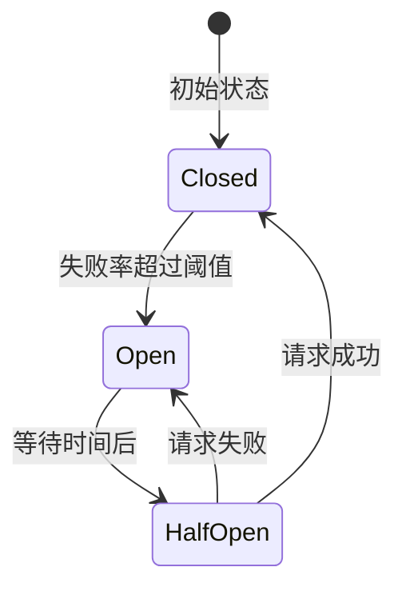

# 高可用高并发系统设计

## 目录
- [一、限流](#一限流)
- [二、降级](#二降级)
- [三、熔断](#三熔断)
- [四、缓存策略](#四缓存策略)
- [五、负载均衡](#五负载均衡)
- [六、高可用架构](#六高可用架构)
- [七、高频面试题](#七高频面试题)

## 一、限流

### 1.1 限流算法

**1. 固定窗口计数器**：
```java
public class FixedWindowRateLimiter {
    private final int limit;
    private int counter = 0;
    private long windowStart = System.currentTimeMillis();
    
    public synchronized boolean tryAcquire() {
        long now = System.currentTimeMillis();
        if (now - windowStart > 1000) {  // 1秒窗口
            windowStart = now;
            counter = 0;
        }
        if (counter < limit) {
            counter++;
            return true;
        }
        return false;
    }
}
```

**2. 滑动窗口**：
```java
public class SlidingWindowRateLimiter {
    private final Queue<Long> timestamps = new LinkedList<>();
    private final int limit;
    private final long window = 1000;  // 1秒
    
    public synchronized boolean tryAcquire() {
        long now = System.currentTimeMillis();
        // 移除过期时间戳
        while (!timestamps.isEmpty() && now - timestamps.peek() > window) {
            timestamps.poll();
        }
        if (timestamps.size() < limit) {
            timestamps.offer(now);
            return true;
        }
        return false;
    }
}
```

**3. 漏桶算法**：
```java
public class LeakyBucketRateLimiter {
    private final int capacity;  // 桶容量
    private final int rate;      // 流出速率
    private int water = 0;       // 当前水量
    private long lastLeakTime = System.currentTimeMillis();
    
    public synchronized boolean tryAcquire() {
        leak();  // 先漏水
        if (water < capacity) {
            water++;
            return true;
        }
        return false;
    }
    
    private void leak() {
        long now = System.currentTimeMillis();
        long elapsedTime = now - lastLeakTime;
        int leaked = (int) (elapsedTime * rate / 1000);  // 漏出的水量
        water = Math.max(0, water - leaked);
        lastLeakTime = now;
    }
}
```

**4. 令牌桶算法**（Guava RateLimiter）：
```java
public class TokenBucketExample {
    private final RateLimiter rateLimiter = RateLimiter.create(100.0);  // 每秒100个令牌
    
    public void doSomething() {
        if (rateLimiter.tryAcquire()) {
            // 处理请求
        } else {
            // 限流
        }
    }
}
```

### 1.2 分布式限流

**基于Redis**：
```java
@Component
public class RedisRateLimiter {
    
    @Autowired
    private StringRedisTemplate redisTemplate;
    
    public boolean tryAcquire(String key, int limit, int window) {
        String script = 
            "local count = redis.call('incr', KEYS[1]) " +
            "if count == 1 then " +
            "    redis.call('expire', KEYS[1], ARGV[1]) " +
            "end " +
            "return count <= tonumber(ARGV[2])";
        
        Boolean result = redisTemplate.execute(
            new DefaultRedisScript<>(script, Boolean.class),
            Collections.singletonList(key),
            String.valueOf(window),
            String.valueOf(limit)
        );
        
        return Boolean.TRUE.equals(result);
    }
}
```

**基于Sentinel**：
```java
@RestController
public class OrderController {
    
    @GetMapping("/order")
    @SentinelResource(
        value = "getOrder",
        blockHandler = "handleBlock"
    )
    public Order getOrder() {
        return orderService.getOrder();
    }
    
    public Order handleBlock(BlockException ex) {
        return new Order("系统繁忙，请稍后重试");
    }
}

// 配置限流规则
FlowRule rule = new FlowRule();
rule.setResource("getOrder");
rule.setGrade(RuleConstant.FLOW_GRADE_QPS);
rule.setCount(100);  // QPS限制为100
FlowRuleManager.loadRules(Collections.singletonList(rule));
```

## 二、降级

### 2.1 降级策略

**1. 开关降级**：
```java
@Service
public class UserService {
    
    @Value("${feature.recommendation.enabled:true}")
    private boolean recommendationEnabled;
    
    public List<Product> getRecommendations(Long userId) {
        if (!recommendationEnabled) {
            return Collections.emptyList();  // 降级返回空列表
        }
        return recommendationService.recommend(userId);
    }
}
```

**2. 限流降级**：
```java
public Object invoke() {
    if (rateLimiter.tryAcquire()) {
        return doInvoke();
    } else {
        return fallback();  // 降级
    }
}
```

**3. 熔断降级**：见下节

### 2.2 降级方案

```java
@Component
public class OrderServiceFallback {
    
    // 方案1：返回默认值
    public Order getOrderFallback(Long id) {
        return Order.builder()
            .id(id)
            .status("服务降级")
            .build();
    }
    
    // 方案2：返回缓存数据
    public Order getOrderFromCache(Long id) {
        return cacheService.get("order:" + id);
    }
    
    // 方案3：返回降级页面
    public String showDegradePage() {
        return "系统繁忙，请稍后再试";
    }
}
```

## 三、熔断

### 3.1 熔断器状态



### 3.2 Hystrix实现

```java
public class OrderService {
    
    @HystrixCommand(
        commandKey = "getOrder",
        fallbackMethod = "getOrderFallback",
        commandProperties = {
            @HystrixProperty(name = "execution.isolation.thread.timeoutInMilliseconds", value = "1000"),
            @HystrixProperty(name = "circuitBreaker.requestVolumeThreshold", value = "10"),
            @HystrixProperty(name = "circuitBreaker.errorThresholdPercentage", value = "50"),
            @HystrixProperty(name = "circuitBreaker.sleepWindowInMilliseconds", value = "5000")
        }
    )
    public Order getOrder(Long id) {
        return orderClient.getOrder(id);
    }
    
    public Order getOrderFallback(Long id) {
        return new Order(id, "服务熔断");
    }
}
```

### 3.3 Sentinel熔断

```java
// 慢调用比例熔断
DegradeRule slowRule = new DegradeRule();
slowRule.setResource("getOrder");
slowRule.setGrade(RuleConstant.DEGRADE_GRADE_RT);
slowRule.setCount(500);  // 响应时间超过500ms
slowRule.setSlowRatioThreshold(0.5);  // 慢调用比例50%
slowRule.setMinRequestAmount(10);
slowRule.setTimeWindow(10);

// 异常比例熔断
DegradeRule exceptionRule = new DegradeRule();
exceptionRule.setResource("getOrder");
exceptionRule.setGrade(RuleConstant.DEGRADE_GRADE_EXCEPTION_RATIO);
exceptionRule.setCount(0.5);  // 异常比例50%
exceptionRule.setTimeWindow(10);
```

## 四、缓存策略

### 4.1 多级缓存

```
┌──────────────┐
│  Browser     │  L1缓存
├──────────────┤
│  CDN         │  L2缓存
├──────────────┤
│  Nginx       │  L3缓存
├──────────────┤
│  JVM Cache   │  L4缓存（Caffeine）
├──────────────┤
│  Redis       │  L5缓存
├──────────────┤
│  Database    │  数据源
└──────────────┘
```

**实现**：
```java
@Service
public class ProductService {
    
    @Autowired
    private Cache<Long, Product> localCache;  // Caffeine
    
    @Autowired
    private RedisTemplate<String, Product> redisTemplate;
    
    @Autowired
    private ProductMapper productMapper;
    
    public Product getProduct(Long id) {
        // L1: 本地缓存
        Product product = localCache.getIfPresent(id);
        if (product != null) {
            return product;
        }
        
        // L2: Redis缓存
        product = redisTemplate.opsForValue().get("product:" + id);
        if (product != null) {
            localCache.put(id, product);
            return product;
        }
        
        // L3: 数据库
        product = productMapper.selectById(id);
        if (product != null) {
            redisTemplate.opsForValue().set("product:" + id, product, 1, TimeUnit.HOURS);
            localCache.put(id, product);
        }
        
        return product;
    }
}
```

### 4.2 缓存更新策略

**1. Cache Aside**（推荐）：
```java
// 读
public User getUser(Long id) {
    User user = cache.get(id);
    if (user == null) {
        user = db.get(id);
        cache.set(id, user);
    }
    return user;
}

// 写
public void updateUser(User user) {
    db.update(user);
    cache.delete(user.getId());  // 删除而不是更新
}
```

**2. Read/Write Through**：
```java
@CachePut(value = "users", key = "#user.id")
public User updateUser(User user) {
    return userRepository.save(user);
}

@Cacheable(value = "users", key = "#id")
public User getUser(Long id) {
    return userRepository.findById(id);
}
```

**3. Write Behind**：
```java
public void updateUser(User user) {
    cache.put(user.getId(), user);  // 先更新缓存
    asyncQueue.offer(user);  // 异步写入数据库
}
```

### 4.3 热点数据处理

```java
@Component
public class HotDataService {
    
    private final LoadingCache<Long, Product> hotProductCache = Caffeine.newBuilder()
        .maximumSize(1000)
        .expireAfterWrite(10, TimeUnit.MINUTES)
        .recordStats()
        .build(this::loadProduct);
    
    // 识别热点数据
    @Scheduled(fixedRate = 60000)
    public void identifyHotData() {
        CacheStats stats = hotProductCache.stats();
        double hitRate = stats.hitRate();
        
        if (hitRate < 0.8) {
            // 调整缓存策略
        }
    }
    
    private Product loadProduct(Long id) {
        return productService.getProduct(id);
    }
}
```

## 五、负载均衡

### 5.1 负载均衡算法

**1. 轮询（Round Robin）**：
```java
public class RoundRobinLoadBalancer {
    private List<Server> servers;
    private AtomicInteger index = new AtomicInteger(0);
    
    public Server select() {
        int i = index.getAndIncrement() % servers.size();
        return servers.get(i);
    }
}
```

**2. 加权轮询**：
```java
public class WeightedRoundRobinLoadBalancer {
    private List<Server> servers;
    
    public Server select() {
        int totalWeight = servers.stream().mapToInt(Server::getWeight).sum();
        int randomWeight = ThreadLocalRandom.current().nextInt(totalWeight);
        
        int currentWeight = 0;
        for (Server server : servers) {
            currentWeight += server.getWeight();
            if (randomWeight < currentWeight) {
                return server;
            }
        }
        return servers.get(0);
    }
}
```

**3. 最少连接（Least Connection）**：
```java
public class LeastConnectionLoadBalancer {
    private List<Server> servers;
    
    public Server select() {
        return servers.stream()
            .min(Comparator.comparingInt(Server::getActiveConnections))
            .orElse(servers.get(0));
    }
}
```

**4. 一致性Hash**：
```java
public class ConsistentHashLoadBalancer {
    private final TreeMap<Long, Server> ring = new TreeMap<>();
    private final int virtualNodes = 150;
    
    public void addServer(Server server) {
        for (int i = 0; i < virtualNodes; i++) {
            long hash = hash(server.getIp() + "#" + i);
            ring.put(hash, server);
        }
    }
    
    public Server select(String key) {
        long hash = hash(key);
        Map.Entry<Long, Server> entry = ring.ceilingEntry(hash);
        if (entry == null) {
            entry = ring.firstEntry();
        }
        return entry.getValue();
    }
    
    private long hash(String key) {
        return MurmurHash.hash64(key);
    }
}
```

### 5.2 Nginx负载均衡

```nginx
upstream backend {
    # 轮询（默认）
    server 192.168.1.10:8080;
    server 192.168.1.11:8080;
    
    # 加权轮询
    server 192.168.1.10:8080 weight=3;
    server 192.168.1.11:8080 weight=1;
    
    # IP Hash
    ip_hash;
    
    # 最少连接
    least_conn;
    
    # 健康检查
    server 192.168.1.10:8080 max_fails=3 fail_timeout=30s;
}

server {
    listen 80;
    location / {
        proxy_pass http://backend;
    }
}
```

## 六、高可用架构

### 6.1 高可用设计原则

**1. 消除单点故障**：
- 服务多实例部署
- 数据库主从复制
- Redis哨兵/集群

**2. 故障隔离**：
- 服务隔离
- 线程池隔离
- 机房隔离

**3. 快速故障转移**：
- 健康检查
- 自动摘除故障节点
- 自动切换

### 6.2 双机房架构

```
┌─────────────────┐       ┌─────────────────┐
│   机房A          │       │   机房B          │
│  ┌──────────┐   │       │  ┌──────────┐   │
│  │ Service  │   │       │  │ Service  │   │
│  │ Cluster  │   │       │  │ Cluster  │   │
│  └──────────┘   │       │  └──────────┘   │
│  ┌──────────┐   │       │  ┌──────────┐   │
│  │ DB主     │<──┼───────┼─>│ DB从     │   │
│  └──────────┘   │       │  └──────────┘   │
└─────────────────┘       └─────────────────┘
```

### 6.3 异地多活架构

```
┌──────────┐    ┌──────────┐    ┌──────────┐
│  Region1 │    │  Region2 │    │  Region3 │
│  ┌────┐  │    │  ┌────┐  │    │  ┌────┐  │
│  │ DB │<─┼────┼─>│ DB │<─┼────┼─>│ DB │  │
│  └────┘  │    │  └────┘  │    │  └────┘  │
└──────────┘    └──────────┘    └──────────┘
      ↑              ↑              ↑
      └──────────────┴──────────────┘
           数据双向同步
```

## 七、高频面试题

### Q1：限流算法的区别？

| 算法 | 特点 | 适用场景 |
|------|------|---------|
| 固定窗口 | 简单，临界问题 | 简单限流 |
| 滑动窗口 | 精确，内存占用高 | 精确限流 |
| 漏桶 | 平滑流量 | 流量整形 |
| 令牌桶 | 允许突发 | 突发流量 |

### Q2：熔断和降级的区别？

- **熔断**：下游服务故障，自动切断调用
- **降级**：系统压力大，主动放弃非核心功能

### Q3：如何设计一个高可用系统？

1. **消除单点**：多实例、主从、集群
2. **故障隔离**：服务隔离、线程池隔离
3. **限流降级**：保护核心服务
4. **熔断**：快速失败
5. **监控告警**：及时发现问题
6. **容灾演练**：验证高可用方案

---

**关键字**：限流、降级、熔断、缓存、负载均衡、高可用、Sentinel、Hystrix

