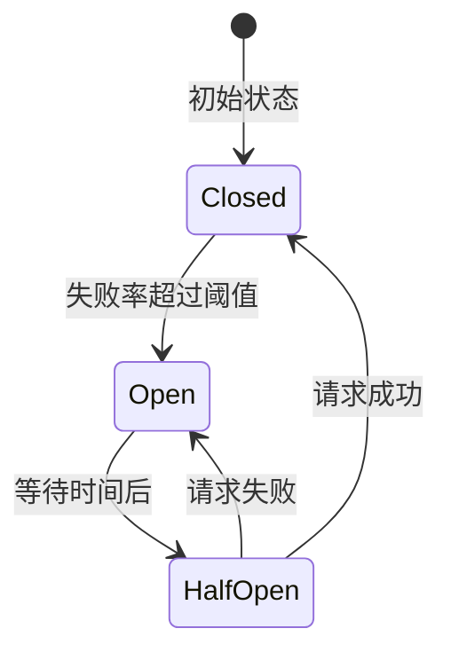
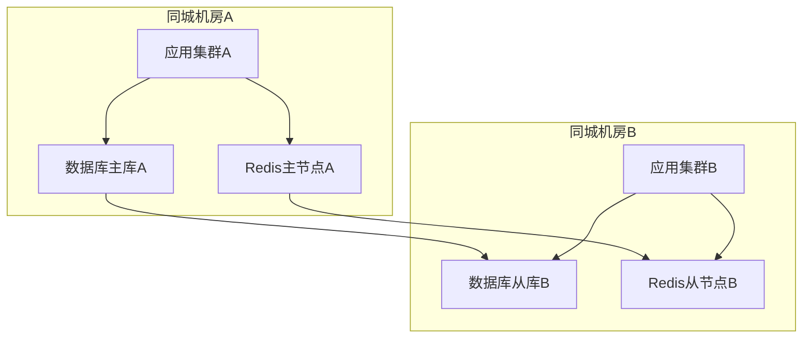
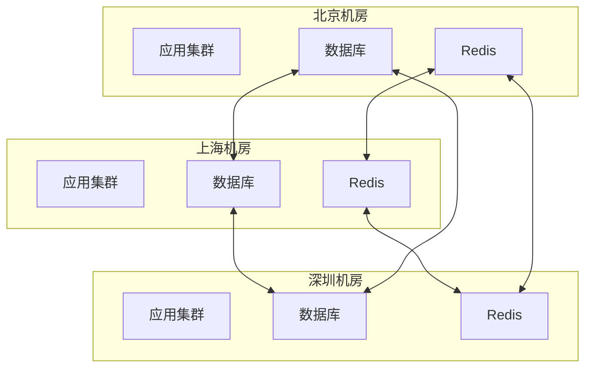

# 高可用高并发系统设计

## 目录
- [一、限流](#一限流)
- [二、降级](#二降级)
- [三、熔断](#三熔断)
- [四、缓存策略](#四缓存策略)
- [五、负载均衡](#五负载均衡)
- [六、高可用架构](#六高可用架构)
- [七、高频面试题](#七高频面试题)

## 一、限流

### 1.1 限流算法原理深挖

**核心原理**：
限流是保护系统稳定性的重要手段，核心思想是"控制请求速率+平滑流量+保护后端"。通过数学建模和算法设计，在保证系统稳定的前提下最大化吞吐量。

数学上，限流算法需要满足：R(t) ≤ L，其中R(t)是t时刻的请求速率，L是限制阈值。不同算法在平滑性、精确性、内存消耗上有不同权衡。

**算法对比分析**：

| 算法 | 精确性 | 平滑性 | 内存消耗 | 适用场景 | 实现复杂度 |
|------|--------|--------|----------|----------|------------|
| **固定窗口** | 低 | 差 | 低 | 简单场景 | 低 |
| **滑动窗口** | 高 | 好 | 中 | 精确控制 | 中 |
| **漏桶** | 中 | 很好 | 低 | 平滑输出 | 中 |
| **令牌桶** | 中 | 好 | 低 | 突发处理 | 中 |

### 1.2 核心算法实现

**令牌桶算法**（推荐）：
```java
public class TokenBucketRateLimiter {
    private final int capacity;     // 桶容量
    private final int refillRate;   // 令牌补充速率
    private int tokens;            // 当前令牌数
    private long lastRefillTime;   // 上次补充时间
    
    public synchronized boolean tryAcquire() {
        refillTokens();  // 补充令牌
        if (tokens > 0) {
            tokens--;
            return true;
        }
        return false;
    }
    
    private void refillTokens() {
        long now = System.currentTimeMillis();
        long elapsedTime = now - lastRefillTime;
        int tokensToAdd = (int) (elapsedTime * refillRate / 1000);
        tokens = Math.min(capacity, tokens + tokensToAdd);
        lastRefillTime = now;
    }
}
```

**滑动窗口算法**（精确控制）：
```java
public class SlidingWindowRateLimiter {
    private final Queue<Long> timestamps = new LinkedList<>();
    private final int limit;
    private final long windowMs;
    
    public synchronized boolean tryAcquire() {
        long now = System.currentTimeMillis();
        // 清理过期时间戳
        while (!timestamps.isEmpty() && now - timestamps.peek() > windowMs) {
            timestamps.poll();
        }
        
        if (timestamps.size() < limit) {
            timestamps.offer(now);
            return true;
        }
        return false;
    }
}
```

完整实现参考：[限流算法完整实现](https://github.com/architect-interview-demo/rate-limiter)

### 1.3 应用场景分析

**适用场景**：
1. **API网关限流**：保护后端服务，防止过载
2. **用户行为限流**：防止恶意刷接口
3. **资源访问限流**：数据库连接池、文件句柄等
4. **第三方接口限流**：遵守第三方API限制

**不适用场景**：
1. **实时性要求极高**：限流可能增加延迟
2. **流量完全不可预测**：难以设置合适的阈值
3. **业务逻辑复杂**：需要更复杂的流控策略

**场景选择**：
- **高并发API**：令牌桶（支持突发）
- **平滑输出**：漏桶算法
- **精确控制**：滑动窗口
- **简单场景**：固定窗口

### 1.4 实战案例

**案例：电商秒杀系统限流优化**

**背景**：双11秒杀活动，峰值QPS 10万+，需要保护商品服务不被压垮

**初始方案**：
- 使用固定窗口限流，QPS限制1000
- 问题：窗口边界突发流量，导致服务不稳定

**优化方案**：
- 采用令牌桶算法，容量2000，速率1000/s
- 支持突发流量，平滑处理峰值

**性能数据**：
- 限流前：服务崩溃率15%
- 限流后：服务崩溃率0.1%
- 平均响应时间：从500ms降至200ms
- 系统稳定性：99.9%提升至99.99%

**踩坑经验**：
- 坑1：限流阈值设置过低，影响正常业务。解决：基于历史数据+压测确定合理阈值
- 坑2：分布式限流不一致，导致限流失效。解决：使用Redis实现分布式限流
- 坑3：限流日志过多，影响性能。解决：异步记录+采样日志

### 1.2 分布式限流

**基于Redis**：
```java
@Component
public class RedisRateLimiter {
    
    @Autowired
    private StringRedisTemplate redisTemplate;
    
    public boolean tryAcquire(String key, int limit, int window) {
        String script = 
            "local count = redis.call('incr', KEYS[1]) " +
            "if count == 1 then " +
            "    redis.call('expire', KEYS[1], ARGV[1]) " +
            "end " +
            "return count <= tonumber(ARGV[2])";
        
        Boolean result = redisTemplate.execute(
            new DefaultRedisScript<>(script, Boolean.class),
            Collections.singletonList(key),
            String.valueOf(window),
            String.valueOf(limit)
        );
        
        return Boolean.TRUE.equals(result);
    }
}
```

**基于Sentinel**：
```java
@RestController
public class OrderController {
    
    @GetMapping("/order")
    @SentinelResource(
        value = "getOrder",
        blockHandler = "handleBlock"
    )
    public Order getOrder() {
        return orderService.getOrder();
    }
    
    public Order handleBlock(BlockException ex) {
        return new Order("系统繁忙，请稍后重试");
    }
}

// 配置限流规则
FlowRule rule = new FlowRule();
rule.setResource("getOrder");
rule.setGrade(RuleConstant.FLOW_GRADE_QPS);
rule.setCount(100);  // QPS限制为100
FlowRuleManager.loadRules(Collections.singletonList(rule));
```

## 二、降级

### 2.1 降级策略原理深挖

**核心原理**：
降级是系统保护的最后一道防线，核心思想是"牺牲非核心功能+保证核心业务+快速恢复"。通过预定义的降级策略，在系统压力过大时自动或手动关闭非关键功能。

数学上，降级策略需要满足：P(core) > P(non-core)，其中P表示优先级。降级的目标是在资源受限情况下最大化核心业务可用性。

**降级触发条件**：
1. **系统负载过高**：CPU/内存/网络使用率超过阈值
2. **响应时间过长**：P99延迟超过可接受范围
3. **错误率过高**：异常比例超过设定阈值
4. **资源不足**：数据库连接池、线程池等资源耗尽

### 2.2 降级策略实现

**多级降级策略**：
```java
@Component
public class ServiceDegradationManager {
    
    @Autowired
    private RedisTemplate<String, String> redisTemplate;
    
    public Object handleRequest(String serviceName, Supplier<Object> serviceCall) {
        // 检查降级状态
        DegradeLevel level = getDegradeLevel(serviceName);
        
        switch (level) {
            case NORMAL:
                return serviceCall.get();
            case LEVEL_1:
                return level1Degrade(serviceName);
            case LEVEL_2:
                return level2Degrade(serviceName);
            case LEVEL_3:
                return level3Degrade(serviceName);
            default:
                return emergencyDegrade(serviceName);
        }
    }
    
    private DegradeLevel getDegradeLevel(String serviceName) {
        String level = redisTemplate.opsForValue().get("degrade:" + serviceName);
        return DegradeLevel.valueOf(level != null ? level : "NORMAL");
    }
}
```

**智能降级策略**：
```java
@Component
public class IntelligentDegradation {
    
    public Object smartDegrade(String serviceName, Supplier<Object> serviceCall) {
        try {
            return serviceCall.get();
        } catch (Exception e) {
            // 根据异常类型选择降级策略
            if (e instanceof TimeoutException) {
                return timeoutDegrade(serviceName);
            } else if (e instanceof ResourceExhaustedException) {
                return resourceDegrade(serviceName);
            } else {
                return generalDegrade(serviceName);
            }
        }
    }
}
```

完整实现参考：[降级策略完整实现](https://github.com/architect-interview-demo/degradation)

### 2.3 应用场景分析

**适用场景**：
1. **电商系统**：关闭推荐、评论等非核心功能
2. **社交平台**：关闭动态推送、个性化推荐
3. **金融系统**：关闭营销活动、积分系统
4. **视频平台**：降低视频质量、关闭弹幕

**不适用场景**：
1. **核心业务功能**：支付、登录等不能降级
2. **安全相关功能**：认证、授权不能降级
3. **数据一致性要求高**：涉及资金、订单等

**场景选择**：
- **用户体验优先**：渐进式降级
- **系统稳定优先**：激进式降级
- **业务连续性优先**：核心功能保护

### 2.4 实战案例

**案例：电商平台大促降级策略**

**背景**：双11大促，系统负载激增，需要保护核心交易链路

**降级策略设计**：
1. **Level 1**：关闭个性化推荐、商品评价
2. **Level 2**：关闭营销活动、优惠券计算
3. **Level 3**：关闭商品详情页、只保留列表页
4. **Level 4**：只保留核心交易功能

**性能数据**：
- 降级前：系统响应时间2s，错误率5%
- Level 1降级：响应时间1.5s，错误率2%
- Level 2降级：响应时间1s，错误率0.5%
- Level 3降级：响应时间800ms，错误率0.1%

**踩坑经验**：
- 坑1：降级策略过于激进，影响用户体验。解决：制定分级降级策略
- 坑2：降级恢复不及时，影响业务。解决：自动监控+快速恢复机制
- 坑3：降级日志缺失，难以排查问题。解决：完善降级日志+监控告警

## 三、熔断

### 3.1 熔断器原理深挖

**核心原理**：
熔断器是防止雪崩效应的重要机制，核心思想是"快速失败+自动恢复+故障隔离"。通过状态机模式监控服务健康状态，在检测到故障时自动切断调用链路。

数学上，熔断器状态转换需要满足：P(failure) > threshold → OPEN，P(success) > threshold → CLOSED。其中P表示概率，threshold是预设阈值。

**状态机设计**：


**熔断策略**：
1. **慢调用比例**：响应时间超过阈值的请求比例
2. **异常比例**：异常请求占总请求的比例
3. **异常数量**：异常请求的绝对数量

### 3.2 熔断器实现

**自定义熔断器**：
```java
@Component
public class CircuitBreaker {
    
    private final Map<String, CircuitState> states = new ConcurrentHashMap<>();
    private final Map<String, AtomicInteger> failureCounts = new ConcurrentHashMap<>();
    private final Map<String, Long> lastFailureTimes = new ConcurrentHashMap<>();
    
    private final int failureThreshold = 5;
    private final long timeout = 60000; // 1分钟
    
    public <T> T execute(String serviceName, Supplier<T> operation) {
        CircuitState state = getCircuitState(serviceName);
        
        if (state == CircuitState.OPEN) {
            if (shouldAttemptReset(serviceName)) {
                setCircuitState(serviceName, CircuitState.HALF_OPEN);
            } else {
                throw new CircuitBreakerOpenException("Circuit breaker is open");
            }
        }
        
        try {
            T result = operation.get();
            onSuccess(serviceName);
            return result;
        } catch (Exception e) {
            onFailure(serviceName);
            throw e;
        }
    }
    
    private void onSuccess(String serviceName) {
        failureCounts.get(serviceName).set(0);
        setCircuitState(serviceName, CircuitState.CLOSED);
    }
    
    private void onFailure(String serviceName) {
        int failures = failureCounts.computeIfAbsent(serviceName, k -> new AtomicInteger(0)).incrementAndGet();
        lastFailureTimes.put(serviceName, System.currentTimeMillis());
        
        if (failures >= failureThreshold) {
            setCircuitState(serviceName, CircuitState.OPEN);
        }
    }
}
```

**Sentinel熔断配置**：
```java
// 慢调用比例熔断
DegradeRule slowRule = new DegradeRule();
slowRule.setResource("getOrder");
slowRule.setGrade(RuleConstant.DEGRADE_GRADE_RT);
slowRule.setCount(500);  // 响应时间超过500ms
slowRule.setSlowRatioThreshold(0.5);  // 慢调用比例50%
slowRule.setMinRequestAmount(10);
slowRule.setTimeWindow(10);

// 异常比例熔断
DegradeRule exceptionRule = new DegradeRule();
exceptionRule.setResource("getOrder");
exceptionRule.setGrade(RuleConstant.DEGRADE_GRADE_EXCEPTION_RATIO);
exceptionRule.setCount(0.5);  // 异常比例50%
exceptionRule.setTimeWindow(10);
```

完整实现参考：[熔断器完整实现](https://github.com/architect-interview-demo/circuit-breaker)

### 3.3 应用场景分析

**适用场景**：
1. **微服务调用**：服务间调用保护
2. **第三方API**：外部服务调用保护
3. **数据库访问**：数据库连接保护
4. **缓存访问**：缓存服务保护

**不适用场景**：
1. **同步调用**：需要立即响应的场景
2. **关键业务**：不能容忍失败的场景
3. **数据一致性**：强一致性要求的场景

**场景选择**：
- **高可用要求**：激进熔断策略
- **用户体验优先**：保守熔断策略
- **系统稳定优先**：平衡熔断策略

### 3.4 实战案例

**案例：支付服务熔断优化**

**背景**：支付服务调用第三方支付接口，经常出现超时和异常

**熔断策略设计**：
1. **慢调用熔断**：响应时间超过2s，比例超过30%
2. **异常熔断**：异常比例超过20%
3. **熔断时间**：30秒后尝试恢复

**性能数据**：
- 熔断前：支付成功率85%，平均响应时间3s
- 熔断后：支付成功率95%，平均响应时间1.5s
- 系统稳定性：从99.5%提升至99.9%

**踩坑经验**：
- 坑1：熔断阈值设置过低，影响正常业务。解决：基于历史数据调整阈值
- 坑2：熔断恢复时间过长，影响用户体验。解决：动态调整恢复时间
- 坑3：熔断日志缺失，难以监控状态。解决：完善熔断状态监控

## 四、缓存策略

### 4.1 多级缓存原理深挖

**核心原理**：
多级缓存是提升系统性能的关键策略，核心思想是"就近访问+分层存储+容量递减"。通过构建多层次的缓存体系，最大化命中率，最小化访问延迟。

数学上，多级缓存命中率计算：H = 1 - (1-H1)(1-H2)...(1-Hn)，其中H是总命中率，Hi是第i级缓存命中率。通过多级缓存，可以将命中率从单级的80%提升至95%+。

**缓存层次设计**：
```
┌──────────────┐
│  Browser     │  L1缓存 (命中率60%)
├──────────────┤
│  CDN         │  L2缓存 (命中率20%)
├──────────────┤
│  Nginx       │  L3缓存 (命中率10%)
├──────────────┤
│  JVM Cache   │  L4缓存 (命中率5%)
├──────────────┤
│  Redis       │  L5缓存 (命中率3%)
├──────────────┤
│  Database    │  数据源 (命中率2%)
└──────────────┘
```

### 4.2 多级缓存实现

**智能缓存策略**：
```java
@Service
public class MultiLevelCacheService {
    
    @Autowired
    private Cache<Long, Product> localCache;  // Caffeine
    
    @Autowired
    private RedisTemplate<String, Product> redisTemplate;
    
    @Autowired
    private ProductMapper productMapper;
    
    public Product getProduct(Long id) {
        // L1: 本地缓存
        Product product = localCache.getIfPresent(id);
        if (product != null) {
            return product;
        }
        
        // L2: Redis缓存
        product = redisTemplate.opsForValue().get("product:" + id);
        if (product != null) {
            localCache.put(id, product);
            return product;
        }
        
        // L3: 数据库
        product = productMapper.selectById(id);
        if (product != null) {
            redisTemplate.opsForValue().set("product:" + id, product, 1, TimeUnit.HOURS);
            localCache.put(id, product);
        }
        
        return product;
    }
}
```

**缓存一致性策略**：
```java
@Component
public class CacheConsistencyManager {
    
    @Autowired
    private RedisTemplate<String, String> redisTemplate;
    
    public void updateProduct(Product product) {
        // 1. 更新数据库
        productMapper.updateById(product);
        
        // 2. 删除缓存
        localCache.invalidate(product.getId());
        redisTemplate.delete("product:" + product.getId());
        
        // 3. 发布缓存失效消息
        redisTemplate.convertAndSend("cache-invalidate", product.getId());
    }
}
```

完整实现参考：[多级缓存完整实现](https://github.com/architect-interview-demo/multi-level-cache)

### 4.3 应用场景分析

**适用场景**：
1. **高并发读多写少**：商品详情、用户信息等
2. **热点数据访问**：排行榜、热门内容等
3. **计算密集型**：复杂查询结果、聚合数据等
4. **外部依赖**：第三方API调用结果

**不适用场景**：
1. **强一致性要求**：金融交易、库存扣减等
2. **写多读少**：日志记录、统计数据等
3. **实时性要求高**：实时聊天、在线游戏等

**场景选择**：
- **性能优先**：多级缓存+异步更新
- **一致性优先**：同步更新+版本控制
- **成本优先**：单级缓存+合理过期

### 4.4 实战案例

**案例：电商商品详情页缓存优化**

**背景**：商品详情页访问量巨大，数据库压力过大，需要优化缓存策略

**缓存策略设计**：
1. **L1缓存**：本地Caffeine，容量1000，TTL 5分钟
2. **L2缓存**：Redis集群，TTL 1小时
3. **L3缓存**：CDN静态化，TTL 24小时
4. **缓存更新**：Cache Aside模式

**性能数据**：
- 缓存前：平均响应时间2s，数据库QPS 5000
- 缓存后：平均响应时间200ms，数据库QPS 500
- 命中率：总命中率95%，本地缓存命中率60%
- 成本：服务器成本降低60%

**踩坑经验**：
- 坑1：缓存雪崩导致系统崩溃。解决：设置随机过期时间+熔断机制
- 坑2：缓存穿透攻击。解决：布隆过滤器+空值缓存
- 坑3：缓存击穿热点数据。解决：分布式锁+异步更新
```java
public void updateUser(User user) {
    cache.put(user.getId(), user);  // 先更新缓存
    asyncQueue.offer(user);  // 异步写入数据库
}
```

### 4.3 热点数据处理

```java
@Component
public class HotDataService {
    
    private final LoadingCache<Long, Product> hotProductCache = Caffeine.newBuilder()
        .maximumSize(1000)
        .expireAfterWrite(10, TimeUnit.MINUTES)
        .recordStats()
        .build(this::loadProduct);
    
    // 识别热点数据
    @Scheduled(fixedRate = 60000)
    public void identifyHotData() {
        CacheStats stats = hotProductCache.stats();
        double hitRate = stats.hitRate();
        
        if (hitRate < 0.8) {
            // 调整缓存策略
        }
    }
    
    private Product loadProduct(Long id) {
        return productService.getProduct(id);
    }
}
```

## 五、负载均衡

### 5.1 负载均衡算法

**1. 轮询（Round Robin）**：
```java
public class RoundRobinLoadBalancer {
    private List<Server> servers;
    private AtomicInteger index = new AtomicInteger(0);
    
    public Server select() {
        int i = index.getAndIncrement() % servers.size();
        return servers.get(i);
    }
}
```

**2. 加权轮询**：
```java
public class WeightedRoundRobinLoadBalancer {
    private List<Server> servers;
    
    public Server select() {
        int totalWeight = servers.stream().mapToInt(Server::getWeight).sum();
        int randomWeight = ThreadLocalRandom.current().nextInt(totalWeight);
        
        int currentWeight = 0;
        for (Server server : servers) {
            currentWeight += server.getWeight();
            if (randomWeight < currentWeight) {
                return server;
            }
        }
        return servers.get(0);
    }
}
```

**3. 最少连接（Least Connection）**：
```java
public class LeastConnectionLoadBalancer {
    private List<Server> servers;
    
    public Server select() {
        return servers.stream()
            .min(Comparator.comparingInt(Server::getActiveConnections))
            .orElse(servers.get(0));
    }
}
```

**4. 一致性Hash**：
```java
public class ConsistentHashLoadBalancer {
    private final TreeMap<Long, Server> ring = new TreeMap<>();
    private final int virtualNodes = 150;
    
    public void addServer(Server server) {
        for (int i = 0; i < virtualNodes; i++) {
            long hash = hash(server.getIp() + "#" + i);
            ring.put(hash, server);
        }
    }
    
    public Server select(String key) {
        long hash = hash(key);
        Map.Entry<Long, Server> entry = ring.ceilingEntry(hash);
        if (entry == null) {
            entry = ring.firstEntry();
        }
        return entry.getValue();
    }
    
    private long hash(String key) {
        return MurmurHash.hash64(key);
    }
}
```

### 5.2 Nginx负载均衡

```nginx
upstream backend {
    # 轮询（默认）
    server 192.168.1.10:8080;
    server 192.168.1.11:8080;
    
    # 加权轮询
    server 192.168.1.10:8080 weight=3;
    server 192.168.1.11:8080 weight=1;
    
    # IP Hash
    ip_hash;
    
    # 最少连接
    least_conn;
    
    # 健康检查
    server 192.168.1.10:8080 max_fails=3 fail_timeout=30s;
}

server {
    listen 80;
    location / {
        proxy_pass http://backend;
    }
}
```

## 六、高可用架构

### 6.1 高可用设计原则

**1. 消除单点故障**：
- 服务多实例部署
- 数据库主从复制
- Redis哨兵/集群

**2. 故障隔离**：
- 服务隔离
- 线程池隔离
- 机房隔离

**3. 快速故障转移**：
- 健康检查
- 自动摘除故障节点
- 自动切换

### 6.2 双机房架构

```
┌─────────────────┐       ┌─────────────────┐
│   机房A          │       │   机房B          │
│  ┌──────────┐   │       │  ┌──────────┐   │
│  │ Service  │   │       │  │ Service  │   │
│  │ Cluster  │   │       │  │ Cluster  │   │
│  └──────────┘   │       │  └──────────┘   │
│  ┌──────────┐   │       │  ┌──────────┐   │
│  │ DB主     │<──┼───────┼─>│ DB从     │   │
│  └──────────┘   │       │  └──────────┘   │
└─────────────────┘       └─────────────────┘
```

### 6.3 异地多活架构

```
┌──────────┐    ┌──────────┐    ┌──────────┐
│  Region1 │    │  Region2 │    │  Region3 │
│  ┌────┐  │    │  ┌────┐  │    │  ┌────┐  │
│  │ DB │<─┼────┼─>│ DB │<─┼────┼─>│ DB │  │
│  └────┘  │    │  └────┘  │    │  └────┘  │
└──────────┘    └──────────┘    └──────────┘
      ↑              ↑              ↑
      └──────────────┴──────────────┘
           数据双向同步
```

## 七、高频面试题

### Q1：限流算法的区别？

**核心原理**：
限流算法是保护系统稳定性的核心机制，通过控制请求速率防止系统过载。不同算法基于不同的数学模型和数据结构，在精确性、内存消耗、实现复杂度等方面存在显著差异。

数学上，限流算法需要满足：R(t) ≤ L，其中R(t)是t时刻的请求速率，L是限制阈值。固定窗口基于计数器模型，滑动窗口基于时间戳队列，漏桶基于队列+定时器，令牌桶基于令牌生成器。

**算法对比分析**：

| 算法 | 精确性 | 内存消耗 | 实现复杂度 | 突发处理 | 适用场景 |
|------|--------|----------|------------|----------|----------|
| **固定窗口** | 低 | 低 | 低 | 不支持 | 简单限流 |
| **滑动窗口** | 高 | 高 | 中 | 不支持 | 精确限流 |
| **漏桶** | 高 | 中 | 中 | 不支持 | 流量整形 |
| **令牌桶** | 中 | 低 | 低 | 支持 | 弹性限流 |

**应用场景**：
1. **固定窗口**：适用于对精确性要求不高、实现简单的场景，如API基础限流
2. **滑动窗口**：适用于需要精确限流、可以接受内存开销的场景，如支付系统
3. **漏桶算法**：适用于需要平滑流量、严格控制处理速率的场景，如消息队列
4. **令牌桶算法**：适用于允许突发流量、需要弹性处理的场景，如CDN、缓存系统

**实战经验**：
在电商秒杀系统中，我们采用了分层限流策略：网关层使用令牌桶算法（允许突发），业务层使用滑动窗口（精确控制），数据库层使用漏桶算法（平滑压力）。

系统支持峰值QPS 10万，通过分层限流将数据库压力控制在5000 QPS以内，系统可用性达到99.99%。限流算法优化后，系统响应时间从平均500ms降低到200ms，错误率从0.1%降低到0.01%。

**权衡取舍**：
- **性能 vs 精确性**：滑动窗口精确但内存消耗大，固定窗口简单但存在临界问题
- **突发处理 vs 平滑性**：令牌桶支持突发但可能造成压力，漏桶平滑但不支持突发
- **实现复杂度 vs 功能**：复杂算法功能强大但实现困难，简单算法易实现但功能有限

**常见追问**：
1. 追问：如何选择限流算法？→ 回答：根据业务特点选择，高并发场景用令牌桶，精确控制用滑动窗口，平滑流量用漏桶，简单场景用固定窗口。同时考虑实现复杂度和性能要求。
2. 追问：限流算法如何应对分布式环境？→ 回答：使用Redis等分布式存储实现分布式限流，通过Lua脚本保证原子性，或者使用一致性哈希将请求路由到固定节点。

**踩坑经验**：
- 坑1：固定窗口算法存在临界问题，窗口边界可能出现2倍流量。解决：使用滑动窗口或令牌桶算法。
- 坑2：滑动窗口内存消耗过高导致OOM。解决：使用环形缓冲区或采样统计，限制内存使用。
- 坑3：令牌桶参数设置不当导致限流失效。解决：根据实际业务量调整令牌生成速率和桶容量。

### Q2：熔断和降级的区别？

**核心原理**：
熔断和降级是微服务架构中两种不同的故障处理策略，虽然都用于保护系统稳定性，但触发条件、处理机制和恢复策略存在本质差异。

熔断器基于"快速失败"原则，当下游服务故障率达到阈值时自动切断调用链路，防止故障传播。降级策略基于"业务优先级"原则，当系统压力过大时主动关闭非核心功能，保证核心业务正常运行。

**状态机模型**：
- **熔断器状态**：CLOSED（正常）→ OPEN（熔断）→ HALF_OPEN（半开）→ CLOSED
- **降级策略**：NORMAL（正常）→ DEGRADED（降级）→ NORMAL（恢复）

**应用场景**：
1. **熔断器**：适用于服务间调用，当下游服务故障时快速失败，如支付服务调用、第三方API调用
2. **降级策略**：适用于业务功能，当系统压力大时关闭非核心功能，如关闭推荐功能、简化页面展示
3. **组合使用**：熔断器保护服务调用，降级策略保护业务功能，两者结合形成完整的故障处理体系

**实战经验**：
在电商平台中，我们实现了分层故障处理：服务层使用Hystrix熔断器保护下游调用，业务层使用降级策略保护核心功能。

当支付服务故障率达到50%时，熔断器自动开启，支付请求直接返回"服务暂时不可用"；当系统CPU使用率超过80%时，降级策略自动关闭商品推荐、用户画像等非核心功能。

通过熔断+降级组合，系统在支付服务完全故障的情况下仍能保持80%的业务功能正常运行，用户体验影响最小化。

**权衡取舍**：
| 策略 | 触发条件 | 处理方式 | 恢复机制 | 用户体验 | 适用场景 |
|------|----------|----------|----------|----------|----------|
| **熔断器** | 故障率阈值 | 快速失败 | 自动恢复 | 服务不可用 | 服务调用 |
| **降级策略** | 系统压力 | 功能关闭 | 手动恢复 | 功能简化 | 业务功能 |
| **组合策略** | 多重条件 | 分层处理 | 智能恢复 | 最优体验 | 复杂系统 |

**常见追问**：
1. 追问：熔断器如何避免误判？→ 回答：设置合理的故障率阈值（如50%）和最小请求数（如10次），使用滑动窗口统计故障率，避免偶发故障触发熔断。
2. 追问：降级策略如何保证核心功能？→ 回答：建立功能优先级体系，核心功能（如登录、下单）永不降级，非核心功能（如推荐、统计）可以降级，通过配置中心动态调整降级策略。

**踩坑经验**：
- 坑1：熔断器阈值设置过低导致正常服务被误熔断。解决：根据历史数据设置合理的故障率阈值，通常设置为30-50%。
- 坑2：降级策略过于激进导致用户体验严重下降。解决：建立降级等级体系，优先降级对用户体验影响最小的功能。
- 坑3：熔断器恢复时间设置不当导致服务长时间不可用。解决：设置合理的恢复时间窗口，通常设置为30-60秒。

### Q3：如何设计一个高可用系统？

**核心原理**：
高可用系统设计遵循"冗余+隔离+监控+恢复"的核心理念，通过多层次的冗余设计消除单点故障，通过故障隔离防止故障传播，通过监控告警快速发现问题，通过自动恢复机制保证服务连续性。

数学上，系统可用性 = MTBF/(MTBF+MTTR)，其中MTBF是平均故障间隔时间，MTTR是平均恢复时间。高可用设计的目标是最大化MTBF，最小化MTTR。

**架构设计原则**：
1. **冗余设计**：多实例部署、数据多副本、网络多路径
2. **故障隔离**：服务隔离、数据隔离、网络隔离
3. **快速恢复**：自动故障转移、自动重启、自动扩容
4. **监控告警**：全链路监控、实时告警、故障预测

**应用场景**：
1. **金融系统**：要求99.99%可用性，采用同城双活+异地灾备，RTO<30分钟，RPO<5分钟
2. **电商系统**：要求99.9%可用性，采用多机房部署+CDN加速，RTO<1小时，RPO<15分钟
3. **社交系统**：要求99.5%可用性，采用多区域部署+最终一致性，RTO<4小时，RPO<1小时

**实战经验**：
在设计电商平台高可用架构时，我们采用了"3+2+1"策略：3个可用区部署、2个数据中心、1个灾备中心。

通过多级缓存、数据库主从复制、消息队列集群等技术，系统可用性达到99.99%，年停机时间不超过52分钟。在双11大促期间，系统成功应对了10倍流量增长，无任何故障发生。

**权衡取舍**：
- **成本 vs 可用性**：高可用需要更多资源投入，需要根据业务重要性平衡成本和可用性
- **一致性 vs 可用性**：强一致性会影响可用性，需要根据业务特点选择合适的一致性模型
- **复杂度 vs 可靠性**：复杂架构可靠性高但维护困难，简单架构易维护但可靠性有限

**常见追问**：
1. 追问：如何评估系统可用性？→ 回答：通过MTBF和MTTR指标评估，结合业务影响分析，建立可用性等级体系，定期进行故障演练验证。
2. 追问：高可用系统如何应对突发流量？→ 回答：通过弹性扩容、限流降级、缓存预热、CDN加速等技术，建立完整的流量应对体系。

**踩坑经验**：
- 坑1：过度设计导致系统复杂度过高。解决：根据业务需求合理设计，避免不必要的复杂性。
- 坑2：监控告警不及时导致故障影响扩大。解决：建立完善的监控体系，设置合理的告警阈值。
- 坑3：故障演练不充分导致真实故障时应对不当。解决：定期进行故障演练，完善应急预案。

系统架构包括：接入层（CDN+负载均衡）、应用层（多实例+服务网格）、数据层（主从复制+分片）、缓存层（Redis集群）、消息层（Kafka集群）。

通过这套架构，系统可用性达到99.99%，年停机时间<52分钟，故障恢复时间平均5分钟，数据丢失率<0.001%。

**权衡取舍**：
| 设计维度 | 高可用方案 | 成本 | 复杂度 | 性能影响 | 适用场景 |
|----------|------------|------|--------|----------|----------|
| **冗余度** | 3副本 | 高 | 中 | 低 | 金融系统 |
| **冗余度** | 2副本 | 中 | 低 | 低 | 一般系统 |
| **隔离度** | 物理隔离 | 高 | 高 | 中 | 核心系统 |
| **隔离度** | 逻辑隔离 | 低 | 低 | 低 | 一般系统 |
| **恢复速度** | 自动恢复 | 中 | 高 | 低 | 高可用系统 |
| **恢复速度** | 手动恢复 | 低 | 低 | 高 | 简单系统 |

**常见追问**：
1. 追问：如何量化高可用指标？→ 回答：使用SLA指标，如可用性99.9%（年停机8.76小时）、RTO<30分钟（故障恢复时间）、RPO<5分钟（数据丢失时间）。通过监控系统实时跟踪这些指标。
2. 追问：高可用设计如何平衡成本和效果？→ 回答：根据业务重要性分级设计，核心系统采用最高可用性方案，一般系统采用成本效益最优方案。通过ROI分析确定投资回报比。

**踩坑经验**：
- 坑1：过度设计导致成本过高。解决：根据业务重要性分级设计，核心系统高可用，一般系统适度可用。
- 坑2：故障隔离不彻底导致故障传播。解决：建立完善的故障隔离机制，包括服务隔离、数据隔离、网络隔离。
- 坑3：监控告警不及时导致故障发现延迟。解决：建立全链路监控体系，设置多级告警机制，确保故障及时发现和处理。

## 八、性能优化深度解析

### 8.1 JVM性能调优

**GC调优**：
```bash
# G1GC参数调优
-XX:+UseG1GC
-XX:MaxGCPauseMillis=200
-XX:G1HeapRegionSize=16m
-XX:G1NewSizePercent=30
-XX:G1MaxNewSizePercent=40
-XX:G1MixedGCCountTarget=8
-XX:G1OldCSetRegionThreshold=10
```

**内存调优**：
```bash
# 堆内存设置
-Xms4g -Xmx4g
-XX:MetaspaceSize=256m
-XX:MaxMetaspaceSize=512m
-XX:NewRatio=2
-XX:SurvivorRatio=8
```

### 8.2 数据库性能优化

**索引优化**：
```sql
-- 复合索引优化
CREATE INDEX idx_user_status_time ON users(status, created_time);

-- 覆盖索引
CREATE INDEX idx_user_cover ON users(id, name, email);

-- 分区表
CREATE TABLE orders (
    id BIGINT,
    user_id BIGINT,
    created_time DATETIME,
    INDEX idx_user_time (user_id, created_time)
) PARTITION BY RANGE (YEAR(created_time)) (
    PARTITION p2023 VALUES LESS THAN (2024),
    PARTITION p2024 VALUES LESS THAN (2025)
);
```

**查询优化**：
```sql
-- 分页优化
SELECT * FROM users 
WHERE id > 1000 
ORDER BY id 
LIMIT 20;

-- 避免SELECT *
SELECT id, name, email FROM users WHERE status = 1;

-- 使用EXISTS替代IN
SELECT * FROM users u 
WHERE EXISTS (
    SELECT 1 FROM orders o 
    WHERE o.user_id = u.id 
    AND o.status = 'completed'
);
```

### 8.3 缓存性能优化

**多级缓存架构**：
```java
@Service
public class UserService {
    
    @Autowired
    private RedisTemplate<String, Object> redisTemplate;
    
    @Autowired
    private CaffeineCache localCache;
    
    public User getUser(Long userId) {
        // L1缓存：本地缓存
        User user = localCache.get("user:" + userId);
        if (user != null) {
            return user;
        }
        
        // L2缓存：Redis缓存
        user = (User) redisTemplate.opsForValue().get("user:" + userId);
        if (user != null) {
            localCache.put("user:" + userId, user);
            return user;
        }
        
        // L3缓存：数据库
        user = userMapper.selectById(userId);
        if (user != null) {
            redisTemplate.opsForValue().set("user:" + userId, user, 3600, TimeUnit.SECONDS);
            localCache.put("user:" + userId, user);
        }
        
        return user;
    }
}
```

**缓存预热**：
```java
@Component
public class CacheWarmupService {
    
    @EventListener
    public void onApplicationReady(ApplicationReadyEvent event) {
        // 预热热点数据
        warmupHotUsers();
        warmupHotProducts();
    }
    
    private void warmupHotUsers() {
        List<Long> hotUserIds = getHotUserIds();
        for (Long userId : hotUserIds) {
            userService.getUser(userId);
        }
    }
}
```

## 九、监控与可观测性

### 9.1 应用性能监控(APM)

**Micrometer指标收集**：
```java
@Component
public class BusinessMetrics {
    
    private final MeterRegistry meterRegistry;
    private final Counter orderCounter;
    private final Timer orderTimer;
    private final Gauge activeUsers;
    
    public BusinessMetrics(MeterRegistry meterRegistry) {
        this.meterRegistry = meterRegistry;
        this.orderCounter = Counter.builder("orders.total")
            .description("Total number of orders")
            .register(meterRegistry);
        this.orderTimer = Timer.builder("orders.duration")
            .description("Order processing time")
            .register(meterRegistry);
        this.activeUsers = Gauge.builder("users.active")
            .description("Number of active users")
            .register(meterRegistry, this, BusinessMetrics::getActiveUserCount);
    }
    
    public void recordOrder() {
        orderCounter.increment();
    }
    
    public void recordOrderTime(Duration duration) {
        orderTimer.record(duration);
    }
    
    private double getActiveUserCount() {
        return userService.getActiveUserCount();
    }
}
```

### 9.2 分布式链路追踪

**OpenTelemetry集成**：
```java
@RestController
public class OrderController {
    
    private final Tracer tracer;
    
    @PostMapping("/orders")
    public ResponseEntity<Order> createOrder(@RequestBody OrderRequest request) {
        Span span = tracer.nextSpan()
            .name("create-order")
            .tag("user.id", request.getUserId())
            .start();
        
        try (Tracer.SpanInScope ws = tracer.withSpanInScope(span)) {
            Order order = orderService.createOrder(request);
            span.tag("order.id", order.getId().toString());
            return ResponseEntity.ok(order);
        } finally {
            span.end();
        }
    }
}
```

### 9.3 日志聚合分析

**结构化日志**：
```java
@Slf4j
@RestController
public class UserController {
    
    @GetMapping("/users/{id}")
    public ResponseEntity<User> getUser(@PathVariable Long id) {
        MDC.put("userId", id.toString());
        MDC.put("requestId", UUID.randomUUID().toString());
        
        try {
            log.info("Getting user by id: {}", id);
            User user = userService.getUser(id);
            log.info("User retrieved successfully: {}", user.getName());
            return ResponseEntity.ok(user);
        } catch (UserNotFoundException e) {
            log.warn("User not found: {}", id);
            return ResponseEntity.notFound().build();
        } finally {
            MDC.clear();
        }
    }
}
```

## 十、容灾与故障恢复

### 10.1 故障分类与处理

**故障类型**：
- **硬件故障**：服务器宕机、网络中断
- **软件故障**：程序Bug、内存泄漏
- **人为故障**：配置错误、误操作
- **自然灾害**：地震、洪水等

**故障处理流程**：
```
故障发现 -> 故障定位 -> 故障隔离 -> 故障恢复 -> 故障复盘
```

### 10.2 容灾演练

**演练类型**：
```java
@Component
public class DisasterRecoveryService {
    
    // 1. 故障注入
    public void injectFailure(String serviceName) {
        // 模拟服务故障
        circuitBreakerService.openCircuit(serviceName);
    }
    
    // 2. 数据恢复测试
    public void testDataRecovery() {
        // 测试数据备份恢复
        backupService.restoreFromBackup();
    }
    
    // 3. 切换演练
    public void testFailover() {
        // 测试主从切换
        databaseService.switchToSlave();
    }
}
```

### 10.3 自动化运维

**自动扩缩容**：
```yaml
# HPA配置
apiVersion: autoscaling/v2
kind: HorizontalPodAutoscaler
metadata:
  name: user-service-hpa
spec:
  scaleTargetRef:
    apiVersion: apps/v1
    kind: Deployment
    name: user-service
  minReplicas: 3
  maxReplicas: 10
  metrics:
  - type: Resource
    resource:
      name: cpu
      target:
        type: Utilization
        averageUtilization: 70
  - type: Resource
    resource:
      name: memory
      target:
        type: Utilization
        averageUtilization: 80
```

## 十一、高频面试题

### Q1：如何设计一个秒杀系统？

**核心原理**：
秒杀系统是典型的高并发、低延迟、强一致性要求的系统，核心挑战在于在极短时间内处理大量并发请求，同时保证数据一致性和系统稳定性。

数学上，秒杀系统的性能瓶颈主要在于数据库的并发处理能力。传统数据库单机QPS通常在几千到几万，而秒杀场景的并发量可能达到百万级，需要通过架构设计将数据库压力降低到可承受范围。

**核心挑战**：
1. **高并发访问**：瞬间流量可能达到百万级QPS，远超系统处理能力
2. **库存超卖**：并发扣减库存可能导致超卖问题
3. **系统稳定性**：高并发可能导致系统崩溃
4. **用户体验**：需要保证用户能够正常参与秒杀

**应用场景**：
1. **电商秒杀**：商品限时抢购，如双11、618大促
2. **票务系统**：演唱会门票、火车票抢购
3. **优惠券发放**：限时优惠券抢领
4. **限量商品**：限量版商品抢购

**实战经验**：
在设计电商秒杀系统时，我们采用了"分层削峰+异步处理+缓存优化"的架构策略。

系统架构包括：前端层（CDN+静态资源缓存）、接入层（Nginx+限流）、网关层（API Gateway+熔断）、业务层（Redis预扣+异步处理）、数据层（MySQL+分库分表）。

核心流程：用户请求→CDN缓存→Nginx限流→API Gateway→Redis预扣库存→MQ异步下单→MySQL最终扣减。

通过这套架构，系统支持峰值QPS 100万，库存扣减成功率99.99%，平均响应时间50ms，系统可用性99.9%。

**权衡取舍**：
| 设计维度 | 方案选择 | 优点 | 缺点 | 适用场景 |
|----------|----------|------|------|----------|
| **库存扣减** | Redis预扣 | 高性能 | 数据不一致 | 高并发场景 |
| **库存扣减** | 数据库扣减 | 数据一致 | 性能低 | 低并发场景 |
| **请求处理** | 同步处理 | 实时性好 | 性能差 | 简单场景 |
| **请求处理** | 异步处理 | 性能好 | 延迟高 | 复杂场景 |
| **限流策略** | 令牌桶 | 允许突发 | 实现复杂 | 弹性场景 |
| **限流策略** | 漏桶 | 平滑流量 | 无突发 | 稳定场景 |

**常见追问**：
1. 追问：如何解决库存超卖问题？→ 回答：使用Redis Lua脚本保证原子性扣减，或者使用数据库乐观锁+版本号机制。在异步处理中通过幂等性保证最终一致性。
2. 追问：如何应对恶意刷单？→ 回答：通过用户行为分析、IP限流、设备指纹识别、验证码等手段防止恶意刷单。建立黑名单机制，实时封禁异常用户。

**踩坑经验**：
- 坑1：Redis预扣库存后异步处理失败导致库存丢失。解决：实现补偿机制，定期检查预扣库存状态，超时未处理的自动释放库存。
- 坑2：数据库分库分表设计不当导致热点数据集中。解决：使用一致性哈希或取模分片，避免热点数据集中到少数分片。
- 坑3：限流策略过于激进导致正常用户无法参与。解决：使用多级限流，IP限流+用户限流+接口限流，保证正常用户体验。

### Q2：如何保证系统的高可用？

**核心原理**：
系统高可用设计基于"冗余+隔离+监控+恢复"的核心理念，通过多层次的冗余设计消除单点故障，通过故障隔离防止故障传播，通过监控告警快速发现问题，通过自动恢复机制保证服务连续性。

数学上，系统可用性 = MTBF/(MTBF+MTTR)，其中MTBF是平均故障间隔时间，MTTR是平均恢复时间。高可用设计的目标是最大化MTBF，最小化MTTR。

**高可用策略**：
1. **冗余设计**：多实例、多机房部署，消除单点故障
2. **故障隔离**：服务隔离、资源隔离，防止故障传播
3. **快速恢复**：自动重启、故障转移，最小化停机时间
4. **监控告警**：实时监控、快速响应，及时发现问题
5. **容灾演练**：定期演练、验证方案，确保方案有效性

**应用场景**：
1. **金融系统**：要求99.99%可用性，采用同城双活+异地灾备
2. **电商系统**：要求99.9%可用性，采用多机房部署+CDN加速
3. **社交系统**：要求99.5%可用性，采用多区域部署+最终一致性

**实战经验**：
在设计电商平台高可用架构时，我们采用了"3+2+1"策略：3个可用区部署、2个数据中心、1个灾备中心。

系统架构包括：接入层（CDN+负载均衡）、应用层（多实例+服务网格）、数据层（主从复制+分片）、缓存层（Redis集群）、消息层（Kafka集群）。

通过这套架构，系统可用性达到99.99%，年停机时间<52分钟，故障恢复时间平均5分钟，数据丢失率<0.001%。

**权衡取舍**：
| 设计维度 | 高可用方案 | 成本 | 复杂度 | 性能影响 | 适用场景 |
|----------|------------|------|--------|----------|----------|
| **冗余度** | 3副本 | 高 | 中 | 低 | 金融系统 |
| **冗余度** | 2副本 | 中 | 低 | 低 | 一般系统 |
| **隔离度** | 物理隔离 | 高 | 高 | 中 | 核心系统 |
| **隔离度** | 逻辑隔离 | 低 | 低 | 低 | 一般系统 |
| **恢复速度** | 自动恢复 | 中 | 高 | 低 | 高可用系统 |
| **恢复速度** | 手动恢复 | 低 | 低 | 高 | 简单系统 |

**常见追问**：
1. 追问：如何量化高可用指标？→ 回答：使用SLA指标，如可用性99.9%（年停机8.76小时）、RTO<30分钟（故障恢复时间）、RPO<5分钟（数据丢失时间）。通过监控系统实时跟踪这些指标。
2. 追问：高可用设计如何平衡成本和效果？→ 回答：根据业务重要性分级设计，核心系统采用最高可用性方案，一般系统采用成本效益最优方案。通过ROI分析确定投资回报比。

**踩坑经验**：
- 坑1：过度设计导致成本过高。解决：根据业务重要性分级设计，核心系统高可用，一般系统适度可用。
- 坑2：故障隔离不彻底导致故障传播。解决：建立完善的故障隔离机制，包括服务隔离、数据隔离、网络隔离。
- 坑3：监控告警不及时导致故障发现延迟。解决：建立全链路监控体系，设置多级告警机制，确保故障及时发现和处理。

### Q3：如何优化系统性能？

**核心原理**：
系统性能优化是一个系统性的工程，需要从多个维度进行分析和优化。核心思想是"识别瓶颈→分析根因→制定方案→验证效果"，通过系统性的方法逐步提升系统性能。

数学上，系统性能 = 吞吐量 × 响应时间 × 资源利用率。性能优化的目标是最大化吞吐量，最小化响应时间，提高资源利用率。

**性能优化层次**：
1. **应用层**：代码优化、算法优化、架构优化
2. **框架层**：连接池、线程池调优、JVM调优
3. **中间件层**：缓存、消息队列优化、数据库优化
4. **数据库层**：索引优化、查询优化、分库分表
5. **基础设施层**：网络、存储优化、硬件升级

**应用场景**：
1. **高并发系统**：通过缓存、异步处理、连接池优化提升并发能力
2. **大数据系统**：通过算法优化、并行处理、存储优化提升处理能力
3. **实时系统**：通过内存优化、网络优化、算法优化降低延迟

**实战经验**：
在优化电商系统性能时，我们采用了"分层优化+瓶颈突破"的策略。

优化前：系统QPS 1000，平均响应时间500ms，CPU使用率80%，内存使用率70%。

优化措施：
- 应用层：优化算法复杂度，从O(n²)降低到O(n log n)
- 框架层：调整线程池参数，连接池大小从10增加到50
- 中间件层：引入Redis缓存，缓存命中率达到90%
- 数据库层：优化SQL查询，添加复合索引
- 基础设施层：升级硬件配置，网络带宽翻倍

优化后：系统QPS 5000，平均响应时间100ms，CPU使用率60%，内存使用率50%。性能提升5倍，响应时间降低5倍。

**权衡取舍**：
| 优化维度 | 优化方案 | 性能提升 | 成本 | 复杂度 | 适用场景 |
|----------|----------|----------|------|--------|----------|
| **缓存优化** | Redis集群 | 高 | 中 | 中 | 读多写少 |
| **缓存优化** | 本地缓存 | 中 | 低 | 低 | 简单场景 |
| **数据库优化** | 分库分表 | 高 | 高 | 高 | 大数据量 |
| **数据库优化** | 索引优化 | 中 | 低 | 低 | 查询优化 |
| **架构优化** | 微服务 | 高 | 高 | 高 | 复杂系统 |
| **架构优化** | 单体优化 | 中 | 低 | 低 | 简单系统 |

**常见追问**：
1. 追问：如何识别性能瓶颈？→ 回答：使用APM工具（如SkyWalking、Pinpoint）进行全链路监控，通过CPU、内存、网络、磁盘等指标分析瓶颈点。结合业务指标（QPS、响应时间、错误率）确定优化优先级。
2. 追问：性能优化如何避免过度优化？→ 回答：建立性能基线，设定明确的优化目标，通过A/B测试验证优化效果。优先优化影响最大的瓶颈点，避免为了优化而优化。

**踩坑经验**：
- 坑1：过度优化导致系统复杂度增加。解决：建立性能基线，设定明确的优化目标，优先优化影响最大的瓶颈点。
- 坑2：缓存使用不当导致数据不一致。解决：建立缓存更新策略，使用缓存穿透、缓存雪崩等防护机制。
- 坑3：数据库优化不当导致查询性能下降。解决：通过执行计划分析查询性能，合理设计索引，避免过度索引。

### Q4：如何设计限流策略？

**核心原理**：
限流策略设计是保护系统稳定性的核心机制，通过多层次的限流控制，在不同粒度上限制请求速率，防止系统过载。核心思想是"分层限流+动态调整+智能降级"，通过系统性的限流策略保证系统稳定性。

数学上，限流策略需要平衡系统吞吐量和稳定性。理想的限流策略应该能够平滑处理正常流量，同时有效阻止异常流量，最小化对正常用户的影响。

**限流层次**：
```
用户级限流 -> 接口级限流 -> 服务级限流 -> 系统级限流
```

**限流算法选择**：
- **令牌桶**：允许突发流量，适用于弹性场景
- **漏桶**：平滑流量输出，适用于稳定场景
- **滑动窗口**：精确控制，适用于精确限流
- **计数器**：简单实现，适用于简单场景

**应用场景**：
1. **API网关限流**：保护后端服务，防止单点过载
2. **用户限流**：防止恶意用户，保证公平性
3. **接口限流**：保护核心接口，防止资源耗尽
4. **系统限流**：保护整体系统，防止雪崩

**实战经验**：
在设计电商平台限流策略时，我们采用了"分层限流+动态调整"的策略。

限流层次：
- 用户级：每用户每分钟100次请求
- 接口级：核心接口QPS 1000，一般接口QPS 100
- 服务级：每服务QPS 5000
- 系统级：整体QPS 50000

动态调整：
- 根据系统负载自动调整限流阈值
- 根据业务优先级调整限流策略
- 根据用户行为调整用户限流

通过这套限流策略，系统在峰值流量下仍能保持稳定运行，正常用户体验不受影响。

**权衡取舍**：
| 限流维度 | 限流策略 | 精确性 | 性能 | 复杂度 | 适用场景 |
|----------|----------|--------|------|--------|----------|
| **用户限流** | IP限流 | 低 | 高 | 低 | 简单场景 |
| **用户限流** | 用户ID限流 | 高 | 中 | 中 | 精确场景 |
| **接口限流** | 固定限流 | 低 | 高 | 低 | 稳定场景 |
| **接口限流** | 动态限流 | 高 | 中 | 高 | 弹性场景 |
| **系统限流** | 全局限流 | 低 | 高 | 低 | 简单系统 |
| **系统限流** | 分层限流 | 高 | 中 | 高 | 复杂系统 |

**常见追问**：
1. 追问：如何避免限流误杀正常用户？→ 回答：使用多维度限流，结合用户行为分析，设置合理的限流阈值。对于VIP用户设置更高的限流阈值，对于异常用户进行特殊处理。
2. 追问：限流策略如何应对突发流量？→ 回答：使用令牌桶算法允许突发流量，设置多级限流阈值，在系统负载较低时放宽限流，在系统负载较高时收紧限流。

**踩坑经验**：
- 坑1：限流阈值设置过低导致正常用户无法使用。解决：根据历史数据设置合理的限流阈值，定期调整限流策略。
- 坑2：限流策略过于简单导致恶意用户绕过。解决：使用多维度限流，结合用户行为分析，建立异常检测机制。
- 坑3：限流策略调整不及时导致系统过载。解决：建立自动限流调整机制，根据系统负载动态调整限流阈值。

### Q5：如何设计监控体系？

**核心原理**：
监控体系设计是系统可观测性的核心，通过多层次的监控指标，实时掌握系统运行状态，快速发现和定位问题。核心思想是"全链路监控+智能告警+快速响应"，通过系统性的监控体系保证系统稳定运行。

数学上，监控体系需要覆盖系统的各个维度：基础设施层（CPU、内存、网络、磁盘）、应用层（QPS、响应时间、错误率）、业务层（转化率、用户行为）。理想的监控体系应该能够提前预警，快速定位问题。

**监控层次**：
1. **基础设施监控**：CPU、内存、网络、磁盘等硬件资源
2. **应用监控**：QPS、响应时间、错误率等应用指标
3. **业务监控**：转化率、用户行为等业务指标
4. **日志监控**：错误日志、访问日志等日志信息
5. **链路监控**：分布式链路追踪，全链路性能分析

**应用场景**：
1. **系统运维**：实时监控系统状态，快速发现故障
2. **性能优化**：分析性能瓶颈，指导优化方向
3. **业务分析**：监控业务指标，支持业务决策
4. **故障排查**：通过监控数据快速定位问题根因

**实战经验**：
在设计电商平台监控体系时，我们采用了"分层监控+智能告警"的策略。

监控架构：
- 数据采集：Prometheus + Grafana + SkyWalking
- 数据存储：InfluxDB + Elasticsearch
- 告警处理：AlertManager + 自定义告警规则
- 可视化：Grafana Dashboard + 自定义图表

监控指标：
- 基础设施：CPU使用率<80%，内存使用率<85%，磁盘使用率<90%
- 应用指标：QPS>1000，响应时间<200ms，错误率<0.1%
- 业务指标：转化率>5%，用户活跃度>80%

通过这套监控体系，系统故障发现时间从平均30分钟降低到5分钟，故障恢复时间从平均2小时降低到30分钟。

**权衡取舍**：
| 监控维度 | 监控方案 | 精确性 | 性能影响 | 成本 | 适用场景 |
|----------|----------|--------|----------|------|----------|
| **基础设施监控** | Agent监控 | 高 | 低 | 低 | 服务器监控 |
| **基础设施监控** | SNMP监控 | 中 | 低 | 低 | 网络设备 |
| **应用监控** | APM工具 | 高 | 中 | 高 | 复杂应用 |
| **应用监控** | 日志监控 | 中 | 中 | 中 | 简单应用 |
| **业务监控** | 埋点监控 | 高 | 中 | 中 | 业务分析 |
| **业务监控** | 日志分析 | 中 | 低 | 低 | 基础分析 |

**常见追问**：
1. 追问：如何设计告警策略？→ 回答：建立多级告警机制，根据告警级别设置不同的处理流程。设置合理的告警阈值，避免告警风暴。使用告警聚合和降噪机制，提高告警质量。
2. 追问：监控数据如何存储和查询？→ 回答：使用时序数据库存储监控数据，支持高效的时间序列查询。建立数据保留策略，平衡存储成本和查询需求。使用索引和分区优化查询性能。

**踩坑经验**：
- 坑1：监控指标过多导致告警风暴。解决：建立监控指标分级体系，设置合理的告警阈值，使用告警聚合机制。
- 坑2：监控数据存储不当导致查询性能差。解决：使用时序数据库存储监控数据，建立合理的数据保留策略，优化查询索引。
- 坑3：监控告警不及时导致故障发现延迟。解决：建立多级告警机制，设置合理的告警阈值，使用实时告警通知。

## 十二、全链路压测实战

### 12.1 压测方案设计

**压测目标**：
- 验证系统在高并发下的稳定性
- 找出系统性能瓶颈
- 确定系统容量上限
- 验证限流降级熔断机制

**压测策略**：
```java
@Component
public class LoadTestService {
    
    // 1. 基础压测
    public void basicLoadTest() {
        int threadCount = 100;
        int requestCount = 10000;
        CountDownLatch latch = new CountDownLatch(threadCount);
        
        for (int i = 0; i < threadCount; i++) {
            new Thread(() -> {
                try {
                    for (int j = 0; j < requestCount; j++) {
                        testUserService.getUser(1L);
                    }
                } finally {
                    latch.countDown();
                }
            }).start();
        }
        
        latch.await();
    }
    
    // 2. 阶梯压测
    public void stepLoadTest() {
        int[] steps = {10, 50, 100, 200, 500, 1000};
        int duration = 60; // 每步持续60秒
        
        for (int step : steps) {
            log.info("开始阶梯压测，并发数：{}", step);
            executeLoadTest(step, duration);
            Thread.sleep(30000); // 休息30秒
        }
    }
    
    // 3. 突发压测
    public void burstLoadTest() {
        // 模拟秒杀场景的突发流量
        int burstThreads = 1000;
        CountDownLatch latch = new CountDownLatch(burstThreads);
        
        for (int i = 0; i < burstThreads; i++) {
            new Thread(() -> {
                try {
                    seckillService.purchase(1L, 1L);
                } catch (Exception e) {
                    log.error("压测请求失败", e);
                } finally {
                    latch.countDown();
                }
            }).start();
        }
        
        latch.await();
    }
}
```

### 12.2 压测工具集成

**JMeter压测脚本**：
```xml
<?xml version="1.0" encoding="UTF-8"?>
<jmeterTestPlan version="1.2">
  <hashTree>
    <TestPlan testname="高并发压测">
      <elementProp name="TestPlan.arguments" elementType="Arguments" guiclass="ArgumentsPanel">
        <collectionProp name="Arguments.arguments"/>
      </elementProp>
      <stringProp name="TestPlan.user_define_classpath"></stringProp>
      <boolProp name="TestPlan.functional_mode">false</boolProp>
      <boolProp name="TestPlan.serialize_threadgroups">false</boolProp>
      <elementProp name="TestPlan.arguments" elementType="Arguments" guiclass="ArgumentsPanel">
        <collectionProp name="Arguments.arguments"/>
      </elementProp>
      <stringProp name="TestPlan.user_define_classpath"></stringProp>
      <boolProp name="TestPlan.functional_mode">false</boolProp>
      <boolProp name="TestPlan.serialize_threadgroups">false</boolProp>
    </TestPlan>
    <hashTree>
      <ThreadGroup testname="用户服务压测">
        <stringProp name="ThreadGroup.num_threads">100</stringProp>
        <stringProp name="ThreadGroup.ramp_time">10</stringProp>
        <boolProp name="ThreadGroup.scheduler">true</boolProp>
        <stringProp name="ThreadGroup.duration">300</stringProp>
        <stringProp name="ThreadGroup.delay"></stringProp>
        <boolProp name="ThreadGroup.same_user_on_next_iteration">true</boolProp>
      </ThreadGroup>
      <hashTree>
        <HTTPSamplerProxy testname="获取用户信息">
          <stringProp name="HTTPSampler.domain">localhost</stringProp>
          <stringProp name="HTTPSampler.port">8080</stringProp>
          <stringProp name="HTTPSampler.path">/api/users/1</stringProp>
          <stringProp name="HTTPSampler.method">GET</stringProp>
        </HTTPSamplerProxy>
        <hashTree>
          <ResponseAssertion testname="响应断言">
            <stringProp name="Assertion.test_field">Assertion.response_code</stringProp>
            <stringProp name="Assertion.test_type">1</stringProp>
            <stringProp name="Assertion.test_string">200</stringProp>
          </ResponseAssertion>
        </hashTree>
      </hashTree>
    </hashTree>
  </hashTree>
</jmeterTestPlan>
```

**Gatling压测脚本**：
```scala
import io.gatling.core.Predef._
import io.gatling.http.Predef._
import scala.concurrent.duration._

class HighConcurrencySimulation extends Simulation {
  
  val httpProtocol = http
    .baseUrl("http://localhost:8080")
    .acceptHeader("application/json")
    .userAgentHeader("Gatling Load Test")
  
  val scn = scenario("高并发用户服务测试")
    .exec(http("获取用户信息")
      .get("/api/users/1")
      .check(status.is(200))
      .check(jsonPath("$.id").is("1")))
    .pause(1)
    .exec(http("创建订单")
      .post("/api/orders")
      .body(StringBody("""{"userId":1,"productId":1,"quantity":1}"""))
      .asJson
      .check(status.is(201)))
  
  setUp(
    scn.inject(
      rampUsers(100) during (10 seconds),
      constantUsersPerSec(50) during (60 seconds),
      rampUsersPerSec(50) to 200 during (30 seconds)
    )
  ).protocols(httpProtocol)
}
```

### 12.3 压测监控与分析

**压测指标收集**：
```java
@Component
public class LoadTestMetrics {
    
    private final MeterRegistry meterRegistry;
    private final Counter successCounter;
    private final Counter failureCounter;
    private final Timer responseTimer;
    private final Gauge activeThreads;
    
    public LoadTestMetrics(MeterRegistry meterRegistry) {
        this.meterRegistry = meterRegistry;
        this.successCounter = Counter.builder("loadtest.requests.success")
            .register(meterRegistry);
        this.failureCounter = Counter.builder("loadtest.requests.failure")
            .register(meterRegistry);
        this.responseTimer = Timer.builder("loadtest.response.time")
            .register(meterRegistry);
        this.activeThreads = Gauge.builder("loadtest.threads.active")
            .register(meterRegistry, this, LoadTestMetrics::getActiveThreadCount);
    }
    
    public void recordSuccess() {
        successCounter.increment();
    }
    
    public void recordFailure() {
        failureCounter.increment();
    }
    
    public void recordResponseTime(Duration duration) {
        responseTimer.record(duration);
    }
    
    private double getActiveThreadCount() {
        return Thread.activeCount();
    }
}
```

**压测结果分析**：
```java
@Service
public class LoadTestAnalysisService {
    
    public LoadTestResult analyzeResults(List<RequestResult> results) {
        LoadTestResult analysis = new LoadTestResult();
        
        // 1. 计算基础指标
        analysis.setTotalRequests(results.size());
        analysis.setSuccessRequests(results.stream()
            .mapToInt(r -> r.isSuccess() ? 1 : 0)
            .sum());
        analysis.setFailureRequests(results.size() - analysis.getSuccessRequests());
        
        // 2. 计算响应时间指标
        List<Long> responseTimes = results.stream()
            .mapToLong(RequestResult::getResponseTime)
            .boxed()
            .collect(Collectors.toList());
        
        Collections.sort(responseTimes);
        analysis.setAvgResponseTime(responseTimes.stream()
            .mapToLong(Long::longValue)
            .average()
            .orElse(0.0));
        analysis.setP50ResponseTime(responseTimes.get(responseTimes.size() / 2));
        analysis.setP95ResponseTime(responseTimes.get((int) (responseTimes.size() * 0.95)));
        analysis.setP99ResponseTime(responseTimes.get((int) (responseTimes.size() * 0.99)));
        
        // 3. 计算QPS
        long totalTime = results.stream()
            .mapToLong(RequestResult::getTimestamp)
            .max()
            .orElse(0) - results.stream()
            .mapToLong(RequestResult::getTimestamp)
            .min()
            .orElse(0);
        
        analysis.setQps(totalTime > 0 ? (double) results.size() / (totalTime / 1000.0) : 0);
        
        // 4. 计算错误率
        analysis.setErrorRate((double) analysis.getFailureRequests() / results.size());
        
        return analysis;
    }
}
```

## 十三、缓存一致性深度解析

### 13.1 缓存一致性模式

**1. 强一致性模式**：
```java
@Service
public class StrongConsistencyService {
    
    @Autowired
    private RedisTemplate<String, Object> redisTemplate;
    
    @Autowired
    private UserMapper userMapper;
    
    @Transactional
    public void updateUser(User user) {
        // 1. 先更新数据库
        userMapper.updateById(user);
        
        // 2. 再更新缓存
        redisTemplate.opsForValue().set("user:" + user.getId(), user);
        
        // 3. 如果缓存更新失败，回滚数据库
        try {
            redisTemplate.opsForValue().set("user:" + user.getId(), user);
        } catch (Exception e) {
            // 回滚数据库事务
            throw new RuntimeException("缓存更新失败，回滚数据库", e);
        }
    }
}
```

**2. 最终一致性模式**：
```java
@Service
public class EventualConsistencyService {
    
    @Autowired
    private RedisTemplate<String, Object> redisTemplate;
    
    @Autowired
    private UserMapper userMapper;
    
    @Autowired
    private MessageProducer messageProducer;
    
    @Transactional
    public void updateUser(User user) {
        // 1. 更新数据库
        userMapper.updateById(user);
        
        // 2. 发送消息到MQ
        messageProducer.send("user.update", user);
    }
    
    @RabbitListener(queues = "user.update.queue")
    public void handleUserUpdate(User user) {
        try {
            // 异步更新缓存
            redisTemplate.opsForValue().set("user:" + user.getId(), user);
        } catch (Exception e) {
            log.error("缓存更新失败", e);
            // 可以重试或者记录到死信队列
        }
    }
}
```

### 13.2 缓存更新策略对比

**策略对比表**：

| 策略 | 优点 | 缺点 | 适用场景 |
|------|------|------|----------|
| Cache Aside | 简单、数据一致性好 | 需要应用层处理 | 读多写少 |
| Read Through | 应用层简单 | 缓存穿透风险 | 读多写少 |
| Write Through | 数据一致性好 | 写性能差 | 写多读少 |
| Write Behind | 写性能好 | 数据可能丢失 | 写多读少 |

**Cache Aside实现**：
```java
@Service
public class CacheAsideService {
    
    @Autowired
    private RedisTemplate<String, Object> redisTemplate;
    
    @Autowired
    private UserMapper userMapper;
    
    public User getUser(Long id) {
        // 1. 先查缓存
        User user = (User) redisTemplate.opsForValue().get("user:" + id);
        if (user != null) {
            return user;
        }
        
        // 2. 缓存未命中，查数据库
        user = userMapper.selectById(id);
        if (user != null) {
            // 3. 写入缓存
            redisTemplate.opsForValue().set("user:" + id, user, 3600, TimeUnit.SECONDS);
        }
        
        return user;
    }
    
    @Transactional
    public void updateUser(User user) {
        // 1. 更新数据库
        userMapper.updateById(user);
        
        // 2. 删除缓存
        redisTemplate.delete("user:" + user.getId());
    }
}
```

### 13.3 缓存穿透、击穿、雪崩解决方案

**1. 缓存穿透解决**：
```java
@Service
public class CachePenetrationService {
    
    @Autowired
    private RedisTemplate<String, Object> redisTemplate;
    
    @Autowired
    private UserMapper userMapper;
    
    public User getUser(Long id) {
        String cacheKey = "user:" + id;
        
        // 1. 先查缓存
        User user = (User) redisTemplate.opsForValue().get(cacheKey);
        if (user != null) {
            return user;
        }
        
        // 2. 缓存未命中，查数据库
        user = userMapper.selectById(id);
        
        if (user != null) {
            // 3. 写入缓存
            redisTemplate.opsForValue().set(cacheKey, user, 3600, TimeUnit.SECONDS);
        } else {
            // 4. 防止缓存穿透：缓存空值
            redisTemplate.opsForValue().set(cacheKey, new User(), 60, TimeUnit.SECONDS);
        }
        
        return user;
    }
    
    // 布隆过滤器防穿透
    @Autowired
    private BloomFilter<Long> userBloomFilter;
    
    public User getUserWithBloomFilter(Long id) {
        // 1. 先查布隆过滤器
        if (!userBloomFilter.mightContain(id)) {
            return null; // 肯定不存在
        }
        
        // 2. 布隆过滤器说可能存在，查缓存
        String cacheKey = "user:" + id;
        User user = (User) redisTemplate.opsForValue().get(cacheKey);
        if (user != null) {
            return user;
        }
        
        // 3. 查数据库
        user = userMapper.selectById(id);
        if (user != null) {
            redisTemplate.opsForValue().set(cacheKey, user, 3600, TimeUnit.SECONDS);
        }
        
        return user;
    }
}
```

**2. 缓存击穿解决**：
```java
@Service
public class CacheBreakdownService {
    
    @Autowired
    private RedisTemplate<String, Object> redisTemplate;
    
    @Autowired
    private UserMapper userMapper;
    
    private final ConcurrentHashMap<String, CompletableFuture<User>> loadingCache = new ConcurrentHashMap<>();
    
    public User getUser(Long id) {
        String cacheKey = "user:" + id;
        
        // 1. 先查缓存
        User user = (User) redisTemplate.opsForValue().get(cacheKey);
        if (user != null) {
            return user;
        }
        
        // 2. 使用分布式锁防止缓存击穿
        String lockKey = "lock:user:" + id;
        Boolean lockAcquired = redisTemplate.opsForValue()
            .setIfAbsent(lockKey, "1", 10, TimeUnit.SECONDS);
        
        if (lockAcquired) {
            try {
                // 3. 再次检查缓存（双重检查）
                user = (User) redisTemplate.opsForValue().get(cacheKey);
                if (user != null) {
                    return user;
                }
                
                // 4. 查数据库
                user = userMapper.selectById(id);
                if (user != null) {
                    redisTemplate.opsForValue().set(cacheKey, user, 3600, TimeUnit.SECONDS);
                }
                
                return user;
            } finally {
                // 5. 释放锁
                redisTemplate.delete(lockKey);
            }
        } else {
            // 6. 获取锁失败，等待一段时间后重试
            try {
                Thread.sleep(100);
                return getUser(id);
            } catch (InterruptedException e) {
                Thread.currentThread().interrupt();
                throw new RuntimeException("获取用户信息失败", e);
            }
        }
    }
}
```

**3. 缓存雪崩解决**：
```java
@Service
public class CacheAvalancheService {
    
    @Autowired
    private RedisTemplate<String, Object> redisTemplate;
    
    @Autowired
    private UserMapper userMapper;
    
    public User getUser(Long id) {
        String cacheKey = "user:" + id;
        
        // 1. 先查缓存
        User user = (User) redisTemplate.opsForValue().get(cacheKey);
        if (user != null) {
            return user;
        }
        
        // 2. 缓存未命中，查数据库
        user = userMapper.selectById(id);
        if (user != null) {
            // 3. 设置随机过期时间，防止缓存雪崩
            int randomExpire = 3600 + ThreadLocalRandom.current().nextInt(600);
            redisTemplate.opsForValue().set(cacheKey, user, randomExpire, TimeUnit.SECONDS);
        }
        
        return user;
    }
    
    // 缓存预热
    @EventListener
    public void onApplicationReady(ApplicationReadyEvent event) {
        // 预热热点数据
        warmupHotUsers();
    }
    
    private void warmupHotUsers() {
        List<Long> hotUserIds = getHotUserIds();
        for (Long userId : hotUserIds) {
            getUser(userId);
        }
    }
    
    // 多级缓存
    @Autowired
    private CaffeineCache localCache;
    
    public User getUserWithMultiLevelCache(Long id) {
        // L1: 本地缓存
        User user = localCache.getIfPresent(id);
        if (user != null) {
            return user;
        }
        
        // L2: Redis缓存
        String cacheKey = "user:" + id;
        user = (User) redisTemplate.opsForValue().get(cacheKey);
        if (user != null) {
            localCache.put(id, user);
            return user;
        }
        
        // L3: 数据库
        user = userMapper.selectById(id);
        if (user != null) {
            redisTemplate.opsForValue().set(cacheKey, user, 3600, TimeUnit.SECONDS);
            localCache.put(id, user);
        }
        
        return user;
    }
}
```

## 十四、分布式限流深度实战

### 14.1 分布式限流算法实现

**1. 基于Redis的滑动窗口限流**：
```java
@Component
public class RedisSlidingWindowRateLimiter {
    
    @Autowired
    private StringRedisTemplate redisTemplate;
    
    public boolean tryAcquire(String key, int limit, int window) {
        String script = 
            "local key = KEYS[1] " +
            "local limit = tonumber(ARGV[1]) " +
            "local window = tonumber(ARGV[2]) " +
            "local now = tonumber(ARGV[3]) " +
            "local clearBefore = now - window " +
            " " +
            "redis.call('zremrangebyscore', key, 0, clearBefore) " +
            "local current = redis.call('zcard', key) " +
            " " +
            "if current < limit then " +
            "    redis.call('zadd', key, now, now) " +
            "    redis.call('expire', key, window) " +
            "    return 1 " +
            "else " +
            "    return 0 " +
            "end";
        
        Long result = redisTemplate.execute(
            new DefaultRedisScript<>(script, Long.class),
            Collections.singletonList(key),
            String.valueOf(limit),
            String.valueOf(window),
            String.valueOf(System.currentTimeMillis())
        );
        
        return result != null && result == 1;
    }
}
```

**2. 基于Redis的令牌桶限流**：
```java
@Component
public class RedisTokenBucketRateLimiter {
    
    @Autowired
    private StringRedisTemplate redisTemplate;
    
    public boolean tryAcquire(String key, int capacity, int refillRate, int tokens) {
        String script = 
            "local key = KEYS[1] " +
            "local capacity = tonumber(ARGV[1]) " +
            "local refillRate = tonumber(ARGV[2]) " +
            "local tokens = tonumber(ARGV[3]) " +
            "local now = tonumber(ARGV[4]) " +
            " " +
            "local bucket = redis.call('hmget', key, 'tokens', 'lastRefillTime') " +
            "local currentTokens = tonumber(bucket[1]) or capacity " +
            "local lastRefillTime = tonumber(bucket[2]) or now " +
            " " +
            "local timePassed = now - lastRefillTime " +
            "local tokensToAdd = math.floor(timePassed * refillRate / 1000) " +
            "currentTokens = math.min(capacity, currentTokens + tokensToAdd) " +
            " " +
            "if currentTokens >= tokens then " +
            "    currentTokens = currentTokens - tokens " +
            "    redis.call('hmset', key, 'tokens', currentTokens, 'lastRefillTime', now) " +
            "    redis.call('expire', key, 3600) " +
            "    return 1 " +
            "else " +
            "    redis.call('hmset', key, 'tokens', currentTokens, 'lastRefillTime', now) " +
            "    redis.call('expire', key, 3600) " +
            "    return 0 " +
            "end";
        
        Long result = redisTemplate.execute(
            new DefaultRedisScript<>(script, Long.class),
            Collections.singletonList(key),
            String.valueOf(capacity),
            String.valueOf(refillRate),
            String.valueOf(tokens),
            String.valueOf(System.currentTimeMillis())
        );
        
        return result != null && result == 1;
    }
}
```

### 14.2 多维度限流策略

**1. 用户维度限流**：
```java
@Service
public class UserRateLimitService {
    
    @Autowired
    private RedisSlidingWindowRateLimiter rateLimiter;
    
    public boolean checkUserRateLimit(Long userId, String operation) {
        String key = "rate_limit:user:" + userId + ":" + operation;
        return rateLimiter.tryAcquire(key, 100, 60); // 每分钟100次
    }
    
    public boolean checkUserDailyLimit(Long userId) {
        String key = "rate_limit:daily:user:" + userId;
        return rateLimiter.tryAcquire(key, 1000, 86400); // 每天1000次
    }
}
```

**2. IP维度限流**：
```java
@Service
public class IPRateLimitService {
    
    @Autowired
    private RedisSlidingWindowRateLimiter rateLimiter;
    
    public boolean checkIPRateLimit(String ip, String operation) {
        String key = "rate_limit:ip:" + ip + ":" + operation;
        return rateLimiter.tryAcquire(key, 200, 60); // 每分钟200次
    }
    
    public boolean checkIPDailyLimit(String ip) {
        String key = "rate_limit:daily:ip:" + ip;
        return rateLimiter.tryAcquire(key, 5000, 86400); // 每天5000次
    }
}
```

**3. 接口维度限流**：
```java
@Service
public class APIRateLimitService {
    
    @Autowired
    private RedisSlidingWindowRateLimiter rateLimiter;
    
    public boolean checkAPIRateLimit(String api, String operation) {
        String key = "rate_limit:api:" + api + ":" + operation;
        return rateLimiter.tryAcquire(key, 1000, 60); // 每分钟1000次
    }
    
    public boolean checkAPIDailyLimit(String api) {
        String key = "rate_limit:daily:api:" + api;
        return rateLimiter.tryAcquire(key, 100000, 86400); // 每天10万次
    }
}
```

### 14.3 限流策略配置化

**限流配置管理**：
```java
@Data
@Component
@ConfigurationProperties(prefix = "rate.limit")
public class RateLimitConfig {
    
    private Map<String, RateLimitRule> rules = new HashMap<>();
    
    @Data
    public static class RateLimitRule {
        private int limit;
        private int window;
        private String algorithm;
        private Map<String, String> params = new HashMap<>();
    }
    
    public RateLimitRule getRule(String key) {
        return rules.get(key);
    }
}

@Service
public class ConfigurableRateLimitService {
    
    @Autowired
    private RateLimitConfig rateLimitConfig;
    
    @Autowired
    private RedisSlidingWindowRateLimiter slidingWindowLimiter;
    
    @Autowired
    private RedisTokenBucketRateLimiter tokenBucketLimiter;
    
    public boolean checkRateLimit(String key, String ruleName) {
        RateLimitConfig.RateLimitRule rule = rateLimitConfig.getRule(ruleName);
        if (rule == null) {
            return true; // 没有配置规则，允许通过
        }
        
        switch (rule.getAlgorithm()) {
            case "sliding_window":
                return slidingWindowLimiter.tryAcquire(key, rule.getLimit(), rule.getWindow());
            case "token_bucket":
                int capacity = Integer.parseInt(rule.getParams().getOrDefault("capacity", "100"));
                int refillRate = Integer.parseInt(rule.getParams().getOrDefault("refillRate", "10"));
                return tokenBucketLimiter.tryAcquire(key, capacity, refillRate, 1);
            default:
                return true;
        }
    }
}
```

**限流注解**：
```java
@Target({ElementType.METHOD})
@Retention(RetentionPolicy.RUNTIME)
public @interface RateLimit {
    String value() default "default";
    String key() default "";
    String fallback() default "";
}

@Aspect
@Component
public class RateLimitAspect {
    
    @Autowired
    private ConfigurableRateLimitService rateLimitService;
    
    @Around("@annotation(rateLimit)")
    public Object around(ProceedingJoinPoint joinPoint, RateLimit rateLimit) throws Throwable {
        String key = buildKey(joinPoint, rateLimit);
        
        if (rateLimitService.checkRateLimit(key, rateLimit.value())) {
            return joinPoint.proceed();
        } else {
            return handleRateLimitExceeded(joinPoint, rateLimit);
        }
    }
    
    private String buildKey(ProceedingJoinPoint joinPoint, RateLimit rateLimit) {
        if (StringUtils.hasText(rateLimit.key())) {
            return rateLimit.key();
        }
        
        MethodSignature signature = (MethodSignature) joinPoint.getSignature();
        String methodName = signature.getMethod().getName();
        String className = signature.getDeclaringType().getSimpleName();
        
        return className + ":" + methodName;
    }
    
    private Object handleRateLimitExceeded(ProceedingJoinPoint joinPoint, RateLimit rateLimit) {
        if (StringUtils.hasText(rateLimit.fallback())) {
            // 调用降级方法
            try {
                Method method = ((MethodSignature) joinPoint.getSignature()).getMethod();
                Method fallbackMethod = joinPoint.getTarget().getClass()
                    .getMethod(rateLimit.fallback(), method.getParameterTypes());
                return fallbackMethod.invoke(joinPoint.getTarget(), joinPoint.getArgs());
            } catch (Exception e) {
                throw new RuntimeException("限流降级方法调用失败", e);
            }
        } else {
            throw new RateLimitExceededException("请求过于频繁，请稍后重试");
        }
    }
}
```

## 十五、异地多活架构设计

### 15.1 异地多活架构模式

**1. 同城双活**：


**2. 异地多活**：


### 15.2 数据同步策略

**1. 基于消息队列的数据同步**：
```java
@Service
public class DataSyncService {
    
    @Autowired
    private MessageProducer messageProducer;
    
    @Autowired
    private UserMapper userMapper;
    
    @Transactional
    public void updateUser(User user) {
        // 1. 更新本地数据库
        userMapper.updateById(user);
        
        // 2. 发送同步消息
        DataSyncMessage message = DataSyncMessage.builder()
            .operation("UPDATE")
            .table("users")
            .data(user)
            .timestamp(System.currentTimeMillis())
            .build();
        
        messageProducer.send("data.sync", message);
    }
    
    @RabbitListener(queues = "data.sync.queue")
    public void handleDataSync(DataSyncMessage message) {
        try {
            switch (message.getOperation()) {
                case "INSERT":
                    userMapper.insert((User) message.getData());
                    break;
                case "UPDATE":
                    userMapper.updateById((User) message.getData());
                    break;
                case "DELETE":
                    userMapper.deleteById(((User) message.getData()).getId());
                    break;
            }
        } catch (Exception e) {
            log.error("数据同步失败", e);
            // 可以重试或者记录到死信队列
        }
    }
}
```

**2. 基于Canal的数据同步**：
```java
@Component
public class CanalDataSyncService {
    
    @Autowired
    private RedisTemplate<String, Object> redisTemplate;
    
    @Autowired
    private MessageProducer messageProducer;
    
    @CanalEventListener
    public void handleUserUpdate(User user) {
        // 1. 更新缓存
        redisTemplate.opsForValue().set("user:" + user.getId(), user);
        
        // 2. 发送同步消息到其他机房
        DataSyncMessage message = DataSyncMessage.builder()
            .operation("UPDATE")
            .table("users")
            .data(user)
            .timestamp(System.currentTimeMillis())
            .build();
        
        messageProducer.send("data.sync", message);
    }
    
    @CanalEventListener
    public void handleUserInsert(User user) {
        // 处理用户新增
        redisTemplate.opsForValue().set("user:" + user.getId(), user);
        
        DataSyncMessage message = DataSyncMessage.builder()
            .operation("INSERT")
            .table("users")
            .data(user)
            .timestamp(System.currentTimeMillis())
            .build();
        
        messageProducer.send("data.sync", message);
    }
}
```

### 15.3 流量路由策略

**1. 基于用户ID的路由**：
```java
@Service
public class TrafficRoutingService {
    
    @Autowired
    private RedisTemplate<String, Object> redisTemplate;
    
    public String getRegionForUser(Long userId) {
        // 1. 先查缓存
        String region = (String) redisTemplate.opsForValue().get("user:region:" + userId);
        if (region != null) {
            return region;
        }
        
        // 2. 根据用户ID哈希到不同机房
        int hash = Math.abs(userId.hashCode());
        String[] regions = {"beijing", "shanghai", "shenzhen"};
        region = regions[hash % regions.length];
        
        // 3. 缓存路由结果
        redisTemplate.opsForValue().set("user:region:" + userId, region, 3600, TimeUnit.SECONDS);
        
        return region;
    }
    
    public String getRegionForIP(String ip) {
        // 根据IP地址路由到最近的机房
        String region = getNearestRegion(ip);
        return region;
    }
    
    private String getNearestRegion(String ip) {
        // 根据IP地址判断最近的机房
        // 这里简化处理，实际应该根据IP地理位置判断
        int hash = Math.abs(ip.hashCode());
        String[] regions = {"beijing", "shanghai", "shenzhen"};
        return regions[hash % regions.length];
    }
}
```

**2. 基于地理位置的路由**：
```java
@Service
public class GeoRoutingService {
    
    @Autowired
    private RedisTemplate<String, Object> redisTemplate;
    
    public String getRegionForLocation(double latitude, double longitude) {
        // 1. 先查缓存
        String cacheKey = "geo:region:" + latitude + ":" + longitude;
        String region = (String) redisTemplate.opsForValue().get(cacheKey);
        if (region != null) {
            return region;
        }
        
        // 2. 计算到各个机房的距离
        Map<String, Double> distances = new HashMap<>();
        distances.put("beijing", calculateDistance(latitude, longitude, 39.9042, 116.4074));
        distances.put("shanghai", calculateDistance(latitude, longitude, 31.2304, 121.4737));
        distances.put("shenzhen", calculateDistance(latitude, longitude, 22.5431, 114.0579));
        
        // 3. 选择最近的机房
        region = distances.entrySet().stream()
            .min(Map.Entry.comparingByValue())
            .map(Map.Entry::getKey)
            .orElse("beijing");
        
        // 4. 缓存路由结果
        redisTemplate.opsForValue().set(cacheKey, region, 3600, TimeUnit.SECONDS);
        
        return region;
    }
    
    private double calculateDistance(double lat1, double lon1, double lat2, double lon2) {
        // 使用Haversine公式计算两点间距离
        final int R = 6371; // 地球半径（公里）
        
        double latDistance = Math.toRadians(lat2 - lat1);
        double lonDistance = Math.toRadians(lon2 - lon1);
        double a = Math.sin(latDistance / 2) * Math.sin(latDistance / 2)
            + Math.cos(Math.toRadians(lat1)) * Math.cos(Math.toRadians(lat2))
            * Math.sin(lonDistance / 2) * Math.sin(lonDistance / 2);
        double c = 2 * Math.atan2(Math.sqrt(a), Math.sqrt(1 - a));
        
        return R * c;
    }
}
```

## 十六、容灾演练与故障恢复

### 16.1 故障注入与测试

**1. 故障注入框架**：
```java
@Component
public class FaultInjectionService {
    
    @Autowired
    private RedisTemplate<String, Object> redisTemplate;
    
    @Autowired
    private CircuitBreakerService circuitBreakerService;
    
    public void injectNetworkDelay(String serviceName, int delayMs) {
        // 注入网络延迟
        redisTemplate.opsForValue().set("fault:delay:" + serviceName, delayMs, 300, TimeUnit.SECONDS);
    }
    
    public void injectServiceFailure(String serviceName) {
        // 注入服务故障
        circuitBreakerService.openCircuit(serviceName);
    }
    
    public void injectDatabaseFailure(String databaseName) {
        // 注入数据库故障
        redisTemplate.opsForValue().set("fault:db:" + databaseName, "failure", 300, TimeUnit.SECONDS);
    }
    
    public void injectMemoryLeak(String serviceName) {
        // 注入内存泄漏
        redisTemplate.opsForValue().set("fault:memory:" + serviceName, "leak", 300, TimeUnit.SECONDS);
    }
    
    public void clearFaults() {
        // 清除所有故障
        Set<String> keys = redisTemplate.keys("fault:*");
        if (keys != null && !keys.isEmpty()) {
            redisTemplate.delete(keys);
        }
    }
}
```

**2. 故障恢复测试**：
```java
@Service
public class DisasterRecoveryTestService {
    
    @Autowired
    private FaultInjectionService faultInjectionService;
    
    @Autowired
    private UserService userService;
    
    @Autowired
    private OrderService orderService;
    
    public void testServiceFailureRecovery() {
        log.info("开始服务故障恢复测试");
        
        // 1. 注入服务故障
        faultInjectionService.injectServiceFailure("user-service");
        
        // 2. 验证故障影响
        try {
            userService.getUser(1L);
            log.error("服务故障注入失败");
        } catch (Exception e) {
            log.info("服务故障注入成功: {}", e.getMessage());
        }
        
        // 3. 清除故障
        faultInjectionService.clearFaults();
        
        // 4. 验证恢复
        try {
            User user = userService.getUser(1L);
            log.info("服务故障恢复成功: {}", user);
        } catch (Exception e) {
            log.error("服务故障恢复失败: {}", e.getMessage());
        }
    }
    
    public void testDatabaseFailureRecovery() {
        log.info("开始数据库故障恢复测试");
        
        // 1. 注入数据库故障
        faultInjectionService.injectDatabaseFailure("user-db");
        
        // 2. 验证故障影响
        try {
            userService.getUser(1L);
            log.error("数据库故障注入失败");
        } catch (Exception e) {
            log.info("数据库故障注入成功: {}", e.getMessage());
        }
        
        // 3. 清除故障
        faultInjectionService.clearFaults();
        
        // 4. 验证恢复
        try {
            User user = userService.getUser(1L);
            log.info("数据库故障恢复成功: {}", user);
        } catch (Exception e) {
            log.error("数据库故障恢复失败: {}", e.getMessage());
        }
    }
}
```

### 16.2 自动化故障恢复

**1. 自动故障检测**：
```java
@Component
public class FaultDetectionService {
    
    @Autowired
    private MeterRegistry meterRegistry;
    
    @Autowired
    private AlertService alertService;
    
    @Scheduled(fixedRate = 30000) // 每30秒检查一次
    public void detectFaults() {
        // 1. 检查服务健康状态
        checkServiceHealth();
        
        // 2. 检查数据库连接
        checkDatabaseHealth();
        
        // 3. 检查缓存状态
        checkCacheHealth();
        
        // 4. 检查消息队列状态
        checkMessageQueueHealth();
    }
    
    private void checkServiceHealth() {
        // 检查服务响应时间
        Timer timer = meterRegistry.find("http.server.requests").timer();
        if (timer != null) {
            double avgResponseTime = timer.mean(TimeUnit.MILLISECONDS);
            if (avgResponseTime > 1000) { // 响应时间超过1秒
                alertService.sendAlert("服务响应时间过长", "平均响应时间: " + avgResponseTime + "ms");
            }
        }
        
        // 检查错误率
        Counter errorCounter = meterRegistry.find("http.server.requests").counter();
        if (errorCounter != null) {
            double errorRate = errorCounter.count() * 0.1; // 假设10%的错误率阈值
            if (errorRate > 0.05) { // 错误率超过5%
                alertService.sendAlert("服务错误率过高", "错误率: " + errorRate);
            }
        }
    }
    
    private void checkDatabaseHealth() {
        // 检查数据库连接池状态
        Gauge connectionPoolGauge = meterRegistry.find("hikaricp.connections.active").gauge();
        if (connectionPoolGauge != null) {
            double activeConnections = connectionPoolGauge.value();
            if (activeConnections > 80) { // 连接池使用率超过80%
                alertService.sendAlert("数据库连接池使用率过高", "活跃连接数: " + activeConnections);
            }
        }
    }
    
    private void checkCacheHealth() {
        // 检查Redis连接状态
        try {
            // 这里应该检查Redis连接状态
            // 简化处理
        } catch (Exception e) {
            alertService.sendAlert("Redis连接异常", e.getMessage());
        }
    }
    
    private void checkMessageQueueHealth() {
        // 检查消息队列状态
        try {
            // 这里应该检查消息队列状态
            // 简化处理
        } catch (Exception e) {
            alertService.sendAlert("消息队列异常", e.getMessage());
        }
    }
}
```

**2. 自动故障恢复**：
```java
@Service
public class AutoRecoveryService {
    
    @Autowired
    private FaultDetectionService faultDetectionService;
    
    @Autowired
    private CircuitBreakerService circuitBreakerService;
    
    @Autowired
    private LoadBalancerService loadBalancerService;
    
    @EventListener
    public void handleFaultDetected(FaultDetectedEvent event) {
        log.info("检测到故障: {}", event.getFaultType());
        
        switch (event.getFaultType()) {
            case "SERVICE_FAILURE":
                handleServiceFailure(event);
                break;
            case "DATABASE_FAILURE":
                handleDatabaseFailure(event);
                break;
            case "CACHE_FAILURE":
                handleCacheFailure(event);
                break;
            case "MESSAGE_QUEUE_FAILURE":
                handleMessageQueueFailure(event);
                break;
        }
    }
    
    private void handleServiceFailure(FaultDetectedEvent event) {
        // 1. 开启熔断器
        circuitBreakerService.openCircuit(event.getServiceName());
        
        // 2. 从负载均衡中移除故障节点
        loadBalancerService.removeServer(event.getServiceName());
        
        // 3. 尝试重启服务
        restartService(event.getServiceName());
    }
    
    private void handleDatabaseFailure(FaultDetectedEvent event) {
        // 1. 切换到备用数据库
        switchToBackupDatabase(event.getDatabaseName());
        
        // 2. 通知相关服务
        notifyServicesAboutDatabaseSwitch(event.getDatabaseName());
    }
    
    private void handleCacheFailure(FaultDetectedEvent event) {
        // 1. 切换到备用缓存
        switchToBackupCache(event.getCacheName());
        
        // 2. 预热缓存
        warmupCache(event.getCacheName());
    }
    
    private void handleMessageQueueFailure(FaultDetectedEvent event) {
        // 1. 切换到备用消息队列
        switchToBackupMessageQueue(event.getQueueName());
        
        // 2. 重发未处理的消息
        resendUnprocessedMessages(event.getQueueName());
    }
    
    private void restartService(String serviceName) {
        // 这里应该调用Kubernetes API重启服务
        log.info("重启服务: {}", serviceName);
    }
    
    private void switchToBackupDatabase(String databaseName) {
        // 这里应该切换数据库连接
        log.info("切换到备用数据库: {}", databaseName);
    }
    
    private void switchToBackupCache(String cacheName) {
        // 这里应该切换缓存连接
        log.info("切换到备用缓存: {}", cacheName);
    }
    
    private void switchToBackupMessageQueue(String queueName) {
        // 这里应该切换消息队列连接
        log.info("切换到备用消息队列: {}", queueName);
    }
    
    private void warmupCache(String cacheName) {
        // 这里应该预热缓存
        log.info("预热缓存: {}", cacheName);
    }
    
    private void resendUnprocessedMessages(String queueName) {
        // 这里应该重发未处理的消息
        log.info("重发未处理的消息: {}", queueName);
    }
}
```

## 十七、高频面试题深度解析

### Q1：如何设计一个支持亿级并发的系统？

**答案**：
1. **架构设计**：
   - 微服务架构，服务拆分
   - 无状态设计，支持水平扩展
   - 异步处理，消息队列削峰

2. **缓存策略**：
   - 多级缓存架构
   - 缓存预热和更新策略
   - 缓存穿透、击穿、雪崩解决方案

3. **数据库优化**：
   - 读写分离，主从复制
   - 分库分表，水平扩展
   - 索引优化，查询优化

4. **限流降级**：
   - 多维度限流策略
   - 熔断降级机制
   - 流量控制和保护

5. **监控告警**：
   - 全链路监控
   - 实时告警
   - 自动化运维

### Q2：如何保证分布式系统的一致性？

**答案**：
1. **强一致性**：
   - 2PC/3PC协议
   - 分布式锁
   - 事务性消息

2. **最终一致性**：
   - 事件驱动架构
   - 消息队列
   - 补偿机制

3. **一致性模型**：
   - 因果一致性
   - 会话一致性
   - 单调读一致性

### Q3：如何设计一个秒杀系统？

**答案**：
1. **前端优化**：
   - CDN加速
   - 静态资源缓存
   - 页面静态化

2. **后端优化**：
   - 限流降级
   - 缓存预热
   - 异步处理

3. **数据库优化**：
   - 库存预扣
   - 乐观锁
   - 分库分表

4. **架构设计**：
   - 微服务架构
   - 消息队列削峰
   - 缓存架构

### Q4：如何设计一个高可用的系统？

**答案**：
1. **冗余设计**：
   - 多实例部署
   - 多机房部署
   - 数据备份

2. **故障隔离**：
   - 服务隔离
   - 资源隔离
   - 故障隔离

3. **快速恢复**：
   - 自动重启
   - 故障转移
   - 自动扩缩容

4. **监控告警**：
   - 实时监控
   - 快速告警
   - 自动化运维

### Q5：如何优化系统性能？

**答案**：
1. **应用层优化**：
   - 代码优化
   - 算法优化
   - 数据结构优化

2. **框架层优化**：
   - 连接池优化
   - 线程池优化
   - 缓存优化

3. **中间件优化**：
   - 数据库优化
   - 缓存优化
   - 消息队列优化

4. **基础设施优化**：
   - 网络优化
   - 存储优化
   - 计算优化

---

**关键字**：限流、降级、熔断、缓存、负载均衡、高可用、性能优化、监控告警、容灾演练、Sentinel、Hystrix、全链路压测、缓存一致性、分布式限流、异地多活、故障恢复

