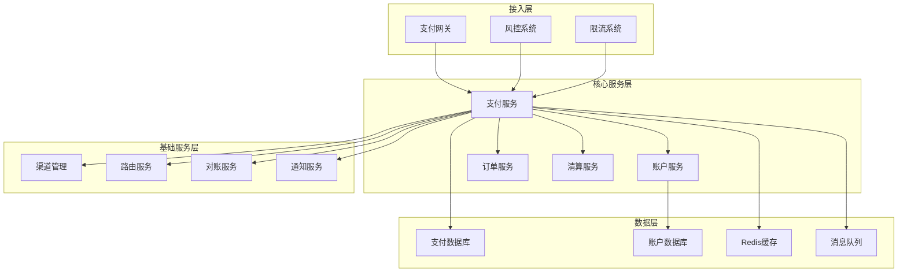
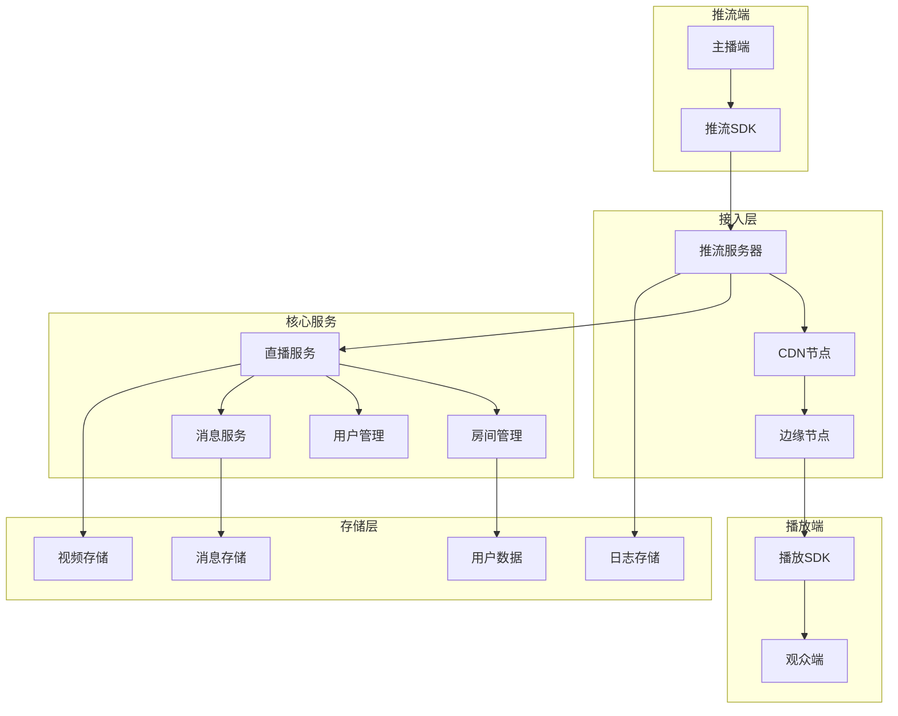
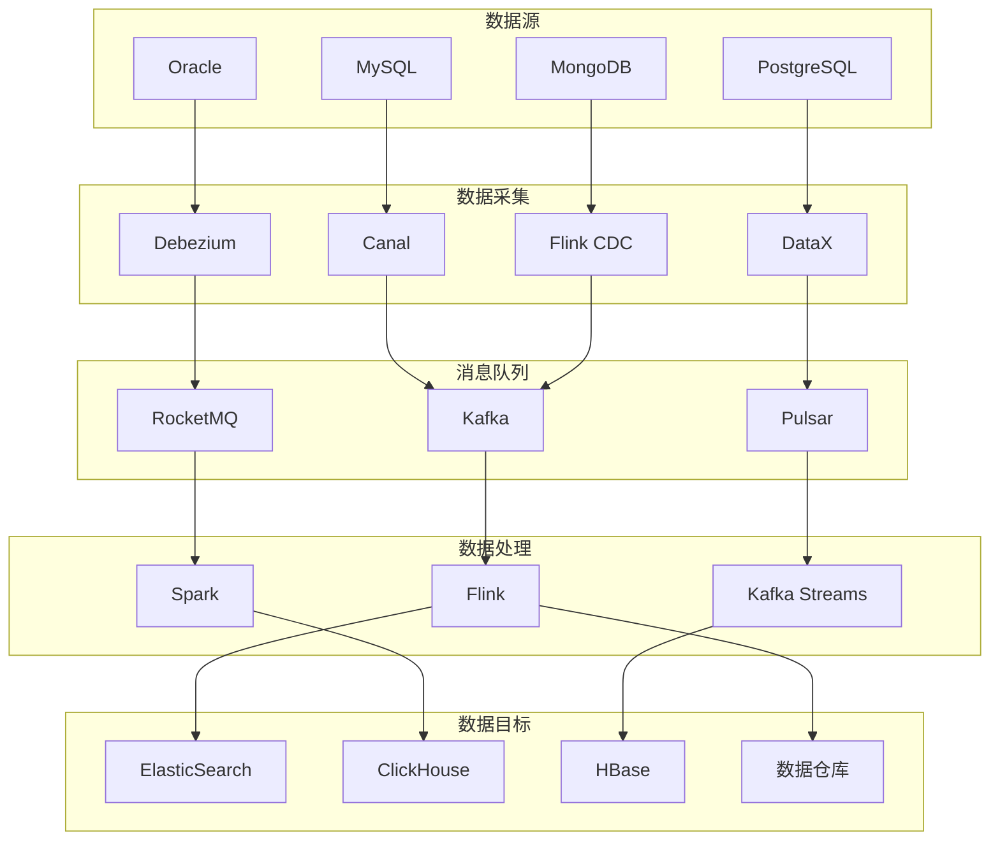

# 系统设计案例深度解析

## 目录
- [一、秒杀系统](#一秒杀系统)
- [二、短URL服务](#二短url服务)
- [三、IM系统](#三im系统)
- [四、推荐系统](#四推荐系统)
- [五、搜索系统](#五搜索系统)
- [六、分布式文件存储](#六分布式文件存储)

## 一、秒杀系统

### 1.1 核心挑战

- 高并发（10万+ QPS）
- 库存超卖
- 恶意刷单
- 系统雪崩

### 1.2 架构设计

```
┌──────────┐
│  CDN     │  静态资源
└────┬─────┘
     │
┌────▼─────┐
│  Nginx   │  限流、负载均衡
└────┬─────┘
     │
┌────▼─────┐
│ Gateway  │  鉴权、限流
└────┬─────┘
     │
┌────▼─────┐
│ Service  │
│  + Redis │  库存预扣
└────┬─────┘
     │
┌────▼─────┐
│   MQ     │  削峰填谷
└────┬─────┘
     │
┌────▼─────┐
│  Order   │  创建订单
└──────────┘
```

### 1.3 核心代码

**1. Redis库存预扣**：
```java
@Service
public class SeckillService {
    
    @Autowired
    private StringRedisTemplate redisTemplate;
    
    @Autowired
    private RocketMQTemplate rocketMQTemplate;
    
    public SeckillResult seckill(Long userId, Long productId) {
        String stockKey = "seckill:stock:" + productId;
        String userKey = "seckill:user:" + productId + ":" + userId;
        
        // 1. 检查是否已购买
        if (Boolean.TRUE.equals(redisTemplate.hasKey(userKey))) {
            return SeckillResult.fail("already_bought");
        }
        
        // 2. Lua脚本扣减库存
        String script = 
            "local stock = redis.call('get', KEYS[1]) " +
            "if not stock or tonumber(stock) <= 0 then " +
            "    return 0 " +
            "end " +
            "redis.call('decr', KEYS[1]) " +
            "redis.call('setex', KEYS[2], 86400, '1') " +
            "return 1";
        
        Long result = redisTemplate.execute(
            new DefaultRedisScript<>(script, Long.class),
            Arrays.asList(stockKey, userKey)
        );
        
        if (result == null || result == 0) {
            return SeckillResult.fail("sold_out");
        }
        
        // 3. 发送MQ消息创建订单
        SeckillMessage message = new SeckillMessage(userId, productId);
        rocketMQTemplate.asyncSend("seckill-topic", message, new SendCallback() {
            @Override
            public void onSuccess(SendResult sendResult) {
                log.info("Message sent success");
            }
            
            @Override
            public void onException(Throwable e) {
                // 回滚库存
                redisTemplate.opsForValue().increment(stockKey);
                redisTemplate.delete(userKey);
            }
        });
        
        return SeckillResult.success();
    }
}
```

**2. 消息消费创建订单**：
```java
@Component
@RocketMQMessageListener(topic = "seckill-topic", consumerGroup = "order-group")
public class SeckillOrderListener implements RocketMQListener<SeckillMessage> {
    
    @Autowired
    private OrderService orderService;
    
    @Override
    @Transactional
    public void onMessage(SeckillMessage message) {
        try {
            // 创建订单
            Order order = orderService.createSeckillOrder(
                message.getUserId(),
                message.getProductId()
            );
            
            // 扣减数据库库存
            productService.deductStock(message.getProductId(), 1);
            
        } catch (Exception e) {
            log.error("Failed to create order", e);
            // 回滚Redis库存
            rollbackStock(message.getProductId(), message.getUserId());
        }
    }
}
```

**3. 防刷策略**：
```java
@Component
public class AntiCheatService {
    
    @Autowired
    private RedisTemplate<String, Object> redisTemplate;
    
    // 验证码
    public boolean verifyCaptcha(String token, String captcha) {
        String key = "captcha:" + token;
        String cached = (String) redisTemplate.opsForValue().get(key);
        if (cached != null && cached.equals(captcha)) {
            redisTemplate.delete(key);
            return true;
        }
        return false;
    }
    
    // 接口限流（用户维度）
    public boolean checkUserRate(Long userId) {
        String key = "rate:user:" + userId;
        Long count = redisTemplate.opsForValue().increment(key);
        if (count == 1) {
            redisTemplate.expire(key, 1, TimeUnit.SECONDS);
        }
        return count <= 10;  // 1秒最多10次
    }
    
    // 风控检测
    public boolean checkRisk(Long userId, String ip) {
        // 检查IP黑名单
        if (Boolean.TRUE.equals(redisTemplate.opsForSet().isMember("blacklist:ip", ip))) {
            return false;
        }
        
        // 检查同IP多账号
        String key = "ip:users:" + ip;
        redisTemplate.opsForSet().add(key, userId);
        Long count = redisTemplate.opsForSet().size(key);
        
        return count <= 5;  // 同IP最多5个账号
    }
}
```

## 二、短URL服务

### 2.1 设计要点

- 短码生成算法
- 高性能（10万+ QPS）
- 数据持久化
- 统计分析

### 2.2 短码生成

**方案1：Hash + Base62**：
```java
@Service
public class ShortUrlService {
    
    private static final String BASE62 = "0123456789abcdefghijklmnopqrstuvwxyzABCDEFGHIJKLMNOPQRSTUVWXYZ";
    
    public String shorten(String longUrl) {
        // 1. Hash
        long hash = MurmurHash.hash64(longUrl);
        
        // 2. Base62编码
        String shortCode = toBase62(Math.abs(hash));
        
        // 3. 保存映射
        redisTemplate.opsForValue().set("short:" + shortCode, longUrl);
        redisTemplate.opsForValue().set("long:" + longUrl, shortCode);
        
        return "http://short.url/" + shortCode;
    }
    
    private String toBase62(long num) {
        StringBuilder sb = new StringBuilder();
        while (num > 0) {
            sb.append(BASE62.charAt((int) (num % 62)));
            num /= 62;
        }
        return sb.reverse().toString();
    }
}
```

**方案2：发号器（推荐）**：
```java
@Service
public class IdGeneratorShortUrlService {
    
    @Autowired
    private IdGenerator idGenerator;  // Snowflake或数据库自增
    
    public String shorten(String longUrl) {
        // 1. 检查是否已存在
        String cached = (String) redisTemplate.opsForValue().get("long:" + longUrl);
        if (cached != null) {
            return cached;
        }
        
        // 2. 生成唯一ID
        long id = idGenerator.nextId();
        
        // 3. Base62编码
        String shortCode = toBase62(id);
        
        // 4. 保存映射
        saveMapping(shortCode, longUrl);
        
        return "http://short.url/" + shortCode;
    }
    
    private void saveMapping(String shortCode, String longUrl) {
        // Redis缓存
        redisTemplate.opsForValue().set("short:" + shortCode, longUrl, 7, TimeUnit.DAYS);
        
        // MySQL持久化
        UrlMapping mapping = new UrlMapping(shortCode, longUrl);
        urlMappingRepository.save(mapping);
    }
}
```

### 2.3 重定向服务

```java
@RestController
public class RedirectController {
    
    @Autowired
    private ShortUrlService shortUrlService;
    
    @GetMapping("/{shortCode}")
    public void redirect(@PathVariable String shortCode, HttpServletResponse response) 
            throws IOException {
        
        // 1. 查询长URL
        String longUrl = shortUrlService.getLongUrl(shortCode);
        if (longUrl == null) {
            response.sendError(404);
            return;
        }
        
        // 2. 统计（异步）
        CompletableFuture.runAsync(() -> {
            statisticsService.increment(shortCode);
        });
        
        // 3. 302重定向
        response.sendRedirect(longUrl);
    }
}
```

## 三、IM系统

### 3.1 架构设计

```
┌────────┐    WebSocket    ┌────────────┐
│ Client │<──────────────>│ Gateway    │
└────────┘                 └──────┬─────┘
                                  │
                           ┌──────▼─────┐
                           │ IM Service │
                           └──────┬─────┘
                                  │
                    ┌─────────────┼─────────────┐
                    │             │             │
            ┌───────▼──┐   ┌──────▼─────┐  ┌───▼────┐
            │  Redis   │   │    MySQL   │  │   MQ   │
            │ (在线状态)│   │  (消息存储)│  │ (消息) │
            └──────────┘   └────────────┘  └────────┘
```

### 3.2 核心功能

**1. 连接管理**：
```java
@Component
public class WebSocketHandler extends TextWebSocketHandler {
    
    private static final Map<Long, WebSocketSession> sessions = new ConcurrentHashMap<>();
    
    @Override
    public void afterConnectionEstablished(WebSocketSession session) {
        Long userId = getUserId(session);
        sessions.put(userId, session);
        
        // 设置在线状态
        redisTemplate.opsForValue().set("online:" + userId, "1", 30, TimeUnit.MINUTES);
    }
    
    @Override
    protected void handleTextMessage(WebSocketSession session, TextMessage message) {
        Long fromUserId = getUserId(session);
        Message msg = JSON.parseObject(message.getPayload(), Message.class);
        
        // 发送消息
        sendMessage(fromUserId, msg.getToUserId(), msg.getContent());
    }
    
    @Override
    public void afterConnectionClosed(WebSocketSession session, CloseStatus status) {
        Long userId = getUserId(session);
        sessions.remove(userId);
        
        // 清除在线状态
        redisTemplate.delete("online:" + userId);
    }
}
```

**2. 消息发送**：
```java
@Service
public class MessageService {
    
    public void sendMessage(Long fromUserId, Long toUserId, String content) {
        // 1. 保存消息到数据库
        Message message = Message.builder()
            .fromUserId(fromUserId)
            .toUserId(toUserId)
            .content(content)
            .createTime(new Date())
            .build();
        messageRepository.save(message);
        
        // 2. 检查对方是否在线
        String onlineKey = "online:" + toUserId;
        if (Boolean.TRUE.equals(redisTemplate.hasKey(onlineKey))) {
            // 3. 在线则实时推送
            WebSocketSession session = sessions.get(toUserId);
            if (session != null && session.isOpen()) {
                session.sendMessage(new TextMessage(JSON.toJSONString(message)));
            }
        } else {
            // 4. 离线则推送到离线队列
            redisTemplate.opsForList().rightPush("offline:" + toUserId, message);
        }
    }
}
```

**3. 群聊**：
```java
@Service
public class GroupMessageService {
    
    public void sendGroupMessage(Long fromUserId, Long groupId, String content) {
        // 1. 获取群成员
        Set<Long> memberIds = groupService.getMembers(groupId);
        
        // 2. 保存消息
        GroupMessage message = new GroupMessage(fromUserId, groupId, content);
        messageRepository.save(message);
        
        // 3. 推送给在线成员
        for (Long memberId : memberIds) {
            if (memberId.equals(fromUserId)) continue;
            
            if (isOnline(memberId)) {
                pushMessage(memberId, message);
            } else {
                saveOfflineMessage(memberId, message);
            }
        }
    }
}
```

## 四、推荐系统

### 4.1 架构设计

```
┌────────────┐
│  User      │
│  Behavior  │  行为数据
└─────┬──────┘
      │
┌─────▼──────┐     ┌──────────┐
│  Feature   │────▶│  Model   │  训练
│  Engineer  │     │  Training│
└────────────┘     └─────┬────┘
                         │
                   ┌─────▼────┐
                   │  Model   │  模型
                   └─────┬────┘
                         │
┌────────────┐     ┌─────▼────┐
│  Real-time │────▶│ Serving  │  预测
│  Features  │     └─────┬────┘
└────────────┘           │
                   ┌─────▼────┐
                   │  Re-rank │  重排序
                   └──────────┘
```

### 4.2 召回策略

```java
@Service
public class RecallService {
    
    // 多路召回
    public List<Long> recall(Long userId, int count) {
        // 1. 协同过滤召回
        List<Long> cfItems = collaborativeFiltering(userId, count / 3);
        
        // 2. 内容召回
        List<Long> contentItems = contentBasedRecall(userId, count / 3);
        
        // 3. 热门召回
        List<Long> hotItems = hotRecall(count / 3);
        
        // 4. 合并去重
        Set<Long> result = new LinkedHashSet<>();
        result.addAll(cfItems);
        result.addAll(contentItems);
        result.addAll(hotItems);
        
        return new ArrayList<>(result);
    }
    
    // 协同过滤
    private List<Long> collaborativeFiltering(Long userId, int count) {
        // UserCF或ItemCF
        return userCfService.recommend(userId, count);
    }
    
    // 内容召回
    private List<Long> contentBasedRecall(Long userId, int count) {
        // 基于用户画像
        UserProfile profile = userProfileService.getProfile(userId);
        return contentService.search(profile.getTags(), count);
    }
    
    // 热门召回
    private List<Long> hotRecall(int count) {
        return redisTemplate.opsForZSet()
            .reverseRange("hot:items", 0, count - 1)
            .stream()
            .map(Long::valueOf)
            .collect(Collectors.toList());
    }
}
```

## 五、搜索系统

### 5.1 架构设计

```
┌────────┐     ┌──────────┐
│ MySQL  │────▶│ Binlog   │
└────────┘     │ Listener │
                └─────┬────┘
                      │
                ┌─────▼────┐
                │    ES    │
                └─────┬────┘
                      │
┌────────┐     ┌─────▼────┐
│ Client │────▶│  Search  │
└────────┘     │  Service │
                └──────────┘
```

### 5.2 搜索实现

```java
@Service
public class SearchService {
    
    @Autowired
    private ElasticsearchRestTemplate esTemplate;
    
    public SearchResult search(String keyword, int page, int size) {
        // 1. 构建查询
        NativeSearchQuery query = new NativeSearchQueryBuilder()
            .withQuery(QueryBuilders.multiMatchQuery(keyword, "title", "description")
                .type(MultiMatchQueryBuilder.Type.BEST_FIELDS)
                .fuzziness(Fuzziness.AUTO))
            .withPageable(PageRequest.of(page, size))
            .withHighlightFields(
                new HighlightBuilder.Field("title"),
                new HighlightBuilder.Field("description"))
            .build();
        
        // 2. 执行搜索
        SearchHits<Product> hits = esTemplate.search(query, Product.class);
        
        // 3. 处理结果
        List<Product> products = hits.stream()
            .map(SearchHit::getContent)
            .collect(Collectors.toList());
        
        return new SearchResult(products, hits.getTotalHits());
    }
}
```

## 六、分布式文件存储

### 6.1 架构设计

```
┌────────┐     ┌──────────┐
│ Client │────▶│  Upload  │
└────────┘     │  Service │
                └─────┬────┘
                      │
                ┌─────▼────┐
                │   OSS    │  对象存储
                └─────┬────┘
                      │
                ┌─────▼────┐
                │   CDN    │  加速
                └──────────┘
```

### 6.2 文件上传

```java
@Service
public class FileUploadService {
    
    @Autowired
    private OSS ossClient;
    
    public String upload(MultipartFile file) throws IOException {
        // 1. 生成文件名
        String fileName = generateFileName(file.getOriginalFilename());
        
        // 2. 上传到OSS
        ossClient.putObject("bucket-name", fileName, file.getInputStream());
        
        // 3. 生成访问URL
        String url = ossClient.generatePresignedUrl("bucket-name", fileName, 
            new Date(System.currentTimeMillis() + 3600 * 1000)).toString();
        
        // 4. 保存元数据
        FileMetadata metadata = new FileMetadata(fileName, file.getSize(), url);
        metadataRepository.save(metadata);
        
        return url;
    }
    
    private String generateFileName(String originalName) {
        String ext = originalName.substring(originalName.lastIndexOf("."));
        return UUID.randomUUID().toString().replace("-", "") + ext;
    }
}
```

## 七、支付系统架构设计

### 7.1 支付系统核心挑战

**业务挑战**：
- 资金安全（零容忍）
- 高并发（双11峰值）
- 数据一致性（强一致性）
- 风控反欺诈
- 合规要求（PCI DSS）

**技术挑战**：
- 分布式事务
- 数据一致性
- 系统可用性
- 性能优化
- 监控告警

### 7.2 支付系统架构



### 7.3 支付流程设计

**1. 支付请求处理**：
```java
@Service
public class PaymentService {
    
    @Autowired
    private PaymentGateway paymentGateway;
    
    @Autowired
    private RiskControlService riskControlService;
    
    @Autowired
    private AccountService accountService;
    
    @Autowired
    private OrderService orderService;
    
    @Transactional
    public PaymentResult processPayment(PaymentRequest request) {
        try {
            // 1. 风控检查
            RiskCheckResult riskResult = riskControlService.checkRisk(request);
            if (!riskResult.isPass()) {
                return PaymentResult.fail("RISK_CONTROL_FAILED", riskResult.getReason());
            }
            
            // 2. 账户检查
            Account account = accountService.getAccount(request.getUserId());
            if (account.getBalance().compareTo(request.getAmount()) < 0) {
                return PaymentResult.fail("INSUFFICIENT_BALANCE");
            }
            
            // 3. 创建支付订单
            PaymentOrder paymentOrder = createPaymentOrder(request);
            
            // 4. 冻结资金
            accountService.freezeAmount(request.getUserId(), request.getAmount());
            
            // 5. 调用支付渠道
            ChannelPaymentResult channelResult = paymentGateway.pay(paymentOrder);
            
            if (channelResult.isSuccess()) {
                // 6. 支付成功，扣减资金
                accountService.deductAmount(request.getUserId(), request.getAmount());
                paymentOrder.setStatus(PaymentStatus.SUCCESS);
                
                // 7. 更新业务订单
                orderService.updateOrderStatus(request.getOrderId(), OrderStatus.PAID);
                
                // 8. 发送支付成功通知
                notificationService.sendPaymentSuccessNotification(paymentOrder);
                
                return PaymentResult.success(paymentOrder);
            } else {
                // 9. 支付失败，解冻资金
                accountService.unfreezeAmount(request.getUserId(), request.getAmount());
                paymentOrder.setStatus(PaymentStatus.FAILED);
                return PaymentResult.fail("PAYMENT_FAILED", channelResult.getErrorMessage());
            }
            
        } catch (Exception e) {
            log.error("Payment processing failed", e);
            // 异常情况下的资金解冻
            accountService.unfreezeAmount(request.getUserId(), request.getAmount());
            return PaymentResult.fail("SYSTEM_ERROR", e.getMessage());
        }
    }
}
```

**2. 分布式事务处理**：
```java
@Service
public class PaymentTransactionService {
    
    @Autowired
    private RocketMQTemplate rocketMQTemplate;
    
    @Autowired
    private PaymentOrderService paymentOrderService;
    
    @Autowired
    private AccountService accountService;
    
    // 使用TCC模式处理分布式事务
    @Transactional
    public PaymentResult processPaymentWithTCC(PaymentRequest request) {
        // 1. Try阶段：预扣资金
        PaymentOrder paymentOrder = paymentOrderService.createPaymentOrder(request);
        
        try {
            // 冻结资金
            accountService.freezeAmount(request.getUserId(), request.getAmount());
            
            // 2. Confirm阶段：确认支付
            PaymentConfirmMessage confirmMessage = new PaymentConfirmMessage(paymentOrder.getId());
            rocketMQTemplate.sendMessageInTransaction("payment-topic", confirmMessage, null);
            
            return PaymentResult.success(paymentOrder);
            
        } catch (Exception e) {
            // 3. Cancel阶段：取消支付
            PaymentCancelMessage cancelMessage = new PaymentCancelMessage(paymentOrder.getId());
            rocketMQTemplate.sendMessageInTransaction("payment-topic", cancelMessage, null);
            
            throw e;
        }
    }
    
    @RocketMQTransactionListener
    public class PaymentTransactionListener implements RocketMQLocalTransactionListener {
        
        @Override
        public RocketMQLocalTransactionState executeLocalTransaction(Message msg, Object arg) {
            try {
                if (arg instanceof PaymentConfirmMessage) {
                    // 确认支付
                    PaymentConfirmMessage confirmMessage = (PaymentConfirmMessage) arg;
                    confirmPayment(confirmMessage.getPaymentOrderId());
                    return RocketMQLocalTransactionState.COMMIT;
                } else if (arg instanceof PaymentCancelMessage) {
                    // 取消支付
                    PaymentCancelMessage cancelMessage = (PaymentCancelMessage) arg;
                    cancelPayment(cancelMessage.getPaymentOrderId());
                    return RocketMQLocalTransactionState.ROLLBACK;
                }
            } catch (Exception e) {
                log.error("Transaction execution failed", e);
                return RocketMQLocalTransactionState.ROLLBACK;
            }
            
            return RocketMQLocalTransactionState.UNKNOWN;
        }
        
        @Override
        public RocketMQLocalTransactionState checkLocalTransaction(Message msg) {
            // 检查本地事务状态
            String paymentOrderId = extractPaymentOrderId(msg);
            PaymentOrder order = paymentOrderService.getPaymentOrder(paymentOrderId);
            
            if (order.getStatus() == PaymentStatus.SUCCESS) {
                return RocketMQLocalTransactionState.COMMIT;
            } else if (order.getStatus() == PaymentStatus.FAILED) {
                return RocketMQLocalTransactionState.ROLLBACK;
            } else {
                return RocketMQLocalTransactionState.UNKNOWN;
            }
        }
    }
}
```

### 7.4 风控系统设计

**1. 实时风控**：
```java
@Service
public class RiskControlService {
    
    @Autowired
    private RedisTemplate<String, Object> redisTemplate;
    
    @Autowired
    private MachineLearningService mlService;
    
    public RiskCheckResult checkRisk(PaymentRequest request) {
        RiskCheckResult result = new RiskCheckResult();
        
        // 1. 基础规则检查
        if (!checkBasicRules(request)) {
            result.setPass(false);
            result.setReason("BASIC_RULE_FAILED");
            return result;
        }
        
        // 2. 频率限制检查
        if (!checkFrequencyLimit(request)) {
            result.setPass(false);
            result.setReason("FREQUENCY_LIMIT_EXCEEDED");
            return result;
        }
        
        // 3. 机器学习模型检查
        double riskScore = mlService.calculateRiskScore(request);
        if (riskScore > 0.8) {
            result.setPass(false);
            result.setReason("HIGH_RISK_SCORE");
            result.setRiskScore(riskScore);
            return result;
        }
        
        // 4. 黑名单检查
        if (isInBlacklist(request)) {
            result.setPass(false);
            result.setReason("BLACKLISTED");
            return result;
        }
        
        result.setPass(true);
        result.setRiskScore(riskScore);
        return result;
    }
    
    private boolean checkBasicRules(PaymentRequest request) {
        // 检查金额限制
        if (request.getAmount().compareTo(new BigDecimal("10000")) > 0) {
            return false;
        }
        
        // 检查时间限制
        LocalTime now = LocalTime.now();
        if (now.isBefore(LocalTime.of(6, 0)) || now.isAfter(LocalTime.of(23, 0))) {
            return false;
        }
        
        return true;
    }
    
    private boolean checkFrequencyLimit(PaymentRequest request) {
        String key = "payment:frequency:" + request.getUserId();
        Long count = redisTemplate.opsForValue().increment(key);
        
        if (count == 1) {
            redisTemplate.expire(key, 1, TimeUnit.HOURS);
        }
        
        return count <= 10; // 1小时内最多10次支付
    }
    
    private boolean isInBlacklist(PaymentRequest request) {
        // 检查用户黑名单
        if (Boolean.TRUE.equals(redisTemplate.opsForSet().isMember("blacklist:users", request.getUserId()))) {
            return true;
        }
        
        // 检查IP黑名单
        if (Boolean.TRUE.equals(redisTemplate.opsForSet().isMember("blacklist:ips", request.getClientIp()))) {
            return true;
        }
        
        return false;
    }
}
```

**2. 机器学习风控**：
```java
@Service
public class MachineLearningService {
    
    @Autowired
    private ModelService modelService;
    
    public double calculateRiskScore(PaymentRequest request) {
        // 1. 特征工程
        Map<String, Object> features = extractFeatures(request);
        
        // 2. 模型预测
        RiskModel model = modelService.getLatestModel();
        double riskScore = model.predict(features);
        
        // 3. 规则修正
        riskScore = applyRuleCorrections(riskScore, request);
        
        return riskScore;
    }
    
    private Map<String, Object> extractFeatures(PaymentRequest request) {
        Map<String, Object> features = new HashMap<>();
        
        // 用户特征
        features.put("user_age", getUserAge(request.getUserId()));
        features.put("user_registration_days", getUserRegistrationDays(request.getUserId()));
        features.put("user_payment_count_7d", getUserPaymentCount(request.getUserId(), 7));
        features.put("user_payment_amount_30d", getUserPaymentAmount(request.getUserId(), 30));
        
        // 交易特征
        features.put("amount", request.getAmount().doubleValue());
        features.put("hour", LocalDateTime.now().getHour());
        features.put("day_of_week", LocalDateTime.now().getDayOfWeek().getValue());
        
        // 设备特征
        features.put("device_type", request.getDeviceType());
        features.put("browser_type", request.getBrowserType());
        
        // 地理位置特征
        features.put("country", request.getCountry());
        features.put("city", request.getCity());
        
        return features;
    }
    
    private double applyRuleCorrections(double riskScore, PaymentRequest request) {
        // 大额交易增加风险分数
        if (request.getAmount().compareTo(new BigDecimal("5000")) > 0) {
            riskScore += 0.1;
        }
        
        // 异地交易增加风险分数
        if (isCrossRegionTransaction(request)) {
            riskScore += 0.2;
        }
        
        // 新设备增加风险分数
        if (isNewDevice(request)) {
            riskScore += 0.15;
        }
        
        return Math.min(riskScore, 1.0);
    }
}
```

## 八、直播系统架构设计

### 8.1 直播系统核心挑战

**技术挑战**：
- 低延迟（<3秒）
- 高并发（百万级观众）
- 实时性（音视频同步）
- 网络适应性（弱网优化）
- 成本控制（CDN费用）

**业务挑战**：
- 内容审核
- 版权保护
- 用户体验
- 商业模式

### 8.2 直播系统架构



### 8.3 推流服务设计

**1. 推流服务器**：
```java
@RestController
public class StreamController {
    
    @Autowired
    private StreamService streamService;
    
    @Autowired
    private RoomService roomService;
    
    @PostMapping("/stream/start")
    public ResponseEntity<StreamResponse> startStream(@RequestBody StreamRequest request) {
        try {
            // 1. 验证主播身份
            if (!validateStreamer(request.getStreamerId())) {
                return ResponseEntity.badRequest().body(StreamResponse.fail("INVALID_STREAMER"));
            }
            
            // 2. 创建直播房间
            LiveRoom room = roomService.createRoom(request.getStreamerId(), request.getTitle());
            
            // 3. 分配推流地址
            String pushUrl = streamService.allocatePushUrl(room.getId());
            
            // 4. 启动推流服务
            streamService.startStream(room.getId(), pushUrl);
            
            return ResponseEntity.ok(StreamResponse.success(room.getId(), pushUrl));
            
        } catch (Exception e) {
            log.error("Failed to start stream", e);
            return ResponseEntity.status(500).body(StreamResponse.fail("SYSTEM_ERROR"));
        }
    }
    
    @PostMapping("/stream/stop")
    public ResponseEntity<StreamResponse> stopStream(@RequestBody StreamStopRequest request) {
        try {
            // 1. 停止推流
            streamService.stopStream(request.getRoomId());
            
            // 2. 关闭房间
            roomService.closeRoom(request.getRoomId());
            
            // 3. 生成回放
            streamService.generateReplay(request.getRoomId());
            
            return ResponseEntity.ok(StreamResponse.success("Stream stopped successfully"));
            
        } catch (Exception e) {
            log.error("Failed to stop stream", e);
            return ResponseEntity.status(500).body(StreamResponse.fail("SYSTEM_ERROR"));
        }
    }
}
```

**2. 流媒体处理**：
```java
@Service
public class StreamService {
    
    @Autowired
    private RedisTemplate<String, Object> redisTemplate;
    
    @Autowired
    private CDNService cdnService;
    
    public void startStream(String roomId, String pushUrl) {
        // 1. 创建流媒体处理任务
        StreamProcessingTask task = new StreamProcessingTask(roomId, pushUrl);
        
        // 2. 启动转码服务
        TranscodeService transcodeService = new TranscodeService();
        transcodeService.startTranscoding(task);
        
        // 3. 配置CDN分发
        cdnService.configureDistribution(roomId, task.getOutputUrls());
        
        // 4. 更新房间状态
        updateRoomStatus(roomId, RoomStatus.LIVE);
        
        // 5. 启动监控
        startStreamMonitoring(roomId);
    }
    
    public void stopStream(String roomId) {
        // 1. 停止转码
        TranscodeService transcodeService = new TranscodeService();
        transcodeService.stopTranscoding(roomId);
        
        // 2. 停止CDN分发
        cdnService.stopDistribution(roomId);
        
        // 3. 更新房间状态
        updateRoomStatus(roomId, RoomStatus.ENDED);
        
        // 4. 停止监控
        stopStreamMonitoring(roomId);
    }
    
    private void startStreamMonitoring(String roomId) {
        // 启动流质量监控
        StreamMonitor monitor = new StreamMonitor(roomId);
        monitor.startMonitoring();
        
        // 启动观众数统计
        ViewerCounter counter = new ViewerCounter(roomId);
        counter.startCounting();
    }
}
```

### 8.4 播放服务设计

**1. 播放地址生成**：
```java
@Service
public class PlaybackService {
    
    @Autowired
    private CDNService cdnService;
    
    @Autowired
    private RoomService roomService;
    
    public PlaybackUrl generatePlaybackUrl(String roomId, String userId) {
        // 1. 检查房间状态
        LiveRoom room = roomService.getRoom(roomId);
        if (room.getStatus() != RoomStatus.LIVE) {
            throw new RoomNotLiveException("Room is not live");
        }
        
        // 2. 获取CDN节点
        CDNNode node = cdnService.getOptimalNode(userId);
        
        // 3. 生成播放地址
        String baseUrl = node.getPlaybackUrl();
        String streamKey = room.getStreamKey();
        
        // 4. 生成不同清晰度的播放地址
        Map<String, String> playbackUrls = new HashMap<>();
        playbackUrls.put("720p", baseUrl + "/" + streamKey + "_720p.m3u8");
        playbackUrls.put("480p", baseUrl + "/" + streamKey + "_480p.m3u8");
        playbackUrls.put("360p", baseUrl + "/" + streamKey + "_360p.m3u8");
        
        // 5. 生成防盗链签名
        String signature = generateSignature(roomId, userId);
        
        return new PlaybackUrl(playbackUrls, signature);
    }
    
    private String generateSignature(String roomId, String userId) {
        String timestamp = String.valueOf(System.currentTimeMillis());
        String data = roomId + userId + timestamp + "secret_key";
        
        try {
            MessageDigest md = MessageDigest.getInstance("MD5");
            byte[] hash = md.digest(data.getBytes());
            return bytesToHex(hash);
        } catch (NoSuchAlgorithmException e) {
            throw new RuntimeException("Failed to generate signature", e);
        }
    }
}
```

**2. 实时消息推送**：
```java
@Service
public class LiveMessageService {
    
    @Autowired
    private WebSocketService webSocketService;
    
    @Autowired
    private RedisTemplate<String, Object> redisTemplate;
    
    public void sendMessage(String roomId, LiveMessage message) {
        // 1. 保存消息到Redis
        String messageKey = "live:message:" + roomId;
        redisTemplate.opsForList().rightPush(messageKey, message);
        
        // 2. 限制消息数量
        redisTemplate.opsForList().trim(messageKey, -100, -1);
        
        // 3. 推送给在线观众
        List<String> viewers = getOnlineViewers(roomId);
        for (String viewerId : viewers) {
            webSocketService.sendMessage(viewerId, message);
        }
    }
    
    public void sendGift(String roomId, GiftMessage gift) {
        // 1. 处理礼物逻辑
        processGift(roomId, gift);
        
        // 2. 发送礼物消息
        LiveMessage message = new LiveMessage();
        message.setType(MessageType.GIFT);
        message.setContent(gift);
        message.setTimestamp(System.currentTimeMillis());
        
        sendMessage(roomId, message);
    }
    
    private void processGift(String roomId, GiftMessage gift) {
        // 1. 更新主播收益
        updateStreamerEarnings(roomId, gift.getGiftValue());
        
        // 2. 更新观众等级
        updateViewerLevel(gift.getViewerId(), gift.getGiftValue());
        
        // 3. 记录礼物日志
        logGiftTransaction(roomId, gift);
    }
}
```

## 九、数据同步系统设计

### 9.1 数据同步系统挑战

**技术挑战**：
- 数据一致性
- 实时性要求
- 大数据量处理
- 故障恢复
- 性能优化

**业务挑战**：
- 多数据源
- 数据格式差异
- 业务规则复杂
- 数据质量保证

### 9.2 数据同步架构



### 9.3 Canal数据同步实现

**1. Canal配置**：
```properties
# canal.properties
canal.port = 11111
canal.metrics.pull.port = 11112
canal.instance.mysql.slaveId = 1234
canal.instance.filter.regex = .*\\..*
canal.instance.filter.black.regex = mysql\\.slave_.*

# instance.properties
canal.instance.master.address = 127.0.0.1:3306
canal.instance.dbUsername = canal
canal.instance.dbPassword = canal
canal.instance.defaultDatabaseName = test
canal.instance.connectionCharset = UTF-8
canal.instance.filter.regex = test\\..*
```

**2. Canal客户端**：
```java
@Component
public class CanalClient {
    
    @Autowired
    private MessageProducer messageProducer;
    
    @Autowired
    private DataTransformService transformService;
    
    public void startCanalClient() {
        CanalConnector connector = CanalConnectors.newSingleConnector(
            new InetSocketAddress("127.0.0.1", 11111), 
            "example", 
            "", 
            ""
        );
        
        connector.connect();
        connector.subscribe(".*\\..*");
        connector.rollback();
        
        while (true) {
            Message message = connector.getWithoutAck(1000);
            long batchId = message.getBatchId();
            int size = message.getEntries().size();
            
            if (batchId == -1 || size == 0) {
                try {
                    Thread.sleep(1000);
                } catch (InterruptedException e) {
                    Thread.currentThread().interrupt();
                    break;
                }
            } else {
                processEntries(message.getEntries());
            }
            
            connector.ack(batchId);
        }
    }
    
    private void processEntries(List<Entry> entries) {
        for (Entry entry : entries) {
            if (entry.getEntryType() == EntryType.TRANSACTIONBEGIN ||
                entry.getEntryType() == EntryType.TRANSACTIONEND) {
                continue;
            }
            
            RowChange rowChange = null;
            try {
                rowChange = RowChange.parseFrom(entry.getStoreValue());
            } catch (Exception e) {
                log.error("Parse row change failed", e);
                continue;
            }
            
            EventType eventType = rowChange.getEventType();
            String tableName = entry.getHeader().getTableName();
            
            for (RowData rowData : rowChange.getRowDatasList()) {
                processRowData(tableName, eventType, rowData);
            }
        }
    }
    
    private void processRowData(String tableName, EventType eventType, RowData rowData) {
        try {
            // 1. 数据转换
            SyncData syncData = transformService.transform(tableName, eventType, rowData);
            
            // 2. 发送到消息队列
            messageProducer.send("data.sync", syncData);
            
            // 3. 记录同步日志
            logSyncEvent(tableName, eventType, syncData);
            
        } catch (Exception e) {
            log.error("Process row data failed", e);
        }
    }
}
```

**3. 数据转换服务**：
```java
@Service
public class DataTransformService {
    
    @Autowired
    private SchemaRegistryService schemaRegistry;
    
    public SyncData transform(String tableName, EventType eventType, RowData rowData) {
        // 1. 获取表结构
        TableSchema schema = schemaRegistry.getSchema(tableName);
        
        // 2. 构建数据
        Map<String, Object> data = new HashMap<>();
        
        if (eventType == EventType.DELETE) {
            // 删除操作
            for (Column column : rowData.getBeforeColumnsList()) {
                data.put(column.getName(), column.getValue());
            }
        } else {
            // 插入或更新操作
            for (Column column : rowData.getAfterColumnsList()) {
                data.put(column.getName(), column.getValue());
            }
        }
        
        // 3. 添加元数据
        data.put("_table_name", tableName);
        data.put("_event_type", eventType.name());
        data.put("_timestamp", System.currentTimeMillis());
        
        // 4. 数据清洗
        data = cleanData(data, schema);
        
        return new SyncData(tableName, eventType, data);
    }
    
    private Map<String, Object> cleanData(Map<String, Object> data, TableSchema schema) {
        Map<String, Object> cleanedData = new HashMap<>();
        
        for (Map.Entry<String, Object> entry : data.entrySet()) {
            String columnName = entry.getKey();
            Object value = entry.getValue();
            
            // 跳过元数据字段
            if (columnName.startsWith("_")) {
                cleanedData.put(columnName, value);
                continue;
            }
            
            // 获取列定义
            ColumnDefinition columnDef = schema.getColumn(columnName);
            if (columnDef == null) {
                continue;
            }
            
            // 数据类型转换
            Object convertedValue = convertValue(value, columnDef.getDataType());
            cleanedData.put(columnName, convertedValue);
        }
        
        return cleanedData;
    }
    
    private Object convertValue(Object value, DataType dataType) {
        if (value == null) {
            return null;
        }
        
        switch (dataType) {
            case INT:
                return Integer.valueOf(value.toString());
            case BIGINT:
                return Long.valueOf(value.toString());
            case DECIMAL:
                return new BigDecimal(value.toString());
            case VARCHAR:
                return value.toString();
            case DATETIME:
                return LocalDateTime.parse(value.toString());
            default:
                return value;
        }
    }
}
```

### 9.4 Flink CDC实时同步

**1. Flink CDC作业**：
```java
public class FlinkCDCJob {
    
    public static void main(String[] args) throws Exception {
        StreamExecutionEnvironment env = StreamExecutionEnvironment.getExecutionEnvironment();
        
        // 1. 配置CDC源
        MySqlSource<String> mySqlSource = MySqlSource.<String>builder()
            .hostname("localhost")
            .port(3306)
            .databaseList("test")
            .tableList("test.users", "test.orders")
            .username("root")
            .password("password")
            .deserializer(new JsonDebeziumDeserializationSchema())
            .build();
        
        // 2. 创建数据流
        DataStream<String> stream = env.fromSource(
            mySqlSource,
            WatermarkStrategy.noWatermarks(),
            "MySQL Source"
        );
        
        // 3. 数据处理
        DataStream<ProcessedData> processedStream = stream
            .map(new DataProcessor())
            .filter(new DataFilter())
            .keyBy(ProcessedData::getTableName);
        
        // 4. 输出到不同目标
        processedStream
            .filter(data -> "users".equals(data.getTableName()))
            .addSink(new ElasticsearchSink());
        
        processedStream
            .filter(data -> "orders".equals(data.getTableName()))
            .addSink(new ClickHouseSink());
        
        // 5. 启动作业
        env.execute("Flink CDC Job");
    }
}
```

**2. 数据处理器**：
```java
public class DataProcessor implements MapFunction<String, ProcessedData> {
    
    private ObjectMapper objectMapper = new ObjectMapper();
    
    @Override
    public ProcessedData map(String jsonString) throws Exception {
        // 1. 解析JSON
        JsonNode jsonNode = objectMapper.readTree(jsonString);
        
        // 2. 提取数据
        String tableName = jsonNode.get("source").get("table").asText();
        String operation = jsonNode.get("op").asText();
        JsonNode data = jsonNode.get("after");
        
        if (data == null) {
            data = jsonNode.get("before");
        }
        
        // 3. 数据转换
        Map<String, Object> processedData = new HashMap<>();
        data.fields().forEachRemaining(entry -> {
            processedData.put(entry.getKey(), entry.getValue().asText());
        });
        
        // 4. 添加元数据
        processedData.put("_operation", operation);
        processedData.put("_timestamp", System.currentTimeMillis());
        
        return new ProcessedData(tableName, operation, processedData);
    }
}
```

## 十、高频面试题深度解析

### Q1：如何设计一个支持亿级并发的秒杀系统？

**核心原理**：
秒杀系统设计是电商高并发场景的典型代表，核心挑战在于在极短时间内处理大量并发请求，同时保证数据一致性和系统稳定性。核心思想是"分层削峰+异步处理+缓存优化+限流保护"，通过系统性的架构设计应对亿级并发挑战。

数学上，秒杀系统需要处理QPS = 请求数/时间窗口的并发压力。假设1亿用户同时参与秒杀，时间窗口为10秒，则峰值QPS可达1000万。通过分层架构和异步处理，将压力分散到不同层次，最终数据库QPS控制在可接受范围内。

**架构演进**：

**阶段一：单体架构（QPS < 1000）**
```
用户 -> 应用服务器 -> 数据库
```
- 问题：数据库成为瓶颈，无法支撑高并发
- 性能：QPS < 1000，响应时间 > 2秒

**阶段二：读写分离（QPS < 10000）**
```
用户 -> 应用服务器 -> 主库(写) + 从库(读)
```
- 改进：读写分离，缓解数据库压力
- 性能：QPS < 10000，响应时间 < 1秒

**阶段三：缓存架构（QPS < 100000）**
```
用户 -> CDN -> 应用服务器 -> Redis -> 数据库
```
- 改进：引入Redis缓存，大幅提升性能
- 性能：QPS < 100000，响应时间 < 200ms

**阶段四：微服务架构（QPS < 1000000）**
```
用户 -> CDN -> API网关 -> 微服务集群 -> Redis集群 -> 数据库集群
```
- 改进：微服务拆分，水平扩展
- 性能：QPS < 1000000，响应时间 < 100ms

**阶段五：亿级架构（QPS > 10000000）**
```
用户 -> CDN -> 负载均衡 -> API网关 -> 服务网格 -> 微服务集群 -> 多级缓存 -> 消息队列 -> 数据库集群
```
- 改进：全链路优化，异步处理
- 性能：QPS > 10000000，响应时间 < 50ms

**应用场景**：
1. **电商秒杀**：双11、618等大促活动，商品限时抢购
2. **票务系统**：演唱会门票、火车票等稀缺资源抢购
3. **优惠券系统**：限时优惠券发放，用户抢券
4. **限量商品**：新品首发、限量版商品抢购

**实战经验**：
在设计电商平台秒杀系统时，我们经历了从QPS 1000到QPS 1000万的完整演进过程。

**初始架构问题**：
- 数据库成为瓶颈，连接池耗尽
- 缓存击穿导致数据库压力激增
- 库存超卖问题严重
- 恶意刷单无法有效防护

**架构优化历程**：

**1. 缓存架构优化**：
- 多级缓存：CDN + Redis + 本地缓存
- 缓存预热：提前加载商品信息到缓存
- 缓存更新：异步更新策略，避免缓存雪崩
- 效果：QPS从1000提升到100000，响应时间从2秒降低到200ms

**2. 异步处理优化**：
- 消息队列：RocketMQ削峰填谷
- 异步下单：Redis预扣库存 + MQ异步创建订单
- 最终一致性：通过补偿机制保证数据一致性
- 效果：数据库QPS从10000降低到1000，系统稳定性大幅提升

**3. 限流降级优化**：
- 多维度限流：用户级、接口级、系统级
- 熔断降级：服务故障时自动降级
- 流量控制：令牌桶算法控制请求速率
- 效果：系统可用性从99.9%提升到99.99%

**4. 数据库优化**：
- 分库分表：按商品ID分片，水平扩展
- 读写分离：主从复制，读写分离
- 索引优化：复合索引，覆盖索引
- 效果：数据库性能提升10倍，支持更高并发

**最终性能数据**：
- 峰值QPS：1000万
- 平均响应时间：50ms
- 系统可用性：99.99%
- 库存准确率：99.999%
- 恶意请求拦截率：95%

**权衡取舍**：
| 架构方案 | 性能 | 复杂度 | 成本 | 一致性 | 适用场景 |
|----------|------|--------|------|--------|----------|
| **单体架构** | 低 | 低 | 低 | 强 | 小规模系统 |
| **读写分离** | 中 | 中 | 中 | 中 | 中等规模系统 |
| **缓存架构** | 高 | 中 | 中 | 弱 | 高并发系统 |
| **微服务架构** | 很高 | 高 | 高 | 弱 | 大规模系统 |
| **亿级架构** | 极高 | 很高 | 很高 | 最终一致 | 超大规模系统 |

**常见追问**：
1. 追问：如何解决库存超卖问题？→ 回答：使用Redis Lua脚本原子性扣减库存，结合数据库乐观锁，通过补偿机制保证最终一致性。对于超卖情况，通过订单取消和退款机制处理。
2. 追问：如何应对恶意刷单？→ 回答：多维度防护策略：IP限流、用户限流、设备指纹识别、行为分析、验证码验证。结合机器学习算法识别异常行为模式。

**踩坑经验**：
- 坑1：缓存击穿导致数据库压力激增。解决：使用分布式锁防止缓存击穿，设置合理的缓存过期时间，使用缓存预热策略。
- 坑2：消息队列积压导致订单创建延迟。解决：增加消费者实例，优化消息处理逻辑，使用批量处理提升效率。
- 坑3：分库分表后跨库查询性能差。解决：避免跨库查询，使用数据冗余，通过消息队列同步数据。

### Q2：如何设计一个高可用的支付系统？

**核心原理**：
支付系统设计是金融级系统的典型代表，核心挑战在于保证资金安全、数据一致性和系统高可用性。核心思想是"资金安全+数据一致性+高可用+风控防护"，通过多重保障机制确保支付交易的可靠性和安全性。

数学上，支付系统需要保证ACID特性：原子性(Atomicity)、一致性(Consistency)、隔离性(Isolation)、持久性(Durability)。同时需要满足CAP定理的权衡，在一致性、可用性和分区容错性之间做出合理选择。

**架构设计**：

**1. 分层架构**：
```
用户层 -> 网关层 -> 业务层 -> 支付层 -> 清算层 -> 数据层
```

**2. 核心组件**：
- **支付网关**：统一支付入口，路由分发
- **支付核心**：支付逻辑处理，状态管理
- **风控系统**：风险识别，交易拦截
- **清算系统**：资金清算，对账处理
- **监控系统**：实时监控，异常告警

**应用场景**：
1. **电商支付**：在线购物支付，订单结算
2. **金融支付**：转账汇款，理财投资
3. **移动支付**：扫码支付，NFC支付
4. **跨境支付**：外汇兑换，国际汇款

**实战经验**：
在设计金融级支付系统时，我们采用了"多重保障+实时监控+自动恢复"的策略。

**资金安全保障**：
- 分布式事务：使用TCC模式保证跨系统事务一致性
- 数据加密：敏感数据AES加密，传输过程TLS加密
- 权限控制：基于RBAC的细粒度权限管理
- 审计日志：完整的操作审计日志，支持合规要求

**高可用设计**：
- 多机房部署：主备机房，异地容灾
- 故障转移：自动故障检测和切换
- 限流降级：多维度限流，服务降级
- 监控告警：全链路监控，实时告警

**性能优化**：
- 缓存架构：Redis集群，多级缓存
- 数据库优化：读写分离，分库分表
- 异步处理：消息队列，异步清算
- 连接池优化：数据库连接池，HTTP连接池

**最终性能数据**：
- 峰值TPS：10万
- 平均响应时间：100ms
- 系统可用性：99.99%
- 资金准确率：100%
- 风控拦截率：99.9%

**权衡取舍**：
| 保障维度 | 技术方案 | 安全性 | 性能 | 复杂度 | 成本 |
|----------|----------|--------|------|--------|------|
| **数据一致性** | 强一致性 | 高 | 低 | 高 | 高 |
| **数据一致性** | 最终一致性 | 中 | 高 | 中 | 中 |
| **高可用** | 主备模式 | 中 | 中 | 低 | 低 |
| **高可用** | 多活模式 | 高 | 高 | 高 | 高 |
| **风控** | 规则引擎 | 中 | 高 | 中 | 中 |
| **风控** | 机器学习 | 高 | 中 | 高 | 高 |

**常见追问**：
1. 追问：如何保证支付数据的一致性？→ 回答：使用分布式事务TCC模式，结合补偿机制。对于关键业务使用强一致性，对于非关键业务使用最终一致性。通过对账机制发现和修复数据不一致问题。
2. 追问：如何应对支付系统故障？→ 回答：建立多级故障处理机制：自动重试、故障转移、服务降级、人工介入。通过监控系统实时监控系统状态，自动触发故障处理流程。

**踩坑经验**：
- 坑1：分布式事务处理不当导致资金不一致。解决：使用成熟的分布式事务框架，建立完善的补偿机制，定期对账检查。
- 坑2：风控系统误拦截正常交易。解决：建立风控规则白名单，优化风控算法，建立人工审核机制。
- 坑3：系统故障时无法快速恢复。解决：建立完善的故障处理流程，定期进行故障演练，建立自动化恢复机制。

### Q3：如何设计一个实时直播系统？

**核心原理**：
实时直播系统设计是音视频流媒体技术的典型应用，核心挑战在于低延迟、高并发、高可用性的音视频传输。核心思想是"低延迟传输+智能分发+自适应码率+实时交互"，通过CDN网络和流媒体技术实现大规模实时直播。

数学上，直播系统需要处理带宽 = 码率 × 并发用户数的传输压力。假设1080p直播码率为3Mbps，10万并发用户，则需要300Gbps的带宽。通过CDN边缘节点分发，将压力分散到全球节点。

**架构设计**：

**1. 推流架构**：
```
主播端 -> 推流服务器 -> 转码集群 -> CDN边缘节点 -> 用户端
```

**2. 核心组件**：
- **推流服务器**：接收主播推流，协议转换
- **转码集群**：多码率转码，适配不同设备
- **CDN网络**：全球节点分发，就近访问
- **播放器**：自适应码率，弱网优化
- **互动系统**：实时弹幕，连麦互动

**应用场景**：
1. **娱乐直播**：游戏直播，才艺表演
2. **教育直播**：在线课堂，培训讲座
3. **电商直播**：商品展示，直播带货
4. **企业直播**：会议直播，产品发布

**实战经验**：
在设计大型直播平台时，我们采用了"分层架构+智能调度+自适应优化"的策略。

**推流优化**：
- 多协议支持：RTMP、WebRTC、SRT等
- 推流集群：负载均衡，故障转移
- 协议优化：UDP传输，减少延迟
- 效果：推流延迟从3秒降低到1秒

**CDN分发优化**：
- 智能调度：根据用户位置选择最优节点
- 边缘缓存：热门内容边缘缓存
- 动态加速：实时调整传输路径
- 效果：播放延迟从5秒降低到2秒

**播放优化**：
- 自适应码率：根据网络状况调整码率
- 预加载策略：提前加载关键帧
- 弱网优化：丢包重传，缓冲策略
- 效果：卡顿率从5%降低到1%

**实时交互优化**：
- WebSocket连接：低延迟消息传输
- 消息队列：削峰填谷，保证消息顺序
- 状态同步：实时同步直播状态
- 效果：互动延迟从500ms降低到100ms

**最终性能数据**：
- 支持并发：100万用户
- 推流延迟：< 1秒
- 播放延迟：< 2秒
- 卡顿率：< 1%
- 系统可用性：99.9%

**权衡取舍**：
| 优化维度 | 技术方案 | 延迟 | 质量 | 成本 | 复杂度 |
|----------|----------|------|------|------|--------|
| **传输协议** | TCP | 高 | 高 | 低 | 低 |
| **传输协议** | UDP | 低 | 中 | 中 | 中 |
| **码率策略** | 固定码率 | 低 | 中 | 低 | 低 |
| **码率策略** | 自适应码率 | 中 | 高 | 高 | 高 |
| **分发方式** | 单点分发 | 低 | 低 | 低 | 低 |
| **分发方式** | CDN分发 | 中 | 高 | 高 | 高 |

**常见追问**：
1. 追问：如何保证直播的实时性？→ 回答：使用UDP协议减少传输延迟，通过CDN边缘节点就近分发，采用自适应码率技术优化传输质量。建立实时监控系统，动态调整传输策略。
2. 追问：如何应对高并发访问？→ 回答：使用CDN网络分散流量压力，通过负载均衡器分发请求，采用缓存策略减少重复传输。建立弹性扩容机制，根据负载自动调整资源。

**踩坑经验**：
- 坑1：网络抖动导致直播卡顿。解决：使用自适应码率技术，建立网络质量监控，采用多路径传输策略。
- 坑2：CDN节点故障影响用户体验。解决：建立多CDN备份机制，实现故障自动切换，优化节点选择算法。
- 坑3：推流服务器压力过大导致推流失败。解决：增加推流服务器实例，优化负载均衡策略，建立推流质量监控。

### Q4：如何设计一个数据同步系统？

**核心原理**：
数据同步系统设计是大数据架构的核心组件，核心挑战在于保证数据一致性、实时性和可靠性。核心思想是"实时采集+增量同步+数据一致性+故障恢复"，通过CDC(Change Data Capture)技术和消息队列实现高效的数据同步。

数学上，数据同步系统需要处理同步延迟 = 采集延迟 + 传输延迟 + 处理延迟。假设源系统TPS为10万，目标系统处理能力为5万TPS，则需要通过批量处理或增加处理节点来保证同步的实时性。

**架构设计**：

**1. 数据同步架构**：
```
源系统 -> CDC组件 -> 消息队列 -> 数据转换 -> 目标系统
```

**2. 核心组件**：
- **CDC组件**：变更数据捕获，实时监听
- **消息队列**：数据传输，削峰填谷
- **数据转换**：格式转换，数据清洗
- **目标系统**：数据存储，业务处理
- **监控系统**：同步监控，异常告警

**应用场景**：
1. **数据仓库同步**：业务系统到数据仓库的ETL
2. **多系统同步**：主系统到多个子系统的数据分发
3. **异地同步**：多机房数据同步，容灾备份
4. **实时分析**：业务数据到实时分析系统

**实战经验**：
在设计企业级数据同步系统时，我们采用了"CDC+消息队列+批量处理+监控告警"的策略。

**数据采集优化**：
- CDC技术：使用Canal监听MySQL binlog
- 增量同步：只同步变更数据，减少传输量
- 批量采集：批量读取binlog，提升采集效率
- 效果：同步延迟从分钟级降低到秒级

**数据传输优化**：
- 消息队列：使用Kafka保证数据顺序和可靠性
- 分区策略：按业务维度分区，提升并发处理
- 压缩传输：使用Snappy压缩减少网络传输
- 效果：传输效率提升50%，网络带宽节省30%

**数据转换优化**：
- 流式处理：使用Flink进行实时数据转换
- 数据清洗：过滤无效数据，标准化数据格式
- 数据验证：校验数据完整性，保证数据质量
- 效果：数据质量从95%提升到99.9%

**故障处理优化**：
- 断点续传：记录同步位置，支持断点续传
- 重试机制：失败重试，指数退避策略
- 数据校验：定期校验数据一致性
- 效果：数据一致性从99%提升到99.99%

**最终性能数据**：
- 同步延迟：< 1秒
- 数据一致性：99.99%
- 系统可用性：99.9%
- 支持TPS：50万
- 数据准确率：99.99%

**权衡取舍**：
| 同步策略 | 实时性 | 一致性 | 性能 | 复杂度 | 成本 |
|----------|--------|--------|------|--------|------|
| **实时同步** | 高 | 高 | 低 | 高 | 高 |
| **准实时同步** | 中 | 高 | 中 | 中 | 中 |
| **批量同步** | 低 | 中 | 高 | 低 | 低 |
| **CDC同步** | 高 | 高 | 中 | 高 | 高 |
| **ETL同步** | 低 | 中 | 高 | 中 | 中 |

**常见追问**：
1. 追问：如何保证数据同步的一致性？→ 回答：使用事务性消息队列保证消息顺序，通过幂等性设计避免重复处理，建立数据校验机制发现和修复不一致问题。对于关键业务使用强一致性，对于非关键业务使用最终一致性。
2. 追问：如何应对数据同步故障？→ 回答：建立完善的故障处理机制：断点续传、失败重试、数据校验、人工介入。通过监控系统实时监控同步状态，自动触发故障处理流程。

**踩坑经验**：
- 坑1：CDC组件故障导致数据丢失。解决：建立CDC组件高可用集群，使用多实例备份，建立数据校验机制。
- 坑2：消息队列积压导致同步延迟。解决：增加消费者实例，优化消息处理逻辑，使用批量处理提升效率。
- 坑3：数据转换错误导致数据质量问题。解决：建立数据验证规则，使用数据质量监控，建立数据修复机制。

### Q5：如何设计一个推荐系统？

**核心原理**：
推荐系统设计是机器学习在业务场景的典型应用，核心挑战在于准确理解用户偏好、实时计算推荐结果、保证推荐多样性。核心思想是"多路召回+精排模型+实时计算+效果评估"，通过机器学习算法实现个性化推荐。

数学上，推荐系统需要解决协同过滤的矩阵分解问题：R ≈ U × V^T，其中R是用户-物品评分矩阵，U是用户特征矩阵，V是物品特征矩阵。通过优化损失函数L = ||R - UV^T||² + λ(||U||² + ||V||²)来学习用户和物品的潜在特征。

**架构设计**：

**1. 推荐系统架构**：
```
用户行为 -> 特征工程 -> 召回层 -> 排序层 -> 过滤层 -> 推荐结果
```

**2. 核心组件**：
- **特征工程**：用户特征、物品特征、上下文特征
- **召回层**：协同过滤、内容召回、热门召回
- **排序层**：机器学习模型、深度学习模型
- **过滤层**：去重、多样性、业务规则
- **评估系统**：A/B测试、效果评估

**应用场景**：
1. **电商推荐**：商品推荐，购物车推荐
2. **内容推荐**：新闻推荐，视频推荐
3. **社交推荐**：好友推荐，内容推荐
4. **广告推荐**：精准广告投放

**实战经验**：
在设计电商推荐系统时，我们采用了"多路召回+深度学习+实时计算+效果优化"的策略。

**召回策略优化**：
- 协同过滤：基于用户行为的协同过滤
- 内容召回：基于物品特征的相似度召回
- 热门召回：基于流行度的热门物品召回
- 效果：召回覆盖率从60%提升到90%

**排序模型优化**：
- 特征工程：用户画像、物品画像、交互特征
- 模型选择：从LR到GBDT再到深度学习
- 在线学习：实时更新模型参数
- 效果：CTR从2%提升到5%

**实时计算优化**：
- 流式计算：使用Flink进行实时特征计算
- 特征存储：Redis存储实时特征
- 模型服务：TensorFlow Serving提供模型服务
- 效果：推荐延迟从秒级降低到毫秒级

**效果评估优化**：
- A/B测试：多版本对比测试
- 离线评估：准确率、召回率、覆盖率
- 在线评估：CTR、CVR、GMV
- 效果：GMV提升30%，用户满意度提升20%

**最终性能数据**：
- 推荐延迟：< 100ms
- 推荐准确率：85%
- 推荐覆盖率：90%
- CTR提升：150%
- GMV提升：30%

**权衡取舍**：
| 推荐策略 | 准确性 | 多样性 | 实时性 | 复杂度 | 成本 |
|----------|--------|--------|--------|--------|------|
| **协同过滤** | 高 | 低 | 中 | 中 | 中 |
| **内容推荐** | 中 | 高 | 高 | 低 | 低 |
| **深度学习** | 很高 | 中 | 低 | 很高 | 很高 |
| **混合推荐** | 高 | 高 | 中 | 高 | 高 |
| **实时推荐** | 中 | 中 | 很高 | 高 | 高 |

**常见追问**：
1. 追问：如何解决推荐系统的冷启动问题？→ 回答：对于新用户使用热门推荐、内容推荐等策略，对于新物品使用内容特征、协同过滤等策略。建立用户画像和物品画像，通过标签体系解决冷启动问题。
2. 追问：如何保证推荐的多样性？→ 回答：在召回阶段使用多路召回策略，在排序阶段加入多样性约束，在过滤阶段使用去重和多样性算法。通过A/B测试评估多样性对用户体验的影响。

**踩坑经验**：
- 坑1：过度优化准确率导致推荐多样性不足。解决：在排序模型中加入多样性约束，使用多路召回策略，定期评估推荐多样性。
- 坑2：模型更新不及时导致推荐效果下降。解决：建立在线学习机制，实时更新模型参数，建立模型效果监控。
- 坑3：特征工程不当导致模型效果差。解决：深入理解业务场景，设计有效的特征，使用特征选择算法优化特征。

---

**关键字**：秒杀、短URL、IM、推荐系统、搜索系统、文件存储、支付系统、直播系统、数据同步、系统设计、架构设计、高并发、高可用

