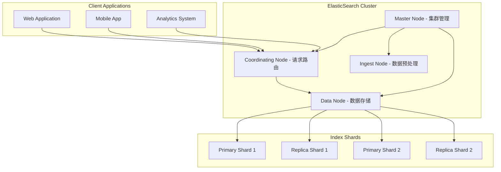
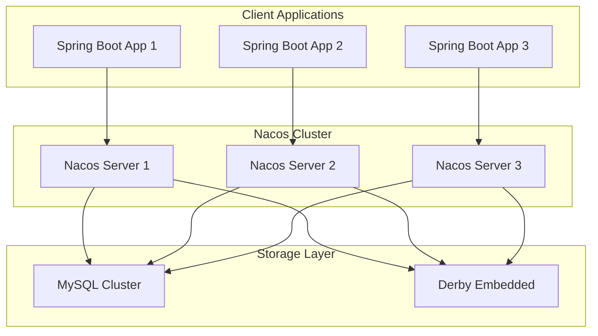

# 其他中间件深度解析 - 架构师级技术指南

## 目录
- [一、ElasticSearch深度解析](#一elasticsearch深度解析)
- [二、Zookeeper生产实践](#二zookeeper生产实践)
- [三、Nacos完整实战](#三nacos完整实战)
- [四、Nginx高级特性](#四nginx高级特性)
- [五、Apollo配置中心](#五apollo配置中心)
- [六、生产环境监控与运维](#六生产环境监控与运维)
- [七、性能优化与故障排查](#七性能优化与故障排查)
- [八、高频面试题](#八高频面试题)

## 一、ElasticSearch深度解析

### 1.1 核心架构与原理

#### 1.1.1 分布式架构设计

**ElasticSearch集群架构**：


**核心概念深度解析**：

| 概念 | 说明 | 类比 | 特点 |
|------|------|------|------|
| **Index** | 索引，文档的集合 | 数据库 | 支持分片、副本 |
| **Type** | 类型（7.x后废弃） | 表 | 已废弃，使用_doc |
| **Document** | 文档，JSON对象 | 行 | 唯一ID，版本控制 |
| **Field** | 字段，文档属性 | 列 | 支持多种数据类型 |
| **Mapping** | 字段映射定义 | 表结构 | 定义字段类型和属性 |
| **Shard** | 分片，索引的分区 | 分表 | 水平扩展，并行处理 |
| **Replica** | 副本，分片副本 | 备份 | 高可用，负载均衡 |

#### 1.1.2 倒排索引深度原理

**倒排索引构建过程**：
```java
// 文档分词和倒排索引构建
public class InvertedIndexBuilder {
    
    public Map<String, List<Posting>> buildInvertedIndex(List<Document> documents) {
        Map<String, List<Posting>> invertedIndex = new HashMap<>();
        
        for (Document doc : documents) {
            // 1. 文档分词
            List<String> terms = tokenize(doc.getContent());
            
            // 2. 构建词项-文档映射
            for (int position = 0; position < terms.size(); position++) {
                String term = terms.get(position);
                Posting posting = new Posting(doc.getId(), position);
                
                invertedIndex.computeIfAbsent(term, k -> new ArrayList<>())
                    .add(posting);
            }
        }
        
        // 3. 排序和优化
        invertedIndex.values().forEach(Collections::sort);
        
        return invertedIndex;
    }
    
    private List<String> tokenize(String content) {
        // 使用标准分析器分词
        return Arrays.asList(content.toLowerCase()
            .replaceAll("[^a-zA-Z0-9\\s]", "")
            .split("\\s+"));
    }
}

// 倒排索引条目
class Posting {
    private final String documentId;
    private final int position;
    private int frequency = 1;
    
    public Posting(String documentId, int position) {
        this.documentId = documentId;
        this.position = position;
    }
    
    // getters and setters
}
```

**倒排索引示例**：
```
原始文档:
文档1: "Elasticsearch is great for search"
文档2: "Elasticsearch and Kibana work together"
文档3: "Search is fast with Elasticsearch"

倒排索引:
elasticsearch -> [(doc1, [0]), (doc2, [0]), (doc3, [2])]
is -> [(doc1, [1]), (doc3, [0])]
great -> [(doc1, [2])]
for -> [(doc1, [3])]
search -> [(doc1, [4]), (doc3, [1])]
and -> [(doc2, [1])]
kibana -> [(doc2, [2])]
work -> [(doc2, [3])]
together -> [(doc2, [4])]
fast -> [(doc3, [2])]
with -> [(doc3, [3])]
```

### 1.2 生产级ES集群配置

#### 1.2.1 集群规划与配置

**生产环境集群配置**：
```yaml
# elasticsearch.yml - Master节点配置
cluster.name: production-cluster
node.name: master-01
node.roles: [master, data, ingest]

# 网络配置
network.host: 0.0.0.0
http.port: 9200
transport.port: 9300

# 集群发现
discovery.seed_hosts: ["master-01:9300", "master-02:9300", "master-03:9300"]
cluster.initial_master_nodes: ["master-01", "master-02", "master-03"]

# 内存配置
bootstrap.memory_lock: true
indices.memory.index_buffer_size: 30%

# 安全配置
xpack.security.enabled: true
xpack.security.transport.ssl.enabled: true
xpack.security.transport.ssl.verification_mode: certificate
xpack.security.transport.ssl.keystore.path: certs/elastic-certificates.p12
xpack.security.transport.ssl.truststore.path: certs/elastic-certificates.p12

# 监控配置
xpack.monitoring.collection.enabled: true
xpack.monitoring.exporters.prometheus:
  type: prometheus
  prometheus:
    enabled: true
```

**JVM配置优化**：
```bash
# jvm.options
# 堆内存配置（不超过32GB）
-Xms16g
-Xmx16g

# GC配置
-XX:+UseG1GC
-XX:G1HeapRegionSize=16m
-XX:+UnlockExperimentalVMOptions
-XX:+UseCGroupMemoryLimitForHeap

# 性能优化
-XX:+AlwaysPreTouch
-XX:+UseStringDeduplication
-XX:+UseCompressedOops
-XX:+UseCompressedClassPointers

# 监控配置
-XX:+HeapDumpOnOutOfMemoryError
-XX:HeapDumpPath=/var/log/elasticsearch/heapdump.hprof
```

#### 1.2.2 索引设计与优化

**商品搜索索引设计**：
```java
@Document(indexName = "products", createIndex = false)
@Setting(settingPath = "/elasticsearch/product-settings.json")
public class Product {
    
    @Id
    private String id;
    
    @Field(type = FieldType.Text, analyzer = "ik_max_word", searchAnalyzer = "ik_smart")
    private String name;
    
    @Field(type = FieldType.Text, analyzer = "ik_max_word")
    private String description;
    
    @Field(type = FieldType.Keyword)
    private String category;
    
    @Field(type = FieldType.Keyword)
    private String brand;
    
    @Field(type = FieldType.Double)
    private Double price;
    
    @Field(type = FieldType.Integer)
    private Integer stock;
    
    @Field(type = FieldType.Date, format = DateFormat.date_time)
    private LocalDateTime createTime;
    
    @Field(type = FieldType.Date, format = DateFormat.date_time)
    private LocalDateTime updateTime;
    
    @Field(type = FieldType.Nested)
    private List<Attribute> attributes;
    
    @Field(type = FieldType.GeoPoint)
    private GeoPoint location;
    
    // 嵌套对象
    public static class Attribute {
        @Field(type = FieldType.Keyword)
        private String name;
        
        @Field(type = FieldType.Keyword)
        private String value;
    }
}
```

**索引设置配置**：
```json
{
  "settings": {
    "number_of_shards": 3,
    "number_of_replicas": 1,
    "refresh_interval": "30s",
    "max_result_window": 100000,
    "analysis": {
      "analyzer": {
        "ik_max_word": {
          "type": "ik_max_word"
        },
        "ik_smart": {
          "type": "ik_smart"
        }
      }
    }
  },
  "mappings": {
    "properties": {
      "name": {
        "type": "text",
        "analyzer": "ik_max_word",
        "search_analyzer": "ik_smart",
        "fields": {
          "keyword": {
            "type": "keyword",
            "ignore_above": 256
          }
        }
      },
      "price": {
        "type": "double"
      },
      "createTime": {
        "type": "date",
        "format": "yyyy-MM-dd HH:mm:ss"
      }
    }
  }
}
```

### 1.3 高级搜索与聚合

#### 1.3.1 复杂搜索查询

**多条件组合搜索**：
```java
@Service
public class AdvancedSearchService {
    
    @Autowired
    private ElasticsearchRestTemplate esTemplate;
    
    public SearchResult<Product> searchProducts(ProductSearchRequest request) {
        BoolQueryBuilder boolQuery = QueryBuilders.boolQuery();
        
        // 1. 关键词搜索
        if (StringUtils.hasText(request.getKeyword())) {
            boolQuery.must(QueryBuilders.multiMatchQuery(request.getKeyword())
                .field("name^3")  // 名称权重更高
                .field("description")
                .type(MultiMatchQueryBuilder.Type.BEST_FIELDS)
                .fuzziness(Fuzziness.AUTO));
        }
        
        // 2. 分类过滤
        if (CollectionUtils.isNotEmpty(request.getCategories())) {
            boolQuery.filter(QueryBuilders.termsQuery("category", request.getCategories()));
        }
        
        // 3. 价格范围
        if (request.getMinPrice() != null || request.getMaxPrice() != null) {
            RangeQueryBuilder priceRange = QueryBuilders.rangeQuery("price");
            if (request.getMinPrice() != null) {
                priceRange.gte(request.getMinPrice());
            }
            if (request.getMaxPrice() != null) {
                priceRange.lte(request.getMaxPrice());
            }
            boolQuery.filter(priceRange);
        }
        
        // 4. 库存过滤
        if (request.isInStockOnly()) {
            boolQuery.filter(QueryBuilders.rangeQuery("stock").gt(0));
        }
        
        // 5. 地理位置搜索
        if (request.getLatitude() != null && request.getLongitude() != null) {
            boolQuery.filter(QueryBuilders.geoDistanceQuery("location")
                .point(request.getLatitude(), request.getLongitude())
                .distance(request.getRadius() + "km"));
        }
        
        // 6. 时间范围
        if (request.getStartTime() != null && request.getEndTime() != null) {
            boolQuery.filter(QueryBuilders.rangeQuery("createTime")
                .gte(request.getStartTime())
                .lte(request.getEndTime()));
        }
        
        // 构建搜索请求
        NativeSearchQuery searchQuery = new NativeSearchQueryBuilder()
            .withQuery(boolQuery)
            .withPageable(PageRequest.of(request.getPage(), request.getSize()))
            .withSort(SortBuilders.fieldSort("_score").order(SortOrder.DESC))
            .withSort(SortBuilders.fieldSort("createTime").order(SortOrder.DESC))
            .withHighlightFields(
                new HighlightBuilder.Field("name"),
                new HighlightBuilder.Field("description")
            )
            .build();
        
        SearchHits<Product> searchHits = esTemplate.search(searchQuery, Product.class);
        
        return SearchResult.<Product>builder()
            .content(searchHits.stream()
                .map(SearchHit::getContent)
                .collect(Collectors.toList()))
            .totalElements(searchHits.getTotalHits())
            .totalPages((int) Math.ceil((double) searchHits.getTotalHits() / request.getSize()))
            .build();
    }
}
```

#### 1.3.2 聚合分析

**商品统计分析**：
```java
@Service
public class ProductAnalyticsService {
    
    @Autowired
    private ElasticsearchRestTemplate esTemplate;
    
    public ProductAnalytics getProductAnalytics(ProductAnalyticsRequest request) {
        BoolQueryBuilder boolQuery = QueryBuilders.boolQuery();
        
        // 时间范围过滤
        if (request.getStartTime() != null && request.getEndTime() != null) {
            boolQuery.filter(QueryBuilders.rangeQuery("createTime")
                .gte(request.getStartTime())
                .lte(request.getEndTime()));
        }
        
        // 构建聚合查询
        NativeSearchQuery searchQuery = new NativeSearchQueryBuilder()
            .withQuery(boolQuery)
            .addAggregation(AggregationBuilders.terms("category_stats")
                .field("category")
                .size(10)
                .subAggregation(AggregationBuilders.avg("avg_price").field("price"))
                .subAggregation(AggregationBuilders.sum("total_stock").field("stock")))
            .addAggregation(AggregationBuilders.terms("brand_stats")
                .field("brand")
                .size(10)
                .subAggregation(AggregationBuilders.avg("avg_price").field("price")))
            .addAggregation(AggregationBuilders.stats("price_stats").field("price"))
            .addAggregation(AggregationBuilders.dateHistogram("time_stats")
                .field("createTime")
                .calendarInterval(DateHistogramInterval.DAY)
                .subAggregation(AggregationBuilders.count("product_count")))
            .withPageable(PageRequest.of(0, 0))  // 只要聚合结果
            .build();
        
        SearchHits<Product> searchHits = esTemplate.search(searchQuery, Product.class);
        
        // 解析聚合结果
        Map<String, Aggregation> aggregations = searchHits.getAggregations().asMap();
        
        return ProductAnalytics.builder()
            .categoryStats(parseTermsAggregation(aggregations.get("category_stats")))
            .brandStats(parseTermsAggregation(aggregations.get("brand_stats")))
            .priceStats(parseStatsAggregation(aggregations.get("price_stats")))
            .timeStats(parseDateHistogramAggregation(aggregations.get("time_stats")))
            .build();
    }
    
    private List<CategoryStat> parseTermsAggregation(Aggregation aggregation) {
        if (aggregation instanceof ParsedStringTerms) {
            ParsedStringTerms terms = (ParsedStringTerms) aggregation;
            return terms.getBuckets().stream()
                .map(bucket -> CategoryStat.builder()
                    .name(bucket.getKeyAsString())
                    .count(bucket.getDocCount())
                    .avgPrice(getSubAggregationValue(bucket, "avg_price"))
                    .totalStock(getSubAggregationValue(bucket, "total_stock"))
                    .build())
                .collect(Collectors.toList());
        }
        return Collections.emptyList();
    }
}
```

### 1.4 性能优化与监控

#### 1.4.1 查询性能优化

**慢查询优化**：
```java
@Component
public class QueryOptimizationService {
    
    // 1. 使用过滤器而不是查询
    public SearchHits<Product> optimizedSearch(String keyword) {
        BoolQueryBuilder boolQuery = QueryBuilders.boolQuery();
        
        // 使用filter而不是must，不计算分数
        boolQuery.filter(QueryBuilders.termQuery("category", "electronics"));
        boolQuery.filter(QueryBuilders.rangeQuery("price").gte(100).lte(1000));
        
        // 只在需要时才使用查询
        if (StringUtils.hasText(keyword)) {
            boolQuery.must(QueryBuilders.matchQuery("name", keyword));
        }
        
        return esTemplate.search(new NativeSearchQuery(boolQuery), Product.class);
    }
    
    // 2. 使用_source过滤减少网络传输
    public SearchHits<Product> searchWithSourceFilter(String keyword) {
        NativeSearchQuery searchQuery = new NativeSearchQueryBuilder()
            .withQuery(QueryBuilders.matchQuery("name", keyword))
            .withSourceFilter(new FetchSourceFilter(
                new String[]{"id", "name", "price"},  // 只返回需要的字段
                null))
            .build();
        
        return esTemplate.search(searchQuery, Product.class);
    }
    
    // 3. 使用scroll API处理大量数据
    public void processLargeDataset() {
        Scroll scroll = Scroll.of(Duration.ofMinutes(1));
        SearchScrollHits<Product> scrollHits = esTemplate.searchScrollStart(1000, 
            new NativeSearchQueryBuilder()
                .withQuery(QueryBuilders.matchAllQuery())
                .build(), 
            Product.class, 
            IndexCoordinates.of("products"));
        
        while (scrollHits.hasSearchHits()) {
            // 处理当前批次的数据
            scrollHits.getSearchHits().forEach(hit -> {
                Product product = hit.getContent();
                // 业务处理逻辑
            });
            
            // 获取下一批次
            scrollHits = esTemplate.searchScrollContinue(scroll, scrollHits, Product.class);
        }
        
        // 清理scroll上下文
        esTemplate.searchScrollClear(scrollHits);
    }
}
```

#### 1.4.2 集群监控

**ES集群监控配置**：
```java
@Component
public class ElasticsearchMonitoringService {
    
    @Autowired
    private ElasticsearchRestTemplate esTemplate;
    
    @Scheduled(fixedRate = 30000)  // 每30秒监控一次
    public void monitorClusterHealth() {
        try {
            // 1. 集群健康状态
            ClusterHealthRequest healthRequest = new ClusterHealthRequest();
            ClusterHealthResponse healthResponse = esTemplate.execute(client -> 
                client.cluster().health(healthRequest, RequestOptions.DEFAULT));
            
            log.info("Cluster Health: {}", healthResponse.getStatus());
            
            // 2. 节点统计
            NodesStatsRequest nodesStatsRequest = new NodesStatsRequest();
            NodesStatsResponse nodesStatsResponse = esTemplate.execute(client -> 
                client.nodes().stats(nodesStatsRequest, RequestOptions.DEFAULT));
            
            for (NodeStats nodeStats : nodesStatsResponse.getNodes()) {
                log.info("Node {} - JVM Heap: {}%, CPU: {}%", 
                    nodeStats.getNode().getName(),
                    nodeStats.getJvm().getMem().getHeapUsedPercent(),
                    nodeStats.getOs().getCpu().getPercent());
            }
            
            // 3. 索引统计
            IndicesStatsRequest indicesStatsRequest = new IndicesStatsRequest();
            IndicesStatsResponse indicesStatsResponse = esTemplate.execute(client -> 
                client.indices().stats(indicesStatsRequest, RequestOptions.DEFAULT));
            
            for (IndexStats indexStats : indicesStatsResponse.getIndices().values()) {
                log.info("Index {} - Docs: {}, Size: {}MB", 
                    indexStats.getIndex(),
                    indexStats.getTotal().getDocs().getCount(),
                    indexStats.getTotal().getStore().getSizeInBytes() / 1024 / 1024);
            }
            
        } catch (Exception e) {
            log.error("Error monitoring Elasticsearch cluster", e);
        }
    }
}
```

### 1.5 生产环境故障排查

#### 1.5.1 常见问题与解决方案

**1. 集群脑裂问题**：
```yaml
# 解决方案：配置最小主节点数
discovery.zen.minimum_master_nodes: 2  # 3节点集群设置为2
discovery.zen.ping.unicast.hosts: ["node1:9300", "node2:9300", "node3:9300"]
```

**2. 内存不足问题**：
```bash
# 监控脚本
#!/bin/bash
while true; do
    # 检查JVM堆内存使用率
    HEAP_USAGE=$(curl -s "localhost:9200/_nodes/stats/jvm" | jq '.nodes[].jvm.mem.heap_used_percent')
    
    if [ "$HEAP_USAGE" -gt 85 ]; then
        echo "WARNING: Heap usage is ${HEAP_USAGE}%"
        # 触发GC
        curl -X POST "localhost:9200/_cluster/nodes/_local/_gc"
    fi
    
    sleep 30
done
```

**3. 分片分配问题**：
```java
// 手动分配分片
public void reallocateShards() {
    try {
        // 检查分片状态
        ClusterHealthRequest healthRequest = new ClusterHealthRequest();
        ClusterHealthResponse healthResponse = esTemplate.execute(client -> 
            client.cluster().health(healthRequest, RequestOptions.DEFAULT));
        
        if (healthResponse.getStatus() == ClusterHealthStatus.RED) {
            // 手动分配未分配的分片
            ClusterRerouteRequest rerouteRequest = new ClusterRerouteRequest();
            // 添加分配命令...
            
            esTemplate.execute(client -> 
                client.cluster().reroute(rerouteRequest, RequestOptions.DEFAULT));
        }
    } catch (Exception e) {
        log.error("Error reallocating shards", e);
    }
}
```

## 二、Zookeeper生产实践

### 2.1 ZAB协议深度解析

#### 2.1.1 ZAB协议原理

**ZAB（Zookeeper Atomic Broadcast）协议**是Zookeeper的核心一致性协议，保证分布式环境下数据的一致性。

**ZAB协议三个阶段**：

1. **Discovery阶段**：发现集群中最新的数据
2. **Synchronization阶段**：同步最新数据到所有节点
3. **Broadcast阶段**：处理客户端请求并广播

```java
// ZAB协议实现示例
public class ZABProtocol {
    
    public enum NodeState {
        LOOKING,    // 寻找Leader
        FOLLOWING,  // 跟随者
        LEADING     // 领导者
    }
    
    private NodeState state = NodeState.LOOKING;
    private long currentEpoch = 0;
    private long acceptedEpoch = 0;
    
    // Leader选举算法
    public void startLeaderElection() {
        // 1. 生成选票
        Vote vote = new Vote(myId, currentEpoch, lastLoggedZxid);
        
        // 2. 发送选票给其他节点
        for (QuorumPeer peer : peers) {
            sendVote(peer, vote);
        }
        
        // 3. 收集选票
        Map<Long, Vote> votes = collectVotes();
        
        // 4. 判断是否获得多数票
        if (hasMajority(votes)) {
            state = NodeState.LEADING;
            startBroadcast();
        } else {
            state = NodeState.FOLLOWING;
        }
    }
    
    // 广播阶段处理客户端请求
    public void processRequest(Proposal proposal) {
        if (state == NodeState.LEADING) {
            // 1. 生成提案
            proposal.setZxid(++lastLoggedZxid);
            
            // 2. 发送提案给所有Follower
            for (Follower follower : followers) {
                sendProposal(follower, proposal);
            }
            
            // 3. 等待ACK
            waitForAcks(proposal);
            
            // 4. 提交提案
            commitProposal(proposal);
        }
    }
}
```

#### 2.1.2 集群配置与优化

**生产环境Zookeeper配置**：
```properties
# zoo.cfg
# 基础配置
tickTime=2000
initLimit=10
syncLimit=5
dataDir=/var/lib/zookeeper
clientPort=2181

# 集群配置
server.1=zk1.example.com:2888:3888
server.2=zk2.example.com:2888:3888
server.3=zk3.example.com:2888:3888

# 性能优化
maxClientCnxns=60
minSessionTimeout=4000
maxSessionTimeout=40000
autopurge.snapRetainCount=3
autopurge.purgeInterval=1

# 日志配置
4lw.commands.whitelist=*
admin.enableServer=false
```

**JVM优化配置**：
```bash
# zookeeper-env.sh
export JAVA_HOME=/usr/lib/jvm/java-8-openjdk
export JVMFLAGS="-Xmx4g -Xms4g -XX:+UseG1GC -XX:MaxGCPauseMillis=200"
export SERVER_JVMFLAGS="-Djava.security.auth.login.config=/etc/zookeeper/jaas.conf"
```

### 2.2 分布式锁实现

#### 2.2.1 基于Zookeeper的分布式锁

**生产级分布式锁实现**：
```java
@Component
public class ZookeeperDistributedLock {
    
    private final CuratorFramework client;
    private final String lockPath;
    private final InterProcessMutex lock;
    
    public ZookeeperDistributedLock(CuratorFramework client, String lockPath) {
        this.client = client;
        this.lockPath = lockPath;
        this.lock = new InterProcessMutex(client, lockPath);
    }
    
    public boolean tryLock(long timeout, TimeUnit unit) {
        try {
            return lock.acquire(timeout, unit);
        } catch (Exception e) {
            log.error("Failed to acquire lock", e);
            return false;
        }
    }
    
    public void unlock() {
        try {
            lock.release();
        } catch (Exception e) {
            log.error("Failed to release lock", e);
        }
    }
    
    // 带重试的锁获取
    public boolean tryLockWithRetry(int maxRetries, long timeout, TimeUnit unit) {
        for (int i = 0; i < maxRetries; i++) {
            if (tryLock(timeout, unit)) {
                return true;
            }
            
            try {
                Thread.sleep(100 * (i + 1)); // 指数退避
            } catch (InterruptedException e) {
                Thread.currentThread().interrupt();
                return false;
            }
        }
        return false;
    }
}
```

**读写锁实现**：
```java
@Component
public class ZookeeperReadWriteLock {
    
    private final CuratorFramework client;
    private final InterProcessReadWriteLock readWriteLock;
    
    public ZookeeperReadWriteLock(CuratorFramework client, String lockPath) {
        this.client = client;
        this.readWriteLock = new InterProcessReadWriteLock(client, lockPath);
    }
    
    public boolean tryReadLock(long timeout, TimeUnit unit) {
        try {
            return readWriteLock.readLock().acquire(timeout, unit);
        } catch (Exception e) {
            log.error("Failed to acquire read lock", e);
            return false;
        }
    }
    
    public boolean tryWriteLock(long timeout, TimeUnit unit) {
        try {
            return readWriteLock.writeLock().acquire(timeout, unit);
        } catch (Exception e) {
            log.error("Failed to acquire write lock", e);
            return false;
        }
    }
    
    public void releaseReadLock() {
        try {
            readWriteLock.readLock().release();
        } catch (Exception e) {
            log.error("Failed to release read lock", e);
        }
    }
    
    public void releaseWriteLock() {
        try {
            readWriteLock.writeLock().release();
        } catch (Exception e) {
            log.error("Failed to release write lock", e);
        }
    }
}
```

### 2.3 服务注册与发现

#### 2.3.1 服务注册中心实现

**服务注册实现**：
```java
@Service
public class ZookeeperServiceRegistry {
    
    private final CuratorFramework client;
    private final String basePath = "/services";
    private final Map<String, String> registeredServices = new ConcurrentHashMap<>();
    
    public ZookeeperServiceRegistry(CuratorFramework client) {
        this.client = client;
    }
    
    public void registerService(String serviceName, String host, int port) {
        try {
            String servicePath = basePath + "/" + serviceName;
            String instancePath = servicePath + "/" + host + ":" + port;
            
            // 创建服务节点（持久节点）
            if (client.checkExists().forPath(servicePath) == null) {
                client.create()
                    .creatingParentsIfNeeded()
                    .forPath(servicePath);
            }
            
            // 创建实例节点（临时节点）
            String instanceData = String.format("{\"host\":\"%s\",\"port\":%d,\"timestamp\":%d}", 
                host, port, System.currentTimeMillis());
            
            client.create()
                .withMode(CreateMode.EPHEMERAL)
                .forPath(instancePath, instanceData.getBytes());
            
            registeredServices.put(serviceName, instancePath);
            log.info("Service {} registered at {}", serviceName, instancePath);
            
        } catch (Exception e) {
            log.error("Failed to register service {}", serviceName, e);
            throw new RuntimeException("Service registration failed", e);
        }
    }
    
    public void unregisterService(String serviceName) {
        try {
            String instancePath = registeredServices.get(serviceName);
            if (instancePath != null) {
                client.delete().forPath(instancePath);
                registeredServices.remove(serviceName);
                log.info("Service {} unregistered", serviceName);
            }
        } catch (Exception e) {
            log.error("Failed to unregister service {}", serviceName, e);
        }
    }
}
```

**服务发现实现**：
```java
@Service
public class ZookeeperServiceDiscovery {
    
    private final CuratorFramework client;
    private final String basePath = "/services";
    private final Map<String, List<ServiceInstance>> serviceCache = new ConcurrentHashMap<>();
    private final Map<String, PathChildrenCache> watchers = new ConcurrentHashMap<>();
    
    public ZookeeperServiceDiscovery(CuratorFramework client) {
        this.client = client;
    }
    
    public List<ServiceInstance> discoverServices(String serviceName) {
        try {
            String servicePath = basePath + "/" + serviceName;
            
            // 检查缓存
            List<ServiceInstance> instances = serviceCache.get(serviceName);
            if (instances != null) {
                return instances;
            }
            
            // 从Zookeeper获取服务实例
            List<String> children = client.getChildren().forPath(servicePath);
            instances = new ArrayList<>();
            
            for (String child : children) {
                byte[] data = client.getData().forPath(servicePath + "/" + child);
                ServiceInstance instance = parseServiceInstance(child, data);
                instances.add(instance);
            }
            
            // 更新缓存
            serviceCache.put(serviceName, instances);
            
            // 设置监听器
            setupWatcher(serviceName, servicePath);
            
            return instances;
            
        } catch (Exception e) {
            log.error("Failed to discover services for {}", serviceName, e);
            return Collections.emptyList();
        }
    }
    
    private void setupWatcher(String serviceName, String servicePath) {
        try {
            PathChildrenCache watcher = new PathChildrenCache(client, servicePath, true);
            watcher.getListenable().addListener(new PathChildrenCacheListener() {
                @Override
                public void childEvent(CuratorFramework client, PathChildrenCacheEvent event) {
                    switch (event.getType()) {
                        case CHILD_ADDED:
                        case CHILD_REMOVED:
                        case CHILD_UPDATED:
                            // 重新发现服务
                            refreshServiceCache(serviceName);
                            break;
                    }
                }
            });
            
            watcher.start();
            watchers.put(serviceName, watcher);
            
        } catch (Exception e) {
            log.error("Failed to setup watcher for {}", serviceName, e);
        }
    }
    
    private void refreshServiceCache(String serviceName) {
        try {
            String servicePath = basePath + "/" + serviceName;
            List<String> children = client.getChildren().forPath(servicePath);
            List<ServiceInstance> instances = new ArrayList<>();
            
            for (String child : children) {
                byte[] data = client.getData().forPath(servicePath + "/" + child);
                ServiceInstance instance = parseServiceInstance(child, data);
                instances.add(instance);
            }
            
            serviceCache.put(serviceName, instances);
            log.info("Service cache refreshed for {}: {} instances", serviceName, instances.size());
            
        } catch (Exception e) {
            log.error("Failed to refresh service cache for {}", serviceName, e);
        }
    }
    
    private ServiceInstance parseServiceInstance(String child, byte[] data) {
        try {
            String json = new String(data);
            JsonNode jsonNode = objectMapper.readTree(json);
            
            return ServiceInstance.builder()
                .host(jsonNode.get("host").asText())
                .port(jsonNode.get("port").asInt())
                .timestamp(jsonNode.get("timestamp").asLong())
                .build();
                
        } catch (Exception e) {
            log.error("Failed to parse service instance: {}", child, e);
            return null;
        }
    }
}
```

### 2.4 配置中心实现

#### 2.4.1 基于Zookeeper的配置中心

**配置管理服务**：
```java
@Service
public class ZookeeperConfigCenter {
    
    private final CuratorFramework client;
    private final String configPath = "/config";
    private final Map<String, String> configCache = new ConcurrentHashMap<>();
    private final Map<String, List<ConfigChangeListener>> listeners = new ConcurrentHashMap<>();
    
    public ZookeeperConfigCenter(CuratorFramework client) {
        this.client = client;
    }
    
    public void setConfig(String key, String value) {
        try {
            String configKeyPath = configPath + "/" + key;
            
            // 创建配置节点
            if (client.checkExists().forPath(configKeyPath) == null) {
                client.create()
                    .creatingParentsIfNeeded()
                    .forPath(configKeyPath);
            }
            
            // 设置配置值
            client.setData().forPath(configKeyPath, value.getBytes());
            
            // 更新缓存
            configCache.put(key, value);
            
            // 通知监听器
            notifyListeners(key, value);
            
            log.info("Config {} set to {}", key, value);
            
        } catch (Exception e) {
            log.error("Failed to set config {} = {}", key, value, e);
            throw new RuntimeException("Config setting failed", e);
        }
    }
    
    public String getConfig(String key) {
        try {
            // 先检查缓存
            String value = configCache.get(key);
            if (value != null) {
                return value;
            }
            
            // 从Zookeeper获取
            String configKeyPath = configPath + "/" + key;
            if (client.checkExists().forPath(configKeyPath) != null) {
                byte[] data = client.getData().forPath(configKeyPath);
                value = new String(data);
                configCache.put(key, value);
                return value;
            }
            
            return null;
            
        } catch (Exception e) {
            log.error("Failed to get config {}", key, e);
            return null;
        }
    }
    
    public void watchConfig(String key, ConfigChangeListener listener) {
        try {
            String configKeyPath = configPath + "/" + key;
            
            // 添加监听器
            listeners.computeIfAbsent(key, k -> new ArrayList<>()).add(listener);
            
            // 设置Zookeeper监听器
            client.getData().usingWatcher(new Watcher() {
                @Override
                public void process(WatchedEvent event) {
                    if (event.getType() == Event.EventType.NodeDataChanged) {
                        try {
                            byte[] data = client.getData().forPath(configKeyPath);
                            String newValue = new String(data);
                            
                            // 更新缓存
                            configCache.put(key, newValue);
                            
                            // 通知监听器
                            notifyListeners(key, newValue);
                            
                        } catch (Exception e) {
                            log.error("Failed to handle config change for {}", key, e);
                        }
                    }
                }
            }).forPath(configKeyPath);
            
        } catch (Exception e) {
            log.error("Failed to watch config {}", key, e);
        }
    }
    
    private void notifyListeners(String key, String value) {
        List<ConfigChangeListener> keyListeners = listeners.get(key);
        if (keyListeners != null) {
            keyListeners.forEach(listener -> {
                try {
                    listener.onConfigChange(key, value);
                } catch (Exception e) {
                    log.error("Error notifying config change listener", e);
                }
            });
        }
    }
    
    @FunctionalInterface
    public interface ConfigChangeListener {
        void onConfigChange(String key, String value);
    }
}
```

### 2.5 性能优化与监控

#### 2.5.1 Zookeeper性能调优

**JVM参数优化**：
```bash
# zookeeper-env.sh
export JVMFLAGS="-Xmx4g -Xms4g \
-XX:+UseG1GC \
-XX:MaxGCPauseMillis=200 \
-XX:+UnlockExperimentalVMOptions \
-XX:+UseCGroupMemoryLimitForHeap \
-XX:+HeapDumpOnOutOfMemoryError \
-XX:HeapDumpPath=/var/log/zookeeper/heapdump.hprof"
```

**Zookeeper配置优化**：
```properties
# zoo.cfg
# 网络优化
tickTime=2000
initLimit=10
syncLimit=5

# 内存优化
preAllocSize=65536
snapCount=100000
autopurge.snapRetainCount=3
autopurge.purgeInterval=1

# 连接优化
maxClientCnxns=60
minSessionTimeout=4000
maxSessionTimeout=40000

# 日志优化
4lw.commands.whitelist=*
admin.enableServer=false
```

#### 2.5.2 监控与告警

**Zookeeper监控服务**：
```java
@Component
public class ZookeeperMonitoringService {
    
    private final CuratorFramework client;
    private final MeterRegistry meterRegistry;
    
    @Scheduled(fixedRate = 30000)
    public void monitorZookeeper() {
        try {
            // 1. 检查连接状态
            boolean isConnected = client.getZookeeperClient().isConnected();
            Gauge.builder("zookeeper.connection.status")
                .register(meterRegistry, () -> isConnected ? 1 : 0);
            
            // 2. 监控节点数量
            int nodeCount = client.getChildren().forPath("/").size();
            Gauge.builder("zookeeper.nodes.count")
                .register(meterRegistry, () -> nodeCount);
            
            // 3. 监控会话数
            String stats = new String(client.getData().forPath("/zookeeper/stats"));
            int sessionCount = parseSessionCount(stats);
            Gauge.builder("zookeeper.sessions.count")
                .register(meterRegistry, () -> sessionCount);
            
            // 4. 监控延迟
            long startTime = System.currentTimeMillis();
            client.getData().forPath("/");
            long latency = System.currentTimeMillis() - startTime;
            Gauge.builder("zookeeper.operation.latency")
                .register(meterRegistry, () -> latency);
            
        } catch (Exception e) {
            log.error("Error monitoring Zookeeper", e);
        }
    }
    
    private int parseSessionCount(String stats) {
        // 解析stats字符串获取会话数
        Pattern pattern = Pattern.compile("Connections: (\\d+)");
        Matcher matcher = pattern.matcher(stats);
        if (matcher.find()) {
            return Integer.parseInt(matcher.group(1));
        }
        return 0;
    }
}
```

## 三、Nacos完整实战

### 3.1 Nacos架构与原理

#### 3.1.1 核心架构设计

**Nacos集群架构**：


**Nacos核心功能**：
- **服务注册与发现**：支持多种服务发现协议
- **配置管理**：动态配置推送和监听
- **服务健康检查**：多种健康检查方式
- **服务元数据管理**：支持自定义元数据

### 3.2 服务注册与发现

#### 3.2.1 生产级服务注册配置

**Nacos服务端配置**：
```yaml
# application.properties
# 服务器配置
server.port=8848

# 数据源配置
spring.datasource.platform=mysql
db.num=1
db.url.0=jdbc:mysql://mysql-cluster:3306/nacos?characterEncoding=utf8&connectTimeout=1000&socketTimeout=3000&autoReconnect=true&useUnicode=true&useSSL=false&serverTimezone=UTC
db.user.0=nacos
db.password.0=nacos

# 集群配置
nacos.cmdb.dumpTaskInterval=3600
nacos.cmdb.eventTaskInterval=10
nacos.cmdb.labelTaskInterval=300
nacos.cmdb.loadDataAtStart=false

# 认证配置
nacos.core.auth.enabled=true
nacos.core.auth.default.token.expire.seconds=18000
nacos.core.auth.default.token.secret.key=SecretKey012345678901234567890123456789012345678901234567890123456789
nacos.core.auth.caching.enabled=true
nacos.core.auth.caching.cache.init.capacity=100000
nacos.core.auth.caching.cache.max.size=1000000
nacos.core.auth.caching.cache.expire.seconds=18000

# 监控配置
management.endpoints.web.exposure.include=*
management.endpoint.health.show-details=always
```

**客户端配置**：
```yaml
# application.yml
spring:
  application:
    name: user-service
  cloud:
    nacos:
      discovery:
        server-addr: nacos-cluster:8848
        namespace: production
        group: DEFAULT_GROUP
        cluster-name: beijing
        metadata:
          version: 1.0.0
          region: beijing
          zone: zone1
        heart-beat-interval: 5000
        heart-beat-timeout: 15000
        ip-delete-timeout: 30000
      config:
        server-addr: nacos-cluster:8848
        namespace: production
        group: DEFAULT_GROUP
        file-extension: yaml
        refresh-enabled: true
        shared-configs:
          - data-id: common-config.yaml
            group: COMMON_GROUP
            refresh: true
        extension-configs:
          - data-id: user-service-config.yaml
            group: USER_GROUP
            refresh: true
```

#### 3.2.2 服务注册实现

**服务注册代码**：
```java
@SpringBootApplication
@EnableDiscoveryClient
@EnableConfigurationProperties
public class UserServiceApplication {
    
    public static void main(String[] args) {
        SpringApplication.run(UserServiceApplication.class, args);
    }
    
    @Bean
    @LoadBalanced
    public RestTemplate restTemplate() {
        return new RestTemplate();
    }
}

@Service
public class UserService {
    
    @Autowired
    private DiscoveryClient discoveryClient;
    
    @Autowired
    private RestTemplate restTemplate;
    
    public User getUserById(Long userId) {
        // 1. 服务发现
        List<ServiceInstance> instances = discoveryClient.getInstances("user-service");
        if (instances.isEmpty()) {
            throw new RuntimeException("No user service instances available");
        }
        
        // 2. 负载均衡选择实例
        ServiceInstance instance = loadBalance(instances);
        
        // 3. 调用服务
        String url = String.format("http://%s:%d/users/%d", 
            instance.getHost(), instance.getPort(), userId);
        
        return restTemplate.getForObject(url, User.class);
    }
    
    private ServiceInstance loadBalance(List<ServiceInstance> instances) {
        // 简单的轮询负载均衡
        int index = (int) (System.currentTimeMillis() % instances.size());
        return instances.get(index);
    }
}
```

**服务健康检查**：
```java
@Component
public class NacosHealthIndicator implements HealthIndicator {
    
    @Autowired
    private NacosDiscoveryProperties nacosDiscoveryProperties;
    
    @Override
    public Health health() {
        try {
            // 检查Nacos连接状态
            boolean isConnected = checkNacosConnection();
            
            if (isConnected) {
                return Health.up()
                    .withDetail("nacos.server", nacosDiscoveryProperties.getServerAddr())
                    .withDetail("nacos.namespace", nacosDiscoveryProperties.getNamespace())
                    .build();
            } else {
                return Health.down()
                    .withDetail("nacos.server", nacosDiscoveryProperties.getServerAddr())
                    .withDetail("error", "Cannot connect to Nacos server")
                    .build();
            }
        } catch (Exception e) {
            return Health.down()
                .withDetail("error", e.getMessage())
                .build();
        }
    }
    
    private boolean checkNacosConnection() {
        // 实现Nacos连接检查逻辑
        return true;
    }
}
```

### 3.3 配置管理

#### 3.3.1 动态配置管理

**配置管理服务**：
```java
@Service
@RefreshScope
public class ConfigService {
    
    @Value("${app.name:default-app}")
    private String appName;
    
    @Value("${app.version:1.0.0}")
    private String appVersion;
    
    @Value("${app.feature.enabled:false}")
    private boolean featureEnabled;
    
    @Value("${app.rate.limit:100}")
    private int rateLimit;
    
    @Autowired
    private NacosConfigService nacosConfigService;
    
    public void updateConfig(String dataId, String group, String content) {
        try {
            boolean result = nacosConfigService.publishConfig(dataId, group, content);
            if (result) {
                log.info("Config updated successfully: dataId={}, group={}", dataId, group);
            } else {
                log.error("Failed to update config: dataId={}, group={}", dataId, group);
            }
        } catch (Exception e) {
            log.error("Error updating config", e);
            throw new RuntimeException("Config update failed", e);
        }
    }
    
    public String getConfig(String dataId, String group) {
        try {
            return nacosConfigService.getConfig(dataId, group, 5000);
        } catch (Exception e) {
            log.error("Error getting config", e);
            return null;
        }
    }
    
    public void addConfigListener(String dataId, String group, Listener listener) {
        try {
            nacosConfigService.addListener(dataId, group, listener);
        } catch (Exception e) {
            log.error("Error adding config listener", e);
        }
    }
    
    // 配置变更监听器
    @EventListener
    public void handleConfigChange(RefreshEvent event) {
        log.info("Config changed: {}", event.getKeys());
        // 处理配置变更逻辑
    }
}
```

**配置监听器实现**：
```java
@Component
public class ConfigChangeListener implements Listener {
    
    @Override
    public void receiveConfigInfo(String configInfo) {
        log.info("Config changed: {}", configInfo);
        
        try {
            // 解析配置
            Properties properties = new Properties();
            properties.load(new StringReader(configInfo));
            
            // 更新应用配置
            updateApplicationConfig(properties);
            
        } catch (Exception e) {
            log.error("Error processing config change", e);
        }
    }
    
    @Override
    public Executor getExecutor() {
        return Executors.newSingleThreadExecutor(r -> {
            Thread thread = new Thread(r, "config-listener");
            thread.setDaemon(true);
            return thread;
        });
    }
    
    private void updateApplicationConfig(Properties properties) {
        // 实现配置更新逻辑
        properties.forEach((key, value) -> {
            log.info("Config updated: {} = {}", key, value);
        });
    }
}
```

### 3.4 服务治理

#### 3.4.1 服务限流与熔断

**限流配置**：
```java
@Configuration
public class NacosRateLimitConfig {
    
    @Bean
    public RateLimiter rateLimiter() {
        return RateLimiter.create(100.0); // 每秒100个请求
    }
    
    @Bean
    public FilterRegistrationBean<RateLimitFilter> rateLimitFilter() {
        FilterRegistrationBean<RateLimitFilter> registration = new FilterRegistrationBean<>();
        registration.setFilter(new RateLimitFilter());
        registration.addUrlPatterns("/*");
        registration.setName("rateLimitFilter");
        registration.setOrder(1);
        return registration;
    }
}

@Component
public class RateLimitFilter implements Filter {
    
    @Autowired
    private RateLimiter rateLimiter;
    
    @Override
    public void doFilter(ServletRequest request, ServletResponse response, FilterChain chain) 
            throws IOException, ServletException {
        
        if (rateLimiter.tryAcquire()) {
            chain.doFilter(request, response);
        } else {
            HttpServletResponse httpResponse = (HttpServletResponse) response;
            httpResponse.setStatus(HttpStatus.TOO_MANY_REQUESTS.value());
            httpResponse.getWriter().write("Rate limit exceeded");
        }
    }
}
```

**熔断配置**：
```java
@Configuration
public class NacosCircuitBreakerConfig {
    
    @Bean
    public CircuitBreaker circuitBreaker() {
        return CircuitBreaker.ofDefaults("user-service")
            .toBuilder()
            .slidingWindowSize(10)
            .minimumNumberOfCalls(5)
            .failureRateThreshold(50)
            .waitDurationInOpenState(Duration.ofSeconds(30))
            .permittedNumberOfCallsInHalfOpenState(3)
            .build();
    }
    
    @Bean
    public Retry retry() {
        return Retry.ofDefaults("user-service")
            .toBuilder()
            .maxAttempts(3)
            .waitDuration(Duration.ofMillis(100))
            .build();
    }
}
```

## 四、Nginx高级特性

### 4.1 负载均衡配置

**Nginx负载均衡配置**：
```nginx
# nginx.conf
upstream backend {
    # 负载均衡算法
    least_conn;  # 最少连接数
    
    # 服务器配置
    server 192.168.1.10:8080 weight=3 max_fails=3 fail_timeout=30s;
    server 192.168.1.11:8080 weight=2 max_fails=3 fail_timeout=30s;
    server 192.168.1.12:8080 weight=1 max_fails=3 fail_timeout=30s;
    
    # 健康检查
    keepalive 32;
}

server {
    listen 80;
    server_name api.example.com;
    
    # 限流配置
    limit_req_zone $binary_remote_addr zone=api:10m rate=10r/s;
    limit_req zone=api burst=20 nodelay;
    
    # 缓存配置
    location ~* \.(jpg|jpeg|png|gif|ico|css|js)$ {
        expires 1y;
        add_header Cache-Control "public, immutable";
    }
    
    # API代理
    location /api/ {
        proxy_pass http://backend;
        proxy_set_header Host $host;
        proxy_set_header X-Real-IP $remote_addr;
        proxy_set_header X-Forwarded-For $proxy_add_x_forwarded_for;
        proxy_set_header X-Forwarded-Proto $scheme;
        
        # 超时配置
        proxy_connect_timeout 5s;
        proxy_send_timeout 10s;
        proxy_read_timeout 10s;
        
        # 缓冲配置
        proxy_buffering on;
        proxy_buffer_size 4k;
        proxy_buffers 8 4k;
    }
}
```

### 4.2 限流与缓存

**限流配置**：
```nginx
# 基于IP的限流
limit_req_zone $binary_remote_addr zone=login:10m rate=1r/s;
limit_req_zone $binary_remote_addr zone=api:10m rate=10r/s;

# 基于用户的限流
limit_req_zone $http_authorization zone=user:10m rate=5r/s;

# 限流应用
location /login {
    limit_req zone=login burst=5 nodelay;
    proxy_pass http://backend;
}

location /api/ {
    limit_req zone=api burst=20 nodelay;
    proxy_pass http://backend;
}
```

**缓存配置**：
```nginx
# 缓存配置
proxy_cache_path /var/cache/nginx levels=1:2 keys_zone=my_cache:10m max_size=1g inactive=60m;

server {
    location /api/ {
        # 缓存配置
        proxy_cache my_cache;
        proxy_cache_valid 200 302 10m;
        proxy_cache_valid 404 1m;
        proxy_cache_use_stale error timeout updating http_500 http_502 http_503 http_504;
        
        # 缓存键
        proxy_cache_key "$scheme$request_method$host$request_uri";
        
        proxy_pass http://backend;
    }
}
```

## 五、Apollo配置中心

### 5.1 Apollo架构与配置

**Apollo配置**：
```yaml
# application.yml
app:
  id: user-service
apollo:
  meta: http://apollo-config-server:8080
  bootstrap:
    enabled: true
    namespaces: application,common
  cache-dir: /opt/data/apollo
  cluster: default
  env: dev
```

**Apollo配置管理**：
```java
@Configuration
@EnableApolloConfig
public class ApolloConfig {
    
    @ApolloConfig
    private Config config;
    
    @ApolloConfigChangeListener
    private void configChangeListener(ConfigChangeEvent changeEvent) {
        for (String key : changeEvent.changedKeys()) {
            ConfigChange change = changeEvent.getChange(key);
            log.info("Config changed: {} = {} -> {}", 
                key, change.getOldValue(), change.getNewValue());
        }
    }
}

@Service
public class ApolloConfigService {
    
    @ApolloConfig
    private Config config;
    
    public String getConfig(String key) {
        return config.getProperty(key, "default-value");
    }
    
    public String getConfig(String key, String defaultValue) {
        return config.getProperty(key, defaultValue);
    }
    
    public int getIntConfig(String key, int defaultValue) {
        return config.getIntProperty(key, defaultValue);
    }
    
    public boolean getBooleanConfig(String key, boolean defaultValue) {
        return config.getBooleanProperty(key, defaultValue);
    }
}
```

## 六、生产环境监控与运维

### 6.1 中间件监控体系

**监控指标收集**：
```java
@Component
public class MiddlewareMonitoringService {
    
    private final MeterRegistry meterRegistry;
    
    @Scheduled(fixedRate = 30000)
    public void collectMetrics() {
        // ElasticSearch监控
        collectElasticsearchMetrics();
        
        // Zookeeper监控
        collectZookeeperMetrics();
        
        // Nacos监控
        collectNacosMetrics();
        
        // Nginx监控
        collectNginxMetrics();
    }
    
    private void collectElasticsearchMetrics() {
        try {
            // 集群健康状态
            String health = restTemplate.getForObject("http://es-cluster:9200/_cluster/health", String.class);
            // 解析并记录指标
        } catch (Exception e) {
            log.error("Error collecting ES metrics", e);
        }
    }
    
    private void collectZookeeperMetrics() {
        try {
            // Zookeeper状态检查
            String stats = zkClient.getData().forPath("/zookeeper/stats");
            // 解析并记录指标
        } catch (Exception e) {
            log.error("Error collecting ZK metrics", e);
        }
    }
}
```

## 七、性能优化与故障排查

### 7.1 性能优化策略

**ElasticSearch优化**：
- 合理设置分片数量
- 优化查询语句
- 使用过滤器而不是查询
- 合理设置刷新间隔

**Zookeeper优化**：
- 合理设置tickTime
- 优化JVM参数
- 定期清理快照和日志
- 监控连接数

**Nacos优化**：
- 合理设置心跳间隔
- 优化数据库连接池
- 使用本地缓存
- 监控服务实例数量

### 7.2 故障排查

**常见问题排查**：
1. **ES集群脑裂**：检查网络连接和配置
2. **ZK连接超时**：检查网络和JVM配置
3. **Nacos服务注册失败**：检查网络和认证配置
4. **Nginx负载均衡失效**：检查upstream配置

## 八、高频面试题

### Q1：ES为什么快？

1. **倒排索引**：快速定位文档
2. **分片**：并行搜索
3. **文件系统缓存**：热数据在内存
4. **近实时搜索**：1秒内可见
5. **分布式架构**：水平扩展

### Q2：ZooKeeper如何保证一致性？

- **ZAB协议**（Zookeeper Atomic Broadcast）
- **Leader选举**：保证只有一个Leader
- **过半机制**：需要多数节点同意
- **顺序性**：保证操作顺序

### Q3：Nacos和Eureka的区别？

| 特性 | Nacos | Eureka |
|------|-------|--------|
| AP/CP | 支持切换 | AP |
| 配置中心 | 支持 | 不支持 |
| 健康检查 | TCP/HTTP/MySQL | HTTP |
| 服务发现 | 支持 | 支持 |
| 配置管理 | 支持 | 不支持 |
| 元数据 | 丰富 | 基础 |

### Q4：Nginx负载均衡算法？

1. **轮询**（默认）：按顺序分配
2. **权重**：按权重分配
3. **IP哈希**：基于客户端IP
4. **最少连接**：分配给连接数最少的服务器
5. **URL哈希**：基于URL哈希

### Q5：Apollo配置中心优势？

1. **配置集中管理**：统一管理所有配置
2. **实时推送**：配置变更实时生效
3. **版本管理**：支持配置版本控制
4. **权限控制**：细粒度权限管理
5. **灰度发布**：支持配置灰度发布

---

**关键字**：ElasticSearch、Zookeeper、Nacos、Nginx、Apollo、倒排索引、ZAB协议、负载均衡、配置中心、服务发现、监控运维

