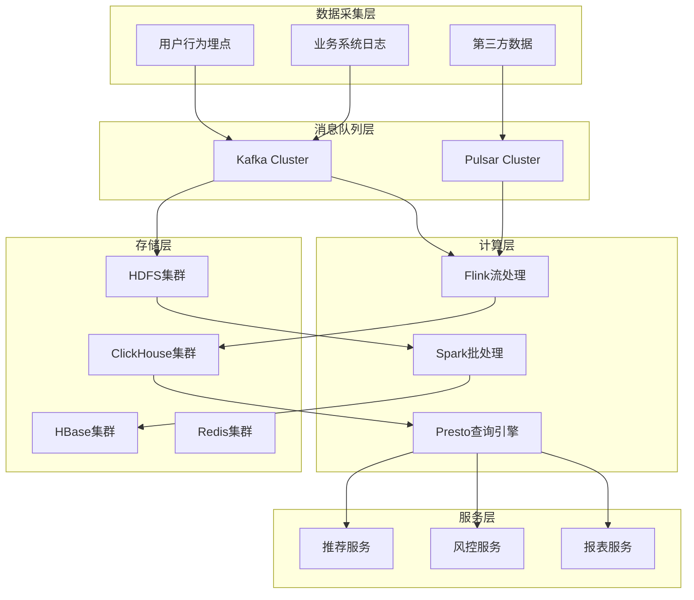
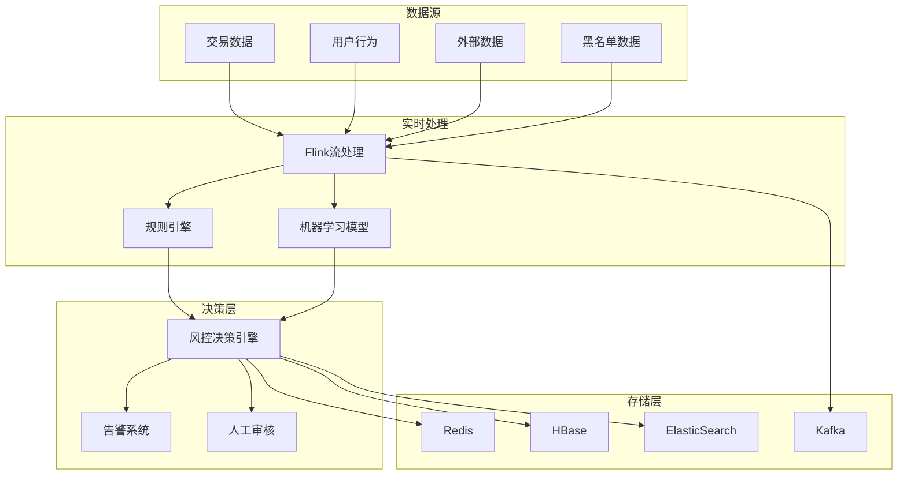
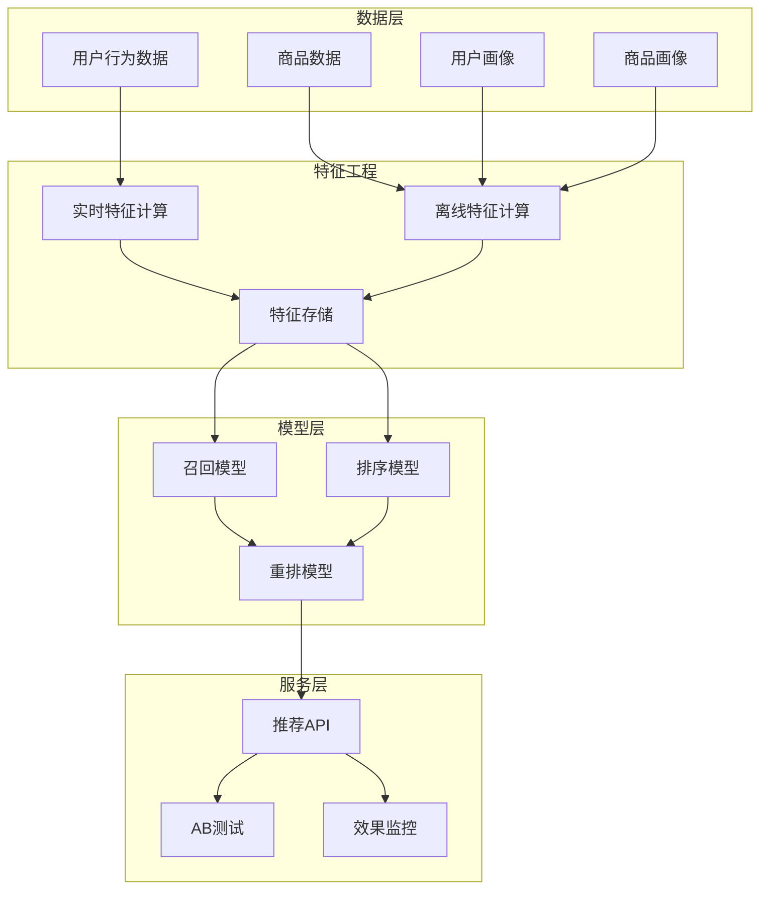
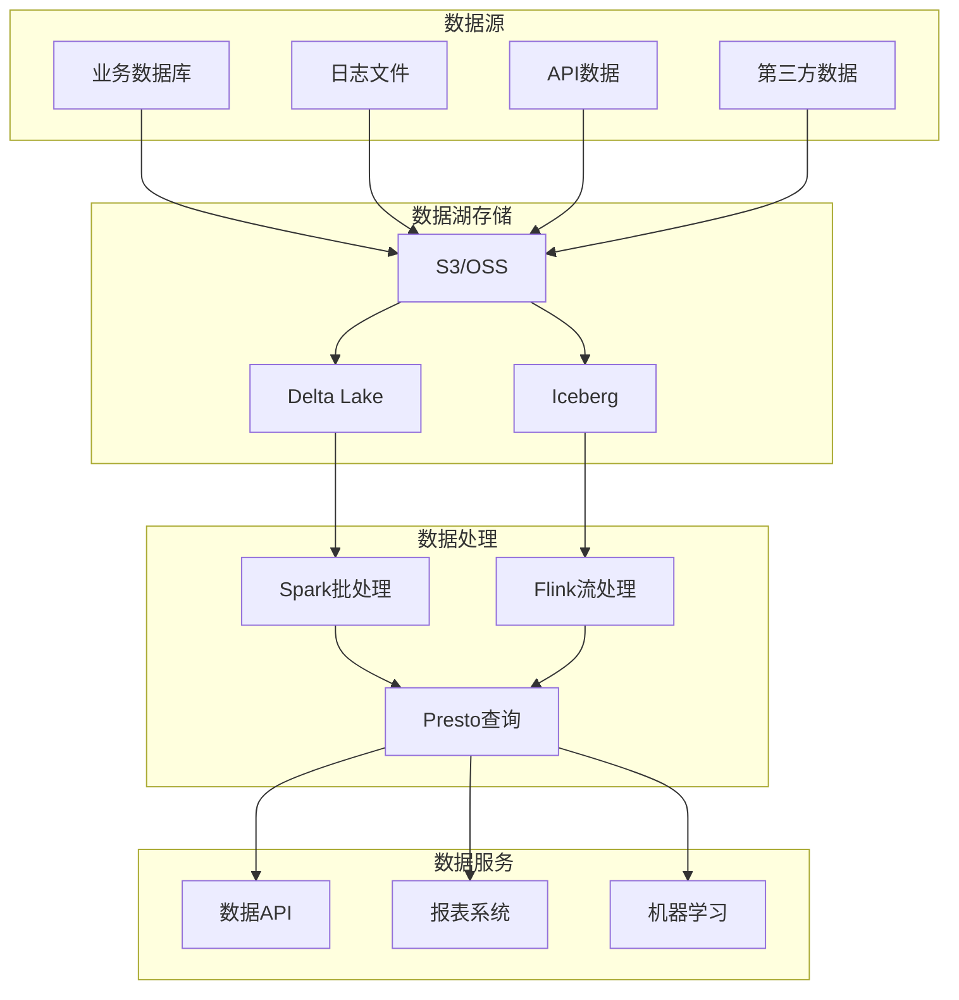
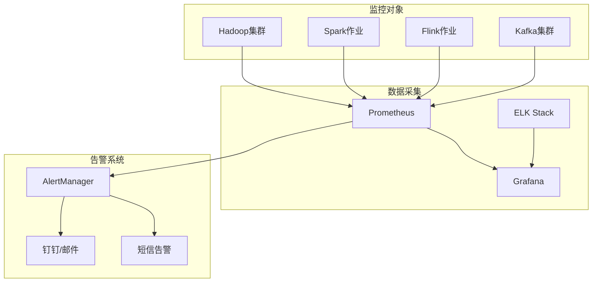
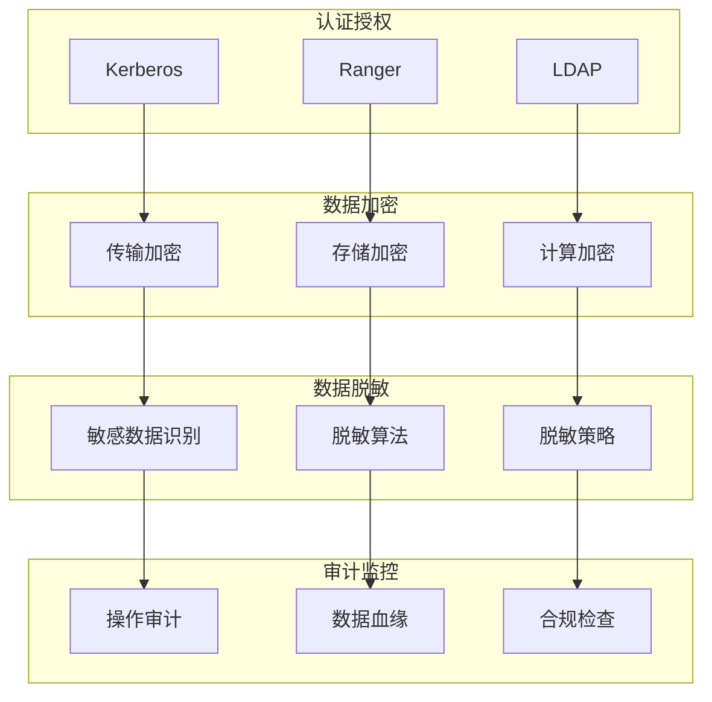

# 大数据技术栈深度解析

## 目录
- [一、大数据架构原理深度解析](#一大数据架构原理深度解析)
- [二、Hadoop生态深度原理](#二hadoop生态深度原理)
- [三、Spark深度原理与优化](#三spark深度原理与优化)
- [四、Flink流处理深度原理](#四flink流处理深度原理)
- [五、存储引擎深度分析](#五存储引擎深度分析)
- [六、数据仓库深度解析](#六数据仓库深度解析)
- [七、大数据性能调优深度策略](#七大数据性能调优深度策略)
- [八、大数据安全与治理](#八大数据安全与治理)
- [九、高频面试题深度解析](#九高频面试题深度解析)

## 一、大数据架构原理深度解析

### 1.1 大数据架构分层深度分析

**大数据架构分层图**：
```
┌─────────────────────────────────────────────────────────┐
│                    大数据架构分层                        │
├─────────────────────────────────────────────────────────┤
│  ┌─────────────────┐  ┌─────────────────┐  ┌─────────────┐ │
│  │   应用层        │  │   API层         │  │  处理层     │ │
│  │  Jupyter       │  │  Spark SQL      │  │  Spark Core │ │
│  │  Zeppelin      │  │  Flink SQL      │  │  Flink      │ │
│  │  Grafana       │  │  Presto         │  │  Storm     │ │
│  └─────────────────┘  └─────────────────┘  └─────────────┘ │
├─────────────────────────────────────────────────────────┤
│  ┌─────────────────┐  ┌─────────────────┐  ┌─────────────┐ │
│  │   存储层        │  │  资源层         │  │基础设施层   │ │
│  │  HDFS          │  │  YARN           │  │  Linux      │ │
│  │  HBase         │  │  Kubernetes     │  │  Docker     │ │
│  │  Kafka         │  │  Mesos          │  │  Network    │ │
│  └─────────────────┘  └─────────────────┘  └─────────────┘ │
└─────────────────────────────────────────────────────────┘
```

#### 1.1.1 应用层深度分析

**数据科学平台技术对比**：

| 平台 | 优势 | 劣势 | 适用场景 | 学习成本 |
|------|------|------|----------|----------|
| Jupyter | 交互性强、生态丰富 | 单机限制、扩展性差 | 数据探索、原型开发 | 低 |
| Zeppelin | 多语言支持、企业级 | 学习曲线陡峭 | 企业级数据科学 | 中 |
| Databricks | 云原生、企业级 | 成本高、厂商锁定 | 大规模生产环境 | 中 |

**机器学习平台架构设计**：
- **模型生命周期管理**：从实验到生产的完整流程
- **版本控制策略**：模型版本、数据版本、代码版本的三位一体
- **A/B测试框架**：模型效果对比和灰度发布
- **监控告警体系**：模型性能监控和漂移检测

#### 1.1.2 API层深度分析

**SQL引擎技术对比**：

| 引擎 | 优势 | 劣势 | 适用场景 | 性能特点 |
|------|------|------|----------|----------|
| Spark SQL | 生态丰富、易用性好 | 内存消耗大 | 批处理分析 | 适合复杂ETL |
| Flink SQL | 低延迟、状态管理 | 学习成本高 | 实时计算 | 毫秒级响应 |
| Presto | 查询速度快 | 资源消耗大 | 交互式查询 | 秒级响应 |
| Trino | 高性能、云原生 | 配置复杂 | 数据湖查询 | 亚秒级响应 |

**查询优化核心技术**：

**1. 基于规则的优化（RBO）**：
- **谓词下推**：将过滤条件推到数据源
- **列裁剪**：只读取需要的列
- **常量折叠**：编译时计算常量表达式
- **投影下推**：提前执行投影操作

**2. 基于成本的优化（CBO）**：
- **统计信息收集**：表大小、数据分布、索引信息
- **成本模型**：CPU成本、IO成本、网络成本
- **连接顺序优化**：选择最优的连接顺序
- **索引选择**：选择最优的索引策略

#### 1.1.3 处理层深度分析

**批处理引擎技术对比**：

| 引擎 | 优势 | 劣势 | 适用场景 | 性能特点 |
|------|------|------|----------|----------|
| MapReduce | 稳定可靠、容错强 | 性能较低、编程复杂 | 大规模批处理 | 适合离线分析 |
| Spark | 内存计算、生态丰富 | 内存消耗大 | 交互式分析 | 比MapReduce快10-100倍 |
| Tez | 执行效率高 | 学习成本高 | 复杂DAG作业 | 适合Hive优化 |

**流处理引擎技术对比**：

| 引擎 | 优势 | 劣势 | 适用场景 | 延迟特点 |
|------|------|------|----------|----------|
| Storm | 成熟稳定、容错强 | 性能相对较低 | 简单流处理 | 秒级延迟 |
| Flink | 低延迟、状态管理 | 学习成本高 | 复杂流处理 | 毫秒级延迟 |
| Kafka Streams | 轻量级、易部署 | 功能相对简单 | 微服务流处理 | 毫秒级延迟 |

#### 1.1.4 存储层深度分析

**分布式文件系统技术对比**：

| 系统 | 优势 | 劣势 | 适用场景 | 一致性模型 |
|------|------|------|----------|------------|
| HDFS | 成熟稳定、生态丰富 | 单点故障、小文件问题 | 大数据批处理 | 最终一致性 |
| GFS | 高可用、自动恢复 | 复杂、学习成本高 | 大规模存储 | 强一致性 |
| Ceph | 统一存储、扩展性强 | 配置复杂 | 云存储 | 可配置一致性 |

**NoSQL数据库技术选型**：

| 数据库 | 数据模型 | 一致性 | 分区策略 | 适用场景 |
|--------|----------|--------|----------|----------|
| HBase | 列族存储 | 强一致性 | 范围分区 | 时序数据、日志存储 |
| Cassandra | 列族存储 | 最终一致性 | 一致性哈希 | 高可用、全球分布 |
| MongoDB | 文档存储 | 可配置 | 分片键 | 复杂查询、快速开发 |

### 1.2 大数据处理模式深度解析

#### 1.2.1 批处理模式深度分析

**批处理优化策略**：
- **数据本地性优化**：任务调度到数据所在节点
- **资源预分配**：提前分配计算资源
- **中间结果缓存**：缓存中间计算结果
- **并行度调优**：根据数据量调整并行度

**实战案例：电商数据分析平台**
- **场景**：日处理订单数据1000万条，用户行为数据1亿条
- **技术栈**：Spark + HDFS + Hive + Presto
- **优化策略**：数据分区、列式存储、索引优化
- **性能提升**：查询速度提升10倍，存储成本降低30%

#### 1.2.2 流处理模式深度分析

**流处理优化策略**：
- **背压控制**：处理速度不匹配时的流量控制
- **状态优化**：状态存储和访问优化
- **检查点优化**：检查点频率和存储优化
- **网络优化**：网络传输和序列化优化

**实战案例：实时推荐系统**
- **场景**：实时处理用户行为，毫秒级推荐响应
- **技术栈**：Flink + Kafka + Redis + HBase
- **架构设计**：事件驱动、状态管理、结果缓存
- **性能指标**：延迟<100ms，吞吐量10万QPS

#### 1.2.3 混合处理模式深度分析

**Lambda架构实战案例**：
- **批处理层**：处理历史数据，保证准确性
- **速度层**：处理实时数据，保证及时性
- **服务层**：合并结果，提供统一查询接口

**Kappa架构实战案例**：
- **统一流处理**：所有数据都通过流处理
- **历史数据重放**：需要时重放历史数据
- **状态管理**：维护处理状态，支持复杂计算

## 二、Hadoop生态深度原理

### 2.1 HDFS深度原理

**HDFS架构设计**：
```
┌─────────────────────────────────────────────────────────┐
│                    HDFS架构图                           │
├─────────────────────────────────────────────────────────┤
│  ┌─────────────┐    ┌─────────────┐    ┌─────────────┐  │
│  │  NameNode   │    │  NameNode     │    │  NameNode   │  │
│  │  (Active)   │    │  (Standby)   │    │  (Observer) │  │
│  └─────────────┘    └─────────────┘    └─────────────┘  │
│         │                   │                   │        │
│         └───────────────────┼───────────────────┘        │
│                             │                          │
│  ┌─────────────┐    ┌─────────────┐    ┌─────────────┐  │
│  │  DataNode   │    │  DataNode   │    │  DataNode   │  │
│  │   (Node1)   │    │   (Node2)   │    │   (Node3)   │  │
│  └─────────────┘    └─────────────┘    └─────────────┘  │
└─────────────────────────────────────────────────────────┘
```

**HDFS核心技术**：

**1. 数据分块策略**：
- **块大小**：默认128MB，可配置
- **分块原则**：平衡存储效率和访问性能
- **小文件问题**：HAR、SequenceFile、CombineFileInputFormat

**2. 副本管理机制**：
- **副本数量**：默认3副本
- **副本放置策略**：跨机架、跨数据中心
- **副本修复**：自动检测和修复损坏副本

**3. 高可用设计**：
- **NameNode HA**：主备切换、故障转移
- **JournalNode**：共享存储、元数据同步
- **ZooKeeper**：协调服务、故障检测

### 2.2 MapReduce深度原理

**MapReduce执行流程**：
```
┌─────────────────────────────────────────────────────────┐
│                MapReduce执行流程                        │
├─────────────────────────────────────────────────────────┤
│  1. Input Split  →  2. Map Task  →  3. Shuffle  →  4. Reduce Task │
│     (数据分片)      (映射任务)      (数据混洗)      (归约任务)    │
└─────────────────────────────────────────────────────────┘
```

**MapReduce优化策略**：

**1. 数据本地性优化**：
- **节点本地性**：任务调度到数据所在节点
- **机架本地性**：任务调度到同一机架
- **网络本地性**：任务调度到同一网络段

**2. 内存管理优化**：
- **Map端内存**：mapreduce.map.memory.mb
- **Reduce端内存**：mapreduce.reduce.memory.mb
- **JVM堆内存**：mapreduce.map.java.opts

**3. 网络优化**：
- **压缩传输**：mapreduce.map.output.compress
- **网络拓扑**：机架感知、网络距离计算
- **并发控制**：mapreduce.task.io.sort.factor

### 2.3 YARN深度原理

**YARN架构设计**：
```
┌─────────────────────────────────────────────────────────┐
│                    YARN架构图                           │
├─────────────────────────────────────────────────────────┤
│  ┌─────────────────┐    ┌─────────────────┐              │
│  │  ResourceManager│    │  Application    │              │
│  │                │    │  Manager        │              │
│  └─────────────────┘    └─────────────────┘              │
│         │                       │                       │
│         └───────────────────────┼───────────────────────┘
│                                 │                       │
│  ┌─────────────┐    ┌─────────────┐    ┌─────────────┐  │
│  │  NodeManager│    │  NodeManager│    │  NodeManager│  │
│  │   (Node1)   │    │   (Node2)   │    │   (Node3)   │  │
│  └─────────────┘    └─────────────┘    └─────────────┘  │
└─────────────────────────────────────────────────────────┘
```

**YARN调度策略**：

**1. 调度器类型**：
- **FIFO调度器**：先进先出，简单但效率低
- **容量调度器**：按队列分配资源，支持优先级
- **公平调度器**：资源公平分配，适合多用户环境

**2. 资源管理**：
- **资源抽象**：CPU、内存、磁盘、网络
- **资源隔离**：cgroups、Linux容器
- **资源监控**：实时监控资源使用情况

## 三、Spark深度原理与优化

### 3.1 Spark核心架构

**Spark架构设计**：
```
┌─────────────────────────────────────────────────────────┐
│                    Spark架构图                          │
├─────────────────────────────────────────────────────────┤
│  ┌─────────────────┐    ┌─────────────────┐              │
│  │  Driver        │    │  Cluster        │              │
│  │  Program       │    │  Manager        │              │
│  └─────────────────┘    └─────────────────┘              │
│         │                       │                       │
│         └───────────────────────┼───────────────────────┘
│                                 │                       │
│  ┌─────────────┐    ┌─────────────┐    ┌─────────────┐  │
│  │  Executor   │    │  Executor   │    │  Executor   │  │
│  │   (Node1)   │    │   (Node2)   │    │   (Node3)   │  │
│  └─────────────┘    └─────────────┘    └─────────────┘  │
└─────────────────────────────────────────────────────────┘
```

**Spark核心概念**：

**1. RDD（弹性分布式数据集）**：
- **不可变性**：RDD一旦创建不可修改
- **分区性**：数据分布在多个节点上
- **容错性**：通过血缘关系实现容错
- **延迟计算**：惰性求值，按需计算

**2. DAG（有向无环图）**：
- **阶段划分**：根据shuffle操作划分阶段
- **任务调度**：每个阶段生成多个任务
- **依赖关系**：窄依赖和宽依赖

**3. 内存管理**：
- **存储内存**：缓存RDD数据
- **执行内存**：任务执行时的内存
- **统一内存管理**：动态分配存储和执行内存

### 3.2 Spark SQL深度优化

**Spark SQL优化策略**：

**1. 数据源优化**：
- **列式存储**：Parquet、ORC格式
- **分区裁剪**：只读取需要的分区
- **谓词下推**：将过滤条件推到数据源

**2. 查询优化**：
- **Catalyst优化器**：基于规则的优化
- **自适应查询执行**：运行时优化
- **统计信息**：表统计信息、列统计信息

**3. 内存优化**：
- **广播变量**：小表广播到所有节点
- **数据倾斜处理**：salting、repartition
- **缓存策略**：MEMORY_ONLY、MEMORY_AND_DISK

### 3.3 Spark Streaming深度原理

**Spark Streaming架构**：
```
┌─────────────────────────────────────────────────────────┐
│                Spark Streaming架构                      │
├─────────────────────────────────────────────────────────┤
│  ┌─────────────┐    ┌─────────────┐    ┌─────────────┐  │
│  │  数据源     │    │  Kafka      │    │  数据源     │  │
│  │  (Kafka)    │    │  Cluster    │    │  (Flume)    │  │
│  └─────────────┘    └─────────────┘    └─────────────┘  │
│         │                   │                   │        │
│         └───────────────────┼───────────────────┘        │
│                             │                          │
│  ┌─────────────────────────────────────────────────────┐ │
│  │              Spark Streaming                        │ │
│  │  ┌─────────┐ ┌─────────┐ ┌─────────┐ ┌─────────┐   │ │
│  │  │ Batch1  │ │ Batch2 │ │ Batch3 │ │ Batch4 │   │ │
│  │  └─────────┘ └─────────┘ └─────────┘ └─────────┘   │ │
│  └─────────────────────────────────────────────────────┘ │
│                             │                          │
│  ┌─────────────┐    ┌─────────────┐    ┌─────────────┐  │
│  │  输出存储   │    │  输出存储   │    │  输出存储   │  │
│  │  (HDFS)     │    │  (HBase)    │    │  (Kafka)     │  │
│  └─────────────┘    └─────────────┘    └─────────────┘  │
└─────────────────────────────────────────────────────────┘
```

**Spark Streaming优化策略**：

**1. 批处理优化**：
- **批处理大小**：根据数据量调整批处理间隔
- **并行度设置**：合理设置接收器数量
- **内存管理**：控制缓存数据量

**2. 容错机制**：
- **检查点机制**：定期保存状态
- **重试机制**：失败任务自动重试
- **数据恢复**：从检查点恢复状态

## 四、Flink流处理深度原理

### 4.1 Flink核心架构

**Flink架构设计**：
```
┌─────────────────────────────────────────────────────────┐
│                    Flink架构图                          │
├─────────────────────────────────────────────────────────┤
│  ┌─────────────────┐    ┌─────────────────┐              │
│  │  JobManager    │    │  Resource       │              │
│  │                │    │  Manager        │              │
│  └─────────────────┘    └─────────────────┘              │
│         │                       │                       │
│         └───────────────────────┼───────────────────────┘
│                                 │                       │
│  ┌─────────────┐    ┌─────────────┐    ┌─────────────┐  │
│  │  TaskManager│    │  TaskManager│    │  TaskManager│  │
│  │   (Node1)   │    │   (Node2)   │    │   (Node3)   │  │
│  └─────────────┘    └─────────────┘    └─────────────┘  │
└─────────────────────────────────────────────────────────┘
```

**Flink核心概念**：

**1. 流处理模型**：
- **无界流**：持续不断的数据流
- **有界流**：有限的数据集
- **时间语义**：事件时间、处理时间、摄入时间

**2. 状态管理**：
- **键控状态**：Keyed State
- **算子状态**：Operator State
- **状态后端**：MemoryStateBackend、FsStateBackend

**3. 检查点机制**：
- **检查点触发**：定期触发检查点
- **状态快照**：保存算子状态
- **故障恢复**：从检查点恢复

### 4.2 Flink SQL深度应用

**Flink SQL特性**：
- **流表对偶性**：流和表的统一抽象
- **时间窗口**：滚动窗口、滑动窗口、会话窗口
- **水印机制**：处理乱序数据
- **状态管理**：自动管理状态

**实战案例：实时风控系统**
- **场景**：实时检测异常交易，毫秒级响应
- **技术栈**：Flink + Kafka + Redis + MySQL
- **架构设计**：事件驱动、状态管理、规则引擎
- **性能指标**：延迟<50ms，吞吐量5万TPS

## 五、存储引擎深度分析

### 5.1 列式存储引擎

**列式存储优势**：
- **压缩效率高**：相同类型数据压缩效果好
- **查询性能好**：只读取需要的列
- **存储成本低**：压缩比高，存储成本低

**主流列式存储引擎**：

| 引擎 | 优势 | 劣势 | 适用场景 |
|------|------|------|----------|
| Parquet | 生态丰富、压缩好 | 写入性能一般 | 数据湖、数据仓库 |
| ORC | 查询性能好 | 生态相对较少 | Hive、数据仓库 |
| ClickHouse | 查询速度快 | 写入性能一般 | 实时分析、OLAP |

### 5.2 时序数据库

**时序数据库特点**：
- **时间序列数据**：按时间顺序存储的数据
- **高写入性能**：支持高并发写入
- **压缩存储**：时间序列数据压缩效果好
- **快速查询**：支持时间范围查询

**主流时序数据库**：

| 数据库 | 优势 | 劣势 | 适用场景 |
|--------|------|------|----------|
| InfluxDB | 易用性好、生态丰富 | 集群功能收费 | 监控、IoT |
| TimescaleDB | 基于PostgreSQL | 学习成本高 | 复杂查询、分析 |
| ClickHouse | 查询性能好 | 配置复杂 | 大数据分析 |

## 六、数据仓库深度解析

### 6.1 数据仓库架构

**数据仓库分层架构**：
```
┌─────────────────────────────────────────────────────────┐
│                   数据仓库分层架构                        │
├─────────────────────────────────────────────────────────┤
│  ┌─────────────────┐    ┌─────────────────┐              │
│  │   应用层        │    │   应用层        │              │
│  │  (报表系统)     │    │  (BI工具)       │              │
│  └─────────────────┘    └─────────────────┘              │
│         │                       │                       │
│         └───────────────────────┼───────────────────────┘
│                                 │                       │
│  ┌─────────────────────────────────────────────────────┐ │
│  │                数据服务层                           │ │
│  │  ┌─────────┐ ┌─────────┐ ┌─────────┐ ┌─────────┐   │ │
│  │  │  ADS层  │ │  DWS层  │ │  DWD层  │ │  ODS层  │   │ │
│  │  └─────────┘ └─────────┘ └─────────┘ └─────────┘   │ │
│  └─────────────────────────────────────────────────────┘ │
│                                 │                       │
│  ┌─────────────────────────────────────────────────────┐ │
│  │                数据存储层                           │ │
│  │  ┌─────────┐ ┌─────────┐ ┌─────────┐ ┌─────────┐   │ │
│  │  │  HDFS   │ │  HBase  │ │  Kafka  │ │  MySQL  │   │ │
│  │  └─────────┘ └─────────┘ └─────────┘ └─────────┘   │ │
│  └─────────────────────────────────────────────────────┘ │
└─────────────────────────────────────────────────────────┘
```

**数据仓库分层说明**：
- **ODS层**：原始数据层，保持数据原貌
- **DWD层**：数据明细层，清洗和标准化
- **DWS层**：数据服务层，轻度聚合
- **ADS层**：应用数据层，面向应用

### 6.2 数据湖架构

**数据湖架构设计**：
```
┌─────────────────────────────────────────────────────────┐
│                   数据湖架构图                           │
├─────────────────────────────────────────────────────────┤
│  ┌─────────────────┐    ┌─────────────────┐              │
│  │   数据源       │    │   数据源       │              │
│  │  (业务系统)    │    │  (IoT设备)     │              │
│  └─────────────────┘    └─────────────────┘              │
│         │                       │                       │
│         └───────────────────────┼───────────────────────┘
│                                 │                       │
│  ┌─────────────────────────────────────────────────────┐ │
│  │                数据湖存储层                         │ │
│  │  ┌─────────┐ ┌─────────┐ ┌─────────┐ ┌─────────┐   │ │
│  │  │  HDFS   │ │  S3     │ │  OSS    │ │  ADLS    │   │ │
│  │  └─────────┘ └─────────┘ └─────────┘ └─────────┘   │ │
│  └─────────────────────────────────────────────────────┘ │
│                                 │                       │
│  ┌─────────────────────────────────────────────────────┐ │
│  │                数据处理层                           │ │
│  │  ┌─────────┐ ┌─────────┐ ┌─────────┐ ┌─────────┐   │ │
│  │  │  Spark  │ │  Flink  │ │  Hive   │ │  Presto │   │ │
│  │  └─────────┘ └─────────┘ └─────────┘ └─────────┘   │ │
│  └─────────────────────────────────────────────────────┘ │
└─────────────────────────────────────────────────────────┘
```

**数据湖优势**：
- **存储成本低**：对象存储成本低
- **数据格式灵活**：支持多种数据格式
- **扩展性好**：支持PB级数据存储
- **处理引擎丰富**：支持多种计算引擎

## 七、大数据性能调优深度策略

### 7.1 存储性能优化

**HDFS性能优化**：
- **块大小调整：根据数据特点调整块大小
- **副本策略优化：合理设置副本数量
- **小文件合并：使用HAR、SequenceFile
- **压缩存储：使用Snappy、LZ4压缩

**HBase性能优化**：
- **预分区：根据数据分布预分区
- **列族设计：合理设计列族结构
- **压缩策略：使用LZ4、GZ压缩
- **缓存配置：合理配置BlockCache

### 7.2 计算性能优化

**Spark性能优化**：
- **内存配置：合理配置executor内存
- **并行度设置：根据数据量调整并行度
- **数据倾斜处理：使用salting、repartition
- **缓存策略：合理使用缓存

**Flink性能优化**：
- **检查点优化：调整检查点间隔
- **状态后端选择：选择合适的状态后端
- **网络优化：使用网络缓冲区
- **反压控制：合理设置反压阈值

### 7.3 网络性能优化

**网络优化策略**：
- **数据本地性：任务调度到数据所在节点
- **网络拓扑：优化网络拓扑结构
- **压缩传输：使用压缩减少网络传输
- **批量传输：批量传输减少网络开销

## 八、大数据安全与治理

### 8.1 数据安全

**数据安全策略**：
- **数据加密：传输加密、存储加密
- **访问控制：基于角色的访问控制
- **数据脱敏：敏感数据脱敏处理
- **审计日志：完整的操作审计日志

**数据治理框架**：
- **数据质量：数据质量监控和治理
- **数据血缘：数据血缘关系追踪
- **元数据管理：统一的元数据管理
- **数据标准：数据标准和规范

### 8.2 隐私保护

**隐私保护技术**：
- **差分隐私：保护个体隐私
- **同态加密：加密数据计算
- **联邦学习：分布式机器学习
- **数据匿名化：数据匿名化处理

## 九、高频面试题深度解析

### 9.1 架构设计类

**Q1：如何设计一个支持PB级数据的大数据平台？**

**答案要点**：
1. **存储架构**：HDFS + 对象存储，支持PB级数据
2. **计算架构**：Spark + Flink，支持批处理和流处理
3. **资源管理**：YARN + Kubernetes，支持弹性伸缩
4. **监控体系**：Prometheus + Grafana，全方位监控
5. **安全治理**：Kerberos + Ranger，数据安全保护

**Q2：如何解决数据倾斜问题？**

**答案要点**：
1. **数据倾斜原因**：数据分布不均、分区策略不当
2. **解决方案**：
   - **预处理**：数据预处理，均匀分布
   - **Salting**：添加随机前缀，打散数据
   - **Repartition**：重新分区，均匀分布
   - **两阶段聚合**：先局部聚合，再全局聚合

### 9.2 性能优化类

**Q3：如何优化Spark作业性能？**

**答案要点**：
1. **资源配置**：
   - **Executor数量**：根据数据量和集群资源调整
   - **内存配置**：合理配置executor和driver内存
   - **并行度设置**：根据数据量调整并行度

2. **数据优化**：
   - **数据格式**：使用Parquet、ORC列式存储
   - **数据分区**：合理设计分区策略
   - **数据倾斜**：处理数据倾斜问题

3. **计算优化**：
   - **缓存策略**：合理使用缓存
   - **广播变量**：小表广播
   - **UDF优化**：避免使用UDF，使用内置函数

**Q4：如何设计实时数据处理系统？**

**答案要点**：
1. **技术选型**：Flink + Kafka + Redis + HBase
2. **架构设计**：
   - **数据采集**：Kafka作为消息队列
   - **流处理**：Flink进行实时计算
   - **状态管理**：Redis存储中间状态
   - **结果存储**：HBase存储最终结果

3. **性能优化**：
   - **背压控制**：处理速度不匹配问题
   - **检查点优化**：合理设置检查点间隔
   - **网络优化**：优化网络传输

### 9.3 故障处理类

**Q5：如何处理大数据平台的故障？**

**答案要点**：
1. **故障分类**：
   - **硬件故障**：节点故障、网络故障
   - **软件故障**：应用故障、配置错误
   - **数据故障**：数据损坏、数据丢失

2. **故障处理**：
   - **监控告警**：实时监控，及时告警
   - **自动恢复**：自动故障转移和恢复
   - **人工干预**：复杂故障需要人工处理

3. **预防措施**：
   - **冗余设计**：多副本、多节点
   - **定期备份**：定期备份重要数据
   - **压力测试**：定期进行压力测试

### 9.4 技术选型类

**Q6：如何选择合适的大数据技术栈？**

**答案要点**：
1. **业务需求分析**：
   - **数据量**：根据数据量选择存储方案
   - **实时性**：根据实时性要求选择计算引擎
   - **复杂度**：根据业务复杂度选择技术栈

2. **技术选型原则**：
   - **成熟度**：选择成熟稳定的技术
   - **生态**：选择生态丰富的技术
   - **成本**：考虑技术成本和维护成本

3. **具体选型**：
   - **存储**：HDFS + HBase + Kafka
   - **计算**：Spark + Flink
   - **资源管理**：YARN + Kubernetes
   - **监控**：Prometheus + Grafana

### 9.5 数据治理类

**Q7：如何构建数据治理体系？**

**答案要点**：
1. **数据质量**：
   - **数据标准**：建立数据标准和规范
   - **数据质量监控**：实时监控数据质量
   - **数据清洗**：自动清洗脏数据

2. **数据安全**：
   - **访问控制**：基于角色的访问控制
   - **数据加密**：传输和存储加密
   - **审计日志**：完整的操作审计

3. **元数据管理**：
   - **数据血缘**：追踪数据血缘关系
   - **元数据存储**：统一的元数据存储
   - **数据目录**：建立数据目录和标签

## 十、生产级大数据平台实战案例

### 10.1 电商大数据平台架构设计

**业务背景**：
- 日订单量：1000万+
- 用户行为数据：10亿条/天
- 商品数据：5000万+
- 实时查询：QPS 10万+

**技术架构**：


**核心实现代码**：

**1. 实时数据处理管道**：
```scala
// Flink实时数据处理
object EcommerceRealtimeProcessor {
  
  def main(args: Array[String]): Unit = {
    val env = StreamExecutionEnvironment.getExecutionEnvironment
    env.setStreamTimeCharacteristic(TimeCharacteristic.EventTime)
    
    // 配置Kafka源
    val kafkaSource = new FlinkKafkaConsumer[String](
      "user_behavior_topic",
      new SimpleStringSchema(),
      kafkaProps
    )
    
    // 设置水印策略
    kafkaSource.assignTimestampsAndWatermarks(
      WatermarkStrategy
        .forBoundedOutOfOrderness(Duration.ofSeconds(5))
        .withTimestampAssigner(new UserBehaviorTimestampAssigner)
    )
    
    val dataStream = env.addSource(kafkaSource)
      .map(parseUserBehavior)
      .filter(_.isDefined)
      .map(_.get)
    
    // 实时统计用户行为
    val userBehaviorStats = dataStream
      .keyBy(_.userId)
      .window(TumblingEventTimeWindows.of(Time.minutes(5)))
      .aggregate(new UserBehaviorAggregator)
    
    // 实时推荐计算
    val realtimeRecommendations = dataStream
      .keyBy(_.userId)
      .process(new RealtimeRecommendationProcessFunction)
    
    // 输出到ClickHouse
    userBehaviorStats.addSink(new ClickHouseSink)
    realtimeRecommendations.addSink(new RedisSink)
    
    env.execute("Ecommerce Realtime Processor")
  }
}

// 用户行为数据模型
case class UserBehavior(
  userId: Long,
  itemId: Long,
  categoryId: Int,
  behavior: String, // view, cart, buy
  timestamp: Long,
  properties: Map[String, String]
)

// 实时聚合器
class UserBehaviorAggregator extends AggregateFunction[UserBehavior, UserBehaviorStats, UserBehaviorStats] {
  override def createAccumulator(): UserBehaviorStats = UserBehaviorStats()
  
  override def add(value: UserBehavior, accumulator: UserBehaviorStats): UserBehaviorStats = {
    accumulator.addBehavior(value)
  }
  
  override def getResult(accumulator: UserBehaviorStats): UserBehaviorStats = accumulator
  
  override def merge(a: UserBehaviorStats, b: UserBehaviorStats): UserBehaviorStats = {
    a.merge(b)
  }
}
```

**2. 批处理数据仓库ETL**：
```scala
// Spark批处理ETL
object DataWarehouseETL {
  
  def main(args: Array[String]): Unit = {
    val spark = SparkSession.builder()
      .appName("DataWarehouseETL")
      .config("spark.sql.adaptive.enabled", "true")
      .config("spark.sql.adaptive.coalescePartitions.enabled", "true")
      .getOrCreate()
    
    // 读取原始数据
    val rawData = spark.read
      .format("parquet")
      .load("/data/ods/user_behavior")
    
    // 数据清洗和转换
    val cleanedData = rawData
      .filter($"userId".isNotNull && $"itemId".isNotNull)
      .withColumn("date", to_date(from_unixtime($"timestamp")))
      .withColumn("hour", hour(from_unixtime($"timestamp")))
      .withColumn("isWeekend", dayofweek($"date").isin(1, 7))
    
    // 用户维度表
    val userDim = cleanedData
      .select($"userId", $"properties".getItem("age").as("age"),
              $"properties".getItem("gender").as("gender"),
              $"properties".getItem("city").as("city"))
      .distinct()
    
    // 商品维度表
    val itemDim = cleanedData
      .select($"itemId", $"categoryId",
              $"properties".getItem("brand").as("brand"),
              $"properties".getItem("price").as("price"))
      .distinct()
    
    // 事实表
    val factTable = cleanedData
      .select($"userId", $"itemId", $"categoryId", $"behavior",
              $"timestamp", $"date", $"hour", $"isWeekend")
    
    // 写入数据仓库
    userDim.write
      .mode(SaveMode.Overwrite)
      .parquet("/data/dwd/dim_user")
    
    itemDim.write
      .mode(SaveMode.Overwrite)
      .parquet("/data/dwd/dim_item")
    
    factTable.write
      .mode(SaveMode.Append)
      .partitionBy("date")
      .parquet("/data/dwd/fact_user_behavior")
    
    spark.stop()
  }
}
```

### 10.2 金融风控大数据平台

**业务场景**：
- 实时风控：毫秒级风险识别
- 反欺诈：多维度欺诈检测
- 信用评估：实时信用评分
- 合规监控：实时合规检查

**技术架构**：


**核心实现**：

**1. 实时风控规则引擎**：
```java
@Component
public class RealtimeRiskEngine {
    
    @Autowired
    private RuleEngine ruleEngine;
    
    @Autowired
    private ModelService modelService;
    
    @Autowired
    private RedisTemplate<String, Object> redisTemplate;
    
    public RiskDecision processTransaction(TransactionEvent event) {
        // 1. 基础规则检查
        List<RuleResult> ruleResults = ruleEngine.evaluate(event);
        
        // 2. 机器学习模型预测
        ModelPrediction prediction = modelService.predict(event);
        
        // 3. 实时特征计算
        Map<String, Object> features = calculateRealtimeFeatures(event);
        
        // 4. 综合决策
        RiskDecision decision = makeDecision(ruleResults, prediction, features);
        
        // 5. 结果缓存
        cacheDecision(event.getTransactionId(), decision);
        
        return decision;
    }
    
    private Map<String, Object> calculateRealtimeFeatures(TransactionEvent event) {
        Map<String, Object> features = new HashMap<>();
        
        // 用户历史行为特征
        String userId = event.getUserId();
        features.put("user_transaction_count_1h", 
            getUserTransactionCount(userId, Duration.ofHours(1)));
        features.put("user_transaction_amount_1h", 
            getUserTransactionAmount(userId, Duration.ofHours(1)));
        
        // 设备特征
        features.put("device_risk_score", 
            getDeviceRiskScore(event.getDeviceId()));
        
        // 地理位置特征
        features.put("location_risk_score", 
            getLocationRiskScore(event.getLatitude(), event.getLongitude()));
        
        return features;
    }
    
    private RiskDecision makeDecision(List<RuleResult> ruleResults, 
                                    ModelPrediction prediction, 
                                    Map<String, Object> features) {
        // 规则引擎决策
        boolean ruleBlocked = ruleResults.stream()
            .anyMatch(result -> result.getAction() == Action.BLOCK);
        
        // 模型预测
        double riskScore = prediction.getRiskScore();
        boolean modelBlocked = riskScore > 0.8;
        
        // 综合决策逻辑
        if (ruleBlocked || modelBlocked) {
            return RiskDecision.builder()
                .action(Action.BLOCK)
                .riskScore(Math.max(riskScore, 0.9))
                .reason("High risk detected")
                .build();
        } else if (riskScore > 0.5) {
            return RiskDecision.builder()
                .action(Action.REVIEW)
                .riskScore(riskScore)
                .reason("Medium risk, requires review")
                .build();
        } else {
            return RiskDecision.builder()
                .action(Action.APPROVE)
                .riskScore(riskScore)
                .reason("Low risk")
                .build();
        }
    }
}
```

**2. 实时特征计算**：
```scala
// Flink实时特征计算
class RealtimeFeatureCalculator extends KeyedProcessFunction[String, TransactionEvent, FeatureVector] {
  
  private var state: ValueState[UserProfile] = _
  private var timerState: ValueState[Long] = _
  
  override def open(parameters: Configuration): Unit = {
    val stateDescriptor = new ValueStateDescriptor[UserProfile]("userProfile", classOf[UserProfile])
    state = getRuntimeContext.getState(stateDescriptor)
    
    val timerDescriptor = new ValueStateDescriptor[Long]("timer", classOf[Long])
    timerState = getRuntimeContext.getState(timerDescriptor)
  }
  
  override def processElement(event: TransactionEvent, 
                            ctx: KeyedProcessFunction[String, TransactionEvent, FeatureVector]#Context, 
                            out: Collector[FeatureVector]): Unit = {
    
    val currentTime = ctx.timerService().currentProcessingTime()
    val userProfile = Option(state.value()).getOrElse(UserProfile())
    
    // 更新用户画像
    val updatedProfile = userProfile.updateProfile(event)
    state.update(updatedProfile)
    
    // 计算实时特征
    val features = calculateFeatures(event, updatedProfile)
    
    // 输出特征向量
    out.collect(FeatureVector(event.getTransactionId(), features))
    
    // 设置定时器，定期清理过期数据
    if (timerState.value() == null) {
      val timer = currentTime + 3600000 // 1小时后清理
      ctx.timerService().registerProcessingTimeTimer(timer)
      timerState.update(timer)
    }
  }
  
  override def onTimer(timestamp: Long, 
                      ctx: KeyedProcessFunction[String, TransactionEvent, FeatureVector]#OnTimerContext, 
                      out: Collector[FeatureVector]): Unit = {
    // 清理过期数据
    val profile = state.value()
    val cleanedProfile = profile.cleanExpiredData(timestamp)
    state.update(cleanedProfile)
    
    // 重新设置定时器
    val newTimer = timestamp + 3600000
    ctx.timerService().registerProcessingTimeTimer(newTimer)
    timerState.update(newTimer)
  }
  
  private def calculateFeatures(event: TransactionEvent, profile: UserProfile): Map[String, Double] = {
    val features = mutable.Map[String, Double]()
    
    // 时间特征
    val hour = LocalDateTime.ofInstant(Instant.ofEpochMilli(event.getTimestamp()), ZoneId.systemDefault()).getHour
    features.put("hour_of_day", hour.toDouble)
    features.put("is_weekend", if (hour >= 18 || hour <= 6) 1.0 else 0.0)
    
    // 金额特征
    features.put("amount", event.getAmount().toDouble)
    features.put("amount_vs_avg", event.getAmount() / profile.getAverageAmount())
    features.put("amount_vs_max", event.getAmount() / profile.getMaxAmount())
    
    // 频率特征
    features.put("transactions_per_hour", profile.getTransactionCountPerHour())
    features.put("transactions_per_day", profile.getTransactionCountPerDay())
    
    // 地理位置特征
    features.put("distance_from_home", calculateDistance(event.getLatitude(), event.getLongitude(), 
                                                       profile.getHomeLatitude(), profile.getHomeLongitude()))
    
    features.toMap
  }
}
```

### 10.3 实时推荐系统架构

**业务需求**：
- 实时推荐：毫秒级响应
- 个性化：基于用户行为
- 多样性：避免推荐同质化
- 可解释性：推荐理由可解释

**技术架构**：


**核心实现**：

**1. 实时推荐服务**：
```java
@Service
public class RealtimeRecommendationService {
    
    @Autowired
    private FeatureService featureService;
    
    @Autowired
    private RecallService recallService;
    
    @Autowired
    private RankingService rankingService;
    
    @Autowired
    private RerankService rerankService;
    
    public List<RecommendationItem> getRecommendations(String userId, int count) {
        long startTime = System.currentTimeMillis();
        
        try {
            // 1. 获取用户实时特征
            Map<String, Object> userFeatures = featureService.getUserRealtimeFeatures(userId);
            
            // 2. 召回候选商品
            List<String> candidateItems = recallService.recall(userId, userFeatures, count * 3);
            
            // 3. 排序
            List<ScoredItem> scoredItems = rankingService.rank(userId, candidateItems, userFeatures);
            
            // 4. 重排（多样性、业务规则）
            List<RecommendationItem> recommendations = rerankService.rerank(scoredItems, count);
            
            // 5. 记录推荐日志
            logRecommendation(userId, recommendations, System.currentTimeMillis() - startTime);
            
            return recommendations;
            
        } catch (Exception e) {
            log.error("Error generating recommendations for user: {}", userId, e);
            return getDefaultRecommendations(count);
        }
    }
    
    private void logRecommendation(String userId, List<RecommendationItem> recommendations, long latency) {
        RecommendationLog log = RecommendationLog.builder()
            .userId(userId)
            .recommendations(recommendations)
            .latency(latency)
            .timestamp(System.currentTimeMillis())
            .build();
        
        // 异步记录日志
        CompletableFuture.runAsync(() -> {
            recommendationLogService.save(log);
        });
    }
}
```

**2. 多路召回策略**：
```java
@Component
public class MultiPathRecallService {
    
    @Autowired
    private CollaborativeFilteringRecall collaborativeFilteringRecall;
    
    @Autowired
    private ContentBasedRecall contentBasedRecall;
    
    @Autowired
    private HotItemRecall hotItemRecall;
    
    @Autowired
    private SimilarUserRecall similarUserRecall;
    
    public List<String> recall(String userId, Map<String, Object> features, int count) {
        List<CompletableFuture<List<String>>> futures = new ArrayList<>();
        
        // 并行召回
        futures.add(CompletableFuture.supplyAsync(() -> 
            collaborativeFilteringRecall.recall(userId, count / 2)));
        
        futures.add(CompletableFuture.supplyAsync(() -> 
            contentBasedRecall.recall(userId, features, count / 4)));
        
        futures.add(CompletableFuture.supplyAsync(() -> 
            hotItemRecall.recall(count / 4)));
        
        futures.add(CompletableFuture.supplyAsync(() -> 
            similarUserRecall.recall(userId, count / 4)));
        
        // 等待所有召回完成
        CompletableFuture<Void> allFutures = CompletableFuture.allOf(
            futures.toArray(new CompletableFuture[0]));
        
        try {
            allFutures.get(100, TimeUnit.MILLISECONDS);
        } catch (TimeoutException e) {
            log.warn("Recall timeout for user: {}", userId);
        }
        
        // 合并结果
        Set<String> candidateItems = new HashSet<>();
        for (CompletableFuture<List<String>> future : futures) {
            if (future.isDone() && !future.isCompletedExceptionally()) {
                try {
                    candidateItems.addAll(future.get());
                } catch (Exception e) {
                    log.warn("Error getting recall result", e);
                }
            }
        }
        
        return new ArrayList<>(candidateItems);
    }
}
```

### 10.4 数据湖架构实践

**架构设计**：


**Delta Lake实现**：
```scala
// Delta Lake数据湖实现
object DataLakeProcessor {
  
  def main(args: Array[String]): Unit = {
    val spark = SparkSession.builder()
      .appName("DataLakeProcessor")
      .config("spark.sql.extensions", "io.delta.sql.DeltaSparkSessionExtension")
      .config("spark.sql.catalog.spark_catalog", "org.apache.spark.sql.delta.catalog.DeltaCatalog")
      .getOrCreate()
    
    // 创建Delta表
    createDeltaTables(spark)
    
    // 数据ETL处理
    processDataETL(spark)
    
    // 数据质量检查
    performDataQualityCheck(spark)
    
    spark.stop()
  }
  
  def createDeltaTables(spark: SparkSession): Unit = {
    // 创建用户表
    spark.sql("""
      CREATE TABLE IF NOT EXISTS delta.`/data/delta/users` (
        user_id BIGINT,
        username STRING,
        email STRING,
        created_at TIMESTAMP,
        updated_at TIMESTAMP
      ) USING DELTA
      PARTITIONED BY (date(created_at))
    """)
    
    // 创建订单表
    spark.sql("""
      CREATE TABLE IF NOT EXISTS delta.`/data/delta/orders` (
        order_id BIGINT,
        user_id BIGINT,
        product_id BIGINT,
        amount DECIMAL(10,2),
        status STRING,
        created_at TIMESTAMP,
        updated_at TIMESTAMP
      ) USING DELTA
      PARTITIONED BY (date(created_at))
    """)
  }
  
  def processDataETL(spark: SparkSession): Unit = {
    // 读取原始数据
    val rawUsers = spark.read
      .format("json")
      .load("/data/raw/users")
    
    val rawOrders = spark.read
      .format("json")
      .load("/data/raw/orders")
    
    // 数据清洗和转换
    val cleanedUsers = rawUsers
      .filter($"user_id".isNotNull)
      .withColumn("created_at", to_timestamp($"created_at"))
      .withColumn("updated_at", to_timestamp($"updated_at"))
    
    val cleanedOrders = rawOrders
      .filter($"order_id".isNotNull && $"user_id".isNotNull)
      .withColumn("amount", $"amount".cast(DecimalType(10, 2)))
      .withColumn("created_at", to_timestamp($"created_at"))
      .withColumn("updated_at", to_timestamp($"updated_at"))
    
    // 写入Delta表
    cleanedUsers.write
      .format("delta")
      .mode("append")
      .option("mergeSchema", "true")
      .save("/data/delta/users")
    
    cleanedOrders.write
      .format("delta")
      .mode("append")
      .option("mergeSchema", "true")
      .save("/data/delta/orders")
  }
  
  def performDataQualityCheck(spark: SparkSession): Unit = {
    // 数据质量检查
    val userQualityCheck = spark.sql("""
      SELECT 
        COUNT(*) as total_users,
        COUNT(DISTINCT user_id) as unique_users,
        SUM(CASE WHEN user_id IS NULL THEN 1 ELSE 0 END) as null_user_ids,
        SUM(CASE WHEN email IS NULL OR email = '' THEN 1 ELSE 0 END) as invalid_emails
      FROM delta.`/data/delta/users`
    """)
    
    val orderQualityCheck = spark.sql("""
      SELECT 
        COUNT(*) as total_orders,
        COUNT(DISTINCT order_id) as unique_orders,
        SUM(CASE WHEN amount <= 0 THEN 1 ELSE 0 END) as invalid_amounts,
        SUM(CASE WHEN status NOT IN ('pending', 'completed', 'cancelled') THEN 1 ELSE 0 END) as invalid_status
      FROM delta.`/data/delta/orders`
    """)
    
    // 记录数据质量指标
    userQualityCheck.write
      .format("delta")
      .mode("append")
      .save("/data/delta/data_quality_metrics")
    
    orderQualityCheck.write
      .format("delta")
      .mode("append")
      .save("/data/delta/data_quality_metrics")
  }
}
```

## 十一、大数据平台运维与监控

### 11.1 集群监控体系

**监控架构**：


**监控指标配置**：
```yaml
# prometheus.yml
global:
  scrape_interval: 15s
  evaluation_interval: 15s

rule_files:
  - "hadoop_rules.yml"
  - "spark_rules.yml"
  - "kafka_rules.yml"

scrape_configs:
  - job_name: 'hadoop-cluster'
    static_configs:
      - targets: ['namenode:9870', 'resourcemanager:8088']
    metrics_path: '/jmx'
    
  - job_name: 'spark-applications'
    static_configs:
      - targets: ['spark-master:8080']
    metrics_path: '/metrics'
    
  - job_name: 'kafka-cluster'
    static_configs:
      - targets: ['kafka-broker1:9092', 'kafka-broker2:9092']
    metrics_path: '/metrics'

alerting:
  alertmanagers:
    - static_configs:
        - targets:
          - alertmanager:9093
```

**告警规则配置**：
```yaml
# hadoop_rules.yml
groups:
- name: hadoop.rules
  rules:
  - alert: HDFSNameNodeDown
    expr: up{job="hadoop-cluster",instance=~"namenode.*"} == 0
    for: 1m
    labels:
      severity: critical
    annotations:
      summary: "HDFS NameNode is down"
      description: "HDFS NameNode {{ $labels.instance }} has been down for more than 1 minute."
  
  - alert: HDFSDiskSpaceLow
    expr: hadoop_hdfs_datanode_remaining_disk_space_bytes / hadoop_hdfs_datanode_total_disk_space_bytes < 0.1
    for: 5m
    labels:
      severity: warning
    annotations:
      summary: "HDFS disk space is low"
      description: "HDFS DataNode {{ $labels.instance }} disk space is below 10%."

- name: spark.rules
  rules:
  - alert: SparkApplicationFailed
    expr: spark_application_status{status="FAILED"} == 1
    for: 0m
    labels:
      severity: critical
    annotations:
      summary: "Spark application failed"
      description: "Spark application {{ $labels.app_name }} has failed."
  
  - alert: SparkApplicationRunningTooLong
    expr: time() - spark_application_start_time > 3600
    for: 0m
    labels:
      severity: warning
    annotations:
      summary: "Spark application running too long"
      description: "Spark application {{ $labels.app_name }} has been running for more than 1 hour."
```

### 11.2 性能调优实战

**Spark性能调优**：
```scala
// Spark性能调优配置
object SparkPerformanceTuning {
  
  def getOptimizedSparkConf(): SparkConf = {
    new SparkConf()
      // 基础配置
      .setAppName("OptimizedSparkApp")
      .setMaster("yarn")
      
      // 内存配置
      .set("spark.executor.memory", "8g")
      .set("spark.executor.memoryFraction", "0.8")
      .set("spark.executor.memoryOffHeap.enabled", "true")
      .set("spark.executor.memoryOffHeap.size", "2g")
      
      // 并行度配置
      .set("spark.default.parallelism", "200")
      .set("spark.sql.shuffle.partitions", "200")
      
      // 序列化配置
      .set("spark.serializer", "org.apache.spark.serializer.KryoSerializer")
      .set("spark.kryo.registrationRequired", "true")
      
      // 网络配置
      .set("spark.network.timeout", "800s")
      .set("spark.rpc.askTimeout", "600s")
      
      // 动态分配
      .set("spark.dynamicAllocation.enabled", "true")
      .set("spark.dynamicAllocation.minExecutors", "2")
      .set("spark.dynamicAllocation.maxExecutors", "20")
      .set("spark.dynamicAllocation.initialExecutors", "5")
      
      // 自适应查询执行
      .set("spark.sql.adaptive.enabled", "true")
      .set("spark.sql.adaptive.coalescePartitions.enabled", "true")
      .set("spark.sql.adaptive.skewJoin.enabled", "true")
      
      // 广播优化
      .set("spark.sql.autoBroadcastJoinThreshold", "50MB")
      
      // 压缩配置
      .set("spark.sql.parquet.compression.codec", "snappy")
      .set("spark.sql.orc.compression.codec", "snappy")
  }
  
  def optimizeDataFrame(df: DataFrame): DataFrame = {
    df
      // 缓存优化
      .cache()
      
      // 分区优化
      .repartition(200)
      
      // 列裁剪
      .select($"user_id", $"item_id", $"rating")
      
      // 谓词下推
      .filter($"rating" > 3.0)
      
      // 列式存储
      .write
      .mode(SaveMode.Overwrite)
      .option("compression", "snappy")
      .parquet("/data/optimized/ratings")
  }
}
```

**Flink性能调优**：
```java
// Flink性能调优配置
public class FlinkPerformanceTuning {
    
    public static StreamExecutionEnvironment createOptimizedEnvironment() {
        StreamExecutionEnvironment env = StreamExecutionEnvironment.getExecutionEnvironment();
        
        // 并行度配置
        env.setParallelism(4);
        
        // 检查点配置
        env.enableCheckpointing(60000); // 1分钟
        env.getCheckpointConfig().setCheckpointingMode(CheckpointingMode.EXACTLY_ONCE);
        env.getCheckpointConfig().setMinPauseBetweenCheckpoints(500);
        env.getCheckpointConfig().setCheckpointTimeout(600000);
        env.getCheckpointConfig().setMaxConcurrentCheckpoints(1);
        
        // 状态后端配置
        env.setStateBackend(new FsStateBackend("hdfs://namenode:9000/flink/checkpoints"));
        
        // 重启策略
        env.setRestartStrategy(RestartStrategies.fixedDelayRestart(3, Time.of(10, TimeUnit.SECONDS)));
        
        // 网络配置
        env.getConfig().setNetworkBufferTimeout(1000);
        env.getConfig().setBufferTimeout(100);
        
        // 序列化配置
        env.getConfig().registerKryoType(UserBehavior.class);
        env.getConfig().registerKryoType(RecommendationItem.class);
        
        return env;
    }
    
    public static void optimizeDataStream(DataStream<UserBehavior> dataStream) {
        dataStream
            // 数据倾斜处理
            .keyBy(new KeySelector<UserBehavior, String>() {
                @Override
                public String getKey(UserBehavior value) throws Exception {
                    return value.getUserId() + "_" + (value.getUserId() % 10);
                }
            })
            
            // 窗口优化
            .window(TumblingEventTimeWindows.of(Time.minutes(5)))
            .allowedLateness(Time.minutes(1))
            
            // 水印配置
            .assignTimestampsAndWatermarks(WatermarkStrategy
                .<UserBehavior>forBoundedOutOfOrderness(Duration.ofSeconds(5))
                .withTimestampAssigner(new SerializableTimestampAssigner<UserBehavior>() {
                    @Override
                    public long extractTimestamp(UserBehavior element, long recordTimestamp) {
                        return element.getTimestamp();
                    }
                }))
            
            // 聚合优化
            .aggregate(new UserBehaviorAggregator(), new UserBehaviorWindowFunction());
    }
}
```

## 十二、大数据安全与治理

### 12.1 数据安全架构

**安全架构设计**：


**数据脱敏实现**：
```java
@Component
public class DataMaskingService {
    
    @Autowired
    private SensitiveDataDetector sensitiveDataDetector;
    
    @Autowired
    private MaskingRuleEngine maskingRuleEngine;
    
    public String maskSensitiveData(String data, String dataType) {
        // 1. 检测敏感数据
        if (!sensitiveDataDetector.isSensitive(data, dataType)) {
            return data;
        }
        
        // 2. 获取脱敏规则
        MaskingRule rule = maskingRuleEngine.getRule(dataType);
        
        // 3. 执行脱敏
        return applyMaskingRule(data, rule);
    }
    
    private String applyMaskingRule(String data, MaskingRule rule) {
        switch (rule.getType()) {
            case REPLACE:
                return rule.getReplacement();
            case PARTIAL_MASK:
                return maskPartial(data, rule.getPattern());
            case HASH:
                return hashData(data, rule.getAlgorithm());
            case ENCRYPT:
                return encryptData(data, rule.getKey());
            default:
                return data;
        }
    }
    
    private String maskPartial(String data, String pattern) {
        // 手机号脱敏：138****5678
        if (pattern.equals("PHONE")) {
            return data.replaceAll("(\\d{3})\\d{4}(\\d{4})", "$1****$2");
        }
        
        // 身份证脱敏：110101199001011234 -> 110101********1234
        if (pattern.equals("ID_CARD")) {
            return data.replaceAll("(\\d{6})\\d{8}(\\d{4})", "$1********$2");
        }
        
        // 邮箱脱敏：user@example.com -> u***@example.com
        if (pattern.equals("EMAIL")) {
            return data.replaceAll("(\\w)\\w*(@\\w+\\.\\w+)", "$1***$2");
        }
        
        return data;
    }
}
```

### 12.2 数据治理体系

**数据治理框架**：
```java
@Component
public class DataGovernanceService {
    
    @Autowired
    private DataQualityService dataQualityService;
    
    @Autowired
    private DataLineageService dataLineageService;
    
    @Autowired
    private MetadataService metadataService;
    
    public DataGovernanceReport generateReport(String dataset) {
        DataGovernanceReport report = new DataGovernanceReport();
        
        // 1. 数据质量检查
        DataQualityMetrics qualityMetrics = dataQualityService.checkDataQuality(dataset);
        report.setQualityMetrics(qualityMetrics);
        
        // 2. 数据血缘分析
        DataLineage lineage = dataLineageService.getDataLineage(dataset);
        report.setDataLineage(lineage);
        
        // 3. 元数据管理
        Metadata metadata = metadataService.getMetadata(dataset);
        report.setMetadata(metadata);
        
        // 4. 合规性检查
        ComplianceCheck complianceCheck = checkCompliance(dataset);
        report.setComplianceCheck(complianceCheck);
        
        return report;
    }
    
    private ComplianceCheck checkCompliance(String dataset) {
        ComplianceCheck check = new ComplianceCheck();
        
        // 检查数据保留策略
        check.setDataRetentionCompliant(checkDataRetention(dataset));
        
        // 检查数据访问权限
        check.setAccessControlCompliant(checkAccessControl(dataset));
        
        // 检查数据加密
        check.setEncryptionCompliant(checkEncryption(dataset));
        
        // 检查审计日志
        check.setAuditLogCompliant(checkAuditLog(dataset));
        
        return check;
    }
}
```

## 十三、总结

大数据技术栈是一个复杂的生态系统，涉及存储、计算、资源管理、监控等多个方面。在实际应用中，需要根据业务需求选择合适的技术栈，并进行针对性的优化。

### 关键成功因素：

1. **技术选型**：选择合适的技术栈
2. **架构设计**：设计合理的架构
3. **性能优化**：持续优化系统性能
4. **运维管理**：建立完善的运维体系
5. **安全治理**：保障数据安全和合规

### 技术发展趋势：

1. **云原生**：容器化、微服务化
2. **实时化**：流处理技术成熟
3. **智能化**：AI/ML与大数据融合
4. **湖仓一体**：数据湖与数据仓库融合
5. **边缘计算**：边缘数据处理

通过深入理解大数据技术栈的原理和最佳实践，可以构建高性能、高可用、安全可靠的大数据平台，为业务发展提供强有力的技术支撑。