# 实时计算与流处理深度解析

## 目录
- [一、流处理技术深度对比](#一流处理技术深度对比)
- [二、Flink核心架构深度解析](#二flink核心架构深度解析)
- [三、Flink状态管理深度实战](#三flink状态管理深度实战)
- [四、Flink时间语义与Watermark](#四flink时间语义与watermark)
- [五、Flink检查点与容错机制](#五flink检查点与容错机制)
- [六、Flink性能优化深度策略](#六flink性能优化深度策略)
- [七、实时数据管道架构设计](#七实时数据管道架构设计)
- [八、Lambda与Kappa架构深度对比](#八lambda与kappa架构深度对比)
- [九、实时OLAP系统设计](#九实时olap系统设计)
- [十、生产级实时计算平台](#十生产级实时计算平台)
- [十一、实时计算监控与运维](#十一实时计算监控与运维)
- [十二、高频面试题深度解析](#十二高频面试题深度解析)

## 一、流处理技术深度对比

### 1.1 主流流处理框架对比

**技术选型对比表**：

| 框架 | 延迟 | 吞吐量 | 容错 | 状态管理 | 学习成本 | 生态 | 适用场景 |
|------|------|--------|------|----------|----------|------|----------|
| **Apache Flink** | 毫秒级 | 高 | 强 | 完善 | 中 | 丰富 | 复杂流处理 |
| **Apache Storm** | 秒级 | 中 | 强 | 基础 | 低 | 一般 | 简单流处理 |
| **Kafka Streams** | 毫秒级 | 高 | 中 | 基础 | 低 | 有限 | 微服务流处理 |
| **Apache Spark Streaming** | 秒级 | 高 | 强 | 有限 | 低 | 丰富 | 批流一体 |
| **Apache Pulsar Functions** | 毫秒级 | 高 | 强 | 基础 | 低 | 一般 | 消息驱动 |

### 1.2 流处理架构模式

**事件驱动架构**：
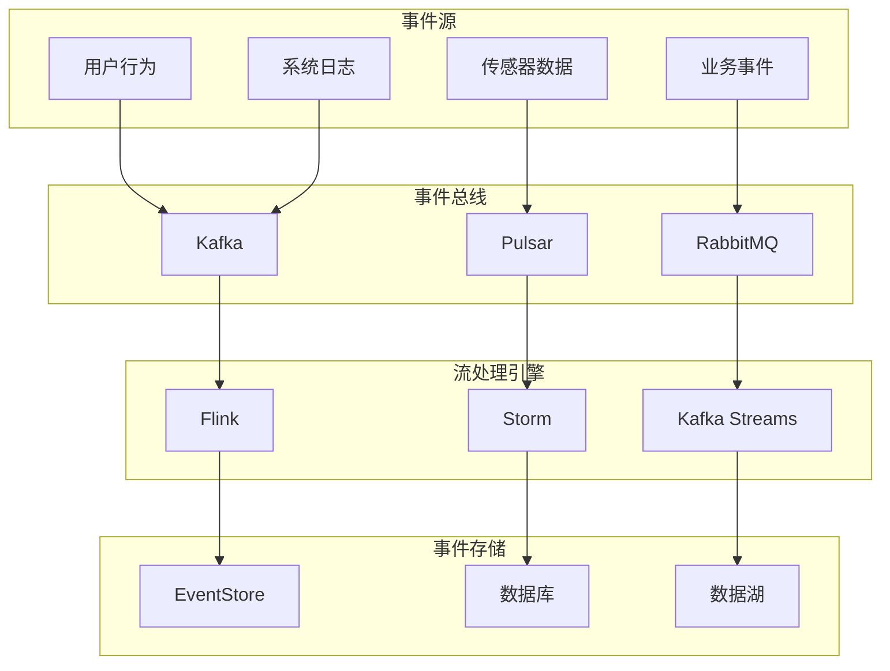

**CQRS + Event Sourcing架构**：
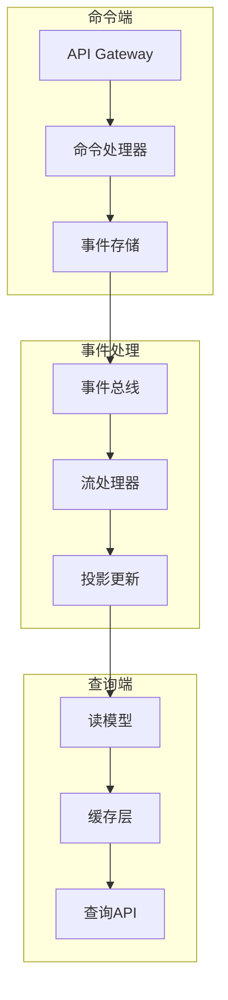

## 二、Flink核心架构深度解析

### 2.1 Flink集群架构

**Flink集群组件**：
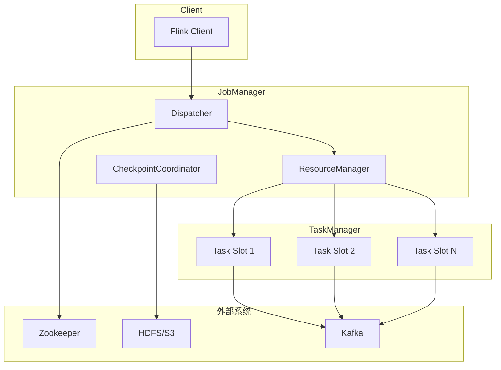

**核心组件详解**：

1. **JobManager**：
   - **Dispatcher**：接收作业提交，启动JobMaster
   - **ResourceManager**：管理TaskManager资源
   - **CheckpointCoordinator**：协调检查点操作

2. **TaskManager**：
   - **Task Slot**：资源分配单元
   - **Network Stack**：网络通信层
   - **State Backend**：状态存储后端

3. **Client**：
   - **作业提交**：将作业提交到集群
   - **作业监控**：监控作业执行状态

### 2.2 Flink作业执行流程

**作业提交流程**：
```java
// 1. 创建执行环境
StreamExecutionEnvironment env = StreamExecutionEnvironment.getExecutionEnvironment();

// 2. 设置并行度
env.setParallelism(4);

// 3. 定义数据流
DataStream<String> stream = env
    .addSource(new FlinkKafkaConsumer<>("topic", new SimpleStringSchema(), props))
    .map(new MyMapFunction())
    .keyBy(MyKeySelector::new)
    .window(TumblingEventTimeWindows.of(Time.minutes(5)))
    .process(new MyProcessWindowFunction());

// 4. 输出结果
stream.addSink(new FlinkKafkaProducer<>("output-topic", new SimpleStringSchema(), props));

// 5. 提交作业
env.execute("My Flink Job");
```

**作业执行阶段**：

1. **编译阶段**：
   - 生成StreamGraph
   - 优化为JobGraph
   - 序列化JobGraph

2. **提交阶段**：
   - 上传JobGraph到JobManager
   - 分配资源
   - 创建ExecutionGraph

3. **执行阶段**：
   - 部署Task到TaskManager
   - 启动Task执行
   - 监控执行状态

### 2.3 Flink内存管理

**内存模型**：
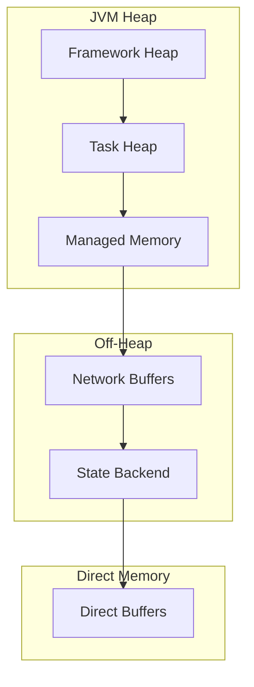

**内存配置优化**：
```bash
# TaskManager内存配置
export FLINK_TM_HEAP_MEMORY=4096m
export FLINK_TM_MANAGED_MEMORY_SIZE=1024m
export FLINK_TM_NETWORK_MEMORY_FRACTION=0.1

# JVM参数优化
export FLINK_ENV_JAVA_OPTS="-XX:+UseG1GC -XX:MaxGCPauseMillis=200 -XX:+UnlockExperimentalVMOptions"
```

## 三、Flink状态管理深度实战

### 3.1 状态类型详解

**1. Keyed State（键控状态）**：
```java
public class KeyedStateExample extends RichMapFunction<Event, String> {
    
    // ValueState：单个值状态
    private ValueState<Long> countState;
    
    // ListState：列表状态
    private ListState<String> listState;
    
    // MapState：映射状态
    private MapState<String, Long> mapState;
    
    // ReducingState：归约状态
    private ReducingState<Long> reducingState;
    
    // AggregatingState：聚合状态
    private AggregatingState<Event, String> aggregatingState;
    
    @Override
    public void open(Configuration parameters) {
        // 初始化ValueState
        ValueStateDescriptor<Long> countDescriptor = 
            new ValueStateDescriptor<>("count", Long.class);
        countState = getRuntimeContext().getState(countDescriptor);
        
        // 初始化ListState
        ListStateDescriptor<String> listDescriptor = 
            new ListStateDescriptor<>("list", String.class);
        listState = getRuntimeContext().getListState(listDescriptor);
        
        // 初始化MapState
        MapStateDescriptor<String, Long> mapDescriptor = 
            new MapStateDescriptor<>("map", String.class, Long.class);
        mapState = getRuntimeContext().getMapState(mapDescriptor);
        
        // 初始化ReducingState
        ReducingStateDescriptor<Long> reducingDescriptor = 
            new ReducingStateDescriptor<>("reducing", 
                (a, b) -> a + b, Long.class);
        reducingState = getRuntimeContext().getReducingState(reducingDescriptor);
        
        // 初始化AggregatingState
        AggregatingStateDescriptor<Event, Long, String> aggregatingDescriptor = 
            new AggregatingStateDescriptor<>("aggregating", 
                new MyAggregateFunction(), Long.class);
        aggregatingState = getRuntimeContext().getAggregatingState(aggregatingDescriptor);
    }
    
    @Override
    public String map(Event event) throws Exception {
        // 使用ValueState
        Long count = countState.value();
        if (count == null) {
            count = 0L;
        }
        count++;
        countState.update(count);
        
        // 使用ListState
        listState.add(event.getUserId());
        
        // 使用MapState
        mapState.put(event.getType(), count);
        
        // 使用ReducingState
        reducingState.add(1L);
        
        // 使用AggregatingState
        aggregatingState.add(event);
        
        return "Processed: " + event.getUserId() + ", Count: " + count;
    }
}
```

**2. Operator State（算子状态）**：
```java
public class OperatorStateExample extends RichMapFunction<Event, String> 
        implements CheckpointedFunction {
    
    private ListState<Event> bufferedElements;
    private List<Event> currentBuffer;
    
    @Override
    public void initializeState(FunctionInitializationContext context) throws Exception {
        // 初始化算子状态
        ListStateDescriptor<Event> descriptor = 
            new ListStateDescriptor<>("buffered-elements", Event.class);
        bufferedElements = context.getOperatorStateStore().getListState(descriptor);
        
        // 从检查点恢复状态
        if (context.isRestored()) {
            for (Event event : bufferedElements.get()) {
                currentBuffer.add(event);
            }
        }
    }
    
    @Override
    public void snapshotState(FunctionSnapshotContext context) throws Exception {
        // 保存状态到检查点
        bufferedElements.clear();
        for (Event event : currentBuffer) {
            bufferedElements.add(event);
        }
    }
    
    @Override
    public String map(Event event) throws Exception {
        currentBuffer.add(event);
        
        // 当缓冲区达到阈值时处理
        if (currentBuffer.size() >= 100) {
            String result = processBatch(currentBuffer);
            currentBuffer.clear();
            return result;
        }
        
        return "Buffered: " + event.getUserId();
    }
    
    private String processBatch(List<Event> events) {
        return "Processed batch of " + events.size() + " events";
    }
}
```

### 3.2 状态后端深度解析

**1. MemoryStateBackend**：
```java
// 内存状态后端配置
MemoryStateBackend memoryBackend = new MemoryStateBackend();
memoryBackend.setMaxStateSize(5 * 1024 * 1024); // 5MB

StreamExecutionEnvironment env = StreamExecutionEnvironment.getExecutionEnvironment();
env.setStateBackend(memoryBackend);
```

**2. FsStateBackend**：
```java
// 文件系统状态后端配置
FsStateBackend fsBackend = new FsStateBackend("hdfs://namenode:9000/flink/checkpoints");
fsBackend.setFileStateSizeThreshold(1024 * 1024); // 1MB

StreamExecutionEnvironment env = StreamExecutionEnvironment.getExecutionEnvironment();
env.setStateBackend(fsBackend);
```

**3. RocksDBStateBackend**：
```java
// RocksDB状态后端配置
RocksDBStateBackend rocksDBBackend = new RocksDBStateBackend("hdfs://namenode:9000/flink/checkpoints");
rocksDBBackend.setPredefinedOptions(PredefinedOptions.SPINNING_DISK_OPTIMIZED);
rocksDBBackend.setNumberOfTransferThreads(4);

StreamExecutionEnvironment env = StreamExecutionEnvironment.getExecutionEnvironment();
env.setStateBackend(rocksDBBackend);
```

**状态后端对比**：

| 状态后端 | 存储位置 | 容量限制 | 性能 | 适用场景 |
|----------|----------|----------|------|----------|
| MemoryStateBackend | JVM堆内存 | 小 | 快 | 开发测试 |
| FsStateBackend | 文件系统 | 大 | 中 | 生产环境 |
| RocksDBStateBackend | 本地磁盘+文件系统 | 很大 | 慢 | 大状态作业 |

### 3.3 状态TTL管理

**TTL配置示例**：
```java
public class TTLStateExample extends RichMapFunction<Event, String> {
    
    private ValueState<Long> countState;
    
    @Override
    public void open(Configuration parameters) {
        ValueStateDescriptor<Long> descriptor = 
            new ValueStateDescriptor<>("count", Long.class);
        
        // 配置TTL
        StateTtlConfig ttlConfig = StateTtlConfig
            .newBuilder(Time.hours(1))  // TTL时间
            .setUpdateType(StateTtlConfig.UpdateType.OnCreateAndWrite)  // 更新策略
            .setStateVisibility(StateTtlConfig.StateVisibility.NeverReturnExpired)  // 可见性
            .setTtlTimeCharacteristic(StateTtlConfig.TtlTimeCharacteristic.ProcessingTime)  // 时间特征
            .cleanupFullSnapshot()  // 清理策略
            .build();
        
        descriptor.enableTimeToLive(ttlConfig);
        countState = getRuntimeContext().getState(descriptor);
    }
    
    @Override
    public String map(Event event) throws Exception {
        Long count = countState.value();
        if (count == null) {
            count = 0L;
        }
        count++;
        countState.update(count);
        
        return "Count: " + count;
    }
}
```

## 四、Flink时间语义与Watermark

### 4.1 时间语义详解

**1. Event Time（事件时间）**：
```java
// 事件时间示例
public class EventTimeExample {
    
    public static void main(String[] args) throws Exception {
        StreamExecutionEnvironment env = StreamExecutionEnvironment.getExecutionEnvironment();
        
        // 设置时间特征为事件时间
        env.setStreamTimeCharacteristic(TimeCharacteristic.EventTime);
        
        DataStream<Event> stream = env
            .addSource(new EventSource())
            .assignTimestampsAndWatermarks(
                WatermarkStrategy.<Event>forBoundedOutOfOrderness(Duration.ofSeconds(5))
                    .withTimestampAssigner((event, timestamp) -> event.getTimestamp())
            )
            .keyBy(Event::getUserId)
            .window(TumblingEventTimeWindows.of(Time.minutes(5)))
            .process(new ProcessWindowFunction<Event, String, Long, TimeWindow>() {
                @Override
                public void process(Long key, Context ctx, 
                                  Iterable<Event> elements, 
                                  Collector<String> out) {
                    long count = 0;
                    for (Event event : elements) {
                        count++;
                    }
                    out.collect("User " + key + " processed " + count + " events");
                }
            });
        
        stream.print();
        env.execute("Event Time Example");
    }
}
```

**2. Processing Time（处理时间）**：
```java
// 处理时间示例
public class ProcessingTimeExample {
    
    public static void main(String[] args) throws Exception {
        StreamExecutionEnvironment env = StreamExecutionEnvironment.getExecutionEnvironment();
        
        // 设置时间特征为处理时间
        env.setStreamTimeCharacteristic(TimeCharacteristic.ProcessingTime);
        
        DataStream<Event> stream = env
            .addSource(new EventSource())
            .keyBy(Event::getUserId)
            .window(TumblingProcessingTimeWindows.of(Time.minutes(5)))
            .process(new ProcessWindowFunction<Event, String, Long, TimeWindow>() {
                @Override
                public void process(Long key, Context ctx, 
                                  Iterable<Event> elements, 
                                  Collector<String> out) {
                    long count = 0;
                    for (Event event : elements) {
                        count++;
                    }
                    out.collect("User " + key + " processed " + count + " events");
                }
            });
        
        stream.print();
        env.execute("Processing Time Example");
    }
}
```

**3. Ingestion Time（摄入时间）**：
```java
// 摄入时间示例
public class IngestionTimeExample {
    
    public static void main(String[] args) throws Exception {
        StreamExecutionEnvironment env = StreamExecutionEnvironment.getExecutionEnvironment();
        
        // 设置时间特征为摄入时间
        env.setStreamTimeCharacteristic(TimeCharacteristic.IngestionTime);
        
        DataStream<Event> stream = env
            .addSource(new EventSource())
            .keyBy(Event::getUserId)
            .window(TumblingIngestionTimeWindows.of(Time.minutes(5)))
            .process(new ProcessWindowFunction<Event, String, Long, TimeWindow>() {
                @Override
                public void process(Long key, Context ctx, 
                                  Iterable<Event> elements, 
                                  Collector<String> out) {
                    long count = 0;
                    for (Event event : elements) {
                        count++;
                    }
                    out.collect("User " + key + " processed " + count + " events");
                }
            });
        
        stream.print();
        env.execute("Ingestion Time Example");
    }
}
```

### 4.2 Watermark深度解析

**Watermark生成策略**：

**1. 固定延迟Watermark**：
```java
// 固定延迟Watermark
WatermarkStrategy<Event> watermarkStrategy = WatermarkStrategy
    .<Event>forBoundedOutOfOrderness(Duration.ofSeconds(5))
    .withTimestampAssigner((event, timestamp) -> event.getTimestamp());
```

**2. 自定义Watermark生成器**：
```java
// 自定义Watermark生成器
public class CustomWatermarkGenerator implements WatermarkGenerator<Event> {
    
    private final long maxOutOfOrderness = 5000; // 5秒
    private long currentMaxTimestamp;
    
    @Override
    public void onEvent(Event event, long eventTimestamp, WatermarkOutput output) {
        currentMaxTimestamp = Math.max(currentMaxTimestamp, eventTimestamp);
    }
    
    @Override
    public void onPeriodicEmit(WatermarkOutput output) {
        output.emitWatermark(new Watermark(currentMaxTimestamp - maxOutOfOrderness));
    }
}

// 使用自定义Watermark生成器
WatermarkStrategy<Event> customStrategy = WatermarkStrategy
    .<Event>forGenerator(ctx -> new CustomWatermarkGenerator())
    .withTimestampAssigner((event, timestamp) -> event.getTimestamp());
```

**3. 基于标记的Watermark**：
```java
// 基于标记的Watermark
public class PunctuatedWatermarkGenerator implements WatermarkGenerator<Event> {
    
    @Override
    public void onEvent(Event event, long eventTimestamp, WatermarkOutput output) {
        // 当事件包含特定标记时生成Watermark
        if (event.isWatermarkMarker()) {
            output.emitWatermark(new Watermark(eventTimestamp));
        }
    }
    
    @Override
    public void onPeriodicEmit(WatermarkOutput output) {
        // 不需要周期性生成
    }
}
```

### 4.3 窗口函数深度应用

**1. 滚动窗口**：
```java
// 滚动事件时间窗口
DataStream<String> tumblingWindow = stream
    .keyBy(Event::getUserId)
    .window(TumblingEventTimeWindows.of(Time.minutes(5)))
    .process(new ProcessWindowFunction<Event, String, Long, TimeWindow>() {
        @Override
        public void process(Long key, Context ctx, 
                          Iterable<Event> elements, 
                          Collector<String> out) {
            // 窗口处理逻辑
        }
    });
```

**2. 滑动窗口**：
```java
// 滑动事件时间窗口
DataStream<String> slidingWindow = stream
    .keyBy(Event::getUserId)
    .window(SlidingEventTimeWindows.of(Time.minutes(10), Time.minutes(5)))
    .process(new ProcessWindowFunction<Event, String, Long, TimeWindow>() {
        @Override
        public void process(Long key, Context ctx, 
                          Iterable<Event> elements, 
                          Collector<String> out) {
            // 窗口处理逻辑
        }
    });
```

**3. 会话窗口**：
```java
// 会话窗口
DataStream<String> sessionWindow = stream
    .keyBy(Event::getUserId)
    .window(EventTimeSessionWindows.withGap(Time.minutes(10)))
    .process(new ProcessWindowFunction<Event, String, Long, TimeWindow>() {
        @Override
        public void process(Long key, Context ctx, 
                          Iterable<Event> elements, 
                          Collector<String> out) {
            // 窗口处理逻辑
        }
    });
```

**4. 全局窗口**：
```java
// 全局窗口
DataStream<String> globalWindow = stream
    .keyBy(Event::getUserId)
    .window(GlobalWindows.create())
    .trigger(CountTrigger.of(100))  // 每100个元素触发一次
    .process(new ProcessWindowFunction<Event, String, Long, TimeWindow>() {
        @Override
        public void process(Long key, Context ctx, 
                          Iterable<Event> elements, 
                          Collector<String> out) {
            // 窗口处理逻辑
        }
    });
```

## 五、Flink检查点与容错机制

### 5.1 检查点机制深度解析

**检查点配置**：
```java
// 检查点配置
StreamExecutionEnvironment env = StreamExecutionEnvironment.getExecutionEnvironment();

// 启用检查点
env.enableCheckpointing(60000); // 60秒间隔

// 检查点配置
CheckpointConfig checkpointConfig = env.getCheckpointConfig();
checkpointConfig.setCheckpointingMode(CheckpointingMode.EXACTLY_ONCE);
checkpointConfig.setMinPauseBetweenCheckpoints(500);
checkpointConfig.setCheckpointTimeout(600000);
checkpointConfig.setMaxConcurrentCheckpoints(1);
checkpointConfig.setExternalizedCheckpointCleanup(CheckpointConfig.ExternalizedCheckpointCleanup.RETAIN_ON_CANCELLATION);

// 状态后端配置
env.setStateBackend(new FsStateBackend("hdfs://namenode:9000/flink/checkpoints"));

// 重启策略
env.setRestartStrategy(RestartStrategies.fixedDelayRestart(3, Time.of(10, TimeUnit.SECONDS)));
```

**检查点执行流程**：
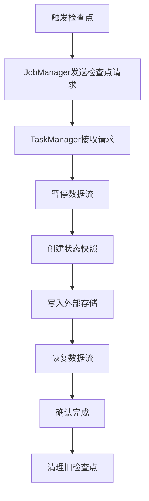

### 5.2 容错机制

**故障恢复策略**：
```java
// 1. 固定延迟重启策略
env.setRestartStrategy(RestartStrategies.fixedDelayRestart(
    3, // 最大重启次数
    Time.of(10, TimeUnit.SECONDS) // 重启间隔
));

// 2. 失败率重启策略
env.setRestartStrategy(RestartStrategies.failureRateRestart(
    3, // 失败率测量间隔内的最大失败次数
    Time.of(5, TimeUnit.MINUTES), // 失败率测量间隔
    Time.of(10, TimeUnit.SECONDS) // 重启间隔
));

// 3. 指数退避重启策略
env.setRestartStrategy(RestartStrategies.exponentialDelayRestart(
    Time.of(1, TimeUnit.SECONDS), // 初始重启间隔
    Time.of(60, TimeUnit.SECONDS), // 最大重启间隔
    2.0, // 退避因子
    Time.of(10, TimeUnit.MINUTES), // 重置间隔
    0.1 // 抖动因子
));
```

**端到端Exactly-Once保证**：
```java
// 1. Source端：Kafka Consumer
FlinkKafkaConsumer<String> kafkaSource = new FlinkKafkaConsumer<>(
    "input-topic",
    new SimpleStringSchema(),
    kafkaProps
);
kafkaSource.setStartFromLatest();
kafkaSource.setCommitOffsetsOnCheckpoints(true);

// 2. Sink端：Kafka Producer（两阶段提交）
FlinkKafkaProducer<String> kafkaSink = new FlinkKafkaProducer<>(
    "output-topic",
    new SimpleStringSchema(),
    kafkaProps,
    FlinkKafkaProducer.Semantic.EXACTLY_ONCE
);

// 3. 数据流处理
DataStream<String> stream = env
    .addSource(kafkaSource)
    .map(new MyMapFunction())
    .addSink(kafkaSink);
```

## 六、Flink性能优化深度策略

### 6.1 资源配置优化

**TaskManager配置**：
```bash
# TaskManager内存配置
export FLINK_TM_HEAP_MEMORY=8192m
export FLINK_TM_MANAGED_MEMORY_SIZE=2048m
export FLINK_TM_NETWORK_MEMORY_FRACTION=0.1
export FLINK_TM_NETWORK_MEMORY_MIN=256m
export FLINK_TM_NETWORK_MEMORY_MAX=2048m

# JVM参数优化
export FLINK_ENV_JAVA_OPTS="-XX:+UseG1GC \
-XX:MaxGCPauseMillis=200 \
-XX:+UnlockExperimentalVMOptions \
-XX:+UseCGroupMemoryLimitForHeap \
-XX:MaxDirectMemorySize=4096m"
```

**并行度优化**：
```java
// 1. 全局并行度设置
env.setParallelism(4);

// 2. 算子级别并行度设置
DataStream<String> stream = env
    .addSource(new MySource()).setParallelism(2)
    .map(new MyMapFunction()).setParallelism(4)
    .keyBy(MyKeySelector::new)
    .window(TumblingEventTimeWindows.of(Time.minutes(5)))
    .process(new MyProcessWindowFunction()).setParallelism(8)
    .addSink(new MySink()).setParallelism(2);

// 3. 动态并行度调整
env.setParallelism(4);
env.getConfig().setDynamicParallelism(true);
```

### 6.2 网络优化

**网络配置**：
```java
// 网络配置
env.getConfig().setNetworkBufferTimeout(1000);
env.getConfig().setBufferTimeout(100);

// 网络栈配置
env.getConfig().setNettyConfig(NettyConfig.builder()
    .setNumberOfArenas(4)
    .setNumberOfThreadsServer(4)
    .setNumberOfThreadsClient(4)
    .setServerThreadPriority(1)
    .setClientThreadPriority(1)
    .setServerConnectBacklog(1024)
    .setClientConnectTimeoutMs(30000)
    .setServerConnectTimeoutMs(30000)
    .setSendReceiveBufferSize(65536)
    .setTransportType(TransportType.NIO)
    .build());
```

**反压控制**：
```java
// 反压配置
env.getConfig().setLatencyTrackingInterval(1000);
env.getConfig().setLatencyTrackingEnabled(true);

// 网络缓冲区配置
env.getConfig().setNetworkBufferTimeout(1000);
env.getConfig().setBufferTimeout(100);
```

### 6.3 状态优化

**状态后端优化**：
```java
// RocksDB状态后端优化
RocksDBStateBackend rocksDBBackend = new RocksDBStateBackend("hdfs://namenode:9000/flink/checkpoints");
rocksDBBackend.setPredefinedOptions(PredefinedOptions.SPINNING_DISK_OPTIMIZED);
rocksDBBackend.setNumberOfTransferThreads(4);
rocksDBBackend.setNumberOfTransferingThreads(4);
rocksDBBackend.setNumberOfTransferingThreads(4);

// 状态TTL优化
StateTtlConfig ttlConfig = StateTtlConfig
    .newBuilder(Time.hours(1))
    .setUpdateType(StateTtlConfig.UpdateType.OnCreateAndWrite)
    .setStateVisibility(StateTtlConfig.StateVisibility.NeverReturnExpired)
    .setTtlTimeCharacteristic(StateTtlConfig.TtlTimeCharacteristic.ProcessingTime)
    .cleanupFullSnapshot()
    .build();
```

## 七、实时数据管道架构设计

### 7.1 实时ETL架构

**完整实时ETL管道**：
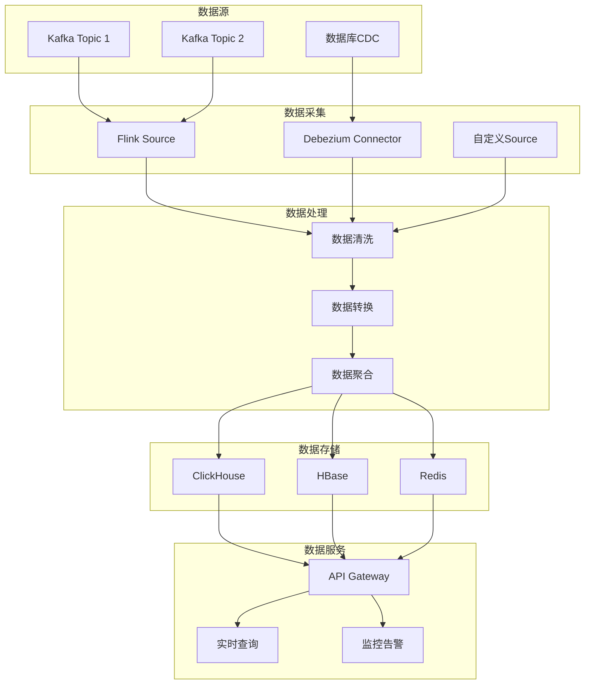

**实时ETL实现**：
```java
public class RealtimeETLPipeline {
    
    public static void main(String[] args) throws Exception {
        StreamExecutionEnvironment env = StreamExecutionEnvironment.getExecutionEnvironment();
        
        // 1. 数据源配置
        DataStream<RawEvent> rawStream = env
            .addSource(new FlinkKafkaConsumer<>("raw-events", new RawEventDeserializer(), kafkaProps))
            .name("Raw Event Source");
        
        // 2. 数据清洗
        DataStream<CleanEvent> cleanStream = rawStream
            .filter(new DataQualityFilter())
            .map(new DataCleaningFunction())
            .name("Data Cleaning");
        
        // 3. 数据转换
        DataStream<TransformedEvent> transformedStream = cleanStream
            .keyBy(CleanEvent::getUserId)
            .map(new DataTransformationFunction())
            .name("Data Transformation");
        
        // 4. 数据聚合
        DataStream<AggregatedEvent> aggregatedStream = transformedStream
            .keyBy(TransformedEvent::getUserId)
            .window(TumblingEventTimeWindows.of(Time.minutes(5)))
            .aggregate(new DataAggregationFunction())
            .name("Data Aggregation");
        
        // 5. 数据输出
        aggregatedStream
            .addSink(new ClickHouseSink())
            .name("ClickHouse Sink");
        
        aggregatedStream
            .addSink(new HBaseSink())
            .name("HBase Sink");
        
        aggregatedStream
            .addSink(new RedisSink())
            .name("Redis Sink");
        
        env.execute("Realtime ETL Pipeline");
    }
}
```

### 7.2 实时数据质量监控

**数据质量检查**：
```java
public class DataQualityMonitor extends RichMapFunction<RawEvent, CleanEvent> {
    
    private ValueState<Long> errorCount;
    private ValueState<Long> totalCount;
    
    @Override
    public void open(Configuration parameters) {
        ValueStateDescriptor<Long> errorDescriptor = 
            new ValueStateDescriptor<>("error-count", Long.class);
        errorCount = getRuntimeContext().getState(errorDescriptor);
        
        ValueStateDescriptor<Long> totalDescriptor = 
            new ValueStateDescriptor<>("total-count", Long.class);
        totalCount = getRuntimeContext().getState(totalDescriptor);
    }
    
    @Override
    public CleanEvent map(RawEvent event) throws Exception {
        // 更新计数
        Long total = totalCount.value();
        if (total == null) total = 0L;
        total++;
        totalCount.update(total);
        
        // 数据质量检查
        if (!isValidEvent(event)) {
            Long errors = errorCount.value();
            if (errors == null) errors = 0L;
            errors++;
            errorCount.update(errors);
            
            // 发送告警
            sendAlert("Data quality issue detected", event);
            return null;
        }
        
        return transformEvent(event);
    }
    
    private boolean isValidEvent(RawEvent event) {
        // 检查必填字段
        if (event.getUserId() == null || event.getTimestamp() == 0) {
            return false;
        }
        
        // 检查数据范围
        if (event.getAmount() < 0 || event.getAmount() > 1000000) {
            return false;
        }
        
        // 检查数据格式
        if (!event.getEmail().matches("^[\\w-\\.]+@([\\w-]+\\.)+[\\w-]{2,4}$")) {
            return false;
        }
        
        return true;
    }
}
```

## 八、Lambda与Kappa架构深度对比

### 8.1 Lambda架构详解

**Lambda架构组件**：
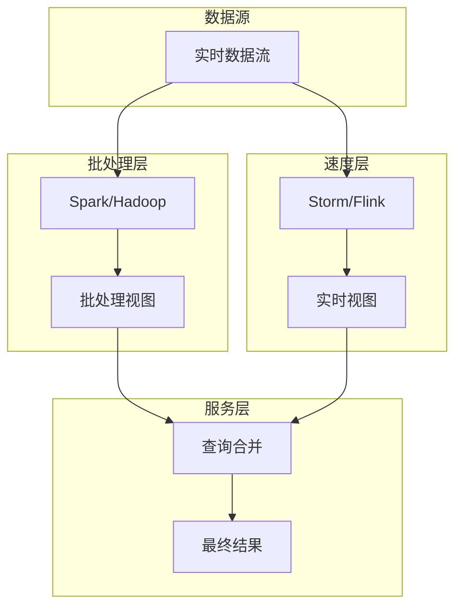

**Lambda架构实现**：
```java
// 批处理层实现
public class BatchLayer {
    
    public void processBatchData() {
        SparkSession spark = SparkSession.builder()
            .appName("Batch Processing")
            .getOrCreate();
        
        // 读取历史数据
        Dataset<Row> historicalData = spark.read()
            .format("parquet")
            .load("/data/historical");
        
        // 批处理计算
        Dataset<Row> batchView = historicalData
            .groupBy("user_id")
            .agg(
                count("event_id").as("event_count"),
                sum("amount").as("total_amount"),
                avg("amount").as("avg_amount")
            );
        
        // 保存批处理视图
        batchView.write()
            .mode(SaveMode.Overwrite)
            .parquet("/data/batch-view");
    }
}

// 速度层实现
public class SpeedLayer {
    
    public void processRealtimeData() throws Exception {
        StreamExecutionEnvironment env = StreamExecutionEnvironment.getExecutionEnvironment();
        
        DataStream<Event> stream = env
            .addSource(new FlinkKafkaConsumer<>("events", new EventDeserializer(), kafkaProps))
            .keyBy(Event::getUserId)
            .window(TumblingEventTimeWindows.of(Time.minutes(5)))
            .aggregate(new RealtimeAggregator());
        
        // 保存实时视图
        stream.addSink(new HBaseSink());
        
        env.execute("Speed Layer");
    }
}

// 服务层实现
public class ServingLayer {
    
    public String queryUserStats(String userId) {
        // 查询批处理视图
        BatchView batchView = batchViewService.getUserStats(userId);
        
        // 查询实时视图
        RealtimeView realtimeView = realtimeViewService.getUserStats(userId);
        
        // 合并结果
        return mergeViews(batchView, realtimeView);
    }
}
```

### 8.2 Kappa架构详解

**Kappa架构组件**：
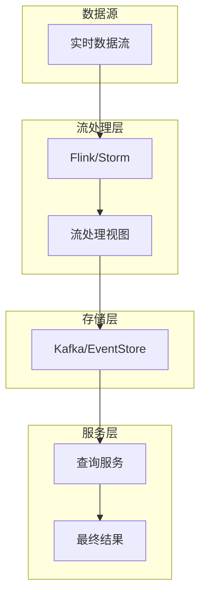

**Kappa架构实现**：
```java
public class KappaArchitecture {
    
    public void processData() throws Exception {
        StreamExecutionEnvironment env = StreamExecutionEnvironment.getExecutionEnvironment();
        
        // 1. 数据源
        DataStream<Event> stream = env
            .addSource(new FlinkKafkaConsumer<>("events", new EventDeserializer(), kafkaProps));
        
        // 2. 流处理
        DataStream<ProcessedEvent> processedStream = stream
            .keyBy(Event::getUserId)
            .window(TumblingEventTimeWindows.of(Time.minutes(5)))
            .process(new EventProcessor());
        
        // 3. 输出到存储
        processedStream.addSink(new KafkaSink<>("processed-events", new ProcessedEventSerializer(), kafkaProps));
        
        // 4. 历史数据重放
        if (needReplayHistory()) {
            replayHistoricalData();
        }
        
        env.execute("Kappa Architecture");
    }
    
    private void replayHistoricalData() throws Exception {
        // 重放历史数据
        StreamExecutionEnvironment replayEnv = StreamExecutionEnvironment.getExecutionEnvironment();
        
        DataStream<Event> historicalStream = replayEnv
            .addSource(new FlinkKafkaConsumer<>("historical-events", new EventDeserializer(), kafkaProps))
            .setStartFromEarliest();
        
        // 处理历史数据
        historicalStream
            .keyBy(Event::getUserId)
            .window(TumblingEventTimeWindows.of(Time.minutes(5)))
            .process(new EventProcessor())
            .addSink(new KafkaSink<>("processed-events", new ProcessedEventSerializer(), kafkaProps));
        
        replayEnv.execute("Historical Data Replay");
    }
}
```

### 8.3 架构对比分析

| 特性 | Lambda架构 | Kappa架构 |
|------|------------|-----------|
| **复杂度** | 高（两套代码） | 低（一套代码） |
| **准确性** | 高（批处理保证） | 中（依赖重放） |
| **实时性** | 中（批处理延迟） | 高（纯流处理） |
| **维护成本** | 高 | 低 |
| **存储成本** | 高（两套存储） | 低（一套存储） |
| **适用场景** | 对准确性要求高 | 对实时性要求高 |

## 九、实时OLAP系统设计

### 9.1 实时OLAP架构

**实时OLAP系统架构**：
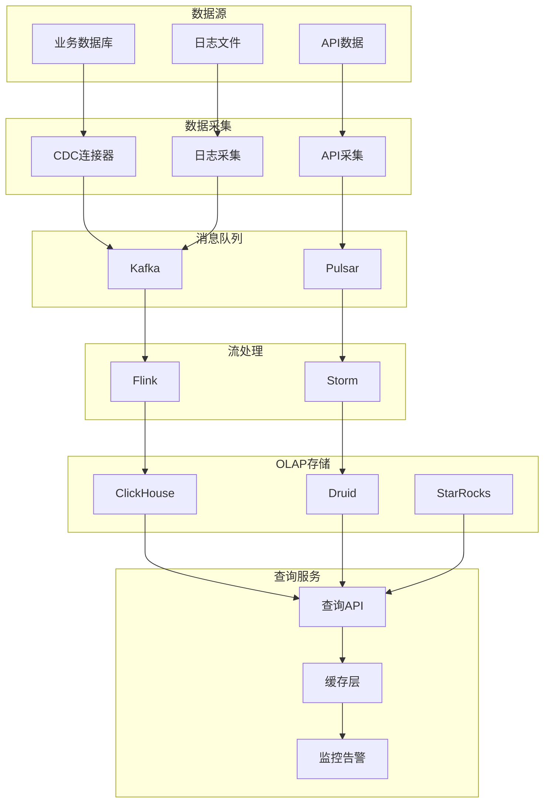

### 9.2 ClickHouse实时OLAP实现

**ClickHouse表设计**：
```sql
-- 创建实时OLAP表
CREATE TABLE realtime_events (
    event_time DateTime64(3),
    user_id UInt64,
    event_type String,
    amount Decimal(18, 2),
    properties Map(String, String),
    created_at DateTime64(3) DEFAULT now64()
) ENGINE = MergeTree()
PARTITION BY toYYYYMM(event_time)
ORDER BY (user_id, event_time)
TTL event_time + INTERVAL 30 DAY
SETTINGS index_granularity = 8192;

-- 创建物化视图
CREATE MATERIALIZED VIEW realtime_stats_mv
ENGINE = SummingMergeTree()
PARTITION BY toYYYYMM(event_time)
ORDER BY (user_id, toStartOfHour(event_time))
AS SELECT
    user_id,
    toStartOfHour(event_time) as hour,
    count() as event_count,
    sum(amount) as total_amount,
    uniqExact(event_type) as unique_event_types
FROM realtime_events
GROUP BY user_id, hour;
```

**Flink写入ClickHouse**：
```java
public class ClickHouseSink extends RichSinkFunction<Event> {
    
    private transient ClickHouseClient client;
    private transient ClickHouseConnection connection;
    
    @Override
    public void open(Configuration parameters) throws Exception {
        // 初始化ClickHouse连接
        ClickHouseProperties properties = new ClickHouseProperties();
        properties.setUser("default");
        properties.setPassword("");
        properties.setDatabase("default");
        
        client = ClickHouseClient.builder()
            .host("clickhouse-server")
            .port(8123)
            .properties(properties)
            .build();
        
        connection = client.connect();
    }
    
    @Override
    public void invoke(Event event, Context context) throws Exception {
        // 构建插入SQL
        String sql = "INSERT INTO realtime_events (event_time, user_id, event_type, amount, properties) VALUES (?, ?, ?, ?, ?)";
        
        try (PreparedStatement statement = connection.prepareStatement(sql)) {
            statement.setTimestamp(1, new Timestamp(event.getTimestamp()));
            statement.setLong(2, event.getUserId());
            statement.setString(3, event.getEventType());
            statement.setBigDecimal(4, event.getAmount());
            statement.setString(5, event.getProperties().toString());
            
            statement.executeUpdate();
        }
    }
    
    @Override
    public void close() throws Exception {
        if (connection != null) {
            connection.close();
        }
        if (client != null) {
            client.close();
        }
    }
}
```

### 9.3 实时查询优化

**查询优化策略**：
```java
@Service
public class RealtimeQueryService {
    
    @Autowired
    private ClickHouseTemplate clickHouseTemplate;
    
    @Autowired
    private RedisTemplate<String, Object> redisTemplate;
    
    public List<UserStats> getUserStats(String userId, String timeRange) {
        // 1. 检查缓存
        String cacheKey = "user_stats:" + userId + ":" + timeRange;
        List<UserStats> cachedResult = (List<UserStats>) redisTemplate.opsForValue().get(cacheKey);
        if (cachedResult != null) {
            return cachedResult;
        }
        
        // 2. 查询ClickHouse
        String sql = buildQuerySQL(userId, timeRange);
        List<UserStats> result = clickHouseTemplate.query(sql, new UserStatsRowMapper());
        
        // 3. 缓存结果
        redisTemplate.opsForValue().set(cacheKey, result, Duration.ofMinutes(5));
        
        return result;
    }
    
    private String buildQuerySQL(String userId, String timeRange) {
        StringBuilder sql = new StringBuilder();
        sql.append("SELECT ");
        sql.append("  user_id, ");
        sql.append("  toStartOfHour(event_time) as hour, ");
        sql.append("  count() as event_count, ");
        sql.append("  sum(amount) as total_amount, ");
        sql.append("  avg(amount) as avg_amount ");
        sql.append("FROM realtime_events ");
        sql.append("WHERE user_id = ").append(userId);
        
        if ("1h".equals(timeRange)) {
            sql.append(" AND event_time >= now() - INTERVAL 1 HOUR");
        } else if ("24h".equals(timeRange)) {
            sql.append(" AND event_time >= now() - INTERVAL 24 HOUR");
        } else if ("7d".equals(timeRange)) {
            sql.append(" AND event_time >= now() - INTERVAL 7 DAY");
        }
        
        sql.append(" GROUP BY user_id, hour ");
        sql.append(" ORDER BY hour DESC");
        
        return sql.toString();
    }
}
```

## 十、生产级实时计算平台

### 10.1 平台架构设计

**实时计算平台架构**：
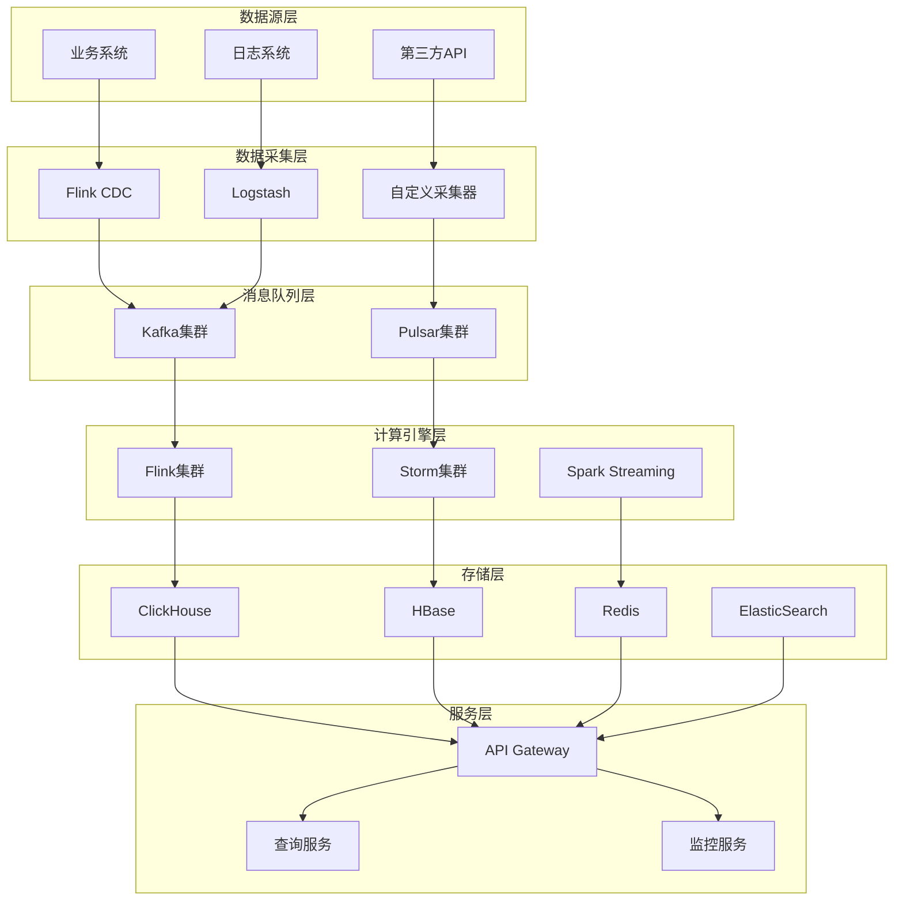

### 10.2 作业管理平台

**作业管理服务**：
```java
@Service
public class JobManagementService {
    
    @Autowired
    private FlinkClusterClient clusterClient;
    
    @Autowired
    private JobTemplateService jobTemplateService;
    
    public String submitJob(JobSubmissionRequest request) {
        try {
            // 1. 验证作业配置
            validateJobConfig(request);
            
            // 2. 生成作业JAR
            String jarPath = buildJobJar(request);
            
            // 3. 提交作业到Flink集群
            JobSubmissionResult result = clusterClient.submitJob(
                jarPath,
                request.getMainClass(),
                request.getArgs()
            );
            
            // 4. 保存作业信息
            saveJobInfo(request, result);
            
            return result.getJobId();
            
        } catch (Exception e) {
            log.error("Failed to submit job", e);
            throw new JobSubmissionException("Job submission failed", e);
        }
    }
    
    public JobStatus getJobStatus(String jobId) {
        try {
            return clusterClient.getJobStatus(jobId);
        } catch (Exception e) {
            log.error("Failed to get job status for job: {}", jobId, e);
            throw new JobStatusException("Failed to get job status", e);
        }
    }
    
    public void cancelJob(String jobId) {
        try {
            clusterClient.cancelJob(jobId);
            updateJobStatus(jobId, JobStatus.CANCELLED);
        } catch (Exception e) {
            log.error("Failed to cancel job: {}", jobId, e);
            throw new JobCancellationException("Failed to cancel job", e);
        }
    }
    
    private void validateJobConfig(JobSubmissionRequest request) {
        // 验证作业配置
        if (request.getMainClass() == null || request.getMainClass().isEmpty()) {
            throw new IllegalArgumentException("Main class is required");
        }
        
        if (request.getParallelism() <= 0) {
            throw new IllegalArgumentException("Parallelism must be positive");
        }
        
        if (request.getMemory() <= 0) {
            throw new IllegalArgumentException("Memory must be positive");
        }
    }
}
```

### 10.3 监控告警系统

**监控指标收集**：
```java
@Component
public class FlinkMetricsCollector {
    
    @Autowired
    private MeterRegistry meterRegistry;
    
    @Scheduled(fixedRate = 30000)
    public void collectMetrics() {
        try {
            // 1. 收集集群指标
            collectClusterMetrics();
            
            // 2. 收集作业指标
            collectJobMetrics();
            
            // 3. 收集TaskManager指标
            collectTaskManagerMetrics();
            
        } catch (Exception e) {
            log.error("Error collecting Flink metrics", e);
        }
    }
    
    private void collectClusterMetrics() {
        try {
            // 获取集群信息
            ClusterOverview clusterOverview = flinkClient.getClusterOverview();
            
            // 记录指标
            Gauge.builder("flink.cluster.taskmanagers")
                .register(meterRegistry, () -> clusterOverview.getNumTaskManagersConnected());
            
            Gauge.builder("flink.cluster.slots")
                .register(meterRegistry, () -> clusterOverview.getNumSlotsTotal());
            
            Gauge.builder("flink.cluster.available_slots")
                .register(meterRegistry, () -> clusterOverview.getNumSlotsAvailable());
            
        } catch (Exception e) {
            log.error("Error collecting cluster metrics", e);
        }
    }
    
    private void collectJobMetrics() {
        try {
            // 获取作业列表
            List<JobInfo> jobs = flinkClient.getJobs();
            
            for (JobInfo job : jobs) {
                String jobId = job.getJobId();
                JobDetails jobDetails = flinkClient.getJobDetails(jobId);
                
                // 记录作业指标
                Gauge.builder("flink.job.uptime")
                    .tag("job_id", jobId)
                    .tag("job_name", job.getName())
                    .register(meterRegistry, () -> jobDetails.getDuration());
                
                Gauge.builder("flink.job.parallelism")
                    .tag("job_id", jobId)
                    .tag("job_name", job.getName())
                    .register(meterRegistry, () -> jobDetails.getParallelism());
                
                // 检查作业状态
                if (job.getState() == JobStatus.FAILED) {
                    // 发送告警
                    alertService.sendAlert("Flink Job Failed", 
                        "Job " + job.getName() + " has failed");
                }
            }
            
        } catch (Exception e) {
            log.error("Error collecting job metrics", e);
        }
    }
}
```

## 十一、实时计算监控与运维

### 11.1 监控体系设计

**监控架构**：
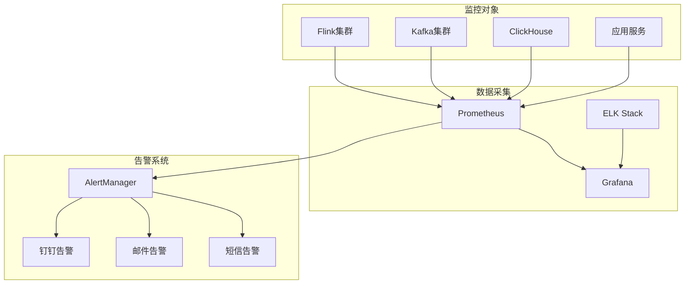

### 11.2 告警规则配置

**Prometheus告警规则**：
```yaml
# flink_rules.yml
groups:
- name: flink.rules
  rules:
  - alert: FlinkJobFailed
    expr: flink_job_status{status="FAILED"} == 1
    for: 0m
    labels:
      severity: critical
    annotations:
      summary: "Flink job has failed"
      description: "Flink job {{ $labels.job_name }} has failed"
  
  - alert: FlinkJobRunningTooLong
    expr: time() - flink_job_start_time > 3600
    for: 5m
    labels:
      severity: warning
    annotations:
      summary: "Flink job running too long"
      description: "Flink job {{ $labels.job_name }} has been running for more than 1 hour"
  
  - alert: FlinkTaskManagerDown
    expr: flink_taskmanager_status == 0
    for: 1m
    labels:
      severity: critical
    annotations:
      summary: "Flink TaskManager is down"
      description: "Flink TaskManager {{ $labels.instance }} is down"
  
  - alert: FlinkHighMemoryUsage
    expr: flink_taskmanager_memory_used / flink_taskmanager_memory_total > 0.9
    for: 5m
    labels:
      severity: warning
    annotations:
      summary: "Flink TaskManager high memory usage"
      description: "Flink TaskManager {{ $labels.instance }} memory usage is above 90%"
```

### 11.3 运维自动化

**自动扩缩容**：
```java
@Component
public class AutoScalingService {
    
    @Autowired
    private FlinkClusterClient clusterClient;
    
    @Autowired
    private MetricsService metricsService;
    
    @Scheduled(fixedRate = 60000) // 每分钟检查一次
    public void checkAndScale() {
        try {
            // 1. 获取集群指标
            ClusterMetrics metrics = metricsService.getClusterMetrics();
            
            // 2. 检查是否需要扩容
            if (shouldScaleOut(metrics)) {
                scaleOut();
            }
            
            // 3. 检查是否需要缩容
            if (shouldScaleIn(metrics)) {
                scaleIn();
            }
            
        } catch (Exception e) {
            log.error("Error in auto scaling", e);
        }
    }
    
    private boolean shouldScaleOut(ClusterMetrics metrics) {
        // 检查CPU使用率
        if (metrics.getCpuUsage() > 80) {
            return true;
        }
        
        // 检查内存使用率
        if (metrics.getMemoryUsage() > 85) {
            return true;
        }
        
        // 检查队列长度
        if (metrics.getQueueLength() > 1000) {
            return true;
        }
        
        return false;
    }
    
    private boolean shouldScaleIn(ClusterMetrics metrics) {
        // 检查CPU使用率
        if (metrics.getCpuUsage() < 30) {
            return true;
        }
        
        // 检查内存使用率
        if (metrics.getMemoryUsage() < 40) {
            return true;
        }
        
        // 检查队列长度
        if (metrics.getQueueLength() < 100) {
            return true;
        }
        
        return false;
    }
    
    private void scaleOut() {
        try {
            // 启动新的TaskManager
            clusterClient.startTaskManager();
            log.info("Scaled out: started new TaskManager");
        } catch (Exception e) {
            log.error("Failed to scale out", e);
        }
    }
    
    private void scaleIn() {
        try {
            // 停止一个TaskManager
            clusterClient.stopTaskManager();
            log.info("Scaled in: stopped TaskManager");
        } catch (Exception e) {
            log.error("Failed to scale in", e);
        }
    }
}
```

## 十二、高频面试题深度解析

### 12.1 架构设计类

**Q1：如何设计一个支持千万级QPS的实时计算系统？**

**答案要点**：
1. **分层架构**：数据采集层、消息队列层、计算层、存储层、服务层
2. **水平扩展**：支持动态扩缩容
3. **容错机制**：检查点、重启策略、数据备份
4. **性能优化**：内存管理、网络优化、状态优化
5. **监控告警**：全方位监控、自动告警

**Q2：Flink如何保证Exactly-Once语义？**

**答案要点**：
1. **Source端**：可重放的数据源（如Kafka）
2. **Process端**：检查点机制保存状态
3. **Sink端**：两阶段提交（2PC）
4. **端到端**：整个数据流的一致性保证

### 12.2 性能优化类

**Q3：如何优化Flink作业性能？**

**答案要点**：
1. **资源配置**：合理设置并行度、内存配置
2. **网络优化**：网络缓冲区、反压控制
3. **状态优化**：状态后端选择、TTL配置
4. **数据倾斜**：数据分区、负载均衡
5. **检查点优化**：检查点间隔、状态大小

**Q4：如何处理Flink作业的数据倾斜？**

**答案要点**：
1. **数据分区**：使用自定义分区器
2. **负载均衡**：动态调整并行度
3. **数据预处理**：数据清洗、去重
4. **算法优化**：使用更高效的算法
5. **监控调优**：实时监控、动态调整

### 12.3 故障处理类

**Q5：Flink作业失败如何排查？**

**答案要点**：
1. **日志分析**：查看TaskManager和JobManager日志
2. **指标监控**：检查CPU、内存、网络指标
3. **检查点分析**：检查检查点是否正常
4. **数据源检查**：检查Kafka等数据源状态
5. **网络检查**：检查网络连接和延迟

**Q6：如何设计实时计算系统的容错机制？**

**答案要点**：
1. **检查点机制**：定期保存状态
2. **重启策略**：自动重启失败的任务
3. **数据备份**：多副本存储
4. **监控告警**：实时监控系统状态
5. **故障转移**：自动切换到备用系统

### 12.4 技术选型类

**Q7：如何选择实时计算框架？**

**答案要点**：
1. **业务需求**：延迟要求、吞吐量要求
2. **技术栈**：现有技术栈、团队技能
3. **性能对比**：延迟、吞吐量、容错能力
4. **生态支持**：社区活跃度、文档完善度
5. **成本考虑**：开发成本、运维成本

**Q8：Lambda架构和Kappa架构如何选择？**

**答案要点**：
1. **Lambda架构**：适合对准确性要求高的场景
2. **Kappa架构**：适合对实时性要求高的场景
3. **复杂度**：Lambda架构复杂度高，Kappa架构简洁
4. **维护成本**：Lambda架构维护成本高
5. **存储成本**：Lambda架构存储成本高

---

**关键字**：Flink、实时计算、流处理、Watermark、Checkpoint、状态管理、性能优化、监控运维、Lambda架构、Kappa架构、OLAP、容错机制

