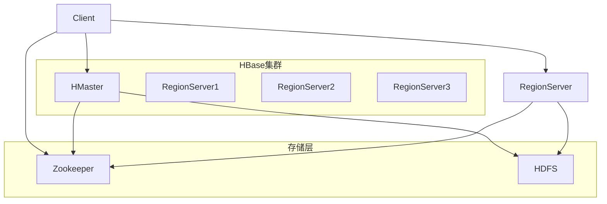
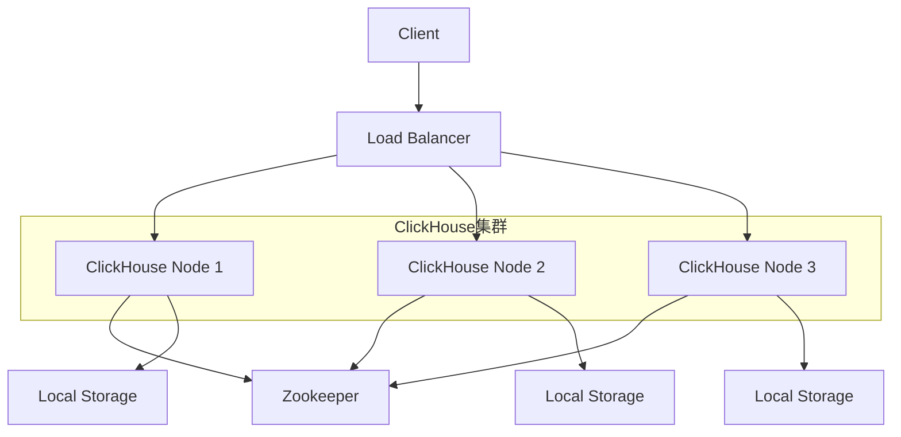
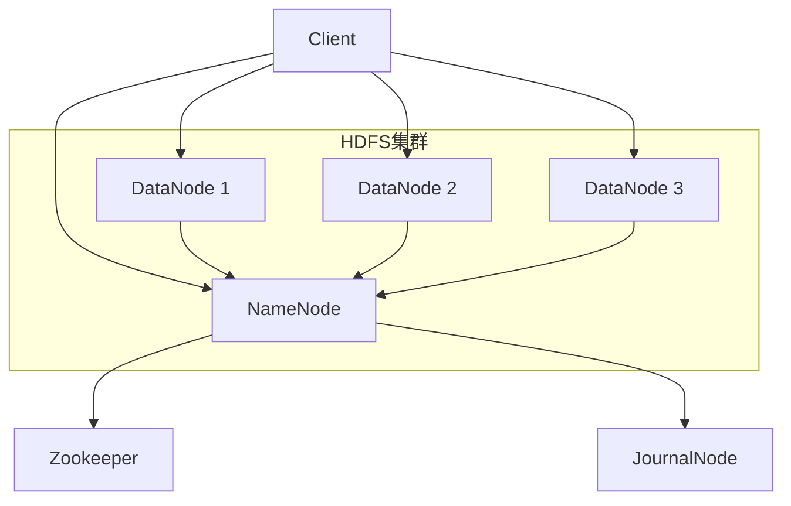

# 大数据存储深度解析

## 目录
- [一、HBase深度解析](#一hbase深度解析)
- [二、ClickHouse生产实践](#二clickhouse生产实践)
- [三、HDFS架构与优化](#三hdfs架构与优化)
- [四、列式存储原理](#四列式存储原理)
- [五、数据分区策略设计](#五数据分区策略设计)
- [六、存储引擎对比](#六存储引擎对比)
- [七、性能优化实战](#七性能优化实战)
- [八、生产环境部署](#八生产环境部署)
- [九、监控与运维](#九监控与运维)
- [十、高频面试题](#十高频面试题)

## 一、HBase深度解析

### 1.1 核心架构设计

HBase是一个分布式、面向列的NoSQL数据库，基于Google Bigtable设计，运行在HDFS之上。

#### 1.1.1 整体架构



#### 1.1.2 核心组件详解

**HMaster**：
- 管理元数据（表结构、Region分布）
- 负责Region的分配和负载均衡
- 处理DDL操作（创建/删除表）
- 监控RegionServer状态

**RegionServer**：
- 存储实际数据
- 处理读写请求
- 管理Region的Split和Compact
- 维护WAL（Write-Ahead Log）

**Region**：
- 数据分片的基本单位
- 每个Region包含一个或多个列族
- 默认大小：10GB
- 支持动态分裂

**Store**：
- 对应一个列族
- 包含MemStore和HFile
- 负责数据的写入和读取

#### 1.1.3 数据存储层次

```
Table
├── Region1
│   ├── Store1 (ColumnFamily1)
│   │   ├── MemStore (内存)
│   │   └── HFile1, HFile2, ... (磁盘)
│   └── Store2 (ColumnFamily2)
└── Region2
    └── Store1 (ColumnFamily1)
```

### 1.2 数据模型深度解析

#### 1.2.1 四维数据模型

HBase的数据模型是四维的：RowKey + ColumnFamily + ColumnQualifier + Timestamp

```
RowKey | ColumnFamily:ColumnQualifier | Timestamp | Value
user001 | info:name | 1640995200000 | John
user001 | info:age  | 1640995200000 | 30
user001 | info:city | 1640995200000 | Beijing
user001 | order:orderId | 1640995200000 | order001
user001 | order:amount | 1640995200000 | 299.99
```

#### 1.2.2 数据版本管理

```java
// 多版本数据示例
public class HBaseVersionExample {
    
    public void putWithVersion(String tableName, String rowKey, 
                              String family, String qualifier, 
                              String value, long timestamp) throws IOException {
        Table table = connection.getTable(TableName.valueOf(tableName));
        Put put = new Put(Bytes.toBytes(rowKey));
        put.addColumn(
            Bytes.toBytes(family),
            Bytes.toBytes(qualifier),
            timestamp,  // 指定时间戳
            Bytes.toBytes(value)
        );
        table.put(put);
        table.close();
    }
    
    public List<String> getVersions(String tableName, String rowKey, 
                                   String family, String qualifier, 
                                   int maxVersions) throws IOException {
        Table table = connection.getTable(TableName.valueOf(tableName));
        Get get = new Get(Bytes.toBytes(rowKey));
        get.addColumn(Bytes.toBytes(family), Bytes.toBytes(qualifier));
        get.setMaxVersions(maxVersions);  // 获取多个版本
        
        Result result = table.get(get);
        List<String> versions = new ArrayList<>();
        
        for (Cell cell : result.getColumnCells(Bytes.toBytes(family), Bytes.toBytes(qualifier))) {
            versions.add(Bytes.toString(CellUtil.cloneValue(cell)));
        }
        
        table.close();
        return versions;
    }
}
```

### 1.3 生产级Java API实现

#### 1.3.1 连接池管理

```java
@Component
@ConfigurationProperties(prefix = "hbase")
public class HBaseConfig {
    
    private String zookeeperQuorum = "localhost:2181";
    private int zookeeperPort = 2181;
    private String zookeeperParent = "/hbase";
    private int maxRetries = 3;
    private int timeout = 30000;
    
    @Bean
    public Connection hbaseConnection() throws IOException {
        Configuration config = HBaseConfiguration.create();
        config.set("hbase.zookeeper.quorum", zookeeperQuorum);
        config.set("hbase.zookeeper.property.clientPort", String.valueOf(zookeeperPort));
        config.set("zookeeper.znode.parent", zookeeperParent);
        config.set("hbase.client.retries.number", String.valueOf(maxRetries));
        config.set("hbase.rpc.timeout", String.valueOf(timeout));
        
        return ConnectionFactory.createConnection(config);
    }
}
```

#### 1.3.2 高级CRUD操作

```java
@Service
@Slf4j
public class HBaseService {
    
    @Autowired
    private Connection connection;
    
    private final ObjectMapper objectMapper = new ObjectMapper();
    
    /**
     * 批量写入数据
     */
    public void batchPut(String tableName, List<Put> puts) throws IOException {
        Table table = connection.getTable(TableName.valueOf(tableName));
        try {
            // 设置批量写入缓冲区大小
            table.setWriteBufferSize(1024 * 1024 * 8);  // 8MB
            table.setAutoFlush(false);
            
            // 批量写入
            table.put(puts);
            table.flushCommits();
            
            log.info("批量写入完成，数据量: {}", puts.size());
        } finally {
            table.close();
        }
    }
    
    /**
     * 条件查询
     */
    public List<Result> scanWithFilter(String tableName, String startRow, 
                                      String stopRow, Filter filter) throws IOException {
        Table table = connection.getTable(TableName.valueOf(tableName));
        List<Result> results = new ArrayList<>();
        
        try {
            Scan scan = new Scan();
            scan.setStartRow(Bytes.toBytes(startRow));
            scan.setStopRow(Bytes.toBytes(stopRow));
            scan.setFilter(filter);
            scan.setCaching(1000);  // 设置缓存大小
            scan.setBatch(100);     // 设置批量大小
            
            ResultScanner scanner = table.getScanner(scan);
            for (Result result : scanner) {
                results.add(result);
            }
            scanner.close();
            
        } finally {
            table.close();
        }
        
        return results;
    }
    
    /**
     * 原子性操作
     */
    public boolean checkAndPut(String tableName, String rowKey, 
                              String family, String qualifier, 
                              String expectedValue, Put put) throws IOException {
        Table table = connection.getTable(TableName.valueOf(tableName));
        try {
            return table.checkAndPut(
                Bytes.toBytes(rowKey),
                Bytes.toBytes(family),
                Bytes.toBytes(qualifier),
                Bytes.toBytes(expectedValue),
                put
            );
        } finally {
            table.close();
        }
    }
    
    /**
     * 计数器操作
     */
    public long increment(String tableName, String rowKey, 
                         String family, String qualifier, 
                         long amount) throws IOException {
        Table table = connection.getTable(TableName.valueOf(tableName));
        try {
            Increment increment = new Increment(Bytes.toBytes(rowKey));
            increment.addColumn(Bytes.toBytes(family), Bytes.toBytes(qualifier), amount);
            
            Result result = table.increment(increment);
            return Bytes.toLong(result.getValue(Bytes.toBytes(family), Bytes.toBytes(qualifier)));
        } finally {
            table.close();
        }
    }
}
```

#### 1.3.3 高级过滤器使用

```java
@Component
public class HBaseFilterService {
    
    @Autowired
    private HBaseService hbaseService;
    
    /**
     * 前缀过滤器
     */
    public List<Result> scanByPrefix(String tableName, String prefix) throws IOException {
        Filter prefixFilter = new PrefixFilter(Bytes.toBytes(prefix));
        return hbaseService.scanWithFilter(tableName, prefix, prefix + "~", prefixFilter);
    }
    
    /**
     * 值过滤器
     */
    public List<Result> scanByValue(String tableName, String family, 
                                   String qualifier, String value) throws IOException {
        Filter valueFilter = new ValueFilter(CompareOp.EQUAL, new BinaryComparator(Bytes.toBytes(value)));
        return hbaseService.scanWithFilter(tableName, "", "~", valueFilter);
    }
    
    /**
     * 复合过滤器
     */
    public List<Result> scanWithMultipleFilters(String tableName, 
                                               String family, String qualifier, 
                                               String value, long minTimestamp) throws IOException {
        FilterList filterList = new FilterList(FilterList.Operator.MUST_PASS_ALL);
        
        // 列值过滤器
        filterList.addFilter(new SingleColumnValueFilter(
            Bytes.toBytes(family),
            Bytes.toBytes(qualifier),
            CompareOp.EQUAL,
            Bytes.toBytes(value)
        ));
        
        // 时间戳过滤器
        filterList.addFilter(new TimestampsFilter(Arrays.asList(minTimestamp)));
        
        return hbaseService.scanWithFilter(tableName, "", "~", filterList);
    }
}
```

### 1.4 RowKey设计最佳实践

#### 1.4.1 RowKey设计原则

1. **唯一性**：确保每个RowKey唯一
2. **散列性**：避免热点问题
3. **长度适中**：建议10-100字节
4. **可读性**：便于调试和维护
5. **有序性**：支持范围查询

#### 1.4.2 常见RowKey设计模式

```java
public class RowKeyDesignPatterns {
    
    /**
     * 反转时间戳模式
     * 适用场景：按时间倒序查询
     */
    public String reverseTimestampPattern(String userId, long timestamp) {
        long reverseTimestamp = Long.MAX_VALUE - timestamp;
        return userId + "_" + reverseTimestamp;
    }
    
    /**
     * Hash前缀模式
     * 适用场景：避免热点，均匀分布
     */
    public String hashPrefixPattern(String userId, long timestamp) {
        int hashPrefix = Math.abs(userId.hashCode()) % 100;
        return String.format("%02d_%s_%d", hashPrefix, userId, timestamp);
    }
    
    /**
     * 盐值模式
     * 适用场景：进一步分散热点
     */
    public String saltPattern(String userId, long timestamp, int saltCount) {
        int salt = Math.abs(userId.hashCode()) % saltCount;
        return salt + "_" + userId + "_" + timestamp;
    }
    
    /**
     * 组合键模式
     * 适用场景：多维度查询
     */
    public String compositeKeyPattern(String region, String userId, String type, long timestamp) {
        return region + "_" + userId + "_" + type + "_" + timestamp;
    }
    
    /**
     * 变长RowKey模式
     * 适用场景：节省存储空间
     */
    public String variableLengthPattern(String userId, long timestamp) {
        // 使用变长编码
        byte[] userIdBytes = Bytes.toBytes(userId);
        byte[] timestampBytes = Bytes.toBytes(timestamp);
        
        ByteBuffer buffer = ByteBuffer.allocate(userIdBytes.length + timestampBytes.length + 1);
        buffer.put((byte) userIdBytes.length);  // 长度前缀
        buffer.put(userIdBytes);
        buffer.put(timestampBytes);
        
        return Bytes.toString(buffer.array());
    }
}
```

#### 1.4.3 RowKey设计案例分析

**案例1：用户行为数据存储**

```java
public class UserBehaviorRowKey {
    
    /**
     * 用户行为数据RowKey设计
     * 格式：hash(userId)_userId_timestamp_actionType
     */
    public String createUserBehaviorRowKey(String userId, long timestamp, String actionType) {
        // 使用MD5哈希的前4位作为前缀，分散热点
        String hashPrefix = DigestUtils.md5Hex(userId).substring(0, 4);
        return String.format("%s_%s_%d_%s", hashPrefix, userId, timestamp, actionType);
    }
    
    /**
     * 解析RowKey获取用户ID
     */
    public String extractUserId(String rowKey) {
        String[] parts = rowKey.split("_");
        return parts[1];  // 第二部分是userId
    }
    
    /**
     * 生成时间范围查询的起始RowKey
     */
    public String getStartRowKey(String userId, long startTimestamp) {
        String hashPrefix = DigestUtils.md5Hex(userId).substring(0, 4);
        return String.format("%s_%s_%d_", hashPrefix, userId, startTimestamp);
    }
    
    public String getStopRowKey(String userId, long endTimestamp) {
        String hashPrefix = DigestUtils.md5Hex(userId).substring(0, 4);
        return String.format("%s_%s_%d_~", hashPrefix, userId, endTimestamp);
    }
}
```

### 1.5 HBase性能优化

#### 1.5.1 写入性能优化

```java
@Component
public class HBaseWriteOptimizer {
    
    @Autowired
    private Connection connection;
    
    /**
     * 批量写入优化
     */
    public void optimizedBatchWrite(String tableName, List<Put> puts) throws IOException {
        Table table = connection.getTable(TableName.valueOf(tableName));
        
        try {
            // 设置写入缓冲区
            table.setWriteBufferSize(1024 * 1024 * 16);  // 16MB
            table.setAutoFlush(false);
            
            // 分批写入，避免内存溢出
            int batchSize = 1000;
            for (int i = 0; i < puts.size(); i += batchSize) {
                int endIndex = Math.min(i + batchSize, puts.size());
                List<Put> batch = puts.subList(i, endIndex);
                
                table.put(batch);
                table.flushCommits();
                
                log.info("批量写入进度: {}/{}", endIndex, puts.size());
            }
            
        } finally {
            table.close();
        }
    }
    
    /**
     * 异步写入
     */
    public CompletableFuture<Void> asyncWrite(String tableName, List<Put> puts) {
        return CompletableFuture.runAsync(() -> {
            try {
                optimizedBatchWrite(tableName, puts);
            } catch (IOException e) {
                log.error("异步写入失败", e);
                throw new RuntimeException(e);
            }
        });
    }
    
    /**
     * 写入性能监控
     */
    public void writeWithMonitoring(String tableName, List<Put> puts) throws IOException {
        long startTime = System.currentTimeMillis();
        
        try {
            optimizedBatchWrite(tableName, puts);
        } finally {
            long duration = System.currentTimeMillis() - startTime;
            double throughput = (double) puts.size() / duration * 1000;  // 每秒写入数
            
            log.info("写入性能统计 - 数据量: {}, 耗时: {}ms, 吞吐量: {:.2f} ops/s", 
                    puts.size(), duration, throughput);
        }
    }
}
```

#### 1.5.2 读取性能优化

```java
@Component
public class HBaseReadOptimizer {
    
    @Autowired
    private Connection connection;
    
    /**
     * 批量读取优化
     */
    public List<Result> batchGet(String tableName, List<Get> gets) throws IOException {
        Table table = connection.getTable(TableName.valueOf(tableName));
        
        try {
            // 设置批量大小
            int batchSize = 100;
            List<Result> allResults = new ArrayList<>();
            
            for (int i = 0; i < gets.size(); i += batchSize) {
                int endIndex = Math.min(i + batchSize, gets.size());
                List<Get> batch = gets.subList(i, endIndex);
                
                Result[] results = table.get(batch);
                allResults.addAll(Arrays.asList(results));
            }
            
            return allResults;
        } finally {
            table.close();
        }
    }
    
    /**
     * 扫描优化
     */
    public List<Result> optimizedScan(String tableName, String startRow, String stopRow) throws IOException {
        Table table = connection.getTable(TableName.valueOf(tableName));
        
        try {
            Scan scan = new Scan();
            scan.setStartRow(Bytes.toBytes(startRow));
            scan.setStopRow(Bytes.toBytes(stopRow));
            
            // 性能优化参数
            scan.setCaching(1000);        // 客户端缓存
            scan.setBatch(100);           // 批量大小
            scan.setMaxResultSize(1024 * 1024 * 10);  // 最大结果大小
            scan.setCacheBlocks(false);   // 不缓存块
            
            // 只读取需要的列
            scan.addFamily(Bytes.toBytes("info"));
            scan.addColumn(Bytes.toBytes("info"), Bytes.toBytes("name"));
            scan.addColumn(Bytes.toBytes("info"), Bytes.toBytes("age"));
            
            List<Result> results = new ArrayList<>();
            try (ResultScanner scanner = table.getScanner(scan)) {
                for (Result result : scanner) {
                    results.add(result);
                }
            }
            
            return results;
        } finally {
            table.close();
        }
    }
}
```

### 1.6 HBase集群调优

#### 1.6.1 核心参数配置

```xml
<!-- hbase-site.xml -->
<configuration>
    <!-- 基础配置 -->
    <property>
        <name>hbase.rootdir</name>
        <value>hdfs://namenode:9000/hbase</value>
    </property>
    
    <property>
        <name>hbase.zookeeper.quorum</name>
        <value>zk1,zk2,zk3</value>
    </property>
    
    <!-- 性能优化配置 -->
    <property>
        <name>hbase.regionserver.handler.count</name>
        <value>30</value>
    </property>
    
    <property>
        <name>hbase.regionserver.metastorehandler.count</name>
        <value>20</value>
    </property>
    
    <property>
        <name>hbase.hregion.memstore.flush.size</name>
        <value>134217728</value>  <!-- 128MB -->
    </property>
    
    <property>
        <name>hbase.hregion.memstore.block.multiplier</name>
        <value>4</value>
    </property>
    
    <property>
        <name>hbase.hstore.compactionThreshold</name>
        <value>3</value>
    </property>
    
    <property>
        <name>hbase.hstore.blockingStoreFiles</name>
        <value>10</value>
    </property>
    
    <!-- 压缩配置 -->
    <property>
        <name>hbase.regionserver.codecs</name>
        <value>snappy,lz4</value>
    </property>
    
    <!-- 缓存配置 -->
    <property>
        <name>hfile.block.cache.size</name>
        <value>0.4</value>
    </property>
    
    <property>
        <name>hbase.regionserver.global.memstore.size</name>
        <value>0.4</value>
    </property>
</configuration>
```

#### 1.6.2 JVM调优

```bash
# hbase-env.sh
export HBASE_HEAPSIZE=8G
export HBASE_MASTER_OPTS="-Xmx4g -Xms4g -XX:+UseG1GC -XX:MaxGCPauseMillis=200"
export HBASE_REGIONSERVER_OPTS="-Xmx8g -Xms8g -XX:+UseG1GC -XX:MaxGCPauseMillis=200 -XX:+UnlockExperimentalVMOptions -XX:+UseStringDeduplication"

# G1GC参数优化
export HBASE_REGIONSERVER_OPTS="$HBASE_REGIONSERVER_OPTS -XX:G1HeapRegionSize=16m -XX:G1NewSizePercent=30 -XX:G1MaxNewSizePercent=40 -XX:G1MixedGCCountTarget=8 -XX:InitiatingHeapOccupancyPercent=45"
```

### 1.7 HBase监控与运维

#### 1.7.1 关键指标监控

```java
@Component
public class HBaseMonitor {
    
    @Autowired
    private Connection connection;
    
    /**
     * 获取集群状态
     */
    public ClusterStatus getClusterStatus() throws IOException {
        Admin admin = connection.getAdmin();
        try {
            return admin.getClusterStatus();
        } finally {
            admin.close();
        }
    }
    
    /**
     * 获取表信息
     */
    public TableDescriptor getTableDescriptor(String tableName) throws IOException {
        Admin admin = connection.getAdmin();
        try {
            return admin.getDescriptor(TableName.valueOf(tableName));
        } finally {
            admin.close();
        }
    }
    
    /**
     * 监控RegionServer状态
     */
    public void monitorRegionServer() throws IOException {
        ClusterStatus clusterStatus = getClusterStatus();
        
        for (ServerName serverName : clusterStatus.getServers()) {
            ServerLoad serverLoad = clusterStatus.getLoad(serverName);
            
            log.info("RegionServer: {} - Regions: {}, Requests: {}, Memory: {}MB", 
                    serverName.getServerName(),
                    serverLoad.getNumberOfRegions(),
                    serverLoad.getNumberOfRequests(),
                    serverLoad.getUsedHeapMB());
        }
    }
}
```

#### 1.7.2 运维工具

```java
@Component
public class HBaseMaintenance {
    
    @Autowired
    private Connection connection;
    
    /**
     * 手动触发Major Compaction
     */
    public void majorCompact(String tableName) throws IOException {
        Admin admin = connection.getAdmin();
        try {
            admin.majorCompact(TableName.valueOf(tableName));
            log.info("Major compaction triggered for table: {}", tableName);
        } finally {
            admin.close();
        }
    }
    
    /**
     * 手动触发Region Split
     */
    public void splitRegion(String regionName) throws IOException {
        Admin admin = connection.getAdmin();
        try {
            admin.splitRegion(Bytes.toBytes(regionName));
            log.info("Region split triggered for: {}", regionName);
        } finally {
            admin.close();
        }
    }
    
    /**
     * 移动Region
     */
    public void moveRegion(String regionName, String targetServer) throws IOException {
        Admin admin = connection.getAdmin();
        try {
            admin.move(Bytes.toBytes(regionName), Bytes.toBytes(targetServer));
            log.info("Region moved: {} -> {}", regionName, targetServer);
        } finally {
            admin.close();
        }
    }
}
```

## 二、ClickHouse生产实践

### 2.1 ClickHouse核心特性

ClickHouse是一个面向列的OLAP数据库管理系统，专为在线分析处理(OLAP)而设计。

#### 2.1.1 核心优势

- **列式存储**：数据按列存储，压缩率高，查询效率高
- **向量化执行**：利用SIMD指令，批量处理数据
- **数据压缩**：多种压缩算法，压缩比可达10:1
- **并行处理**：支持多核并行查询
- **实时写入**：支持实时数据写入和查询
- **SQL支持**：完整的SQL语法支持

#### 2.1.2 架构设计



### 2.2 表引擎深度解析

#### 2.2.1 MergeTree引擎

MergeTree是ClickHouse最核心的引擎，支持数据分区、排序和索引。

```sql
-- 基础MergeTree表
CREATE TABLE user_behavior (
    user_id UInt64,
    item_id UInt64,
    category_id UInt64,
    behavior String,
    timestamp DateTime,
    session_id String,
    ip_address String,
    user_agent String
)
ENGINE = MergeTree()
PARTITION BY toYYYYMM(timestamp)
ORDER BY (user_id, timestamp)
SETTINGS index_granularity = 8192;

-- 高级MergeTree配置
CREATE TABLE user_behavior_advanced (
    user_id UInt64,
    item_id UInt64,
    category_id UInt64,
    behavior String,
    timestamp DateTime,
    session_id String,
    ip_address String,
    user_agent String,
    properties Map(String, String),
    created_at DateTime DEFAULT now()
)
ENGINE = MergeTree()
PARTITION BY toYYYYMM(timestamp)
ORDER BY (user_id, timestamp, item_id)
PRIMARY KEY (user_id, timestamp)
SETTINGS 
    index_granularity = 8192,
    merge_with_ttl_timeout = 86400,
    ttl_only_drop_parts = 1;
```

#### 2.2.2 ReplacingMergeTree引擎

支持数据去重，适用于需要更新数据的场景。

```sql
CREATE TABLE user_profile (
    user_id UInt64,
    name String,
    email String,
    age UInt8,
    city String,
    updated_at DateTime
)
ENGINE = ReplacingMergeTree(updated_at)
PARTITION BY toYYYYMM(updated_at)
ORDER BY user_id
SETTINGS index_granularity = 8192;
```

#### 2.2.3 SummingMergeTree引擎

自动聚合数值列，适用于统计场景。

```sql
CREATE TABLE user_behavior_stats (
    user_id UInt64,
    date Date,
    page_views UInt64,
    clicks UInt64,
    sessions UInt64,
    duration UInt64
)
ENGINE = SummingMergeTree()
PARTITION BY toYYYYMM(date)
ORDER BY (user_id, date)
SETTINGS index_granularity = 8192;
```

#### 2.2.4 AggregatingMergeTree引擎

支持预聚合，适用于实时统计。

```sql
CREATE TABLE user_behavior_agg (
    user_id UInt64,
    date Date,
    page_views AggregateFunction(count, UInt64),
    unique_visitors AggregateFunction(uniq, UInt64),
    avg_duration AggregateFunction(avg, UInt64)
)
ENGINE = AggregatingMergeTree()
PARTITION BY toYYYYMM(date)
ORDER BY (user_id, date)
SETTINGS index_granularity = 8192;
```

### 2.3 数据分区策略

#### 2.3.1 时间分区

```sql
-- 按月分区
PARTITION BY toYYYYMM(timestamp)

-- 按天分区
PARTITION BY toDate(timestamp)

-- 按小时分区（高频数据）
PARTITION BY toStartOfHour(timestamp)

-- 自定义时间分区
PARTITION BY toMonday(timestamp)
```

#### 2.3.2 哈希分区

```sql
-- 按用户ID哈希分区
PARTITION BY intHash64(user_id) % 10

-- 按多字段哈希分区
PARTITION BY cityHash64(user_id, category_id) % 100
```

#### 2.3.3 范围分区

```sql
-- 按用户ID范围分区
PARTITION BY CASE 
    WHEN user_id < 1000000 THEN 'small'
    WHEN user_id < 10000000 THEN 'medium'
    ELSE 'large'
END
```

### 2.4 索引优化

#### 2.4.1 主键索引

```sql
-- 复合主键设计
CREATE TABLE user_behavior_indexed (
    user_id UInt64,
    timestamp DateTime,
    item_id UInt64,
    behavior String,
    session_id String
)
ENGINE = MergeTree()
PARTITION BY toYYYYMM(timestamp)
ORDER BY (user_id, timestamp, item_id)  -- 主键
SETTINGS index_granularity = 8192;
```

#### 2.4.2 二级索引

```sql
-- 创建二级索引
ALTER TABLE user_behavior_indexed ADD INDEX idx_behavior behavior TYPE bloom_filter GRANULARITY 1;
ALTER TABLE user_behavior_indexed ADD INDEX idx_session session_id TYPE bloom_filter GRANULARITY 1;
```

#### 2.4.3 跳数索引

```sql
-- 跳数索引配置
CREATE TABLE user_behavior_skip (
    user_id UInt64,
    timestamp DateTime,
    item_id UInt64,
    behavior String,
    session_id String
)
ENGINE = MergeTree()
PARTITION BY toYYYYMM(timestamp)
ORDER BY (user_id, timestamp)
SETTINGS 
    index_granularity = 8192,
    min_skip_index_granularity = 1,
    max_skip_index_granularity = 8192;
```

### 2.5 查询优化实战

#### 2.5.1 基础查询优化

```sql
-- 使用PREWHERE过滤
SELECT user_id, count() as pv
FROM user_behavior
PREWHERE timestamp >= '2024-01-01' AND timestamp < '2024-02-01'
WHERE behavior = 'click'
GROUP BY user_id;

-- 使用LIMIT限制结果
SELECT user_id, item_id, timestamp
FROM user_behavior
WHERE user_id = 1001
ORDER BY timestamp DESC
LIMIT 100;

-- 使用SAMPLE采样
SELECT user_id, count() as pv
FROM user_behavior SAMPLE 0.1
WHERE timestamp >= '2024-01-01'
GROUP BY user_id;
```

#### 2.5.2 聚合查询优化

```sql
-- 使用物化视图预聚合
CREATE MATERIALIZED VIEW user_daily_stats
ENGINE = SummingMergeTree()
PARTITION BY toYYYYMM(date)
ORDER BY (user_id, date)
AS SELECT
    user_id,
    toDate(timestamp) as date,
    count() as page_views,
    uniq(item_id) as unique_items,
    uniq(session_id) as sessions
FROM user_behavior
GROUP BY user_id, date;

-- 使用窗口函数
SELECT 
    user_id,
    item_id,
    timestamp,
    row_number() OVER (PARTITION BY user_id ORDER BY timestamp) as rn
FROM user_behavior
WHERE user_id = 1001;
```

#### 2.5.3 复杂查询优化

```sql
-- 多表JOIN优化
SELECT 
    u.user_id,
    u.name,
    COUNT(b.item_id) as total_clicks
FROM user_profile u
INNER JOIN user_behavior b ON u.user_id = b.user_id
WHERE b.timestamp >= '2024-01-01'
  AND b.behavior = 'click'
GROUP BY u.user_id, u.name
ORDER BY total_clicks DESC
LIMIT 100;

-- 子查询优化
SELECT 
    user_id,
    item_id,
    timestamp
FROM user_behavior
WHERE (user_id, item_id) IN (
    SELECT user_id, item_id
    FROM user_behavior
    WHERE behavior = 'purchase'
    GROUP BY user_id, item_id
    HAVING count() > 1
);
```

### 2.6 数据写入优化

#### 2.6.1 批量写入

```python
import clickhouse_connect
import pandas as pd
from datetime import datetime
import time

class ClickHouseWriter:
    def __init__(self, host='localhost', port=8123, database='default'):
        self.client = clickhouse_connect.get_client(
            host=host, 
            port=port, 
            database=database
        )
    
    def batch_insert(self, table_name, data, batch_size=10000):
        """批量插入数据"""
        total_rows = len(data)
        inserted_rows = 0
        
        for i in range(0, total_rows, batch_size):
            batch = data[i:i + batch_size]
            df = pd.DataFrame(batch)
            
            start_time = time.time()
            self.client.insert_df(table_name, df)
            duration = time.time() - start_time
            
            inserted_rows += len(batch)
            throughput = len(batch) / duration
            
            print(f"批次 {i//batch_size + 1}: 插入 {len(batch)} 行, "
                  f"耗时 {duration:.2f}s, 吞吐量 {throughput:.0f} rows/s")
        
        print(f"总计插入 {inserted_rows} 行数据")
    
    def async_insert(self, table_name, data):
        """异步插入数据"""
        import asyncio
        
        async def insert_async():
            df = pd.DataFrame(data)
            await self.client.insert_df_async(table_name, df)
        
        return asyncio.run(insert_async())
```

#### 2.6.2 数据格式优化

```python
def optimize_data_format(data):
    """优化数据格式"""
    optimized_data = []
    
    for row in data:
        optimized_row = {
            'user_id': int(row['user_id']),
            'item_id': int(row['item_id']),
            'category_id': int(row['category_id']),
            'behavior': str(row['behavior']),
            'timestamp': datetime.fromisoformat(row['timestamp']),
            'session_id': str(row['session_id']),
            'ip_address': str(row['ip_address']),
            'user_agent': str(row['user_agent'])[:1000]  # 限制长度
        }
        optimized_data.append(optimized_row)
    
    return optimized_data
```

### 2.7 集群配置与部署

#### 2.7.1 集群配置文件

```xml
<!-- config.xml -->
<clickhouse>
    <remote_servers>
        <cluster_name>
            <shard>
                <replica>
                    <host>node1</host>
                    <port>9000</port>
                </replica>
                <replica>
                    <host>node2</host>
                    <port>9000</port>
                </replica>
            </shard>
            <shard>
                <replica>
                    <host>node3</host>
                    <port>9000</port>
                </replica>
                <replica>
                    <host>node4</host>
                    <port>9000</port>
                </replica>
            </shard>
        </cluster_name>
    </remote_servers>
    
    <zookeeper>
        <node>
            <host>zk1</host>
            <port>2181</port>
        </node>
        <node>
            <host>zk2</host>
            <port>2181</port>
        </node>
        <node>
            <host>zk3</host>
            <port>2181</port>
        </node>
    </zookeeper>
    
    <macros>
        <shard>01</shard>
        <replica>node1</replica>
    </macros>
</clickhouse>
```

#### 2.7.2 分布式表创建

```sql
-- 创建分布式表
CREATE TABLE user_behavior_distributed AS user_behavior
ENGINE = Distributed(cluster_name, default, user_behavior, rand());

-- 创建复制表
CREATE TABLE user_behavior_replicated (
    user_id UInt64,
    item_id UInt64,
    category_id UInt64,
    behavior String,
    timestamp DateTime
)
ENGINE = ReplicatedMergeTree('/clickhouse/tables/user_behavior', '{replica}')
PARTITION BY toYYYYMM(timestamp)
ORDER BY (user_id, timestamp)
SETTINGS index_granularity = 8192;
```

### 2.8 性能监控与调优

#### 2.8.1 关键指标监控

```sql
-- 查询性能监控
SELECT 
    query,
    query_duration_ms,
    read_rows,
    read_bytes,
    result_rows,
    memory_usage
FROM system.query_log
WHERE event_date = today()
  AND query_duration_ms > 1000
ORDER BY query_duration_ms DESC
LIMIT 10;

-- 表大小监控
SELECT 
    database,
    table,
    formatReadableSize(sum(bytes)) as size,
    count() as parts
FROM system.parts
WHERE active = 1
GROUP BY database, table
ORDER BY sum(bytes) DESC;

-- 内存使用监控
SELECT 
    metric,
    value
FROM system.metrics
WHERE metric LIKE '%Memory%'
ORDER BY value DESC;
```

#### 2.8.2 性能调优参数

```xml
<!-- users.xml -->
<clickhouse>
    <profiles>
        <default>
            <max_memory_usage>10000000000</max_memory_usage>
            <max_bytes_before_external_group_by>20000000000</max_bytes_before_external_group_by>
            <max_bytes_before_external_sort>20000000000</max_bytes_before_external_sort>
            <max_execution_time>300</max_execution_time>
            <max_threads>16</max_threads>
            <max_concurrent_queries>100</max_concurrent_queries>
        </default>
    </profiles>
</clickhouse>
```

### 2.9 ClickHouse最佳实践

#### 2.9.1 表设计最佳实践

1. **合理选择分区键**：选择高基数的列作为分区键
2. **优化排序键**：将查询条件中的列放在排序键前面
3. **控制列数量**：避免过多的列，影响查询性能
4. **选择合适的数据类型**：使用最紧凑的数据类型

#### 2.9.2 查询优化最佳实践

1. **使用PREWHERE**：在WHERE之前使用PREWHERE过滤
2. **避免SELECT ***：只查询需要的列
3. **使用LIMIT**：限制结果集大小
4. **合理使用索引**：为经常查询的列创建索引

#### 2.9.3 运维最佳实践

1. **定期清理**：定期清理过期数据
2. **监控资源**：监控CPU、内存、磁盘使用情况
3. **备份策略**：制定数据备份和恢复策略
4. **版本升级**：谨慎进行版本升级

## 三、HDFS架构与优化

### 3.1 HDFS核心架构

HDFS（Hadoop Distributed File System）是Hadoop生态系统的核心存储组件。

#### 3.1.1 整体架构



#### 3.1.2 核心组件

**NameNode**：
- 管理文件系统元数据
- 处理客户端请求
- 管理DataNode状态
- 执行文件系统操作

**DataNode**：
- 存储实际数据块
- 定期向NameNode报告状态
- 处理数据读写请求
- 执行数据块复制

**Secondary NameNode**：
- 定期合并EditLog和FsImage
- 减少NameNode启动时间
- 不提供故障转移功能

### 3.2 HDFS配置优化

#### 3.2.1 核心配置文件

```xml
<!-- hdfs-site.xml -->
<configuration>
    <!-- 基础配置 -->
    <property>
        <name>dfs.namenode.name.dir</name>
        <value>/data/hadoop/hdfs/namenode</value>
    </property>
    
    <property>
        <name>dfs.datanode.data.dir</name>
        <value>/data/hadoop/hdfs/datanode</value>
    </property>
    
    <!-- 性能优化配置 -->
    <property>
        <name>dfs.blocksize</name>
        <value>134217728</value>  <!-- 128MB -->
    </property>
    
    <property>
        <name>dfs.replication</name>
        <value>3</value>
    </property>
    
    <property>
        <name>dfs.namenode.handler.count</name>
        <value>20</value>
    </property>
    
    <property>
        <name>dfs.datanode.handler.count</name>
        <value>3</value>
    </property>
    
    <!-- 内存配置 -->
    <property>
        <name>dfs.namenode.java.opts</name>
        <value>-Xmx4g -Xms4g</value>
    </property>
    
    <property>
        <name>dfs.datanode.java.opts</name>
        <value>-Xmx2g -Xms2g</value>
    </property>
    
    <!-- 网络配置 -->
    <property>
        <name>dfs.datanode.max.xcievers</name>
        <value>4096</value>
    </property>
    
    <property>
        <name>dfs.datanode.socket.write.timeout</name>
        <value>0</value>
    </property>
</configuration>
```

#### 3.2.2 JVM调优

```bash
# hadoop-env.sh
export HADOOP_HEAPSIZE=4096
export HADOOP_NAMENODE_OPTS="-Xmx4g -Xms4g -XX:+UseG1GC -XX:MaxGCPauseMillis=200"
export HADOOP_DATANODE_OPTS="-Xmx2g -Xms2g -XX:+UseG1GC -XX:MaxGCPauseMillis=200"

# G1GC参数优化
export HADOOP_NAMENODE_OPTS="$HADOOP_NAMENODE_OPTS -XX:G1HeapRegionSize=16m -XX:G1NewSizePercent=30 -XX:G1MaxNewSizePercent=40"
```

### 3.3 HDFS性能优化

#### 3.3.1 读写性能优化

```java
public class HDFSOptimizer {
    
    private Configuration conf;
    private FileSystem fs;
    
    public HDFSOptimizer() throws IOException {
        conf = new Configuration();
        // 设置缓冲区大小
        conf.setInt("io.file.buffer.size", 65536);
        // 设置块大小
        conf.setLong("dfs.blocksize", 134217728);
        // 设置副本数
        conf.setInt("dfs.replication", 3);
        
        fs = FileSystem.get(conf);
    }
    
    /**
     * 优化的大文件写入
     */
    public void writeLargeFile(String path, InputStream inputStream) throws IOException {
        Path hdfsPath = new Path(path);
        FSDataOutputStream outputStream = fs.create(hdfsPath, true, 65536);
        
        try {
            byte[] buffer = new byte[65536];
            int bytesRead;
            while ((bytesRead = inputStream.read(buffer)) != -1) {
                outputStream.write(buffer, 0, bytesRead);
            }
        } finally {
            outputStream.close();
        }
    }
    
    /**
     * 优化的批量文件读取
     */
    public void readMultipleFiles(List<String> paths) throws IOException {
        for (String path : paths) {
            Path hdfsPath = new Path(path);
            FSDataInputStream inputStream = fs.open(hdfsPath);
            
            try {
                // 读取文件内容
                byte[] buffer = new byte[65536];
                int bytesRead;
                while ((bytesRead = inputStream.read(buffer)) != -1) {
                    // 处理数据
                }
            } finally {
                inputStream.close();
            }
        }
    }
}
```

#### 3.3.2 小文件优化

```java
public class SmallFileOptimizer {
    
    private FileSystem fs;
    
    /**
     * 小文件合并
     */
    public void mergeSmallFiles(String inputDir, String outputFile) throws IOException {
        Path inputPath = new Path(inputDir);
        Path outputPath = new Path(outputFile);
        
        FileStatus[] files = fs.listStatus(inputPath);
        FSDataOutputStream outputStream = fs.create(outputPath);
        
        try {
            for (FileStatus file : files) {
                if (file.isFile()) {
                    FSDataInputStream inputStream = fs.open(file.getPath());
                    try {
                        IOUtils.copyBytes(inputStream, outputStream, 4096, false);
                    } finally {
                        inputStream.close();
                    }
                }
            }
        } finally {
            outputStream.close();
        }
    }
    
    /**
     * 使用SequenceFile存储小文件
     */
    public void createSequenceFile(String inputDir, String outputFile) throws IOException {
        Path inputPath = new Path(inputDir);
        Path outputPath = new Path(outputFile);
        
        SequenceFile.Writer writer = SequenceFile.createWriter(
            fs, conf, outputPath,
            Text.class, BytesWritable.class
        );
        
        try {
            FileStatus[] files = fs.listStatus(inputPath);
            for (FileStatus file : files) {
                if (file.isFile()) {
                    Text key = new Text(file.getPath().getName());
                    BytesWritable value = new BytesWritable();
                    
                    // 读取文件内容
                    FSDataInputStream inputStream = fs.open(file.getPath());
                    byte[] content = new byte[(int) file.getLen()];
                    inputStream.readFully(content);
                    inputStream.close();
                    
                    value.set(content, 0, content.length);
                    writer.append(key, value);
                }
            }
        } finally {
            writer.close();
        }
    }
}
```

## 四、列式存储原理

### 4.1 列式存储 vs 行式存储

#### 4.1.1 存储方式对比

**行式存储**：
```
Row1: [id, name, age, city, salary]
Row2: [id, name, age, city, salary]
Row3: [id, name, age, city, salary]
```

**列式存储**：
```
Column1 (id): [1, 2, 3, ...]
Column2 (name): [John, Jane, Bob, ...]
Column3 (age): [25, 30, 35, ...]
Column4 (city): [NYC, LA, Chicago, ...]
Column5 (salary): [50000, 60000, 70000, ...]
```

#### 4.1.2 性能对比

| 特性 | 行式存储 | 列式存储 |
|------|----------|----------|
| 查询性能 | 全表扫描 | 列扫描 |
| 压缩率 | 低 | 高 |
| 写入性能 | 高 | 低 |
| 分析查询 | 慢 | 快 |
| 事务支持 | 好 | 差 |

### 4.2 列式存储格式

#### 4.2.1 Parquet格式

```java
public class ParquetExample {
    
    public void writeParquetFile(String outputPath, List<Record> records) throws IOException {
        Path path = new Path(outputPath);
        
        // 定义Schema
        MessageType schema = MessageTypeParser.parseMessageType(
            "message Record {\n" +
            "  required int32 id;\n" +
            "  required binary name (UTF8);\n" +
            "  required int32 age;\n" +
            "  required binary city (UTF8);\n" +
            "  required double salary;\n" +
            "}"
        );
        
        // 创建Writer
        ParquetWriter<Record> writer = new ParquetWriter<>(
            path,
            new GroupWriteSupport(schema),
            CompressionCodecName.SNAPPY,
            ParquetWriter.DEFAULT_BLOCK_SIZE,
            ParquetWriter.DEFAULT_PAGE_SIZE
        );
        
        try {
            for (Record record : records) {
                writer.write(record);
            }
        } finally {
            writer.close();
        }
    }
    
    public void readParquetFile(String inputPath) throws IOException {
        Path path = new Path(inputPath);
        
        ParquetReader<Group> reader = ParquetReader.builder(new GroupReadSupport(), path)
            .withConf(conf)
            .build();
        
        try {
            Group group;
            while ((group = reader.read()) != null) {
                int id = group.getInteger("id", 0);
                String name = group.getString("name", 0);
                int age = group.getInteger("age", 0);
                String city = group.getString("city", 0);
                double salary = group.getDouble("salary", 0);
                
                System.out.println("ID: " + id + ", Name: " + name + 
                                 ", Age: " + age + ", City: " + city + 
                                 ", Salary: " + salary);
            }
        } finally {
            reader.close();
        }
    }
}
```

#### 4.2.2 ORC格式

```java
public class ORCExample {
    
    public void writeORCFile(String outputPath, List<Record> records) throws IOException {
        TypeDescription schema = TypeDescription.createStruct()
            .addField("id", TypeDescription.createInt())
            .addField("name", TypeDescription.createString())
            .addField("age", TypeDescription.createInt())
            .addField("city", TypeDescription.createString())
            .addField("salary", TypeDescription.createDouble());
        
        Writer writer = OrcFile.createWriter(
            new Path(outputPath),
            OrcFile.writerOptions(conf)
                .setSchema(schema)
                .compress(CompressionKind.SNAPPY)
        );
        
        try {
            VectorizedRowBatch batch = schema.createRowBatch();
            for (Record record : records) {
                int row = batch.size++;
                ((LongColumnVector) batch.cols[0]).vector[row] = record.getId();
                ((BytesColumnVector) batch.cols[1]).setVal(row, record.getName().getBytes());
                ((LongColumnVector) batch.cols[2]).vector[row] = record.getAge();
                ((BytesColumnVector) batch.cols[3]).setVal(row, record.getCity().getBytes());
                ((DoubleColumnVector) batch.cols[4]).vector[row] = record.getSalary();
                
                if (batch.size == batch.getMaxSize()) {
                    writer.addRowBatch(batch);
                    batch.reset();
                }
            }
            if (batch.size > 0) {
                writer.addRowBatch(batch);
            }
        } finally {
            writer.close();
        }
    }
}
```

### 4.3 数据压缩

#### 4.3.1 压缩算法对比

| 算法 | 压缩比 | 压缩速度 | 解压速度 | CPU使用率 |
|------|--------|----------|----------|-----------|
| GZIP | 高 | 慢 | 慢 | 高 |
| LZ4 | 低 | 快 | 快 | 低 |
| Snappy | 中 | 快 | 快 | 中 |
| ZSTD | 高 | 中 | 快 | 中 |

#### 4.3.2 压缩配置

```java
public class CompressionConfig {
    
    public void configureCompression() {
        Configuration conf = new Configuration();
        
        // HDFS压缩配置
        conf.setBoolean("io.compression.codecs", true);
        conf.set("io.compression.codec.lz4.class", Lz4Codec.class.getName());
        conf.set("io.compression.codec.snappy.class", SnappyCodec.class.getName());
        
        // Parquet压缩配置
        conf.set("parquet.compression", "SNAPPY");
        
        // ORC压缩配置
        conf.set("orc.compress", "SNAPPY");
    }
}
```

## 五、数据分区策略设计

### 5.1 分区策略类型

#### 5.1.1 时间分区

```sql
-- 按年分区
PARTITION BY YEAR(timestamp)

-- 按月分区
PARTITION BY MONTH(timestamp)

-- 按天分区
PARTITION BY DATE(timestamp)

-- 按小时分区
PARTITION BY HOUR(timestamp)
```

#### 5.1.2 哈希分区

```sql
-- 单字段哈希
PARTITION BY HASH(user_id) PARTITIONS 10

-- 多字段哈希
PARTITION BY HASH(user_id, category_id) PARTITIONS 20

-- 自定义哈希函数
PARTITION BY ABS(user_id) % 10
```

#### 5.1.3 范围分区

```sql
-- 数值范围分区
PARTITION BY RANGE (user_id) (
    PARTITION p0 VALUES LESS THAN (1000000),
    PARTITION p1 VALUES LESS THAN (2000000),
    PARTITION p2 VALUES LESS THAN (3000000),
    PARTITION p3 VALUES LESS THAN MAXVALUE
)

-- 时间范围分区
PARTITION BY RANGE (timestamp) (
    PARTITION p202401 VALUES LESS THAN ('2024-02-01'),
    PARTITION p202402 VALUES LESS THAN ('2024-03-01'),
    PARTITION p202403 VALUES LESS THAN ('2024-04-01')
)
```

### 5.2 分区优化策略

#### 5.2.1 分区大小控制

```java
public class PartitionOptimizer {
    
    /**
     * 动态分区大小调整
     */
    public void adjustPartitionSize(String tableName, long targetSize) {
        // 获取当前分区大小
        long currentSize = getPartitionSize(tableName);
        
        if (currentSize > targetSize * 1.5) {
            // 分区过大，需要分裂
            splitPartition(tableName);
        } else if (currentSize < targetSize * 0.5) {
            // 分区过小，需要合并
            mergePartition(tableName);
        }
    }
    
    /**
     * 热点分区检测
     */
    public void detectHotPartitions(String tableName) {
        Map<String, Long> partitionAccess = getPartitionAccessCount(tableName);
        
        for (Map.Entry<String, Long> entry : partitionAccess.entrySet()) {
            if (entry.getValue() > getAverageAccess() * 2) {
                // 热点分区，需要优化
                optimizeHotPartition(entry.getKey());
            }
        }
    }
}
```

#### 5.2.2 分区生命周期管理

```java
public class PartitionLifecycleManager {
    
    /**
     * 自动清理过期分区
     */
    public void cleanupExpiredPartitions(String tableName, int retentionDays) {
        List<String> partitions = getPartitions(tableName);
        LocalDate cutoffDate = LocalDate.now().minusDays(retentionDays);
        
        for (String partition : partitions) {
            LocalDate partitionDate = parsePartitionDate(partition);
            if (partitionDate.isBefore(cutoffDate)) {
                dropPartition(tableName, partition);
            }
        }
    }
    
    /**
     * 分区归档
     */
    public void archivePartition(String tableName, String partition) {
        // 将分区数据移动到归档存储
        movePartitionToArchive(tableName, partition);
        
        // 更新元数据
        updatePartitionMetadata(tableName, partition, "ARCHIVED");
    }
}
```

## 六、存储引擎对比

### 6.1 存储引擎特性对比

| 特性 | HBase | ClickHouse | HDFS | Cassandra |
|------|-------|------------|------|-----------|
| 数据模型 | 列族 | 列式 | 文件系统 | 列族 |
| 一致性 | 强一致性 | 最终一致性 | 强一致性 | 最终一致性 |
| 事务支持 | 单行事务 | 无 | 无 | 无 |
| 查询语言 | HBase API | SQL | 无 | CQL |
| 写入性能 | 高 | 中 | 高 | 高 |
| 读取性能 | 高 | 极高 | 中 | 高 |
| 压缩率 | 中 | 高 | 中 | 中 |
| 扩展性 | 好 | 好 | 好 | 极好 |

### 6.2 选型建议

#### 6.2.1 场景选型

**HBase适用场景**：
- 需要随机读写
- 数据稀疏
- 需要强一致性
- 实时查询

**ClickHouse适用场景**：
- 分析查询
- 数据压缩要求高
- 批量写入
- 实时分析

**HDFS适用场景**：
- 大文件存储
- 批处理
- 数据归档
- 容错要求高

**Cassandra适用场景**：
- 全球分布式
- 高可用性
- 最终一致性
- 无单点故障

#### 6.2.2 性能对比测试

```java
public class StorageEngineBenchmark {
    
    public void benchmarkWritePerformance() {
        // HBase写入测试
        long hbaseTime = testHBaseWrite(1000000);
        
        // ClickHouse写入测试
        long clickhouseTime = testClickHouseWrite(1000000);
        
        // HDFS写入测试
        long hdfsTime = testHDFSWrite(1000000);
        
        System.out.println("写入性能对比 (100万条记录):");
        System.out.println("HBase: " + hbaseTime + "ms");
        System.out.println("ClickHouse: " + clickhouseTime + "ms");
        System.out.println("HDFS: " + hdfsTime + "ms");
    }
    
    public void benchmarkReadPerformance() {
        // 随机读取测试
        long hbaseRandomTime = testHBaseRandomRead(10000);
        long clickhouseRandomTime = testClickHouseRandomRead(10000);
        
        // 范围查询测试
        long hbaseRangeTime = testHBaseRangeRead();
        long clickhouseRangeTime = testClickHouseRangeRead();
        
        System.out.println("读取性能对比:");
        System.out.println("随机读取 - HBase: " + hbaseRandomTime + "ms, ClickHouse: " + clickhouseRandomTime + "ms");
        System.out.println("范围查询 - HBase: " + hbaseRangeTime + "ms, ClickHouse: " + clickhouseRangeTime + "ms");
    }
}
```

## 七、性能优化实战

### 7.1 存储层优化

#### 7.1.1 数据压缩优化

```java
public class CompressionOptimizer {
    
    /**
     * 选择最优压缩算法
     */
    public CompressionCodec selectOptimalCompression(String dataType, long dataSize) {
        if (dataSize < 1024 * 1024) { // 小于1MB
            return new Lz4Codec(); // 快速压缩
        } else if (dataSize < 100 * 1024 * 1024) { // 小于100MB
            return new SnappyCodec(); // 平衡压缩
        } else {
            return new GzipCodec(); // 高压缩比
        }
    }
    
    /**
     * 动态压缩策略
     */
    public void applyDynamicCompression(String tableName) {
        List<PartitionInfo> partitions = getPartitionInfo(tableName);
        
        for (PartitionInfo partition : partitions) {
            CompressionCodec codec = selectOptimalCompression(
                partition.getDataType(), 
                partition.getSize()
            );
            applyCompression(tableName, partition.getName(), codec);
        }
    }
}
```

#### 7.1.2 索引优化

```java
public class IndexOptimizer {
    
    /**
     * 创建复合索引
     */
    public void createCompositeIndex(String tableName, List<String> columns) {
        String indexName = "idx_" + String.join("_", columns);
        String sql = String.format(
            "CREATE INDEX %s ON %s (%s)",
            indexName, tableName, String.join(", ", columns)
        );
        executeSQL(sql);
    }
    
    /**
     * 索引使用率分析
     */
    public void analyzeIndexUsage(String tableName) {
        List<IndexInfo> indexes = getIndexes(tableName);
        
        for (IndexInfo index : indexes) {
            double usageRate = getIndexUsageRate(index.getName());
            if (usageRate < 0.1) { // 使用率低于10%
                System.out.println("索引 " + index.getName() + " 使用率过低: " + usageRate);
                // 考虑删除或优化
            }
        }
    }
}
```

### 7.2 查询优化

#### 7.2.1 查询重写优化

```java
public class QueryOptimizer {
    
    /**
     * 查询重写
     */
    public String rewriteQuery(String originalQuery) {
        // 子查询优化
        if (originalQuery.contains("IN (SELECT")) {
            originalQuery = optimizeInSubquery(originalQuery);
        }
        
        // JOIN优化
        if (originalQuery.contains("JOIN")) {
            originalQuery = optimizeJoin(originalQuery);
        }
        
        // 分页优化
        if (originalQuery.contains("LIMIT")) {
            originalQuery = optimizeLimit(originalQuery);
        }
        
        return originalQuery;
    }
    
    /**
     * 查询计划分析
     */
    public void analyzeQueryPlan(String query) {
        QueryPlan plan = getQueryPlan(query);
        
        // 分析扫描行数
        long scannedRows = plan.getScannedRows();
        long resultRows = plan.getResultRows();
        double selectivity = (double) resultRows / scannedRows;
        
        if (selectivity < 0.01) {
            System.out.println("查询选择性过低: " + selectivity);
            // 建议添加索引或优化查询条件
        }
    }
}
```

#### 7.2.2 缓存优化

```java
public class CacheOptimizer {
    
    private Cache<String, Object> queryCache;
    
    /**
     * 查询结果缓存
     */
    public Object getCachedResult(String query, Map<String, Object> parameters) {
        String cacheKey = generateCacheKey(query, parameters);
        return queryCache.getIfPresent(cacheKey);
    }
    
    /**
     * 缓存预热
     */
    public void warmupCache(List<String> frequentQueries) {
        for (String query : frequentQueries) {
            try {
                Object result = executeQuery(query);
                String cacheKey = generateCacheKey(query, new HashMap<>());
                queryCache.put(cacheKey, result);
            } catch (Exception e) {
                System.err.println("缓存预热失败: " + query);
            }
        }
    }
}
```

## 八、生产环境部署

### 8.1 集群规划

#### 8.1.1 硬件配置建议

**NameNode/ClickHouse节点**：
- CPU: 16核以上
- 内存: 64GB以上
- 存储: SSD 1TB以上
- 网络: 万兆网卡

**DataNode节点**：
- CPU: 8核以上
- 内存: 32GB以上
- 存储: 机械硬盘 10TB以上
- 网络: 万兆网卡

#### 8.1.2 集群规模规划

```yaml
# 集群配置示例
cluster_config:
  name: "bigdata-cluster"
  nodes:
    namenode:
      count: 2
      specs:
        cpu: 16
        memory: 64GB
        storage: 1TB SSD
    datanode:
      count: 10
      specs:
        cpu: 8
        memory: 32GB
        storage: 10TB HDD
    clickhouse:
      count: 3
      specs:
        cpu: 16
        memory: 64GB
        storage: 2TB SSD
```

### 8.2 部署脚本

#### 8.2.1 HDFS部署脚本

```bash
#!/bin/bash
# hdfs-deploy.sh

# 安装Hadoop
wget https://archive.apache.org/dist/hadoop/common/hadoop-3.3.4/hadoop-3.3.4.tar.gz
tar -xzf hadoop-3.3.4.tar.gz
mv hadoop-3.3.4 /opt/hadoop

# 配置环境变量
echo 'export HADOOP_HOME=/opt/hadoop' >> /etc/profile
echo 'export PATH=$HADOOP_HOME/bin:$HADOOP_HOME/sbin:$PATH' >> /etc/profile
source /etc/profile

# 创建目录
mkdir -p /data/hadoop/hdfs/namenode
mkdir -p /data/hadoop/hdfs/datanode
mkdir -p /var/log/hadoop

# 配置HDFS
cat > $HADOOP_HOME/etc/hadoop/hdfs-site.xml << EOF
<?xml version="1.0" encoding="UTF-8"?>
<configuration>
    <property>
        <name>dfs.namenode.name.dir</name>
        <value>/data/hadoop/hdfs/namenode</value>
    </property>
    <property>
        <name>dfs.datanode.data.dir</name>
        <value>/data/hadoop/hdfs/datanode</value>
    </property>
    <property>
        <name>dfs.replication</name>
        <value>3</value>
    </property>
    <property>
        <name>dfs.blocksize</name>
        <value>134217728</value>
    </property>
</configuration>
EOF

# 格式化NameNode
hdfs namenode -format

# 启动HDFS
start-dfs.sh
```

#### 8.2.2 ClickHouse部署脚本

```bash
#!/bin/bash
# clickhouse-deploy.sh

# 安装ClickHouse
wget https://repo.yandex.ru/clickhouse/rpm/stable/x86_64/clickhouse-server-21.8.4.51-2.noarch.rpm
wget https://repo.yandex.ru/clickhouse/rpm/stable/x86_64/clickhouse-client-21.8.4.51-2.noarch.rpm

yum install -y clickhouse-server-21.8.4.51-2.noarch.rpm
yum install -y clickhouse-client-21.8.4.51-2.noarch.rpm

# 配置ClickHouse
cat > /etc/clickhouse-server/config.xml << EOF
<?xml version="1.0"?>
<clickhouse>
    <listen_host>0.0.0.0</listen_host>
    <http_port>8123</http_port>
    <tcp_port>9000</tcp_port>
    <max_connections>4096</max_connections>
    <keep_alive_timeout>3</keep_alive_timeout>
    <max_concurrent_queries>100</max_concurrent_queries>
    <uncompressed_cache_size>8589934592</uncompressed_cache_size>
    <mark_cache_size>5368709120</mark_cache_size>
</clickhouse>
EOF

# 启动ClickHouse
systemctl start clickhouse-server
systemctl enable clickhouse-server
```

### 8.3 监控配置

#### 8.3.1 Prometheus配置

```yaml
# prometheus.yml
global:
  scrape_interval: 15s

scrape_configs:
  - job_name: 'hdfs'
    static_configs:
      - targets: ['namenode:9870', 'datanode1:9864', 'datanode2:9864']
  
  - job_name: 'clickhouse'
    static_configs:
      - targets: ['clickhouse1:8123', 'clickhouse2:8123', 'clickhouse3:8123']
  
  - job_name: 'hbase'
    static_configs:
      - targets: ['hbase1:16010', 'hbase2:16010', 'hbase3:16010']
```

#### 8.3.2 Grafana仪表板

```json
{
  "dashboard": {
    "title": "大数据存储监控",
    "panels": [
      {
        "title": "HDFS存储使用率",
        "type": "graph",
        "targets": [
          {
            "expr": "hdfs_dfs_remaining_percent",
            "legendFormat": "剩余存储百分比"
          }
        ]
      },
      {
        "title": "ClickHouse查询性能",
        "type": "graph",
        "targets": [
          {
            "expr": "rate(clickhouse_query_duration_seconds[5m])",
            "legendFormat": "查询QPS"
          }
        ]
      }
    ]
  }
}
```

## 九、监控与运维

### 9.1 关键指标监控

#### 9.1.1 HDFS监控指标

```java
public class HDFSMonitor {
    
    /**
     * 监控HDFS健康状态
     */
    public void monitorHDFSHealth() {
        // 检查NameNode状态
        boolean namenodeActive = checkNameNodeStatus();
        if (!namenodeActive) {
            alert("NameNode is not active!");
        }
        
        // 检查DataNode状态
        List<String> deadDataNodes = getDeadDataNodes();
        if (!deadDataNodes.isEmpty()) {
            alert("Dead DataNodes: " + deadDataNodes);
        }
        
        // 检查存储使用率
        double storageUsage = getStorageUsage();
        if (storageUsage > 0.9) {
            alert("Storage usage is high: " + storageUsage);
        }
    }
    
    /**
     * 监控HDFS性能
     */
    public void monitorHDFSPerformance() {
        // 监控读写性能
        long readOps = getReadOperations();
        long writeOps = getWriteOperations();
        
        // 监控网络IO
        long networkBytes = getNetworkBytes();
        
        // 监控磁盘IO
        long diskBytes = getDiskBytes();
        
        log.info("HDFS Performance - Read Ops: {}, Write Ops: {}, Network: {}MB, Disk: {}MB",
                readOps, writeOps, networkBytes / 1024 / 1024, diskBytes / 1024 / 1024);
    }
}
```

#### 9.1.2 ClickHouse监控指标

```java
public class ClickHouseMonitor {
    
    /**
     * 监控ClickHouse查询性能
     */
    public void monitorQueryPerformance() {
        // 监控慢查询
        List<SlowQuery> slowQueries = getSlowQueries();
        for (SlowQuery query : slowQueries) {
            if (query.getDuration() > 10000) { // 超过10秒
                alert("Slow query detected: " + query.getQuery());
            }
        }
        
        // 监控内存使用
        long memoryUsage = getMemoryUsage();
        long maxMemory = getMaxMemory();
        if (memoryUsage > maxMemory * 0.9) {
            alert("ClickHouse memory usage is high: " + memoryUsage);
        }
    }
    
    /**
     * 监控ClickHouse存储
     */
    public void monitorStorage() {
        // 监控表大小
        Map<String, Long> tableSizes = getTableSizes();
        for (Map.Entry<String, Long> entry : tableSizes.entrySet()) {
            if (entry.getValue() > 100 * 1024 * 1024 * 1024) { // 超过100GB
                alert("Large table detected: " + entry.getKey() + " - " + entry.getValue());
            }
        }
        
        // 监控分区数量
        int partitionCount = getPartitionCount();
        if (partitionCount > 1000) {
            alert("Too many partitions: " + partitionCount);
        }
    }
}
```

### 9.2 自动化运维

#### 9.2.1 自动扩缩容

```java
public class AutoScaling {
    
    /**
     * 自动扩容DataNode
     */
    public void autoScaleDataNodes() {
        double storageUsage = getStorageUsage();
        int currentDataNodes = getDataNodeCount();
        
        if (storageUsage > 0.8 && currentDataNodes < getMaxDataNodes()) {
            // 添加新的DataNode
            addDataNode();
            log.info("Added new DataNode due to high storage usage: " + storageUsage);
        }
    }
    
    /**
     * 自动清理过期数据
     */
    public void autoCleanupExpiredData() {
        List<String> expiredPartitions = getExpiredPartitions();
        for (String partition : expiredPartitions) {
            deletePartition(partition);
            log.info("Deleted expired partition: " + partition);
        }
    }
}
```

#### 9.2.2 故障自动恢复

```java
public class AutoRecovery {
    
    /**
     * 自动故障检测和恢复
     */
    public void autoRecovery() {
        // 检测DataNode故障
        List<String> failedDataNodes = getFailedDataNodes();
        for (String dataNode : failedDataNodes) {
            // 尝试重启DataNode
            if (restartDataNode(dataNode)) {
                log.info("Successfully restarted DataNode: " + dataNode);
            } else {
                // 如果重启失败，标记为不可用
                markDataNodeUnavailable(dataNode);
                log.error("Failed to restart DataNode: " + dataNode);
            }
        }
        
        // 检测ClickHouse节点故障
        List<String> failedClickHouseNodes = getFailedClickHouseNodes();
        for (String node : failedClickHouseNodes) {
            if (restartClickHouseNode(node)) {
                log.info("Successfully restarted ClickHouse node: " + node);
            } else {
                markClickHouseNodeUnavailable(node);
                log.error("Failed to restart ClickHouse node: " + node);
            }
        }
    }
}
```

## 十、高频面试题

### Q1：HBase适合什么场景？

**答案**：
- **海量数据存储**：TB/PB级别的数据存储
- **稀疏数据**：列族模型适合稀疏数据存储
- **随机读写**：基于RowKey的快速随机访问
- **实时查询**：毫秒级的查询响应
- **时间序列数据**：适合存储时间序列数据
- **日志数据**：适合存储各种日志数据

**不适用场景**：
- 复杂关系查询
- 事务性要求高的场景
- 小数据量存储
- 频繁更新场景

### Q2：ClickHouse为什么快？

**答案**：
1. **列式存储**：数据按列存储，压缩率高，查询时只读取需要的列
2. **向量化执行**：利用SIMD指令，批量处理数据
3. **数据压缩**：多种压缩算法，压缩比可达10:1
4. **并行处理**：支持多核并行查询
5. **索引优化**：主键索引、跳数索引等
6. **预聚合**：物化视图预聚合数据
7. **内存计算**：大量使用内存进行计算

### Q3：如何优化HBase读写性能？

**写优化**：
- **批量写入**：使用批量API减少网络开销
- **预分区**：合理设计预分区避免热点
- **关闭WAL**：在可接受数据丢失的场景下关闭WAL
- **调整MemStore**：合理设置MemStore大小
- **压缩配置**：选择合适的压缩算法

**读优化**：
- **RowKey设计**：合理设计RowKey避免热点
- **布隆过滤器**：减少不必要的磁盘读取
- **BlockCache**：合理配置BlockCache大小
- **列族设计**：合理设计列族结构
- **批量读取**：使用批量Get减少网络开销

### Q4：HDFS和ClickHouse的区别？

| 特性 | HDFS | ClickHouse |
|------|------|------------|
| 定位 | 分布式文件系统 | OLAP数据库 |
| 数据模型 | 文件存储 | 列式存储 |
| 查询能力 | 无 | 完整SQL支持 |
| 一致性 | 强一致性 | 最终一致性 |
| 事务支持 | 无 | 无 |
| 压缩 | 支持 | 高度优化 |
| 索引 | 无 | 多种索引 |

### Q5：如何设计数据分区策略？

**分区策略选择**：
1. **时间分区**：适合时间序列数据
2. **哈希分区**：适合均匀分布数据
3. **范围分区**：适合有序数据
4. **列表分区**：适合离散值数据

**分区设计原则**：
- **分区大小适中**：避免分区过大或过小
- **查询模式匹配**：分区键与查询条件匹配
- **热点避免**：避免数据倾斜
- **生命周期管理**：考虑数据生命周期

### Q6：列式存储的优势和劣势？

**优势**：
- **压缩率高**：相同类型数据压缩效果好
- **查询性能好**：只读取需要的列
- **分析友好**：适合OLAP场景
- **存储成本低**：压缩率高节省存储

**劣势**：
- **写入性能差**：需要重写整个列
- **事务支持差**：难以支持ACID事务
- **随机访问差**：不适合随机读写
- **更新成本高**：更新需要重写数据

### Q7：如何监控大数据存储系统？

**关键指标**：
- **存储使用率**：磁盘空间使用情况
- **查询性能**：查询响应时间和吞吐量
- **系统资源**：CPU、内存、网络使用情况
- **错误率**：查询失败率和系统错误率
- **数据质量**：数据完整性和一致性

**监控工具**：
- **Prometheus + Grafana**：指标收集和可视化
- **ELK Stack**：日志收集和分析
- **自定义监控**：业务指标监控
- **告警系统**：异常情况告警

### Q8：如何处理大数据存储的故障？

**故障类型**：
- **节点故障**：DataNode、ClickHouse节点故障
- **网络故障**：网络分区、延迟过高
- **存储故障**：磁盘故障、数据损坏
- **性能故障**：查询超时、内存溢出

**处理策略**：
- **自动恢复**：自动重启故障节点
- **数据恢复**：从备份恢复数据
- **负载转移**：将负载转移到健康节点
- **降级服务**：在部分功能不可用时提供基础服务

---

**关键字**：HBase、ClickHouse、HDFS、列式存储、数据分区、RowKey设计、性能优化、监控运维

