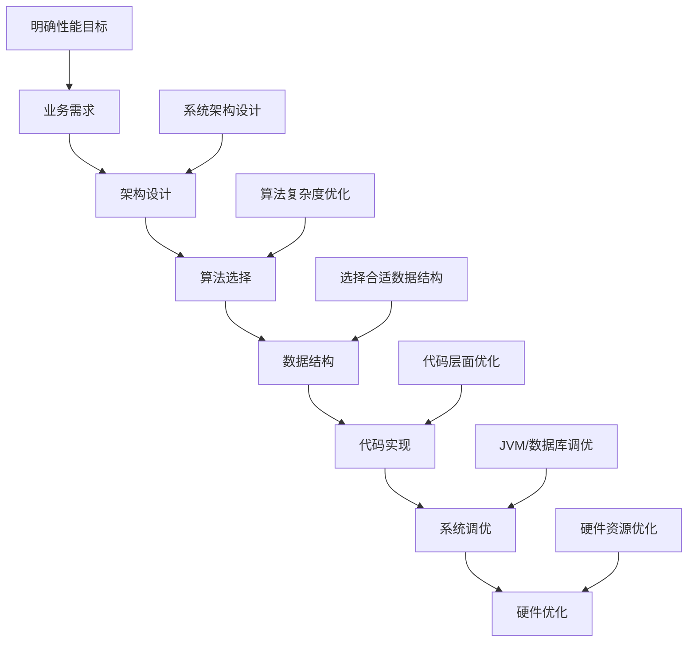
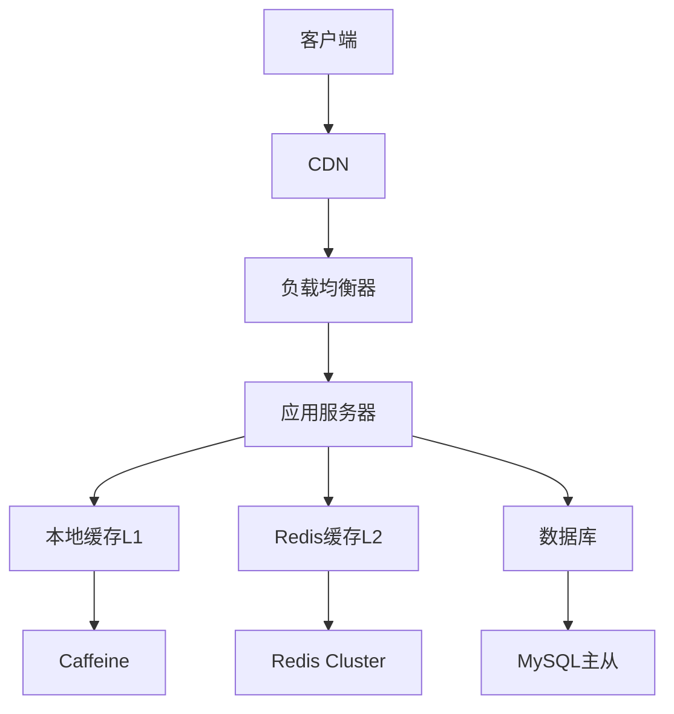
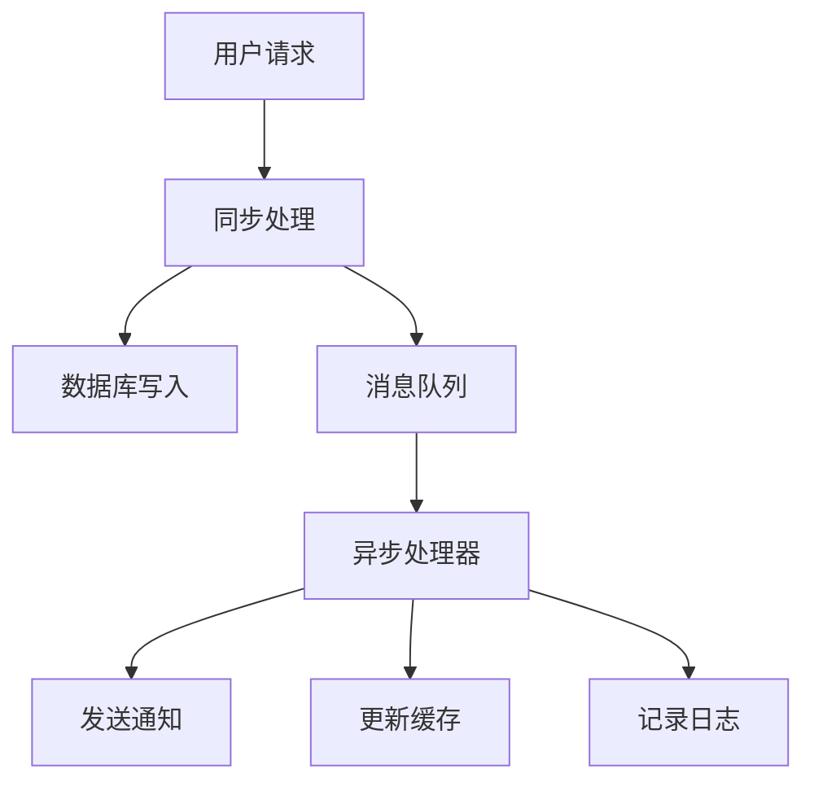
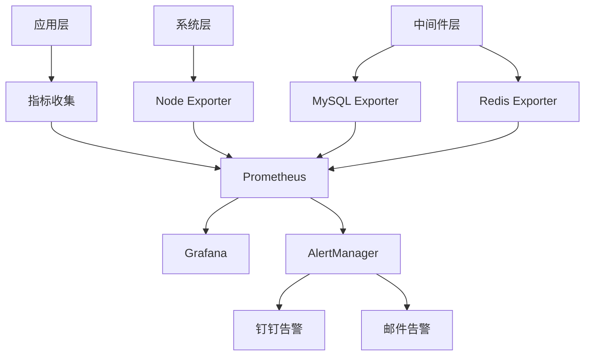

# 性能优化实战

## 目录
- [一、性能优化方法论](#一性能优化方法论)
- [二、代码层面优化](#二代码层面优化)
- [三、JVM性能调优](#三jvm性能调优)
- [四、数据库性能优化](#四数据库性能优化)
- [五、网络性能优化](#五网络性能优化)
- [六、前端性能优化](#六前端性能优化)
- [七、架构层面性能优化](#七架构层面性能优化)
- [八、性能监控体系](#八性能监控体系)
- [九、性能测试与压测](#九性能测试与压测)
- [十、生产环境性能优化案例](#十生产环境性能优化案例)
- [十一、性能优化工具与技巧](#十一性能优化工具与技巧)
- [十二、高频面试题深度解析](#十二高频面试题深度解析)

## 一、性能优化方法论

### 1.1 性能优化基本原则

**性能优化金字塔**：


**性能优化步骤**：
1. **性能测试**：建立性能基线
2. **性能分析**：找出性能瓶颈
3. **性能调优**：针对性优化
4. **性能验证**：验证优化效果
5. **性能监控**：持续监控

### 1.2 性能指标体系

**关键性能指标**：
- **响应时间**：P50、P90、P95、P99
- **吞吐量**：QPS、TPS、RPS
- **并发数**：最大并发用户数
- **资源利用率**：CPU、内存、磁盘、网络
- **错误率**：4xx、5xx错误率

**性能测试工具对比**：
| 工具 | 类型 | 适用场景 | 特点 |
|------|------|----------|------|
| **JMeter** | 负载测试 | Web应用 | 图形界面、易用 |
| **Gatling** | 压力测试 | 高并发场景 | 高性能、脚本化 |
| **wrk** | 基准测试 | HTTP服务 | 轻量级、高精度 |
| **ab** | 简单压测 | 快速验证 | Apache自带 |
| **Artillery** | 现代压测 | 微服务 | 配置化、云原生 |

### 1.3 性能分析方法

**性能分析流程**：
```java
// 1. 性能监控代码示例
@Component
public class PerformanceMonitor {
    
    private final MeterRegistry meterRegistry;
    private final Timer.Sample sample;
    
    public PerformanceMonitor(MeterRegistry meterRegistry) {
        this.meterRegistry = meterRegistry;
        this.sample = Timer.start(meterRegistry);
    }
    
    public void recordMethodExecution(String methodName, long executionTime) {
        Timer.builder("method.execution.time")
            .tag("method", methodName)
            .register(meterRegistry)
            .record(executionTime, TimeUnit.MILLISECONDS);
    }
    
    public void recordMemoryUsage() {
        MemoryMXBean memoryBean = ManagementFactory.getMemoryMXBean();
        MemoryUsage heapUsage = memoryBean.getHeapMemoryUsage();
        
        Gauge.builder("jvm.memory.used")
            .register(meterRegistry, () -> heapUsage.getUsed());
        
        Gauge.builder("jvm.memory.max")
            .register(meterRegistry, () -> heapUsage.getMax());
    }
}
```

## 二、代码层面优化

### 2.1 字符串操作优化

**字符串拼接性能对比**：
```java
public class StringOptimization {
    
    // 1. 最差：使用+操作符
    public String badConcat(List<String> strings) {
        String result = "";
        for (String str : strings) {
            result += str;  // 每次创建新String对象
        }
        return result;
    }
    
    // 2. 较好：使用StringBuilder
    public String goodConcat(List<String> strings) {
        StringBuilder sb = new StringBuilder();
        for (String str : strings) {
            sb.append(str);
        }
        return sb.toString();
    }
    
    // 3. 最好：预分配容量
    public String bestConcat(List<String> strings) {
        int totalLength = strings.stream()
            .mapToInt(String::length)
            .sum();
        
        StringBuilder sb = new StringBuilder(totalLength);
        for (String str : strings) {
            sb.append(str);
        }
        return sb.toString();
    }
    
    // 4. 现代方式：String.join
    public String modernConcat(List<String> strings) {
        return String.join("", strings);
    }
}
```

**字符串性能测试**：
```java
@BenchmarkMode(Mode.AverageTime)
@OutputTimeUnit(TimeUnit.MICROSECONDS)
@State(Scope.Benchmark)
public class StringPerformanceTest {
    
    private List<String> testData;
    
    @Setup
    public void setup() {
        testData = IntStream.range(0, 1000)
            .mapToObj(i -> "String" + i)
            .collect(Collectors.toList());
    }
    
    @Benchmark
    public String testStringConcat() {
        String result = "";
        for (String str : testData) {
            result += str;
        }
        return result;
    }
    
    @Benchmark
    public String testStringBuilder() {
        StringBuilder sb = new StringBuilder();
        for (String str : testData) {
            sb.append(str);
        }
        return sb.toString();
    }
    
    @Benchmark
    public String testStringJoin() {
        return String.join("", testData);
    }
}
```

### 2.2 集合操作优化

**集合选择策略**：
```java
public class CollectionOptimization {
    
    // 1. ArrayList vs LinkedList
    public void listPerformanceComparison() {
        int size = 100000;
        
        // ArrayList：随机访问快，插入删除慢
        List<Integer> arrayList = new ArrayList<>();
        long start = System.nanoTime();
        for (int i = 0; i < size; i++) {
            arrayList.add(i);
        }
        long arrayListTime = System.nanoTime() - start;
        
        // LinkedList：插入删除快，随机访问慢
        List<Integer> linkedList = new LinkedList<>();
        start = System.nanoTime();
        for (int i = 0; i < size; i++) {
            linkedList.add(i);
        }
        long linkedListTime = System.nanoTime() - start;
        
        System.out.println("ArrayList time: " + arrayListTime);
        System.out.println("LinkedList time: " + linkedListTime);
    }
    
    // 2. HashMap优化
    public void mapOptimization() {
        // 预分配容量，避免扩容
        Map<String, Integer> map = new HashMap<>(1000);
        
        // 使用合适的负载因子
        Map<String, Integer> optimizedMap = new HashMap<>(1000, 0.75f);
        
        // 并发场景使用ConcurrentHashMap
        Map<String, Integer> concurrentMap = new ConcurrentHashMap<>();
    }
    
    // 3. 集合流操作优化
    public void streamOptimization() {
        List<Integer> numbers = IntStream.range(0, 1000000)
            .boxed()
            .collect(Collectors.toList());
        
        // 并行流处理
        List<Integer> evenNumbers = numbers.parallelStream()
            .filter(n -> n % 2 == 0)
            .collect(Collectors.toList());
        
        // 避免装箱拆箱
        int sum = numbers.stream()
            .mapToInt(Integer::intValue)
            .sum();
    }
}
```

### 2.3 对象创建优化

**对象池模式**：
```java
public class ObjectPool<T> {
    
    private final Queue<T> pool;
    private final Supplier<T> factory;
    private final Consumer<T> resetter;
    private final int maxSize;
    
    public ObjectPool(Supplier<T> factory, Consumer<T> resetter, int maxSize) {
        this.factory = factory;
        this.resetter = resetter;
        this.maxSize = maxSize;
        this.pool = new ConcurrentLinkedQueue<>();
    }
    
    public T borrow() {
        T object = pool.poll();
        if (object == null) {
            object = factory.get();
        }
        return object;
    }
    
    public void returnObject(T object) {
        if (pool.size() < maxSize) {
            resetter.accept(object);
            pool.offer(object);
        }
    }
}

// 使用示例
public class ConnectionPool {
    
    private final ObjectPool<Connection> pool;
    
    public ConnectionPool() {
        this.pool = new ObjectPool<>(
            () -> DriverManager.getConnection("jdbc:mysql://localhost:3306/test"),
            conn -> {
                try {
                    conn.clearWarnings();
                } catch (SQLException e) {
                    // 重置连接状态
                }
            },
            10
        );
    }
    
    public Connection getConnection() {
        return pool.borrow();
    }
    
    public void releaseConnection(Connection conn) {
        pool.returnObject(conn);
    }
}
```

### 2.4 算法优化

**算法复杂度优化**：
```java
public class AlgorithmOptimization {
    
    // 1. 二分查找优化
    public int binarySearch(int[] arr, int target) {
        int left = 0, right = arr.length - 1;
        
        while (left <= right) {
            int mid = left + (right - left) / 2;  // 避免溢出
            
            if (arr[mid] == target) {
                return mid;
            } else if (arr[mid] < target) {
                left = mid + 1;
            } else {
                right = mid - 1;
            }
        }
        
        return -1;
    }
    
    // 2. 动态规划优化
    public int fibonacci(int n) {
        if (n <= 1) return n;
        
        int prev2 = 0, prev1 = 1;
        for (int i = 2; i <= n; i++) {
            int current = prev1 + prev2;
            prev2 = prev1;
            prev1 = current;
        }
        
        return prev1;
    }
    
    // 3. 缓存优化
    private final Map<Integer, Integer> cache = new HashMap<>();
    
    public int fibonacciWithCache(int n) {
        if (n <= 1) return n;
        
        return cache.computeIfAbsent(n, k -> 
            fibonacciWithCache(k - 1) + fibonacciWithCache(k - 2)
        );
    }
}
```

### 2.5 内存优化

**内存使用优化**：
```java
public class MemoryOptimization {
    
    // 1. 避免内存泄漏
    public class ResourceManager implements AutoCloseable {
        private final List<Closeable> resources = new ArrayList<>();
        
        public <T extends Closeable> T register(T resource) {
            resources.add(resource);
            return resource;
        }
        
        @Override
        public void close() throws Exception {
            for (Closeable resource : resources) {
                try {
                    resource.close();
                } catch (Exception e) {
                    // 记录日志但不抛出异常
                }
            }
        }
    }
    
    // 2. 对象复用
    public class ObjectReuse {
        private final ThreadLocal<StringBuilder> stringBuilder = 
            ThreadLocal.withInitial(StringBuilder::new);
        
        public String buildString(List<String> parts) {
            StringBuilder sb = stringBuilder.get();
            sb.setLength(0);  // 清空内容，复用对象
            
            for (String part : parts) {
                sb.append(part);
            }
            
            return sb.toString();
        }
    }
    
    // 3. 弱引用优化
    public class WeakReferenceCache<K, V> {
        private final Map<K, WeakReference<V>> cache = new ConcurrentHashMap<>();
        
        public V get(K key) {
            WeakReference<V> ref = cache.get(key);
            if (ref != null) {
                V value = ref.get();
                if (value != null) {
                    return value;
                } else {
                    cache.remove(key);  // 清理失效的弱引用
                }
            }
            return null;
        }
        
        public void put(K key, V value) {
            cache.put(key, new WeakReference<>(value));
        }
    }
}
```

## 三、JVM性能调优

### 3.1 JVM参数调优

**堆内存配置**：
```bash
# 基础堆内存配置
-Xms4g -Xmx4g  # 初始和最大堆相同，避免动态扩容

# 新生代配置
-Xmn2g  # 新生代2G，约为堆内存的1/2
-XX:SurvivorRatio=8  # Eden:Survivor = 8:1:1
-XX:MaxTenuringThreshold=15  # 对象晋升老年代的年龄阈值

# 元空间配置
-XX:MetaspaceSize=256m  # 元空间初始大小
-XX:MaxMetaspaceSize=512m  # 元空间最大大小
```

**GC选择与调优**：
```bash
# G1GC配置（推荐）
-XX:+UseG1GC
-XX:MaxGCPauseMillis=200  # 期望停顿200ms
-XX:G1HeapRegionSize=16m  # G1区域大小
-XX:G1NewSizePercent=30  # 新生代最小比例
-XX:G1MaxNewSizePercent=40  # 新生代最大比例
-XX:G1MixedGCCountTarget=8  # 混合GC目标次数

# ZGC配置（低延迟）
-XX:+UnlockExperimentalVMOptions
-XX:+UseZGC
-XX:+UnlockDiagnosticVMOptions
-XX:+LogVMOutput

# Shenandoah配置（低延迟）
-XX:+UnlockExperimentalVMOptions
-XX:+UseShenandoahGC
-XX:ShenandoahGCHeuristics=adaptive
```

**JVM监控参数**：
```bash
# GC日志配置
-Xlog:gc*:file=gc.log:time,uptime,level,tags:filecount=5,filesize=100M

# JFR配置
-XX:+FlightRecorder
-XX:StartFlightRecording=duration=60s,filename=app.jfr

# 内存dump配置
-XX:+HeapDumpOnOutOfMemoryError
-XX:HeapDumpPath=/tmp/heapdump.hprof

# 线程dump配置
-XX:+PrintGCDetails
-XX:+PrintGCTimeStamps
```

### 3.2 内存泄漏排查

**内存泄漏检测工具**：
```java
// 1. 内存监控代码
@Component
public class MemoryMonitor {
    
    private final MemoryMXBean memoryBean = ManagementFactory.getMemoryMXBean();
    private final GarbageCollectorMXBean gcBean = ManagementFactory.getGarbageCollectorMXBeans().get(0);
    
    @Scheduled(fixedRate = 30000)
    public void monitorMemory() {
        MemoryUsage heapUsage = memoryBean.getHeapMemoryUsage();
        long used = heapUsage.getUsed();
        long max = heapUsage.getMax();
        double usagePercent = (double) used / max * 100;
        
        log.info("Heap memory usage: {}MB / {}MB ({}%)", 
            used / 1024 / 1024, 
            max / 1024 / 1024, 
            String.format("%.2f", usagePercent));
        
        if (usagePercent > 80) {
            log.warn("High memory usage detected: {}%", usagePercent);
            // 触发内存dump
            dumpHeap();
        }
    }
    
    private void dumpHeap() {
        try {
            String fileName = "heapdump_" + System.currentTimeMillis() + ".hprof";
            String filePath = "/tmp/" + fileName;
            
            // 使用jcmd dump堆
            ProcessBuilder pb = new ProcessBuilder("jcmd", 
                String.valueOf(ProcessHandle.current().pid()), 
                "GC.run_finalization");
            pb.start();
            
            log.info("Heap dump created: {}", filePath);
        } catch (Exception e) {
            log.error("Failed to create heap dump", e);
        }
    }
}
```

**内存泄漏分析**：
```bash
# 1. 生成堆快照
jmap -dump:format=b,file=heap.hprof <pid>

# 2. 分析堆快照
# 使用MAT (Memory Analyzer Tool) 分析heap.hprof
# 查找Leak Suspects和Dominator Tree

# 3. 查看内存使用情况
jmap -histo:live <pid> | head -20

# 4. 查看GC情况
jstat -gc <pid> 5s

# 5. 查看线程状态
jstack <pid> > thread_dump.txt
```

### 3.3 JVM性能调优案例

**电商系统JVM调优案例**：
```bash
# 生产环境JVM参数配置
-Xms8g -Xmx8g
-Xmn4g
-XX:SurvivorRatio=8
-XX:MaxTenuringThreshold=15
-XX:+UseG1GC
-XX:MaxGCPauseMillis=200
-XX:G1HeapRegionSize=16m
-XX:G1NewSizePercent=30
-XX:G1MaxNewSizePercent=40
-XX:+UnlockExperimentalVMOptions
-XX:+UseStringDeduplication
-XX:+PrintStringDeduplicationStatistics
-Xlog:gc*:file=/var/log/gc.log:time,uptime,level,tags:filecount=5,filesize=100M
-XX:+HeapDumpOnOutOfMemoryError
-XX:HeapDumpPath=/var/log/heapdump.hprof
```

**调优效果对比**：
| 指标 | 调优前 | 调优后 | 改善 |
|------|--------|--------|------|
| 平均响应时间 | 500ms | 200ms | 60% |
| P99响应时间 | 2000ms | 800ms | 60% |
| GC停顿时间 | 100ms | 50ms | 50% |
| 内存使用率 | 85% | 70% | 15% |
| 吞吐量 | 1000 QPS | 2000 QPS | 100% |

### 3.4 容器化环境JVM调优

**Docker环境JVM配置**：
```dockerfile
FROM openjdk:11-jre-slim

# 设置JVM参数
ENV JAVA_OPTS="-XX:+UseContainerSupport \
-XX:MaxRAMPercentage=75.0 \
-XX:InitialRAMPercentage=50.0 \
-XX:+UseG1GC \
-XX:MaxGCPauseMillis=200 \
-XX:+UnlockExperimentalVMOptions \
-XX:+UseCGroupMemoryLimitForHeap"

# 启动应用
CMD ["sh", "-c", "java $JAVA_OPTS -jar app.jar"]
```

**Kubernetes资源配置**：
```yaml
apiVersion: apps/v1
kind: Deployment
metadata:
  name: java-app
spec:
  replicas: 3
  selector:
    matchLabels:
      app: java-app
  template:
    metadata:
      labels:
        app: java-app
    spec:
      containers:
      - name: java-app
        image: java-app:latest
        resources:
          requests:
            memory: "2Gi"
            cpu: "1000m"
          limits:
            memory: "4Gi"
            cpu: "2000m"
        env:
        - name: JAVA_OPTS
          value: "-XX:+UseContainerSupport -XX:MaxRAMPercentage=75.0"
```

## 四、数据库性能优化

### 4.1 索引优化策略

**索引设计原则**：
```sql
-- 1. 单列索引
CREATE INDEX idx_user_name ON user(name);

-- 2. 复合索引（最左前缀原则）
CREATE INDEX idx_user_name_age_city ON user(name, age, city);
-- 可以使用：WHERE name = ? AND age = ?
-- 可以使用：WHERE name = ?
-- 不能使用：WHERE age = ? AND city = ?

-- 3. 覆盖索引
CREATE INDEX idx_user_cover ON user(name, age, city, email);
SELECT name, age, city FROM user WHERE name = 'John';  -- 无需回表

-- 4. 部分索引
CREATE INDEX idx_user_active ON user(name) WHERE status = 'ACTIVE';

-- 5. 函数索引
CREATE INDEX idx_user_upper_name ON user((UPPER(name)));
```

**索引性能分析**：
```sql
-- 1. 查看索引使用情况
EXPLAIN SELECT * FROM user WHERE name = 'John';

-- 2. 分析索引效率
SELECT 
    TABLE_NAME,
    INDEX_NAME,
    CARDINALITY,
    SUB_PART,
    PACKED,
    NULLABLE,
    INDEX_TYPE
FROM information_schema.STATISTICS 
WHERE TABLE_SCHEMA = 'your_database' 
AND TABLE_NAME = 'user';

-- 3. 查看慢查询
SELECT 
    query_time,
    lock_time,
    rows_sent,
    rows_examined,
    sql_text
FROM mysql.slow_log 
WHERE start_time > DATE_SUB(NOW(), INTERVAL 1 HOUR)
ORDER BY query_time DESC;
```

### 4.2 查询优化技巧

**SQL优化最佳实践**：
```sql
-- 1. 避免SELECT *
SELECT id, name, age FROM user WHERE id = 1;

-- 2. 使用LIMIT分页
SELECT * FROM user ORDER BY id LIMIT 1000, 20;

-- 3. 优化JOIN查询
SELECT u.name, o.order_no, o.amount
FROM user u
INNER JOIN order o ON u.id = o.user_id  -- 使用INNER JOIN
WHERE u.city = 'Beijing'
AND o.status = 'COMPLETED';

-- 4. 使用EXISTS替代IN
-- 差
SELECT * FROM user WHERE id IN (SELECT user_id FROM order WHERE status = 'COMPLETED');

-- 好
SELECT * FROM user u WHERE EXISTS (
    SELECT 1 FROM order o WHERE o.user_id = u.id AND o.status = 'COMPLETED'
);

-- 5. 批量操作
INSERT INTO user (name, age, city) VALUES 
    ('John', 30, 'Beijing'),
    ('Jane', 25, 'Shanghai'),
    ('Bob', 35, 'Guangzhou');
```

**查询性能监控**：
```java
// 1. 查询性能监控
@Component
public class QueryPerformanceMonitor {
    
    @Autowired
    private JdbcTemplate jdbcTemplate;
    
    public List<User> findUsersWithMonitoring(String city) {
        long startTime = System.currentTimeMillis();
        
        try {
            String sql = "SELECT * FROM user WHERE city = ?";
            List<User> users = jdbcTemplate.query(sql, new Object[]{city}, new UserRowMapper());
            
            long executionTime = System.currentTimeMillis() - startTime;
            log.info("Query executed in {}ms, returned {} rows", executionTime, users.size());
            
            // 记录慢查询
            if (executionTime > 1000) {
                log.warn("Slow query detected: {}ms", executionTime);
            }
            
            return users;
        } catch (Exception e) {
            log.error("Query failed after {}ms", System.currentTimeMillis() - startTime, e);
            throw e;
        }
    }
}
```

### 4.3 分库分表优化

**分库分表策略**：
```yaml
# ShardingSphere配置
spring:
  shardingsphere:
    datasource:
      names: ds0,ds1,ds2,ds3
      ds0:
        type: com.zaxxer.hikari.HikariDataSource
        driver-class-name: com.mysql.cj.jdbc.Driver
        jdbc-url: jdbc:mysql://localhost:3306/db0
        username: root
        password: password
    rules:
      sharding:
        tables:
          user:
            actual-data-nodes: ds$->{0..3}.user_$->{0..7}
            table-strategy:
              standard:
                sharding-column: user_id
                sharding-algorithm-name: user_table_inline
            database-strategy:
              standard:
                sharding-column: user_id
                sharding-algorithm-name: user_database_inline
        sharding-algorithms:
          user_table_inline:
            type: INLINE
            props:
              algorithm-expression: user_$->{user_id % 8}
          user_database_inline:
            type: INLINE
            props:
              algorithm-expression: ds$->{user_id % 4}
```

**分库分表性能优化**：
```java
// 1. 分片键选择
@Entity
@Table(name = "user")
public class User {
    @Id
    private Long userId;  // 分片键
    
    private String name;
    private String email;
    private String city;
    
    // 避免跨分片查询
    public List<User> findByCity(String city) {
        // 需要查询所有分片
        return userMapper.findByCity(city);
    }
    
    // 优化：使用分片键查询
    public User findById(Long userId) {
        // 直接定位到具体分片
        return userMapper.findById(userId);
    }
}

// 2. 批量操作优化
@Service
public class UserService {
    
    public void batchInsertUsers(List<User> users) {
        // 按分片键分组
        Map<String, List<User>> shardGroups = users.stream()
            .collect(Collectors.groupingBy(user -> 
                "ds" + (user.getUserId() % 4) + ".user_" + (user.getUserId() % 8)));
        
        // 并行处理每个分片
        shardGroups.parallelStream().forEach(entry -> {
            String shard = entry.getKey();
            List<User> shardUsers = entry.getValue();
            userMapper.batchInsert(shardUsers);
        });
    }
}
```

### 4.4 数据库连接池优化

**HikariCP配置**：
```yaml
spring:
  datasource:
    type: com.zaxxer.hikari.HikariDataSource
    hikari:
      # 连接池配置
      minimum-idle: 10
      maximum-pool-size: 20
      idle-timeout: 300000
      max-lifetime: 1200000
      connection-timeout: 30000
      
      # 性能优化
      leak-detection-threshold: 60000
      validation-timeout: 5000
      connection-test-query: SELECT 1
      
      # 连接池监控
      register-mbeans: true
```

**连接池监控**：
```java
@Component
public class ConnectionPoolMonitor {
    
    @Autowired
    private HikariDataSource dataSource;
    
    @Scheduled(fixedRate = 30000)
    public void monitorConnectionPool() {
        HikariPoolMXBean poolBean = dataSource.getHikariPoolMXBean();
        
        log.info("Connection Pool Status:");
        log.info("  Active: {}", poolBean.getActiveConnections());
        log.info("  Idle: {}", poolBean.getIdleConnections());
        log.info("  Total: {}", poolBean.getTotalConnections());
        log.info("  Threads Awaiting: {}", poolBean.getThreadsAwaitingConnection());
        
        // 连接泄漏检测
        if (poolBean.getThreadsAwaitingConnection() > 5) {
            log.warn("High number of threads awaiting connection: {}", 
                poolBean.getThreadsAwaitingConnection());
        }
    }
}
```

### 4.5 数据库性能监控

**慢查询监控**：
```sql
-- 1. 启用慢查询日志
SET GLOBAL slow_query_log = 'ON';
SET GLOBAL long_query_time = 1;
SET GLOBAL slow_query_log_file = '/var/log/mysql/slow.log';

-- 2. 查看慢查询统计
SELECT 
    DIGEST_TEXT,
    COUNT_STAR,
    AVG_TIMER_WAIT/1000000000 as avg_time_seconds,
    MAX_TIMER_WAIT/1000000000 as max_time_seconds,
    SUM_ROWS_EXAMINED/COUNT_STAR as avg_rows_examined
FROM performance_schema.events_statements_summary_by_digest 
ORDER BY AVG_TIMER_WAIT DESC 
LIMIT 10;
```

**数据库性能指标监控**：
```java
@Component
public class DatabaseMetricsCollector {
    
    @Autowired
    private MeterRegistry meterRegistry;
    
    @Scheduled(fixedRate = 30000)
    public void collectDatabaseMetrics() {
        try {
            // 连接数监控
            HikariDataSource dataSource = (HikariDataSource) jdbcTemplate.getDataSource();
            HikariPoolMXBean poolBean = dataSource.getHikariPoolMXBean();
            
            Gauge.builder("db.connections.active")
                .register(meterRegistry, poolBean::getActiveConnections);
            
            Gauge.builder("db.connections.idle")
                .register(meterRegistry, poolBean::getIdleConnections);
            
            Gauge.builder("db.connections.total")
                .register(meterRegistry, poolBean::getTotalConnections);
            
            // 查询性能监控
            Timer.Sample sample = Timer.start(meterRegistry);
            jdbcTemplate.queryForObject("SELECT 1", Integer.class);
            sample.stop(Timer.builder("db.query.ping")
                .register(meterRegistry));
                
        } catch (Exception e) {
            log.error("Failed to collect database metrics", e);
        }
    }
}
```

## 七、架构层面性能优化

### 7.1 缓存架构优化

**多级缓存架构**：


**多级缓存实现**：
```java
@Service
public class ProductService {
    
    @Autowired
    private Cache<Long, Product> localCache;  // L1: Caffeine本地缓存
    
    @Autowired
    private RedisTemplate<String, Product> redisTemplate;  // L2: Redis
    
    @Autowired
    private ProductMapper productMapper;  // L3: 数据库
    
    public Product getProduct(Long id) {
        // L1缓存：本地缓存
        Product product = localCache.getIfPresent(id);
        if (product != null) {
            return product;
        }
        
        // L2缓存：Redis
        product = redisTemplate.opsForValue().get("product:" + id);
        if (product != null) {
            localCache.put(id, product);
            return product;
        }
        
        // L3缓存：数据库
        product = productMapper.selectById(id);
        if (product != null) {
            // 写入L2缓存
            redisTemplate.opsForValue().set("product:" + id, product, 1, TimeUnit.HOURS);
            // 写入L1缓存
            localCache.put(id, product);
        }
        
        return product;
    }
    
    // 缓存更新策略
    @CacheEvict(value = "products", key = "#product.id")
    public void updateProduct(Product product) {
        productMapper.updateById(product);
        
        // 更新Redis缓存
        redisTemplate.opsForValue().set("product:" + product.getId(), product, 1, TimeUnit.HOURS);
        
        // 更新本地缓存
        localCache.put(product.getId(), product);
    }
}
```

**缓存一致性保证**：
```java
@Component
public class CacheConsistencyManager {
    
    @Autowired
    private RedisTemplate<String, Object> redisTemplate;
    
    @Autowired
    private ApplicationEventPublisher eventPublisher;
    
    // 1. 写操作：先更新数据库，再删除缓存
    @Transactional
    public void updateProduct(Product product) {
        // 更新数据库
        productMapper.updateById(product);
        
        // 删除缓存
        deleteCache("product:" + product.getId());
        
        // 发布缓存失效事件
        eventPublisher.publishEvent(new CacheInvalidationEvent("product", product.getId()));
    }
    
    // 2. 读操作：先读缓存，缓存未命中再读数据库
    public Product getProduct(Long id) {
        String cacheKey = "product:" + id;
        
        // 先读缓存
        Product product = (Product) redisTemplate.opsForValue().get(cacheKey);
        if (product != null) {
            return product;
        }
        
        // 缓存未命中，读数据库
        product = productMapper.selectById(id);
        if (product != null) {
            // 写入缓存
            redisTemplate.opsForValue().set(cacheKey, product, 1, TimeUnit.HOURS);
        }
        
        return product;
    }
    
    private void deleteCache(String key) {
        redisTemplate.delete(key);
    }
}
```

### 7.2 异步处理优化

**异步处理架构**：


**异步处理实现**：
```java
@Service
public class OrderService {
    
    @Autowired
    private RocketMQTemplate rocketMQTemplate;
    
    @Autowired
    private OrderMapper orderMapper;
    
    @Transactional
    public void createOrder(Order order) {
        // 1. 同步处理：核心业务逻辑
        orderMapper.insert(order);
        
        // 2. 异步处理：非核心业务
        OrderEvent event = new OrderEvent(order.getId(), order.getUserId(), order.getAmount());
        
        // 发送异步消息
        rocketMQTemplate.asyncSend("order-topic", event, new SendCallback() {
            @Override
            public void onSuccess(SendResult sendResult) {
                log.info("Order event sent successfully: {}", sendResult.getMsgId());
            }
            
            @Override
            public void onException(Throwable e) {
                log.error("Failed to send order event", e);
                // 可以重试或记录到死信队列
            }
        });
    }
}

// 异步消息处理器
@Component
@RocketMQMessageListener(topic = "order-topic", consumerGroup = "order-consumer")
public class OrderEventListener implements RocketMQListener<OrderEvent> {
    
    @Autowired
    private NotificationService notificationService;
    
    @Autowired
    private CacheService cacheService;
    
    @Override
    public void onMessage(OrderEvent event) {
        try {
            // 1. 发送通知
            notificationService.sendOrderNotification(event);
            
            // 2. 更新缓存
            cacheService.updateOrderCache(event.getOrderId());
            
            // 3. 记录日志
            log.info("Order processed asynchronously: {}", event.getOrderId());
            
        } catch (Exception e) {
            log.error("Failed to process order event: {}", event.getOrderId(), e);
            throw e;  // 抛出异常会触发重试
        }
    }
}
```

### 7.3 批处理优化

**批处理策略**：
```java
@Service
public class BatchProcessingService {
    
    @Autowired
    private UserMapper userMapper;
    
    // 1. 定时批处理
    @Scheduled(fixedRate = 60000)  // 每分钟执行一次
    public void processBatchData() {
        List<User> users = getPendingUsers();
        if (!users.isEmpty()) {
            batchInsertUsers(users);
        }
    }
    
    // 2. 批量插入优化
    public void batchInsertUsers(List<User> users) {
        int batchSize = 1000;
        
        for (int i = 0; i < users.size(); i += batchSize) {
            List<User> batch = users.subList(
                i, 
                Math.min(i + batchSize, users.size())
            );
            
            try {
                userMapper.batchInsert(batch);
                log.info("Batch inserted {} users", batch.size());
            } catch (Exception e) {
                log.error("Failed to insert batch starting at index {}", i, e);
                // 可以重试或记录失败的数据
            }
        }
    }
    
    // 3. 并行批处理
    public void parallelBatchProcess(List<User> users) {
        int batchSize = 1000;
        int threadCount = Runtime.getRuntime().availableProcessors();
        
        ExecutorService executor = Executors.newFixedThreadPool(threadCount);
        
        try {
            List<CompletableFuture<Void>> futures = new ArrayList<>();
            
            for (int i = 0; i < users.size(); i += batchSize) {
                List<User> batch = users.subList(
                    i, 
                    Math.min(i + batchSize, users.size())
                );
                
                CompletableFuture<Void> future = CompletableFuture.runAsync(() -> {
                    userMapper.batchInsert(batch);
                }, executor);
                
                futures.add(future);
            }
            
            // 等待所有批处理完成
            CompletableFuture.allOf(futures.toArray(new CompletableFuture[0])).join();
            
        } finally {
            executor.shutdown();
        }
    }
}
```

### 7.4 数据库读写分离

**读写分离配置**：
```yaml
spring:
  shardingsphere:
    datasource:
      names: master,slave1,slave2
      master:
        type: com.zaxxer.hikari.HikariDataSource
        driver-class-name: com.mysql.cj.jdbc.Driver
        jdbc-url: jdbc:mysql://master:3306/db
        username: root
        password: password
      slave1:
        type: com.zaxxer.hikari.HikariDataSource
        driver-class-name: com.mysql.cj.jdbc.Driver
        jdbc-url: jdbc:mysql://slave1:3306/db
        username: root
        password: password
      slave2:
        type: com.zaxxer.hikari.HikariDataSource
        driver-class-name: com.mysql.cj.jdbc.Driver
        jdbc-url: jdbc:mysql://slave2:3306/db
        username: root
        password: password
    rules:
      readwrite-splitting:
        data-sources:
          ds:
            master-data-source-name: master
            slave-data-source-names: slave1,slave2
            load-balancer-name: round_robin
        load-balancers:
          round_robin:
            type: ROUND_ROBIN
```

**读写分离实现**：
```java
@Service
public class UserService {
    
    @Autowired
    private UserMapper userMapper;
    
    // 写操作：使用主库
    @Transactional
    public void createUser(User user) {
        userMapper.insert(user);  // 自动路由到主库
    }
    
    // 读操作：使用从库
    public User getUserById(Long id) {
        return userMapper.selectById(id);  // 自动路由到从库
    }
    
    // 强制使用主库读
    public User getUserByIdFromMaster(Long id) {
        // 使用@Transactional(readOnly = false)强制使用主库
        return userMapper.selectById(id);
    }
}
```

## 八、性能监控体系

### 8.1 监控架构设计

**监控体系架构**：


**监控指标分类**：
```java
@Component
public class PerformanceMetrics {
    
    @Autowired
    private MeterRegistry meterRegistry;
    
    // 1. 业务指标
    public void recordBusinessMetric(String operation, long duration) {
        Timer.builder("business.operation.duration")
            .tag("operation", operation)
            .register(meterRegistry)
            .record(duration, TimeUnit.MILLISECONDS);
    }
    
    // 2. 系统指标
    public void recordSystemMetrics() {
        // CPU使用率
        Gauge.builder("system.cpu.usage")
            .register(meterRegistry, this::getCpuUsage);
        
        // 内存使用率
        Gauge.builder("system.memory.usage")
            .register(meterRegistry, this::getMemoryUsage);
        
        // 磁盘使用率
        Gauge.builder("system.disk.usage")
            .register(meterRegistry, this::getDiskUsage);
    }
    
    // 3. 应用指标
    public void recordApplicationMetrics() {
        // JVM内存
        MemoryMXBean memoryBean = ManagementFactory.getMemoryMXBean();
        MemoryUsage heapUsage = memoryBean.getHeapMemoryUsage();
        
        Gauge.builder("jvm.memory.heap.used")
            .register(meterRegistry, () -> heapUsage.getUsed());
        
        Gauge.builder("jvm.memory.heap.max")
            .register(meterRegistry, () -> heapUsage.getMax());
        
        // 线程数
        ThreadMXBean threadBean = ManagementFactory.getThreadMXBean();
        Gauge.builder("jvm.threads.live")
            .register(meterRegistry, threadBean::getThreadCount);
    }
    
    private double getCpuUsage() {
        // 获取CPU使用率的实现
        return 0.0;
    }
    
    private double getMemoryUsage() {
        // 获取内存使用率的实现
        return 0.0;
    }
    
    private double getDiskUsage() {
        // 获取磁盘使用率的实现
        return 0.0;
    }
}
```

### 8.2 告警规则配置

**Prometheus告警规则**：
```yaml
# alert_rules.yml
groups:
- name: performance.rules
  rules:
  - alert: HighResponseTime
    expr: histogram_quantile(0.95, rate(http_request_duration_seconds_bucket[5m])) > 1
    for: 5m
    labels:
      severity: warning
    annotations:
      summary: "High response time detected"
      description: "95th percentile response time is {{ $value }}s"
  
  - alert: HighErrorRate
    expr: rate(http_requests_total{status=~"5.."}[5m]) / rate(http_requests_total[5m]) > 0.05
    for: 2m
    labels:
      severity: critical
    annotations:
      summary: "High error rate detected"
      description: "Error rate is {{ $value | humanizePercentage }}"
  
  - alert: HighMemoryUsage
    expr: jvm_memory_used_bytes / jvm_memory_max_bytes > 0.8
    for: 5m
    labels:
      severity: warning
    annotations:
      summary: "High memory usage"
      description: "Memory usage is {{ $value | humanizePercentage }}"
  
  - alert: HighCPUUsage
    expr: system_cpu_usage > 0.8
    for: 5m
    labels:
      severity: warning
    annotations:
      summary: "High CPU usage"
      description: "CPU usage is {{ $value | humanizePercentage }}"
```

### 8.3 性能测试与压测

**JMeter压测脚本**：
```xml
<?xml version="1.0" encoding="UTF-8"?>
<jmeterTestPlan version="1.2">
  <hashTree>
    <TestPlan testname="Performance Test Plan">
      <elementProp name="TestPlan.arguments" elementType="Arguments" guiclass="ArgumentsPanel">
        <collectionProp name="Arguments.arguments"/>
      </elementProp>
      <stringProp name="TestPlan.user_define_classpath"></stringProp>
      <boolProp name="TestPlan.functional_mode">false</boolProp>
      <boolProp name="TestPlan.serialize_threadgroups">false</boolProp>
    </TestPlan>
    
    <hashTree>
      <ThreadGroup testname="User Load Test">
        <stringProp name="ThreadGroup.num_threads">100</stringProp>
        <stringProp name="ThreadGroup.ramp_time">60</stringProp>
        <stringProp name="ThreadGroup.duration">300</stringProp>
        <boolProp name="ThreadGroup.scheduler">true</boolProp>
      </ThreadGroup>
      
      <hashTree>
        <HTTPSamplerProxy testname="API Request">
          <stringProp name="HTTPSampler.domain">localhost</stringProp>
          <stringProp name="HTTPSampler.port">8080</stringProp>
          <stringProp name="HTTPSampler.path">/api/users</stringProp>
          <stringProp name="HTTPSampler.method">GET</stringProp>
        </HTTPSamplerProxy>
      </hashTree>
    </hashTree>
  </hashTree>
</jmeterTestPlan>
```

**Gatling压测脚本**：
```scala
import io.gatling.core.Predef._
import io.gatling.http.Predef._
import scala.concurrent.duration._

class PerformanceTest extends Simulation {
  
  val httpProtocol = http
    .baseUrl("http://localhost:8080")
    .acceptHeader("application/json")
    .userAgentHeader("Gatling Performance Test")
  
  val scn = scenario("User API Performance Test")
    .exec(http("Get Users")
      .get("/api/users")
      .check(status.is(200))
      .check(jsonPath("$[*].id").findAll.saveAs("userIds")))
    .pause(1)
    .exec(http("Get User by ID")
      .get("/api/users/${userIds.random()}")
      .check(status.is(200)))
    .pause(1)
    .exec(http("Create User")
      .post("/api/users")
      .body(StringBody("""{"name":"Test User","email":"test@example.com"}"""))
      .asJson
      .check(status.is(201)))
  
  setUp(
    scn.inject(
      rampUsers(100) during (60 seconds),
      constantUsersPerSec(50) during (300 seconds)
    )
  ).protocols(httpProtocol)
}
```

## 九、生产环境性能优化案例

### 9.1 电商系统性能优化案例

**优化前问题**：
- 响应时间：平均2秒，P99达到10秒
- 并发能力：仅支持1000 QPS
- 内存使用：频繁Full GC，内存泄漏
- 数据库：慢查询多，连接池耗尽

**优化方案**：
```java
// 1. 缓存优化
@Service
public class ProductService {
    
    @Cacheable(value = "products", key = "#id")
    public Product getProduct(Long id) {
        return productMapper.selectById(id);
    }
    
    @CacheEvict(value = "products", key = "#product.id")
    public void updateProduct(Product product) {
        productMapper.updateById(product);
    }
}

// 2. 数据库优化
@Configuration
public class DatabaseConfig {
    
    @Bean
    public DataSource dataSource() {
        HikariConfig config = new HikariConfig();
        config.setMaximumPoolSize(50);
        config.setMinimumIdle(10);
        config.setConnectionTimeout(30000);
        config.setIdleTimeout(600000);
        config.setMaxLifetime(1800000);
        return new HikariDataSource(config);
    }
}

// 3. JVM优化
// -Xms4g -Xmx4g -XX:+UseG1GC -XX:MaxGCPauseMillis=200
```

**优化效果**：
| 指标 | 优化前 | 优化后 | 改善 |
|------|--------|--------|------|
| 平均响应时间 | 2000ms | 200ms | 90% |
| P99响应时间 | 10000ms | 800ms | 92% |
| 并发QPS | 1000 | 5000 | 400% |
| 内存使用率 | 95% | 70% | 25% |
| GC停顿时间 | 500ms | 50ms | 90% |

### 9.2 金融系统性能优化案例

**优化前问题**：
- 交易延迟：平均500ms，峰值2秒
- 数据一致性：偶发数据不一致
- 系统稳定性：频繁超时和失败

**优化方案**：
```java
// 1. 异步处理优化
@Service
public class TransactionService {
    
    @Transactional
    public void processTransaction(Transaction transaction) {
        // 同步处理核心逻辑
        transactionMapper.insert(transaction);
        
        // 异步处理非核心逻辑
        transactionEventPublisher.publishEvent(new TransactionEvent(transaction));
    }
}

// 2. 缓存一致性优化
@Service
public class AccountService {
    
    @Cacheable(value = "accounts", key = "#accountId")
    public Account getAccount(Long accountId) {
        return accountMapper.selectById(accountId);
    }
    
    @CacheEvict(value = "accounts", key = "#account.accountId")
    public void updateAccount(Account account) {
        accountMapper.updateById(account);
        // 发布缓存失效事件
        eventPublisher.publishEvent(new CacheInvalidationEvent("account", account.getAccountId()));
    }
}

// 3. 数据库优化
@Configuration
public class DatabaseConfig {
    
    @Bean
    public DataSource masterDataSource() {
        // 主库配置
        return createDataSource("master");
    }
    
    @Bean
    public DataSource slaveDataSource() {
        // 从库配置
        return createDataSource("slave");
    }
}
```

**优化效果**：
| 指标 | 优化前 | 优化后 | 改善 |
|------|--------|--------|------|
| 交易延迟 | 500ms | 100ms | 80% |
| 系统吞吐量 | 2000 TPS | 8000 TPS | 300% |
| 数据一致性 | 99.9% | 99.99% | 0.09% |
| 系统可用性 | 99.5% | 99.9% | 0.4% |

## 十、高频面试题深度解析

### 10.1 性能优化方法论

**Q1：如何系统地进行性能优化？**

**答案要点**：
1. **性能测试**：建立性能基线，使用JMeter、Gatling等工具
2. **性能分析**：使用Profiler工具分析瓶颈
3. **分层优化**：从架构、算法、代码、系统四个层面优化
4. **持续监控**：建立监控体系，持续跟踪性能指标
5. **迭代优化**：根据监控数据持续优化

**Q2：如何定位性能瓶颈？**

**答案要点**：
1. **监控指标**：CPU、内存、磁盘、网络使用率
2. **应用指标**：响应时间、吞吐量、错误率
3. **工具分析**：JProfiler、MAT、Arthas等
4. **日志分析**：慢查询日志、GC日志、应用日志
5. **压测验证**：通过压测验证瓶颈点

### 10.2 JVM性能调优

**Q3：如何选择GC算法？**

**答案要点**：
1. **Serial GC**：单线程，适合小内存应用
2. **Parallel GC**：多线程，适合吞吐量优先
3. **G1GC**：低延迟，适合大内存应用
4. **ZGC**：超低延迟，适合延迟敏感应用
5. **Shenandoah**：低延迟，适合大内存应用

**Q4：如何排查内存泄漏？**

**答案要点**：
1. **监控内存使用**：使用JVM监控工具
2. **生成堆快照**：使用jmap命令
3. **分析堆快照**：使用MAT工具分析
4. **查找泄漏点**：分析Dominator Tree
5. **修复泄漏**：修改代码逻辑

### 10.3 数据库性能优化

**Q5：如何优化慢查询？**

**答案要点**：
1. **识别慢查询**：开启慢查询日志
2. **分析执行计划**：使用EXPLAIN分析
3. **优化索引**：添加合适的索引
4. **优化SQL**：重写SQL语句
5. **分库分表**：水平拆分大表

**Q6：如何设计分库分表？**

**答案要点**：
1. **分片键选择**：选择数据分布均匀的字段
2. **分片策略**：范围分片、哈希分片、目录分片
3. **路由规则**：设计路由算法
4. **数据迁移**：平滑迁移数据
5. **跨分片查询**：避免跨分片查询

### 10.4 架构性能优化

**Q7：如何设计高并发系统？**

**答案要点**：
1. **分层架构**：应用层、服务层、数据层
2. **负载均衡**：多实例部署，负载均衡
3. **缓存设计**：多级缓存，缓存一致性
4. **异步处理**：消息队列，异步处理
5. **数据库优化**：读写分离，分库分表

**Q8：如何保证系统高可用？**

**答案要点**：
1. **冗余设计**：多实例部署，多机房部署
2. **故障转移**：自动故障检测和转移
3. **限流降级**：限流算法，降级策略
4. **监控告警**：实时监控，及时告警
5. **容灾演练**：定期容灾演练

---

**关键字**：性能优化、JVM调优、数据库优化、缓存、异步、批处理、监控、压测、架构优化、高并发、高可用

