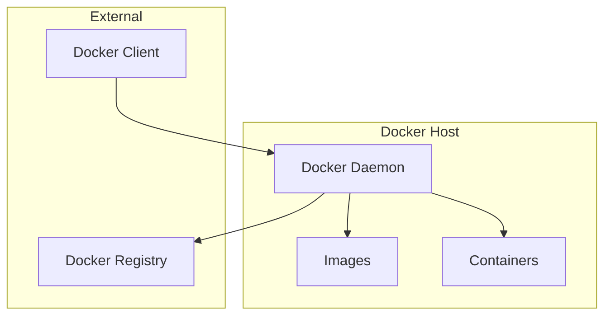
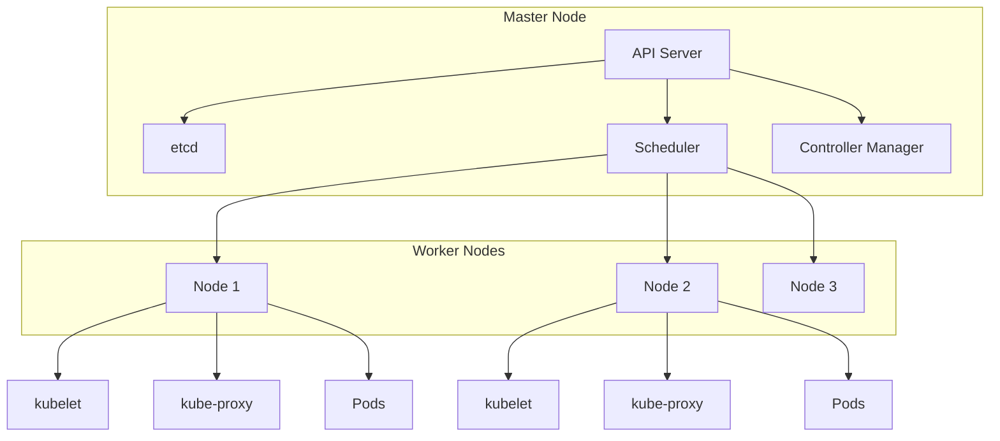
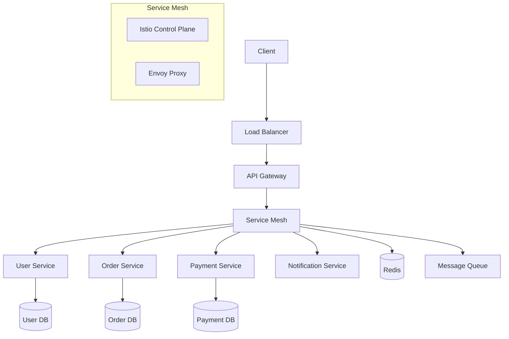
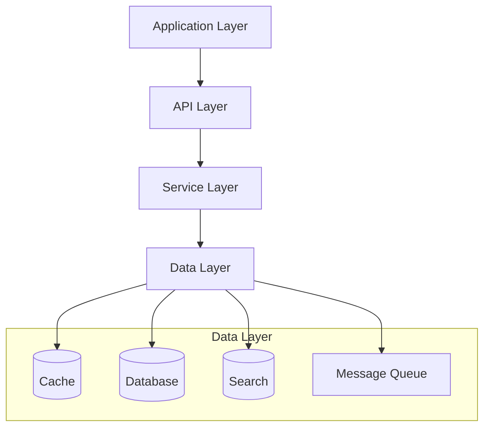

# DevOps与云原生

## 目录
- [一、Docker深度实践](#一docker深度实践)
- [二、Kubernetes完整实战](#二kubernetes完整实战)
- [三、CI/CD完整流程](#三cicd完整流程)
- [四、监控体系搭建](#四监控体系搭建)
- [五、日志收集与分析](#五日志收集与分析)
- [六、链路追踪系统](#六链路追踪系统)
- [七、云原生架构设计](#七云原生架构设计)
- [八、容器编排与调度](#八容器编排与调度)
- [九、服务网格实战](#九服务网格实战)
- [十、云原生安全](#十云原生安全)
- [十一、性能优化与调优](#十一性能优化与调优)
- [十二、故障排查与运维](#十二故障排查与运维)
- [十三、高频面试题](#十三高频面试题)

## 一、Docker深度实践

### 1.1 Docker核心概念

Docker是一个开源的容器化平台，基于Linux容器技术，提供轻量级的虚拟化解决方案。

#### 1.1.1 容器化优势

- **一致性**：开发、测试、生产环境完全一致
- **轻量级**：相比虚拟机，资源占用更少
- **快速启动**：秒级启动时间
- **可移植性**：一次构建，到处运行
- **可扩展性**：支持水平扩展

#### 1.1.2 Docker架构



### 1.2 Dockerfile最佳实践

#### 1.2.1 生产级Dockerfile

```dockerfile
# 多阶段构建 - 减少镜像大小
FROM maven:3.8.6-openjdk-17-slim AS builder

# 设置工作目录
WORKDIR /app

# 复制pom.xml并下载依赖（利用Docker缓存）
COPY pom.xml .
RUN mvn dependency:go-offline -B

# 复制源代码并构建
COPY src ./src
RUN mvn clean package -DskipTests

# 运行时镜像
FROM openjdk:17-jre-slim

# 创建非root用户
RUN groupadd -r appuser && useradd -r -g appuser appuser

# 安装必要的工具
RUN apt-get update && apt-get install -y \
    curl \
    && rm -rf /var/lib/apt/lists/*

# 设置工作目录
WORKDIR /app

# 复制jar文件
COPY --from=builder /app/target/*.jar app.jar

# 创建日志目录
RUN mkdir -p /app/logs && chown -R appuser:appuser /app

# 切换到非root用户
USER appuser

# 健康检查
HEALTHCHECK --interval=30s --timeout=3s --start-period=5s --retries=3 \
    CMD curl -f http://localhost:8080/actuator/health || exit 1

# 暴露端口
EXPOSE 8080

# JVM参数优化
ENV JAVA_OPTS="-Xms512m -Xmx1024m -XX:+UseG1GC -XX:MaxGCPauseMillis=200"

# 启动命令
ENTRYPOINT ["sh", "-c", "java $JAVA_OPTS -jar app.jar"]
```

#### 1.2.2 微服务Dockerfile模板

```dockerfile
# 微服务专用Dockerfile
FROM openjdk:17-jre-slim

# 元数据标签
LABEL maintainer="devops@company.com"
LABEL version="1.0"
LABEL description="Microservice Application"

# 环境变量
ENV APP_NAME=user-service
ENV APP_VERSION=1.0.0
ENV JAVA_OPTS="-Xms256m -Xmx512m -XX:+UseG1GC"

# 创建应用用户
RUN groupadd -r appuser && useradd -r -g appuser appuser

# 安装必要工具
RUN apt-get update && apt-get install -y \
    curl \
    dumb-init \
    && rm -rf /var/lib/apt/lists/*

# 设置工作目录
WORKDIR /app

# 复制应用文件
COPY --chown=appuser:appuser target/*.jar app.jar
COPY --chown=appuser:appuser config/ ./config/

# 创建必要的目录
RUN mkdir -p /app/logs /app/tmp && \
    chown -R appuser:appuser /app

# 切换到应用用户
USER appuser

# 健康检查
HEALTHCHECK --interval=30s --timeout=10s --start-period=60s --retries=3 \
    CMD curl -f http://localhost:8080/actuator/health/liveness || exit 1

# 暴露端口
EXPOSE 8080

# 使用dumb-init作为PID 1
ENTRYPOINT ["dumb-init", "--"]
CMD ["java", "-jar", "app.jar"]
```

### 1.3 Docker Compose生产实践

#### 1.3.1 微服务编排

```yaml
version: '3.8'

services:
  # API网关
  gateway:
    build: 
      context: ./gateway
      dockerfile: Dockerfile
    ports:
      - "8080:8080"
    environment:
      - SPRING_PROFILES_ACTIVE=docker
      - EUREKA_CLIENT_SERVICE_URL_DEFAULTZONE=http://eureka:8761/eureka
    depends_on:
      - eureka
      - user-service
      - order-service
    networks:
      - microservices
    restart: unless-stopped
    healthcheck:
      test: ["CMD", "curl", "-f", "http://localhost:8080/actuator/health"]
      interval: 30s
      timeout: 10s
      retries: 3

  # 服务注册中心
  eureka:
    image: springcloud/eureka:latest
    ports:
      - "8761:8761"
    environment:
      - SPRING_PROFILES_ACTIVE=docker
    networks:
      - microservices
    restart: unless-stopped

  # 用户服务
  user-service:
    build:
      context: ./user-service
      dockerfile: Dockerfile
    environment:
      - SPRING_PROFILES_ACTIVE=docker
      - EUREKA_CLIENT_SERVICE_URL_DEFAULTZONE=http://eureka:8761/eureka
      - MYSQL_HOST=mysql
      - REDIS_HOST=redis
    depends_on:
      - mysql
      - redis
      - eureka
    networks:
      - microservices
    restart: unless-stopped
    deploy:
      replicas: 2
      resources:
        limits:
          memory: 512M
          cpus: '0.5'
        reservations:
          memory: 256M
          cpus: '0.25'

  # 订单服务
  order-service:
    build:
      context: ./order-service
      dockerfile: Dockerfile
    environment:
      - SPRING_PROFILES_ACTIVE=docker
      - EUREKA_CLIENT_SERVICE_URL_DEFAULTZONE=http://eureka:8761/eureka
      - MYSQL_HOST=mysql
      - REDIS_HOST=redis
      - RABBITMQ_HOST=rabbitmq
    depends_on:
      - mysql
      - redis
      - rabbitmq
      - eureka
    networks:
      - microservices
    restart: unless-stopped

  # MySQL数据库
  mysql:
    image: mysql:8.0
    environment:
      MYSQL_ROOT_PASSWORD: rootpassword
      MYSQL_DATABASE: microservices
      MYSQL_USER: appuser
      MYSQL_PASSWORD: apppassword
    volumes:
      - mysql-data:/var/lib/mysql
      - ./mysql/init:/docker-entrypoint-initdb.d
    ports:
      - "3306:3306"
    networks:
      - microservices
    restart: unless-stopped
    command: --default-authentication-plugin=mysql_native_password

  # Redis缓存
  redis:
    image: redis:7-alpine
    ports:
      - "6379:6379"
    volumes:
      - redis-data:/data
    networks:
      - microservices
    restart: unless-stopped
    command: redis-server --appendonly yes

  # RabbitMQ消息队列
  rabbitmq:
    image: rabbitmq:3-management
    ports:
      - "5672:5672"
      - "15672:15672"
    environment:
      RABBITMQ_DEFAULT_USER: admin
      RABBITMQ_DEFAULT_PASS: admin
    volumes:
      - rabbitmq-data:/var/lib/rabbitmq
    networks:
      - microservices
    restart: unless-stopped

  # 监控服务
  prometheus:
    image: prom/prometheus:latest
    ports:
      - "9090:9090"
    volumes:
      - ./monitoring/prometheus.yml:/etc/prometheus/prometheus.yml
      - prometheus-data:/prometheus
    command:
      - '--config.file=/etc/prometheus/prometheus.yml'
      - '--storage.tsdb.path=/prometheus'
      - '--web.console.libraries=/etc/prometheus/console_libraries'
      - '--web.console.templates=/etc/prometheus/consoles'
    networks:
      - microservices
    restart: unless-stopped

  # Grafana可视化
  grafana:
    image: grafana/grafana:latest
    ports:
      - "3000:3000"
    environment:
      - GF_SECURITY_ADMIN_PASSWORD=admin
    volumes:
      - grafana-data:/var/lib/grafana
      - ./monitoring/grafana/dashboards:/etc/grafana/provisioning/dashboards
      - ./monitoring/grafana/datasources:/etc/grafana/provisioning/datasources
    networks:
      - microservices
    restart: unless-stopped

volumes:
  mysql-data:
  redis-data:
  rabbitmq-data:
  prometheus-data:
  grafana-data:

networks:
  microservices:
    driver: bridge
```

#### 1.3.2 开发环境配置

```yaml
# docker-compose.dev.yml
version: '3.8'

services:
  # 开发环境数据库
  mysql-dev:
    image: mysql:8.0
    environment:
      MYSQL_ROOT_PASSWORD: devpassword
      MYSQL_DATABASE: dev_microservices
    ports:
      - "3307:3306"
    volumes:
      - mysql-dev-data:/var/lib/mysql
      - ./mysql/dev/init.sql:/docker-entrypoint-initdb.d/init.sql
    command: --default-authentication-plugin=mysql_native_password

  # 开发环境Redis
  redis-dev:
    image: redis:7-alpine
    ports:
      - "6380:6379"
    volumes:
      - redis-dev-data:/data

  # 开发环境RabbitMQ
  rabbitmq-dev:
    image: rabbitmq:3-management
    ports:
      - "5673:5672"
      - "15673:15672"
    environment:
      RABBITMQ_DEFAULT_USER: dev
      RABBITMQ_DEFAULT_PASS: dev

volumes:
  mysql-dev-data:
  redis-dev-data:
```

### 1.4 Docker镜像优化

#### 1.4.1 镜像分层优化

```dockerfile
# 优化前 - 每层都很大
FROM openjdk:17-jdk-slim
WORKDIR /app
COPY . .
RUN mvn clean package
RUN rm -rf target/classes target/maven-archiver
EXPOSE 8080
CMD ["java", "-jar", "app.jar"]

# 优化后 - 利用Docker缓存
FROM maven:3.8.6-openjdk-17-slim AS builder
WORKDIR /app

# 先复制pom.xml，利用Docker缓存
COPY pom.xml .
RUN mvn dependency:go-offline -B

# 再复制源代码
COPY src ./src
RUN mvn clean package -DskipTests

# 运行时镜像
FROM openjdk:17-jre-slim
WORKDIR /app
COPY --from=builder /app/target/*.jar app.jar
EXPOSE 8080
CMD ["java", "-jar", "app.jar"]
```

#### 1.4.2 多阶段构建优化

```dockerfile
# 前端构建阶段
FROM node:18-alpine AS frontend-builder
WORKDIR /app
COPY frontend/package*.json ./
RUN npm ci --only=production
COPY frontend/ .
RUN npm run build

# 后端构建阶段
FROM maven:3.8.6-openjdk-17-slim AS backend-builder
WORKDIR /app
COPY pom.xml .
RUN mvn dependency:go-offline -B
COPY src ./src
RUN mvn clean package -DskipTests

# 最终镜像
FROM openjdk:17-jre-slim
WORKDIR /app

# 复制后端jar
COPY --from=backend-builder /app/target/*.jar app.jar

# 复制前端静态资源
COPY --from=frontend-builder /app/dist ./static

# 安装nginx
RUN apt-get update && apt-get install -y nginx && rm -rf /var/lib/apt/lists/*

# 配置nginx
COPY nginx.conf /etc/nginx/nginx.conf

EXPOSE 8080 80
CMD ["sh", "-c", "java -jar app.jar & nginx -g 'daemon off;'"]
```

### 1.5 Docker网络与存储

#### 1.5.1 网络配置

```bash
# 创建自定义网络
docker network create --driver bridge --subnet=172.20.0.0/16 microservices

# 创建overlay网络（多主机）
docker network create --driver overlay --attachable microservices-overlay

# 网络配置示例
docker run -d \
  --name app \
  --network microservices \
  --ip 172.20.0.10 \
  -p 8080:8080 \
  myapp:latest
```

#### 1.5.2 存储卷管理

```yaml
# 命名卷
volumes:
  mysql-data:
    driver: local
    driver_opts:
      type: none
      o: bind
      device: /opt/mysql/data

# 绑定挂载
services:
  app:
    volumes:
      - /host/path:/container/path:ro
      - ./config:/app/config:rw

# 临时文件系统
  temp-app:
    tmpfs:
      - /tmp:noexec,nosuid,size=100m
```

### 1.6 Docker安全实践

#### 1.6.1 安全配置

```dockerfile
# 使用非root用户
RUN groupadd -r appuser && useradd -r -g appuser appuser
USER appuser

# 最小化镜像
FROM alpine:latest
RUN apk add --no-cache openjdk17-jre

# 扫描漏洞
# docker scan myapp:latest

# 使用.dockerignore
# .dockerignore
.git
*.md
Dockerfile
docker-compose.yml
```

#### 1.6.2 运行时安全

```bash
# 限制资源使用
docker run -d \
  --name app \
  --memory=512m \
  --cpus=1.0 \
  --read-only \
  --tmpfs /tmp \
  myapp:latest

# 安全扫描
docker run --rm -v /var/run/docker.sock:/var/run/docker.sock \
  aquasec/trivy image myapp:latest

# 内容信任
export DOCKER_CONTENT_TRUST=1
docker push myapp:latest
```

### 1.7 Docker监控与日志

#### 1.7.1 容器监控

```python
# 容器监控脚本
import docker
import psutil
import time

def monitor_containers():
    client = docker.from_env()
    
    for container in client.containers.list():
        stats = container.stats(stream=False)
        
        # CPU使用率
        cpu_percent = calculate_cpu_percent(stats)
        
        # 内存使用率
        memory_usage = stats['memory_stats']['usage']
        memory_limit = stats['memory_stats']['limit']
        memory_percent = (memory_usage / memory_limit) * 100
        
        # 网络IO
        network_stats = stats['networks']
        
        print(f"Container: {container.name}")
        print(f"CPU: {cpu_percent:.2f}%")
        print(f"Memory: {memory_percent:.2f}%")
        print(f"Network: {network_stats}")
        print("-" * 50)

def calculate_cpu_percent(stats):
    cpu_delta = stats['cpu_stats']['cpu_usage']['total_usage'] - \
                stats['precpu_stats']['cpu_usage']['total_usage']
    system_delta = stats['cpu_stats']['system_cpu_usage'] - \
                   stats['precpu_stats']['system_cpu_usage']
    
    if system_delta > 0 and cpu_delta > 0:
        return (cpu_delta / system_delta) * len(stats['cpu_stats']['cpu_usage']['percpu_usage']) * 100.0
    return 0.0

if __name__ == "__main__":
    while True:
        monitor_containers()
        time.sleep(30)
```

#### 1.7.2 日志管理

```yaml
# docker-compose.yml中的日志配置
services:
  app:
    image: myapp:latest
    logging:
      driver: "json-file"
      options:
        max-size: "10m"
        max-file: "3"
    labels:
      - "logging=promtail"

  # 日志收集
  promtail:
    image: grafana/promtail:latest
    volumes:
      - /var/log:/var/log:ro
      - /var/lib/docker/containers:/var/lib/docker/containers:ro
    command: -config.file=/etc/promtail/config.yml
```

### 1.8 Docker生产部署

#### 1.8.1 部署脚本

```bash
#!/bin/bash
# deploy.sh

set -e

# 配置变量
APP_NAME="microservices"
VERSION=${1:-latest}
REGISTRY="registry.company.com"
NAMESPACE="production"

echo "开始部署 $APP_NAME:$VERSION"

# 构建镜像
echo "构建Docker镜像..."
docker build -t $APP_NAME:$VERSION .

# 标记镜像
docker tag $APP_NAME:$VERSION $REGISTRY/$NAMESPACE/$APP_NAME:$VERSION

# 推送到仓库
echo "推送镜像到仓库..."
docker push $REGISTRY/$NAMESPACE/$APP_NAME:$VERSION

# 更新服务
echo "更新服务..."
docker service update --image $REGISTRY/$NAMESPACE/$APP_NAME:$VERSION $APP_NAME

# 健康检查
echo "等待服务启动..."
sleep 30

# 检查服务状态
if curl -f http://localhost:8080/actuator/health; then
    echo "部署成功！"
else
    echo "部署失败，回滚..."
    docker service rollback $APP_NAME
    exit 1
fi
```

#### 1.8.2 滚动更新

```bash
#!/bin/bash
# rolling-update.sh

SERVICE_NAME="microservices"
NEW_VERSION=$1
CURRENT_VERSION=$(docker service inspect $SERVICE_NAME --format '{{.Spec.Labels.version}}')

echo "当前版本: $CURRENT_VERSION"
echo "新版本: $NEW_VERSION"

# 执行滚动更新
docker service update \
  --image registry.company.com/production/microservices:$NEW_VERSION \
  --update-parallelism 1 \
  --update-delay 30s \
  --update-failure-action rollback \
  $SERVICE_NAME

# 监控更新状态
while true; do
    STATUS=$(docker service inspect $SERVICE_NAME --format '{{.UpdateStatus.State}}')
    echo "更新状态: $STATUS"
    
    if [ "$STATUS" = "completed" ]; then
        echo "更新完成！"
        break
    elif [ "$STATUS" = "rollback_completed" ]; then
        echo "更新失败，已回滚！"
        exit 1
    fi
    
    sleep 10
done
```

## 二、Kubernetes完整实战

### 2.1 Kubernetes核心概念

Kubernetes是一个开源的容器编排平台，用于自动化容器的部署、扩展和管理。

#### 2.1.1 核心组件



#### 2.1.2 资源对象

- **Pod**：最小部署单元
- **Deployment**：管理Pod的副本
- **Service**：服务发现和负载均衡
- **ConfigMap**：配置管理
- **Secret**：敏感信息管理
- **Namespace**：资源隔离

### 2.2 Pod设计与优化

#### 2.2.1 生产级Pod配置

```yaml
apiVersion: v1
kind: Pod
metadata:
  name: microservice-pod
  labels:
    app: microservice
    version: v1.0
  annotations:
    prometheus.io/scrape: "true"
    prometheus.io/port: "8080"
    prometheus.io/path: "/actuator/prometheus"
spec:
  # 重启策略
  restartPolicy: Always
  
  # 安全上下文
  securityContext:
    runAsNonRoot: true
    runAsUser: 1000
    fsGroup: 1000
  
  # 容器配置
  containers:
  - name: microservice
    image: microservice:1.0.0
    imagePullPolicy: IfNotPresent
    
    # 端口配置
    ports:
    - name: http
      containerPort: 8080
      protocol: TCP
    - name: management
      containerPort: 8081
      protocol: TCP
    
    # 环境变量
    env:
    - name: SPRING_PROFILES_ACTIVE
      value: "production"
    - name: JAVA_OPTS
      value: "-Xms512m -Xmx1024m -XX:+UseG1GC"
    - name: POD_NAME
      valueFrom:
        fieldRef:
          fieldPath: metadata.name
    - name: POD_NAMESPACE
      valueFrom:
        fieldRef:
          fieldPath: metadata.namespace
    
    # 资源限制
    resources:
      requests:
        memory: "512Mi"
        cpu: "500m"
        ephemeral-storage: "1Gi"
      limits:
        memory: "1Gi"
        cpu: "1000m"
        ephemeral-storage: "2Gi"
    
    # 健康检查
    livenessProbe:
      httpGet:
        path: /actuator/health/liveness
        port: 8081
        scheme: HTTP
      initialDelaySeconds: 60
      periodSeconds: 30
      timeoutSeconds: 10
      successThreshold: 1
      failureThreshold: 3
    
    readinessProbe:
      httpGet:
        path: /actuator/health/readiness
        port: 8081
        scheme: HTTP
      initialDelaySeconds: 30
      periodSeconds: 10
      timeoutSeconds: 5
      successThreshold: 1
      failureThreshold: 3
    
    startupProbe:
      httpGet:
        path: /actuator/health
        port: 8081
        scheme: HTTP
      initialDelaySeconds: 10
      periodSeconds: 5
      timeoutSeconds: 3
      successThreshold: 1
      failureThreshold: 30
    
    # 生命周期钩子
    lifecycle:
      preStop:
        exec:
          command: ["/bin/sh", "-c", "sleep 15"]
    
    # 卷挂载
    volumeMounts:
    - name: config-volume
      mountPath: /app/config
      readOnly: true
    - name: logs-volume
      mountPath: /app/logs
    - name: tmp-volume
      mountPath: /tmp
  
  # 卷定义
  volumes:
  - name: config-volume
    configMap:
      name: microservice-config
  - name: logs-volume
    emptyDir: {}
  - name: tmp-volume
    emptyDir:
      sizeLimit: 1Gi
  
  # 节点选择
  nodeSelector:
    kubernetes.io/os: linux
    node-type: worker
  
  # 容忍度
  tolerations:
  - key: "node.kubernetes.io/not-ready"
    operator: "Exists"
    effect: "NoExecute"
    tolerationSeconds: 300
  - key: "node.kubernetes.io/unreachable"
    operator: "Exists"
    effect: "NoExecute"
    tolerationSeconds: 300
```

#### 2.2.2 多容器Pod设计

```yaml
apiVersion: v1
kind: Pod
metadata:
  name: sidecar-pod
spec:
  containers:
  # 主应用容器
  - name: app
    image: microservice:1.0.0
    ports:
    - containerPort: 8080
    
  # 日志收集容器
  - name: log-collector
    image: fluent/fluent-bit:latest
    volumeMounts:
    - name: logs
      mountPath: /var/log
    - name: fluent-bit-config
      mountPath: /fluent-bit/etc
    resources:
      requests:
        memory: "64Mi"
        cpu: "50m"
      limits:
        memory: "128Mi"
        cpu: "100m"
  
  # 监控容器
  - name: metrics-exporter
    image: prom/node-exporter:latest
    ports:
    - containerPort: 9100
    resources:
      requests:
        memory: "32Mi"
        cpu: "25m"
      limits:
        memory: "64Mi"
        cpu: "50m"
  
  volumes:
  - name: logs
    emptyDir: {}
  - name: fluent-bit-config
    configMap:
      name: fluent-bit-config
```

### 2.3 Deployment深度实践

#### 2.3.1 生产级Deployment

```yaml
apiVersion: apps/v1
kind: Deployment
metadata:
  name: microservice-deployment
  labels:
    app: microservice
    version: v1.0
spec:
  # 副本数
  replicas: 3
  
  # 选择器
  selector:
    matchLabels:
      app: microservice
      version: v1.0
  
  # 更新策略
  strategy:
    type: RollingUpdate
    rollingUpdate:
      maxUnavailable: 1
      maxSurge: 1
  
  # Pod模板
  template:
    metadata:
      labels:
        app: microservice
        version: v1.0
      annotations:
        prometheus.io/scrape: "true"
        prometheus.io/port: "8081"
    spec:
      # 服务账户
      serviceAccountName: microservice-sa
      
      # 安全上下文
      securityContext:
        runAsNonRoot: true
        runAsUser: 1000
        fsGroup: 1000
      
      # 容器配置
      containers:
      - name: microservice
        image: microservice:1.0.0
        imagePullPolicy: IfNotPresent
        
        ports:
        - name: http
          containerPort: 8080
        - name: management
          containerPort: 8081
        
        env:
        - name: SPRING_PROFILES_ACTIVE
          value: "production"
        - name: POD_NAME
          valueFrom:
            fieldRef:
              fieldPath: metadata.name
        - name: POD_NAMESPACE
          valueFrom:
            fieldRef:
              fieldPath: metadata.namespace
        
        resources:
          requests:
            memory: "512Mi"
            cpu: "500m"
          limits:
            memory: "1Gi"
            cpu: "1000m"
        
        # 健康检查
        livenessProbe:
          httpGet:
            path: /actuator/health/liveness
            port: 8081
          initialDelaySeconds: 60
          periodSeconds: 30
          timeoutSeconds: 10
          failureThreshold: 3
        
        readinessProbe:
          httpGet:
            path: /actuator/health/readiness
            port: 8081
          initialDelaySeconds: 30
          periodSeconds: 10
          timeoutSeconds: 5
          failureThreshold: 3
        
        startupProbe:
          httpGet:
            path: /actuator/health
            port: 8081
          initialDelaySeconds: 10
          periodSeconds: 5
          failureThreshold: 30
        
        # 卷挂载
        volumeMounts:
        - name: config
          mountPath: /app/config
          readOnly: true
        - name: logs
          mountPath: /app/logs
      
      # 卷定义
      volumes:
      - name: config
        configMap:
          name: microservice-config
      - name: logs
        emptyDir: {}
      
      # 节点亲和性
      affinity:
        podAntiAffinity:
          preferredDuringSchedulingIgnoredDuringExecution:
          - weight: 100
            podAffinityTerm:
              labelSelector:
                matchExpressions:
                - key: app
                  operator: In
                  values:
                  - microservice
              topologyKey: kubernetes.io/hostname
      
      # 容忍度
      tolerations:
      - key: "node.kubernetes.io/not-ready"
        operator: "Exists"
        effect: "NoExecute"
        tolerationSeconds: 300
```

#### 2.3.2 滚动更新策略

```yaml
# 蓝绿部署
apiVersion: argoproj.io/v1alpha1
kind: Rollout
metadata:
  name: microservice-rollout
spec:
  replicas: 5
  strategy:
    blueGreen:
      activeService: microservice-active
      previewService: microservice-preview
      autoPromotionEnabled: false
      scaleDownDelaySeconds: 30
      prePromotionAnalysis:
        templates:
        - templateName: success-rate
        args:
        - name: service-name
          value: microservice-preview
      postPromotionAnalysis:
        templates:
        - templateName: success-rate
        args:
        - name: service-name
          value: microservice-active
  selector:
    matchLabels:
      app: microservice
  template:
    metadata:
      labels:
        app: microservice
    spec:
      containers:
      - name: microservice
        image: microservice:1.0.0
        ports:
        - containerPort: 8080
```

### 2.4 Service与网络

#### 2.4.1 Service类型详解

```yaml
# ClusterIP Service（默认）
apiVersion: v1
kind: Service
metadata:
  name: microservice-clusterip
spec:
  type: ClusterIP
  selector:
    app: microservice
  ports:
  - name: http
    port: 80
    targetPort: 8080
    protocol: TCP

---
# NodePort Service
apiVersion: v1
kind: Service
metadata:
  name: microservice-nodeport
spec:
  type: NodePort
  selector:
    app: microservice
  ports:
  - name: http
    port: 80
    targetPort: 8080
    nodePort: 30080
    protocol: TCP

---
# LoadBalancer Service
apiVersion: v1
kind: Service
metadata:
  name: microservice-loadbalancer
  annotations:
    service.beta.kubernetes.io/aws-load-balancer-type: nlb
    service.beta.kubernetes.io/aws-load-balancer-backend-protocol: tcp
spec:
  type: LoadBalancer
  selector:
    app: microservice
  ports:
  - name: http
    port: 80
    targetPort: 8080
    protocol: TCP
  loadBalancerSourceRanges:
  - 10.0.0.0/8
  - 172.16.0.0/12
  - 192.168.0.0/16

---
# ExternalName Service
apiVersion: v1
kind: Service
metadata:
  name: microservice-external
spec:
  type: ExternalName
  externalName: microservice.example.com
  ports:
  - port: 80
    protocol: TCP
```

#### 2.4.2 Ingress配置

```yaml
apiVersion: networking.k8s.io/v1
kind: Ingress
metadata:
  name: microservice-ingress
  annotations:
    nginx.ingress.kubernetes.io/rewrite-target: /
    nginx.ingress.kubernetes.io/ssl-redirect: "true"
    nginx.ingress.kubernetes.io/rate-limit: "100"
    nginx.ingress.kubernetes.io/rate-limit-window: "1m"
    cert-manager.io/cluster-issuer: "letsencrypt-prod"
spec:
  tls:
  - hosts:
    - microservice.example.com
    secretName: microservice-tls
  rules:
  - host: microservice.example.com
    http:
      paths:
      - path: /
        pathType: Prefix
        backend:
          service:
            name: microservice-service
            port:
              number: 80
  - host: api.example.com
    http:
      paths:
      - path: /api/v1
        pathType: Prefix
        backend:
          service:
            name: microservice-service
            port:
              number: 80
```

### 2.5 ConfigMap与Secret

#### 2.5.1 ConfigMap管理

```yaml
# 配置文件ConfigMap
apiVersion: v1
kind: ConfigMap
metadata:
  name: microservice-config
  namespace: default
data:
  application.yaml: |
    server:
      port: 8080
      servlet:
        context-path: /api
    spring:
      datasource:
        url: jdbc:mysql://mysql:3306/microservice
        username: ${DB_USERNAME}
        password: ${DB_PASSWORD}
        driver-class-name: com.mysql.cj.jdbc.Driver
      redis:
        host: redis
        port: 6379
        password: ${REDIS_PASSWORD}
      jpa:
        hibernate:
          ddl-auto: update
        show-sql: false
    management:
      endpoints:
        web:
          exposure:
            include: health,info,metrics,prometheus
      endpoint:
        health:
          show-details: always
  logback-spring.xml: |
    <?xml version="1.0" encoding="UTF-8"?>
    <configuration>
      <appender name="STDOUT" class="ch.qos.logback.core.ConsoleAppender">
        <encoder>
          <pattern>%d{yyyy-MM-dd HH:mm:ss} [%thread] %-5level %logger{36} - %msg%n</pattern>
        </encoder>
      </appender>
      <root level="INFO">
        <appender-ref ref="STDOUT" />
      </root>
    </configuration>

---
# 环境变量ConfigMap
apiVersion: v1
kind: ConfigMap
metadata:
  name: microservice-env
data:
  SPRING_PROFILES_ACTIVE: "production"
  LOG_LEVEL: "INFO"
  CACHE_TTL: "3600"
  MAX_CONNECTIONS: "100"
```

#### 2.5.2 Secret管理

```yaml
# 数据库密码Secret
apiVersion: v1
kind: Secret
metadata:
  name: microservice-secrets
type: Opaque
data:
  # base64编码的密码
  db-username: YWRtaW4=
  db-password: cGFzc3dvcmQxMjM=
  redis-password: cmVkaXNwYXNz
  jwt-secret: bXlqdXRzZWNyZXQ=

---
# TLS证书Secret
apiVersion: v1
kind: Secret
metadata:
  name: microservice-tls
type: kubernetes.io/tls
data:
  tls.crt: LS0tLS1CRUdJTi...
  tls.key: LS0tLS1CRUdJTi...

---
# Docker镜像拉取Secret
apiVersion: v1
kind: Secret
metadata:
  name: registry-secret
type: kubernetes.io/dockerconfigjson
data:
  .dockerconfigjson: eyJhdXRocyI6...
```

### 2.6 存储管理

#### 2.6.1 PersistentVolume与PersistentVolumeClaim

```yaml
# PersistentVolume
apiVersion: v1
kind: PersistentVolume
metadata:
  name: mysql-pv
spec:
  capacity:
    storage: 20Gi
  accessModes:
    - ReadWriteOnce
  persistentVolumeReclaimPolicy: Retain
  storageClassName: fast-ssd
  hostPath:
    path: /data/mysql

---
# StorageClass
apiVersion: storage.k8s.io/v1
kind: StorageClass
metadata:
  name: fast-ssd
provisioner: kubernetes.io/aws-ebs
parameters:
  type: gp3
  fsType: ext4
  encrypted: "true"
reclaimPolicy: Delete
allowVolumeExpansion: true
volumeBindingMode: WaitForFirstConsumer

---
# PersistentVolumeClaim
apiVersion: v1
kind: PersistentVolumeClaim
metadata:
  name: mysql-pvc
spec:
  accessModes:
    - ReadWriteOnce
  resources:
    requests:
      storage: 10Gi
  storageClassName: fast-ssd
```

#### 2.6.2 StatefulSet

```yaml
apiVersion: apps/v1
kind: StatefulSet
metadata:
  name: mysql-statefulset
spec:
  serviceName: mysql
  replicas: 3
  selector:
    matchLabels:
      app: mysql
  template:
    metadata:
      labels:
        app: mysql
    spec:
      containers:
      - name: mysql
        image: mysql:8.0
        ports:
        - containerPort: 3306
        env:
        - name: MYSQL_ROOT_PASSWORD
          valueFrom:
            secretKeyRef:
              name: mysql-secret
              key: root-password
        - name: MYSQL_DATABASE
          value: microservice
        - name: MYSQL_USER
          valueFrom:
            secretKeyRef:
              name: mysql-secret
              key: username
        - name: MYSQL_PASSWORD
          valueFrom:
            secretKeyRef:
              name: mysql-secret
              key: password
        volumeMounts:
        - name: mysql-storage
          mountPath: /var/lib/mysql
        - name: mysql-config
          mountPath: /etc/mysql/conf.d
  volumeClaimTemplates:
  - metadata:
      name: mysql-storage
    spec:
      accessModes: ["ReadWriteOnce"]
      resources:
        requests:
          storage: 10Gi
      storageClassName: fast-ssd
```

### 2.7 自动扩缩容

#### 2.7.1 HorizontalPodAutoscaler

```yaml
apiVersion: autoscaling/v2
kind: HorizontalPodAutoscaler
metadata:
  name: microservice-hpa
spec:
  scaleTargetRef:
    apiVersion: apps/v1
    kind: Deployment
    name: microservice-deployment
  minReplicas: 3
  maxReplicas: 10
  metrics:
  - type: Resource
    resource:
      name: cpu
      target:
        type: Utilization
        averageUtilization: 70
  - type: Resource
    resource:
      name: memory
      target:
        type: Utilization
        averageUtilization: 80
  - type: Pods
    pods:
      metric:
        name: http_requests_per_second
      target:
        type: AverageValue
        averageValue: "100"
  behavior:
    scaleUp:
      stabilizationWindowSeconds: 60
      policies:
      - type: Percent
        value: 100
        periodSeconds: 15
    scaleDown:
      stabilizationWindowSeconds: 300
      policies:
      - type: Percent
        value: 10
        periodSeconds: 60
```

#### 2.7.2 VerticalPodAutoscaler

```yaml
apiVersion: autoscaling.k8s.io/v1
kind: VerticalPodAutoscaler
metadata:
  name: microservice-vpa
spec:
  targetRef:
    apiVersion: apps/v1
    kind: Deployment
    name: microservice-deployment
  updatePolicy:
    updateMode: "Auto"
  resourcePolicy:
    containerPolicies:
    - containerName: microservice
      minAllowed:
        cpu: 100m
        memory: 128Mi
      maxAllowed:
        cpu: 2000m
        memory: 4Gi
      controlledResources: ["cpu", "memory"]
```

### 2.8 监控与日志

#### 2.8.1 ServiceMonitor

```yaml
apiVersion: monitoring.coreos.com/v1
kind: ServiceMonitor
metadata:
  name: microservice-monitor
  labels:
    app: microservice
spec:
  selector:
    matchLabels:
      app: microservice
  endpoints:
  - port: management
    path: /actuator/prometheus
    interval: 30s
    scrapeTimeout: 10s
```

#### 2.8.2 PodMonitor

```yaml
apiVersion: monitoring.coreos.com/v1
kind: PodMonitor
metadata:
  name: microservice-pod-monitor
spec:
  selector:
    matchLabels:
      app: microservice
  podMetricsEndpoints:
  - port: management
    path: /actuator/prometheus
    interval: 30s
```

### 2.9 网络策略

#### 2.9.1 NetworkPolicy

```yaml
apiVersion: networking.k8s.io/v1
kind: NetworkPolicy
metadata:
  name: microservice-network-policy
spec:
  podSelector:
    matchLabels:
      app: microservice
  policyTypes:
  - Ingress
  - Egress
  ingress:
  - from:
    - namespaceSelector:
        matchLabels:
          name: ingress-nginx
    - podSelector:
        matchLabels:
          app: gateway
    ports:
    - protocol: TCP
      port: 8080
  egress:
  - to:
    - podSelector:
        matchLabels:
          app: mysql
    ports:
    - protocol: TCP
      port: 3306
  - to:
    - podSelector:
        matchLabels:
          app: redis
    ports:
    - protocol: TCP
      port: 6379
  - to: []
    ports:
    - protocol: TCP
      port: 53
    - protocol: UDP
      port: 53
```

### 2.10 作业与定时任务

#### 2.10.1 Job

```yaml
apiVersion: batch/v1
kind: Job
metadata:
  name: data-migration-job
spec:
  ttlSecondsAfterFinished: 300
  backoffLimit: 3
  template:
    spec:
      restartPolicy: OnFailure
      containers:
      - name: migration
        image: migration-tool:1.0.0
        command: ["/bin/sh"]
        args: ["-c", "python migrate.py"]
        env:
        - name: DB_HOST
          value: "mysql"
        - name: DB_NAME
          value: "microservice"
        resources:
          requests:
            memory: "256Mi"
            cpu: "200m"
          limits:
            memory: "512Mi"
            cpu: "500m"
```

#### 2.10.2 CronJob

```yaml
apiVersion: batch/v1
kind: CronJob
metadata:
  name: backup-cronjob
spec:
  schedule: "0 2 * * *"  # 每天凌晨2点
  timeZone: "Asia/Shanghai"
  concurrencyPolicy: Forbid
  successfulJobsHistoryLimit: 3
  failedJobsHistoryLimit: 1
  jobTemplate:
    spec:
      template:
        spec:
          restartPolicy: OnFailure
          containers:
          - name: backup
            image: backup-tool:1.0.0
            command: ["/bin/sh"]
            args: ["-c", "backup.sh"]
            env:
            - name: BACKUP_PATH
              value: "/backup"
            volumeMounts:
            - name: backup-storage
              mountPath: /backup
          volumes:
          - name: backup-storage
            persistentVolumeClaim:
              claimName: backup-pvc
```

## 三、CI/CD完整流程

### 3.1 Jenkins Pipeline深度实践

#### 3.1.1 生产级Pipeline

```groovy
pipeline {
    agent {
        kubernetes {
            yaml """
                apiVersion: v1
                kind: Pod
                spec:
                  containers:
                  - name: maven
                    image: maven:3.8.6-openjdk-17
                    command:
                    - cat
                    tty: true
                    volumeMounts:
                    - name: maven-cache
                      mountPath: /root/.m2
                  - name: docker
                    image: docker:20.10.16
                    command:
                    - cat
                    tty: true
                    volumeMounts:
                    - name: docker-sock
                      mountPath: /var/run/docker.sock
                  - name: kubectl
                    image: bitnami/kubectl:latest
                    command:
                    - cat
                    tty: true
                  volumes:
                  - name: maven-cache
                    emptyDir: {}
                  - name: docker-sock
                    hostPath:
                      path: /var/run/docker.sock
            """
        }
    }
    
    environment {
        DOCKER_REGISTRY = 'registry.company.com'
        KUBECONFIG = credentials('kubeconfig')
        SONAR_TOKEN = credentials('sonar-token')
    }
    
    options {
        timeout(time: 30, unit: 'MINUTES')
        timestamps()
        ansiColor('xterm')
        buildDiscarder(logRotator(numToKeepStr: '10'))
    }
    
    stages {
        stage('Checkout') {
            steps {
                checkout scm
                script {
                    env.GIT_COMMIT_SHORT = sh(
                        script: 'git rev-parse --short HEAD',
                        returnStdout: true
                    ).trim()
                    env.BUILD_TAG = "${env.BUILD_NUMBER}-${env.GIT_COMMIT_SHORT}"
                }
            }
        }
        
        stage('Build') {
            steps {
                container('maven') {
                    sh '''
                        mvn clean compile -DskipTests
                        mvn dependency:resolve
                        mvn dependency:analyze
                    '''
                }
            }
        }
        
        stage('Test') {
            parallel {
                stage('Unit Tests') {
                    steps {
                        container('maven') {
                            sh 'mvn test -Dmaven.test.failure.ignore=true'
                        }
                    }
                    post {
                        always {
                            publishTestResults testResultsPattern: 'target/surefire-reports/*.xml'
                            publishCoverage adapters: [
                                jacocoAdapter('target/site/jacoco/jacoco.xml')
                            ], sourceFileResolver: sourceFiles('STORE_LAST_BUILD')
                        }
                    }
                }
                
                stage('Integration Tests') {
                    steps {
                        container('maven') {
                            sh 'mvn verify -Pintegration-tests'
                        }
                    }
                }
            }
        }
        
        stage('Code Quality') {
            steps {
                container('maven') {
                    sh '''
                        mvn sonar:sonar \
                            -Dsonar.projectKey=microservice \
                            -Dsonar.host.url=https://sonar.company.com \
                            -Dsonar.login=${SONAR_TOKEN}
                    '''
                }
            }
        }
        
        stage('Security Scan') {
            steps {
                container('maven') {
                    sh '''
                        mvn org.owasp:dependency-check-maven:check
                        mvn com.github.spotbugs:spotbugs-maven-plugin:check
                    '''
                }
            }
            post {
                always {
                    publishHTML([
                        allowMissing: false,
                        alwaysLinkToLastBuild: true,
                        keepAll: true,
                        reportDir: 'target',
                        reportFiles: 'dependency-check-report.html',
                        reportName: 'Dependency Check Report'
                    ])
                }
            }
        }
        
        stage('Docker Build') {
            steps {
                container('docker') {
                    script {
                        def image = docker.build("${DOCKER_REGISTRY}/microservice:${BUILD_TAG}")
                        docker.withRegistry("https://${DOCKER_REGISTRY}", 'docker-registry-credentials') {
                            image.push()
                            image.push('latest')
                        }
                    }
                }
            }
        }
        
        stage('Deploy to Staging') {
            when {
                branch 'develop'
            }
            steps {
                container('kubectl') {
                    sh '''
                        kubectl config use-context staging
                        kubectl set image deployment/microservice \
                            microservice=${DOCKER_REGISTRY}/microservice:${BUILD_TAG} \
                            -n staging
                        kubectl rollout status deployment/microservice -n staging
                    '''
                }
            }
        }
        
        stage('Integration Tests on Staging') {
            when {
                branch 'develop'
            }
            steps {
                sh '''
                    # 等待服务启动
                    sleep 30
                    
                    # 运行集成测试
                    mvn test -Pstaging-tests
                '''
            }
        }
        
        stage('Deploy to Production') {
            when {
                branch 'main'
            }
            steps {
                input message: 'Deploy to Production?', ok: 'Deploy'
                container('kubectl') {
                    sh '''
                        kubectl config use-context production
                        kubectl set image deployment/microservice \
                            microservice=${DOCKER_REGISTRY}/microservice:${BUILD_TAG} \
                            -n production
                        kubectl rollout status deployment/microservice -n production
                    '''
                }
            }
        }
    }
    
    post {
        always {
            cleanWs()
        }
        success {
            script {
                if (env.BRANCH_NAME == 'main') {
                    slackSend(
                        channel: '#deployments',
                        color: 'good',
                        message: "✅ Production deployment successful!\n" +
                                "Build: ${env.BUILD_NUMBER}\n" +
                                "Commit: ${env.GIT_COMMIT_SHORT}\n" +
                                "Image: ${DOCKER_REGISTRY}/microservice:${BUILD_TAG}"
                    )
                }
            }
        }
        failure {
            script {
                slackSend(
                    channel: '#deployments',
                    color: 'danger',
                    message: "❌ Build failed!\n" +
                            "Build: ${env.BUILD_NUMBER}\n" +
                            "Branch: ${env.BRANCH_NAME}\n" +
                            "Commit: ${env.GIT_COMMIT_SHORT}\n" +
                            "Console: ${env.BUILD_URL}console"
                )
            }
        }
    }
}
```

#### 3.1.2 多分支Pipeline

```groovy
pipeline {
    agent any
    
    stages {
        stage('Build') {
            steps {
                sh 'mvn clean package -DskipTests'
            }
        }
        
        stage('Test') {
            parallel {
                stage('Unit Tests') {
            steps {
                sh 'mvn test'
                    }
                }
                stage('Code Quality') {
                    steps {
                        sh 'mvn sonar:sonar'
                    }
                }
            }
        }
        
        stage('Docker Build') {
            steps {
                script {
                    def image = docker.build("microservice:${env.BRANCH_NAME}-${env.BUILD_NUMBER}")
                    docker.withRegistry('https://registry.company.com', 'docker-registry-credentials') {
                        image.push()
                    }
                }
            }
        }
        
        stage('Deploy') {
            steps {
                script {
                    switch(env.BRANCH_NAME) {
                        case 'main':
                            sh 'kubectl apply -f k8s/production/'
                            break
                        case 'develop':
                            sh 'kubectl apply -f k8s/staging/'
                            break
                        default:
                            sh 'kubectl apply -f k8s/development/'
                    }
                }
            }
        }
    }
}
```

### 3.2 GitLab CI深度实践

#### 3.2.1 生产级GitLab CI

```yaml
# .gitlab-ci.yml
stages:
  - build
  - test
  - security
  - package
  - deploy

variables:
  DOCKER_DRIVER: overlay2
  DOCKER_TLS_CERTDIR: "/certs"
  MAVEN_OPTS: "-Dmaven.repo.local=$CI_PROJECT_DIR/.m2/repository"
  MAVEN_CLI_OPTS: "--batch-mode --errors --fail-at-end --show-version"

# 缓存配置
cache:
  paths:
    - .m2/repository/
    - target/

# 构建阶段
build:
  stage: build
  image: maven:3.8.6-openjdk-17
  script:
    - mvn clean compile -DskipTests
    - mvn dependency:resolve
  artifacts:
    paths:
      - target/
    expire_in: 1 hour

# 单元测试
unit-tests:
  stage: test
  image: maven:3.8.6-openjdk-17
  script:
    - mvn test -Dmaven.test.failure.ignore=true
  artifacts:
    reports:
      junit:
        - target/surefire-reports/TEST-*.xml
    paths:
      - target/site/jacoco/
    expire_in: 1 week
  coverage: '/Total.*?([0-9]{1,3})%/'

# 集成测试
integration-tests:
  stage: test
  image: maven:3.8.6-openjdk-17
  services:
    - name: mysql:8.0
      alias: mysql
    - name: redis:7
      alias: redis
  variables:
    MYSQL_DATABASE: testdb
    MYSQL_ROOT_PASSWORD: testpass
    MYSQL_USER: testuser
    MYSQL_PASSWORD: testpass
  script:
    - mvn verify -Pintegration-tests
  artifacts:
    reports:
      junit:
        - target/failsafe-reports/TEST-*.xml

# 代码质量检查
code-quality:
  stage: test
  image: maven:3.8.6-openjdk-17
  script:
    - mvn sonar:sonar
        -Dsonar.projectKey=microservice
        -Dsonar.host.url=$SONAR_HOST_URL
        -Dsonar.login=$SONAR_TOKEN
  allow_failure: true

# 安全扫描
security-scan:
  stage: security
  image: maven:3.8.6-openjdk-17
  script:
    - mvn org.owasp:dependency-check-maven:check
    - mvn com.github.spotbugs:spotbugs-maven-plugin:check
  artifacts:
    reports:
      dependency_scanning: target/dependency-check-report.json
      sast: target/spotbugsXml.xml
    paths:
      - target/dependency-check-report.html
    expire_in: 1 week
  allow_failure: true

# 构建Docker镜像
build-image:
  stage: package
  image: docker:20.10.16
  services:
    - docker:20.10.16-dind
  before_script:
    - docker login -u $CI_REGISTRY_USER -p $CI_REGISTRY_PASSWORD $CI_REGISTRY
  script:
    - docker build -t $CI_REGISTRY_IMAGE:$CI_COMMIT_SHA .
    - docker build -t $CI_REGISTRY_IMAGE:latest .
    - docker push $CI_REGISTRY_IMAGE:$CI_COMMIT_SHA
    - docker push $CI_REGISTRY_IMAGE:latest
  only:
    - main
    - develop

# 部署到开发环境
deploy-dev:
  stage: deploy
  image: bitnami/kubectl:latest
  script:
    - kubectl config use-context dev
    - kubectl set image deployment/microservice 
        microservice=$CI_REGISTRY_IMAGE:$CI_COMMIT_SHA
    - kubectl rollout status deployment/microservice
  environment:
    name: development
    url: https://dev.microservice.company.com
  only:
    - develop

# 部署到生产环境
deploy-prod:
  stage: deploy
  image: bitnami/kubectl:latest
  script:
    - kubectl config use-context prod
    - kubectl set image deployment/microservice 
        microservice=$CI_REGISTRY_IMAGE:$CI_COMMIT_SHA
    - kubectl rollout status deployment/microservice
  environment:
    name: production
    url: https://microservice.company.com
  when: manual
  only:
    - main
```

#### 3.2.2 GitLab CI模板

```yaml
# .gitlab-ci-templates.yml
# Maven构建模板
.maven_template: &maven_template
  image: maven:3.8.6-openjdk-17
  cache:
    paths:
      - .m2/repository/
  variables:
    MAVEN_OPTS: "-Dmaven.repo.local=$CI_PROJECT_DIR/.m2/repository"

# Docker构建模板
.docker_template: &docker_template
  image: docker:20.10.16
  services:
    - docker:20.10.16-dind
  before_script:
    - docker login -u $CI_REGISTRY_USER -p $CI_REGISTRY_PASSWORD $CI_REGISTRY

# Kubernetes部署模板
.k8s_template: &k8s_template
  image: bitnami/kubectl:latest
  before_script:
    - echo "$KUBECONFIG" | base64 -d > kubeconfig
    - export KUBECONFIG=kubeconfig

# 使用模板
build:
  <<: *maven_template
  script:
    - mvn clean package

docker-build:
  <<: *docker_template
  script:
    - docker build -t $CI_REGISTRY_IMAGE:$CI_COMMIT_SHA .
    - docker push $CI_REGISTRY_IMAGE:$CI_COMMIT_SHA

deploy:
  <<: *k8s_template
  script:
    - kubectl apply -f k8s/
```

### 3.3 GitHub Actions

#### 3.3.1 生产级GitHub Actions

```yaml
# .github/workflows/ci-cd.yml
name: CI/CD Pipeline

on:
  push:
    branches: [ main, develop ]
  pull_request:
    branches: [ main ]

env:
  REGISTRY: ghcr.io
  IMAGE_NAME: ${{ github.repository }}

jobs:
  test:
    runs-on: ubuntu-latest
    strategy:
      matrix:
        java-version: [17, 18]
    
    steps:
    - name: Checkout code
      uses: actions/checkout@v3
      
    - name: Set up JDK ${{ matrix.java-version }}
      uses: actions/setup-java@v3
      with:
        java-version: ${{ matrix.java-version }}
        distribution: 'temurin'
        
    - name: Cache Maven dependencies
      uses: actions/cache@v3
      with:
        path: ~/.m2
        key: ${{ runner.os }}-m2-${{ hashFiles('**/pom.xml') }}
        restore-keys: ${{ runner.os }}-m2
        
    - name: Run tests
      run: mvn clean test
      
    - name: Upload test results
      uses: actions/upload-artifact@v3
      if: always()
      with:
        name: test-results-java-${{ matrix.java-version }}
        path: target/surefire-reports/

  security:
    runs-on: ubuntu-latest
    steps:
    - name: Checkout code
      uses: actions/checkout@v3
      
    - name: Set up JDK
      uses: actions/setup-java@v3
      with:
        java-version: 17
        distribution: 'temurin'
        
    - name: Run OWASP Dependency Check
      uses: dependency-check/Dependency-Check_Action@main
      with:
        project: 'microservice'
        path: '.'
        format: 'JSON'
        
    - name: Upload security results
      uses: actions/upload-artifact@v3
      with:
        name: security-results
        path: reports/

  build:
    needs: [test, security]
    runs-on: ubuntu-latest
    if: github.ref == 'refs/heads/main' || github.ref == 'refs/heads/develop'
    
    steps:
    - name: Checkout code
      uses: actions/checkout@v3
      
    - name: Set up Docker Buildx
      uses: docker/setup-buildx-action@v2
      
    - name: Log in to Container Registry
      uses: docker/login@v2
      with:
        registry: ${{ env.REGISTRY }}
        username: ${{ github.actor }}
        password: ${{ secrets.GITHUB_TOKEN }}
        
    - name: Extract metadata
      id: meta
      uses: docker/metadata-action@v4
      with:
        images: ${{ env.REGISTRY }}/${{ env.IMAGE_NAME }}
        tags: |
          type=ref,event=branch
          type=ref,event=pr
          type=sha,prefix={{branch}}-
          type=raw,value=latest,enable={{is_default_branch}}
          
    - name: Build and push Docker image
      uses: docker/build-push-action@v4
      with:
        context: .
        push: true
        tags: ${{ steps.meta.outputs.tags }}
        labels: ${{ steps.meta.outputs.labels }}
        cache-from: type=gha
        cache-to: type=gha,mode=max

  deploy:
    needs: build
    runs-on: ubuntu-latest
    if: github.ref == 'refs/heads/main'
    environment: production
    
    steps:
    - name: Checkout code
      uses: actions/checkout@v3
      
    - name: Configure kubectl
      uses: azure/k8s-set-context@v3
      with:
        method: kubeconfig
        kubeconfig: ${{ secrets.KUBE_CONFIG }}
        
    - name: Deploy to Kubernetes
      run: |
        kubectl set image deployment/microservice 
          microservice=${{ env.REGISTRY }}/${{ env.IMAGE_NAME }}:${{ github.sha }}
        kubectl rollout status deployment/microservice
        
    - name: Notify deployment
      uses: 8398a7/action-slack@v3
      with:
        status: ${{ job.status }}
        channel: '#deployments'
        webhook_url: ${{ secrets.SLACK_WEBHOOK }}
```

### 3.4 ArgoCD GitOps

#### 3.4.1 ArgoCD应用配置

```yaml
# argocd-app.yaml
apiVersion: argoproj.io/v1alpha1
kind: Application
metadata:
  name: microservice
  namespace: argocd
spec:
  project: default
  source:
    repoURL: https://github.com/company/k8s-manifests
    targetRevision: HEAD
    path: microservice
  destination:
    server: https://kubernetes.default.svc
    namespace: production
  syncPolicy:
    automated:
      prune: true
      selfHeal: true
    syncOptions:
    - CreateNamespace=true
    - PrunePropagationPolicy=foreground
    - PruneLast=true
  revisionHistoryLimit: 10
```

#### 3.4.2 Kustomize配置

```yaml
# kustomization.yaml
apiVersion: kustomize.config.k8s.io/v1beta1
kind: Kustomization

resources:
- deployment.yaml
- service.yaml
- configmap.yaml
- secret.yaml

patchesStrategicMerge:
- patches/production.yaml

images:
- name: microservice
  newTag: v1.2.3

configMapGenerator:
- name: microservice-config
  literals:
  - ENV=production
  - LOG_LEVEL=INFO

secretGenerator:
- name: microservice-secrets
  literals:
  - DB_PASSWORD=secretpassword
  - JWT_SECRET=secretjwt
```

## 四、监控体系搭建

### 4.1 Prometheus完整配置

#### 4.1.1 Prometheus服务器配置

```yaml
# prometheus-config.yaml
apiVersion: v1
kind: ConfigMap
metadata:
  name: prometheus-config
data:
  prometheus.yml: |
global:
  scrape_interval: 15s
      evaluation_interval: 15s
      external_labels:
        cluster: 'production'
        replica: 'prometheus-1'
    
    rule_files:
      - "/etc/prometheus/rules/*.yml"
    
    alerting:
      alertmanagers:
        - static_configs:
            - targets:
              - alertmanager:9093

scrape_configs:
      # Prometheus自身监控
      - job_name: 'prometheus'
    static_configs:
          - targets: ['localhost:9090']
    
      # Kubernetes API Server
      - job_name: 'kubernetes-apiservers'
        kubernetes_sd_configs:
          - role: endpoints
        scheme: https
        tls_config:
          ca_file: /var/run/secrets/kubernetes.io/serviceaccount/ca.crt
        bearer_token_file: /var/run/secrets/kubernetes.io/serviceaccount/token
        relabel_configs:
          - source_labels: [__meta_kubernetes_namespace, __meta_kubernetes_service_name, __meta_kubernetes_endpoint_port_name]
            action: keep
            regex: default;kubernetes;https
    
      # Kubernetes Nodes
      - job_name: 'kubernetes-nodes'
        kubernetes_sd_configs:
          - role: node
        scheme: https
        tls_config:
          ca_file: /var/run/secrets/kubernetes.io/serviceaccount/ca.crt
        bearer_token_file: /var/run/secrets/kubernetes.io/serviceaccount/token
        relabel_configs:
          - action: labelmap
            regex: __meta_kubernetes_node_label_(.+)
          - target_label: __address__
            replacement: kubernetes.default.svc:443
          - source_labels: [__meta_kubernetes_node_name]
            regex: (.+)
            target_label: __metrics_path__
            replacement: /api/v1/nodes/${1}/proxy/metrics
    
      # Kubernetes Pods
      - job_name: 'kubernetes-pods'
        kubernetes_sd_configs:
          - role: pod
        relabel_configs:
          - source_labels: [__meta_kubernetes_pod_annotation_prometheus_io_scrape]
            action: keep
            regex: true
          - source_labels: [__meta_kubernetes_pod_annotation_prometheus_io_path]
            action: replace
            target_label: __metrics_path__
            regex: (.+)
          - source_labels: [__address__, __meta_kubernetes_pod_annotation_prometheus_io_port]
            action: replace
            regex: ([^:]+)(?::\d+)?;(\d+)
            replacement: $1:$2
            target_label: __address__
          - action: labelmap
            regex: __meta_kubernetes_pod_label_(.+)
          - source_labels: [__meta_kubernetes_namespace]
            action: replace
            target_label: kubernetes_namespace
          - source_labels: [__meta_kubernetes_pod_name]
            action: replace
            target_label: kubernetes_pod_name
    
      # 应用监控
      - job_name: 'microservice'
        kubernetes_sd_configs:
          - role: endpoints
        relabel_configs:
          - source_labels: [__meta_kubernetes_service_annotation_prometheus_io_scrape]
            action: keep
            regex: true
          - source_labels: [__meta_kubernetes_service_annotation_prometheus_io_scheme]
            action: replace
            target_label: __scheme__
            regex: (https?)
          - source_labels: [__address__, __meta_kubernetes_service_annotation_prometheus_io_path]
            action: replace
            target_label: __metrics_path__
            regex: (.+)(?::\d+)?(.+)
            replacement: $2
          - source_labels: [__address__]
            action: replace
            target_label: __address__
            regex: (.+)
            replacement: $1:8080
          - action: labelmap
            regex: __meta_kubernetes_service_label_(.+)
          - source_labels: [__meta_kubernetes_namespace]
            action: replace
            target_label: kubernetes_namespace
          - source_labels: [__meta_kubernetes_service_name]
            action: replace
            target_label: kubernetes_name
```

#### 4.1.2 告警规则配置

```yaml
# prometheus-rules.yaml
apiVersion: monitoring.coreos.com/v1
kind: PrometheusRule
metadata:
  name: microservice-rules
  labels:
    app: microservice
spec:
  groups:
  - name: microservice.rules
    rules:
    # 高错误率告警
    - alert: HighErrorRate
      expr: rate(http_requests_total{status=~"5.."}[5m]) > 0.1
      for: 5m
      labels:
        severity: critical
      annotations:
        summary: "High error rate detected"
        description: "Error rate is {{ $value }} errors per second"
    
    # 高响应时间告警
    - alert: HighResponseTime
      expr: histogram_quantile(0.95, rate(http_request_duration_seconds_bucket[5m])) > 1
      for: 5m
      labels:
        severity: warning
      annotations:
        summary: "High response time detected"
        description: "95th percentile response time is {{ $value }} seconds"
    
    # 内存使用率告警
    - alert: HighMemoryUsage
      expr: (container_memory_usage_bytes / container_spec_memory_limit_bytes) > 0.8
      for: 5m
      labels:
        severity: warning
      annotations:
        summary: "High memory usage detected"
        description: "Memory usage is {{ $value | humanizePercentage }}"
    
    # CPU使用率告警
    - alert: HighCPUUsage
      expr: rate(container_cpu_usage_seconds_total[5m]) > 0.8
      for: 5m
      labels:
        severity: warning
      annotations:
        summary: "High CPU usage detected"
        description: "CPU usage is {{ $value | humanizePercentage }}"
    
    # Pod重启告警
    - alert: PodRestarting
      expr: rate(kube_pod_container_status_restarts_total[15m]) > 0
      for: 5m
      labels:
        severity: warning
      annotations:
        summary: "Pod is restarting frequently"
        description: "Pod {{ $labels.pod }} is restarting {{ $value }} times per minute"
```

### 4.2 Grafana仪表板

#### 4.2.1 应用监控仪表板

```json
{
  "dashboard": {
    "id": null,
    "title": "Microservice Monitoring",
    "tags": ["microservice", "kubernetes"],
    "timezone": "browser",
    "panels": [
      {
        "id": 1,
        "title": "Request Rate",
        "type": "graph",
        "targets": [
          {
            "expr": "rate(http_requests_total[5m])",
            "legendFormat": "{{method}} {{status}}"
          }
        ],
        "yAxes": [
          {
            "label": "requests/sec"
          }
        ]
      },
      {
        "id": 2,
        "title": "Response Time",
        "type": "graph",
        "targets": [
          {
            "expr": "histogram_quantile(0.50, rate(http_request_duration_seconds_bucket[5m]))",
            "legendFormat": "50th percentile"
          },
          {
            "expr": "histogram_quantile(0.95, rate(http_request_duration_seconds_bucket[5m]))",
            "legendFormat": "95th percentile"
          },
          {
            "expr": "histogram_quantile(0.99, rate(http_request_duration_seconds_bucket[5m]))",
            "legendFormat": "99th percentile"
          }
        ],
        "yAxes": [
          {
            "label": "seconds"
          }
        ]
      },
      {
        "id": 3,
        "title": "Error Rate",
        "type": "graph",
        "targets": [
          {
            "expr": "rate(http_requests_total{status=~\"5..\"}[5m])",
            "legendFormat": "5xx errors"
          },
          {
            "expr": "rate(http_requests_total{status=~\"4..\"}[5m])",
            "legendFormat": "4xx errors"
          }
        ],
        "yAxes": [
          {
            "label": "errors/sec"
          }
        ]
      },
      {
        "id": 4,
        "title": "JVM Memory",
        "type": "graph",
        "targets": [
          {
            "expr": "jvm_memory_used_bytes{area=\"heap\"}",
            "legendFormat": "Used"
          },
          {
            "expr": "jvm_memory_max_bytes{area=\"heap\"}",
            "legendFormat": "Max"
          }
        ],
        "yAxes": [
          {
            "label": "bytes"
          }
        ]
      },
      {
        "id": 5,
        "title": "Pod Status",
        "type": "table",
        "targets": [
          {
            "expr": "kube_pod_status_phase",
            "format": "table"
          }
        ]
      }
    ],
    "time": {
      "from": "now-1h",
      "to": "now"
    },
    "refresh": "30s"
  }
}
```

### 4.3 AlertManager配置

#### 4.3.1 AlertManager规则

```yaml
# alertmanager-config.yaml
apiVersion: v1
kind: ConfigMap
metadata:
  name: alertmanager-config
data:
  alertmanager.yml: |
    global:
      smtp_smarthost: 'smtp.company.com:587'
      smtp_from: 'alerts@company.com'
      smtp_auth_username: 'alerts@company.com'
      smtp_auth_password: 'password'
    
    route:
      group_by: ['alertname', 'cluster', 'service']
      group_wait: 10s
      group_interval: 10s
      repeat_interval: 1h
      receiver: 'web.hook'
      routes:
      - match:
          severity: critical
        receiver: 'critical-alerts'
      - match:
          severity: warning
        receiver: 'warning-alerts'
    
    receivers:
    - name: 'web.hook'
      webhook_configs:
      - url: 'http://webhook:5001/'
    
    - name: 'critical-alerts'
      email_configs:
      - to: 'oncall@company.com'
        subject: '[CRITICAL] {{ .GroupLabels.alertname }}'
        body: |
          {{ range .Alerts }}
          Alert: {{ .Annotations.summary }}
          Description: {{ .Annotations.description }}
          {{ end }}
      slack_configs:
      - api_url: 'https://hooks.slack.com/services/...'
        channel: '#alerts-critical'
        title: 'Critical Alert'
        text: '{{ range .Alerts }}{{ .Annotations.summary }}{{ end }}'
    
    - name: 'warning-alerts'
      email_configs:
      - to: 'devops@company.com'
        subject: '[WARNING] {{ .GroupLabels.alertname }}'
        body: |
          {{ range .Alerts }}
          Alert: {{ .Annotations.summary }}
          Description: {{ .Annotations.description }}
          {{ end }}
```

## 五、日志收集与分析

### 5.1 ELK Stack配置

#### 5.1.1 Elasticsearch配置

```yaml
# elasticsearch.yaml
apiVersion: v1
kind: ConfigMap
metadata:
  name: elasticsearch-config
data:
  elasticsearch.yml: |
    cluster.name: microservice-cluster
    node.name: ${HOSTNAME}
    network.host: 0.0.0.0
    discovery.seed_hosts: ["elasticsearch-0", "elasticsearch-1", "elasticsearch-2"]
    cluster.initial_master_nodes: ["elasticsearch-0", "elasticsearch-1", "elasticsearch-2"]
    
    # 安全配置
    xpack.security.enabled: true
    xpack.security.transport.ssl.enabled: true
    xpack.security.transport.ssl.verification_mode: certificate
    xpack.security.transport.ssl.key: /usr/share/elasticsearch/config/certs/elasticsearch.key
    xpack.security.transport.ssl.certificate: /usr/share/elasticsearch/config/certs/elasticsearch.crt
    xpack.security.transport.ssl.certificate_authorities: /usr/share/elasticsearch/config/certs/ca.crt
    
    # 性能配置
    bootstrap.memory_lock: true
    indices.memory.index_buffer_size: 30%
    indices.queries.cache.size: 20%
    
    # 日志配置
    logger.level: INFO
    logger.org.elasticsearch.transport: DEBUG
```

#### 5.1.2 Logstash配置

```yaml
# logstash-config.yaml
apiVersion: v1
kind: ConfigMap
metadata:
  name: logstash-config
data:
  logstash.yml: |
    http.host: "0.0.0.0"
    xpack.monitoring.elasticsearch.hosts: ["https://elasticsearch:9200"]
    xpack.monitoring.enabled: true
  
  pipeline.conf: |
    input {
      beats {
        port => 5044
      }
    }
    
    filter {
      if [fields][service] == "microservice" {
        grok {
          match => { "message" => "%{TIMESTAMP_ISO8601:timestamp} \[%{DATA:thread}\] %{LOGLEVEL:level} %{DATA:logger} - %{GREEDYDATA:message}" }
        }
        
        date {
          match => [ "timestamp", "yyyy-MM-dd HH:mm:ss.SSS" ]
        }
        
        mutate {
          add_field => { "service" => "microservice" }
        }
      }
      
      if [kubernetes] {
        mutate {
          add_field => { "namespace" => "%{[kubernetes][namespace]}" }
          add_field => { "pod" => "%{[kubernetes][pod_name]}" }
          add_field => { "container" => "%{[kubernetes][container_name]}" }
        }
      }
    }
    
    output {
      elasticsearch {
        hosts => ["https://elasticsearch:9200"]
        user => "logstash_system"
        password => "${LOGSTASH_SYSTEM_PASSWORD}"
        ssl => true
        ssl_certificate_verification => false
        index => "microservice-logs-%{+YYYY.MM.dd}"
      }
    }
```

#### 5.1.3 Kibana配置

```yaml
# kibana-config.yaml
apiVersion: v1
kind: ConfigMap
metadata:
  name: kibana-config
data:
  kibana.yml: |
    server.host: "0.0.0.0"
    elasticsearch.hosts: ["https://elasticsearch:9200"]
    elasticsearch.username: "kibana_system"
    elasticsearch.password: "${KIBANA_SYSTEM_PASSWORD}"
    elasticsearch.ssl.certificateAuthorities: ["/usr/share/kibana/config/certs/ca.crt"]
    
    # 安全配置
    xpack.security.enabled: true
    xpack.encryptedSavedObjects.encryptionKey: "microservice-encryption-key"
    
    # 监控配置
    xpack.monitoring.ui.container.elasticsearch.enabled: true
    xpack.monitoring.ui.container.logstash.enabled: true
```

### 5.2 Fluentd配置

#### 5.2.1 Fluentd DaemonSet

```yaml
# fluentd-daemonset.yaml
apiVersion: apps/v1
kind: DaemonSet
metadata:
  name: fluentd
  namespace: kube-system
spec:
  selector:
    matchLabels:
      name: fluentd
  template:
    metadata:
      labels:
        name: fluentd
    spec:
      serviceAccountName: fluentd
      containers:
      - name: fluentd
        image: fluent/fluentd-kubernetes-daemonset:v1-debian-elasticsearch
        env:
        - name: FLUENT_ELASTICSEARCH_HOST
          value: "elasticsearch"
        - name: FLUENT_ELASTICSEARCH_PORT
          value: "9200"
        - name: FLUENT_ELASTICSEARCH_SCHEME
          value: "https"
        - name: FLUENT_ELASTICSEARCH_USER
          value: "fluentd"
        - name: FLUENT_ELASTICSEARCH_PASSWORD
          valueFrom:
            secretKeyRef:
              name: fluentd-secret
              key: password
        - name: FLUENT_ELASTICSEARCH_SSL_VERIFY
          value: "false"
        - name: FLUENT_ELASTICSEARCH_SSL_VERSION
          value: "TLSv1_2"
        resources:
          limits:
            memory: 200Mi
          requests:
            cpu: 100m
            memory: 200Mi
        volumeMounts:
        - name: varlog
          mountPath: /var/log
        - name: varlibdockercontainers
          mountPath: /var/lib/docker/containers
          readOnly: true
        - name: fluentd-config
          mountPath: /fluentd/etc
      volumes:
      - name: varlog
        hostPath:
          path: /var/log
      - name: varlibdockercontainers
        hostPath:
          path: /var/lib/docker/containers
      - name: fluentd-config
        configMap:
          name: fluentd-config
```

#### 5.2.2 Fluentd配置

```yaml
# fluentd-config.yaml
apiVersion: v1
kind: ConfigMap
metadata:
  name: fluentd-config
data:
  fluent.conf: |
    <source>
      @type tail
      path /var/log/containers/*.log
      pos_file /var/log/fluentd-containers.log.pos
      tag kubernetes.*
      format json
      time_key time
      time_format %Y-%m-%dT%H:%M:%S.%NZ
    </source>
    
    <filter kubernetes.**>
      @type kubernetes_metadata
    </filter>
    
    <filter kubernetes.**>
      @type record_transformer
      <record>
        cluster_name microservice-cluster
      </record>
    </filter>
    
    <match kubernetes.**>
      @type elasticsearch
      host elasticsearch
      port 9200
      scheme https
      user fluentd
      password ${FLUENT_ELASTICSEARCH_PASSWORD}
      ssl_verify false
      ssl_version TLSv1_2
      index_name microservice-logs
      type_name _doc
      include_timestamp true
      <buffer>
        @type file
        path /var/log/fluentd-buffers/kubernetes.system.buffer
        flush_mode interval
        retry_type exponential_backoff
        flush_thread_count 2
        flush_interval 5s
        retry_forever
        retry_max_interval 30
        chunk_limit_size 2M
        queue_limit_length 8
        overflow_action block
      </buffer>
    </match>
```

## 六、链路追踪系统

### 6.1 Jaeger配置

#### 6.1.1 Jaeger部署

```yaml
# jaeger-deployment.yaml
apiVersion: apps/v1
kind: Deployment
metadata:
  name: jaeger
spec:
  replicas: 1
  selector:
    matchLabels:
      app: jaeger
  template:
    metadata:
      labels:
        app: jaeger
    spec:
      containers:
      - name: jaeger
        image: jaegertracing/all-in-one:1.35
        ports:
        - containerPort: 16686
        - containerPort: 14268
        env:
        - name: COLLECTOR_OTLP_ENABLED
          value: "true"
        resources:
          limits:
            memory: 512Mi
            cpu: 500m
          requests:
            memory: 256Mi
            cpu: 250m
---
apiVersion: v1
kind: Service
metadata:
  name: jaeger
spec:
  selector:
    app: jaeger
  ports:
  - name: ui
    port: 16686
    targetPort: 16686
  - name: http
    port: 14268
    targetPort: 14268
```

#### 6.1.2 应用集成Jaeger

```java
// Spring Boot应用配置
@Configuration
public class JaegerConfig {
    
    @Bean
    public Tracer tracer() {
        return new JaegerTracer.Builder("microservice")
            .withSampler(new ConstSampler(true))
            .withReporter(new RemoteReporter.Builder()
                .withSender(new HttpSender("http://jaeger:14268/api/traces"))
                .build())
            .build();
    }
    
    @Bean
    public Sampler sampler() {
        return new ConstSampler(true);
    }
}
```

### 6.2 Zipkin配置

#### 6.2.1 Zipkin部署

```yaml
# zipkin-deployment.yaml
apiVersion: apps/v1
kind: Deployment
metadata:
  name: zipkin
spec:
  replicas: 1
  selector:
    matchLabels:
      app: zipkin
  template:
    metadata:
      labels:
        app: zipkin
    spec:
      containers:
      - name: zipkin
        image: openzipkin/zipkin:2.24
        ports:
        - containerPort: 9411
        env:
        - name: STORAGE_TYPE
          value: "elasticsearch"
        - name: ES_HOSTS
          value: "http://elasticsearch:9200"
        resources:
          limits:
            memory: 512Mi
            cpu: 500m
          requests:
            memory: 256Mi
            cpu: 250m
---
apiVersion: v1
kind: Service
metadata:
  name: zipkin
spec:
  selector:
    app: zipkin
  ports:
  - port: 9411
    targetPort: 9411
```

## 七、云原生架构设计

### 7.1 微服务架构

#### 7.1.1 服务网格架构



#### 7.1.2 服务发现与配置

```yaml
# service-discovery.yaml
apiVersion: v1
kind: Service
metadata:
  name: user-service
  labels:
    app: user-service
spec:
  selector:
    app: user-service
  ports:
  - port: 80
    targetPort: 8080
---
apiVersion: v1
kind: Endpoints
metadata:
  name: user-service
subsets:
- addresses:
  - ip: 10.244.1.10
  - ip: 10.244.1.11
  ports:
  - port: 8080
```

### 7.2 事件驱动架构

#### 7.2.1 事件总线配置

```yaml
# event-bus.yaml
apiVersion: apps/v1
kind: Deployment
metadata:
  name: event-bus
spec:
  replicas: 3
  selector:
    matchLabels:
      app: event-bus
  template:
    metadata:
      labels:
        app: event-bus
    spec:
      containers:
      - name: event-bus
        image: nats:2.9
        ports:
        - containerPort: 4222
        - containerPort: 8222
        command:
        - nats-server
        - --jetstream
        - --store_dir=/data
        volumeMounts:
        - name: data
          mountPath: /data
      volumes:
      - name: data
        persistentVolumeClaim:
          claimName: event-bus-pvc
```

#### 7.2.2 事件处理器

```java
@Component
public class OrderEventHandler {
    
    @EventListener
    public void handleOrderCreated(OrderCreatedEvent event) {
        // 处理订单创建事件
        log.info("Order created: {}", event.getOrderId());
        
        // 发送通知
        notificationService.sendOrderConfirmation(event.getOrderId());
        
        // 更新库存
        inventoryService.updateStock(event.getOrderItems());
    }
    
    @EventListener
    public void handlePaymentProcessed(PaymentProcessedEvent event) {
        // 处理支付完成事件
        log.info("Payment processed: {}", event.getPaymentId());
        
        // 更新订单状态
        orderService.updateOrderStatus(event.getOrderId(), OrderStatus.PAID);
        
        // 触发发货流程
        shippingService.initiateShipping(event.getOrderId());
    }
}
```

### 7.3 数据管理架构

#### 7.3.1 数据分层



#### 7.3.2 数据同步

```yaml
# data-sync.yaml
apiVersion: apps/v1
kind: Deployment
metadata:
  name: data-sync
spec:
  replicas: 2
  selector:
    matchLabels:
      app: data-sync
  template:
    metadata:
      labels:
        app: data-sync
    spec:
      containers:
      - name: data-sync
        image: debezium/connect:2.0
        env:
        - name: BOOTSTRAP_SERVERS
          value: "kafka:9092"
        - name: GROUP_ID
          value: "data-sync"
        - name: CONFIG_STORAGE_TOPIC
          value: "connect-configs"
        - name: OFFSET_STORAGE_TOPIC
          value: "connect-offsets"
        - name: STATUS_STORAGE_TOPIC
          value: "connect-status"
        volumeMounts:
        - name: config
          mountPath: /kafka/connect
      volumes:
      - name: config
        configMap:
          name: data-sync-config
```

## 八、容器编排与调度

### 8.1 高级调度策略

#### 8.1.1 节点亲和性

```yaml
apiVersion: apps/v1
kind: Deployment
metadata:
  name: microservice
spec:
  template:
    spec:
      affinity:
        nodeAffinity:
          requiredDuringSchedulingIgnoredDuringExecution:
            nodeSelectorTerms:
            - matchExpressions:
              - key: kubernetes.io/arch
                operator: In
                values:
                - amd64
              - key: node-type
                operator: In
                values:
                - compute-optimized
          preferredDuringSchedulingIgnoredDuringExecution:
          - weight: 100
            preference:
              matchExpressions:
              - key: zone
                operator: In
                values:
                - us-west-1a
```

#### 8.1.2 Pod亲和性

```yaml
apiVersion: apps/v1
kind: Deployment
metadata:
  name: microservice
spec:
  template:
    spec:
      affinity:
        podAffinity:
          requiredDuringSchedulingIgnoredDuringExecution:
          - labelSelector:
              matchExpressions:
              - key: app
                operator: In
                values:
                - database
            topologyKey: kubernetes.io/hostname
        podAntiAffinity:
          preferredDuringSchedulingIgnoredDuringExecution:
          - weight: 100
            podAffinityTerm:
              labelSelector:
                matchExpressions:
                - key: app
                  operator: In
                  values:
                  - microservice
              topologyKey: kubernetes.io/hostname
```

### 8.2 资源管理

#### 8.2.1 资源配额

```yaml
apiVersion: v1
kind: ResourceQuota
metadata:
  name: microservice-quota
spec:
  hard:
    requests.cpu: "4"
    requests.memory: "8Gi"
    limits.cpu: "8"
    limits.memory: "16Gi"
    persistentvolumeclaims: "10"
    services: "5"
    secrets: "10"
    configmaps: "10"
```

#### 8.2.2 限制范围

```yaml
apiVersion: v1
kind: LimitRange
metadata:
  name: microservice-limits
spec:
  limits:
  - default:
      memory: "512Mi"
      cpu: "500m"
    defaultRequest:
      memory: "256Mi"
      cpu: "250m"
    type: Container
  - max:
      storage: "10Gi"
    min:
      storage: "1Gi"
    type: PersistentVolumeClaim
```

## 九、服务网格实战

### 9.1 Istio配置

#### 9.1.1 Istio安装

```bash
# 安装Istio
curl -L https://istio.io/downloadIstio | sh -
cd istio-1.17.0
export PATH=$PWD/bin:$PATH

# 安装Istio
istioctl install --set values.defaultRevision=default

# 启用sidecar注入
kubectl label namespace default istio-injection=enabled
```

#### 9.1.2 流量管理

```yaml
# virtual-service.yaml
apiVersion: networking.istio.io/v1beta1
kind: VirtualService
metadata:
  name: microservice
spec:
  hosts:
  - microservice
  http:
  - match:
    - headers:
        version:
          exact: v1
    route:
    - destination:
        host: microservice
        subset: v1
  - match:
    - headers:
        version:
          exact: v2
    route:
    - destination:
        host: microservice
        subset: v2
  - route:
    - destination:
        host: microservice
        subset: v1
      weight: 90
    - destination:
        host: microservice
        subset: v2
      weight: 10
---
apiVersion: networking.istio.io/v1beta1
kind: DestinationRule
metadata:
  name: microservice
spec:
  host: microservice
  subsets:
  - name: v1
    labels:
      version: v1
  - name: v2
    labels:
      version: v2
```

#### 9.1.3 安全策略

```yaml
# authorization-policy.yaml
apiVersion: security.istio.io/v1beta1
kind: AuthorizationPolicy
metadata:
  name: microservice-auth
spec:
  selector:
    matchLabels:
      app: microservice
  rules:
  - from:
    - source:
        principals: ["cluster.local/ns/default/sa/gateway"]
    - source:
        namespaces: ["istio-system"]
    to:
    - operation:
        methods: ["GET", "POST"]
        paths: ["/api/*"]
```

### 9.2 可观测性

#### 9.2.1 指标收集

```yaml
# telemetry.yaml
apiVersion: telemetry.istio.io/v1alpha1
kind: Telemetry
metadata:
  name: microservice-telemetry
spec:
  selector:
    matchLabels:
      app: microservice
  metrics:
  - providers:
    - name: prometheus
  - overrides:
    - match:
        metric: ALL_METRICS
      tagOverrides:
        request_protocol:
          value: "http"
```

#### 9.2.2 分布式追踪

```yaml
# tracing.yaml
apiVersion: telemetry.istio.io/v1alpha1
kind: Telemetry
metadata:
  name: microservice-tracing
spec:
  selector:
    matchLabels:
      app: microservice
  tracing:
  - providers:
    - name: jaeger
  - randomSamplingPercentage: 10.0
```

## 十、云原生安全

### 10.1 容器安全

#### 10.1.1 镜像安全扫描

```yaml
# security-scan.yaml
apiVersion: batch/v1
kind: Job
metadata:
  name: security-scan
spec:
  template:
    spec:
      containers:
      - name: trivy
        image: aquasec/trivy:latest
        command:
        - trivy
        - image
        - --format
        - json
        - --output
        - /tmp/scan-results.json
        - microservice:latest
        volumeMounts:
        - name: results
          mountPath: /tmp
      volumes:
      - name: results
        emptyDir: {}
      restartPolicy: Never
```

#### 10.1.2 运行时安全

```yaml
# security-context.yaml
apiVersion: v1
kind: Pod
metadata:
  name: secure-pod
spec:
  securityContext:
    runAsNonRoot: true
    runAsUser: 1000
    fsGroup: 2000
    seccompProfile:
      type: RuntimeDefault
  containers:
  - name: microservice
    image: microservice:latest
    securityContext:
      allowPrivilegeEscalation: false
      readOnlyRootFilesystem: true
      runAsNonRoot: true
      runAsUser: 1000
      capabilities:
        drop:
        - ALL
    volumeMounts:
    - name: tmp
      mountPath: /tmp
    - name: logs
      mountPath: /app/logs
  volumes:
  - name: tmp
    emptyDir: {}
  - name: logs
    emptyDir: {}
```

### 10.2 网络安全

#### 10.2.1 网络策略

```yaml
# network-policy.yaml
apiVersion: networking.k8s.io/v1
kind: NetworkPolicy
metadata:
  name: microservice-network-policy
spec:
  podSelector:
    matchLabels:
      app: microservice
  policyTypes:
  - Ingress
  - Egress
  ingress:
  - from:
    - namespaceSelector:
        matchLabels:
          name: istio-system
    - podSelector:
        matchLabels:
          app: gateway
    ports:
    - protocol: TCP
      port: 8080
  egress:
  - to:
    - podSelector:
        matchLabels:
          app: database
    ports:
    - protocol: TCP
      port: 5432
  - to: []
    ports:
    - protocol: TCP
      port: 53
    - protocol: UDP
      port: 53
```

#### 10.2.2 服务网格安全

```yaml
# peer-authentication.yaml
apiVersion: security.istio.io/v1beta1
kind: PeerAuthentication
metadata:
  name: microservice-peer-auth
spec:
  selector:
    matchLabels:
      app: microservice
  mtls:
    mode: STRICT
---
apiVersion: security.istio.io/v1beta1
kind: RequestAuthentication
metadata:
  name: microservice-request-auth
spec:
  selector:
    matchLabels:
      app: microservice
  jwtRules:
  - issuer: "https://auth.company.com"
    jwksUri: "https://auth.company.com/.well-known/jwks.json"
```

## 十一、性能优化与调优

### 11.1 容器性能优化

#### 11.1.1 资源优化

```yaml
apiVersion: apps/v1
kind: Deployment
metadata:
  name: microservice-optimized
spec:
  template:
    spec:
      containers:
      - name: microservice
        image: microservice:latest
        resources:
          requests:
            memory: "256Mi"
            cpu: "250m"
            ephemeral-storage: "1Gi"
          limits:
            memory: "512Mi"
            cpu: "500m"
            ephemeral-storage: "2Gi"
        env:
        - name: JAVA_OPTS
          value: "-Xms256m -Xmx512m -XX:+UseG1GC -XX:MaxGCPauseMillis=200"
        - name: SPRING_PROFILES_ACTIVE
          value: "production"
        livenessProbe:
          httpGet:
            path: /actuator/health/liveness
            port: 8080
          initialDelaySeconds: 60
          periodSeconds: 30
        readinessProbe:
          httpGet:
            path: /actuator/health/readiness
            port: 8080
          initialDelaySeconds: 30
          periodSeconds: 10
```

#### 11.1.2 镜像优化

```dockerfile
# 多阶段构建优化
FROM maven:3.8.6-openjdk-17-slim AS builder
WORKDIR /app
COPY pom.xml .
RUN mvn dependency:go-offline -B
COPY src ./src
RUN mvn clean package -DskipTests

FROM openjdk:17-jre-slim AS runtime
RUN groupadd -r appuser && useradd -r -g appuser appuser
WORKDIR /app
COPY --from=builder /app/target/*.jar app.jar
RUN chown -R appuser:appuser /app
USER appuser
EXPOSE 8080
ENTRYPOINT ["java", "-jar", "app.jar"]
```

### 11.2 集群性能优化

#### 11.2.1 节点优化

```bash
# 内核参数优化
echo 'net.core.somaxconn = 65535' >> /etc/sysctl.conf
echo 'net.ipv4.tcp_max_syn_backlog = 65535' >> /etc/sysctl.conf
echo 'vm.max_map_count = 262144' >> /etc/sysctl.conf
sysctl -p

# 文件描述符限制
echo '* soft nofile 65535' >> /etc/security/limits.conf
echo '* hard nofile 65535' >> /etc/security/limits.conf
```

#### 11.2.2 网络优化

```yaml
# 网络策略优化
apiVersion: v1
kind: ConfigMap
metadata:
  name: kube-proxy-config
data:
  config.yaml: |
    apiVersion: kubeproxy.config.k8s.io/v1alpha1
    kind: KubeProxyConfiguration
    mode: ipvs
    ipvs:
      scheduler: "rr"
      minSyncPeriod: 0s
      syncPeriod: 30s
      excludeCIDRs: null
    iptables:
      masqueradeAll: false
      masqueradeBit: 14
      minSyncPeriod: 0s
      syncPeriod: 30s
```

## 十二、故障排查与运维

### 12.1 故障排查工具

#### 12.1.1 调试工具

```bash
# 查看Pod状态
kubectl get pods -o wide

# 查看Pod日志
kubectl logs -f deployment/microservice

# 进入Pod调试
kubectl exec -it deployment/microservice -- /bin/bash

# 查看Pod描述
kubectl describe pod <pod-name>

# 查看事件
kubectl get events --sort-by=.metadata.creationTimestamp
```

#### 12.1.2 性能分析

```bash
# 查看资源使用情况
kubectl top pods
kubectl top nodes

# 查看Pod资源使用详情
kubectl describe pod <pod-name>

# 查看集群状态
kubectl cluster-info
kubectl get componentstatuses
```

### 12.2 运维自动化

#### 12.2.1 健康检查脚本

```bash
#!/bin/bash
# health-check.sh

NAMESPACE="default"
DEPLOYMENT="microservice"
SERVICE="microservice-service"

# 检查Deployment状态
echo "Checking deployment status..."
kubectl get deployment $DEPLOYMENT -n $NAMESPACE

# 检查Pod状态
echo "Checking pod status..."
kubectl get pods -l app=$DEPLOYMENT -n $NAMESPACE

# 检查Service状态
echo "Checking service status..."
kubectl get service $SERVICE -n $NAMESPACE

# 检查Endpoint状态
echo "Checking endpoint status..."
kubectl get endpoints $SERVICE -n $NAMESPACE

# 检查Pod日志
echo "Checking recent logs..."
kubectl logs -l app=$DEPLOYMENT -n $NAMESPACE --tail=50

# 检查资源使用情况
echo "Checking resource usage..."
kubectl top pods -l app=$DEPLOYMENT -n $NAMESPACE
```

#### 12.2.2 自动恢复脚本

```bash
#!/bin/bash
# auto-recovery.sh

NAMESPACE="default"
DEPLOYMENT="microservice"
MAX_RESTARTS=3

# 检查Pod重启次数
RESTART_COUNT=$(kubectl get pods -l app=$DEPLOYMENT -n $NAMESPACE -o jsonpath='{.items[0].status.containerStatuses[0].restartCount}')

if [ "$RESTART_COUNT" -gt "$MAX_RESTARTS" ]; then
    echo "Pod has restarted $RESTART_COUNT times, attempting recovery..."
    
    # 重启Deployment
    kubectl rollout restart deployment/$DEPLOYMENT -n $NAMESPACE
    
    # 等待重启完成
    kubectl rollout status deployment/$DEPLOYMENT -n $NAMESPACE
    
    # 检查状态
    if kubectl get pods -l app=$DEPLOYMENT -n $NAMESPACE | grep -q Running; then
        echo "Recovery successful"
    else
        echo "Recovery failed, manual intervention required"
        # 发送告警
        curl -X POST -H 'Content-type: application/json' \
            --data '{"text":"Deployment recovery failed for '$DEPLOYMENT'"}' \
            $SLACK_WEBHOOK_URL
    fi
fi
```

## 十三、高频面试题

### Q1：Docker和虚拟机的区别？

**答案**：
- **资源占用**：Docker共享宿主机内核，资源占用更少
- **启动速度**：Docker秒级启动，虚拟机需要分钟级
- **隔离性**：虚拟机完全隔离，Docker进程级隔离
- **性能**：Docker接近原生性能，虚拟机有虚拟化开销
- **可移植性**：Docker镜像更轻量，易于分发

### Q2：Kubernetes的核心组件有哪些？

**答案**：
- **API Server**：集群的统一入口，提供RESTful API
- **etcd**：分布式键值存储，保存集群状态
- **Scheduler**：负责Pod的调度决策
- **Controller Manager**：运行各种控制器
- **kubelet**：节点代理，管理Pod生命周期
- **kube-proxy**：网络代理，实现服务发现和负载均衡

### Q3：如何优化Docker镜像大小？

**答案**：
1. **多阶段构建**：分离构建和运行环境
2. **选择基础镜像**：使用alpine等轻量级镜像
3. **合并RUN指令**：减少镜像层数
4. **使用.dockerignore**：排除不必要的文件
5. **清理缓存**：删除包管理器的缓存
6. **压缩文件**：使用压缩算法

### Q4：Kubernetes的Service类型有哪些？

**答案**：
- **ClusterIP**：集群内部访问，默认类型
- **NodePort**：通过节点端口访问
- **LoadBalancer**：云服务商提供的负载均衡器
- **ExternalName**：映射到外部服务

### Q5：如何实现Kubernetes的滚动更新？

**答案**：
```yaml
strategy:
  type: RollingUpdate
  rollingUpdate:
    maxUnavailable: 1
    maxSurge: 1
```
- **maxUnavailable**：更新过程中不可用的Pod数量
- **maxSurge**：更新过程中可以超过期望副本数的Pod数量

### Q6：什么是Service Mesh？

**答案**：
Service Mesh是微服务架构中的基础设施层，提供：
- **服务发现**：自动发现服务实例
- **负载均衡**：智能流量分发
- **安全通信**：mTLS加密
- **可观测性**：指标、日志、追踪
- **流量管理**：路由、熔断、重试

### Q7：如何监控Kubernetes集群？

**答案**：
1. **Prometheus**：指标收集和存储
2. **Grafana**：可视化仪表板
3. **ELK Stack**：日志收集和分析
4. **Jaeger/Zipkin**：分布式追踪
5. **AlertManager**：告警管理

### Q8：Kubernetes的存储类型有哪些？

**答案**：
- **EmptyDir**：临时存储，Pod删除时清理
- **HostPath**：宿主机路径挂载
- **PersistentVolume**：持久化存储
- **ConfigMap**：配置文件存储
- **Secret**：敏感信息存储

### Q9：如何实现Kubernetes的自动扩缩容？

**答案**：
```yaml
apiVersion: autoscaling/v2
kind: HorizontalPodAutoscaler
spec:
  scaleTargetRef:
    apiVersion: apps/v1
    kind: Deployment
    name: microservice
  minReplicas: 3
  maxReplicas: 10
  metrics:
  - type: Resource
    resource:
      name: cpu
      target:
        type: Utilization
        averageUtilization: 70
```

### Q10：云原生的核心特征是什么？

**答案**：
1. **容器化**：应用打包在容器中
2. **微服务**：松耦合的服务架构
3. **DevOps**：开发和运维的协作
4. **持续交付**：自动化部署流程
5. **可观测性**：监控、日志、追踪
6. **弹性**：自动扩缩容和故障恢复

---

**关键字**：Docker、Kubernetes、CI/CD、监控、日志、链路追踪、云原生、微服务、DevOps

