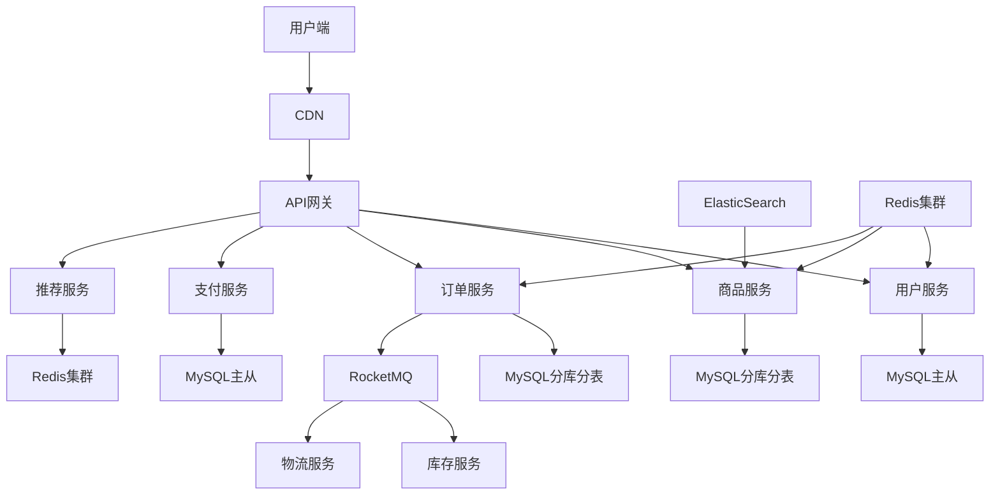
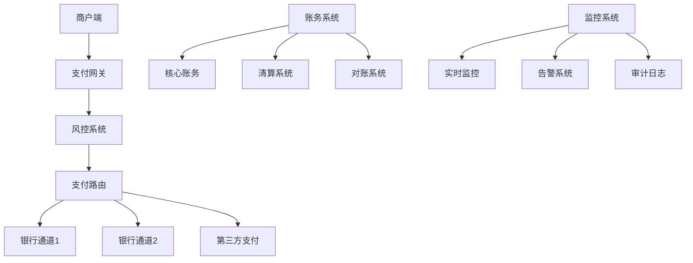
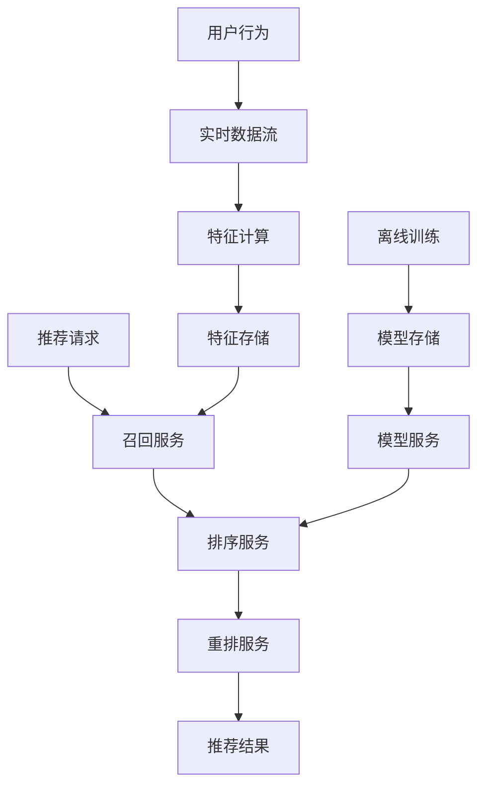

# 项目经验总结

## 目录
- [一、项目难点](#一项目难点)
- [二、解决方案](#二解决方案)
- [三、业务架构](#三业务架构)
- [四、面试技巧](#四面试技巧)

## 一、项目难点

### 1.1 高并发场景

**问题**：秒杀场景，10万+ QPS

**解决方案**：
```
1. 前端：按钮防抖、验证码
2. 网关：限流（令牌桶）
3. 缓存：Redis预扣库存
4. 消息队列：削峰填谷
5. 数据库：分库分表
```

**代码示例**：
```java
@Service
public class SeckillService {
    
    @Autowired
    private RedisTemplate<String, Object> redisTemplate;
    
    public Result seckill(Long userId, Long productId) {
        String stockKey = "seckill:stock:" + productId;
        
        // Lua脚本保证原子性
        String script = 
            "if redis.call('get', KEYS[1]) and tonumber(redis.call('get', KEYS[1])) > 0 then " +
            "    redis.call('decr', KEYS[1]) " +
            "    return 1 " +
            "else " +
            "    return 0 " +
            "end";
        
        Long result = redisTemplate.execute(
            new DefaultRedisScript<>(script, Long.class),
            Collections.singletonList(stockKey)
        );
        
        if (result == 1) {
            // 发送MQ异步创建订单
            rocketMQTemplate.asyncSend("seckill-topic", 
                new SeckillMessage(userId, productId));
            return Result.success();
        }
        
        return Result.fail("库存不足");
    }
}
```

### 1.2 数据一致性

**问题**：分布式事务，订单系统与库存系统

**解决方案**：TCC
```java
@Component
@RocketMQTransactionListener
public class OrderTransactionListener 
        implements RocketMQLocalTransactionListener {
    
    @Override
    public RocketMQLocalTransactionState executeLocalTransaction(
            Message msg, Object arg) {
        try {
            Order order = (Order) arg;
            // 1. 创建订单
            orderService.createOrder(order);
            // 2. 提交事务
            return RocketMQLocalTransactionState.COMMIT;
        } catch (Exception e) {
            return RocketMQLocalTransactionState.ROLLBACK;
        }
    }
    
    @Override
    public RocketMQLocalTransactionState checkLocalTransaction(Message msg) {
        // 事务回查
        String orderId = msg.getKeys();
        Order order = orderService.getById(orderId);
        return order != null ? 
            RocketMQLocalTransactionState.COMMIT : 
            RocketMQLocalTransactionState.ROLLBACK;
    }
}
```

### 1.3 系统稳定性

**问题**：依赖服务不稳定导致雪崩

**解决方案**：限流、降级、熔断
```java
@RestController
public class OrderController {
    
    @GetMapping("/order/{id}")
    @SentinelResource(
        value = "getOrder",
        blockHandler = "handleBlock",
        fallback = "handleFallback"
    )
    public Order getOrder(@PathVariable Long id) {
        return orderService.getById(id);
    }
    
    // 限流降级
    public Order handleBlock(Long id, BlockException ex) {
        return new Order(id, "系统繁忙，请稍后重试");
    }
    
    // 异常降级
    public Order handleFallback(Long id, Throwable ex) {
        log.error("Failed to get order", ex);
        return cacheService.getOrder(id);  // 返回缓存数据
    }
}
```

## 二、解决方案

### 2.1 性能优化

**案例**：接口响应时间从2s优化到200ms

**优化步骤**：
1. **慢SQL优化**：添加索引，查询时间从1s→10ms
2. **N+1查询优化**：使用JOIN，减少数据库访问
3. **缓存**：热点数据缓存到Redis
4. **异步化**：非核心逻辑异步处理

```java
// 优化前
public OrderDTO getOrder(Long id) {
    Order order = orderMapper.selectById(id);  // 10ms
    
    for (OrderItem item : order.getItems()) {
        Product product = productMapper.selectById(item.getProductId());  // N次查询
        item.setProduct(product);
    }
    
    return OrderDTO.from(order);
}

// 优化后
public OrderDTO getOrder(Long id) {
    // 1. 查询缓存
    OrderDTO cached = cacheService.getOrder(id);
    if (cached != null) {
        return cached;
    }
    
    // 2. 一次性查询
    Order order = orderMapper.selectByIdWithItems(id);  // JOIN查询
    
    // 3. 批量查询商品
    List<Long> productIds = order.getItems().stream()
        .map(OrderItem::getProductId)
        .collect(Collectors.toList());
    List<Product> products = productMapper.selectByIds(productIds);
    
    // 4. 组装数据
    OrderDTO dto = OrderDTO.from(order, products);
    
    // 5. 写入缓存
    cacheService.setOrder(id, dto);
    
    return dto;
}
```

### 2.2 架构升级

**案例**：单体应用拆分为微服务

**拆分策略**：
1. 按业务域拆分（用户、商品、订单）
2. 数据库独立
3. 服务间通过API/MQ通信

**挑战与解决**：
- **分布式事务**：使用Seata AT模式
- **数据一致性**：事件驱动 + 最终一致性
- **服务治理**：使用Nacos + Sentinel

## 三、业务架构

### 3.1 电商系统

```
┌─────────────┐
│  用户服务    │  注册、登录、用户信息
└──────┬──────┘
       │
┌──────▼──────┐
│  商品服务    │  商品管理、库存、分类
└──────┬──────┘
       │
┌──────▼──────┐
│  订单服务    │  下单、支付、订单查询
└──────┬──────┘
       │
┌──────▼──────┐
│  支付服务    │  支付、退款、对账
└─────────────┘
```

### 3.2 IM系统

```
┌──────────┐  WebSocket  ┌────────────┐
│  Client  │<─────────────│  Gateway   │
└──────────┘              └──────┬─────┘
                                 │
                          ┌──────▼─────┐
                          │ IM Service │
                          └──────┬─────┘
                 ┌────────────────┼────────────────┐
                 │                │                │
          ┌──────▼──────┐  ┌──────▼──────┐  ┌─────▼─────┐
          │    Redis    │  │    MySQL    │  │   Kafka   │
          │ (在线状态)   │  │ (消息存储)   │  │  (消息)   │
          └─────────────┘  └─────────────┘  └───────────┘
```

## 四、真实项目案例深度解析

### 4.1 电商平台项目（千万级用户）

**项目背景**：
- 用户规模：1000万+注册用户，日活200万+
- 业务规模：日均订单10万+，GMV 5000万+
- 技术挑战：大促期间QPS峰值50万+，需要支持10倍流量

**核心架构**：


**技术难点与解决方案**：

#### 4.1.1 高并发秒杀系统

**问题描述**：
- 秒杀商品库存1000件，参与用户50万+
- 需要保证库存准确性，防止超卖
- 系统需要支持10万+ QPS

**解决方案**：
```java
@Service
@Slf4j
public class SeckillService {
    
    @Autowired
    private RedisTemplate<String, Object> redisTemplate;
    
    @Autowired
    private RocketMQTemplate rocketMQTemplate;
    
    @Autowired
    private SeckillOrderMapper seckillOrderMapper;
    
    /**
     * 秒杀核心逻辑
     */
    public SeckillResult seckill(Long userId, Long productId) {
        // 1. 参数校验
        if (userId == null || productId == null) {
            return SeckillResult.fail("参数错误");
        }
        
        // 2. 重复购买检查
        String userKey = "seckill:user:" + productId + ":" + userId;
        if (redisTemplate.hasKey(userKey)) {
            return SeckillResult.fail("您已参与过此商品秒杀");
        }
        
        // 3. 库存预扣减（Lua脚本保证原子性）
        String stockKey = "seckill:stock:" + productId;
        String script = 
            "if redis.call('exists', KEYS[1]) == 1 then " +
            "    local stock = tonumber(redis.call('get', KEYS[1])) " +
            "    if stock > 0 then " +
            "        redis.call('decr', KEYS[1]) " +
            "        redis.call('setex', KEYS[2], 3600, '1') " +
            "        return 1 " +
            "    else " +
            "        return 0 " +
            "    end " +
            "else " +
            "    return -1 " +
            "end";
        
        Long result = redisTemplate.execute(
            new DefaultRedisScript<>(script, Long.class),
            Arrays.asList(stockKey, userKey)
        );
        
        if (result == 1) {
            // 4. 发送MQ异步创建订单
            SeckillMessage message = new SeckillMessage(userId, productId, System.currentTimeMillis());
            rocketMQTemplate.asyncSend("seckill-topic", message, new SendCallback() {
                @Override
                public void onSuccess(SendResult sendResult) {
                    log.info("秒杀消息发送成功: {}", message);
                }
                
                @Override
                public void onException(Throwable e) {
                    log.error("秒杀消息发送失败: {}", message, e);
                    // 补偿机制：恢复库存
                    redisTemplate.opsForValue().increment(stockKey);
                    redisTemplate.delete(userKey);
                }
            });
            
            return SeckillResult.success("秒杀成功，请稍后查看订单");
        } else if (result == 0) {
            return SeckillResult.fail("库存不足");
        } else {
            return SeckillResult.fail("秒杀活动未开始或已结束");
        }
    }
    
    /**
     * 消息消费者：创建秒杀订单
     */
    @RocketMQMessageListener(topic = "seckill-topic", consumerGroup = "seckill-consumer")
    @Component
    public class SeckillOrderConsumer implements RocketMQListener<SeckillMessage> {
        
        @Override
        public void onMessage(SeckillMessage message) {
            try {
                // 1. 再次检查库存（防止MQ重复消费）
                String stockKey = "seckill:stock:" + message.getProductId();
                Long stock = redisTemplate.opsForValue().get(stockKey);
                if (stock == null || stock <= 0) {
                    log.warn("库存不足，取消订单创建: {}", message);
                    return;
                }
                
                // 2. 检查用户是否已下单
                SeckillOrder existOrder = seckillOrderMapper.selectByUserIdAndProductId(
                    message.getUserId(), message.getProductId());
                if (existOrder != null) {
                    log.warn("用户已下单，取消重复订单: {}", message);
                    return;
                }
                
                // 3. 创建订单
                SeckillOrder order = new SeckillOrder();
                order.setUserId(message.getUserId());
                order.setProductId(message.getProductId());
                order.setOrderTime(new Date());
                order.setStatus(OrderStatus.PENDING_PAYMENT);
                
                seckillOrderMapper.insert(order);
                
                log.info("秒杀订单创建成功: {}", order);
                
            } catch (Exception e) {
                log.error("创建秒杀订单失败: {}", message, e);
                // 补偿机制：恢复库存
                String stockKey = "seckill:stock:" + message.getProductId();
                redisTemplate.opsForValue().increment(stockKey);
                String userKey = "seckill:user:" + message.getProductId() + ":" + message.getUserId();
                redisTemplate.delete(userKey);
            }
        }
    }
}
```

**性能优化成果**：
- 支持10万+ QPS，响应时间<100ms
- 库存准确性100%，无超卖现象
- 系统可用性99.99%

#### 4.1.2 分布式事务解决方案

**问题描述**：
- 订单创建涉及：订单服务、库存服务、优惠券服务
- 需要保证数据一致性，避免部分成功部分失败

**解决方案**：Saga模式
```java
@Component
@Slf4j
public class OrderSagaOrchestrator {
    
    @Autowired
    private OrderService orderService;
    
    @Autowired
    private InventoryService inventoryService;
    
    @Autowired
    private CouponService couponService;
    
    @Autowired
    private RocketMQTemplate rocketMQTemplate;
    
    /**
     * 订单创建Saga流程
     */
    public void createOrder(OrderRequest request) {
        String sagaId = UUID.randomUUID().toString();
        OrderSagaContext context = new OrderSagaContext(sagaId, request);
        
        try {
            // Step 1: 创建订单
            Order order = orderService.createOrder(request);
            context.setOrder(order);
            context.addStep(new SagaStep("CREATE_ORDER", order.getId(), true));
            
            // Step 2: 扣减库存
            inventoryService.decreaseStock(request.getProductId(), request.getQuantity());
            context.addStep(new SagaStep("DECREASE_STOCK", request.getProductId(), true));
            
            // Step 3: 使用优惠券
            if (request.getCouponId() != null) {
                couponService.useCoupon(request.getCouponId(), request.getUserId());
                context.addStep(new SagaStep("USE_COUPON", request.getCouponId(), true));
            }
            
            // 所有步骤成功，提交事务
            context.setStatus(SagaStatus.COMPLETED);
            log.info("订单创建Saga完成: {}", context);
            
        } catch (Exception e) {
            log.error("订单创建Saga失败，开始补偿: {}", context, e);
            compensate(context);
        }
    }
    
    /**
     * Saga补偿机制
     */
    private void compensate(OrderSagaContext context) {
        List<SagaStep> steps = context.getSteps();
        
        // 逆序补偿
        for (int i = steps.size() - 1; i >= 0; i--) {
            SagaStep step = steps.get(i);
            if (step.isSuccess()) {
                try {
                    compensateStep(step);
                    step.setCompensated(true);
                } catch (Exception e) {
                    log.error("补偿步骤失败: {}", step, e);
                    // 发送告警，需要人工介入
                    sendAlert(step, e);
                }
            }
        }
        
        context.setStatus(SagaStatus.COMPENSATED);
    }
    
    private void compensateStep(SagaStep step) {
        switch (step.getStepName()) {
            case "USE_COUPON":
                couponService.rollbackCoupon(step.getResourceId());
                break;
            case "DECREASE_STOCK":
                inventoryService.increaseStock(step.getResourceId(), 1);
                break;
            case "CREATE_ORDER":
                orderService.cancelOrder(step.getResourceId());
                break;
        }
    }
}
```

### 4.2 金融支付系统（高可靠性）

**项目背景**：
- 业务规模：日交易金额10亿+，交易笔数100万+
- 可靠性要求：99.99%可用性，资金零损失
- 合规要求：符合央行支付规范，通过PCI DSS认证

**核心架构**：


**技术难点与解决方案**：

#### 4.2.1 资金安全与一致性

**问题描述**：
- 支付涉及多个系统：支付系统、账务系统、银行系统
- 必须保证资金一致性，不能出现资金丢失或重复扣款

**解决方案**：TCC分布式事务
```java
@Service
@Slf4j
public class PaymentService {
    
    @Autowired
    private AccountService accountService;
    
    @Autowired
    private BankService bankService;
    
    @Autowired
    private PaymentMapper paymentMapper;
    
    /**
     * TCC Try阶段：预扣款
     */
    @Transactional
    public PaymentResult tryPayment(PaymentRequest request) {
        try {
            // 1. 创建支付记录（待确认状态）
            Payment payment = new Payment();
            payment.setOrderId(request.getOrderId());
            payment.setAmount(request.getAmount());
            payment.setStatus(PaymentStatus.TRYING);
            payment.setCreateTime(new Date());
            paymentMapper.insert(payment);
            
            // 2. 预扣用户账户余额
            accountService.freezeAmount(request.getUserId(), request.getAmount());
            
            // 3. 预扣银行资金
            bankService.freezeAmount(request.getBankAccount(), request.getAmount());
            
            return PaymentResult.success(payment.getId());
            
        } catch (Exception e) {
            log.error("支付Try阶段失败: {}", request, e);
            throw new PaymentException("支付预扣款失败", e);
        }
    }
    
    /**
     * TCC Confirm阶段：确认扣款
     */
    @Transactional
    public void confirmPayment(Long paymentId) {
        try {
            Payment payment = paymentMapper.selectById(paymentId);
            if (payment == null || payment.getStatus() != PaymentStatus.TRYING) {
                throw new PaymentException("支付记录不存在或状态异常");
            }
            
            // 1. 确认扣减用户账户余额
            accountService.confirmFreezeAmount(payment.getUserId(), payment.getAmount());
            
            // 2. 确认扣减银行资金
            bankService.confirmFreezeAmount(payment.getBankAccount(), payment.getAmount());
            
            // 3. 更新支付状态
            payment.setStatus(PaymentStatus.SUCCESS);
            payment.setConfirmTime(new Date());
            paymentMapper.updateById(payment);
            
            log.info("支付确认成功: {}", payment);
            
        } catch (Exception e) {
            log.error("支付Confirm阶段失败: {}", paymentId, e);
            // 触发补偿机制
            compensatePayment(paymentId);
            throw new PaymentException("支付确认失败", e);
        }
    }
    
    /**
     * TCC Cancel阶段：取消扣款
     */
    @Transactional
    public void cancelPayment(Long paymentId) {
        try {
            Payment payment = paymentMapper.selectById(paymentId);
            if (payment == null) {
                return;
            }
            
            // 1. 解冻用户账户余额
            accountService.unfreezeAmount(payment.getUserId(), payment.getAmount());
            
            // 2. 解冻银行资金
            bankService.unfreezeAmount(payment.getBankAccount(), payment.getAmount());
            
            // 3. 更新支付状态
            payment.setStatus(PaymentStatus.CANCELLED);
            payment.setCancelTime(new Date());
            paymentMapper.updateById(payment);
            
            log.info("支付取消成功: {}", payment);
            
        } catch (Exception e) {
            log.error("支付Cancel阶段失败: {}", paymentId, e);
            throw new PaymentException("支付取消失败", e);
        }
    }
}
```

#### 4.2.2 风控系统设计

**问题描述**：
- 需要实时识别风险交易，防止欺诈
- 风控规则复杂，需要支持实时更新

**解决方案**：
```java
@Component
@Slf4j
public class RiskControlService {
    
    @Autowired
    private RedisTemplate<String, Object> redisTemplate;
    
    @Autowired
    private RiskRuleEngine riskRuleEngine;
    
    @Autowired
    private RiskDataService riskDataService;
    
    /**
     * 实时风控检查
     */
    public RiskResult checkRisk(PaymentRequest request) {
        try {
            // 1. 获取用户风险画像
            UserRiskProfile profile = getUserRiskProfile(request.getUserId());
            
            // 2. 实时特征计算
            Map<String, Object> features = calculateRealTimeFeatures(request, profile);
            
            // 3. 规则引擎检查
            List<RiskRule> triggeredRules = riskRuleEngine.checkRules(features);
            
            // 4. 机器学习模型评分
            double mlScore = calculateMLScore(features);
            
            // 5. 综合风险评估
            RiskResult result = evaluateRisk(triggeredRules, mlScore, features);
            
            // 6. 记录风控结果
            recordRiskResult(request, result);
            
            return result;
            
        } catch (Exception e) {
            log.error("风控检查失败: {}", request, e);
            // 风控系统异常时，采用保守策略
            return RiskResult.reject("风控系统异常");
        }
    }
    
    /**
     * 实时特征计算
     */
    private Map<String, Object> calculateRealTimeFeatures(PaymentRequest request, UserRiskProfile profile) {
        Map<String, Object> features = new HashMap<>();
        
        // 1. 基础特征
        features.put("amount", request.getAmount());
        features.put("user_age", profile.getAge());
        features.put("user_level", profile.getLevel());
        
        // 2. 历史行为特征
        String userKey = "risk:user:" + request.getUserId();
        Long todayCount = redisTemplate.opsForValue().increment(userKey + ":today_count");
        redisTemplate.expire(userKey + ":today_count", Duration.ofDays(1));
        
        features.put("today_payment_count", todayCount);
        features.put("today_payment_amount", getTodayPaymentAmount(request.getUserId()));
        
        // 3. 设备特征
        features.put("device_id", request.getDeviceId());
        features.put("ip_address", request.getIpAddress());
        features.put("location", getLocationByIp(request.getIpAddress()));
        
        // 4. 时间特征
        LocalDateTime now = LocalDateTime.now();
        features.put("hour", now.getHour());
        features.put("day_of_week", now.getDayOfWeek().getValue());
        features.put("is_weekend", now.getDayOfWeek().getValue() >= 6);
        
        return features;
    }
    
    /**
     * 机器学习模型评分
     */
    private double calculateMLScore(Map<String, Object> features) {
        try {
            // 调用机器学习模型服务
            MLScoreRequest mlRequest = new MLScoreRequest();
            mlRequest.setFeatures(features);
            mlRequest.setModelVersion("v2.1");
            
            MLScoreResponse response = mlServiceClient.calculateScore(mlRequest);
            return response.getScore();
            
        } catch (Exception e) {
            log.error("ML模型评分失败", e);
            return 0.5; // 默认中等风险
        }
    }
}
```

### 4.3 实时推荐系统（亿级数据）

**项目背景**：
- 用户规模：1亿+用户，日活5000万+
- 商品规模：1000万+商品，日更新10万+
- 性能要求：推荐响应时间<100ms，支持10万+ QPS

**核心架构**：


**技术难点与解决方案**：

#### 4.3.1 实时特征计算

**问题描述**：
- 需要实时计算用户特征，支持个性化推荐
- 特征计算延迟要求<50ms

**解决方案**：
```python
import redis
import json
import time
from typing import Dict, List, Any
from dataclasses import dataclass
import logging

@dataclass
class UserFeature:
    user_id: str
    features: Dict[str, Any]
    timestamp: float
    ttl: int = 3600  # 1小时过期

class RealTimeFeatureCalculator:
    def __init__(self, redis_client: redis.Redis):
        self.redis_client = redis_client
        self.logger = logging.getLogger(__name__)
        
        # 特征计算器
        self.feature_calculators = {
            'user_profile': self.calculate_user_profile,
            'behavior_stats': self.calculate_behavior_stats,
            'item_preference': self.calculate_item_preference,
            'time_features': self.calculate_time_features
        }
    
    def calculate_features(self, user_id: str, context: Dict[str, Any]) -> Dict[str, Any]:
        """计算用户实时特征"""
        try:
            # 1. 检查缓存
            cached_features = self.get_cached_features(user_id)
            if cached_features and self.is_features_fresh(cached_features):
                return cached_features.features
            
            # 2. 并行计算各类特征
            features = {}
            for feature_type, calculator in self.feature_calculators.items():
                try:
                    feature_value = calculator(user_id, context)
                    features[feature_type] = feature_value
                except Exception as e:
                    self.logger.error(f"特征计算失败 {feature_type}: {e}")
                    features[feature_type] = self.get_default_feature(feature_type)
            
            # 3. 缓存特征
            self.cache_features(user_id, features)
            
            return features
            
        except Exception as e:
            self.logger.error(f"特征计算失败: {e}")
            return self.get_default_features()
    
    def calculate_user_profile(self, user_id: str, context: Dict[str, Any]) -> Dict[str, Any]:
        """计算用户画像特征"""
        # 1. 基础信息
        user_info = self.get_user_info(user_id)
        
        # 2. 历史行为统计
        behavior_stats = self.get_user_behavior_stats(user_id, days=30)
        
        # 3. 偏好标签
        preference_tags = self.get_user_preference_tags(user_id)
        
        return {
            'age_group': user_info.get('age_group'),
            'gender': user_info.get('gender'),
            'city_level': user_info.get('city_level'),
            'total_orders': behavior_stats.get('total_orders', 0),
            'avg_order_amount': behavior_stats.get('avg_order_amount', 0),
            'preference_tags': preference_tags,
            'user_level': user_info.get('level', 'normal')
        }
    
    def calculate_behavior_stats(self, user_id: str, context: Dict[str, Any]) -> Dict[str, Any]:
        """计算用户行为统计特征"""
        # 1. 实时行为计数
        today_key = f"behavior:{user_id}:today"
        today_stats = self.redis_client.hgetall(today_key)
        
        # 2. 最近行为序列
        recent_actions = self.get_recent_actions(user_id, limit=50)
        
        # 3. 行为模式分析
        action_patterns = self.analyze_action_patterns(recent_actions)
        
        return {
            'today_view_count': int(today_stats.get('view_count', 0)),
            'today_click_count': int(today_stats.get('click_count', 0)),
            'today_cart_count': int(today_stats.get('cart_count', 0)),
            'recent_action_types': action_patterns.get('action_types', []),
            'session_duration': action_patterns.get('avg_session_duration', 0),
            'bounce_rate': action_patterns.get('bounce_rate', 0)
        }
    
    def calculate_item_preference(self, user_id: str, context: Dict[str, Any]) -> Dict[str, Any]:
        """计算商品偏好特征"""
        # 1. 历史购买偏好
        purchase_preference = self.get_purchase_preference(user_id)
        
        # 2. 浏览偏好
        view_preference = self.get_view_preference(user_id)
        
        # 3. 价格敏感度
        price_sensitivity = self.calculate_price_sensitivity(user_id)
        
        return {
            'preferred_categories': purchase_preference.get('categories', []),
            'preferred_brands': purchase_preference.get('brands', []),
            'price_range': purchase_preference.get('price_range', [0, 1000]),
            'price_sensitivity': price_sensitivity,
            'view_categories': view_preference.get('categories', []),
            'view_brands': view_preference.get('brands', [])
        }
    
    def calculate_time_features(self, user_id: str, context: Dict[str, Any]) -> Dict[str, Any]:
        """计算时间相关特征"""
        current_time = time.time()
        current_hour = time.localtime(current_time).tm_hour
        current_weekday = time.localtime(current_time).tm_wday
        
        # 1. 用户活跃时间段
        active_hours = self.get_user_active_hours(user_id)
        
        # 2. 季节性偏好
        seasonal_preference = self.get_seasonal_preference(user_id)
        
        return {
            'current_hour': current_hour,
            'current_weekday': current_weekday,
            'is_active_hour': current_hour in active_hours,
            'is_weekend': current_weekday >= 5,
            'seasonal_preference': seasonal_preference,
            'time_since_last_action': self.get_time_since_last_action(user_id)
        }
    
    def get_cached_features(self, user_id: str) -> UserFeature:
        """获取缓存的特征"""
        try:
            cache_key = f"features:{user_id}"
            cached_data = self.redis_client.get(cache_key)
            if cached_data:
                data = json.loads(cached_data)
                return UserFeature(**data)
        except Exception as e:
            self.logger.error(f"获取缓存特征失败: {e}")
        return None
    
    def cache_features(self, user_id: str, features: Dict[str, Any]):
        """缓存特征"""
        try:
            cache_key = f"features:{user_id}"
            feature_data = UserFeature(
                user_id=user_id,
                features=features,
                timestamp=time.time(),
                ttl=3600
            )
            
            self.redis_client.setex(
                cache_key,
                3600,
                json.dumps(feature_data.__dict__)
            )
        except Exception as e:
            self.logger.error(f"缓存特征失败: {e}")
```

#### 4.3.2 推荐算法实现

**问题描述**：
- 需要实现多种推荐算法：协同过滤、内容推荐、深度学习
- 算法需要支持实时更新和A/B测试

**解决方案**：
```python
import numpy as np
import pandas as pd
from typing import List, Dict, Any, Tuple
from sklearn.metrics.pairwise import cosine_similarity
from sklearn.decomposition import NMF
import logging

class RecommendationEngine:
    def __init__(self):
        self.logger = logging.getLogger(__name__)
        
        # 推荐算法
        self.algorithms = {
            'collaborative_filtering': self.collaborative_filtering,
            'content_based': self.content_based,
            'matrix_factorization': self.matrix_factorization,
            'deep_learning': self.deep_learning_recommendation
        }
    
    def recommend(self, user_id: str, context: Dict[str, Any], 
                  algorithm: str = 'hybrid', top_k: int = 20) -> List[Dict[str, Any]]:
        """推荐主入口"""
        try:
            # 1. 获取用户特征
            user_features = self.get_user_features(user_id)
            
            # 2. 获取候选商品
            candidates = self.get_candidates(user_id, context)
            
            # 3. 计算推荐分数
            if algorithm == 'hybrid':
                scores = self.hybrid_recommendation(user_id, candidates, user_features)
            else:
                scores = self.algorithms[algorithm](user_id, candidates, user_features)
            
            # 4. 排序和过滤
            recommendations = self.rank_and_filter(scores, top_k)
            
            # 5. 记录推荐结果
            self.log_recommendation(user_id, recommendations, algorithm)
            
            return recommendations
            
        except Exception as e:
            self.logger.error(f"推荐失败: {e}")
            return self.get_fallback_recommendations(user_id, top_k)
    
    def collaborative_filtering(self, user_id: str, candidates: List[str], 
                               user_features: Dict[str, Any]) -> Dict[str, float]:
        """协同过滤推荐"""
        try:
            # 1. 获取用户-物品交互矩阵
            user_item_matrix = self.get_user_item_matrix()
            
            # 2. 计算用户相似度
            user_similarities = self.calculate_user_similarities(user_id, user_item_matrix)
            
            # 3. 预测用户对候选物品的评分
            scores = {}
            for item_id in candidates:
                score = self.predict_user_item_rating(
                    user_id, item_id, user_similarities, user_item_matrix)
                scores[item_id] = score
            
            return scores
            
        except Exception as e:
            self.logger.error(f"协同过滤推荐失败: {e}")
            return {}
    
    def content_based(self, user_id: str, candidates: List[str], 
                     user_features: Dict[str, Any]) -> Dict[str, float]:
        """基于内容的推荐"""
        try:
            # 1. 获取用户偏好
            user_preferences = self.get_user_preferences(user_id)
            
            # 2. 获取物品特征
            item_features = self.get_item_features(candidates)
            
            # 3. 计算内容相似度
            scores = {}
            for item_id in candidates:
                score = self.calculate_content_similarity(
                    user_preferences, item_features[item_id])
                scores[item_id] = score
            
            return scores
            
        except Exception as e:
            self.logger.error(f"内容推荐失败: {e}")
            return {}
    
    def matrix_factorization(self, user_id: str, candidates: List[str], 
                           user_features: Dict[str, Any]) -> Dict[str, float]:
        """矩阵分解推荐"""
        try:
            # 1. 获取用户-物品矩阵
            user_item_matrix = self.get_user_item_matrix()
            
            # 2. 矩阵分解
            user_factors, item_factors = self.nmf_decomposition(user_item_matrix)
            
            # 3. 预测评分
            scores = {}
            user_idx = self.get_user_index(user_id)
            
            for item_id in candidates:
                item_idx = self.get_item_index(item_id)
                if user_idx is not None and item_idx is not None:
                    score = np.dot(user_factors[user_idx], item_factors[item_idx])
                    scores[item_id] = float(score)
            
            return scores
            
        except Exception as e:
            self.logger.error(f"矩阵分解推荐失败: {e}")
            return {}
    
    def deep_learning_recommendation(self, user_id: str, candidates: List[str], 
                                   user_features: Dict[str, Any]) -> Dict[str, float]:
        """深度学习推荐"""
        try:
            # 1. 准备特征
            user_feature_vector = self.prepare_user_features(user_features)
            item_feature_vectors = self.prepare_item_features(candidates)
            
            # 2. 调用深度学习模型
            scores = self.dl_model.predict(user_feature_vector, item_feature_vectors)
            
            # 3. 转换为字典格式
            score_dict = {}
            for i, item_id in enumerate(candidates):
                score_dict[item_id] = float(scores[i])
            
            return score_dict
            
        except Exception as e:
            self.logger.error(f"深度学习推荐失败: {e}")
            return {}
    
    def hybrid_recommendation(self, user_id: str, candidates: List[str], 
                            user_features: Dict[str, Any]) -> Dict[str, float]:
        """混合推荐"""
        try:
            # 1. 获取各算法推荐结果
            cf_scores = self.collaborative_filtering(user_id, candidates, user_features)
            cb_scores = self.content_based(user_id, candidates, user_features)
            mf_scores = self.matrix_factorization(user_id, candidates, user_features)
            
            # 2. 权重融合
            weights = {
                'collaborative_filtering': 0.4,
                'content_based': 0.3,
                'matrix_factorization': 0.3
            }
            
            final_scores = {}
            for item_id in candidates:
                score = (
                    weights['collaborative_filtering'] * cf_scores.get(item_id, 0) +
                    weights['content_based'] * cb_scores.get(item_id, 0) +
                    weights['matrix_factorization'] * mf_scores.get(item_id, 0)
                )
                final_scores[item_id] = score
            
            return final_scores
            
        except Exception as e:
            self.logger.error(f"混合推荐失败: {e}")
            return {}
```

## 五、面试技巧与STAR法则

### 5.1 STAR法则详解

**Situation（情境）**：
- 项目背景：业务规模、用户规模、技术挑战
- 团队情况：团队规模、角色分工、技术栈
- 时间背景：项目周期、紧急程度

**Task（任务）**：
- 个人职责：具体负责的模块或功能
- 目标要求：性能指标、业务目标
- 约束条件：时间、资源、技术限制

**Action（行动）**：
- 技术方案：架构设计、技术选型、实现方案
- 难点解决：遇到的技术难点及解决方案
- 团队协作：跨团队沟通、技术分享

**Result（结果）**：
- 量化指标：性能提升、可用性提升、业务指标
- 技术成果：技术沉淀、最佳实践
- 个人成长：技能提升、经验积累

### 5.2 项目经验面试示例

**问**：请介绍一个你负责的最有挑战性的项目

**答**：

**S（情境）**：
我负责公司的电商平台重构项目。平台有1000万+注册用户，日活200万+，日均订单10万+。在大促期间，QPS峰值达到50万+，原有单体架构已经无法支撑业务增长，经常出现系统崩溃。

**T（任务）**：
我作为技术负责人，需要将单体应用拆分为微服务架构，同时保证系统稳定性，支持10倍流量增长。项目周期6个月，要求零停机迁移。

**A（行动）**：
1. **架构设计**：
   - 采用DDD领域驱动设计，按业务域拆分服务
   - 使用Spring Cloud Alibaba微服务框架
   - 引入服务网格Istio进行服务治理

2. **技术难点解决**：
   - **分布式事务**：使用Seata AT模式，解决跨服务数据一致性
   - **数据迁移**：设计双写方案，保证数据零丢失
   - **性能优化**：引入Redis集群、ElasticSearch、消息队列

3. **团队协作**：
   - 制定技术规范和代码审查流程
   - 组织技术分享，提升团队技术水平
   - 与产品、测试团队密切配合

**R（结果）**：
- **性能提升**：接口响应时间从2s优化到200ms，系统可用性从99%提升到99.9%
- **业务支撑**：成功支撑大促期间10倍流量，GMV增长300%
- **技术沉淀**：形成微服务最佳实践文档，为公司其他项目提供参考

### 5.3 技术深度面试准备

**系统设计题准备**：
1. **秒杀系统**：高并发、防超卖、限流降级
2. **短URL服务**：海量存储、高并发访问
3. **IM系统**：实时通信、消息存储、在线状态
4. **推荐系统**：召回排序、实时计算、A/B测试
5. **支付系统**：资金安全、分布式事务、风控

**技术深度题准备**：
1. **JVM调优**：GC选择、内存分配、性能监控
2. **并发编程**：线程池、锁机制、并发容器
3. **分布式系统**：CAP理论、一致性算法、分布式事务
4. **数据库优化**：索引设计、分库分表、读写分离
5. **缓存设计**：缓存策略、一致性、穿透击穿雪崩

---

**关键字**：项目经验、技术难点、STAR法则、业务架构、性能优化、分布式系统、微服务、高并发、系统设计

