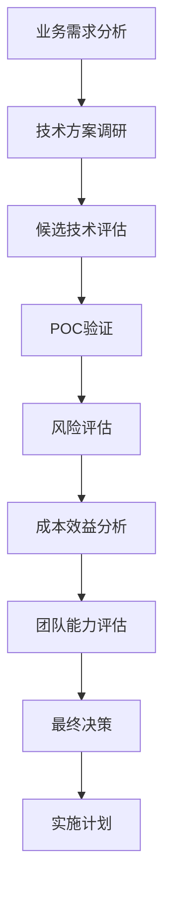
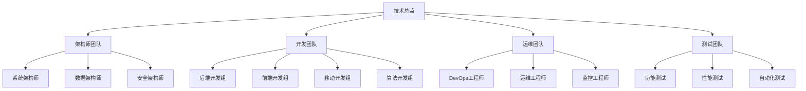
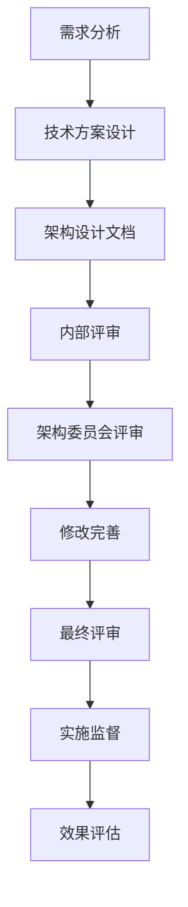

# 软技能与管理

## 目录
- [一、技术选型](#一技术选型)
- [二、团队管理](#二团队管理)
- [三、架构评审](#三架构评审)
- [四、职业规划](#四职业规划)

## 一、技术选型

### 1.1 选型原则

1. **成熟度**：优先选择成熟稳定的技术
2. **团队能力**：考虑团队技术栈
3. **社区活跃度**：良好的社区支持
4. **业务匹配度**：技术与业务场景匹配

### 1.2 选型案例

**场景**：选择消息队列

**候选方案**：

| 特性 | Kafka | RocketMQ | RabbitMQ |
|------|-------|----------|----------|
| 吞吐量 | 极高 | 高 | 中 |
| 延迟 | ms级 | ms级 | us级 |
| 可靠性 | 高 | 极高 | 高 |
| 事务消息 | 不支持 | 支持 | 支持 |
| 顺序消息 | 分区有序 | 全局有序 | 队列有序 |
| 运维复杂度 | 中 | 中 | 低 |

**决策**：
- **日志收集**：Kafka（高吞吐）
- **订单系统**：RocketMQ（事务消息）
- **简单任务队列**：RabbitMQ（易用）

### 1.3 技术债务管理

**识别技术债**：
- 代码质量差
- 过时的技术栈
- 缺少文档
- 测试覆盖率低

**偿还策略**：
- 逐步重构，不影响业务
- 新需求时顺带重构
- 定期技术升级

## 二、团队管理

### 2.1 团队协作

**代码审查**：
```markdown
# PR Review Checklist
- [ ] 代码符合规范
- [ ] 有单元测试
- [ ] 更新了文档
- [ ] 无明显性能问题
- [ ] 考虑了边界情况
```

**知识分享**：
- 技术分享会（周会）
- 文档沉淀（Confluence）
- Code Review
- 结对编程

**任务分配**：
- 根据能力分配
- 给新人成长机会
- 关键任务多人协作

### 2.2 团队建设

**技术成长**：
1. 制定学习计划
2. 提供培训机会
3. 参与开源项目
4. 技术认证支持

**绩效考核**：
- 代码质量
- 项目完成度
- 技术影响力
- 团队协作

## 三、架构评审

### 3.1 评审流程

```
需求分析 → 技术方案 → 架构设计 → 评审会议 → 修改完善 → 实施
```

### 3.2 评审要点

**功能性**：
- 是否满足业务需求
- 边界情况处理

**非功能性**：
- **性能**：能否支撑预期QPS
- **可用性**：SLA目标，容灾方案
- **可维护性**：代码质量，文档完整度
- **可扩展性**：是否易于扩展
- **安全性**：数据安全，权限控制

**技术方案**：
- 技术选型合理性
- 架构设计是否清晰
- 是否有风险预案

### 3.3 评审模板

```markdown
# 架构设计文档

## 1. 背景
- 业务背景
- 技术挑战

## 2. 目标
- 功能目标
- 性能目标
- 可用性目标

## 3. 架构设计
- 整体架构图
- 核心流程
- 数据模型

## 4. 技术方案
- 技术选型
- 关键技术点
- 风险与预案

## 5. 实施计划
- 里程碑
- 资源投入
- 上线计划

## 6. 监控与运维
- 监控指标
- 告警策略
- 应急预案
```

## 四、职业规划

### 4.1 技术路线

**初级（1-3年）**：
- 扎实基础：数据结构、算法、设计模式
- 熟练框架：Spring、MyBatis等
- 完成功能开发

**中级（3-5年）**：
- 深入原理：JVM、并发、网络
- 系统设计：缓存、消息队列、分布式
- 独立负责模块

**高级（5-8年）**：
- 架构设计：微服务、DDD
- 性能优化：JVM调优、SQL优化
- 技术选型与决策

**架构师（8年+）**：
- 系统架构设计
- 技术规划
- 团队技术Leader

### 4.2 能力模型

**技术能力**：
- 编程语言
- 框架原理
- 架构设计
- 性能优化

**业务能力**：
- 理解业务
- 抽象能力
- 产品思维

**软技能**：
- 沟通能力
- 团队协作
- 项目管理
- 学习能力

### 4.3 学习方法

**系统学习**：
1. 阅读经典书籍
2. 学习开源项目源码
3. 动手实践
4. 输出总结（博客、分享）

**持续提升**：
- 关注技术趋势
- 参与技术社区
- 参加技术大会
- 考取认证

### 4.4 面试建议

**准备**：
1. 梳理项目经验
2. 复习核心知识点
3. 刷算法题
4. 准备问题清单

**技巧**：
- 自信表达
- STAR法则
- 举实际例子
- 诚实回答

**反向提问**：
- 团队技术栈
- 项目挑战
- 成长空间
- 团队规模

## 五、技术选型深度方法论

### 5.1 技术选型决策框架

**决策维度矩阵**：

| 维度 | 权重 | 评估标准 | 评分(1-10) |
|------|------|----------|------------|
| 技术成熟度 | 25% | 版本稳定性、生产验证 | |
| 团队能力 | 20% | 学习成本、现有技能 | |
| 社区生态 | 15% | 文档质量、社区活跃度 | |
| 性能表现 | 15% | 吞吐量、延迟、资源消耗 | |
| 运维成本 | 10% | 部署复杂度、监控难度 | |
| 业务匹配 | 10% | 功能完整性、扩展性 | |
| 成本控制 | 5% | 授权费用、云服务成本 | |

**决策流程**：


### 5.2 技术选型实战案例

#### 5.2.1 微服务框架选型

**业务背景**：
- 单体应用需要拆分为微服务
- 团队规模：15人，Java技术栈
- 性能要求：支持10万+ QPS
- 运维要求：容器化部署

**候选方案对比**：

| 特性 | Spring Cloud | Dubbo | gRPC | 权重 |
|------|-------------|-------|------|------|
| 学习成本 | 低 | 中 | 高 | 20% |
| 性能 | 中 | 高 | 极高 | 15% |
| 生态完整性 | 极高 | 高 | 中 | 15% |
| 社区支持 | 极高 | 高 | 中 | 10% |
| 运维复杂度 | 低 | 中 | 高 | 10% |
| 监控集成 | 完善 | 完善 | 需自建 | 10% |
| 文档质量 | 优秀 | 良好 | 一般 | 10% |
| 团队熟悉度 | 高 | 中 | 低 | 10% |

**评分计算**：
```java
public class TechnologySelectionEvaluator {
    
    public TechnologyScore evaluate(TechnologyCandidate candidate, 
                                   EvaluationCriteria criteria) {
        Map<String, Double> scores = new HashMap<>();
        
        // 1. 学习成本评估
        double learningCostScore = evaluateLearningCost(candidate, criteria);
        scores.put("learning_cost", learningCostScore);
        
        // 2. 性能评估
        double performanceScore = evaluatePerformance(candidate, criteria);
        scores.put("performance", performanceScore);
        
        // 3. 生态完整性评估
        double ecosystemScore = evaluateEcosystem(candidate, criteria);
        scores.put("ecosystem", ecosystemScore);
        
        // 4. 综合评分
        double totalScore = calculateWeightedScore(scores, criteria.getWeights());
        
        return new TechnologyScore(candidate.getName(), totalScore, scores);
    }
    
    private double evaluateLearningCost(TechnologyCandidate candidate, 
                                      EvaluationCriteria criteria) {
        // 基于团队技能栈评估学习成本
        Set<String> teamSkills = criteria.getTeamSkills();
        Set<String> requiredSkills = candidate.getRequiredSkills();
        
        double familiarityRatio = calculateFamiliarityRatio(teamSkills, requiredSkills);
        return Math.max(1, 10 - familiarityRatio * 5); // 1-10分
    }
    
    private double evaluatePerformance(TechnologyCandidate candidate, 
                                     EvaluationCriteria criteria) {
        PerformanceMetrics metrics = candidate.getPerformanceMetrics();
        PerformanceRequirements requirements = criteria.getPerformanceRequirements();
        
        // 吞吐量评分
        double throughputScore = Math.min(10, 
            metrics.getThroughput() / requirements.getMinThroughput() * 5);
        
        // 延迟评分
        double latencyScore = Math.max(1, 
            10 - (metrics.getLatency() / requirements.getMaxLatency()) * 5);
        
        return (throughputScore + latencyScore) / 2;
    }
}
```

**最终决策**：Spring Cloud
- **理由**：团队熟悉度高，生态完整，学习成本低
- **风险缓解**：通过性能优化和缓存策略弥补性能差距

#### 5.2.2 数据库选型案例

**场景**：电商系统商品搜索

**需求分析**：
- 数据量：1000万+商品
- 查询QPS：5万+
- 查询类型：全文搜索、分类筛选、价格排序
- 一致性要求：最终一致性

**技术方案对比**：

| 方案 | ElasticSearch | MySQL+Solr | MongoDB | ClickHouse |
|------|---------------|------------|---------|------------|
| 搜索能力 | 极强 | 强 | 中 | 弱 |
| 写入性能 | 高 | 中 | 高 | 极高 |
| 查询性能 | 极高 | 高 | 中 | 极高 |
| 运维复杂度 | 中 | 高 | 低 | 中 |
| 成本 | 中 | 高 | 低 | 低 |
| 数据一致性 | 最终一致 | 强一致 | 最终一致 | 最终一致 |

**POC测试结果**：
```python
import time
import statistics
from typing import List, Dict

class DatabasePerformanceTest:
    def __init__(self):
        self.test_data_size = 1000000  # 100万条商品数据
        self.query_patterns = [
            "手机",  # 全文搜索
            "category:electronics AND price:[1000,5000]",  # 复合查询
            "brand:apple",  # 精确匹配
            "description:高性能 AND category:computer"  # 复杂查询
        ]
    
    def run_performance_test(self, database_type: str) -> Dict[str, float]:
        """运行性能测试"""
        results = {}
        
        # 1. 写入性能测试
        write_times = self.test_write_performance(database_type)
        results['write_avg_ms'] = statistics.mean(write_times)
        results['write_qps'] = 1000 / results['write_avg_ms']
        
        # 2. 查询性能测试
        query_results = {}
        for pattern in self.query_patterns:
            query_times = self.test_query_performance(database_type, pattern)
            query_results[pattern] = {
                'avg_ms': statistics.mean(query_times),
                'p95_ms': self.calculate_percentile(query_times, 95),
                'p99_ms': self.calculate_percentile(query_times, 99)
            }
        
        results['query_performance'] = query_results
        
        # 3. 并发性能测试
        concurrent_results = self.test_concurrent_performance(database_type)
        results['concurrent_qps'] = concurrent_results['max_qps']
        results['concurrent_error_rate'] = concurrent_results['error_rate']
        
        return results
    
    def test_write_performance(self, database_type: str) -> List[float]:
        """测试写入性能"""
        write_times = []
        
        for i in range(1000):  # 测试1000次写入
            start_time = time.time()
            
            if database_type == "elasticsearch":
                self.write_to_elasticsearch(self.generate_product_data(i))
            elif database_type == "mysql":
                self.write_to_mysql(self.generate_product_data(i))
            elif database_type == "mongodb":
                self.write_to_mongodb(self.generate_product_data(i))
            
            end_time = time.time()
            write_times.append((end_time - start_time) * 1000)  # 转换为毫秒
        
        return write_times
    
    def test_query_performance(self, database_type: str, query_pattern: str) -> List[float]:
        """测试查询性能"""
        query_times = []
        
        for i in range(100):  # 测试100次查询
            start_time = time.time()
            
            if database_type == "elasticsearch":
                results = self.query_elasticsearch(query_pattern)
            elif database_type == "mysql":
                results = self.query_mysql(query_pattern)
            elif database_type == "mongodb":
                results = self.query_mongodb(query_pattern)
            
            end_time = time.time()
            query_times.append((end_time - start_time) * 1000)
        
        return query_times
    
    def generate_performance_report(self, results: Dict[str, Dict]) -> str:
        """生成性能测试报告"""
        report = "# 数据库性能测试报告\n\n"
        
        for db_type, metrics in results.items():
            report += f"## {db_type.upper()}\n\n"
            report += f"- 写入性能: {metrics['write_qps']:.0f} QPS\n"
            report += f"- 平均写入延迟: {metrics['write_avg_ms']:.2f} ms\n"
            report += f"- 并发查询QPS: {metrics['concurrent_qps']:.0f}\n"
            report += f"- 并发错误率: {metrics['concurrent_error_rate']:.2%}\n\n"
            
            report += "### 查询性能详情\n\n"
            for pattern, perf in metrics['query_performance'].items():
                report += f"- {pattern}: {perf['avg_ms']:.2f}ms (P95: {perf['p95_ms']:.2f}ms)\n"
            
            report += "\n"
        
        return report
```

**最终决策**：ElasticSearch
- **理由**：搜索性能最优，功能最完整，运维相对简单
- **实施策略**：分阶段迁移，先处理搜索场景，再逐步扩展

### 5.3 技术债务管理深度实践

#### 5.3.1 技术债务识别与量化

**债务分类体系**：
```java
public enum TechnicalDebtType {
    CODE_QUALITY("代码质量", 0.3),
    ARCHITECTURE("架构设计", 0.25),
    PERFORMANCE("性能问题", 0.2),
    SECURITY("安全问题", 0.15),
    DOCUMENTATION("文档缺失", 0.1);
    
    private final String description;
    private final double weight;
    
    TechnicalDebtType(String description, double weight) {
        this.description = description;
        this.weight = weight;
    }
}

public class TechnicalDebtAssessment {
    
    /**
     * 技术债务评估
     */
    public TechnicalDebtReport assessProject(Project project) {
        TechnicalDebtReport report = new TechnicalDebtReport();
        
        // 1. 代码质量评估
        CodeQualityMetrics codeMetrics = analyzeCodeQuality(project);
        report.addDebtItem(assessCodeQualityDebt(codeMetrics));
        
        // 2. 架构设计评估
        ArchitectureMetrics archMetrics = analyzeArchitecture(project);
        report.addDebtItem(assessArchitectureDebt(archMetrics));
        
        // 3. 性能问题评估
        PerformanceMetrics perfMetrics = analyzePerformance(project);
        report.addDebtItem(assessPerformanceDebt(perfMetrics));
        
        // 4. 安全漏洞评估
        SecurityMetrics secMetrics = analyzeSecurity(project);
        report.addDebtItem(assessSecurityDebt(secMetrics));
        
        // 5. 文档完整性评估
        DocumentationMetrics docMetrics = analyzeDocumentation(project);
        report.addDebtItem(assessDocumentationDebt(docMetrics));
        
        // 计算总债务分数
        report.calculateTotalDebtScore();
        
        return report;
    }
    
    private TechnicalDebtItem assessCodeQualityDebt(CodeQualityMetrics metrics) {
        double debtScore = 0;
        List<String> issues = new ArrayList<>();
        
        // 圈复杂度评估
        if (metrics.getAverageCyclomaticComplexity() > 10) {
            debtScore += 20;
            issues.add("圈复杂度过高");
        }
        
        // 代码重复率评估
        if (metrics.getDuplicationRate() > 0.05) {
            debtScore += 15;
            issues.add("代码重复率过高");
        }
        
        // 测试覆盖率评估
        if (metrics.getTestCoverage() < 0.8) {
            debtScore += 25;
            issues.add("测试覆盖率不足");
        }
        
        // 代码规范违反
        if (metrics.getStyleViolations() > 100) {
            debtScore += 10;
            issues.add("代码规范违反过多");
        }
        
        return new TechnicalDebtItem(
            TechnicalDebtType.CODE_QUALITY,
            debtScore,
            issues,
            calculateRepaymentCost(debtScore, TechnicalDebtType.CODE_QUALITY)
        );
    }
    
    private double calculateRepaymentCost(double debtScore, TechnicalDebtType type) {
        // 基于债务分数和类型计算偿还成本（人天）
        return debtScore * type.getWeight() * 0.5; // 0.5人天/分
    }
}
```

#### 5.3.2 技术债务偿还策略

**偿还优先级矩阵**：

| 债务类型 | 影响程度 | 偿还成本 | 优先级 | 策略 |
|----------|----------|----------|--------|------|
| 安全漏洞 | 极高 | 低 | P0 | 立即修复 |
| 性能瓶颈 | 高 | 中 | P1 | 下个迭代 |
| 架构问题 | 中 | 高 | P2 | 分阶段重构 |
| 代码质量 | 中 | 中 | P3 | 日常重构 |
| 文档缺失 | 低 | 低 | P4 | 并行补充 |

**偿还实施计划**：
```java
@Service
public class TechnicalDebtRepaymentService {
    
    /**
     * 制定技术债务偿还计划
     */
    public RepaymentPlan createRepaymentPlan(TechnicalDebtReport report, 
                                           TeamCapacity capacity) {
        RepaymentPlan plan = new RepaymentPlan();
        
        // 1. 按优先级排序债务
        List<TechnicalDebtItem> sortedDebts = report.getDebtItems().stream()
            .sorted(Comparator.comparing(this::calculatePriority))
            .collect(Collectors.toList());
        
        // 2. 分配偿还资源
        double availableCapacity = capacity.getAvailableCapacity(); // 人天
        double allocatedCapacity = 0;
        
        for (TechnicalDebtItem debt : sortedDebts) {
            if (allocatedCapacity + debt.getRepaymentCost() <= availableCapacity) {
                plan.addRepaymentTask(createRepaymentTask(debt));
                allocatedCapacity += debt.getRepaymentCost();
            } else {
                // 资源不足，推迟到下一周期
                plan.addDeferredDebt(debt);
            }
        }
        
        return plan;
    }
    
    private RepaymentTask createRepaymentTask(TechnicalDebtItem debt) {
        RepaymentTask task = new RepaymentTask();
        task.setDebtItem(debt);
        task.setEstimatedEffort(debt.getRepaymentCost());
        
        // 根据债务类型制定具体任务
        switch (debt.getType()) {
            case CODE_QUALITY:
                task.setTasks(Arrays.asList(
                    "重构高复杂度方法",
                    "消除代码重复",
                    "补充单元测试",
                    "修复代码规范问题"
                ));
                break;
            case ARCHITECTURE:
                task.setTasks(Arrays.asList(
                    "设计新架构方案",
                    "制定迁移计划",
                    "实施架构重构",
                    "验证架构效果"
                ));
                break;
            case PERFORMANCE:
                task.setTasks(Arrays.asList(
                    "性能问题定位",
                    "优化方案设计",
                    "性能优化实施",
                    "性能测试验证"
                ));
                break;
        }
        
        return task;
    }
}
```

## 六、团队管理深度实践

### 6.1 技术团队组织架构

**团队结构设计**：


**角色职责定义**：

| 角色 | 核心职责 | 技能要求 | 成长路径 |
|------|----------|----------|----------|
| 技术总监 | 技术战略规划、团队管理 | 技术深度+管理能力 | 高级架构师→技术总监 |
| 架构师 | 系统设计、技术选型 | 架构设计+技术广度 | 高级开发→架构师 |
| 高级开发 | 核心模块开发、技术攻关 | 技术深度+业务理解 | 中级开发→高级开发 |
| 中级开发 | 功能开发、代码审查 | 技术熟练+团队协作 | 初级开发→中级开发 |
| 初级开发 | 基础功能开发 | 编程基础+学习能力 | 实习生→初级开发 |

### 6.2 团队协作流程设计

#### 6.2.1 敏捷开发流程

**Scrum流程实施**：
```java
public class ScrumProcessManager {
    
    /**
     * Sprint规划会议
     */
    public SprintPlan planSprint(List<UserStory> backlog, 
                               TeamCapacity capacity,
                               SprintGoal goal) {
        SprintPlan plan = new SprintPlan();
        plan.setSprintGoal(goal);
        plan.setDuration(2); // 2周Sprint
        
        // 1. 故事点估算
        List<EstimatedStory> estimatedStories = estimateStories(backlog);
        
        // 2. 容量规划
        double teamCapacity = calculateTeamCapacity(capacity);
        
        // 3. 选择Sprint Backlog
        List<UserStory> sprintBacklog = selectSprintBacklog(
            estimatedStories, teamCapacity);
        
        plan.setSprintBacklog(sprintBacklog);
        plan.setEstimatedVelocity(calculateVelocity(sprintBacklog));
        
        return plan;
    }
    
    /**
     * 每日站会
     */
    public DailyStandupReport conductDailyStandup(List<TeamMember> members) {
        DailyStandupReport report = new DailyStandupReport();
        
        for (TeamMember member : members) {
            StandupUpdate update = member.provideUpdate();
            report.addUpdate(update);
            
            // 识别阻塞问题
            if (update.hasBlockers()) {
                report.addBlocker(update.getBlockers());
            }
        }
        
        // 生成行动项
        List<ActionItem> actionItems = generateActionItems(report);
        report.setActionItems(actionItems);
        
        return report;
    }
    
    /**
     * Sprint回顾会议
     */
    public RetrospectiveReport conductRetrospective(SprintResult result) {
        RetrospectiveReport report = new RetrospectiveReport();
        
        // 1. 收集反馈
        List<TeamFeedback> feedbacks = collectTeamFeedback(result);
        
        // 2. 分析问题
        List<ImprovementArea> improvements = analyzeImprovements(feedbacks);
        
        // 3. 制定改进计划
        List<ActionPlan> actionPlans = createActionPlans(improvements);
        
        report.setImprovements(improvements);
        report.setActionPlans(actionPlans);
        
        return report;
    }
}
```

#### 6.2.2 代码审查流程

**Code Review最佳实践**：
```java
@Component
public class CodeReviewManager {
    
    /**
     * 代码审查流程
     */
    public CodeReviewResult reviewCode(PullRequest pr) {
        CodeReviewResult result = new CodeReviewResult();
        
        // 1. 自动化检查
        AutomatedCheckResult autoCheck = runAutomatedChecks(pr);
        result.setAutomatedCheckResult(autoCheck);
        
        if (!autoCheck.isPassed()) {
            result.setStatus(ReviewStatus.REJECTED);
            result.setRejectionReason("自动化检查未通过");
            return result;
        }
        
        // 2. 人工审查
        List<ReviewComment> comments = conductManualReview(pr);
        result.setComments(comments);
        
        // 3. 审查决策
        ReviewDecision decision = makeReviewDecision(comments);
        result.setDecision(decision);
        
        return result;
    }
    
    /**
     * 自动化检查
     */
    private AutomatedCheckResult runAutomatedChecks(PullRequest pr) {
        AutomatedCheckResult result = new AutomatedCheckResult();
        
        // 1. 代码规范检查
        CodeStyleCheck styleCheck = codeStyleChecker.check(pr.getFiles());
        result.addCheck(styleCheck);
        
        // 2. 静态代码分析
        StaticAnalysisResult staticAnalysis = staticAnalyzer.analyze(pr.getFiles());
        result.addCheck(staticAnalysis);
        
        // 3. 单元测试检查
        TestCoverageResult testCoverage = testCoverageChecker.check(pr);
        result.addCheck(testCoverage);
        
        // 4. 安全扫描
        SecurityScanResult securityScan = securityScanner.scan(pr.getFiles());
        result.addCheck(securityScan);
        
        // 5. 性能检查
        PerformanceCheckResult perfCheck = performanceChecker.check(pr);
        result.addCheck(perfCheck);
        
        return result;
    }
    
    /**
     * 人工审查检查清单
     */
    private List<ReviewComment> conductManualReview(PullRequest pr) {
        List<ReviewComment> comments = new ArrayList<>();
        
        for (CodeFile file : pr.getFiles()) {
            // 1. 代码逻辑检查
            List<ReviewComment> logicComments = reviewCodeLogic(file);
            comments.addAll(logicComments);
            
            // 2. 架构设计检查
            List<ReviewComment> archComments = reviewArchitecture(file);
            comments.addAll(archComments);
            
            // 3. 性能考虑检查
            List<ReviewComment> perfComments = reviewPerformance(file);
            comments.addAll(perfComments);
            
            // 4. 安全性检查
            List<ReviewComment> secComments = reviewSecurity(file);
            comments.addAll(secComments);
            
            // 5. 可维护性检查
            List<ReviewComment> maintComments = reviewMaintainability(file);
            comments.addAll(maintComments);
        }
        
        return comments;
    }
}
```

### 6.3 团队文化建设

#### 6.3.1 技术分享体系

**分享活动设计**：
```java
@Service
public class TechnicalSharingService {
    
    /**
     * 技术分享计划
     */
    public SharingPlan createSharingPlan(Team team, int quarter) {
        SharingPlan plan = new SharingPlan();
        plan.setQuarter(quarter);
        
        // 1. 分享主题规划
        List<SharingTopic> topics = planSharingTopics(team);
        plan.setTopics(topics);
        
        // 2. 分享者安排
        Map<SharingTopic, TeamMember> speakers = assignSpeakers(topics, team);
        plan.setSpeakers(speakers);
        
        // 3. 分享时间安排
        List<SharingSchedule> schedules = createSharingSchedules(topics);
        plan.setSchedules(schedules);
        
        return plan;
    }
    
    /**
     * 分享主题规划
     */
    private List<SharingTopic> planSharingTopics(Team team) {
        List<SharingTopic> topics = new ArrayList<>();
        
        // 1. 技术深度分享（每月1次）
        topics.add(new SharingTopic("JVM深度调优", TopicType.TECHNICAL_DEPTH, 60));
        topics.add(new SharingTopic("分布式系统设计", TopicType.TECHNICAL_DEPTH, 60));
        topics.add(new SharingTopic("微服务治理实践", TopicType.TECHNICAL_DEPTH, 60));
        
        // 2. 项目经验分享（每月1次）
        topics.add(new SharingTopic("秒杀系统架构演进", TopicType.PROJECT_EXPERIENCE, 45));
        topics.add(new SharingTopic("支付系统高可用设计", TopicType.PROJECT_EXPERIENCE, 45));
        topics.add(new SharingTopic("推荐系统性能优化", TopicType.PROJECT_EXPERIENCE, 45));
        
        // 3. 新技术探索（每月1次）
        topics.add(new SharingTopic("云原生技术实践", TopicType.NEW_TECHNOLOGY, 30));
        topics.add(new SharingTopic("AI在业务中的应用", TopicType.NEW_TECHNOLOGY, 30));
        topics.add(new SharingTopic("边缘计算技术", TopicType.NEW_TECHNOLOGY, 30));
        
        // 4. 工具使用分享（每两周1次）
        topics.add(new SharingTopic("Docker最佳实践", TopicType.TOOL_USAGE, 20));
        topics.add(new SharingTopic("Kubernetes运维经验", TopicType.TOOL_USAGE, 20));
        topics.add(new SharingTopic("监控告警体系", TopicType.TOOL_USAGE, 20));
        
        return topics;
    }
    
    /**
     * 分享效果评估
     */
    public SharingEffectivenessReport evaluateSharing(SharingSession session) {
        SharingEffectivenessReport report = new SharingEffectivenessReport();
        
        // 1. 参与度评估
        ParticipationMetrics participation = evaluateParticipation(session);
        report.setParticipationMetrics(participation);
        
        // 2. 内容质量评估
        ContentQualityMetrics contentQuality = evaluateContentQuality(session);
        report.setContentQualityMetrics(contentQuality);
        
        // 3. 学习效果评估
        LearningEffectivenessMetrics learningEffect = evaluateLearningEffect(session);
        report.setLearningEffectivenessMetrics(learningEffect);
        
        // 4. 改进建议
        List<ImprovementSuggestion> suggestions = generateImprovementSuggestions(report);
        report.setImprovementSuggestions(suggestions);
        
        return report;
    }
}
```

#### 6.3.2 知识管理体系

**知识库建设**：
```java
@Service
public class KnowledgeManagementService {
    
    /**
     * 知识分类体系
     */
    public enum KnowledgeCategory {
        TECHNICAL_DOCUMENTATION("技术文档"),
        ARCHITECTURE_DESIGN("架构设计"),
        PROJECT_EXPERIENCE("项目经验"),
        TROUBLESHOOTING("故障排查"),
        BEST_PRACTICES("最佳实践"),
        TOOL_USAGE("工具使用"),
        LEARNING_RESOURCES("学习资源");
        
        private final String description;
        
        KnowledgeCategory(String description) {
            this.description = description;
        }
    }
    
    /**
     * 知识文档模板
     */
    public class KnowledgeDocumentTemplate {
        
        public String createTechnicalDocumentTemplate(String title, String author) {
            return String.format("""
                # %s
                
                ## 基本信息
                - **作者**: %s
                - **创建时间**: %s
                - **最后更新**: %s
                - **版本**: v1.0
                - **标签**: 
                
                ## 概述
                简要描述本文档的目的和内容
                
                ## 技术背景
                描述技术背景和问题场景
                
                ## 解决方案
                详细的技术解决方案
                
                ## 实现细节
                具体的实现代码和配置
                
                ## 测试验证
                测试方法和验证结果
                
                ## 性能指标
                性能测试数据和优化效果
                
                ## 注意事项
                实施过程中的注意事项和风险点
                
                ## 参考资料
                相关的技术文档和资源链接
                
                ## 更新日志
                | 版本 | 日期 | 更新内容 | 更新人 |
                |------|------|----------|--------|
                | v1.0 | %s | 初始版本 | %s |
                """, title, author, LocalDate.now(), LocalDate.now(), LocalDate.now(), author);
        }
        
        public String createArchitectureDocumentTemplate(String systemName, String architect) {
            return String.format("""
                # %s 系统架构设计文档
                
                ## 1. 系统概述
                ### 1.1 业务背景
                描述系统的业务背景和需求
                
                ### 1.2 系统目标
                明确系统的功能目标和性能目标
                
                ## 2. 架构设计
                ### 2.1 整体架构
                系统整体架构图和说明
                
                ### 2.2 核心模块
                各个核心模块的设计和职责
                
                ### 2.3 数据模型
                数据模型设计和关系
                
                ## 3. 技术方案
                ### 3.1 技术选型
                技术选型的理由和对比
                
                ### 3.2 关键技术
                关键技术的实现方案
                
                ## 4. 非功能性需求
                ### 4.1 性能要求
                性能指标和优化策略
                
                ### 4.2 可用性要求
                高可用设计和容灾方案
                
                ### 4.3 安全性要求
                安全设计和防护措施
                
                ## 5. 实施计划
                ### 5.1 开发计划
                开发里程碑和时间安排
                
                ### 5.2 测试计划
                测试策略和测试用例
                
                ## 6. 运维监控
                ### 6.1 监控指标
                关键监控指标和告警策略
                
                ### 6.2 运维流程
                日常运维和故障处理流程
                
                ---
                **架构师**: %s  
                **创建时间**: %s  
                **文档版本**: v1.0
                """, systemName, architect, LocalDate.now());
        }
    }
}
```

## 七、架构评审深度实践

### 7.1 架构评审流程设计

**评审流程框架**：


**评审角色与职责**：

| 角色 | 职责 | 参与阶段 |
|------|------|----------|
| 架构师 | 架构设计、技术方案 | 全程参与 |
| 技术负责人 | 技术决策、资源协调 | 评审阶段 |
| 业务负责人 | 业务需求确认 | 需求分析、评审 |
| 运维负责人 | 运维可行性评估 | 架构设计、评审 |
| 安全负责人 | 安全风险评估 | 架构设计、评审 |
| 测试负责人 | 测试策略评估 | 架构设计、评审 |

### 7.2 架构评审检查清单

**评审维度矩阵**：

| 维度 | 检查项 | 权重 | 评分标准 |
|------|--------|------|----------|
| 功能性 | 需求覆盖完整性 | 20% | 1-5分 |
| 功能性 | 边界情况处理 | 15% | 1-5分 |
| 性能 | 响应时间设计 | 15% | 1-5分 |
| 性能 | 并发处理能力 | 10% | 1-5分 |
| 可用性 | 故障容错设计 | 10% | 1-5分 |
| 可用性 | 数据备份策略 | 5% | 1-5分 |
| 可维护性 | 代码结构设计 | 10% | 1-5分 |
| 可维护性 | 文档完整性 | 5% | 1-5分 |
| 安全性 | 数据安全设计 | 5% | 1-5分 |
| 安全性 | 访问控制设计 | 5% | 1-5分 |

**评审实施工具**：
```java
@Service
public class ArchitectureReviewService {
    
    /**
     * 架构评审执行
     */
    public ArchitectureReviewResult conductReview(ArchitectureDesign design) {
        ArchitectureReviewResult result = new ArchitectureReviewResult();
        
        // 1. 功能性评审
        FunctionalReviewResult functionalResult = reviewFunctionality(design);
        result.setFunctionalResult(functionalResult);
        
        // 2. 非功能性评审
        NonFunctionalReviewResult nonFunctionalResult = reviewNonFunctionality(design);
        result.setNonFunctionalResult(nonFunctionalResult);
        
        // 3. 技术方案评审
        TechnicalReviewResult technicalResult = reviewTechnicalSolution(design);
        result.setTechnicalResult(technicalResult);
        
        // 4. 风险评估
        RiskAssessmentResult riskResult = assessRisks(design);
        result.setRiskResult(riskResult);
        
        // 5. 综合评分
        double totalScore = calculateTotalScore(result);
        result.setTotalScore(totalScore);
        
        // 6. 评审结论
        ReviewConclusion conclusion = generateConclusion(result);
        result.setConclusion(conclusion);
        
        return result;
    }
    
    /**
     * 功能性评审
     */
    private FunctionalReviewResult reviewFunctionality(ArchitectureDesign design) {
        FunctionalReviewResult result = new FunctionalReviewResult();
        
        // 1. 需求覆盖度检查
        RequirementCoverage coverage = checkRequirementCoverage(design);
        result.setRequirementCoverage(coverage);
        
        // 2. 业务逻辑完整性检查
        BusinessLogicCompleteness completeness = checkBusinessLogicCompleteness(design);
        result.setBusinessLogicCompleteness(completeness);
        
        // 3. 数据一致性检查
        DataConsistency consistency = checkDataConsistency(design);
        result.setDataConsistency(consistency);
        
        // 4. 异常处理检查
        ExceptionHandling exceptionHandling = checkExceptionHandling(design);
        result.setExceptionHandling(exceptionHandling);
        
        return result;
    }
    
    /**
     * 非功能性评审
     */
    private NonFunctionalReviewResult reviewNonFunctionality(ArchitectureDesign design) {
        NonFunctionalReviewResult result = new NonFunctionalReviewResult();
        
        // 1. 性能设计评审
        PerformanceDesign performance = reviewPerformanceDesign(design);
        result.setPerformanceDesign(performance);
        
        // 2. 可用性设计评审
        AvailabilityDesign availability = reviewAvailabilityDesign(design);
        result.setAvailabilityDesign(availability);
        
        // 3. 可扩展性评审
        ScalabilityDesign scalability = reviewScalabilityDesign(design);
        result.setScalabilityDesign(scalability);
        
        // 4. 安全性评审
        SecurityDesign security = reviewSecurityDesign(design);
        result.setSecurityDesign(security);
        
        return result;
    }
    
    /**
     * 技术方案评审
     */
    private TechnicalReviewResult reviewTechnicalSolution(ArchitectureDesign design) {
        TechnicalReviewResult result = new TechnicalReviewResult();
        
        // 1. 技术选型合理性
        TechnologySelectionReasonableness techSelection = reviewTechnologySelection(design);
        result.setTechnologySelection(techSelection);
        
        // 2. 架构模式适用性
        ArchitecturePatternApplicability patternApplicability = reviewArchitecturePattern(design);
        result.setArchitecturePattern(patternApplicability);
        
        // 3. 集成方案可行性
        IntegrationFeasibility integration = reviewIntegrationFeasibility(design);
        result.setIntegrationFeasibility(integration);
        
        // 4. 运维可行性
        OperationalFeasibility operational = reviewOperationalFeasibility(design);
        result.setOperationalFeasibility(operational);
        
        return result;
    }
}
```

### 7.3 架构决策记录(ADR)

**ADR模板设计**：
```java
public class ArchitectureDecisionRecord {
    
    private String id;
    private String title;
    private Status status;
    private Date date;
    private List<String> deciders;
    private List<String> stakeholders;
    private String context;
    private String decision;
    private List<String> consequences;
    
    /**
     * ADR模板
     */
    public String generateADRTemplate() {
        return String.format("""
            # ADR-%s: %s
            
            ## 状态
            %s
            
            ## 日期
            %s
            
            ## 决策者
            %s
            
            ## 利益相关者
            %s
            
            ## 背景
            %s
            
            ## 决策
            %s
            
            ## 后果
            %s
            
            ## 替代方案
            ### 方案A: [方案名称]
            - 优点: 
            - 缺点: 
            - 风险评估: 
            
            ### 方案B: [方案名称]
            - 优点: 
            - 缺点: 
            - 风险评估: 
            
            ## 实施计划
            - [ ] 任务1
            - [ ] 任务2
            - [ ] 任务3
            
            ## 监控指标
            - 指标1: 目标值
            - 指标2: 目标值
            
            ## 回顾计划
            - 回顾时间: 
            - 回顾内容: 
            """, 
            id, title, status, date, 
            String.join(", ", deciders),
            String.join(", ", stakeholders),
            context, decision, String.join("\n", consequences));
    }
}
```

## 八、职业发展规划

### 8.1 技术成长路径

**成长阶段定义**：

| 阶段 | 年限 | 核心能力 | 关键指标 | 成长重点 |
|------|------|----------|----------|----------|
| 初级开发 | 1-3年 | 编程基础、框架使用 | 代码质量、功能实现 | 技术基础、业务理解 |
| 中级开发 | 3-5年 | 系统设计、性能优化 | 模块设计、问题解决 | 技术深度、架构思维 |
| 高级开发 | 5-8年 | 架构设计、技术选型 | 系统设计、团队协作 | 技术广度、领导力 |
| 架构师 | 8年+ | 技术战略、团队管理 | 技术决策、业务影响 | 战略思维、管理能力 |

**能力模型矩阵**：

```java
public class TechnicalCapabilityMatrix {
    
    public enum CapabilityDimension {
        TECHNICAL_DEPTH("技术深度"),
        TECHNICAL_BREADTH("技术广度"),
        BUSINESS_UNDERSTANDING("业务理解"),
        SYSTEM_DESIGN("系统设计"),
        PROBLEM_SOLVING("问题解决"),
        TEAM_LEADERSHIP("团队领导"),
        COMMUNICATION("沟通能力"),
        LEARNING_ABILITY("学习能力");
        
        private final String description;
        
        CapabilityDimension(String description) {
            this.description = description;
        }
    }
    
    /**
     * 能力评估
     */
    public CapabilityAssessment assessCapability(Developer developer) {
        CapabilityAssessment assessment = new CapabilityAssessment();
        
        // 1. 技术深度评估
        TechnicalDepthScore depthScore = assessTechnicalDepth(developer);
        assessment.setTechnicalDepth(depthScore);
        
        // 2. 技术广度评估
        TechnicalBreadthScore breadthScore = assessTechnicalBreadth(developer);
        assessment.setTechnicalBreadth(breadthScore);
        
        // 3. 业务理解评估
        BusinessUnderstandingScore businessScore = assessBusinessUnderstanding(developer);
        assessment.setBusinessUnderstanding(businessScore);
        
        // 4. 系统设计能力评估
        SystemDesignScore designScore = assessSystemDesign(developer);
        assessment.setSystemDesign(designScore);
        
        // 5. 问题解决能力评估
        ProblemSolvingScore solvingScore = assessProblemSolving(developer);
        assessment.setProblemSolving(solvingScore);
        
        // 6. 团队领导力评估
        TeamLeadershipScore leadershipScore = assessTeamLeadership(developer);
        assessment.setTeamLeadership(leadershipScore);
        
        // 7. 沟通能力评估
        CommunicationScore communicationScore = assessCommunication(developer);
        assessment.setCommunication(communicationScore);
        
        // 8. 学习能力评估
        LearningAbilityScore learningScore = assessLearningAbility(developer);
        assessment.setLearningAbility(learningScore);
        
        return assessment;
    }
    
    /**
     * 成长计划制定
     */
    public GrowthPlan createGrowthPlan(CapabilityAssessment assessment, 
                                     CareerGoal goal) {
        GrowthPlan plan = new GrowthPlan();
        
        // 1. 能力差距分析
        Map<CapabilityDimension, Double> gaps = analyzeCapabilityGaps(assessment, goal);
        plan.setCapabilityGaps(gaps);
        
        // 2. 学习路径规划
        List<LearningPath> learningPaths = createLearningPaths(gaps);
        plan.setLearningPaths(learningPaths);
        
        // 3. 实践项目规划
        List<PracticeProject> practiceProjects = createPracticeProjects(gaps);
        plan.setPracticeProjects(practiceProjects);
        
        // 4. 时间规划
        Map<String, LocalDate> milestones = createMilestones(learningPaths, practiceProjects);
        plan.setMilestones(milestones);
        
        return plan;
    }
}
```

### 8.2 学习资源体系

**学习资源分类**：

| 资源类型 | 具体内容 | 适用阶段 | 学习方式 |
|----------|----------|----------|----------|
| 基础理论 | 数据结构、算法、设计模式 | 初级 | 理论学习+实践 |
| 技术深度 | JVM、并发、网络、数据库 | 中级 | 源码分析+实验 |
| 架构设计 | 微服务、分布式、云原生 | 高级 | 项目实践+案例研究 |
| 业务理解 | 领域知识、产品思维 | 全阶段 | 业务实践+用户研究 |
| 软技能 | 沟通、管理、领导力 | 高级+ | 实践+培训 |

**学习计划模板**：
```java
@Service
public class LearningPlanService {
    
    /**
     * 个人学习计划
     */
    public PersonalLearningPlan createLearningPlan(Developer developer, 
                                                  CareerStage stage) {
        PersonalLearningPlan plan = new PersonalLearningPlan();
        plan.setDeveloper(developer);
        plan.setStage(stage);
        
        // 1. 学习目标设定
        List<LearningGoal> goals = createLearningGoals(stage);
        plan.setGoals(goals);
        
        // 2. 学习资源规划
        Map<LearningGoal, List<LearningResource>> resources = mapResourcesToGoals(goals);
        plan.setResources(resources);
        
        // 3. 学习时间规划
        Map<LearningGoal, TimeAllocation> timeAllocations = createTimeAllocations(goals);
        plan.setTimeAllocations(timeAllocations);
        
        // 4. 学习进度跟踪
        ProgressTracking tracking = createProgressTracking(goals);
        plan.setProgressTracking(tracking);
        
        return plan;
    }
    
    /**
     * 学习目标创建
     */
    private List<LearningGoal> createLearningGoals(CareerStage stage) {
        List<LearningGoal> goals = new ArrayList<>();
        
        switch (stage) {
            case JUNIOR:
                goals.add(new LearningGoal("掌握Java核心技术", 3, GoalType.TECHNICAL));
                goals.add(new LearningGoal("熟练使用Spring框架", 2, GoalType.TECHNICAL));
                goals.add(new LearningGoal("理解业务领域知识", 6, GoalType.BUSINESS));
                goals.add(new LearningGoal("提升代码质量", 4, GoalType.PRACTICAL));
                break;
                
            case MIDDLE:
                goals.add(new LearningGoal("深入理解JVM原理", 4, GoalType.TECHNICAL));
                goals.add(new LearningGoal("掌握并发编程", 3, GoalType.TECHNICAL));
                goals.add(new LearningGoal("学习系统设计", 6, GoalType.ARCHITECTURE));
                goals.add(new LearningGoal("提升问题解决能力", 5, GoalType.PRACTICAL));
                break;
                
            case SENIOR:
                goals.add(new LearningGoal("掌握微服务架构", 4, GoalType.ARCHITECTURE));
                goals.add(new LearningGoal("学习分布式系统", 5, GoalType.ARCHITECTURE));
                goals.add(new LearningGoal("提升技术选型能力", 3, GoalType.DECISION));
                goals.add(new LearningGoal("培养团队领导力", 6, GoalType.LEADERSHIP));
                break;
                
            case ARCHITECT:
                goals.add(new LearningGoal("技术战略规划", 6, GoalType.STRATEGY));
                goals.add(new LearningGoal("团队管理能力", 8, GoalType.MANAGEMENT));
                goals.add(new LearningGoal("业务理解深度", 4, GoalType.BUSINESS));
                goals.add(new LearningGoal("行业趋势把握", 3, GoalType.TREND));
                break;
        }
        
        return goals;
    }
}
```

---

**关键字**：技术选型、团队管理、架构评审、职业规划、软技能、技术债务、代码审查、知识管理、学习规划

