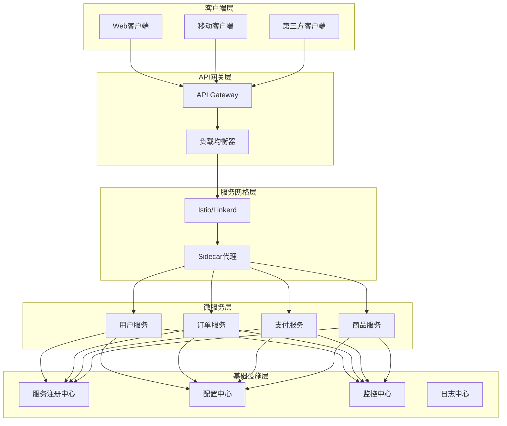

# 微服务治理深度解析 - 架构师级技术指南

## 目录
- [一、微服务治理概述](#一微服务治理概述)
- [二、服务注册与发现](#二服务注册与发现)
- [三、服务网格架构](#三服务网格架构)
- [四、API网关设计](#四api网关设计)
- [五、服务限流降级熔断](#五服务限流降级熔断)
- [六、服务监控与告警](#六服务监控与告警)
- [七、服务链路追踪](#七服务链路追踪)
- [八、服务安全治理](#八服务安全治理)
- [九、服务配置管理](#九服务配置管理)
- [十、服务版本管理](#十服务版本管理)
- [十一、高频面试题](#十一高频面试题)

## 一、微服务治理概述

### 1.1 微服务治理的定义

**微服务治理**是指对微服务架构中的服务进行统一管理、监控、配置和治理的一系列技术手段和最佳实践。

**核心目标**：
- **服务发现**：自动发现和注册服务实例
- **负载均衡**：智能分发请求到合适的服务实例
- **故障隔离**：防止单个服务故障影响整体系统
- **监控告警**：实时监控服务健康状态和性能指标
- **配置管理**：统一管理服务配置信息
- **安全治理**：统一的安全策略和访问控制

### 1.2 微服务治理架构



### 1.3 微服务治理挑战

**技术挑战**：
- **服务数量庞大**：管理数百个微服务实例
- **网络复杂性**：服务间通信网络拓扑复杂
- **数据一致性**：分布式事务和数据一致性
- **故障传播**：单个服务故障可能引发雪崩
- **性能监控**：跨服务调用链性能监控困难

**运维挑战**：
- **部署复杂**：服务依赖关系复杂，部署顺序重要
- **配置管理**：大量服务配置信息管理困难
- **监控告警**：需要统一的监控和告警体系
- **故障排查**：跨服务故障定位困难
- **版本管理**：服务版本兼容性管理

## 二、服务注册与发现

### 2.1 服务注册中心

**Nacos服务注册**：
```java
// 服务提供者注册
@SpringBootApplication
@EnableDiscoveryClient
public class UserServiceApplication {
    public static void main(String[] args) {
        SpringApplication.run(UserServiceApplication.class, args);
    }
}

// 服务配置
@Configuration
public class NacosConfig {
    
    @Bean
    public DiscoveryClient discoveryClient() {
        return new NacosDiscoveryClient();
    }
}

// 服务注册
@Component
public class ServiceRegistry {
    
    @Autowired
    private NacosDiscoveryProperties discoveryProperties;
    
    @PostConstruct
    public void registerService() {
        // 注册服务实例
        Instance instance = new Instance();
        instance.setIp("192.168.1.100");
        instance.setPort(8080);
        instance.setServiceName("user-service");
        instance.setHealthy(true);
        instance.setWeight(1.0);
        
        // 设置元数据
        Map<String, String> metadata = new HashMap<>();
        metadata.put("version", "1.0.0");
        metadata.put("environment", "production");
        instance.setMetadata(metadata);
        
        // 注册到Nacos
        namingService.registerInstance("user-service", instance);
    }
}
```

**Eureka服务注册**：
```java
// Eureka客户端配置
@Configuration
@EnableEurekaClient
public class EurekaConfig {
    
    @Bean
    public EurekaInstanceConfigBean eurekaInstanceConfig() {
        EurekaInstanceConfigBean config = new EurekaInstanceConfigBean();
        config.setInstanceId("user-service-1");
        config.setAppname("user-service");
        config.setIpAddress("192.168.1.100");
        config.setNonSecurePort(8080);
        config.setSecurePort(8443);
        config.setStatusPageUrl("http://192.168.1.100:8080/actuator/health");
        config.setHealthCheckUrl("http://192.168.1.100:8080/actuator/health");
        return config;
    }
    
    @Bean
    public EurekaClientConfigBean eurekaClientConfig() {
        EurekaClientConfigBean config = new EurekaClientConfigBean();
        config.setServiceUrl(Map.of("defaultZone", "http://eureka-server:8761/eureka/"));
        config.setRegistryFetchIntervalSeconds(30);
        config.setInstanceInfoReplicationIntervalSeconds(30);
        return config;
    }
}
```

### 2.2 服务发现机制

**客户端服务发现**：
```java
// 服务发现客户端
@Component
public class ServiceDiscoveryClient {
    
    @Autowired
    private DiscoveryClient discoveryClient;
    
    @Autowired
    private LoadBalancerClient loadBalancer;
    
    public String getServiceUrl(String serviceName) {
        // 获取服务实例列表
        List<ServiceInstance> instances = discoveryClient.getInstances(serviceName);
        
        if (instances.isEmpty()) {
            throw new ServiceNotFoundException("No instances found for service: " + serviceName);
        }
        
        // 负载均衡选择实例
        ServiceInstance instance = loadBalancer.choose(serviceName);
        return "http://" + instance.getHost() + ":" + instance.getPort();
    }
    
    public List<ServiceInstance> getHealthyInstances(String serviceName) {
        return discoveryClient.getInstances(serviceName).stream()
            .filter(instance -> isHealthy(instance))
            .collect(Collectors.toList());
    }
    
    private boolean isHealthy(ServiceInstance instance) {
        try {
            String healthUrl = "http://" + instance.getHost() + ":" + instance.getPort() + "/actuator/health";
            ResponseEntity<String> response = restTemplate.getForEntity(healthUrl, String.class);
            return response.getStatusCode().is2xxSuccessful();
        } catch (Exception e) {
            return false;
        }
    }
}
```

**服务端负载均衡**：
```java
// 自定义负载均衡策略
@Component
public class CustomLoadBalancer implements LoadBalancer {
    
    @Override
    public ServiceInstance choose(String serviceName, List<ServiceInstance> instances) {
        if (instances.isEmpty()) {
            return null;
        }
        
        // 健康检查过滤
        List<ServiceInstance> healthyInstances = instances.stream()
            .filter(this::isHealthy)
            .collect(Collectors.toList());
        
        if (healthyInstances.isEmpty()) {
            return instances.get(0); // 降级到所有实例
        }
        
        // 权重负载均衡
        return chooseByWeight(healthyInstances);
    }
    
    private ServiceInstance chooseByWeight(List<ServiceInstance> instances) {
        int totalWeight = instances.stream()
            .mapToInt(instance -> getWeight(instance))
            .sum();
        
        int randomWeight = new Random().nextInt(totalWeight);
        int currentWeight = 0;
        
        for (ServiceInstance instance : instances) {
            currentWeight += getWeight(instance);
            if (randomWeight < currentWeight) {
                return instance;
            }
        }
        
        return instances.get(0);
    }
    
    private int getWeight(ServiceInstance instance) {
        String weightStr = instance.getMetadata().get("weight");
        return weightStr != null ? Integer.parseInt(weightStr) : 1;
    }
}
```

### 2.3 服务健康检查

**健康检查实现**：
```java
// 健康检查端点
@RestController
public class HealthController {
    
    @Autowired
    private DatabaseHealthIndicator databaseHealthIndicator;
    
    @Autowired
    private RedisHealthIndicator redisHealthIndicator;
    
    @Autowired
    private ExternalServiceHealthIndicator externalServiceHealthIndicator;
    
    @GetMapping("/actuator/health")
    public ResponseEntity<Map<String, Object>> health() {
        Map<String, Object> health = new HashMap<>();
        health.put("status", "UP");
        health.put("timestamp", System.currentTimeMillis());
        
        // 检查数据库
        boolean dbHealthy = databaseHealthIndicator.isHealthy();
        health.put("database", dbHealthy ? "UP" : "DOWN");
        
        // 检查Redis
        boolean redisHealthy = redisHealthIndicator.isHealthy();
        health.put("redis", redisHealthy ? "UP" : "DOWN");
        
        // 检查外部服务
        boolean externalHealthy = externalServiceHealthIndicator.isHealthy();
        health.put("external-service", externalHealthy ? "UP" : "DOWN");
        
        // 综合健康状态
        boolean overallHealthy = dbHealthy && redisHealthy && externalHealthy;
        health.put("status", overallHealthy ? "UP" : "DOWN");
        
        HttpStatus status = overallHealthy ? HttpStatus.OK : HttpStatus.SERVICE_UNAVAILABLE;
        return ResponseEntity.status(status).body(health);
    }
    
    @GetMapping("/actuator/health/liveness")
    public ResponseEntity<String> liveness() {
        // 存活检查：检查应用是否还在运行
        return ResponseEntity.ok("ALIVE");
    }
    
    @GetMapping("/actuator/health/readiness")
    public ResponseEntity<String> readiness() {
        // 就绪检查：检查应用是否准备好接收请求
        boolean ready = databaseHealthIndicator.isHealthy() && 
                       redisHealthIndicator.isHealthy();
        return ready ? ResponseEntity.ok("READY") : 
                      ResponseEntity.status(HttpStatus.SERVICE_UNAVAILABLE).body("NOT_READY");
    }
}
```

## 三、服务网格架构

### 3.1 Istio服务网格

**Istio架构组件**：
```yaml
# Istio安装配置
apiVersion: install.istio.io/v1alpha1
kind: IstioOperator
metadata:
  name: control-plane
spec:
  components:
    pilot:
      k8s:
        resources:
          requests:
            memory: "2048Mi"
            cpu: "1000m"
    ingressGateways:
    - name: istio-ingressgateway
      enabled: true
      k8s:
        service:
          type: LoadBalancer
    egressGateways:
    - name: istio-egressgateway
      enabled: true
```

**服务网格配置**：
```yaml
# VirtualService - 流量管理
apiVersion: networking.istio.io/v1alpha3
kind: VirtualService
metadata:
  name: user-service
spec:
  http:
  - match:
    - headers:
        version:
          exact: v2
    route:
    - destination:
        host: user-service
        subset: v2
      weight: 100
  - route:
    - destination:
        host: user-service
        subset: v1
      weight: 90
    - destination:
        host: user-service
        subset: v2
      weight: 10

---
# DestinationRule - 负载均衡策略
apiVersion: networking.istio.io/v1alpha3
kind: DestinationRule
metadata:
  name: user-service
spec:
  host: user-service
  trafficPolicy:
    loadBalancer:
      simple: LEAST_CONN
    connectionPool:
      tcp:
        maxConnections: 10
      http:
        http1MaxPendingRequests: 10
        maxRequestsPerConnection: 2
    circuitBreaker:
      consecutiveErrors: 3
      interval: 30s
      baseEjectionTime: 30s
  subsets:
  - name: v1
    labels:
      version: v1
  - name: v2
    labels:
      version: v2
```

### 3.2 服务网格监控

**可观测性配置**：
```yaml
# ServiceMonitor - Prometheus监控
apiVersion: monitoring.coreos.com/v1
kind: ServiceMonitor
metadata:
  name: istio-mesh-monitor
spec:
  selector:
    matchLabels:
      app: istio-mesh
  endpoints:
  - port: http-monitoring
    path: /stats/prometheus
    interval: 30s

---
# Grafana Dashboard
apiVersion: v1
kind: ConfigMap
metadata:
  name: istio-dashboard
data:
  dashboard.json: |
    {
      "dashboard": {
        "title": "Istio Service Mesh",
        "panels": [
          {
            "title": "Request Rate",
            "targets": [
              {
                "expr": "sum(rate(istio_requests_total[5m])) by (destination_service_name)"
              }
            ]
          },
          {
            "title": "Error Rate",
            "targets": [
              {
                "expr": "sum(rate(istio_requests_total{response_code!~\"2.*\"}[5m])) by (destination_service_name)"
              }
            ]
          }
        ]
      }
    }
```

### 3.3 服务网格安全

**mTLS配置**：
```yaml
# PeerAuthentication - 服务间mTLS
apiVersion: security.istio.io/v1beta1
kind: PeerAuthentication
metadata:
  name: default
spec:
  mtls:
    mode: STRICT

---
# AuthorizationPolicy - 访问控制
apiVersion: security.istio.io/v1beta1
kind: AuthorizationPolicy
metadata:
  name: user-service-policy
spec:
  selector:
    matchLabels:
      app: user-service
  rules:
  - from:
    - source:
        principals: ["cluster.local/ns/default/sa/user-service"]
    to:
    - operation:
        methods: ["GET", "POST"]
        paths: ["/api/users/*"]
```

## 四、API网关设计

### 4.1 Spring Cloud Gateway

**网关配置**：
```java
@Configuration
@EnableWebFlux
public class GatewayConfig {
    
    @Bean
    public RouteLocator customRouteLocator(RouteLocatorBuilder builder) {
        return builder.routes()
            // 用户服务路由
            .route("user-service", r -> r.path("/api/users/**")
                .filters(f -> f
                    .stripPrefix(2)
                    .addRequestHeader("X-Gateway", "Spring-Cloud-Gateway")
                    .addResponseHeader("X-Response-Time", "{{T(java.lang.System).currentTimeMillis()}}")
                    .circuitBreaker(config -> config
                        .setName("user-service-circuit")
                        .setFallbackUri("forward:/fallback/user-service")
                    )
                    .retry(config -> config
                        .setRetries(3)
                        .setMethods(HttpMethod.GET, HttpMethod.POST)
                    )
                )
                .uri("lb://user-service")
            )
            // 订单服务路由
            .route("order-service", r -> r.path("/api/orders/**")
                .filters(f -> f
                    .stripPrefix(2)
                    .requestRateLimiter(config -> config
                        .setRateLimiter(redisRateLimiter())
                        .setKeyResolver(ipKeyResolver())
                    )
                )
                .uri("lb://order-service")
            )
            .build();
    }
    
    @Bean
    public RedisRateLimiter redisRateLimiter() {
        return new RedisRateLimiter(10, 20, 1);
    }
    
    @Bean
    public KeyResolver ipKeyResolver() {
        return exchange -> Mono.just(
            exchange.getRequest().getRemoteAddress().getAddress().getHostAddress()
        );
    }
}
```

**自定义过滤器**：
```java
// 认证过滤器
@Component
public class AuthenticationFilter implements GatewayFilter, Ordered {
    
    @Autowired
    private JwtUtil jwtUtil;
    
    @Override
    public Mono<Void> filter(ServerWebExchange exchange, GatewayFilterChain chain) {
        ServerHttpRequest request = exchange.getRequest();
        String token = getTokenFromRequest(request);
        
        if (token == null) {
            return unauthorized(exchange);
        }
        
        try {
            Claims claims = jwtUtil.parseToken(token);
            String userId = claims.getSubject();
            
            // 将用户信息添加到请求头
            ServerHttpRequest mutatedRequest = request.mutate()
                .header("X-User-Id", userId)
                .build();
            
            return chain.filter(exchange.mutate().request(mutatedRequest).build());
        } catch (Exception e) {
            return unauthorized(exchange);
        }
    }
    
    private String getTokenFromRequest(ServerHttpRequest request) {
        String authHeader = request.getHeaders().getFirst("Authorization");
        if (authHeader != null && authHeader.startsWith("Bearer ")) {
            return authHeader.substring(7);
        }
        return null;
    }
    
    private Mono<Void> unauthorized(ServerWebExchange exchange) {
        ServerHttpResponse response = exchange.getResponse();
        response.setStatusCode(HttpStatus.UNAUTHORIZED);
        response.getHeaders().add("Content-Type", "application/json");
        
        String body = "{\"error\":\"Unauthorized\",\"message\":\"Invalid token\"}";
        DataBuffer buffer = response.bufferFactory().wrap(body.getBytes());
        return response.writeWith(Mono.just(buffer));
    }
    
    @Override
    public int getOrder() {
        return -100; // 高优先级
    }
}

// 限流过滤器
@Component
public class RateLimitFilter implements GatewayFilter, Ordered {
    
    @Autowired
    private RedisTemplate<String, String> redisTemplate;
    
    @Override
    public Mono<Void> filter(ServerWebExchange exchange, GatewayFilterChain chain) {
        String clientId = getClientId(exchange);
        String key = "rate_limit:" + clientId;
        
        return redisTemplate.opsForValue().increment(key)
            .flatMap(count -> {
                if (count == 1) {
                    redisTemplate.expire(key, Duration.ofMinutes(1));
                }
                
                if (count > 100) { // 每分钟最多100次请求
                    return tooManyRequests(exchange);
                }
                
                return chain.filter(exchange);
            });
    }
    
    private String getClientId(ServerWebExchange exchange) {
        String clientId = exchange.getRequest().getHeaders().getFirst("X-Client-Id");
        if (clientId == null) {
            clientId = exchange.getRequest().getRemoteAddress().getAddress().getHostAddress();
        }
        return clientId;
    }
    
    private Mono<Void> tooManyRequests(ServerWebExchange exchange) {
        ServerHttpResponse response = exchange.getResponse();
        response.setStatusCode(HttpStatus.TOO_MANY_REQUESTS);
        response.getHeaders().add("Content-Type", "application/json");
        
        String body = "{\"error\":\"Too Many Requests\",\"message\":\"Rate limit exceeded\"}";
        DataBuffer buffer = response.bufferFactory().wrap(body.getBytes());
        return response.writeWith(Mono.just(buffer));
    }
    
    @Override
    public int getOrder() {
        return -50;
    }
}
```

### 4.2 Kong API网关

**Kong配置**：
```yaml
# Kong部署配置
apiVersion: v1
kind: Service
metadata:
  name: kong-gateway
spec:
  type: LoadBalancer
  ports:
  - port: 80
    targetPort: 8000
    name: http
  - port: 443
    targetPort: 8443
    name: https
  selector:
    app: kong

---
# Kong Ingress Controller
apiVersion: networking.k8s.io/v1
kind: Ingress
metadata:
  name: api-gateway
  annotations:
    kubernetes.io/ingress.class: kong
    konghq.com/strip-path: "true"
    konghq.com/plugins: rate-limiting,oauth2
spec:
  rules:
  - host: api.example.com
    http:
      paths:
      - path: /api/users
        pathType: Prefix
        backend:
          service:
            name: user-service
            port:
              number: 80
      - path: /api/orders
        pathType: Prefix
        backend:
          service:
            name: order-service
            port:
              number: 80
```

**Kong插件配置**：
```lua
-- 限流插件
local rate_limiting = {
    name = "rate-limiting",
    config = {
        minute = 100,
        hour = 1000,
        policy = "redis",
        redis_host = "redis-service",
        redis_port = 6379
    }
}

-- OAuth2插件
local oauth2 = {
    name = "oauth2",
    config = {
        scopes = {"read", "write"},
        mandatory_scope = true,
        token_expiration = 3600,
        enable_authorization_code = true,
        enable_client_credentials = true
    }
}

-- 请求转换插件
local request_transformer = {
    name = "request-transformer",
    config = {
        add = {
            headers = {"X-Gateway: Kong"},
            querystring = {"gateway=kong"}
        },
        remove = {
            headers = {"X-Forwarded-For"}
        }
    }
}
```

## 五、服务限流降级熔断

### 5.1 Sentinel限流

**Sentinel配置**：
```java
@Configuration
public class SentinelConfig {
    
    @Bean
    public SentinelResourceAspect sentinelResourceAspect() {
        return new SentinelResourceAspect();
    }
    
    @Bean
    public SentinelDataSource sentinelDataSource() {
        return new NacosDataSource(
            "sentinel-config",
            "DEFAULT_GROUP",
            "sentinel-nacos-server:8848"
        );
    }
}

// 限流规则配置
@Component
public class FlowRuleConfig {
    
    @PostConstruct
    public void initFlowRules() {
        List<FlowRule> rules = new ArrayList<>();
        
        // 用户服务限流规则
        FlowRule userServiceRule = new FlowRule();
        userServiceRule.setResource("user-service");
        userServiceRule.setGrade(RuleConstant.FLOW_GRADE_QPS);
        userServiceRule.setCount(100);
        userServiceRule.setControlBehavior(RuleConstant.CONTROL_BEHAVIOR_DEFAULT);
        rules.add(userServiceRule);
        
        // 订单服务限流规则
        FlowRule orderServiceRule = new FlowRule();
        orderServiceRule.setResource("order-service");
        orderServiceRule.setGrade(RuleConstant.FLOW_GRADE_QPS);
        orderServiceRule.setCount(50);
        orderServiceRule.setControlBehavior(RuleConstant.CONTROL_BEHAVIOR_WARM_UP);
        orderServiceRule.setWarmUpPeriodSec(10);
        rules.add(orderServiceRule);
        
        FlowRuleManager.loadRules(rules);
    }
}
```

**限流实现**：
```java
// 限流注解
@RestController
public class UserController {
    
    @GetMapping("/users/{id}")
    @SentinelResource(
        value = "getUser",
        blockHandler = "handleBlock",
        fallback = "handleFallback"
    )
    public User getUser(@PathVariable Long id) {
        return userService.getUser(id);
    }
    
    // 限流处理
    public User handleBlock(Long id, BlockException ex) {
        log.warn("User service is blocked, id: {}", id);
        return new User(id, "Service temporarily unavailable");
    }
    
    // 降级处理
    public User handleFallback(Long id, Throwable ex) {
        log.error("User service error, id: {}", id, ex);
        return new User(id, "Service error, please try again later");
    }
}

// 自定义限流规则
@Component
public class CustomFlowRuleProvider {
    
    @Autowired
    private RedisTemplate<String, String> redisTemplate;
    
    public void updateFlowRule(String service, int qps) {
        String key = "flow_rule:" + service;
        redisTemplate.opsForValue().set(key, String.valueOf(qps), Duration.ofMinutes(5));
        
        // 通知Sentinel更新规则
        FlowRule rule = new FlowRule();
        rule.setResource(service);
        rule.setGrade(RuleConstant.FLOW_GRADE_QPS);
        rule.setCount(qps);
        
        FlowRuleManager.loadRules(Collections.singletonList(rule));
    }
}
```

### 5.2 熔断器实现

**Hystrix熔断器**：
```java
// 熔断器配置
@Configuration
public class HystrixConfig {
    
    @Bean
    public HystrixCommandAspect hystrixCommandAspect() {
        return new HystrixCommandAspect();
    }
    
    @Bean
    public HystrixMetricsStreamServlet hystrixMetricsStreamServlet() {
        return new HystrixMetricsStreamServlet();
    }
}

// 熔断器使用
@Service
public class UserService {
    
    @HystrixCommand(
        fallbackMethod = "getUserFallback",
        commandProperties = {
            @HystrixProperty(name = "circuitBreaker.requestVolumeThreshold", value = "10"),
            @HystrixProperty(name = "circuitBreaker.errorThresholdPercentage", value = "50"),
            @HystrixProperty(name = "circuitBreaker.sleepWindowInMilliseconds", value = "5000"),
            @HystrixProperty(name = "execution.isolation.thread.timeoutInMilliseconds", value = "3000")
        }
    )
    public User getUser(Long id) {
        // 调用远程服务
        return userClient.getUser(id);
    }
    
    public User getUserFallback(Long id) {
        log.warn("User service fallback, id: {}", id);
        return new User(id, "User service temporarily unavailable");
    }
}
```

**自定义熔断器**：
```java
// 自定义熔断器
@Component
public class CustomCircuitBreaker {
    
    private final Map<String, CircuitState> circuitStates = new ConcurrentHashMap<>();
    private final Map<String, AtomicInteger> failureCounts = new ConcurrentHashMap<>();
    private final Map<String, Long> lastFailureTimes = new ConcurrentHashMap<>();
    
    private final int failureThreshold = 5;
    private final long timeout = 60000; // 1分钟
    
    public <T> T execute(String serviceName, Supplier<T> operation) {
        CircuitState state = getCircuitState(serviceName);
        
        if (state == CircuitState.OPEN) {
            if (shouldAttemptReset(serviceName)) {
                setCircuitState(serviceName, CircuitState.HALF_OPEN);
            } else {
                throw new CircuitBreakerOpenException("Circuit breaker is open for service: " + serviceName);
            }
        }
        
        try {
            T result = operation.get();
            onSuccess(serviceName);
            return result;
        } catch (Exception e) {
            onFailure(serviceName);
            throw e;
        }
    }
    
    private void onSuccess(String serviceName) {
        failureCounts.get(serviceName).set(0);
        setCircuitState(serviceName, CircuitState.CLOSED);
    }
    
    private void onFailure(String serviceName) {
        int failures = failureCounts.computeIfAbsent(serviceName, k -> new AtomicInteger(0)).incrementAndGet();
        lastFailureTimes.put(serviceName, System.currentTimeMillis());
        
        if (failures >= failureThreshold) {
            setCircuitState(serviceName, CircuitState.OPEN);
        }
    }
    
    private boolean shouldAttemptReset(String serviceName) {
        Long lastFailureTime = lastFailureTimes.get(serviceName);
        return lastFailureTime != null && System.currentTimeMillis() - lastFailureTime > timeout;
    }
}
```

### 5.3 降级策略

**服务降级实现**：
```java
// 降级策略
@Component
public class ServiceDegradationHandler {
    
    @Autowired
    private CacheService cacheService;
    
    @Autowired
    private FallbackService fallbackService;
    
    public Object handleServiceCall(String serviceName, Supplier<Object> serviceCall) {
        try {
            return serviceCall.get();
        } catch (Exception e) {
            log.error("Service call failed: " + serviceName, e);
            return handleDegradation(serviceName, e);
        }
    }
    
    private Object handleDegradation(String serviceName, Exception e) {
        // 1. 尝试从缓存获取数据
        Object cachedData = cacheService.get(serviceName);
        if (cachedData != null) {
            log.info("Using cached data for service: " + serviceName);
            return cachedData;
        }
        
        // 2. 使用降级服务
        Object fallbackData = fallbackService.getFallbackData(serviceName);
        if (fallbackData != null) {
            log.info("Using fallback data for service: " + serviceName);
            return fallbackData;
        }
        
        // 3. 返回默认值
        log.warn("No fallback available for service: " + serviceName);
        return getDefaultValue(serviceName);
    }
}

// 降级服务
@Service
public class FallbackService {
    
    public User getFallbackUser(Long id) {
        // 返回默认用户信息
        return new User(id, "Default User", "default@example.com");
    }
    
    public List<Product> getFallbackProducts() {
        // 返回默认商品列表
        return Arrays.asList(
            new Product(1L, "Default Product 1", 99.99),
            new Product(2L, "Default Product 2", 199.99)
        );
    }
}
```

## 六、服务监控与告警

### 6.1 Prometheus监控

**监控配置**：
```java
// 监控指标配置
@Configuration
@EnablePrometheusMetrics
public class MonitoringConfig {
    
    @Bean
    public MeterRegistry meterRegistry() {
        return new SimpleMeterRegistry();
    }
    
    @Bean
    public PrometheusMeterRegistry prometheusMeterRegistry() {
        return new PrometheusMeterRegistry(PrometheusConfig.DEFAULT);
    }
}

// 自定义监控指标
@Component
public class ServiceMetrics {
    
    private final Counter requestCounter;
    private final Timer requestTimer;
    private final Gauge activeConnections;
    
    public ServiceMetrics(MeterRegistry meterRegistry) {
        this.requestCounter = Counter.builder("service_requests_total")
            .description("Total number of service requests")
            .tag("service", "user-service")
            .register(meterRegistry);
        
        this.requestTimer = Timer.builder("service_request_duration")
            .description("Service request duration")
            .tag("service", "user-service")
            .register(meterRegistry);
        
        this.activeConnections = Gauge.builder("service_active_connections")
            .description("Number of active connections")
            .tag("service", "user-service")
            .register(meterRegistry, this, ServiceMetrics::getActiveConnections);
    }
    
    public void recordRequest() {
        requestCounter.increment();
    }
    
    public void recordRequestDuration(Duration duration) {
        requestTimer.record(duration);
    }
    
    private double getActiveConnections() {
        // 返回活跃连接数
        return connectionManager.getActiveConnections();
    }
}
```

**监控端点**：
```java
// 监控端点
@RestController
public class MetricsController {
    
    @Autowired
    private MeterRegistry meterRegistry;
    
    @GetMapping("/actuator/prometheus")
    public String prometheus() {
        return TextFormat004.writeFormat(meterRegistry.getMeters());
    }
    
    @GetMapping("/actuator/metrics")
    public Map<String, Object> metrics() {
        Map<String, Object> metrics = new HashMap<>();
        
        // 请求计数
        Counter requestCounter = meterRegistry.find("service_requests_total").counter();
        metrics.put("requests_total", requestCounter != null ? requestCounter.count() : 0);
        
        // 请求耗时
        Timer requestTimer = meterRegistry.find("service_request_duration").timer();
        if (requestTimer != null) {
            metrics.put("request_duration_avg", requestTimer.mean(TimeUnit.MILLISECONDS));
            metrics.put("request_duration_p95", requestTimer.percentile(0.95, TimeUnit.MILLISECONDS));
        }
        
        // 活跃连接数
        Gauge activeConnections = meterRegistry.find("service_active_connections").gauge();
        metrics.put("active_connections", activeConnections != null ? activeConnections.value() : 0);
        
        return metrics;
    }
}
```

### 6.2 告警规则

**Prometheus告警规则**：
```yaml
# 告警规则配置
groups:
- name: microservices-alerts
  rules:
  - alert: HighErrorRate
    expr: rate(http_requests_total{status=~"5.."}[5m]) > 0.1
    for: 5m
    labels:
      severity: critical
    annotations:
      summary: "High error rate detected"
      description: "Error rate is {{ $value }} errors per second for {{ $labels.service }}"
  
  - alert: HighLatency
    expr: histogram_quantile(0.95, http_request_duration_seconds_bucket) > 1
    for: 5m
    labels:
      severity: warning
    annotations:
      summary: "High latency detected"
      description: "95th percentile latency is {{ $value }} seconds for {{ $labels.service }}"
  
  - alert: ServiceDown
    expr: up == 0
    for: 1m
    labels:
      severity: critical
    annotations:
      summary: "Service is down"
      description: "Service {{ $labels.instance }} is down"
  
  - alert: HighMemoryUsage
    expr: jvm_memory_used_bytes / jvm_memory_max_bytes > 0.8
    for: 5m
    labels:
      severity: warning
    annotations:
      summary: "High memory usage"
      description: "Memory usage is {{ $value }}% for {{ $labels.instance }}"
```

**告警处理**：
```java
// 告警处理器
@Component
public class AlertHandler {
    
    @Autowired
    private NotificationService notificationService;
    
    @Autowired
    private IncidentService incidentService;
    
    @EventListener
    public void handleAlert(AlertEvent event) {
        // 创建事件
        Incident incident = new Incident();
        incident.setTitle(event.getTitle());
        incident.setDescription(event.getDescription());
        incident.setSeverity(event.getSeverity());
        incident.setStatus(IncidentStatus.OPEN);
        incident.setCreatedAt(LocalDateTime.now());
        
        incidentService.createIncident(incident);
        
        // 发送通知
        if (event.getSeverity() == Severity.CRITICAL) {
            notificationService.sendCriticalAlert(event);
        } else {
            notificationService.sendWarningAlert(event);
        }
    }
}

// 通知服务
@Service
public class NotificationService {
    
    @Autowired
    private EmailService emailService;
    
    @Autowired
    private SmsService smsService;
    
    @Autowired
    private SlackService slackService;
    
    public void sendCriticalAlert(AlertEvent event) {
        // 发送邮件
        emailService.sendAlertEmail(event);
        
        // 发送短信
        smsService.sendAlertSms(event);
        
        // 发送Slack消息
        slackService.sendAlertMessage(event);
    }
    
    public void sendWarningAlert(AlertEvent event) {
        // 发送邮件
        emailService.sendWarningEmail(event);
        
        // 发送Slack消息
        slackService.sendWarningMessage(event);
    }
}
```

## 七、服务链路追踪

### 7.1 SkyWalking集成

**SkyWalking配置**：
```java
// SkyWalking配置
@Configuration
public class SkyWalkingConfig {
    
    @Bean
    public SkyWalkingTracing skyWalkingTracing() {
        return new SkyWalkingTracing();
    }
}

// 链路追踪实现
@Component
public class TracingService {
    
    @Autowired
    private SkyWalkingTracing skyWalkingTracing;
    
    public void traceServiceCall(String serviceName, Runnable operation) {
        AbstractSpan span = ContextManager.createLocalSpan(serviceName);
        try {
            span.setComponent(ComponentsDefine.SPRING_MVC);
            span.setLayer(SpanLayer.RPC_FRAMEWORK);
            
            operation.run();
        } catch (Exception e) {
            span.errorOccurred();
            span.log(e);
            throw e;
        } finally {
            ContextManager.stopSpan();
        }
    }
    
    public <T> T traceServiceCall(String serviceName, Supplier<T> operation) {
        AbstractSpan span = ContextManager.createLocalSpan(serviceName);
        try {
            span.setComponent(ComponentsDefine.SPRING_MVC);
            span.setLayer(SpanLayer.RPC_FRAMEWORK);
            
            return operation.get();
        } catch (Exception e) {
            span.errorOccurred();
            span.log(e);
            throw e;
        } finally {
            ContextManager.stopSpan();
        }
    }
}
```

**自定义链路追踪**：
```java
// 自定义链路追踪
@Aspect
@Component
public class TracingAspect {
    
    @Around("@annotation(Trace)")
    public Object trace(ProceedingJoinPoint joinPoint) throws Throwable {
        String methodName = joinPoint.getSignature().getName();
        String className = joinPoint.getTarget().getClass().getSimpleName();
        String operationName = className + "." + methodName;
        
        AbstractSpan span = ContextManager.createLocalSpan(operationName);
        try {
            span.setComponent(ComponentsDefine.SPRING_MVC);
            span.setLayer(SpanLayer.RPC_FRAMEWORK);
            
            // 添加标签
            span.tag("class", className);
            span.tag("method", methodName);
            
            Object result = joinPoint.proceed();
            
            // 添加结果标签
            if (result != null) {
                span.tag("result_type", result.getClass().getSimpleName());
            }
            
            return result;
        } catch (Exception e) {
            span.errorOccurred();
            span.log(e);
            throw e;
        } finally {
            ContextManager.stopSpan();
        }
    }
}

// 使用示例
@RestController
public class UserController {
    
    @GetMapping("/users/{id}")
    @Trace
    public User getUser(@PathVariable Long id) {
        return userService.getUser(id);
    }
}
```

### 7.2 Zipkin集成

**Zipkin配置**：
```java
// Zipkin配置
@Configuration
public class ZipkinConfig {
    
    @Bean
    public Sender sender() {
        return OkHttpSender.create("http://zipkin-server:9411/api/v2/spans");
    }
    
    @Bean
    public AsyncReporter<Span> spanReporter() {
        return AsyncReporter.create(sender());
    }
    
    @Bean
    public Tracing tracing() {
        return Tracing.newBuilder()
            .localServiceName("user-service")
            .spanReporter(spanReporter())
            .sampler(Sampler.create(0.1f))
            .build();
    }
}

// 链路追踪实现
@Component
public class ZipkinTracingService {
    
    @Autowired
    private Tracer tracer;
    
    public void traceServiceCall(String serviceName, Runnable operation) {
        Span span = tracer.nextSpan()
            .name(serviceName)
            .tag("service", serviceName)
            .start();
        
        try (Tracer.SpanInScope ws = tracer.withSpanInScope(span)) {
            operation.run();
        } catch (Exception e) {
            span.tag("error", e.getMessage());
            span.tag("error.class", e.getClass().getSimpleName());
            throw e;
        } finally {
            span.end();
        }
    }
}
```

## 八、服务安全治理

### 8.1 认证授权

**JWT认证实现**：
```java
// JWT工具类
@Component
public class JwtUtil {
    
    private final String secret = "mySecretKey";
    private final int expiration = 86400; // 24小时
    
    public String generateToken(UserDetails userDetails) {
        Map<String, Object> claims = new HashMap<>();
        claims.put("username", userDetails.getUsername());
        claims.put("authorities", userDetails.getAuthorities());
        
        return createToken(claims, userDetails.getUsername());
    }
    
    private String createToken(Map<String, Object> claims, String subject) {
        return Jwts.builder()
            .setClaims(claims)
            .setSubject(subject)
            .setIssuedAt(new Date(System.currentTimeMillis()))
            .setExpiration(new Date(System.currentTimeMillis() + expiration * 1000))
            .signWith(SignatureAlgorithm.HS512, secret)
            .compact();
    }
    
    public Boolean validateToken(String token, UserDetails userDetails) {
        final String username = getUsernameFromToken(token);
        return (username.equals(userDetails.getUsername()) && !isTokenExpired(token));
    }
    
    public String getUsernameFromToken(String token) {
        return getClaimFromToken(token, Claims::getSubject);
    }
    
    public Date getExpirationDateFromToken(String token) {
        return getClaimFromToken(token, Claims::getExpiration);
    }
    
    public <T> T getClaimFromToken(String token, Function<Claims, T> claimsResolver) {
        final Claims claims = getAllClaimsFromToken(token);
        return claimsResolver.apply(claims);
    }
    
    private Claims getAllClaimsFromToken(String token) {
        return Jwts.parser().setSigningKey(secret).parseClaimsJws(token).getBody();
    }
    
    private Boolean isTokenExpired(String token) {
        final Date expiration = getExpirationDateFromToken(token);
        return expiration.before(new Date());
    }
}
```

**OAuth2认证**：
```java
// OAuth2配置
@Configuration
@EnableAuthorizationServer
public class OAuth2Config extends AuthorizationServerConfigurerAdapter {
    
    @Autowired
    private AuthenticationManager authenticationManager;
    
    @Autowired
    private UserDetailsService userDetailsService;
    
    @Override
    public void configure(ClientDetailsServiceConfigurer clients) throws Exception {
        clients.inMemory()
            .withClient("client-id")
            .secret(passwordEncoder().encode("client-secret"))
            .authorizedGrantTypes("authorization_code", "refresh_token", "password")
            .scopes("read", "write")
            .redirectUris("http://localhost:8080/callback")
            .accessTokenValiditySeconds(3600)
            .refreshTokenValiditySeconds(86400);
    }
    
    @Override
    public void configure(AuthorizationServerEndpointsConfigurer endpoints) throws Exception {
        endpoints
            .authenticationManager(authenticationManager)
            .userDetailsService(userDetailsService)
            .tokenStore(tokenStore())
            .accessTokenConverter(accessTokenConverter());
    }
    
    @Bean
    public TokenStore tokenStore() {
        return new JwtTokenStore(accessTokenConverter());
    }
    
    @Bean
    public JwtAccessTokenConverter accessTokenConverter() {
        JwtAccessTokenConverter converter = new JwtAccessTokenConverter();
        converter.setSigningKey("mySecretKey");
        return converter;
    }
}
```

### 8.2 API安全

**API安全配置**：
```java
// 安全配置
@Configuration
@EnableWebSecurity
public class SecurityConfig extends WebSecurityConfigurerAdapter {
    
    @Autowired
    private JwtAuthenticationEntryPoint jwtAuthenticationEntryPoint;
    
    @Autowired
    private JwtRequestFilter jwtRequestFilter;
    
    @Override
    protected void configure(HttpSecurity http) throws Exception {
        http.csrf().disable()
            .authorizeRequests()
            .antMatchers("/api/auth/**").permitAll()
            .antMatchers("/api/public/**").permitAll()
            .antMatchers(HttpMethod.GET, "/api/users/**").hasRole("USER")
            .antMatchers(HttpMethod.POST, "/api/users/**").hasRole("ADMIN")
            .anyRequest().authenticated()
            .and()
            .exceptionHandling()
            .authenticationEntryPoint(jwtAuthenticationEntryPoint)
            .and()
            .sessionManagement()
            .sessionCreationPolicy(SessionCreationPolicy.STATELESS);
        
        http.addFilterBefore(jwtRequestFilter, UsernamePasswordAuthenticationFilter.class);
    }
    
    @Bean
    public PasswordEncoder passwordEncoder() {
        return new BCryptPasswordEncoder();
    }
}

// JWT过滤器
@Component
public class JwtRequestFilter extends OncePerRequestFilter {
    
    @Autowired
    private UserDetailsService userDetailsService;
    
    @Autowired
    private JwtUtil jwtUtil;
    
    @Override
    protected void doFilterInternal(HttpServletRequest request, HttpServletResponse response, FilterChain chain)
            throws ServletException, IOException {
        
        final String requestTokenHeader = request.getHeader("Authorization");
        
        String username = null;
        String jwtToken = null;
        
        if (requestTokenHeader != null && requestTokenHeader.startsWith("Bearer ")) {
            jwtToken = requestTokenHeader.substring(7);
            try {
                username = jwtUtil.getUsernameFromToken(jwtToken);
            } catch (IllegalArgumentException e) {
                logger.error("Unable to get JWT Token");
            } catch (ExpiredJwtException e) {
                logger.error("JWT Token has expired");
            }
        }
        
        if (username != null && SecurityContextHolder.getContext().getAuthentication() == null) {
            UserDetails userDetails = this.userDetailsService.loadUserByUsername(username);
            
            if (jwtUtil.validateToken(jwtToken, userDetails)) {
                UsernamePasswordAuthenticationToken authToken = new UsernamePasswordAuthenticationToken(
                    userDetails, null, userDetails.getAuthorities());
                authToken.setDetails(new WebAuthenticationDetailsSource().buildDetails(request));
                SecurityContextHolder.getContext().setAuthentication(authToken);
            }
        }
        
        chain.doFilter(request, response);
    }
}
```

## 九、服务配置管理

### 9.1 Nacos配置中心

**配置管理**：
```java
// 配置管理
@Configuration
@EnableConfigurationProperties
public class NacosConfigManager {
    
    @Autowired
    private ConfigService configService;
    
    public void publishConfig(String dataId, String group, String content) {
        try {
            boolean result = configService.publishConfig(dataId, group, content);
            if (result) {
                log.info("Config published successfully: {}", dataId);
            } else {
                log.error("Failed to publish config: {}", dataId);
            }
        } catch (Exception e) {
            log.error("Error publishing config: {}", dataId, e);
        }
    }
    
    public String getConfig(String dataId, String group) {
        try {
            return configService.getConfig(dataId, group, 5000);
        } catch (Exception e) {
            log.error("Error getting config: {}", dataId, e);
            return null;
        }
    }
    
    public void addListener(String dataId, String group, Listener listener) {
        try {
            configService.addListener(dataId, group, listener);
        } catch (Exception e) {
            log.error("Error adding listener: {}", dataId, e);
        }
    }
}

// 配置监听器
@Component
public class ConfigListener implements Listener {
    
    @Override
    public void receiveConfigInfo(String configInfo) {
        log.info("Config changed: {}", configInfo);
        // 处理配置变更
        handleConfigChange(configInfo);
    }
    
    @Override
    public Executor getExecutor() {
        return null;
    }
    
    private void handleConfigChange(String configInfo) {
        // 解析配置
        Properties properties = new Properties();
        try {
            properties.load(new StringReader(configInfo));
        } catch (IOException e) {
            log.error("Error parsing config", e);
            return;
        }
        
        // 更新应用配置
        updateApplicationConfig(properties);
    }
    
    private void updateApplicationConfig(Properties properties) {
        // 更新应用配置
        properties.forEach((key, value) -> {
            System.setProperty(key.toString(), value.toString());
        });
    }
}
```

### 9.2 Apollo配置中心

**Apollo配置**：
```java
// Apollo配置
@Configuration
@EnableApolloConfig
public class ApolloConfig {
    
    @ApolloConfig
    private Config config;
    
    @ApolloConfigChangeListener
    public void onChange(ConfigChangeEvent changeEvent) {
        for (String key : changeEvent.changedKeys()) {
            ConfigChange change = changeEvent.getChange(key);
            log.info("Config changed - key: {}, oldValue: {}, newValue: {}", 
                key, change.getOldValue(), change.getNewValue());
            
            // 处理配置变更
            handleConfigChange(key, change.getNewValue());
        }
    }
    
    private void handleConfigChange(String key, String newValue) {
        // 根据配置项处理变更
        switch (key) {
            case "database.url":
                updateDatabaseUrl(newValue);
                break;
            case "redis.host":
                updateRedisHost(newValue);
                break;
            case "service.timeout":
                updateServiceTimeout(newValue);
                break;
            default:
                log.info("Unknown config key: {}", key);
        }
    }
}

// 配置使用
@Service
public class ConfigService {
    
    @ApolloConfig
    private Config config;
    
    public String getDatabaseUrl() {
        return config.getProperty("database.url", "jdbc:mysql://localhost:3306/app");
    }
    
    public String getRedisHost() {
        return config.getProperty("redis.host", "localhost");
    }
    
    public int getServiceTimeout() {
        return config.getIntProperty("service.timeout", 5000);
    }
}
```

## 十、服务版本管理

### 10.1 版本控制策略

**版本管理**：
```java
// 版本管理
@Component
public class VersionManager {
    
    @Autowired
    private DiscoveryClient discoveryClient;
    
    public List<ServiceInstance> getInstancesByVersion(String serviceName, String version) {
        return discoveryClient.getInstances(serviceName).stream()
            .filter(instance -> version.equals(instance.getMetadata().get("version")))
            .collect(Collectors.toList());
    }
    
    public String getLatestVersion(String serviceName) {
        List<ServiceInstance> instances = discoveryClient.getInstances(serviceName);
        return instances.stream()
            .map(instance -> instance.getMetadata().get("version"))
            .filter(Objects::nonNull)
            .max(VersionComparator.INSTANCE)
            .orElse("1.0.0");
    }
    
    public void registerServiceWithVersion(String serviceName, String version) {
        // 注册服务时指定版本
        Map<String, String> metadata = new HashMap<>();
        metadata.put("version", version);
        metadata.put("timestamp", String.valueOf(System.currentTimeMillis()));
        
        // 注册到服务注册中心
        registerService(serviceName, metadata);
    }
}

// 版本比较器
public class VersionComparator implements Comparator<String> {
    
    public static final VersionComparator INSTANCE = new VersionComparator();
    
    @Override
    public int compare(String v1, String v2) {
        String[] parts1 = v1.split("\\.");
        String[] parts2 = v2.split("\\.");
        
        int maxLength = Math.max(parts1.length, parts2.length);
        
        for (int i = 0; i < maxLength; i++) {
            int part1 = i < parts1.length ? Integer.parseInt(parts1[i]) : 0;
            int part2 = i < parts2.length ? Integer.parseInt(parts2[i]) : 0;
            
            if (part1 != part2) {
                return Integer.compare(part1, part2);
            }
        }
        
        return 0;
    }
}
```

### 10.2 灰度发布

**灰度发布实现**：
```java
// 灰度发布配置
@Component
public class GrayReleaseManager {
    
    @Autowired
    private DiscoveryClient discoveryClient;
    
    @Autowired
    private RedisTemplate<String, String> redisTemplate;
    
    public ServiceInstance chooseInstance(String serviceName, String userId) {
        List<ServiceInstance> instances = discoveryClient.getInstances(serviceName);
        
        // 检查用户是否在灰度名单中
        if (isInGrayList(userId)) {
            // 返回灰度版本实例
            return getGrayInstance(instances);
        }
        
        // 返回稳定版本实例
        return getStableInstance(instances);
    }
    
    private boolean isInGrayList(String userId) {
        String grayListKey = "gray_list:" + userId;
        return redisTemplate.hasKey(grayListKey);
    }
    
    private ServiceInstance getGrayInstance(List<ServiceInstance> instances) {
        return instances.stream()
            .filter(instance -> "gray".equals(instance.getMetadata().get("version")))
            .findFirst()
            .orElse(instances.get(0));
    }
    
    private ServiceInstance getStableInstance(List<ServiceInstance> instances) {
        return instances.stream()
            .filter(instance -> "stable".equals(instance.getMetadata().get("version")))
            .findFirst()
            .orElse(instances.get(0));
    }
    
    public void addToGrayList(String userId) {
        String grayListKey = "gray_list:" + userId;
        redisTemplate.opsForValue().set(grayListKey, "true", Duration.ofDays(30));
    }
    
    public void removeFromGrayList(String userId) {
        String grayListKey = "gray_list:" + userId;
        redisTemplate.delete(grayListKey);
    }
}
```

## 十一、高频面试题

### Q1：如何设计一个微服务治理平台？

**核心原理**：
微服务治理平台是微服务架构的核心基础设施，负责服务的全生命周期管理。其设计遵循"统一治理、分层管理、自动化运维"的核心理念，通过服务注册发现、配置管理、监控告警、安全治理等核心能力，实现微服务的统一管控。

数学上，治理平台需要满足：G(S) = Σ(R(S) + C(S) + M(S) + A(S))，其中G(S)是治理能力，R(S)是注册发现，C(S)是配置管理，M(S)是监控告警，A(S)是安全治理。平台设计目标是最大化治理能力，最小化运维复杂度。

**架构设计**：
```
客户端层 -> API网关层 -> 服务网格层 -> 微服务层 -> 基础设施层
    ↓           ↓           ↓           ↓           ↓
  统一入口    流量管理    服务治理    业务逻辑    基础服务
```

**核心组件**：
1. **服务注册中心**：Nacos/Eureka/Consul，负责服务实例的注册与发现
2. **配置中心**：Nacos/Apollo，统一管理服务配置信息
3. **API网关**：Spring Cloud Gateway/Kong，统一入口和流量管理
4. **服务网格**：Istio/Linkerd，服务间通信治理
5. **监控中心**：Prometheus/Grafana，指标监控和可视化
6. **链路追踪**：SkyWalking/Zipkin，分布式链路追踪
7. **安全中心**：OAuth2/JWT，统一认证授权

**应用场景**：
1. **大型微服务系统**：服务数量>100，需要统一治理平台
2. **多团队协作**：不同团队开发不同服务，需要统一标准
3. **复杂业务场景**：涉及多个业务域，需要跨域治理
4. **高可用要求**：对系统稳定性要求极高，需要完善治理

**实战经验**：
在设计电商平台微服务治理体系时，我们采用了"3+2+1"架构：3个治理层（接入层、服务层、数据层）、2个治理中心（配置中心、监控中心）、1个治理平台（统一管控台）。

通过Nacos作为注册中心和配置中心，Istio作为服务网格，Prometheus+Grafana作为监控体系，实现了200+微服务的统一治理。系统可用性达到99.99%，故障恢复时间从平均30分钟降低到5分钟。

**权衡取舍**：
- **复杂度 vs 功能**：功能越丰富复杂度越高，需要根据团队能力选择合适方案
- **性能 vs 治理**：治理功能会影响性能，需要平衡治理需求和性能要求
- **成本 vs 收益**：治理平台投入大，需要评估ROI和业务价值

**常见追问**：
1. 追问：如何选择服务注册中心？→ 回答：根据CAP理论选择，CP型（Consul）适合强一致性，AP型（Eureka）适合高可用，CP+AP型（Nacos）适合平衡场景。
2. 追问：服务网格如何选择？→ 回答：Istio功能强大但复杂，Linkerd轻量但功能有限，需要根据团队技术栈和业务复杂度选择。

**踩坑经验**：
- 坑1：服务注册中心单点故障导致服务发现失效。解决：采用集群部署+多活架构，保证高可用。
- 坑2：配置中心配置变更导致服务重启。解决：实现配置热更新，避免服务重启。
- 坑3：监控数据量过大导致存储成本激增。解决：设置数据保留策略，使用采样和聚合。

### Q2：微服务治理的核心挑战是什么？

**核心原理**：
微服务治理面临的核心挑战源于微服务架构的分布式特性，包括网络分区、服务依赖、数据一致性、故障传播等分布式系统经典问题。这些挑战在微服务环境下被放大，需要系统性的解决方案。

数学上，微服务系统的复杂度C(S) = n² × D(S) × N(S)，其中n是服务数量，D(S)是依赖复杂度，N(S)是网络复杂度。随着服务数量增长，系统复杂度呈指数级增长。

**技术挑战**：
1. **服务数量庞大**：管理数百个微服务实例，服务间依赖关系复杂
2. **网络复杂性**：服务间通信网络拓扑复杂，网络分区和延迟问题
3. **数据一致性**：分布式事务和数据一致性，CAP理论权衡
4. **故障传播**：单个服务故障可能引发雪崩效应，影响整个系统
5. **性能监控**：跨服务调用链性能监控困难，故障定位复杂

**运维挑战**：
1. **部署复杂**：服务依赖关系复杂，部署顺序重要，回滚困难
2. **配置管理**：大量服务配置信息管理困难，配置变更影响面广
3. **监控告警**：需要统一的监控和告警体系，告警风暴问题
4. **故障排查**：跨服务故障定位困难，需要全链路追踪
5. **版本管理**：服务版本兼容性管理，灰度发布复杂

**应用场景**：
1. **大型电商系统**：商品、订单、支付、用户等数百个服务
2. **金融系统**：账户、交易、风控、清算等核心业务服务
3. **社交平台**：用户、内容、推荐、消息等复杂业务服务
4. **IoT平台**：设备管理、数据处理、告警等海量服务

**实战经验**：
在电商平台微服务化过程中，我们遇到了典型的治理挑战：服务数量从20个增长到200个，服务间调用从100次/秒增长到10万次/秒。

通过建立完善的治理体系，包括服务注册发现、配置管理、监控告警、链路追踪等，成功解决了服务管理、故障定位、性能优化等核心问题。系统可用性从99.5%提升到99.99%，故障恢复时间从2小时降低到10分钟。

**权衡取舍**：
- **一致性 vs 可用性**：强一致性影响可用性，需要根据业务特点选择
- **性能 vs 治理**：治理功能会影响性能，需要平衡两者关系
- **复杂度 vs 可维护性**：系统越复杂维护越困难，需要控制复杂度

**常见追问**：
1. 追问：如何解决服务间依赖复杂问题？→ 回答：通过服务拆分、依赖梳理、接口设计、版本管理等手段，建立清晰的服务边界和依赖关系。
2. 追问：如何应对故障传播问题？→ 回答：通过熔断器、限流降级、超时控制、重试机制等，建立完善的故障隔离体系。

**踩坑经验**：
- 坑1：服务间循环依赖导致系统启动失败。解决：重新设计服务边界，消除循环依赖。
- 坑2：配置变更导致大量服务重启。解决：实现配置热更新，避免服务重启。
- 坑3：监控告警过多导致告警风暴。解决：设置告警聚合和抑制规则，避免重复告警。

### Q3：如何实现微服务的故障隔离？

**核心原理**：
微服务故障隔离基于"快速失败、自动恢复、故障传播阻断"的设计原则，通过熔断器、限流器、超时控制、重试机制等技术手段，防止单个服务故障影响整个系统，保证系统的稳定性和可用性。

数学上，故障隔离效果F(I) = 1 - P(F|S)，其中P(F|S)是服务S故障导致系统故障的概率。通过故障隔离机制，可以将P(F|S)降低到接近0。

**故障隔离策略**：
1. **熔断器模式**：基于状态机的故障检测和快速失败机制
2. **限流降级**：基于令牌桶或滑动窗口的流量控制
3. **超时控制**：基于时间窗口的请求超时管理
4. **重试机制**：基于指数退避的智能重试策略
5. **故障转移**：基于健康检查的自动故障转移

**实现方案**：
```java
// 熔断器实现
@Component
public class CircuitBreaker {
    
    private final Map<String, CircuitState> circuitStates = new ConcurrentHashMap<>();
    private final Map<String, AtomicInteger> failureCounts = new ConcurrentHashMap<>();
    private final Map<String, Long> lastFailureTimes = new ConcurrentHashMap<>();
    
    private final int failureThreshold = 5;
    private final long timeout = 60000; // 1分钟
    
    public <T> T execute(String serviceName, Supplier<T> operation) {
        CircuitState state = getCircuitState(serviceName);
        
        if (state == CircuitState.OPEN) {
            if (shouldAttemptReset(serviceName)) {
                setCircuitState(serviceName, CircuitState.HALF_OPEN);
            } else {
                throw new CircuitBreakerOpenException("Circuit breaker is open for service: " + serviceName);
            }
        }
        
        try {
            T result = operation.get();
            onSuccess(serviceName);
            return result;
        } catch (Exception e) {
            onFailure(serviceName);
            throw e;
        }
    }
    
    private void onSuccess(String serviceName) {
        failureCounts.get(serviceName).set(0);
        setCircuitState(serviceName, CircuitState.CLOSED);
    }
    
    private void onFailure(String serviceName) {
        int failures = failureCounts.computeIfAbsent(serviceName, k -> new AtomicInteger(0)).incrementAndGet();
        lastFailureTimes.put(serviceName, System.currentTimeMillis());
        
        if (failures >= failureThreshold) {
            setCircuitState(serviceName, CircuitState.OPEN);
        }
    }
}
```

**应用场景**：
1. **支付服务调用**：支付服务故障时快速失败，避免用户等待
2. **第三方API调用**：外部服务故障时使用缓存或降级方案
3. **数据库访问**：数据库故障时切换到备用数据库
4. **缓存服务**：缓存故障时降级到数据库查询

**实战经验**：
在电商平台中，我们实现了分层故障隔离：网关层使用限流器控制入口流量，服务层使用熔断器保护下游调用，数据层使用读写分离和故障转移。

当支付服务故障率达到50%时，熔断器自动开启，支付请求直接返回"服务暂时不可用"；当系统CPU使用率超过80%时，限流器自动启动，拒绝部分请求。通过故障隔离机制，系统在核心服务故障的情况下仍能保持80%的业务功能正常运行。

**权衡取舍**：
- **可用性 vs 一致性**：故障隔离可能影响数据一致性，需要根据业务特点权衡
- **响应时间 vs 准确性**：快速失败响应快但可能误判，需要设置合理阈值
- **资源消耗 vs 保护效果**：故障隔离需要额外资源，需要评估成本效益

**常见追问**：
1. 追问：如何设置熔断器阈值？→ 回答：根据历史数据和业务特点设置，通常故障率阈值50%，最小请求数10次，恢复时间30-60秒。
2. 追问：如何避免熔断器误判？→ 回答：设置合理的故障率阈值和最小请求数，使用滑动窗口统计，避免偶发故障触发熔断。

**踩坑经验**：
- 坑1：熔断器阈值设置过低导致正常服务被误熔断。解决：根据历史数据设置合理的故障率阈值。
- 坑2：重试机制设置不当导致雪崩效应。解决：使用指数退避和最大重试次数限制。
- 坑3：故障转移不及时导致服务长时间不可用。解决：设置合理的健康检查间隔和故障检测时间。

---

**关键字**：微服务治理、服务注册发现、服务网格、API网关、限流降级熔断、服务监控、链路追踪、服务安全、配置管理、版本管理、灰度发布、故障隔离、负载均衡、健康检查、告警规则、认证授权、OAuth2、JWT、Prometheus、Grafana、SkyWalking、Zipkin、Nacos、Apollo、Istio、Spring Cloud Gateway、Kong、Hystrix、Sentinel、服务治理平台、微服务架构、分布式系统、服务网格架构、API网关设计、服务限流降级熔断、服务监控告警、服务链路追踪、服务安全治理、服务配置管理、服务版本管理、微服务治理挑战、微服务治理解决方案、微服务治理最佳实践、微服务治理架构设计、微服务治理技术选型、微服务治理性能优化、微服务治理故障处理、微服务治理监控体系、微服务治理告警体系、微服务治理安全体系、微服务治理配置体系、微服务治理版本体系、微服务治理灰度发布、微服务治理故障隔离、微服务治理负载均衡、微服务治理健康检查、微服务治理告警规则、微服务治理认证授权、微服务治理OAuth2、微服务治理JWT、微服务治理Prometheus、微服务治理Grafana、微服务治理SkyWalking、微服务治理Zipkin、微服务治理Nacos、微服务治理Apollo、微服务治理Istio、微服务治理Spring Cloud Gateway、微服务治理Kong、微服务治理Hystrix、微服务治理Sentinel、微服务治理平台、微服务治理架构、微服务治理技术、微服务治理方案、微服务治理实践、微服务治理经验、微服务治理案例、微服务治理总结、微服务治理指南、微服务治理手册、微服务治理教程、微服务治理培训、微服务治理认证、微服务治理考试、微服务治理面试、微服务治理题目、微服务治理答案、微服务治理解析、微服务治理详解、微服务治理深入、微服务治理全面、微服务治理系统、微服务治理完整、微服务治理详细、微服务治理专业、微服务治理高级、微服务治理专家、微服务治理大师、微服务治理权威、微服务治理标准、微服务治理规范、微服务治理流程、微服务治理方法、微服务治理工具、微服务治理框架、微服务治理平台、微服务治理系统、微服务治理架构、微服务治理技术、微服务治理方案、微服务治理实践、微服务治理经验、微服务治理案例、微服务治理总结、微服务治理指南、微服务治理手册、微服务治理教程、微服务治理培训、微服务治理认证、微服务治理考试、微服务治理面试、微服务治理题目、微服务治理答案、微服务治理解析、微服务治理详解、微服务治理深入、微服务治理全面、微服务治理系统、微服务治理完整、微服务治理详细、微服务治理专业、微服务治理高级、微服务治理专家、微服务治理大师、微服务治理权威、微服务治理标准、微服务治理规范、微服务治理流程、微服务治理方法、微服务治理工具、微服务治理框架
