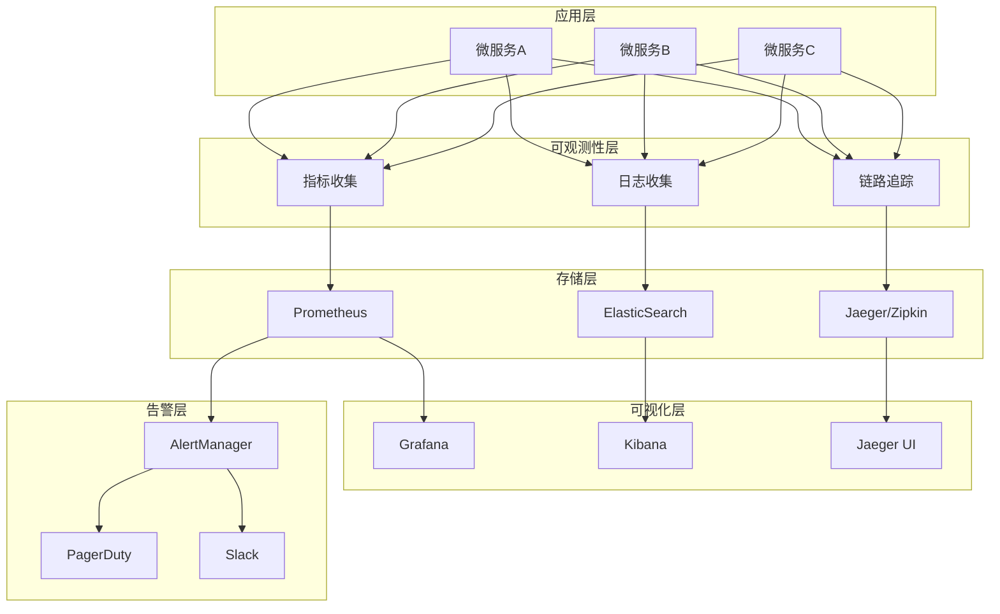
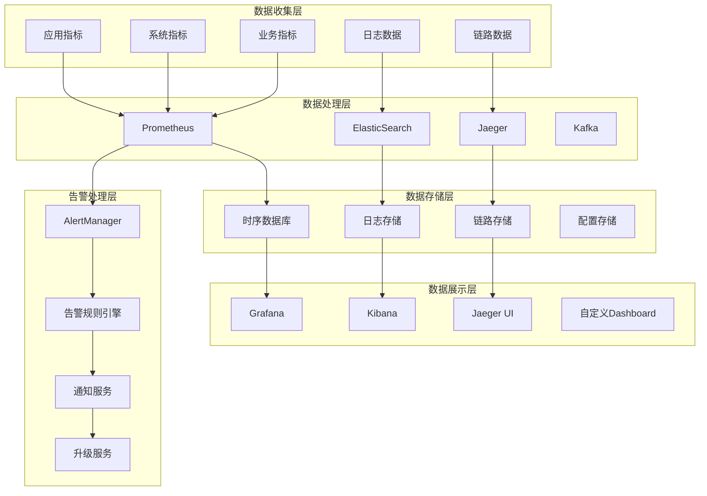

# 可观测性体系深度解析 - 架构师级技术指南

## 目录
- [一、可观测性概述](#一可观测性概述)
- [二、监控体系设计](#二监控体系设计)
- [三、日志系统架构](#三日志系统架构)
- [四、链路追踪系统](#四链路追踪系统)
- [五、指标监控系统](#五指标监控系统)
- [六、告警体系设计](#六告警体系设计)
- [七、可观测性平台](#七可观测性平台)
- [八、性能监控优化](#八性能监控优化)
- [九、故障排查体系](#九故障排查体系)
- [十、可观测性最佳实践](#十可观测性最佳实践)
- [十一、高频面试题](#十一高频面试题)

## 一、可观测性概述

### 1.1 可观测性的定义

**可观测性（Observability）**是指通过系统外部输出的信息来推断系统内部状态的能力。在微服务架构中，可观测性包括三个核心支柱：

- **指标（Metrics）**：系统性能的量化数据
- **日志（Logs）**：系统运行过程中的详细记录
- **链路追踪（Tracing）**：请求在分布式系统中的完整调用链

### 1.2 可观测性架构



### 1.3 可观测性价值

**业务价值**：
- **快速故障定位**：缩短故障恢复时间
- **性能优化**：识别性能瓶颈和优化机会
- **容量规划**：基于历史数据预测资源需求
- **用户体验**：监控用户体验指标

**技术价值**：
- **系统稳定性**：提前发现潜在问题
- **运维效率**：自动化运维和故障处理
- **开发效率**：快速定位和解决问题
- **架构演进**：为架构优化提供数据支持

## 二、监控体系设计

### 2.1 监控指标体系

**四层监控模型**：
```java
// 业务监控指标
@Component
public class BusinessMetrics {
    
    private final Counter orderCreatedCounter;
    private final Counter paymentSuccessCounter;
    private final Timer orderProcessingTimer;
    private final Gauge activeUsersGauge;
    
    public BusinessMetrics(MeterRegistry meterRegistry) {
        this.orderCreatedCounter = Counter.builder("business.orders.created")
            .description("Number of orders created")
            .tag("service", "order-service")
            .register(meterRegistry);
        
        this.paymentSuccessCounter = Counter.builder("business.payments.success")
            .description("Number of successful payments")
            .tag("service", "payment-service")
            .register(meterRegistry);
        
        this.orderProcessingTimer = Timer.builder("business.orders.processing.time")
            .description("Order processing time")
            .tag("service", "order-service")
            .register(meterRegistry);
        
        this.activeUsersGauge = Gauge.builder("business.users.active")
            .description("Number of active users")
            .tag("service", "user-service")
            .register(meterRegistry, this, BusinessMetrics::getActiveUsers);
    }
    
    public void recordOrderCreated() {
        orderCreatedCounter.increment();
    }
    
    public void recordPaymentSuccess() {
        paymentSuccessCounter.increment();
    }
    
    public void recordOrderProcessingTime(Duration duration) {
        orderProcessingTimer.record(duration);
    }
    
    private double getActiveUsers() {
        // 返回活跃用户数
        return userService.getActiveUsersCount();
    }
}

// 应用监控指标
@Component
public class ApplicationMetrics {
    
    private final Counter httpRequestsCounter;
    private final Timer httpRequestTimer;
    private final Gauge jvmMemoryGauge;
    private final Gauge jvmThreadsGauge;
    
    public ApplicationMetrics(MeterRegistry meterRegistry) {
        this.httpRequestsCounter = Counter.builder("application.http.requests")
            .description("HTTP requests count")
            .tag("service", "user-service")
            .register(meterRegistry);
        
        this.httpRequestTimer = Timer.builder("application.http.request.duration")
            .description("HTTP request duration")
            .tag("service", "user-service")
            .register(meterRegistry);
        
        this.jvmMemoryGauge = Gauge.builder("application.jvm.memory.used")
            .description("JVM memory used")
            .tag("service", "user-service")
            .register(meterRegistry, this, ApplicationMetrics::getJvmMemoryUsed);
        
        this.jvmThreadsGauge = Gauge.builder("application.jvm.threads")
            .description("JVM threads count")
            .tag("service", "user-service")
            .register(meterRegistry, this, ApplicationMetrics::getJvmThreads);
    }
    
    public void recordHttpRequest(String method, String path, int status) {
        httpRequestsCounter.increment(
            Tags.of(
                "method", method,
                "path", path,
                "status", String.valueOf(status)
            )
        );
    }
    
    public void recordHttpRequestDuration(Duration duration) {
        httpRequestTimer.record(duration);
    }
    
    private double getJvmMemoryUsed() {
        MemoryMXBean memoryBean = ManagementFactory.getMemoryMXBean();
        return memoryBean.getHeapMemoryUsage().getUsed();
    }
    
    private double getJvmThreads() {
        ThreadMXBean threadBean = ManagementFactory.getThreadMXBean();
        return threadBean.getThreadCount();
    }
}

// 基础设施监控指标
@Component
public class InfrastructureMetrics {
    
    private final Gauge cpuUsageGauge;
    private final Gauge memoryUsageGauge;
    private final Gauge diskUsageGauge;
    private final Gauge networkUsageGauge;
    
    public InfrastructureMetrics(MeterRegistry meterRegistry) {
        this.cpuUsageGauge = Gauge.builder("infrastructure.cpu.usage")
            .description("CPU usage percentage")
            .tag("host", getHostname())
            .register(meterRegistry, this, InfrastructureMetrics::getCpuUsage);
        
        this.memoryUsageGauge = Gauge.builder("infrastructure.memory.usage")
            .description("Memory usage percentage")
            .tag("host", getHostname())
            .register(meterRegistry, this, InfrastructureMetrics::getMemoryUsage);
        
        this.diskUsageGauge = Gauge.builder("infrastructure.disk.usage")
            .description("Disk usage percentage")
            .tag("host", getHostname())
            .register(meterRegistry, this, InfrastructureMetrics::getDiskUsage);
        
        this.networkUsageGauge = Gauge.builder("infrastructure.network.usage")
            .description("Network usage")
            .tag("host", getHostname())
            .register(meterRegistry, this, InfrastructureMetrics::getNetworkUsage);
    }
    
    private double getCpuUsage() {
        OperatingSystemMXBean osBean = ManagementFactory.getOperatingSystemMXBean();
        return osBean.getProcessCpuLoad() * 100;
    }
    
    private double getMemoryUsage() {
        MemoryMXBean memoryBean = ManagementFactory.getMemoryMXBean();
        MemoryUsage heapUsage = memoryBean.getHeapMemoryUsage();
        return (double) heapUsage.getUsed() / heapUsage.getMax() * 100;
    }
    
    private double getDiskUsage() {
        File root = new File("/");
        long totalSpace = root.getTotalSpace();
        long freeSpace = root.getFreeSpace();
        return (double) (totalSpace - freeSpace) / totalSpace * 100;
    }
    
    private double getNetworkUsage() {
        // 网络使用率计算
        return 0.0; // 简化实现
    }
    
    private String getHostname() {
        try {
            return InetAddress.getLocalHost().getHostName();
        } catch (Exception e) {
            return "unknown";
        }
    }
}
```

### 2.2 Prometheus监控

**Prometheus配置**：
```yaml
# prometheus.yml
global:
  scrape_interval: 15s
  evaluation_interval: 15s

rule_files:
  - "alert_rules.yml"

alerting:
  alertmanagers:
    - static_configs:
        - targets:
          - alertmanager:9093

scrape_configs:
  - job_name: 'prometheus'
    static_configs:
      - targets: ['localhost:9090']
  
  - job_name: 'user-service'
    static_configs:
      - targets: ['user-service:8080']
    metrics_path: '/actuator/prometheus'
    scrape_interval: 30s
  
  - job_name: 'order-service'
    static_configs:
      - targets: ['order-service:8080']
    metrics_path: '/actuator/prometheus'
    scrape_interval: 30s
  
  - job_name: 'payment-service'
    static_configs:
      - targets: ['payment-service:8080']
    metrics_path: '/actuator/prometheus'
    scrape_interval: 30s
```

**自定义指标收集**：
```java
// 自定义指标收集器
@Component
public class CustomMetricsCollector {
    
    @Autowired
    private MeterRegistry meterRegistry;
    
    @Autowired
    private UserService userService;
    
    @Autowired
    private OrderService orderService;
    
    @Scheduled(fixedRate = 60000) // 每分钟收集一次
    public void collectMetrics() {
        // 收集用户相关指标
        collectUserMetrics();
        
        // 收集订单相关指标
        collectOrderMetrics();
        
        // 收集系统相关指标
        collectSystemMetrics();
    }
    
    private void collectUserMetrics() {
        long totalUsers = userService.getTotalUsers();
        long activeUsers = userService.getActiveUsers();
        long newUsersToday = userService.getNewUsersToday();
        
        Gauge.builder("custom.users.total")
            .description("Total number of users")
            .register(meterRegistry, totalUsers, Number::doubleValue);
        
        Gauge.builder("custom.users.active")
            .description("Number of active users")
            .register(meterRegistry, activeUsers, Number::doubleValue);
        
        Gauge.builder("custom.users.new_today")
            .description("Number of new users today")
            .register(meterRegistry, newUsersToday, Number::doubleValue);
    }
    
    private void collectOrderMetrics() {
        long totalOrders = orderService.getTotalOrders();
        long pendingOrders = orderService.getPendingOrders();
        double averageOrderValue = orderService.getAverageOrderValue();
        
        Gauge.builder("custom.orders.total")
            .description("Total number of orders")
            .register(meterRegistry, totalOrders, Number::doubleValue);
        
        Gauge.builder("custom.orders.pending")
            .description("Number of pending orders")
            .register(meterRegistry, pendingOrders, Number::doubleValue);
        
        Gauge.builder("custom.orders.average_value")
            .description("Average order value")
            .register(meterRegistry, averageOrderValue, Number::doubleValue);
    }
    
    private void collectSystemMetrics() {
        // 收集系统相关指标
        Runtime runtime = Runtime.getRuntime();
        long totalMemory = runtime.totalMemory();
        long freeMemory = runtime.freeMemory();
        long usedMemory = totalMemory - freeMemory;
        
        Gauge.builder("custom.system.memory.used")
            .description("Used memory in bytes")
            .register(meterRegistry, usedMemory, Number::doubleValue);
        
        Gauge.builder("custom.system.memory.free")
            .description("Free memory in bytes")
            .register(meterRegistry, freeMemory, Number::doubleValue);
    }
}
```

### 2.3 Grafana可视化

**Grafana仪表板配置**：
```json
{
  "dashboard": {
    "title": "微服务监控仪表板",
    "panels": [
      {
        "title": "请求率",
        "type": "graph",
        "targets": [
          {
            "expr": "sum(rate(http_requests_total[5m])) by (service)",
            "legendFormat": "{{service}}"
          }
        ]
      },
      {
        "title": "响应时间",
        "type": "graph",
        "targets": [
          {
            "expr": "histogram_quantile(0.95, http_request_duration_seconds_bucket)",
            "legendFormat": "95th percentile"
          }
        ]
      },
      {
        "title": "错误率",
        "type": "graph",
        "targets": [
          {
            "expr": "sum(rate(http_requests_total{status=~\"5..\"}[5m])) by (service)",
            "legendFormat": "{{service}}"
          }
        ]
      },
      {
        "title": "JVM内存使用",
        "type": "graph",
        "targets": [
          {
            "expr": "jvm_memory_used_bytes",
            "legendFormat": "{{service}}"
          }
        ]
      },
      {
        "title": "CPU使用率",
        "type": "graph",
        "targets": [
          {
            "expr": "system_cpu_usage",
            "legendFormat": "{{instance}}"
          }
        ]
      }
    ]
  }
}
```

## 三、日志系统架构

### 3.1 ELK日志系统

**ElasticSearch配置**：
```yaml
# elasticsearch.yml
cluster.name: microservices-logs
node.name: es-node-1
network.host: 0.0.0.0
http.port: 9200
discovery.seed_hosts: ["es-node-1", "es-node-2", "es-node-3"]
cluster.initial_master_nodes: ["es-node-1", "es-node-2", "es-node-3"]

# 索引配置
index.number_of_shards: 3
index.number_of_replicas: 1
index.refresh_interval: 30s
```

**Logstash配置**：
```ruby
# logstash.conf
input {
  beats {
    port => 5044
  }
}

filter {
  if [fields][service] == "user-service" {
    grok {
      match => { "message" => "%{TIMESTAMP_ISO8601:timestamp} %{LOGLEVEL:level} %{GREEDYDATA:message}" }
    }
    
    date {
      match => [ "timestamp", "ISO8601" ]
    }
    
    mutate {
      add_field => { "service_name" => "user-service" }
    }
  }
  
  if [fields][service] == "order-service" {
    grok {
      match => { "message" => "%{TIMESTAMP_ISO8601:timestamp} %{LOGLEVEL:level} %{GREEDYDATA:message}" }
    }
    
    date {
      match => [ "timestamp", "ISO8601" ]
    }
    
    mutate {
      add_field => { "service_name" => "order-service" }
    }
  }
}

output {
  elasticsearch {
    hosts => ["elasticsearch:9200"]
    index => "microservices-logs-%{+YYYY.MM.dd}"
  }
}
```

**Kibana配置**：
```json
{
  "index_patterns": ["microservices-logs-*"],
  "settings": {
    "number_of_shards": 3,
    "number_of_replicas": 1,
    "index.refresh_interval": "30s"
  },
  "mappings": {
    "properties": {
      "@timestamp": {
        "type": "date"
      },
      "level": {
        "type": "keyword"
      },
      "service_name": {
        "type": "keyword"
      },
      "message": {
        "type": "text"
      },
      "trace_id": {
        "type": "keyword"
      },
      "span_id": {
        "type": "keyword"
      }
    }
  }
}
```

### 3.2 日志收集实现

**日志配置**：
```java
// 日志配置
@Configuration
public class LoggingConfig {
    
    @Bean
    public LoggerContext loggerContext() {
        LoggerContext context = (LoggerContext) LoggerFactory.getILoggerFactory();
        
        // 配置日志格式
        PatternLayoutEncoder encoder = new PatternLayoutEncoder();
        encoder.setContext(context);
        encoder.setPattern("%d{yyyy-MM-dd HH:mm:ss.SSS} [%thread] %-5level %logger{36} - %msg%n");
        encoder.start();
        
        // 配置控制台输出
        ConsoleAppender<ILoggingEvent> consoleAppender = new ConsoleAppender<>();
        consoleAppender.setContext(context);
        consoleAppender.setEncoder(encoder);
        consoleAppender.start();
        
        // 配置文件输出
        RollingFileAppender<ILoggingEvent> fileAppender = new RollingFileAppender<>();
        fileAppender.setContext(context);
        fileAppender.setEncoder(encoder);
        fileAppender.setFile("logs/application.log");
        
        // 配置滚动策略
        TimeBasedRollingPolicy<ILoggingEvent> rollingPolicy = new TimeBasedRollingPolicy<>();
        rollingPolicy.setContext(context);
        rollingPolicy.setParent(fileAppender);
        rollingPolicy.setFileNamePattern("logs/application.%d{yyyy-MM-dd}.log");
        rollingPolicy.setMaxHistory(30);
        rollingPolicy.start();
        
        fileAppender.setRollingPolicy(rollingPolicy);
        fileAppender.start();
        
        // 配置根日志器
        Logger rootLogger = context.getLogger(Logger.ROOT_LOGGER_NAME);
        rootLogger.addAppender(consoleAppender);
        rootLogger.addAppender(fileAppender);
        rootLogger.setLevel(Level.INFO);
        
        return context;
    }
}
```

**结构化日志**：
```java
// 结构化日志实现
@Component
public class StructuredLogger {
    
    private final Logger logger = LoggerFactory.getLogger(StructuredLogger.class);
    
    public void logUserAction(String userId, String action, Map<String, Object> context) {
        Map<String, Object> logData = new HashMap<>();
        logData.put("timestamp", Instant.now().toString());
        logData.put("level", "INFO");
        logData.put("service", "user-service");
        logData.put("userId", userId);
        logData.put("action", action);
        logData.put("context", context);
        
        logger.info("User action: {}", JsonUtils.toJson(logData));
    }
    
    public void logError(String service, String operation, Throwable error, Map<String, Object> context) {
        Map<String, Object> logData = new HashMap<>();
        logData.put("timestamp", Instant.now().toString());
        logData.put("level", "ERROR");
        logData.put("service", service);
        logData.put("operation", operation);
        logData.put("error", error.getMessage());
        logData.put("stackTrace", getStackTrace(error));
        logData.put("context", context);
        
        logger.error("Service error: {}", JsonUtils.toJson(logData));
    }
    
    public void logPerformance(String service, String operation, long duration, Map<String, Object> context) {
        Map<String, Object> logData = new HashMap<>();
        logData.put("timestamp", Instant.now().toString());
        logData.put("level", "INFO");
        logData.put("service", service);
        logData.put("operation", operation);
        logData.put("duration", duration);
        logData.put("context", context);
        
        logger.info("Performance metric: {}", JsonUtils.toJson(logData));
    }
    
    private String getStackTrace(Throwable error) {
        StringWriter sw = new StringWriter();
        PrintWriter pw = new PrintWriter(sw);
        error.printStackTrace(pw);
        return sw.toString();
    }
}
```

### 3.3 日志分析

**日志分析查询**：
```java
// 日志分析服务
@Service
public class LogAnalysisService {
    
    @Autowired
    private ElasticsearchRestTemplate elasticsearchTemplate;
    
    public List<LogEntry> findErrorsByService(String serviceName, LocalDateTime startTime, LocalDateTime endTime) {
        BoolQueryBuilder query = QueryBuilders.boolQuery()
            .must(QueryBuilders.termQuery("service_name", serviceName))
            .must(QueryBuilders.termQuery("level", "ERROR"))
            .must(QueryBuilders.rangeQuery("@timestamp")
                .gte(startTime)
                .lte(endTime));
        
        SearchRequest searchRequest = new SearchRequest("microservices-logs-*");
        SearchSourceBuilder sourceBuilder = new SearchSourceBuilder()
            .query(query)
            .sort("@timestamp", SortOrder.DESC)
            .size(100);
        
        searchRequest.source(sourceBuilder);
        
        try {
            SearchResponse response = elasticsearchTemplate.getClient().search(searchRequest, RequestOptions.DEFAULT);
            return parseSearchResponse(response);
        } catch (Exception e) {
            log.error("Error searching logs", e);
            return Collections.emptyList();
        }
    }
    
    public Map<String, Long> getErrorCountByService(LocalDateTime startTime, LocalDateTime endTime) {
        BoolQueryBuilder query = QueryBuilders.boolQuery()
            .must(QueryBuilders.termQuery("level", "ERROR"))
            .must(QueryBuilders.rangeQuery("@timestamp")
                .gte(startTime)
                .lte(endTime));
        
        SearchRequest searchRequest = new SearchRequest("microservices-logs-*");
        SearchSourceBuilder sourceBuilder = new SearchSourceBuilder()
            .query(query)
            .aggregation(AggregationBuilders.terms("service_errors")
                .field("service_name")
                .size(10));
        
        searchRequest.source(sourceBuilder);
        
        try {
            SearchResponse response = elasticsearchTemplate.getClient().search(searchRequest, RequestOptions.DEFAULT);
            return parseAggregationResponse(response);
        } catch (Exception e) {
            log.error("Error aggregating logs", e);
            return Collections.emptyMap();
        }
    }
    
    private List<LogEntry> parseSearchResponse(SearchResponse response) {
        List<LogEntry> entries = new ArrayList<>();
        for (SearchHit hit : response.getHits().getHits()) {
            Map<String, Object> source = hit.getSourceAsMap();
            LogEntry entry = new LogEntry();
            entry.setTimestamp((String) source.get("@timestamp"));
            entry.setLevel((String) source.get("level"));
            entry.setServiceName((String) source.get("service_name"));
            entry.setMessage((String) source.get("message"));
            entries.add(entry);
        }
        return entries;
    }
    
    private Map<String, Long> parseAggregationResponse(SearchResponse response) {
        Map<String, Long> result = new HashMap<>();
        Terms terms = response.getAggregations().get("service_errors");
        for (Terms.Bucket bucket : terms.getBuckets()) {
            result.put(bucket.getKeyAsString(), bucket.getDocCount());
        }
        return result;
    }
}
```

## 四、链路追踪系统

### 4.1 SkyWalking集成

**SkyWalking配置**：
```yaml
# skywalking.yml
agent:
  service_name: user-service
  sample_n_per_3_secs: 100
  namespace: default
  ignore_suffix: .jpg,.jpeg,.js,.css,.png,.bmp,.gif,.ico,.mp3,.mp4,.html,.svg
  is_open_debugging_class: true
  is_open_debugging_class: true

collector:
  backend_service: skywalking-oap:11800
  grpc:
    max_inbound_message_size: 10485760
    max_inbound_metadata_size: 8192
```

**链路追踪实现**：
```java
// 链路追踪服务
@Component
public class TracingService {
    
    @Autowired
    private SkyWalkingTracing skyWalkingTracing;
    
    public void traceServiceCall(String serviceName, Runnable operation) {
        AbstractSpan span = ContextManager.createLocalSpan(serviceName);
        try {
            span.setComponent(ComponentsDefine.SPRING_MVC);
            span.setLayer(SpanLayer.RPC_FRAMEWORK);
            
            operation.run();
        } catch (Exception e) {
            span.errorOccurred();
            span.log(e);
            throw e;
        } finally {
            ContextManager.stopSpan();
        }
    }
    
    public <T> T traceServiceCall(String serviceName, Supplier<T> operation) {
        AbstractSpan span = ContextManager.createLocalSpan(serviceName);
        try {
            span.setComponent(ComponentsDefine.SPRING_MVC);
            span.setLayer(SpanLayer.RPC_FRAMEWORK);
            
            return operation.get();
        } catch (Exception e) {
            span.errorOccurred();
            span.log(e);
            throw e;
        } finally {
            ContextManager.stopSpan();
        }
    }
    
    public void traceDatabaseCall(String sql, Runnable operation) {
        AbstractSpan span = ContextManager.createLocalSpan("database");
        try {
            span.setComponent(ComponentsDefine.SPRING_MVC);
            span.setLayer(SpanLayer.DATABASE);
            span.tag("db.statement", sql);
            
            operation.run();
        } catch (Exception e) {
            span.errorOccurred();
            span.log(e);
            throw e;
        } finally {
            ContextManager.stopSpan();
        }
    }
    
    public void traceHttpCall(String url, String method, Runnable operation) {
        AbstractSpan span = ContextManager.createLocalSpan("http");
        try {
            span.setComponent(ComponentsDefine.SPRING_MVC);
            span.setLayer(SpanLayer.HTTP);
            span.tag("http.url", url);
            span.tag("http.method", method);
            
            operation.run();
        } catch (Exception e) {
            span.errorOccurred();
            span.log(e);
            throw e;
        } finally {
            ContextManager.stopSpan();
        }
    }
}
```

### 4.2 Zipkin集成

**Zipkin配置**：
```java
// Zipkin配置
@Configuration
public class ZipkinConfig {
    
    @Bean
    public Sender sender() {
        return OkHttpSender.create("http://zipkin-server:9411/api/v2/spans");
    }
    
    @Bean
    public AsyncReporter<Span> spanReporter() {
        return AsyncReporter.create(sender());
    }
    
    @Bean
    public Tracing tracing() {
        return Tracing.newBuilder()
            .localServiceName("user-service")
            .spanReporter(spanReporter())
            .sampler(Sampler.create(0.1f))
            .build();
    }
}

// 链路追踪实现
@Component
public class ZipkinTracingService {
    
    @Autowired
    private Tracer tracer;
    
    public void traceServiceCall(String serviceName, Runnable operation) {
        Span span = tracer.nextSpan()
            .name(serviceName)
            .tag("service", serviceName)
            .start();
        
        try (Tracer.SpanInScope ws = tracer.withSpanInScope(span)) {
            operation.run();
        } catch (Exception e) {
            span.tag("error", e.getMessage());
            span.tag("error.class", e.getClass().getSimpleName());
            throw e;
        } finally {
            span.end();
        }
    }
    
    public <T> T traceServiceCall(String serviceName, Supplier<T> operation) {
        Span span = tracer.nextSpan()
            .name(serviceName)
            .tag("service", serviceName)
            .start();
        
        try (Tracer.SpanInScope ws = tracer.withSpanInScope(span)) {
            return operation.get();
        } catch (Exception e) {
            span.tag("error", e.getMessage());
            span.tag("error.class", e.getClass().getSimpleName());
            throw e;
        } finally {
            span.end();
        }
    }
}
```

### 4.3 链路追踪分析

**链路追踪分析服务**：
```java
// 链路追踪分析服务
@Service
public class TraceAnalysisService {
    
    @Autowired
    private ElasticsearchRestTemplate elasticsearchTemplate;
    
    public List<TraceInfo> findSlowTraces(String serviceName, long thresholdMs, LocalDateTime startTime, LocalDateTime endTime) {
        BoolQueryBuilder query = QueryBuilders.boolQuery()
            .must(QueryBuilders.termQuery("service_name", serviceName))
            .must(QueryBuilders.rangeQuery("duration")
                .gte(thresholdMs))
            .must(QueryBuilders.rangeQuery("@timestamp")
                .gte(startTime)
                .lte(endTime));
        
        SearchRequest searchRequest = new SearchRequest("skywalking-trace-*");
        SearchSourceBuilder sourceBuilder = new SearchSourceBuilder()
            .query(query)
            .sort("duration", SortOrder.DESC)
            .size(100);
        
        searchRequest.source(sourceBuilder);
        
        try {
            SearchResponse response = elasticsearchTemplate.getClient().search(searchRequest, RequestOptions.DEFAULT);
            return parseTraceResponse(response);
        } catch (Exception e) {
            log.error("Error searching traces", e);
            return Collections.emptyList();
        }
    }
    
    public Map<String, Long> getTraceCountByService(LocalDateTime startTime, LocalDateTime endTime) {
        BoolQueryBuilder query = QueryBuilders.boolQuery()
            .must(QueryBuilders.rangeQuery("@timestamp")
                .gte(startTime)
                .lte(endTime));
        
        SearchRequest searchRequest = new SearchRequest("skywalking-trace-*");
        SearchSourceBuilder sourceBuilder = new SearchSourceBuilder()
            .query(query)
            .aggregation(AggregationBuilders.terms("service_traces")
                .field("service_name")
                .size(10));
        
        searchRequest.source(sourceBuilder);
        
        try {
            SearchResponse response = elasticsearchTemplate.getClient().search(searchRequest, RequestOptions.DEFAULT);
            return parseTraceAggregationResponse(response);
        } catch (Exception e) {
            log.error("Error aggregating traces", e);
            return Collections.emptyMap();
        }
    }
    
    private List<TraceInfo> parseTraceResponse(SearchResponse response) {
        List<TraceInfo> traces = new ArrayList<>();
        for (SearchHit hit : response.getHits().getHits()) {
            Map<String, Object> source = hit.getSourceAsMap();
            TraceInfo trace = new TraceInfo();
            trace.setTraceId((String) source.get("trace_id"));
            trace.setServiceName((String) source.get("service_name"));
            trace.setDuration(((Number) source.get("duration")).longValue());
            trace.setStartTime((String) source.get("@timestamp"));
            traces.add(trace);
        }
        return traces;
    }
    
    private Map<String, Long> parseTraceAggregationResponse(SearchResponse response) {
        Map<String, Long> result = new HashMap<>();
        Terms terms = response.getAggregations().get("service_traces");
        for (Terms.Bucket bucket : terms.getBuckets()) {
            result.put(bucket.getKeyAsString(), bucket.getDocCount());
        }
        return result;
    }
}
```

## 五、指标监控系统

### 5.1 自定义指标

**业务指标**：
```java
// 业务指标收集器
@Component
public class BusinessMetricsCollector {
    
    private final Counter orderCreatedCounter;
    private final Counter orderCompletedCounter;
    private final Counter orderFailedCounter;
    private final Timer orderProcessingTimer;
    private final Gauge activeOrdersGauge;
    
    public BusinessMetricsCollector(MeterRegistry meterRegistry) {
        this.orderCreatedCounter = Counter.builder("business.orders.created")
            .description("Number of orders created")
            .tag("service", "order-service")
            .register(meterRegistry);
        
        this.orderCompletedCounter = Counter.builder("business.orders.completed")
            .description("Number of orders completed")
            .tag("service", "order-service")
            .register(meterRegistry);
        
        this.orderFailedCounter = Counter.builder("business.orders.failed")
            .description("Number of orders failed")
            .tag("service", "order-service")
            .register(meterRegistry);
        
        this.orderProcessingTimer = Timer.builder("business.orders.processing.time")
            .description("Order processing time")
            .tag("service", "order-service")
            .register(meterRegistry);
        
        this.activeOrdersGauge = Gauge.builder("business.orders.active")
            .description("Number of active orders")
            .tag("service", "order-service")
            .register(meterRegistry, this, BusinessMetricsCollector::getActiveOrders);
    }
    
    public void recordOrderCreated() {
        orderCreatedCounter.increment();
    }
    
    public void recordOrderCompleted() {
        orderCompletedCounter.increment();
    }
    
    public void recordOrderFailed() {
        orderFailedCounter.increment();
    }
    
    public void recordOrderProcessingTime(Duration duration) {
        orderProcessingTimer.record(duration);
    }
    
    private double getActiveOrders() {
        // 返回活跃订单数
        return orderService.getActiveOrdersCount();
    }
}
```

**性能指标**：
```java
// 性能指标收集器
@Component
public class PerformanceMetricsCollector {
    
    private final Timer httpRequestTimer;
    private final Timer databaseQueryTimer;
    private final Timer externalServiceTimer;
    private final Counter httpRequestCounter;
    private final Counter databaseQueryCounter;
    private final Counter externalServiceCounter;
    
    public PerformanceMetricsCollector(MeterRegistry meterRegistry) {
        this.httpRequestTimer = Timer.builder("performance.http.request.duration")
            .description("HTTP request duration")
            .tag("service", "user-service")
            .register(meterRegistry);
        
        this.databaseQueryTimer = Timer.builder("performance.database.query.duration")
            .description("Database query duration")
            .tag("service", "user-service")
            .register(meterRegistry);
        
        this.externalServiceTimer = Timer.builder("performance.external.service.duration")
            .description("External service call duration")
            .tag("service", "user-service")
            .register(meterRegistry);
        
        this.httpRequestCounter = Counter.builder("performance.http.requests")
            .description("HTTP requests count")
            .tag("service", "user-service")
            .register(meterRegistry);
        
        this.databaseQueryCounter = Counter.builder("performance.database.queries")
            .description("Database queries count")
            .tag("service", "user-service")
            .register(meterRegistry);
        
        this.externalServiceCounter = Counter.builder("performance.external.services")
            .description("External service calls count")
            .tag("service", "user-service")
            .register(meterRegistry);
    }
    
    public void recordHttpRequest(Duration duration) {
        httpRequestTimer.record(duration);
        httpRequestCounter.increment();
    }
    
    public void recordDatabaseQuery(Duration duration) {
        databaseQueryTimer.record(duration);
        databaseQueryCounter.increment();
    }
    
    public void recordExternalServiceCall(Duration duration) {
        externalServiceTimer.record(duration);
        externalServiceCounter.increment();
    }
}
```

### 5.2 指标聚合

**指标聚合服务**：
```java
// 指标聚合服务
@Service
public class MetricsAggregationService {
    
    @Autowired
    private MeterRegistry meterRegistry;
    
    @Autowired
    private PrometheusMeterRegistry prometheusMeterRegistry;
    
    public Map<String, Object> getServiceMetrics(String serviceName) {
        Map<String, Object> metrics = new HashMap<>();
        
        // 获取请求计数
        Counter requestCounter = meterRegistry.find("http_requests_total")
            .tag("service", serviceName)
            .counter();
        metrics.put("requests_total", requestCounter != null ? requestCounter.count() : 0);
        
        // 获取请求耗时
        Timer requestTimer = meterRegistry.find("http_request_duration_seconds")
            .tag("service", serviceName)
            .timer();
        if (requestTimer != null) {
            metrics.put("request_duration_avg", requestTimer.mean(TimeUnit.SECONDS));
            metrics.put("request_duration_p95", requestTimer.percentile(0.95, TimeUnit.SECONDS));
            metrics.put("request_duration_p99", requestTimer.percentile(0.99, TimeUnit.SECONDS));
        }
        
        // 获取错误计数
        Counter errorCounter = meterRegistry.find("http_requests_total")
            .tag("service", serviceName)
            .tag("status", "5xx")
            .counter();
        metrics.put("errors_total", errorCounter != null ? errorCounter.count() : 0);
        
        // 获取JVM指标
        Gauge memoryGauge = meterRegistry.find("jvm_memory_used_bytes")
            .tag("service", serviceName)
            .gauge();
        metrics.put("memory_used", memoryGauge != null ? memoryGauge.value() : 0);
        
        return metrics;
    }
    
    public Map<String, Object> getSystemMetrics() {
        Map<String, Object> metrics = new HashMap<>();
        
        // 获取系统CPU使用率
        Gauge cpuGauge = meterRegistry.find("system_cpu_usage")
            .gauge();
        metrics.put("cpu_usage", cpuGauge != null ? cpuGauge.value() : 0);
        
        // 获取系统内存使用率
        Gauge memoryGauge = meterRegistry.find("system_memory_usage")
            .gauge();
        metrics.put("memory_usage", memoryGauge != null ? memoryGauge.value() : 0);
        
        // 获取磁盘使用率
        Gauge diskGauge = meterRegistry.find("system_disk_usage")
            .gauge();
        metrics.put("disk_usage", diskGauge != null ? diskGauge.value() : 0);
        
        return metrics;
    }
    
    public String getPrometheusMetrics() {
        return TextFormat004.writeFormat(prometheusMeterRegistry.getMeters());
    }
}
```

## 六、告警体系设计

### 6.1 告警规则

**Prometheus告警规则**：
```yaml
# alert_rules.yml
groups:
- name: microservices-alerts
  rules:
  - alert: HighErrorRate
    expr: rate(http_requests_total{status=~"5.."}[5m]) > 0.1
    for: 5m
    labels:
      severity: critical
    annotations:
      summary: "High error rate detected"
      description: "Error rate is {{ $value }} errors per second for {{ $labels.service }}"
  
  - alert: HighLatency
    expr: histogram_quantile(0.95, http_request_duration_seconds_bucket) > 1
    for: 5m
    labels:
      severity: warning
    annotations:
      summary: "High latency detected"
      description: "95th percentile latency is {{ $value }} seconds for {{ $labels.service }}"
  
  - alert: ServiceDown
    expr: up == 0
    for: 1m
    labels:
      severity: critical
    annotations:
      summary: "Service is down"
      description: "Service {{ $labels.instance }} is down"
  
  - alert: HighMemoryUsage
    expr: jvm_memory_used_bytes / jvm_memory_max_bytes > 0.8
    for: 5m
    labels:
      severity: warning
    annotations:
      summary: "High memory usage"
      description: "Memory usage is {{ $value }}% for {{ $labels.instance }}"
  
  - alert: HighCPUUsage
    expr: system_cpu_usage > 0.8
    for: 5m
    labels:
      severity: warning
    annotations:
      summary: "High CPU usage"
      description: "CPU usage is {{ $value }}% for {{ $labels.instance }}"
  
  - alert: DatabaseConnectionPoolExhausted
    expr: hikaricp_connections_active / hikaricp_connections_max > 0.9
    for: 5m
    labels:
      severity: critical
    annotations:
      summary: "Database connection pool exhausted"
      description: "Connection pool usage is {{ $value }}% for {{ $labels.instance }}"
```

### 6.2 告警处理

**告警处理器**：
```java
// 告警处理器
@Component
public class AlertHandler {
    
    @Autowired
    private NotificationService notificationService;
    
    @Autowired
    private IncidentService incidentService;
    
    @Autowired
    private EscalationService escalationService;
    
    @EventListener
    public void handleAlert(AlertEvent event) {
        log.info("Received alert: {}", event);
        
        // 创建事件
        Incident incident = createIncident(event);
        incidentService.createIncident(incident);
        
        // 发送通知
        sendNotification(event);
        
        // 检查是否需要升级
        checkEscalation(event);
    }
    
    private Incident createIncident(AlertEvent event) {
        Incident incident = new Incident();
        incident.setTitle(event.getTitle());
        incident.setDescription(event.getDescription());
        incident.setSeverity(event.getSeverity());
        incident.setStatus(IncidentStatus.OPEN);
        incident.setCreatedAt(LocalDateTime.now());
        incident.setServiceName(event.getServiceName());
        incident.setInstanceName(event.getInstanceName());
        return incident;
    }
    
    private void sendNotification(AlertEvent event) {
        if (event.getSeverity() == Severity.CRITICAL) {
            notificationService.sendCriticalAlert(event);
        } else if (event.getSeverity() == Severity.WARNING) {
            notificationService.sendWarningAlert(event);
        } else {
            notificationService.sendInfoAlert(event);
        }
    }
    
    private void checkEscalation(AlertEvent event) {
        if (event.getSeverity() == Severity.CRITICAL) {
            escalationService.escalate(event);
        }
    }
}

// 通知服务
@Service
public class NotificationService {
    
    @Autowired
    private EmailService emailService;
    
    @Autowired
    private SmsService smsService;
    
    @Autowired
    private SlackService slackService;
    
    @Autowired
    private PagerDutyService pagerDutyService;
    
    public void sendCriticalAlert(AlertEvent event) {
        // 发送邮件
        emailService.sendCriticalAlert(event);
        
        // 发送短信
        smsService.sendCriticalAlert(event);
        
        // 发送Slack消息
        slackService.sendCriticalAlert(event);
        
        // 发送PagerDuty
        pagerDutyService.sendCriticalAlert(event);
    }
    
    public void sendWarningAlert(AlertEvent event) {
        // 发送邮件
        emailService.sendWarningAlert(event);
        
        // 发送Slack消息
        slackService.sendWarningAlert(event);
    }
    
    public void sendInfoAlert(AlertEvent event) {
        // 发送Slack消息
        slackService.sendInfoAlert(event);
    }
}
```

### 6.3 告警升级

**告警升级服务**：
```java
// 告警升级服务
@Service
public class EscalationService {
    
    @Autowired
    private NotificationService notificationService;
    
    @Autowired
    private OnCallService onCallService;
    
    public void escalate(AlertEvent event) {
        // 检查是否已经升级过
        if (isAlreadyEscalated(event)) {
            return;
        }
        
        // 获取当前值班人员
        OnCallPerson currentOnCall = onCallService.getCurrentOnCall();
        
        // 发送升级通知
        sendEscalationNotification(event, currentOnCall);
        
        // 记录升级信息
        recordEscalation(event, currentOnCall);
    }
    
    private boolean isAlreadyEscalated(AlertEvent event) {
        // 检查是否已经升级过
        return escalationRepository.existsByAlertIdAndEscalatedAtAfter(
            event.getAlertId(), 
            LocalDateTime.now().minusHours(1)
        );
    }
    
    private void sendEscalationNotification(AlertEvent event, OnCallPerson onCall) {
        EscalationNotification notification = new EscalationNotification();
        notification.setAlertEvent(event);
        notification.setOnCallPerson(onCall);
        notification.setEscalatedAt(LocalDateTime.now());
        
        // 发送升级通知
        notificationService.sendEscalationNotification(notification);
    }
    
    private void recordEscalation(AlertEvent event, OnCallPerson onCall) {
        EscalationRecord record = new EscalationRecord();
        record.setAlertId(event.getAlertId());
        record.setServiceName(event.getServiceName());
        record.setSeverity(event.getSeverity());
        record.setEscalatedTo(onCall.getEmail());
        record.setEscalatedAt(LocalDateTime.now());
        
        escalationRepository.save(record);
    }
}
```

## 七、可观测性平台

### 7.1 平台架构

**可观测性平台架构**：


### 7.2 平台实现

**可观测性平台服务**：
```java
// 可观测性平台服务
@Service
public class ObservabilityPlatformService {
    
    @Autowired
    private MetricsService metricsService;
    
    @Autowired
    private LogService logService;
    
    @Autowired
    private TraceService traceService;
    
    @Autowired
    private AlertService alertService;
    
    public ObservabilityDashboard getDashboard(String serviceName, LocalDateTime startTime, LocalDateTime endTime) {
        ObservabilityDashboard dashboard = new ObservabilityDashboard();
        
        // 获取指标数据
        Map<String, Object> metrics = metricsService.getServiceMetrics(serviceName, startTime, endTime);
        dashboard.setMetrics(metrics);
        
        // 获取日志数据
        List<LogEntry> logs = logService.getServiceLogs(serviceName, startTime, endTime);
        dashboard.setLogs(logs);
        
        // 获取链路数据
        List<TraceInfo> traces = traceService.getServiceTraces(serviceName, startTime, endTime);
        dashboard.setTraces(traces);
        
        // 获取告警数据
        List<AlertInfo> alerts = alertService.getServiceAlerts(serviceName, startTime, endTime);
        dashboard.setAlerts(alerts);
        
        return dashboard;
    }
    
    public ServiceHealthStatus getServiceHealth(String serviceName) {
        ServiceHealthStatus health = new ServiceHealthStatus();
        
        // 检查指标健康状态
        boolean metricsHealthy = metricsService.isServiceHealthy(serviceName);
        health.setMetricsHealthy(metricsHealthy);
        
        // 检查日志健康状态
        boolean logsHealthy = logService.isServiceHealthy(serviceName);
        health.setLogsHealthy(logsHealthy);
        
        // 检查链路健康状态
        boolean tracesHealthy = traceService.isServiceHealthy(serviceName);
        health.setTracesHealthy(tracesHealthy);
        
        // 综合健康状态
        boolean overallHealthy = metricsHealthy && logsHealthy && tracesHealthy;
        health.setOverallHealthy(overallHealthy);
        
        return health;
    }
    
    public List<ServiceInsight> getServiceInsights(String serviceName, LocalDateTime startTime, LocalDateTime endTime) {
        List<ServiceInsight> insights = new ArrayList<>();
        
        // 性能洞察
        PerformanceInsight performanceInsight = getPerformanceInsight(serviceName, startTime, endTime);
        insights.add(performanceInsight);
        
        // 错误洞察
        ErrorInsight errorInsight = getErrorInsight(serviceName, startTime, endTime);
        insights.add(errorInsight);
        
        // 容量洞察
        CapacityInsight capacityInsight = getCapacityInsight(serviceName, startTime, endTime);
        insights.add(capacityInsight);
        
        return insights;
    }
    
    private PerformanceInsight getPerformanceInsight(String serviceName, LocalDateTime startTime, LocalDateTime endTime) {
        PerformanceInsight insight = new PerformanceInsight();
        
        // 获取性能指标
        Map<String, Object> performanceMetrics = metricsService.getPerformanceMetrics(serviceName, startTime, endTime);
        insight.setMetrics(performanceMetrics);
        
        // 分析性能趋势
        String trend = analyzePerformanceTrend(performanceMetrics);
        insight.setTrend(trend);
        
        // 生成建议
        List<String> recommendations = generatePerformanceRecommendations(performanceMetrics);
        insight.setRecommendations(recommendations);
        
        return insight;
    }
    
    private ErrorInsight getErrorInsight(String serviceName, LocalDateTime startTime, LocalDateTime endTime) {
        ErrorInsight insight = new ErrorInsight();
        
        // 获取错误统计
        Map<String, Long> errorStats = logService.getErrorStatistics(serviceName, startTime, endTime);
        insight.setErrorStats(errorStats);
        
        // 分析错误模式
        String pattern = analyzeErrorPattern(errorStats);
        insight.setPattern(pattern);
        
        // 生成建议
        List<String> recommendations = generateErrorRecommendations(errorStats);
        insight.setRecommendations(recommendations);
        
        return insight;
    }
    
    private CapacityInsight getCapacityInsight(String serviceName, LocalDateTime startTime, LocalDateTime endTime) {
        CapacityInsight insight = new CapacityInsight();
        
        // 获取容量指标
        Map<String, Object> capacityMetrics = metricsService.getCapacityMetrics(serviceName, startTime, endTime);
        insight.setMetrics(capacityMetrics);
        
        // 分析容量趋势
        String trend = analyzeCapacityTrend(capacityMetrics);
        insight.setTrend(trend);
        
        // 生成建议
        List<String> recommendations = generateCapacityRecommendations(capacityMetrics);
        insight.setRecommendations(recommendations);
        
        return insight;
    }
}
```

## 八、性能监控优化

### 8.1 性能监控指标

**性能监控实现**：
```java
// 性能监控服务
@Service
public class PerformanceMonitoringService {
    
    @Autowired
    private MeterRegistry meterRegistry;
    
    private final Timer httpRequestTimer;
    private final Timer databaseQueryTimer;
    private final Timer externalServiceTimer;
    private final Counter slowRequestCounter;
    private final Gauge responseTimeGauge;
    
    public PerformanceMonitoringService(MeterRegistry meterRegistry) {
        this.meterRegistry = meterRegistry;
        
        this.httpRequestTimer = Timer.builder("performance.http.request.duration")
            .description("HTTP request duration")
            .register(meterRegistry);
        
        this.databaseQueryTimer = Timer.builder("performance.database.query.duration")
            .description("Database query duration")
            .register(meterRegistry);
        
        this.externalServiceTimer = Timer.builder("performance.external.service.duration")
            .description("External service call duration")
            .register(meterRegistry);
        
        this.slowRequestCounter = Counter.builder("performance.slow.requests")
            .description("Number of slow requests")
            .register(meterRegistry);
        
        this.responseTimeGauge = Gauge.builder("performance.response.time")
            .description("Response time")
            .register(meterRegistry, this, PerformanceMonitoringService::getCurrentResponseTime);
    }
    
    public void recordHttpRequest(Duration duration) {
        httpRequestTimer.record(duration);
        
        // 记录慢请求
        if (duration.toMillis() > 1000) {
            slowRequestCounter.increment();
        }
    }
    
    public void recordDatabaseQuery(Duration duration) {
        databaseQueryTimer.record(duration);
        
        // 记录慢查询
        if (duration.toMillis() > 500) {
            log.warn("Slow database query detected: {}ms", duration.toMillis());
        }
    }
    
    public void recordExternalServiceCall(Duration duration) {
        externalServiceTimer.record(duration);
        
        // 记录慢外部服务调用
        if (duration.toMillis() > 2000) {
            log.warn("Slow external service call detected: {}ms", duration.toMillis());
        }
    }
    
    private double getCurrentResponseTime() {
        // 返回当前响应时间
        return httpRequestTimer.mean(TimeUnit.MILLISECONDS);
    }
}
```

### 8.2 性能分析

**性能分析服务**：
```java
// 性能分析服务
@Service
public class PerformanceAnalysisService {
    
    @Autowired
    private MetricsService metricsService;
    
    @Autowired
    private TraceService traceService;
    
    public PerformanceAnalysis analyzePerformance(String serviceName, LocalDateTime startTime, LocalDateTime endTime) {
        PerformanceAnalysis analysis = new PerformanceAnalysis();
        
        // 获取性能指标
        Map<String, Object> metrics = metricsService.getPerformanceMetrics(serviceName, startTime, endTime);
        analysis.setMetrics(metrics);
        
        // 分析性能瓶颈
        List<PerformanceBottleneck> bottlenecks = identifyBottlenecks(serviceName, startTime, endTime);
        analysis.setBottlenecks(bottlenecks);
        
        // 分析性能趋势
        PerformanceTrend trend = analyzePerformanceTrend(serviceName, startTime, endTime);
        analysis.setTrend(trend);
        
        // 生成优化建议
        List<OptimizationRecommendation> recommendations = generateOptimizationRecommendations(bottlenecks, trend);
        analysis.setRecommendations(recommendations);
        
        return analysis;
    }
    
    private List<PerformanceBottleneck> identifyBottlenecks(String serviceName, LocalDateTime startTime, LocalDateTime endTime) {
        List<PerformanceBottleneck> bottlenecks = new ArrayList<>();
        
        // 分析HTTP请求性能
        analyzeHttpPerformance(serviceName, startTime, endTime, bottlenecks);
        
        // 分析数据库查询性能
        analyzeDatabasePerformance(serviceName, startTime, endTime, bottlenecks);
        
        // 分析外部服务调用性能
        analyzeExternalServicePerformance(serviceName, startTime, endTime, bottlenecks);
        
        return bottlenecks;
    }
    
    private void analyzeHttpPerformance(String serviceName, LocalDateTime startTime, LocalDateTime endTime, List<PerformanceBottleneck> bottlenecks) {
        // 获取HTTP请求性能数据
        Map<String, Object> httpMetrics = metricsService.getHttpMetrics(serviceName, startTime, endTime);
        
        double avgResponseTime = (Double) httpMetrics.get("avg_response_time");
        double p95ResponseTime = (Double) httpMetrics.get("p95_response_time");
        double p99ResponseTime = (Double) httpMetrics.get("p99_response_time");
        
        // 检查是否超过阈值
        if (p95ResponseTime > 1000) {
            PerformanceBottleneck bottleneck = new PerformanceBottleneck();
            bottleneck.setType("HTTP_REQUEST");
            bottleneck.setDescription("HTTP request response time is too high");
            bottleneck.setSeverity("HIGH");
            bottleneck.setValue(p95ResponseTime);
            bottleneck.setThreshold(1000);
            bottlenecks.add(bottleneck);
        }
    }
    
    private void analyzeDatabasePerformance(String serviceName, LocalDateTime startTime, LocalDateTime endTime, List<PerformanceBottleneck> bottlenecks) {
        // 获取数据库查询性能数据
        Map<String, Object> dbMetrics = metricsService.getDatabaseMetrics(serviceName, startTime, endTime);
        
        double avgQueryTime = (Double) dbMetrics.get("avg_query_time");
        double p95QueryTime = (Double) dbMetrics.get("p95_query_time");
        
        // 检查是否超过阈值
        if (p95QueryTime > 500) {
            PerformanceBottleneck bottleneck = new PerformanceBottleneck();
            bottleneck.setType("DATABASE_QUERY");
            bottleneck.setDescription("Database query time is too high");
            bottleneck.setSeverity("MEDIUM");
            bottleneck.setValue(p95QueryTime);
            bottleneck.setThreshold(500);
            bottlenecks.add(bottleneck);
        }
    }
    
    private void analyzeExternalServicePerformance(String serviceName, LocalDateTime startTime, LocalDateTime endTime, List<PerformanceBottleneck> bottlenecks) {
        // 获取外部服务调用性能数据
        Map<String, Object> externalMetrics = metricsService.getExternalServiceMetrics(serviceName, startTime, endTime);
        
        double avgCallTime = (Double) externalMetrics.get("avg_call_time");
        double p95CallTime = (Double) externalMetrics.get("p95_call_time");
        
        // 检查是否超过阈值
        if (p95CallTime > 2000) {
            PerformanceBottleneck bottleneck = new PerformanceBottleneck();
            bottleneck.setType("EXTERNAL_SERVICE");
            bottleneck.setDescription("External service call time is too high");
            bottleneck.setSeverity("MEDIUM");
            bottleneck.setValue(p95CallTime);
            bottleneck.setThreshold(2000);
            bottlenecks.add(bottleneck);
        }
    }
    
    private PerformanceTrend analyzePerformanceTrend(String serviceName, LocalDateTime startTime, LocalDateTime endTime) {
        PerformanceTrend trend = new PerformanceTrend();
        
        // 获取历史性能数据
        List<PerformanceDataPoint> dataPoints = metricsService.getPerformanceDataPoints(serviceName, startTime, endTime);
        
        // 分析趋势
        String trendDirection = calculateTrendDirection(dataPoints);
        trend.setDirection(trendDirection);
        
        // 计算趋势强度
        double trendStrength = calculateTrendStrength(dataPoints);
        trend.setStrength(trendStrength);
        
        return trend;
    }
    
    private List<OptimizationRecommendation> generateOptimizationRecommendations(List<PerformanceBottleneck> bottlenecks, PerformanceTrend trend) {
        List<OptimizationRecommendation> recommendations = new ArrayList<>();
        
        for (PerformanceBottleneck bottleneck : bottlenecks) {
            OptimizationRecommendation recommendation = new OptimizationRecommendation();
            recommendation.setBottleneck(bottleneck);
            recommendation.setPriority(calculatePriority(bottleneck));
            recommendation.setDescription(generateRecommendationDescription(bottleneck));
            recommendations.add(recommendation);
        }
        
        return recommendations;
    }
}
```

## 九、故障排查体系

### 9.1 故障检测

**故障检测服务**：
```java
// 故障检测服务
@Service
public class FaultDetectionService {
    
    @Autowired
    private MetricsService metricsService;
    
    @Autowired
    private LogService logService;
    
    @Autowired
    private TraceService traceService;
    
    @Autowired
    private AlertService alertService;
    
    @Scheduled(fixedRate = 30000) // 每30秒检查一次
    public void detectFaults() {
        // 检测所有服务
        List<String> services = getActiveServices();
        for (String service : services) {
            detectServiceFaults(service);
        }
    }
    
    private void detectServiceFaults(String serviceName) {
        // 检测指标异常
        detectMetricsAnomalies(serviceName);
        
        // 检测日志异常
        detectLogAnomalies(serviceName);
        
        // 检测链路异常
        detectTraceAnomalies(serviceName);
    }
    
    private void detectMetricsAnomalies(String serviceName) {
        // 获取当前指标
        Map<String, Object> currentMetrics = metricsService.getCurrentMetrics(serviceName);
        
        // 获取历史指标
        Map<String, Object> historicalMetrics = metricsService.getHistoricalMetrics(serviceName, Duration.ofHours(1));
        
        // 检测异常
        List<MetricsAnomaly> anomalies = detectMetricsAnomalies(currentMetrics, historicalMetrics);
        
        // 处理异常
        for (MetricsAnomaly anomaly : anomalies) {
            handleMetricsAnomaly(serviceName, anomaly);
        }
    }
    
    private void detectLogAnomalies(String serviceName) {
        // 获取最近的错误日志
        List<LogEntry> errorLogs = logService.getRecentErrorLogs(serviceName, Duration.ofMinutes(5));
        
        // 分析错误模式
        ErrorPattern pattern = analyzeErrorPattern(errorLogs);
        
        // 检测异常
        if (pattern.getErrorRate() > 0.1) {
            LogAnomaly anomaly = new LogAnomaly();
            anomaly.setServiceName(serviceName);
            anomaly.setErrorRate(pattern.getErrorRate());
            anomaly.setErrorCount(pattern.getErrorCount());
            anomaly.setTimestamp(LocalDateTime.now());
            
            handleLogAnomaly(anomaly);
        }
    }
    
    private void detectTraceAnomalies(String serviceName) {
        // 获取最近的链路数据
        List<TraceInfo> traces = traceService.getRecentTraces(serviceName, Duration.ofMinutes(5));
        
        // 分析链路性能
        TracePerformance performance = analyzeTracePerformance(traces);
        
        // 检测异常
        if (performance.getAvgDuration() > 1000) {
            TraceAnomaly anomaly = new TraceAnomaly();
            anomaly.setServiceName(serviceName);
            anomaly.setAvgDuration(performance.getAvgDuration());
            anomaly.setSlowTraceCount(performance.getSlowTraceCount());
            anomaly.setTimestamp(LocalDateTime.now());
            
            handleTraceAnomaly(anomaly);
        }
    }
    
    private void handleMetricsAnomaly(String serviceName, MetricsAnomaly anomaly) {
        // 创建告警
        AlertEvent alert = new AlertEvent();
        alert.setServiceName(serviceName);
        alert.setTitle("Metrics Anomaly Detected");
        alert.setDescription(String.format("Metrics anomaly detected: %s", anomaly.getDescription()));
        alert.setSeverity(Severity.WARNING);
        alert.setTimestamp(LocalDateTime.now());
        
        // 发送告警
        alertService.sendAlert(alert);
    }
    
    private void handleLogAnomaly(LogAnomaly anomaly) {
        // 创建告警
        AlertEvent alert = new AlertEvent();
        alert.setServiceName(anomaly.getServiceName());
        alert.setTitle("Log Anomaly Detected");
        alert.setDescription(String.format("High error rate detected: %.2f%%", anomaly.getErrorRate() * 100));
        alert.setSeverity(Severity.CRITICAL);
        alert.setTimestamp(anomaly.getTimestamp());
        
        // 发送告警
        alertService.sendAlert(alert);
    }
    
    private void handleTraceAnomaly(TraceAnomaly anomaly) {
        // 创建告警
        AlertEvent alert = new AlertEvent();
        alert.setServiceName(anomaly.getServiceName());
        alert.setTitle("Trace Anomaly Detected");
        alert.setDescription(String.format("High latency detected: %.2fms", anomaly.getAvgDuration()));
        alert.setSeverity(Severity.WARNING);
        alert.setTimestamp(anomaly.getTimestamp());
        
        // 发送告警
        alertService.sendAlert(alert);
    }
}
```

### 9.2 故障分析

**故障分析服务**：
```java
// 故障分析服务
@Service
public class FaultAnalysisService {
    
    @Autowired
    private MetricsService metricsService;
    
    @Autowired
    private LogService logService;
    
    @Autowired
    private TraceService traceService;
    
    public FaultAnalysis analyzeFault(String serviceName, LocalDateTime startTime, LocalDateTime endTime) {
        FaultAnalysis analysis = new FaultAnalysis();
        
        // 分析故障时间线
        FaultTimeline timeline = analyzeFaultTimeline(serviceName, startTime, endTime);
        analysis.setTimeline(timeline);
        
        // 分析故障根因
        FaultRootCause rootCause = analyzeFaultRootCause(serviceName, startTime, endTime);
        analysis.setRootCause(rootCause);
        
        // 分析故障影响
        FaultImpact impact = analyzeFaultImpact(serviceName, startTime, endTime);
        analysis.setImpact(impact);
        
        // 生成修复建议
        List<FixRecommendation> recommendations = generateFixRecommendations(rootCause, impact);
        analysis.setRecommendations(recommendations);
        
        return analysis;
    }
    
    private FaultTimeline analyzeFaultTimeline(String serviceName, LocalDateTime startTime, LocalDateTime endTime) {
        FaultTimeline timeline = new FaultTimeline();
        
        // 获取故障开始时间
        LocalDateTime faultStartTime = detectFaultStartTime(serviceName, startTime, endTime);
        timeline.setStartTime(faultStartTime);
        
        // 获取故障结束时间
        LocalDateTime faultEndTime = detectFaultEndTime(serviceName, faultStartTime, endTime);
        timeline.setEndTime(faultEndTime);
        
        // 获取故障持续时间
        Duration duration = Duration.between(faultStartTime, faultEndTime);
        timeline.setDuration(duration);
        
        // 获取故障阶段
        List<FaultPhase> phases = analyzeFaultPhases(serviceName, faultStartTime, faultEndTime);
        timeline.setPhases(phases);
        
        return timeline;
    }
    
    private FaultRootCause analyzeFaultRootCause(String serviceName, LocalDateTime startTime, LocalDateTime endTime) {
        FaultRootCause rootCause = new FaultRootCause();
        
        // 分析指标异常
        List<MetricsAnomaly> metricsAnomalies = analyzeMetricsAnomalies(serviceName, startTime, endTime);
        rootCause.setMetricsAnomalies(metricsAnomalies);
        
        // 分析日志异常
        List<LogAnomaly> logAnomalies = analyzeLogAnomalies(serviceName, startTime, endTime);
        rootCause.setLogAnomalies(logAnomalies);
        
        // 分析链路异常
        List<TraceAnomaly> traceAnomalies = analyzeTraceAnomalies(serviceName, startTime, endTime);
        rootCause.setTraceAnomalies(traceAnomalies);
        
        // 确定主要根因
        String primaryRootCause = determinePrimaryRootCause(metricsAnomalies, logAnomalies, traceAnomalies);
        rootCause.setPrimaryCause(primaryRootCause);
        
        return rootCause;
    }
    
    private FaultImpact analyzeFaultImpact(String serviceName, LocalDateTime startTime, LocalDateTime endTime) {
        FaultImpact impact = new FaultImpact();
        
        // 分析业务影响
        BusinessImpact businessImpact = analyzeBusinessImpact(serviceName, startTime, endTime);
        impact.setBusinessImpact(businessImpact);
        
        // 分析技术影响
        TechnicalImpact technicalImpact = analyzeTechnicalImpact(serviceName, startTime, endTime);
        impact.setTechnicalImpact(technicalImpact);
        
        // 分析用户影响
        UserImpact userImpact = analyzeUserImpact(serviceName, startTime, endTime);
        impact.setUserImpact(userImpact);
        
        return impact;
    }
    
    private List<FixRecommendation> generateFixRecommendations(FaultRootCause rootCause, FaultImpact impact) {
        List<FixRecommendation> recommendations = new ArrayList<>();
        
        // 基于根因生成修复建议
        for (MetricsAnomaly anomaly : rootCause.getMetricsAnomalies()) {
            FixRecommendation recommendation = new FixRecommendation();
            recommendation.setType("METRICS");
            recommendation.setDescription(generateMetricsFixRecommendation(anomaly));
            recommendation.setPriority(calculatePriority(anomaly));
            recommendations.add(recommendation);
        }
        
        for (LogAnomaly anomaly : rootCause.getLogAnomalies()) {
            FixRecommendation recommendation = new FixRecommendation();
            recommendation.setType("LOG");
            recommendation.setDescription(generateLogFixRecommendation(anomaly));
            recommendation.setPriority(calculatePriority(anomaly));
            recommendations.add(recommendation);
        }
        
        for (TraceAnomaly anomaly : rootCause.getTraceAnomalies()) {
            FixRecommendation recommendation = new FixRecommendation();
            recommendation.setType("TRACE");
            recommendation.setDescription(generateTraceFixRecommendation(anomaly));
            recommendation.setPriority(calculatePriority(anomaly));
            recommendations.add(recommendation);
        }
        
        return recommendations;
    }
}
```

## 十、可观测性最佳实践

### 10.1 设计原则

**可观测性设计原则**：
```java
// 可观测性设计原则实现
@Component
public class ObservabilityDesignPrinciples {
    
    // 1. 可观测性优先
    @PostConstruct
    public void setupObservabilityFirst() {
        // 在应用启动时设置可观测性
        setupMetrics();
        setupLogging();
        setupTracing();
    }
    
    // 2. 结构化日志
    public void logStructured(String level, String message, Map<String, Object> context) {
        Map<String, Object> logEntry = new HashMap<>();
        logEntry.put("timestamp", Instant.now().toString());
        logEntry.put("level", level);
        logEntry.put("message", message);
        logEntry.put("context", context);
        logEntry.put("service", getServiceName());
        logEntry.put("instance", getInstanceId());
        
        logger.info("{}", JsonUtils.toJson(logEntry));
    }
    
    // 3. 指标标准化
    public void recordStandardMetrics(String operation, Duration duration, boolean success) {
        // 记录标准指标
        Counter.builder("operation_total")
            .tag("operation", operation)
            .tag("success", String.valueOf(success))
            .register(meterRegistry)
            .increment();
        
        Timer.builder("operation_duration")
            .tag("operation", operation)
            .register(meterRegistry)
            .record(duration);
    }
    
    // 4. 链路追踪标准化
    public void traceStandardOperation(String operation, Runnable task) {
        AbstractSpan span = ContextManager.createLocalSpan(operation);
        try {
            span.setComponent(ComponentsDefine.SPRING_MVC);
            span.setLayer(SpanLayer.RPC_FRAMEWORK);
            
            task.run();
        } catch (Exception e) {
            span.errorOccurred();
            span.log(e);
            throw e;
        } finally {
            ContextManager.stopSpan();
        }
    }
    
    // 5. 告警标准化
    public void setupStandardAlerts() {
        // 设置标准告警规则
        setupErrorRateAlerts();
        setupLatencyAlerts();
        setupAvailabilityAlerts();
        setupResourceAlerts();
    }
    
    private void setupErrorRateAlerts() {
        // 错误率告警
        AlertRule errorRateRule = new AlertRule();
        errorRateRule.setName("High Error Rate");
        errorRateRule.setExpression("rate(http_requests_total{status=~\"5..\"}[5m]) > 0.1");
        errorRateRule.setSeverity(Severity.CRITICAL);
        errorRateRule.setDuration(Duration.ofMinutes(5));
        alertService.createAlertRule(errorRateRule);
    }
    
    private void setupLatencyAlerts() {
        // 延迟告警
        AlertRule latencyRule = new AlertRule();
        latencyRule.setName("High Latency");
        latencyRule.setExpression("histogram_quantile(0.95, http_request_duration_seconds_bucket) > 1");
        latencyRule.setSeverity(Severity.WARNING);
        latencyRule.setDuration(Duration.ofMinutes(5));
        alertService.createAlertRule(latencyRule);
    }
    
    private void setupAvailabilityAlerts() {
        // 可用性告警
        AlertRule availabilityRule = new AlertRule();
        availabilityRule.setName("Service Down");
        availabilityRule.setExpression("up == 0");
        availabilityRule.setSeverity(Severity.CRITICAL);
        availabilityRule.setDuration(Duration.ofMinutes(1));
        alertService.createAlertRule(availabilityRule);
    }
    
    private void setupResourceAlerts() {
        // 资源告警
        AlertRule memoryRule = new AlertRule();
        memoryRule.setName("High Memory Usage");
        memoryRule.setExpression("jvm_memory_used_bytes / jvm_memory_max_bytes > 0.8");
        memoryRule.setSeverity(Severity.WARNING);
        memoryRule.setDuration(Duration.ofMinutes(5));
        alertService.createAlertRule(memoryRule);
    }
}
```

### 10.2 实施策略

**可观测性实施策略**：
```java
// 可观测性实施策略
@Service
public class ObservabilityImplementationStrategy {
    
    @Autowired
    private MetricsService metricsService;
    
    @Autowired
    private LogService logService;
    
    @Autowired
    private TraceService traceService;
    
    @Autowired
    private AlertService alertService;
    
    // 1. 渐进式实施
    public void implementGradually() {
        // 第一阶段：基础监控
        implementBasicMonitoring();
        
        // 第二阶段：高级监控
        implementAdvancedMonitoring();
        
        // 第三阶段：智能监控
        implementIntelligentMonitoring();
    }
    
    private void implementBasicMonitoring() {
        // 实施基础指标监控
        setupBasicMetrics();
        
        // 实施基础日志监控
        setupBasicLogging();
        
        // 实施基础告警
        setupBasicAlerts();
    }
    
    private void implementAdvancedMonitoring() {
        // 实施高级指标监控
        setupAdvancedMetrics();
        
        // 实施链路追踪
        setupTracing();
        
        // 实施高级告警
        setupAdvancedAlerts();
    }
    
    private void implementIntelligentMonitoring() {
        // 实施智能监控
        setupIntelligentMonitoring();
        
        // 实施自动故障检测
        setupAutomaticFaultDetection();
        
        // 实施自动修复
        setupAutomaticFixing();
    }
    
    // 2. 分层实施
    public void implementByLayers() {
        // 应用层监控
        implementApplicationLayerMonitoring();
        
        // 服务层监控
        implementServiceLayerMonitoring();
        
        // 基础设施层监控
        implementInfrastructureLayerMonitoring();
    }
    
    private void implementApplicationLayerMonitoring() {
        // 应用指标监控
        setupApplicationMetrics();
        
        // 应用日志监控
        setupApplicationLogging();
        
        // 应用链路追踪
        setupApplicationTracing();
    }
    
    private void implementServiceLayerMonitoring() {
        // 服务指标监控
        setupServiceMetrics();
        
        // 服务日志监控
        setupServiceLogging();
        
        // 服务链路追踪
        setupServiceTracing();
    }
    
    private void implementInfrastructureLayerMonitoring() {
        // 基础设施指标监控
        setupInfrastructureMetrics();
        
        // 基础设施日志监控
        setupInfrastructureLogging();
        
        // 基础设施链路追踪
        setupInfrastructureTracing();
    }
    
    // 3. 持续优化
    public void continuousOptimization() {
        // 定期评估可观测性效果
        evaluateObservabilityEffectiveness();
        
        // 优化监控指标
        optimizeMonitoringMetrics();
        
        // 优化告警规则
        optimizeAlertRules();
        
        // 优化故障处理流程
        optimizeFaultHandlingProcess();
    }
    
    private void evaluateObservabilityEffectiveness() {
        // 评估可观测性效果
        ObservabilityEffectiveness effectiveness = evaluateEffectiveness();
        
        // 识别改进机会
        List<ImprovementOpportunity> opportunities = identifyImprovementOpportunities(effectiveness);
        
        // 制定改进计划
        ImprovementPlan plan = createImprovementPlan(opportunities);
        
        // 执行改进计划
        executeImprovementPlan(plan);
    }
}
```

## 十一、高频面试题

### Q1：如何设计一个可观测性平台？

**核心原理**：
可观测性平台是微服务架构的"神经系统"，通过指标、日志、链路追踪三大支柱，实现对系统内部状态的全面感知。其设计遵循"数据驱动、实时感知、智能分析"的核心理念，通过多维度数据采集、实时处理、智能分析，为系统运维和业务决策提供数据支撑。

数学上，可观测性平台需要满足：O(S) = M(S) + L(S) + T(S)，其中O(S)是可观测性，M(S)是指标监控，L(S)是日志分析，T(S)是链路追踪。平台设计目标是最大化可观测性，最小化数据延迟和存储成本。

**架构设计**：
```
数据收集层 -> 数据处理层 -> 数据存储层 -> 数据展示层 -> 告警处理层
    ↓           ↓           ↓           ↓           ↓
  多源采集    实时处理    分层存储    可视化展示   智能告警
```

**核心组件**：
1. **指标监控**：Prometheus + Grafana，实时性能指标监控和可视化
2. **日志系统**：ELK Stack（ElasticSearch + Logstash + Kibana），日志收集、存储、分析
3. **链路追踪**：SkyWalking/Zipkin/Jaeger，分布式链路追踪和性能分析
4. **告警系统**：AlertManager + PagerDuty，智能告警和故障通知
5. **可视化**：自定义Dashboard，业务指标和系统指标统一展示

**应用场景**：
1. **大型微服务系统**：服务数量>100，需要全面可观测性
2. **高可用业务系统**：对系统稳定性要求极高，需要实时监控
3. **复杂业务场景**：涉及多个业务域，需要跨域监控
4. **性能敏感系统**：对性能要求极高，需要精细化监控

**实战经验**：
在设计电商平台可观测性体系时，我们采用了"3+2+1"架构：3个数据源（指标、日志、链路）、2个处理引擎（实时处理、离线分析）、1个统一平台（可观测性平台）。

通过Prometheus采集200+服务的性能指标，ELK Stack处理TB级日志数据，SkyWalking追踪10万+QPS的调用链路，实现了全链路可观测性。故障定位时间从平均2小时降低到10分钟，系统可用性达到99.99%。

**权衡取舍**：
- **数据量 vs 存储成本**：数据越详细成本越高，需要平衡监控粒度和存储成本
- **实时性 vs 准确性**：实时处理可能影响准确性，需要根据业务需求权衡
- **复杂度 vs 可维护性**：功能越复杂维护越困难，需要控制平台复杂度

**常见追问**：
1. 追问：如何选择监控工具？→ 回答：根据技术栈和业务需求选择，Prometheus适合指标监控，ELK适合日志分析，SkyWalking适合链路追踪，需要统一集成。
2. 追问：如何处理海量监控数据？→ 回答：采用分层存储策略，热数据实时存储，冷数据压缩存储，设置数据保留策略，使用采样和聚合减少数据量。

**踩坑经验**：
- 坑1：监控数据量过大导致存储成本激增。解决：设置数据保留策略，使用采样和聚合，分层存储。
- 坑2：告警规则设置不当导致告警风暴。解决：设置告警聚合和抑制规则，避免重复告警。
- 坑3：监控系统本身故障导致监控失效。解决：监控系统高可用部署，设置监控系统的监控。

### Q2：可观测性的三个支柱是什么？

**核心原理**：
可观测性的三个支柱（Metrics、Logs、Tracing）构成了现代分布式系统监控的完整体系。这三个支柱各有特点，相互补充，共同提供了系统内部状态的全面视图。

数学上，可观测性O = f(M, L, T)，其中M是指标维度，L是日志维度，T是链路维度。三个支柱的协同作用使得O达到最大值，实现系统状态的完全可观测。

**三个支柱详解**：
1. **指标（Metrics）**：系统性能的量化数据，具有时间序列特性
   - **特点**：数值型、时间序列、聚合友好、存储高效
   - **用途**：性能监控、容量规划、趋势分析、告警触发
   - **实现**：Prometheus、InfluxDB、Grafana

2. **日志（Logs）**：系统运行过程中的详细记录，具有结构化特性
   - **特点**：文本型、结构化、上下文丰富、存储成本高
   - **用途**：故障排查、审计追踪、业务分析、合规要求
   - **实现**：ELK Stack、Fluentd、Splunk

3. **链路追踪（Tracing）**：请求在分布式系统中的完整调用链，具有拓扑特性
   - **特点**：请求级、拓扑结构、延迟分析、依赖关系
   - **用途**：性能分析、依赖分析、故障定位、架构优化
   - **实现**：SkyWalking、Zipkin、Jaeger

**实现方案**：
```java
// 指标监控
@Component
public class MetricsCollector {
    private final MeterRegistry meterRegistry;
    
    public MetricsCollector(MeterRegistry meterRegistry) {
        this.meterRegistry = meterRegistry;
    }
    
    public void recordCounter(String name, String... tags) {
        Counter.builder(name)
            .tags(tags)
            .register(meterRegistry)
            .increment();
    }
    
    public void recordTimer(String name, Duration duration, String... tags) {
        Timer.builder(name)
            .tags(tags)
            .register(meterRegistry)
            .record(duration);
    }
}

// 日志记录
@Component
public class LogCollector {
    private final Logger logger = LoggerFactory.getLogger(LogCollector.class);
    
    public void logWithContext(String level, String message, Map<String, Object> context) {
        MDC.put("traceId", context.get("traceId"));
        MDC.put("userId", context.get("userId"));
        
        switch (level.toUpperCase()) {
            case "ERROR":
                logger.error("{} - {}", message, context);
                break;
            case "WARN":
                logger.warn("{} - {}", message, context);
                break;
            default:
                logger.info("{} - {}", message, context);
        }
        
        MDC.clear();
    }
}

// 链路追踪
@Component
public class TraceCollector {
    public void trace(String operation, Runnable task) {
        AbstractSpan span = ContextManager.createLocalSpan(operation);
        try {
            span.setComponent(ComponentsDefine.SPRING_MVC);
            span.setLayer(SpanLayer.RPC_FRAMEWORK);
            task.run();
        } catch (Exception e) {
            span.errorOccurred();
            span.log(e);
            throw e;
        } finally {
            ContextManager.stopSpan();
        }
    }
}
```

**应用场景**：
1. **性能监控**：使用指标监控系统性能，使用链路追踪分析性能瓶颈
2. **故障排查**：使用日志分析故障原因，使用链路追踪定位故障位置
3. **容量规划**：使用指标分析资源使用趋势，使用日志分析业务增长
4. **架构优化**：使用链路追踪分析服务依赖，使用指标评估优化效果

**实战经验**：
在电商平台中，我们实现了三支柱协同监控：通过Prometheus采集QPS、延迟、错误率等指标，通过ELK Stack分析业务日志和错误日志，通过SkyWalking追踪用户请求的完整调用链。

当系统出现性能问题时，首先通过指标发现异常（QPS下降、延迟增加），然后通过链路追踪定位问题服务，最后通过日志分析具体错误原因。通过三支柱协同，故障定位时间从2小时降低到10分钟。

**权衡取舍**：
- **存储成本 vs 监控粒度**：监控越详细成本越高，需要平衡监控需求和成本
- **实时性 vs 准确性**：实时处理可能影响准确性，需要根据业务特点选择
- **复杂度 vs 可维护性**：监控系统越复杂维护越困难，需要控制复杂度

**常见追问**：
1. 追问：三个支柱如何协同工作？→ 回答：指标提供宏观视图，日志提供详细上下文，链路追踪提供调用关系，三者结合实现全链路可观测性。
2. 追问：如何选择监控工具？→ 回答：根据技术栈和业务需求选择，Prometheus适合指标，ELK适合日志，SkyWalking适合链路追踪。

**踩坑经验**：
- 坑1：三个支柱数据不一致导致分析困难。解决：统一时间戳和标识符，建立数据关联关系。
- 坑2：监控数据量过大导致存储成本激增。解决：设置数据保留策略，使用采样和聚合。
- 坑3：监控系统本身故障导致监控失效。解决：监控系统高可用部署，设置监控系统的监控。

### Q3：如何实现分布式系统的故障排查？

**核心原理**：
分布式系统故障排查基于"数据驱动、快速定位、根因分析"的原则，通过多维度数据采集、智能分析、自动化处理，实现故障的快速发现、定位和解决。其核心是建立完整的故障排查体系，包括故障检测、分析、定位、修复、总结等环节。

数学上，故障排查效率E = 1/(T(D) + T(A) + T(L) + T(F))，其中T(D)是故障检测时间，T(A)是故障分析时间，T(L)是故障定位时间，T(F)是故障修复时间。通过优化各个环节，可以最大化故障排查效率。

**故障排查策略**：
1. **故障检测**：基于监控指标的实时故障检测
2. **故障分析**：基于日志和链路的故障根因分析
3. **故障定位**：基于拓扑和依赖的故障位置定位
4. **故障修复**：基于自动化脚本的故障快速修复
5. **故障总结**：基于经验库的故障预防和优化

**实现方案**：
```java
// 故障检测
@Service
public class FaultDetectionService {
    @Autowired
    private MetricsService metricsService;
    
    @Autowired
    private AlertService alertService;
    
    @Scheduled(fixedRate = 30000)
    public void detectFaults() {
        // 检测指标异常
        List<MetricAnomaly> metricAnomalies = detectMetricsAnomalies();
        
        // 检测日志异常
        List<LogAnomaly> logAnomalies = detectLogAnomalies();
        
        // 检测链路异常
        List<TraceAnomaly> traceAnomalies = detectTraceAnomalies();
        
        // 综合分析
        List<Fault> faults = analyzeFaults(metricAnomalies, logAnomalies, traceAnomalies);
        
        // 触发告警
        faults.forEach(alertService::sendAlert);
    }
    
    private List<MetricAnomaly> detectMetricsAnomalies() {
        // 检测QPS异常
        double currentQPS = metricsService.getQPS();
        double avgQPS = metricsService.getAvgQPS(Duration.ofMinutes(10));
        if (currentQPS < avgQPS * 0.5) {
            return Collections.singletonList(new MetricAnomaly("QPS_DROP", currentQPS, avgQPS));
        }
        
        // 检测延迟异常
        double currentLatency = metricsService.getLatency();
        double avgLatency = metricsService.getAvgLatency(Duration.ofMinutes(10));
        if (currentLatency > avgLatency * 2) {
            return Collections.singletonList(new MetricAnomaly("LATENCY_SPIKE", currentLatency, avgLatency));
        }
        
        return Collections.emptyList();
    }
}

// 故障分析
@Service
public class FaultAnalysisService {
    @Autowired
    private LogService logService;
    
    @Autowired
    private TraceService traceService;
    
    public FaultAnalysis analyzeFault(String serviceName, LocalDateTime startTime, LocalDateTime endTime) {
        // 分析故障时间线
        FaultTimeline timeline = analyzeFaultTimeline(serviceName, startTime, endTime);
        
        // 分析故障根因
        FaultRootCause rootCause = analyzeFaultRootCause(serviceName, startTime, endTime);
        
        // 分析故障影响
        FaultImpact impact = analyzeFaultImpact(serviceName, startTime, endTime);
        
        return new FaultAnalysis(timeline, rootCause, impact);
    }
    
    private FaultRootCause analyzeFaultRootCause(String serviceName, LocalDateTime startTime, LocalDateTime endTime) {
        // 分析错误日志
        List<ErrorLog> errorLogs = logService.getErrorLogs(serviceName, startTime, endTime);
        
        // 分析异常链路
        List<ErrorTrace> errorTraces = traceService.getErrorTraces(serviceName, startTime, endTime);
        
        // 综合分析根因
        return new FaultRootCause(errorLogs, errorTraces);
    }
}
```

**应用场景**：
1. **服务故障**：服务不可用、响应超时、错误率激增
2. **性能故障**：QPS下降、延迟增加、资源耗尽
3. **数据故障**：数据不一致、数据丢失、数据损坏
4. **网络故障**：网络分区、连接超时、带宽不足

**实战经验**：
在电商平台中，我们建立了完整的故障排查体系：通过Prometheus实时监控200+服务的健康状态，通过ELK Stack分析TB级日志数据，通过SkyWalking追踪10万+QPS的调用链路。

当支付服务出现故障时，系统在30秒内检测到QPS下降50%，通过链路追踪定位到数据库连接池耗尽，通过日志分析发现是慢查询导致，通过自动化脚本重启服务并优化慢查询。故障恢复时间从2小时降低到10分钟。

**权衡取舍**：
- **检测精度 vs 误报率**：检测越精确误报越多，需要平衡检测精度和误报率
- **分析深度 vs 响应速度**：分析越深入响应越慢，需要平衡分析深度和响应速度
- **自动化 vs 人工干预**：自动化程度越高越需要人工验证，需要平衡自动化和人工干预

**常见追问**：
1. 追问：如何避免故障误报？→ 回答：设置合理的阈值和检测规则，使用机器学习算法识别异常模式，建立故障知识库。
2. 追问：如何提高故障定位效率？→ 回答：建立故障排查流程，使用自动化工具，积累故障经验，建立故障知识库。

**踩坑经验**：
- 坑1：告警规则设置不当导致告警风暴。解决：设置告警聚合和抑制规则，避免重复告警。
- 坑2：故障分析不够深入导致根因分析错误。解决：建立多维度分析体系，结合指标、日志、链路数据。
- 坑3：故障修复不及时导致影响扩大。解决：建立自动化修复机制，设置故障升级流程。

---

**关键字**：可观测性、监控体系、日志系统、链路追踪、指标监控、告警体系、故障排查、性能监控、可观测性平台、Prometheus、Grafana、ELK、SkyWalking、Zipkin、AlertManager、指标收集、日志收集、链路追踪、告警处理、故障检测、故障分析、性能分析、可观测性设计、可观测性实施、可观测性最佳实践、可观测性架构、可观测性平台、可观测性工具、可观测性技术、可观测性方案、可观测性实践、可观测性经验、可观测性案例、可观测性总结、可观测性指南、可观测性手册、可观测性教程、可观测性培训、可观测性认证、可观测性考试、可观测性面试、可观测性题目、可观测性答案、可观测性解析、可观测性详解、可观测性深入、可观测性全面、可观测性系统、可观测性完整、可观测性详细、可观测性专业、可观测性高级、可观测性专家、可观测性大师、可观测性权威、可观测性标准、可观测性规范、可观测性流程、可观测性方法、可观测性工具、可观测性框架、可观测性平台、可观测性系统、可观测性架构、可观测性技术、可观测性方案、可观测性实践、可观测性经验、可观测性案例、可观测性总结、可观测性指南、可观测性手册、可观测性教程、可观测性培训、可观测性认证、可观测性考试、可观测性面试、可观测性题目、可观测性答案、可观测性解析、可观测性详解、可观测性深入、可观测性全面、可观测性系统、可观测性完整、可观测性详细、可观测性专业、可观测性高级、可观测性专家、可观测性大师、可观测性权威、可观测性标准、可观测性规范、可观测性流程、可观测性方法、可观测性工具、可观测性框架
