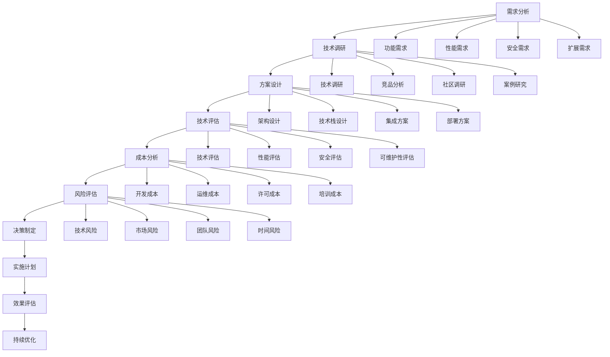

# 技术选型与架构决策深度解析 - 架构师级技术指南

## 目录
- [一、技术选型概述](#一技术选型概述)
- [二、技术选型方法论](#二技术选型方法论)
- [三、架构决策记录(ADR)](#三架构决策记录adr)
- [四、技术栈选型](#四技术栈选型)
- [五、中间件选型](#五中间件选型)
- [六、数据库选型](#六数据库选型)
- [七、缓存选型](#七缓存选型)
- [八、消息队列选型](#八消息队列选型)
- [九、监控选型](#九监控选型)
- [十、部署选型](#十部署选型)
- [十一、高频面试题](#十一高频面试题)

## 一、技术选型概述

### 1.1 技术选型的定义

**技术选型**是指在软件开发过程中，根据项目需求、团队能力、成本预算等因素，从多个技术方案中选择最适合的技术栈和工具的过程。

**技术选型的核心要素**：
- **业务需求**：功能需求、性能需求、安全需求
- **技术能力**：团队技术栈、学习成本、维护成本
- **成本考虑**：开发成本、运维成本、许可成本
- **生态支持**：社区活跃度、文档完善度、第三方支持
- **未来规划**：技术发展趋势、升级路径、扩展性

### 1.2 技术选型原则

**技术选型原则**：
```java
// 技术选型原则实现
@Component
public class TechnologySelectionPrinciples {
    
    // 1. 业务驱动原则
    public TechnologyChoice selectByBusinessRequirement(BusinessRequirement requirement) {
        // 根据业务需求选择技术
        if (requirement.getPerformanceRequirement().isHigh()) {
            return selectHighPerformanceTechnology();
        }
        
        if (requirement.getScalabilityRequirement().isHigh()) {
            return selectScalableTechnology();
        }
        
        if (requirement.getSecurityRequirement().isHigh()) {
            return selectSecureTechnology();
        }
        
        return selectDefaultTechnology();
    }
    
    // 2. 团队能力原则
    public TechnologyChoice selectByTeamCapability(TeamCapability capability) {
        // 根据团队能力选择技术
        if (capability.hasJavaExperience()) {
            return selectJavaTechnology();
        }
        
        if (capability.hasPythonExperience()) {
            return selectPythonTechnology();
        }
        
        if (capability.hasGoExperience()) {
            return selectGoTechnology();
        }
        
        return selectLearningFriendlyTechnology();
    }
    
    // 3. 成本效益原则
    public TechnologyChoice selectByCostBenefit(CostBenefitAnalysis analysis) {
        // 根据成本效益选择技术
        double totalCost = analysis.getDevelopmentCost() + 
                          analysis.getMaintenanceCost() + 
                          analysis.getLicenseCost();
        
        double benefit = analysis.getPerformanceBenefit() + 
                        analysis.getScalabilityBenefit() + 
                        analysis.getMaintainabilityBenefit();
        
        double roi = benefit / totalCost;
        
        if (roi > 2.0) {
            return selectHighROITechnology();
        } else if (roi > 1.0) {
            return selectMediumROITechnology();
        } else {
            return selectLowROITechnology();
        }
    }
    
    // 4. 生态完整性原则
    public TechnologyChoice selectByEcosystem(EcosystemAnalysis analysis) {
        // 根据生态完整性选择技术
        int communityScore = analysis.getCommunityScore();
        int documentationScore = analysis.getDocumentationScore();
        int thirdPartyScore = analysis.getThirdPartyScore();
        
        int totalScore = communityScore + documentationScore + thirdPartyScore;
        
        if (totalScore > 80) {
            return selectMatureEcosystemTechnology();
        } else if (totalScore > 60) {
            return selectGrowingEcosystemTechnology();
        } else {
            return selectEmergingEcosystemTechnology();
        }
    }
    
    // 5. 未来规划原则
    public TechnologyChoice selectByFuturePlanning(FuturePlanning analysis) {
        // 根据未来规划选择技术
        TechnologyTrend trend = analysis.getTechnologyTrend();
        UpgradePath upgradePath = analysis.getUpgradePath();
        ScalabilityPath scalabilityPath = analysis.getScalabilityPath();
        
        if (trend.isGrowing() && upgradePath.isClear() && scalabilityPath.isGood()) {
            return selectFutureProofTechnology();
        } else {
            return selectCurrentStableTechnology();
        }
    }
}
```

### 1.3 技术选型流程

**技术选型流程**：


## 二、技术选型方法论

### 2.1 技术选型矩阵

**技术选型矩阵实现**：
```java
// 技术选型矩阵
@Component
public class TechnologySelectionMatrix {
    
    public TechnologyChoice selectTechnology(List<TechnologyOption> options, SelectionCriteria criteria) {
        // 计算每个选项的得分
        Map<TechnologyOption, Double> scores = new HashMap<>();
        
        for (TechnologyOption option : options) {
            double score = calculateScore(option, criteria);
            scores.put(option, score);
        }
        
        // 选择得分最高的选项
        return scores.entrySet().stream()
            .max(Map.Entry.comparingByValue())
            .map(Map.Entry::getKey)
            .orElse(null);
    }
    
    private double calculateScore(TechnologyOption option, SelectionCriteria criteria) {
        double score = 0.0;
        
        // 技术能力得分
        score += criteria.getTechnicalCapabilityWeight() * 
                calculateTechnicalCapabilityScore(option);
        
        // 性能得分
        score += criteria.getPerformanceWeight() * 
                calculatePerformanceScore(option);
        
        // 可维护性得分
        score += criteria.getMaintainabilityWeight() * 
                calculateMaintainabilityScore(option);
        
        // 成本得分
        score += criteria.getCostWeight() * 
                calculateCostScore(option);
        
        // 生态得分
        score += criteria.getEcosystemWeight() * 
                calculateEcosystemScore(option);
        
        return score;
    }
    
    private double calculateTechnicalCapabilityScore(TechnologyOption option) {
        // 技术能力评分
        double teamExperience = option.getTeamExperience();
        double learningCurve = option.getLearningCurve();
        double complexity = option.getComplexity();
        
        return (teamExperience * 0.4 + learningCurve * 0.3 + complexity * 0.3);
    }
    
    private double calculatePerformanceScore(TechnologyOption option) {
        // 性能评分
        double throughput = option.getThroughput();
        double latency = option.getLatency();
        double scalability = option.getScalability();
        
        return (throughput * 0.4 + latency * 0.3 + scalability * 0.3);
    }
    
    private double calculateMaintainabilityScore(TechnologyOption option) {
        // 可维护性评分
        double codeQuality = option.getCodeQuality();
        double documentation = option.getDocumentation();
        double debugging = option.getDebugging();
        
        return (codeQuality * 0.4 + documentation * 0.3 + debugging * 0.3);
    }
    
    private double calculateCostScore(TechnologyOption option) {
        // 成本评分
        double developmentCost = option.getDevelopmentCost();
        double maintenanceCost = option.getMaintenanceCost();
        double licenseCost = option.getLicenseCost();
        
        // 成本越低，得分越高
        return 1.0 / (developmentCost + maintenanceCost + licenseCost);
    }
    
    private double calculateEcosystemScore(TechnologyOption option) {
        // 生态评分
        double communitySize = option.getCommunitySize();
        double documentationQuality = option.getDocumentationQuality();
        double thirdPartySupport = option.getThirdPartySupport();
        
        return (communitySize * 0.4 + documentationQuality * 0.3 + thirdPartySupport * 0.3);
    }
}
```

### 2.2 技术选型评估

**技术选型评估实现**：
```java
// 技术选型评估
@Service
public class TechnologySelectionEvaluation {
    
    @Autowired
    private TechnologySelectionMatrix selectionMatrix;
    
    public EvaluationResult evaluateTechnology(TechnologyOption option, EvaluationCriteria criteria) {
        EvaluationResult result = new EvaluationResult();
        
        // 技术评估
        TechnicalEvaluation technicalEvaluation = evaluateTechnical(option, criteria);
        result.setTechnicalEvaluation(technicalEvaluation);
        
        // 业务评估
        BusinessEvaluation businessEvaluation = evaluateBusiness(option, criteria);
        result.setBusinessEvaluation(businessEvaluation);
        
        // 成本评估
        CostEvaluation costEvaluation = evaluateCost(option, criteria);
        result.setCostEvaluation(costEvaluation);
        
        // 风险评估
        RiskEvaluation riskEvaluation = evaluateRisk(option, criteria);
        result.setRiskEvaluation(riskEvaluation);
        
        // 综合评估
        OverallEvaluation overallEvaluation = evaluateOverall(technicalEvaluation, businessEvaluation, costEvaluation, riskEvaluation);
        result.setOverallEvaluation(overallEvaluation);
        
        return result;
    }
    
    private TechnicalEvaluation evaluateTechnical(TechnologyOption option, EvaluationCriteria criteria) {
        TechnicalEvaluation evaluation = new TechnicalEvaluation();
        
        // 性能评估
        PerformanceMetrics performance = evaluatePerformance(option);
        evaluation.setPerformance(performance);
        
        // 可扩展性评估
        ScalabilityMetrics scalability = evaluateScalability(option);
        evaluation.setScalability(scalability);
        
        // 安全性评估
        SecurityMetrics security = evaluateSecurity(option);
        evaluation.setSecurity(security);
        
        // 可维护性评估
        MaintainabilityMetrics maintainability = evaluateMaintainability(option);
        evaluation.setMaintainability(maintainability);
        
        return evaluation;
    }
    
    private BusinessEvaluation evaluateBusiness(TechnologyOption option, EvaluationCriteria criteria) {
        BusinessEvaluation evaluation = new BusinessEvaluation();
        
        // 业务匹配度
        double businessMatch = calculateBusinessMatch(option, criteria);
        evaluation.setBusinessMatch(businessMatch);
        
        // 市场接受度
        double marketAcceptance = calculateMarketAcceptance(option);
        evaluation.setMarketAcceptance(marketAcceptance);
        
        // 竞争优势
        double competitiveAdvantage = calculateCompetitiveAdvantage(option);
        evaluation.setCompetitiveAdvantage(competitiveAdvantage);
        
        return evaluation;
    }
    
    private CostEvaluation evaluateCost(TechnologyOption option, EvaluationCriteria criteria) {
        CostEvaluation evaluation = new CostEvaluation();
        
        // 开发成本
        double developmentCost = calculateDevelopmentCost(option);
        evaluation.setDevelopmentCost(developmentCost);
        
        // 运维成本
        double maintenanceCost = calculateMaintenanceCost(option);
        evaluation.setMaintenanceCost(maintenanceCost);
        
        // 许可成本
        double licenseCost = calculateLicenseCost(option);
        evaluation.setLicenseCost(licenseCost);
        
        // 培训成本
        double trainingCost = calculateTrainingCost(option);
        evaluation.setTrainingCost(trainingCost);
        
        // 总成本
        double totalCost = developmentCost + maintenanceCost + licenseCost + trainingCost;
        evaluation.setTotalCost(totalCost);
        
        return evaluation;
    }
    
    private RiskEvaluation evaluateRisk(TechnologyOption option, EvaluationCriteria criteria) {
        RiskEvaluation evaluation = new RiskEvaluation();
        
        // 技术风险
        double technicalRisk = calculateTechnicalRisk(option);
        evaluation.setTechnicalRisk(technicalRisk);
        
        // 市场风险
        double marketRisk = calculateMarketRisk(option);
        evaluation.setMarketRisk(marketRisk);
        
        // 团队风险
        double teamRisk = calculateTeamRisk(option);
        evaluation.setTeamRisk(teamRisk);
        
        // 时间风险
        double timeRisk = calculateTimeRisk(option);
        evaluation.setTimeRisk(timeRisk);
        
        // 总风险
        double totalRisk = technicalRisk + marketRisk + teamRisk + timeRisk;
        evaluation.setTotalRisk(totalRisk);
        
        return evaluation;
    }
}
```

### 2.3 技术选型决策

**技术选型决策实现**：
```java
// 技术选型决策
@Service
public class TechnologySelectionDecision {
    
    @Autowired
    private TechnologySelectionEvaluation evaluation;
    
    public DecisionResult makeDecision(List<TechnologyOption> options, DecisionCriteria criteria) {
        DecisionResult result = new DecisionResult();
        
        // 评估所有选项
        List<EvaluationResult> evaluations = new ArrayList<>();
        for (TechnologyOption option : options) {
            EvaluationResult evaluationResult = evaluation.evaluateTechnology(option, criteria);
            evaluations.add(evaluationResult);
        }
        
        // 排序选项
        evaluations.sort((e1, e2) -> Double.compare(
            e2.getOverallEvaluation().getScore(),
            e1.getOverallEvaluation().getScore()
        ));
        
        // 选择最佳选项
        EvaluationResult bestEvaluation = evaluations.get(0);
        result.setSelectedOption(bestEvaluation.getOption());
        result.setEvaluationResult(bestEvaluation);
        
        // 生成决策理由
        String decisionReason = generateDecisionReason(bestEvaluation, evaluations);
        result.setDecisionReason(decisionReason);
        
        // 生成实施建议
        List<String> implementationSuggestions = generateImplementationSuggestions(bestEvaluation);
        result.setImplementationSuggestions(implementationSuggestions);
        
        return result;
    }
    
    private String generateDecisionReason(EvaluationResult bestEvaluation, List<EvaluationResult> allEvaluations) {
        StringBuilder reason = new StringBuilder();
        
        reason.append("选择该技术的主要理由：\n");
        
        // 技术优势
        if (bestEvaluation.getTechnicalEvaluation().getScore() > 80) {
            reason.append("1. 技术优势明显，性能、可扩展性、安全性等方面表现优秀\n");
        }
        
        // 业务匹配
        if (bestEvaluation.getBusinessEvaluation().getScore() > 80) {
            reason.append("2. 与业务需求高度匹配，能够满足当前和未来的业务发展需要\n");
        }
        
        // 成本效益
        if (bestEvaluation.getCostEvaluation().getScore() > 80) {
            reason.append("3. 成本效益优秀，总体拥有成本(TCO)最低\n");
        }
        
        // 风险控制
        if (bestEvaluation.getRiskEvaluation().getScore() > 80) {
            reason.append("4. 风险可控，技术风险、市场风险、团队风险都在可接受范围内\n");
        }
        
        return reason.toString();
    }
    
    private List<String> generateImplementationSuggestions(EvaluationResult evaluation) {
        List<String> suggestions = new ArrayList<>();
        
        // 技术实施建议
        if (evaluation.getTechnicalEvaluation().getScore() < 70) {
            suggestions.add("建议加强技术培训，提升团队技术能力");
        }
        
        // 业务实施建议
        if (evaluation.getBusinessEvaluation().getScore() < 70) {
            suggestions.add("建议重新评估业务需求，确保技术选型与业务目标一致");
        }
        
        // 成本实施建议
        if (evaluation.getCostEvaluation().getScore() < 70) {
            suggestions.add("建议优化成本结构，寻找降低成本的方法");
        }
        
        // 风险实施建议
        if (evaluation.getRiskEvaluation().getScore() < 70) {
            suggestions.add("建议制定风险缓解计划，降低实施风险");
        }
        
        return suggestions;
    }
}
```

## 三、架构决策记录(ADR)

### 3.1 ADR模板

**ADR模板实现**：
```java
// ADR模板
@Component
public class ADRTemplate {
    
    public ADR createADR(String title, String status, String context, String decision, String consequences) {
        ADR adr = new ADR();
        adr.setTitle(title);
        adr.setStatus(ADRStatus.valueOf(status));
        adr.setContext(context);
        adr.setDecision(decision);
        adr.setConsequences(consequences);
        adr.setCreatedAt(LocalDateTime.now());
        adr.setUpdatedAt(LocalDateTime.now());
        return adr;
    }
    
    public String generateADRMarkdown(ADR adr) {
        StringBuilder markdown = new StringBuilder();
        
        markdown.append("# ").append(adr.getTitle()).append("\n\n");
        markdown.append("## 状态\n");
        markdown.append(adr.getStatus().getDescription()).append("\n\n");
        
        markdown.append("## 背景\n");
        markdown.append(adr.getContext()).append("\n\n");
        
        markdown.append("## 决策\n");
        markdown.append(adr.getDecision()).append("\n\n");
        
        markdown.append("## 后果\n");
        markdown.append(adr.getConsequences()).append("\n\n");
        
        markdown.append("## 替代方案\n");
        markdown.append(adr.getAlternatives()).append("\n\n");
        
        markdown.append("## 实施计划\n");
        markdown.append(adr.getImplementationPlan()).append("\n\n");
        
        markdown.append("## 风险评估\n");
        markdown.append(adr.getRiskAssessment()).append("\n\n");
        
        markdown.append("## 缓解措施\n");
        markdown.append(adr.getMitigationMeasures()).append("\n\n");
        
        return markdown.toString();
    }
}
```

### 3.2 ADR管理

**ADR管理实现**：
```java
// ADR管理
@Service
public class ADRManagementService {
    
    @Autowired
    private ADRRepository adrRepository;
    
    @Autowired
    private ADRTemplate adrTemplate;
    
    public ADR createADR(String title, String context, String decision, String consequences) {
        ADR adr = adrTemplate.createADR(title, "PROPOSED", context, decision, consequences);
        return adrRepository.save(adr);
    }
    
    public ADR updateADR(Long id, String status, String decision, String consequences) {
        ADR adr = adrRepository.findById(id).orElseThrow(() -> new ADRNotFoundException("ADR not found"));
        adr.setStatus(ADRStatus.valueOf(status));
        adr.setDecision(decision);
        adr.setConsequences(consequences);
        adr.setUpdatedAt(LocalDateTime.now());
        return adrRepository.save(adr);
    }
    
    public List<ADR> getADRsByStatus(String status) {
        return adrRepository.findByStatus(ADRStatus.valueOf(status));
    }
    
    public List<ADR> getADRsByCategory(String category) {
        return adrRepository.findByCategory(category);
    }
    
    public ADR getADR(Long id) {
        return adrRepository.findById(id).orElseThrow(() -> new ADRNotFoundException("ADR not found"));
    }
    
    public void deleteADR(Long id) {
        adrRepository.deleteById(id);
    }
    
    public String exportADR(Long id) {
        ADR adr = getADR(id);
        return adrTemplate.generateADRMarkdown(adr);
    }
    
    public List<ADR> searchADRs(String keyword) {
        return adrRepository.findByTitleContainingOrContextContainingOrDecisionContaining(
            keyword, keyword, keyword);
    }
}
```

### 3.3 ADR示例

**ADR示例实现**：
```java
// ADR示例
@Component
public class ADRExamples {
    
    public ADR createMicroservicesADR() {
        ADR adr = new ADR();
        adr.setTitle("采用微服务架构");
        adr.setStatus(ADRStatus.ACCEPTED);
        adr.setContext("当前单体应用面临以下问题：\n" +
            "- 团队规模扩大至50+人，开发效率下降\n" +
            "- 业务复杂度增加，模块耦合严重\n" +
            "- 部署风险高，影响范围大\n" +
            "- 技术栈单一，无法针对不同模块选择最优技术\n" +
            "- 数据库成为性能瓶颈，无法独立扩展");
        adr.setDecision("采用微服务架构，将单体应用拆分为多个独立的服务。");
        adr.setConsequences("正面影响：\n" +
            "- 独立部署：服务可以独立开发、测试、部署\n" +
            "- 技术多样性：不同服务可以选择最适合的技术栈\n" +
            "- 故障隔离：单个服务故障不影响整体系统\n" +
            "- 团队自治：不同团队可以独立开发维护\n" +
            "- 独立扩展：可以针对热点服务独立扩展\n\n" +
            "负面影响：\n" +
            "- 分布式复杂性：网络分区、数据一致性等问题\n" +
            "- 运维复杂：需要管理大量服务实例\n" +
            "- 数据一致性：分布式事务复杂\n" +
            "- 调试困难：跨服务调用链复杂\n" +
            "- 网络开销：服务间通信延迟");
        adr.setAlternatives("1. 模块化单体：保持单体但模块化，降低复杂度\n" +
            "2. 服务化改造：部分模块服务化，渐进式演进\n" +
            "3. 保持现状：继续单体架构，但优化性能");
        adr.setImplementationPlan("1. 第一阶段：识别服务边界，设计服务接口\n" +
            "2. 第二阶段：实现核心服务，建立基础设施\n" +
            "3. 第三阶段：数据迁移，功能切换\n" +
            "4. 第四阶段：监控优化，性能调优");
        adr.setRiskAssessment("技术风险：分布式系统复杂性\n" +
            "人员风险：团队学习成本\n" +
            "业务风险：服务拆分可能影响业务连续性\n" +
            "运维风险：运维复杂度增加");
        adr.setMitigationMeasures("技术培训：组织微服务架构培训\n" +
            "渐进式迁移：逐步迁移，降低风险\n" +
            "监控体系：建立完善的监控和告警体系\n" +
            "文档完善：完善技术文档和操作手册");
        return adr;
    }
    
    public ADR createDatabaseADR() {
        ADR adr = new ADR();
        adr.setTitle("选择MySQL作为主数据库");
        adr.setStatus(ADRStatus.ACCEPTED);
        adr.setContext("需要选择主数据库来存储业务数据，要求：\n" +
            "- 支持ACID事务\n" +
            "- 高性能读写\n" +
            "- 高可用性\n" +
            "- 成本可控\n" +
            "- 团队熟悉");
        adr.setDecision("选择MySQL 8.0作为主数据库。");
        adr.setConsequences("正面影响：\n" +
            "- 成熟稳定：MySQL是成熟的关系型数据库\n" +
            "- 性能优秀：InnoDB引擎性能优秀\n" +
            "- 生态丰富：工具链完善，社区活跃\n" +
            "- 成本可控：开源免费，运维成本低\n" +
            "- 团队熟悉：团队有丰富的MySQL经验\n\n" +
            "负面影响：\n" +
            "- 扩展性限制：单机扩展性有限\n" +
            "- 复杂查询性能：复杂查询性能不如专用OLAP数据库\n" +
            "- 数据一致性：分布式场景下数据一致性复杂");
        adr.setAlternatives("1. PostgreSQL：功能更丰富，但团队经验不足\n" +
            "2. Oracle：功能强大，但成本高昂\n" +
            "3. MongoDB：文档数据库，但不适合关系型数据");
        adr.setImplementationPlan("1. 安装配置MySQL 8.0\n" +
            "2. 设计数据库 schema\n" +
            "3. 配置主从复制\n" +
            "4. 实施备份策略\n" +
            "5. 性能调优");
        adr.setRiskAssessment("技术风险：MySQL版本兼容性问题\n" +
            "性能风险：高并发场景下性能瓶颈\n" +
            "数据风险：数据丢失或损坏\n" +
            "运维风险：数据库运维复杂度");
        adr.setMitigationMeasures("版本控制：使用稳定版本，避免使用beta版本\n" +
            "性能测试：进行充分的性能测试\n" +
            "备份策略：实施完善的备份和恢复策略\n" +
            "监控告警：建立数据库监控和告警体系");
        return adr;
    }
}
```

## 四、技术栈选型

### 4.1 后端技术栈选型

**后端技术栈选型实现**：
```java
// 后端技术栈选型
@Service
public class BackendTechnologySelection {
    
    public TechnologyStack selectBackendStack(ProjectRequirements requirements) {
        TechnologyStack stack = new TechnologyStack();
        
        // 编程语言选择
        ProgrammingLanguage language = selectProgrammingLanguage(requirements);
        stack.setProgrammingLanguage(language);
        
        // 框架选择
        Framework framework = selectFramework(language, requirements);
        stack.setFramework(framework);
        
        // 数据库选择
        Database database = selectDatabase(requirements);
        stack.setDatabase(database);
        
        // 缓存选择
        Cache cache = selectCache(requirements);
        stack.setCache(cache);
        
        // 消息队列选择
        MessageQueue messageQueue = selectMessageQueue(requirements);
        stack.setMessageQueue(messageQueue);
        
        // 监控选择
        Monitoring monitoring = selectMonitoring(requirements);
        stack.setMonitoring(monitoring);
        
        return stack;
    }
    
    private ProgrammingLanguage selectProgrammingLanguage(ProjectRequirements requirements) {
        if (requirements.getPerformanceRequirement().isHigh()) {
            return ProgrammingLanguage.JAVA;
        }
        
        if (requirements.getDevelopmentSpeedRequirement().isHigh()) {
            return ProgrammingLanguage.PYTHON;
        }
        
        if (requirements.getConcurrencyRequirement().isHigh()) {
            return ProgrammingLanguage.GO;
        }
        
        if (requirements.getMemoryRequirement().isLow()) {
            return ProgrammingLanguage.RUST;
        }
        
        return ProgrammingLanguage.JAVA; // 默认选择
    }
    
    private Framework selectFramework(ProgrammingLanguage language, ProjectRequirements requirements) {
        switch (language) {
            case JAVA:
                if (requirements.getMicroservicesRequirement().isHigh()) {
                    return Framework.SPRING_CLOUD;
                } else {
                    return Framework.SPRING_BOOT;
                }
            case PYTHON:
                if (requirements.getDataScienceRequirement().isHigh()) {
                    return Framework.FASTAPI;
                } else {
                    return Framework.DJANGO;
                }
            case GO:
                return Framework.GIN;
            case RUST:
                return Framework.ACTIX_WEB;
            default:
                return Framework.SPRING_BOOT;
        }
    }
    
    private Database selectDatabase(ProjectRequirements requirements) {
        if (requirements.getACIDRequirement().isHigh()) {
            return Database.MYSQL;
        }
        
        if (requirements.getScalabilityRequirement().isHigh()) {
            return Database.POSTGRESQL;
        }
        
        if (requirements.getDocumentRequirement().isHigh()) {
            return Database.MONGODB;
        }
        
        if (requirements.getGraphRequirement().isHigh()) {
            return Database.NEO4J;
        }
        
        return Database.MYSQL; // 默认选择
    }
    
    private Cache selectCache(ProjectRequirements requirements) {
        if (requirements.getPerformanceRequirement().isHigh()) {
            return Cache.REDIS;
        }
        
        if (requirements.getMemoryRequirement().isLow()) {
            return Cache.MEMCACHED;
        }
        
        if (requirements.getDistributedRequirement().isHigh()) {
            return Cache.HAZELCAST;
        }
        
        return Cache.REDIS; // 默认选择
    }
    
    private MessageQueue selectMessageQueue(ProjectRequirements requirements) {
        if (requirements.getThroughputRequirement().isHigh()) {
            return MessageQueue.KAFKA;
        }
        
        if (requirements.getReliabilityRequirement().isHigh()) {
            return MessageQueue.RABBITMQ;
        }
        
        if (requirements.getCloudRequirement().isHigh()) {
            return MessageQueue.AWS_SQS;
        }
        
        return MessageQueue.RABBITMQ; // 默认选择
    }
    
    private Monitoring selectMonitoring(ProjectRequirements requirements) {
        if (requirements.getObservabilityRequirement().isHigh()) {
            return Monitoring.PROMETHEUS_GRAFANA;
        }
        
        if (requirements.getCloudRequirement().isHigh()) {
            return Monitoring.CLOUDWATCH;
        }
        
        if (requirements.getCostRequirement().isLow()) {
            return Monitoring.ELK_STACK;
        }
        
        return Monitoring.PROMETHEUS_GRAFANA; // 默认选择
    }
}
```

### 4.2 前端技术栈选型

**前端技术栈选型实现**：
```java
// 前端技术栈选型
@Service
public class FrontendTechnologySelection {
    
    public TechnologyStack selectFrontendStack(ProjectRequirements requirements) {
        TechnologyStack stack = new TechnologyStack();
        
        // 框架选择
        FrontendFramework framework = selectFrontendFramework(requirements);
        stack.setFrontendFramework(framework);
        
        // 状态管理选择
        StateManagement stateManagement = selectStateManagement(framework, requirements);
        stack.setStateManagement(stateManagement);
        
        // UI库选择
        UILibrary uiLibrary = selectUILibrary(requirements);
        stack.setUiLibrary(uiLibrary);
        
        // 构建工具选择
        BuildTool buildTool = selectBuildTool(framework, requirements);
        stack.setBuildTool(buildTool);
        
        // 测试框架选择
        TestingFramework testingFramework = selectTestingFramework(framework, requirements);
        stack.setTestingFramework(testingFramework);
        
        return stack;
    }
    
    private FrontendFramework selectFrontendFramework(ProjectRequirements requirements) {
        if (requirements.getPerformanceRequirement().isHigh()) {
            return FrontendFramework.REACT;
        }
        
        if (requirements.getDevelopmentSpeedRequirement().isHigh()) {
            return FrontendFramework.VUE;
        }
        
        if (requirements.getTypeSafetyRequirement().isHigh()) {
            return FrontendFramework.ANGULAR;
        }
        
        if (requirements.getBundleSizeRequirement().isLow()) {
            return FrontendFramework.SVELTE;
        }
        
        return FrontendFramework.REACT; // 默认选择
    }
    
    private StateManagement selectStateManagement(FrontendFramework framework, ProjectRequirements requirements) {
        switch (framework) {
            case REACT:
                if (requirements.getComplexityRequirement().isHigh()) {
                    return StateManagement.REDUX;
                } else {
                    return StateManagement.CONTEXT_API;
                }
            case VUE:
                return StateManagement.VUEX;
            case ANGULAR:
                return StateManagement.NGRX;
            default:
                return StateManagement.CONTEXT_API;
        }
    }
    
    private UILibrary selectUILibrary(ProjectRequirements requirements) {
        if (requirements.getDesignSystemRequirement().isHigh()) {
            return UILibrary.ANT_DESIGN;
        }
        
        if (requirements.getMaterialDesignRequirement().isHigh()) {
            return UILibrary.MATERIAL_UI;
        }
        
        if (requirements.getCustomizationRequirement().isHigh()) {
            return UILibrary.CHAKRA_UI;
        }
        
        if (requirements.getBundleSizeRequirement().isLow()) {
            return UILibrary.TAILWIND_CSS;
        }
        
        return UILibrary.ANT_DESIGN; // 默认选择
    }
    
    private BuildTool selectBuildTool(FrontendFramework framework, ProjectRequirements requirements) {
        switch (framework) {
            case REACT:
                if (requirements.getPerformanceRequirement().isHigh()) {
                    return BuildTool.VITE;
                } else {
                    return BuildTool.WEBPACK;
                }
            case VUE:
                return BuildTool.VITE;
            case ANGULAR:
                return BuildTool.ANGULAR_CLI;
            default:
                return BuildTool.WEBPACK;
        }
    }
    
    private TestingFramework selectTestingFramework(FrontendFramework framework, ProjectRequirements requirements) {
        switch (framework) {
            case REACT:
                return TestingFramework.JEST;
            case VUE:
                return TestingFramework.VITEST;
            case ANGULAR:
                return TestingFramework.JASMINE;
            default:
                return TestingFramework.JEST;
        }
    }
}
```

### 4.3 移动端技术栈选型

**移动端技术栈选型实现**：
```java
// 移动端技术栈选型
@Service
public class MobileTechnologySelection {
    
    public TechnologyStack selectMobileStack(ProjectRequirements requirements) {
        TechnologyStack stack = new TechnologyStack();
        
        // 开发方式选择
        DevelopmentApproach approach = selectDevelopmentApproach(requirements);
        stack.setDevelopmentApproach(approach);
        
        // 框架选择
        MobileFramework framework = selectMobileFramework(approach, requirements);
        stack.setMobileFramework(framework);
        
        // 状态管理选择
        StateManagement stateManagement = selectStateManagement(framework, requirements);
        stack.setStateManagement(stateManagement);
        
        // UI库选择
        UILibrary uiLibrary = selectUILibrary(framework, requirements);
        stack.setUiLibrary(uiLibrary);
        
        // 测试框架选择
        TestingFramework testingFramework = selectTestingFramework(framework, requirements);
        stack.setTestingFramework(testingFramework);
        
        return stack;
    }
    
    private DevelopmentApproach selectDevelopmentApproach(ProjectRequirements requirements) {
        if (requirements.getCrossPlatformRequirement().isHigh()) {
            return DevelopmentApproach.CROSS_PLATFORM;
        }
        
        if (requirements.getPerformanceRequirement().isHigh()) {
            return DevelopmentApproach.NATIVE;
        }
        
        if (requirements.getDevelopmentSpeedRequirement().isHigh()) {
            return DevelopmentApproach.HYBRID;
        }
        
        return DevelopmentApproach.CROSS_PLATFORM; // 默认选择
    }
    
    private MobileFramework selectMobileFramework(DevelopmentApproach approach, ProjectRequirements requirements) {
        switch (approach) {
            case CROSS_PLATFORM:
                if (requirements.getPerformanceRequirement().isHigh()) {
                    return MobileFramework.FLUTTER;
                } else {
                    return MobileFramework.REACT_NATIVE;
                }
            case NATIVE:
                if (requirements.getPlatformRequirement().isIOS()) {
                    return MobileFramework.SWIFT;
                } else {
                    return MobileFramework.KOTLIN;
                }
            case HYBRID:
                return MobileFramework.IONIC;
            default:
                return MobileFramework.FLUTTER;
        }
    }
    
    private StateManagement selectStateManagement(MobileFramework framework, ProjectRequirements requirements) {
        switch (framework) {
            case FLUTTER:
                return StateManagement.BLOC;
            case REACT_NATIVE:
                if (requirements.getComplexityRequirement().isHigh()) {
                    return StateManagement.REDUX;
                } else {
                    return StateManagement.CONTEXT_API;
                }
            case IONIC:
                return StateManagement.RXJS;
            default:
                return StateManagement.BLOC;
        }
    }
    
    private UILibrary selectUILibrary(MobileFramework framework, ProjectRequirements requirements) {
        switch (framework) {
            case FLUTTER:
                return UILibrary.MATERIAL_DESIGN;
            case REACT_NATIVE:
                return UILibrary.NATIVE_BASE;
            case IONIC:
                return UILibrary.IONIC_COMPONENTS;
            default:
                return UILibrary.MATERIAL_DESIGN;
        }
    }
    
    private TestingFramework selectTestingFramework(MobileFramework framework, ProjectRequirements requirements) {
        switch (framework) {
            case FLUTTER:
                return TestingFramework.FLUTTER_TEST;
            case REACT_NATIVE:
                return TestingFramework.JEST;
            case IONIC:
                return TestingFramework.JASMINE;
            default:
                return TestingFramework.FLUTTER_TEST;
        }
    }
}
```

## 五、中间件选型

### 5.1 消息队列选型

**消息队列选型实现**：
```java
// 消息队列选型
@Service
public class MessageQueueSelection {
    
    public MessageQueue selectMessageQueue(ProjectRequirements requirements) {
        // 根据需求选择消息队列
        if (requirements.getThroughputRequirement().isHigh()) {
            return MessageQueue.KAFKA;
        }
        
        if (requirements.getReliabilityRequirement().isHigh()) {
            return MessageQueue.RABBITMQ;
        }
        
        if (requirements.getCloudRequirement().isHigh()) {
            return MessageQueue.AWS_SQS;
        }
        
        if (requirements.getCostRequirement().isLow()) {
            return MessageQueue.ACTIVEMQ;
        }
        
        return MessageQueue.RABBITMQ; // 默认选择
    }
    
    public MessageQueueComparison compareMessageQueues() {
        MessageQueueComparison comparison = new MessageQueueComparison();
        
        // Kafka比较
        MessageQueueMetrics kafka = new MessageQueueMetrics();
        kafka.setName("Kafka");
        kafka.setThroughput(1000000); // 100万TPS
        kafka.setLatency(10); // 10ms
        kafka.setReliability(0.99);
        kafka.setScalability(0.95);
        kafka.setCost(0.8);
        kafka.setComplexity(0.7);
        comparison.addMessageQueue(kafka);
        
        // RabbitMQ比较
        MessageQueueMetrics rabbitmq = new MessageQueueMetrics();
        rabbitmq.setName("RabbitMQ");
        rabbitmq.setThroughput(100000); // 10万TPS
        rabbitmq.setLatency(5); // 5ms
        rabbitmq.setReliability(0.99);
        rabbitmq.setScalability(0.8);
        rabbitmq.setCost(0.9);
        rabbitmq.setComplexity(0.9);
        comparison.addMessageQueue(rabbitmq);
        
        // AWS SQS比较
        MessageQueueMetrics awsSqs = new MessageQueueMetrics();
        awsSqs.setName("AWS SQS");
        awsSqs.setThroughput(50000); // 5万TPS
        awsSqs.setLatency(100); // 100ms
        awsSqs.setReliability(0.99);
        awsSqs.setScalability(0.95);
        awsSqs.setCost(0.6);
        awsSqs.setComplexity(0.95);
        comparison.addMessageQueue(awsSqs);
        
        return comparison;
    }
}
```

### 5.2 缓存选型

**缓存选型实现**：
```java
// 缓存选型
@Service
public class CacheSelection {
    
    public Cache selectCache(ProjectRequirements requirements) {
        // 根据需求选择缓存
        if (requirements.getPerformanceRequirement().isHigh()) {
            return Cache.REDIS;
        }
        
        if (requirements.getMemoryRequirement().isLow()) {
            return Cache.MEMCACHED;
        }
        
        if (requirements.getDistributedRequirement().isHigh()) {
            return Cache.HAZELCAST;
        }
        
        if (requirements.getCloudRequirement().isHigh()) {
            return Cache.ELASTICACHE;
        }
        
        return Cache.REDIS; // 默认选择
    }
    
    public CacheComparison compareCaches() {
        CacheComparison comparison = new CacheComparison();
        
        // Redis比较
        CacheMetrics redis = new CacheMetrics();
        redis.setName("Redis");
        redis.setPerformance(0.95);
        redis.setMemoryUsage(0.8);
        redis.setScalability(0.9);
        redis.setCost(0.8);
        redis.setComplexity(0.8);
        redis.setFeatures(0.95);
        comparison.addCache(redis);
        
        // Memcached比较
        CacheMetrics memcached = new CacheMetrics();
        memcached.setName("Memcached");
        memcached.setPerformance(0.9);
        memcached.setMemoryUsage(0.9);
        memcached.setScalability(0.7);
        memcached.setCost(0.9);
        memcached.setComplexity(0.95);
        memcached.setFeatures(0.7);
        comparison.addCache(memcached);
        
        // Hazelcast比较
        CacheMetrics hazelcast = new CacheMetrics();
        hazelcast.setName("Hazelcast");
        hazelcast.setPerformance(0.85);
        hazelcast.setMemoryUsage(0.7);
        hazelcast.setScalability(0.95);
        hazelcast.setCost(0.7);
        hazelcast.setComplexity(0.6);
        hazelcast.setFeatures(0.9);
        comparison.addCache(hazelcast);
        
        return comparison;
    }
}
```

### 5.3 搜索引擎选型

**搜索引擎选型实现**：
```java
// 搜索引擎选型
@Service
public class SearchEngineSelection {
    
    public SearchEngine selectSearchEngine(ProjectRequirements requirements) {
        // 根据需求选择搜索引擎
        if (requirements.getFullTextSearchRequirement().isHigh()) {
            return SearchEngine.ELASTICSEARCH;
        }
        
        if (requirements.getRealTimeSearchRequirement().isHigh()) {
            return SearchEngine.SOLR;
        }
        
        if (requirements.getCloudRequirement().isHigh()) {
            return SearchEngine.AWS_CLOUDSEARCH;
        }
        
        if (requirements.getCostRequirement().isLow()) {
            return SearchEngine.LUCENE;
        }
        
        return SearchEngine.ELASTICSEARCH; // 默认选择
    }
    
    public SearchEngineComparison compareSearchEngines() {
        SearchEngineComparison comparison = new SearchEngineComparison();
        
        // Elasticsearch比较
        SearchEngineMetrics elasticsearch = new SearchEngineMetrics();
        elasticsearch.setName("Elasticsearch");
        elasticsearch.setPerformance(0.95);
        elasticsearch.setScalability(0.95);
        elasticsearch.setCost(0.8);
        elasticsearch.setComplexity(0.7);
        elasticsearch.setFeatures(0.95);
        elasticsearch.setRealTime(0.9);
        comparison.addSearchEngine(elasticsearch);
        
        // Solr比较
        SearchEngineMetrics solr = new SearchEngineMetrics();
        solr.setName("Solr");
        solr.setPerformance(0.9);
        solr.setScalability(0.9);
        solr.setCost(0.9);
        solr.setComplexity(0.8);
        solr.setFeatures(0.9);
        solr.setRealTime(0.8);
        comparison.addSearchEngine(solr);
        
        // AWS CloudSearch比较
        SearchEngineMetrics awsCloudSearch = new SearchEngineMetrics();
        awsCloudSearch.setName("AWS CloudSearch");
        awsCloudSearch.setPerformance(0.85);
        awsCloudSearch.setScalability(0.95);
        awsCloudSearch.setCost(0.6);
        awsCloudSearch.setComplexity(0.95);
        awsCloudSearch.setFeatures(0.8);
        awsCloudSearch.setRealTime(0.85);
        comparison.addSearchEngine(awsCloudSearch);
        
        return comparison;
    }
}
```

## 六、数据库选型

### 6.1 关系型数据库选型

**关系型数据库选型实现**：
```java
// 关系型数据库选型
@Service
public class RelationalDatabaseSelection {
    
    public RelationalDatabase selectRelationalDatabase(ProjectRequirements requirements) {
        // 根据需求选择关系型数据库
        if (requirements.getACIDRequirement().isHigh()) {
            return RelationalDatabase.MYSQL;
        }
        
        if (requirements.getScalabilityRequirement().isHigh()) {
            return RelationalDatabase.POSTGRESQL;
        }
        
        if (requirements.getCostRequirement().isLow()) {
            return RelationalDatabase.SQLITE;
        }
        
        if (requirements.getCloudRequirement().isHigh()) {
            return RelationalDatabase.AURORA;
        }
        
        return RelationalDatabase.MYSQL; // 默认选择
    }
    
    public RelationalDatabaseComparison compareRelationalDatabases() {
        RelationalDatabaseComparison comparison = new RelationalDatabaseComparison();
        
        // MySQL比较
        RelationalDatabaseMetrics mysql = new RelationalDatabaseMetrics();
        mysql.setName("MySQL");
        mysql.setPerformance(0.9);
        mysql.setScalability(0.8);
        mysql.setCost(0.9);
        mysql.setComplexity(0.9);
        mysql.setFeatures(0.8);
        mysql.setACID(0.95);
        comparison.addRelationalDatabase(mysql);
        
        // PostgreSQL比较
        RelationalDatabaseMetrics postgresql = new RelationalDatabaseMetrics();
        postgresql.setName("PostgreSQL");
        postgresql.setPerformance(0.85);
        postgresql.setScalability(0.9);
        postgresql.setCost(0.95);
        postgresql.setComplexity(0.8);
        postgresql.setFeatures(0.95);
        postgresql.setACID(0.95);
        comparison.addRelationalDatabase(postgresql);
        
        // Oracle比较
        RelationalDatabaseMetrics oracle = new RelationalDatabaseMetrics();
        oracle.setName("Oracle");
        oracle.setPerformance(0.95);
        oracle.setScalability(0.95);
        oracle.setCost(0.6);
        oracle.setComplexity(0.7);
        oracle.setFeatures(0.95);
        oracle.setACID(0.95);
        comparison.addRelationalDatabase(oracle);
        
        return comparison;
    }
}
```

### 6.2 NoSQL数据库选型

**NoSQL数据库选型实现**：
```java
// NoSQL数据库选型
@Service
public class NoSQLDatabaseSelection {
    
    public NoSQLDatabase selectNoSQLDatabase(ProjectRequirements requirements) {
        // 根据需求选择NoSQL数据库
        if (requirements.getDocumentRequirement().isHigh()) {
            return NoSQLDatabase.MONGODB;
        }
        
        if (requirements.getKeyValueRequirement().isHigh()) {
            return NoSQLDatabase.REDIS;
        }
        
        if (requirements.getColumnFamilyRequirement().isHigh()) {
            return NoSQLDatabase.CASSANDRA;
        }
        
        if (requirements.getGraphRequirement().isHigh()) {
            return NoSQLDatabase.NEO4J;
        }
        
        return NoSQLDatabase.MONGODB; // 默认选择
    }
    
    public NoSQLDatabaseComparison compareNoSQLDatabases() {
        NoSQLDatabaseComparison comparison = new NoSQLDatabaseComparison();
        
        // MongoDB比较
        NoSQLDatabaseMetrics mongodb = new NoSQLDatabaseMetrics();
        mongodb.setName("MongoDB");
        mongodb.setPerformance(0.9);
        mongodb.setScalability(0.9);
        mongodb.setCost(0.8);
        mongodb.setComplexity(0.8);
        mongodb.setFeatures(0.9);
        mongodb.setConsistency(0.8);
        comparison.addNoSQLDatabase(mongodb);
        
        // Redis比较
        NoSQLDatabaseMetrics redis = new NoSQLDatabaseMetrics();
        redis.setName("Redis");
        redis.setPerformance(0.95);
        redis.setScalability(0.8);
        redis.setCost(0.9);
        redis.setComplexity(0.9);
        redis.setFeatures(0.8);
        redis.setConsistency(0.9);
        comparison.addNoSQLDatabase(redis);
        
        // Cassandra比较
        NoSQLDatabaseMetrics cassandra = new NoSQLDatabaseMetrics();
        cassandra.setName("Cassandra");
        cassandra.setPerformance(0.85);
        cassandra.setScalability(0.95);
        cassandra.setCost(0.8);
        cassandra.setComplexity(0.7);
        cassandra.setFeatures(0.85);
        cassandra.setConsistency(0.7);
        comparison.addNoSQLDatabase(cassandra);
        
        return comparison;
    }
}
```

### 6.3 数据库选型决策

**数据库选型决策实现**：
```java
// 数据库选型决策
@Service
public class DatabaseSelectionDecision {
    
    @Autowired
    private RelationalDatabaseSelection relationalDatabaseSelection;
    
    @Autowired
    private NoSQLDatabaseSelection noSQLDatabaseSelection;
    
    public DatabaseSelectionResult selectDatabase(ProjectRequirements requirements) {
        DatabaseSelectionResult result = new DatabaseSelectionResult();
        
        // 确定数据库类型
        DatabaseType databaseType = determineDatabaseType(requirements);
        result.setDatabaseType(databaseType);
        
        // 选择具体数据库
        if (databaseType == DatabaseType.RELATIONAL) {
            RelationalDatabase database = relationalDatabaseSelection.selectRelationalDatabase(requirements);
            result.setRelationalDatabase(database);
        } else if (databaseType == DatabaseType.NOSQL) {
            NoSQLDatabase database = noSQLDatabaseSelection.selectNoSQLDatabase(requirements);
            result.setNoSQLDatabase(database);
        } else if (databaseType == DatabaseType.HYBRID) {
            // 混合使用关系型和NoSQL数据库
            RelationalDatabase relationalDB = relationalDatabaseSelection.selectRelationalDatabase(requirements);
            NoSQLDatabase noSQLDB = noSQLDatabaseSelection.selectNoSQLDatabase(requirements);
            result.setRelationalDatabase(relationalDB);
            result.setNoSQLDatabase(noSQLDB);
        }
        
        // 生成选型理由
        String reason = generateSelectionReason(requirements, result);
        result.setReason(reason);
        
        // 生成实施建议
        List<String> suggestions = generateImplementationSuggestions(result);
        result.setSuggestions(suggestions);
        
        return result;
    }
    
    private DatabaseType determineDatabaseType(ProjectRequirements requirements) {
        if (requirements.getACIDRequirement().isHigh() && 
            requirements.getTransactionRequirement().isHigh()) {
            return DatabaseType.RELATIONAL;
        }
        
        if (requirements.getScalabilityRequirement().isHigh() && 
            requirements.getPerformanceRequirement().isHigh()) {
            return DatabaseType.NOSQL;
        }
        
        if (requirements.getComplexityRequirement().isHigh()) {
            return DatabaseType.HYBRID;
        }
        
        return DatabaseType.RELATIONAL; // 默认选择
    }
    
    private String generateSelectionReason(ProjectRequirements requirements, DatabaseSelectionResult result) {
        StringBuilder reason = new StringBuilder();
        
        reason.append("数据库选型理由：\n");
        
        if (result.getDatabaseType() == DatabaseType.RELATIONAL) {
            reason.append("1. 需要强一致性：选择关系型数据库保证ACID特性\n");
            reason.append("2. 事务支持：需要完整的事务支持\n");
            reason.append("3. 数据完整性：需要外键约束和数据完整性检查\n");
        } else if (result.getDatabaseType() == DatabaseType.NOSQL) {
            reason.append("1. 高并发需求：NoSQL数据库在高并发场景下性能更好\n");
            reason.append("2. 水平扩展：需要水平扩展能力\n");
            reason.append("3. 灵活schema：需要灵活的schema设计\n");
        } else if (result.getDatabaseType() == DatabaseType.HYBRID) {
            reason.append("1. 混合架构：结合关系型和NoSQL数据库的优势\n");
            reason.append("2. 不同场景：不同业务场景使用不同的数据库\n");
            reason.append("3. 数据一致性：在需要强一致性的地方使用关系型数据库\n");
        }
        
        return reason.toString();
    }
    
    private List<String> generateImplementationSuggestions(DatabaseSelectionResult result) {
        List<String> suggestions = new ArrayList<>();
        
        if (result.getDatabaseType() == DatabaseType.RELATIONAL) {
            suggestions.add("建议使用主从复制提高可用性");
            suggestions.add("建议使用读写分离提高性能");
            suggestions.add("建议使用连接池管理数据库连接");
        } else if (result.getDatabaseType() == DatabaseType.NOSQL) {
            suggestions.add("建议使用分片策略提高扩展性");
            suggestions.add("建议使用缓存提高性能");
            suggestions.add("建议使用副本提高可用性");
        } else if (result.getDatabaseType() == DatabaseType.HYBRID) {
            suggestions.add("建议使用事务性消息保证数据一致性");
            suggestions.add("建议使用数据同步机制保持数据一致性");
            suggestions.add("建议使用分布式事务管理跨数据库操作");
        }
        
        return suggestions;
    }
}
```

## 七、缓存选型

### 7.1 缓存类型选型

**缓存类型选型实现**：
```java
// 缓存类型选型
@Service
public class CacheTypeSelection {
    
    public CacheType selectCacheType(ProjectRequirements requirements) {
        // 根据需求选择缓存类型
        if (requirements.getPerformanceRequirement().isHigh()) {
            return CacheType.IN_MEMORY;
        }
        
        if (requirements.getDistributedRequirement().isHigh()) {
            return CacheType.DISTRIBUTED;
        }
        
        if (requirements.getPersistenceRequirement().isHigh()) {
            return CacheType.PERSISTENT;
        }
        
        if (requirements.getCloudRequirement().isHigh()) {
            return CacheType.CLOUD;
        }
        
        return CacheType.IN_MEMORY; // 默认选择
    }
    
    public CacheTypeComparison compareCacheTypes() {
        CacheTypeComparison comparison = new CacheTypeComparison();
        
        // 内存缓存比较
        CacheTypeMetrics inMemory = new CacheTypeMetrics();
        inMemory.setName("In-Memory");
        inMemory.setPerformance(0.95);
        inMemory.setScalability(0.7);
        inMemory.setCost(0.9);
        inMemory.setComplexity(0.9);
        inMemory.setFeatures(0.8);
        inMemory.setPersistence(0.3);
        comparison.addCacheType(inMemory);
        
        // 分布式缓存比较
        CacheTypeMetrics distributed = new CacheTypeMetrics();
        distributed.setName("Distributed");
        distributed.setPerformance(0.9);
        distributed.setScalability(0.95);
        distributed.setCost(0.8);
        distributed.setComplexity(0.7);
        distributed.setFeatures(0.9);
        distributed.setPersistence(0.8);
        comparison.addCacheType(distributed);
        
        // 持久化缓存比较
        CacheTypeMetrics persistent = new CacheTypeMetrics();
        persistent.setName("Persistent");
        persistent.setPerformance(0.8);
        persistent.setScalability(0.8);
        persistent.setCost(0.7);
        persistent.setComplexity(0.8);
        persistent.setFeatures(0.9);
        persistent.setPersistence(0.95);
        comparison.addCacheType(persistent);
        
        return comparison;
    }
}
```

### 7.2 缓存策略选型

**缓存策略选型实现**：
```java
// 缓存策略选型
@Service
public class CacheStrategySelection {
    
    public CacheStrategy selectCacheStrategy(ProjectRequirements requirements) {
        // 根据需求选择缓存策略
        if (requirements.getConsistencyRequirement().isHigh()) {
            return CacheStrategy.WRITE_THROUGH;
        }
        
        if (requirements.getPerformanceRequirement().isHigh()) {
            return CacheStrategy.WRITE_BEHIND;
        }
        
        if (requirements.getSimplicityRequirement().isHigh()) {
            return CacheStrategy.CACHE_ASIDE;
        }
        
        if (requirements.getReliabilityRequirement().isHigh()) {
            return CacheStrategy.WRITE_AROUND;
        }
        
        return CacheStrategy.CACHE_ASIDE; // 默认选择
    }
    
    public CacheStrategyComparison compareCacheStrategies() {
        CacheStrategyComparison comparison = new CacheStrategyComparison();
        
        // Cache-Aside策略比较
        CacheStrategyMetrics cacheAside = new CacheStrategyMetrics();
        cacheAside.setName("Cache-Aside");
        cacheAside.setPerformance(0.9);
        cacheAside.setConsistency(0.8);
        cacheAside.setComplexity(0.9);
        cacheAside.setReliability(0.8);
        cacheAside.setScalability(0.9);
        comparison.addCacheStrategy(cacheAside);
        
        // Write-Through策略比较
        CacheStrategyMetrics writeThrough = new CacheStrategyMetrics();
        writeThrough.setName("Write-Through");
        writeThrough.setPerformance(0.8);
        writeThrough.setConsistency(0.95);
        writeThrough.setComplexity(0.7);
        writeThrough.setReliability(0.9);
        writeThrough.setScalability(0.8);
        comparison.addCacheStrategy(writeThrough);
        
        // Write-Behind策略比较
        CacheStrategyMetrics writeBehind = new CacheStrategyMetrics();
        writeBehind.setName("Write-Behind");
        writeBehind.setPerformance(0.95);
        writeBehind.setConsistency(0.7);
        writeBehind.setComplexity(0.6);
        writeBehind.setReliability(0.7);
        writeBehind.setScalability(0.9);
        comparison.addCacheStrategy(writeBehind);
        
        return comparison;
    }
}
```

### 7.3 缓存选型决策

**缓存选型决策实现**：
```java
// 缓存选型决策
@Service
public class CacheSelectionDecision {
    
    @Autowired
    private CacheTypeSelection cacheTypeSelection;
    
    @Autowired
    private CacheStrategySelection cacheStrategySelection;
    
    public CacheSelectionResult selectCache(ProjectRequirements requirements) {
        CacheSelectionResult result = new CacheSelectionResult();
        
        // 选择缓存类型
        CacheType cacheType = cacheTypeSelection.selectCacheType(requirements);
        result.setCacheType(cacheType);
        
        // 选择缓存策略
        CacheStrategy cacheStrategy = cacheStrategySelection.selectCacheStrategy(requirements);
        result.setCacheStrategy(cacheStrategy);
        
        // 选择具体缓存实现
        CacheImplementation cacheImplementation = selectCacheImplementation(cacheType, requirements);
        result.setCacheImplementation(cacheImplementation);
        
        // 生成选型理由
        String reason = generateSelectionReason(requirements, result);
        result.setReason(reason);
        
        // 生成实施建议
        List<String> suggestions = generateImplementationSuggestions(result);
        result.setSuggestions(suggestions);
        
        return result;
    }
    
    private CacheImplementation selectCacheImplementation(CacheType cacheType, ProjectRequirements requirements) {
        switch (cacheType) {
            case IN_MEMORY:
                if (requirements.getFeaturesRequirement().isHigh()) {
                    return CacheImplementation.REDIS;
                } else {
                    return CacheImplementation.CAFFEINE;
                }
            case DISTRIBUTED:
                if (requirements.getPerformanceRequirement().isHigh()) {
                    return CacheImplementation.REDIS;
                } else {
                    return CacheImplementation.HAZELCAST;
                }
            case PERSISTENT:
                return CacheImplementation.REDIS;
            case CLOUD:
                return CacheImplementation.ELASTICACHE;
            default:
                return CacheImplementation.REDIS;
        }
    }
    
    private String generateSelectionReason(ProjectRequirements requirements, CacheSelectionResult result) {
        StringBuilder reason = new StringBuilder();
        
        reason.append("缓存选型理由：\n");
        
        if (result.getCacheType() == CacheType.IN_MEMORY) {
            reason.append("1. 高性能需求：内存缓存提供最佳性能\n");
            reason.append("2. 简单部署：无需额外的缓存服务器\n");
            reason.append("3. 低延迟：内存访问延迟最低\n");
        } else if (result.getCacheType() == CacheType.DISTRIBUTED) {
            reason.append("1. 分布式需求：支持多节点部署\n");
            reason.append("2. 高可用性：节点故障不影响整体服务\n");
            reason.append("3. 水平扩展：支持动态添加节点\n");
        } else if (result.getCacheType() == CacheType.PERSISTENT) {
            reason.append("1. 数据持久化：缓存数据持久化存储\n");
            reason.append("2. 故障恢复：系统重启后数据不丢失\n");
            reason.append("3. 数据一致性：保证数据一致性\n");
        }
        
        return reason.toString();
    }
    
    private List<String> generateImplementationSuggestions(CacheSelectionResult result) {
        List<String> suggestions = new ArrayList<>();
        
        if (result.getCacheType() == CacheType.IN_MEMORY) {
            suggestions.add("建议使用LRU策略管理内存使用");
            suggestions.add("建议设置合理的过期时间");
            suggestions.add("建议监控内存使用情况");
        } else if (result.getCacheType() == CacheType.DISTRIBUTED) {
            suggestions.add("建议使用一致性哈希分布数据");
            suggestions.add("建议配置副本提高可用性");
            suggestions.add("建议使用集群模式提高性能");
        } else if (result.getCacheType() == CacheType.PERSISTENT) {
            suggestions.add("建议配置持久化策略");
            suggestions.add("建议定期备份缓存数据");
            suggestions.add("建议监控磁盘使用情况");
        }
        
        return suggestions;
    }
}
```

## 八、消息队列选型

### 8.1 消息队列类型选型

**消息队列类型选型实现**：
```java
// 消息队列类型选型
@Service
public class MessageQueueTypeSelection {
    
    public MessageQueueType selectMessageQueueType(ProjectRequirements requirements) {
        // 根据需求选择消息队列类型
        if (requirements.getThroughputRequirement().isHigh()) {
            return MessageQueueType.HIGH_THROUGHPUT;
        }
        
        if (requirements.getReliabilityRequirement().isHigh()) {
            return MessageQueueType.HIGH_RELIABILITY;
        }
        
        if (requirements.getLatencyRequirement().isLow()) {
            return MessageQueueType.LOW_LATENCY;
        }
        
        if (requirements.getCloudRequirement().isHigh()) {
            return MessageQueueType.CLOUD_NATIVE;
        }
        
        return MessageQueueType.HIGH_RELIABILITY; // 默认选择
    }
    
    public MessageQueueTypeComparison compareMessageQueueTypes() {
        MessageQueueTypeComparison comparison = new MessageQueueTypeComparison();
        
        // 高吞吐量消息队列比较
        MessageQueueTypeMetrics highThroughput = new MessageQueueTypeMetrics();
        highThroughput.setName("High Throughput");
        highThroughput.setThroughput(0.95);
        highThroughput.setLatency(0.7);
        highThroughput.setReliability(0.8);
        highThroughput.setCost(0.8);
        highThroughput.setComplexity(0.6);
        comparison.addMessageQueueType(highThroughput);
        
        // 高可靠性消息队列比较
        MessageQueueTypeMetrics highReliability = new MessageQueueTypeMetrics();
        highReliability.setName("High Reliability");
        highReliability.setThroughput(0.8);
        highReliability.setLatency(0.8);
        highReliability.setReliability(0.95);
        highReliability.setCost(0.9);
        highReliability.setComplexity(0.8);
        comparison.addMessageQueueType(highReliability);
        
        // 低延迟消息队列比较
        MessageQueueTypeMetrics lowLatency = new MessageQueueTypeMetrics();
        lowLatency.setName("Low Latency");
        lowLatency.setThroughput(0.7);
        lowLatency.setLatency(0.95);
        lowLatency.setReliability(0.8);
        lowLatency.setCost(0.8);
        lowLatency.setComplexity(0.7);
        comparison.addMessageQueueType(lowLatency);
        
        return comparison;
    }
}
```

### 8.2 消息队列实现选型

**消息队列实现选型实现**：
```java
// 消息队列实现选型
@Service
public class MessageQueueImplementationSelection {
    
    public MessageQueueImplementation selectMessageQueueImplementation(ProjectRequirements requirements) {
        // 根据需求选择消息队列实现
        if (requirements.getThroughputRequirement().isHigh()) {
            return MessageQueueImplementation.KAFKA;
        }
        
        if (requirements.getReliabilityRequirement().isHigh()) {
            return MessageQueueImplementation.RABBITMQ;
        }
        
        if (requirements.getCloudRequirement().isHigh()) {
            return MessageQueueImplementation.AWS_SQS;
        }
        
        if (requirements.getCostRequirement().isLow()) {
            return MessageQueueImplementation.ACTIVEMQ;
        }
        
        return MessageQueueImplementation.RABBITMQ; // 默认选择
    }
    
    public MessageQueueImplementationComparison compareMessageQueueImplementations() {
        MessageQueueImplementationComparison comparison = new MessageQueueImplementationComparison();
        
        // Kafka比较
        MessageQueueImplementationMetrics kafka = new MessageQueueImplementationMetrics();
        kafka.setName("Kafka");
        kafka.setThroughput(0.95);
        kafka.setLatency(0.8);
        kafka.setReliability(0.9);
        kafka.setCost(0.8);
        kafka.setComplexity(0.6);
        kafka.setFeatures(0.9);
        comparison.addMessageQueueImplementation(kafka);
        
        // RabbitMQ比较
        MessageQueueImplementationMetrics rabbitmq = new MessageQueueImplementationMetrics();
        rabbitmq.setName("RabbitMQ");
        rabbitmq.setThroughput(0.8);
        rabbitmq.setLatency(0.9);
        rabbitmq.setReliability(0.95);
        rabbitmq.setCost(0.9);
        rabbitmq.setComplexity(0.8);
        rabbitmq.setFeatures(0.9);
        comparison.addMessageQueueImplementation(rabbitmq);
        
        // AWS SQS比较
        MessageQueueImplementationMetrics awsSqs = new MessageQueueImplementationMetrics();
        awsSqs.setName("AWS SQS");
        awsSqs.setThroughput(0.7);
        awsSqs.setLatency(0.8);
        awsSqs.setReliability(0.9);
        awsSqs.setCost(0.6);
        awsSqs.setComplexity(0.95);
        awsSqs.setFeatures(0.8);
        comparison.addMessageQueueImplementation(awsSqs);
        
        return comparison;
    }
}
```

### 8.3 消息队列选型决策

**消息队列选型决策实现**：
```java
// 消息队列选型决策
@Service
public class MessageQueueSelectionDecision {
    
    @Autowired
    private MessageQueueTypeSelection messageQueueTypeSelection;
    
    @Autowired
    private MessageQueueImplementationSelection messageQueueImplementationSelection;
    
    public MessageQueueSelectionResult selectMessageQueue(ProjectRequirements requirements) {
        MessageQueueSelectionResult result = new MessageQueueSelectionResult();
        
        // 选择消息队列类型
        MessageQueueType messageQueueType = messageQueueTypeSelection.selectMessageQueueType(requirements);
        result.setMessageQueueType(messageQueueType);
        
        // 选择消息队列实现
        MessageQueueImplementation messageQueueImplementation = messageQueueImplementationSelection.selectMessageQueueImplementation(requirements);
        result.setMessageQueueImplementation(messageQueueImplementation);
        
        // 生成选型理由
        String reason = generateSelectionReason(requirements, result);
        result.setReason(reason);
        
        // 生成实施建议
        List<String> suggestions = generateImplementationSuggestions(result);
        result.setSuggestions(suggestions);
        
        return result;
    }
    
    private String generateSelectionReason(ProjectRequirements requirements, MessageQueueSelectionResult result) {
        StringBuilder reason = new StringBuilder();
        
        reason.append("消息队列选型理由：\n");
        
        if (result.getMessageQueueImplementation() == MessageQueueImplementation.KAFKA) {
            reason.append("1. 高吞吐量：Kafka支持百万级TPS\n");
            reason.append("2. 分布式：支持分布式部署和水平扩展\n");
            reason.append("3. 持久化：消息持久化存储，支持重放\n");
        } else if (result.getMessageQueueImplementation() == MessageQueueImplementation.RABBITMQ) {
            reason.append("1. 高可靠性：支持消息确认和持久化\n");
            reason.append("2. 灵活路由：支持多种消息路由模式\n");
            reason.append("3. 易于使用：提供友好的管理界面\n");
        } else if (result.getMessageQueueImplementation() == MessageQueueImplementation.AWS_SQS) {
            reason.append("1. 云原生：完全托管的云服务\n");
            reason.append("2. 高可用：AWS提供高可用性保证\n");
            reason.append("3. 成本效益：按使用量付费，成本可控\n");
        }
        
        return reason.toString();
    }
    
    private List<String> generateImplementationSuggestions(MessageQueueSelectionResult result) {
        List<String> suggestions = new ArrayList<>();
        
        if (result.getMessageQueueImplementation() == MessageQueueImplementation.KAFKA) {
            suggestions.add("建议使用分区策略提高并行处理能力");
            suggestions.add("建议配置合适的副本因子保证可用性");
            suggestions.add("建议使用消费者组实现负载均衡");
        } else if (result.getMessageQueueImplementation() == MessageQueueImplementation.RABBITMQ) {
            suggestions.add("建议使用集群模式提高可用性");
            suggestions.add("建议配置消息TTL避免消息堆积");
            suggestions.add("建议使用死信队列处理失败消息");
        } else if (result.getMessageQueueImplementation() == MessageQueueImplementation.AWS_SQS) {
            suggestions.add("建议使用FIFO队列保证消息顺序");
            suggestions.add("建议配置死信队列处理失败消息");
            suggestions.add("建议使用批量操作提高性能");
        }
        
        return suggestions;
    }
}
```

## 九、监控选型

### 9.1 监控类型选型

**监控类型选型实现**：
```java
// 监控类型选型
@Service
public class MonitoringTypeSelection {
    
    public MonitoringType selectMonitoringType(ProjectRequirements requirements) {
        // 根据需求选择监控类型
        if (requirements.getObservabilityRequirement().isHigh()) {
            return MonitoringType.FULL_OBSERVABILITY;
        }
        
        if (requirements.getPerformanceRequirement().isHigh()) {
            return MonitoringType.PERFORMANCE_MONITORING;
        }
        
        if (requirements.getCostRequirement().isLow()) {
            return MonitoringType.BASIC_MONITORING;
        }
        
        if (requirements.getCloudRequirement().isHigh()) {
            return MonitoringType.CLOUD_MONITORING;
        }
        
        return MonitoringType.BASIC_MONITORING; // 默认选择
    }
    
    public MonitoringTypeComparison compareMonitoringTypes() {
        MonitoringTypeComparison comparison = new MonitoringTypeComparison();
        
        // 全可观测性监控比较
        MonitoringTypeMetrics fullObservability = new MonitoringTypeMetrics();
        fullObservability.setName("Full Observability");
        fullObservability.setMetrics(0.95);
        fullObservability.setLogs(0.95);
        fullObservability.setTraces(0.95);
        fullObservability.setCost(0.6);
        fullObservability.setComplexity(0.6);
        comparison.addMonitoringType(fullObservability);
        
        // 性能监控比较
        MonitoringTypeMetrics performanceMonitoring = new MonitoringTypeMetrics();
        performanceMonitoring.setName("Performance Monitoring");
        performanceMonitoring.setMetrics(0.95);
        performanceMonitoring.setLogs(0.7);
        performanceMonitoring.setTraces(0.8);
        performanceMonitoring.setCost(0.8);
        performanceMonitoring.setComplexity(0.8);
        comparison.addMonitoringType(performanceMonitoring);
        
        // 基础监控比较
        MonitoringTypeMetrics basicMonitoring = new MonitoringTypeMetrics();
        basicMonitoring.setName("Basic Monitoring");
        basicMonitoring.setMetrics(0.8);
        basicMonitoring.setLogs(0.8);
        basicMonitoring.setTraces(0.6);
        basicMonitoring.setCost(0.9);
        basicMonitoring.setComplexity(0.9);
        comparison.addMonitoringType(basicMonitoring);
        
        return comparison;
    }
}
```

### 9.2 监控工具选型

**监控工具选型实现**：
```java
// 监控工具选型
@Service
public class MonitoringToolSelection {
    
    public MonitoringTool selectMonitoringTool(ProjectRequirements requirements) {
        // 根据需求选择监控工具
        if (requirements.getObservabilityRequirement().isHigh()) {
            return MonitoringTool.PROMETHEUS_GRAFANA;
        }
        
        if (requirements.getCloudRequirement().isHigh()) {
            return MonitoringTool.CLOUDWATCH;
        }
        
        if (requirements.getCostRequirement().isLow()) {
            return MonitoringTool.ELK_STACK;
        }
        
        if (requirements.getEnterpriseRequirement().isHigh()) {
            return MonitoringTool.DATADOG;
        }
        
        return MonitoringTool.PROMETHEUS_GRAFANA; // 默认选择
    }
    
    public MonitoringToolComparison compareMonitoringTools() {
        MonitoringToolComparison comparison = new MonitoringToolComparison();
        
        // Prometheus + Grafana比较
        MonitoringToolMetrics prometheusGrafana = new MonitoringToolMetrics();
        prometheusGrafana.setName("Prometheus + Grafana");
        prometheusGrafana.setMetrics(0.95);
        prometheusGrafana.setLogs(0.7);
        prometheusGrafana.setTraces(0.8);
        prometheusGrafana.setCost(0.9);
        prometheusGrafana.setComplexity(0.7);
        prometheusGrafana.setFeatures(0.9);
        comparison.addMonitoringTool(prometheusGrafana);
        
        // ELK Stack比较
        MonitoringToolMetrics elkStack = new MonitoringToolMetrics();
        elkStack.setName("ELK Stack");
        elkStack.setMetrics(0.7);
        elkStack.setLogs(0.95);
        elkStack.setTraces(0.7);
        elkStack.setCost(0.9);
        elkStack.setComplexity(0.8);
        elkStack.setFeatures(0.8);
        comparison.addMonitoringTool(elkStack);
        
        // Datadog比较
        MonitoringToolMetrics datadog = new MonitoringToolMetrics();
        datadog.setName("Datadog");
        datadog.setMetrics(0.95);
        datadog.setLogs(0.95);
        datadog.setTraces(0.95);
        datadog.setCost(0.6);
        datadog.setComplexity(0.9);
        datadog.setFeatures(0.95);
        comparison.addMonitoringTool(datadog);
        
        return comparison;
    }
}
```

### 9.3 监控选型决策

**监控选型决策实现**：
```java
// 监控选型决策
@Service
public class MonitoringSelectionDecision {
    
    @Autowired
    private MonitoringTypeSelection monitoringTypeSelection;
    
    @Autowired
    private MonitoringToolSelection monitoringToolSelection;
    
    public MonitoringSelectionResult selectMonitoring(ProjectRequirements requirements) {
        MonitoringSelectionResult result = new MonitoringSelectionResult();
        
        // 选择监控类型
        MonitoringType monitoringType = monitoringTypeSelection.selectMonitoringType(requirements);
        result.setMonitoringType(monitoringType);
        
        // 选择监控工具
        MonitoringTool monitoringTool = monitoringToolSelection.selectMonitoringTool(requirements);
        result.setMonitoringTool(monitoringTool);
        
        // 生成选型理由
        String reason = generateSelectionReason(requirements, result);
        result.setReason(reason);
        
        // 生成实施建议
        List<String> suggestions = generateImplementationSuggestions(result);
        result.setSuggestions(suggestions);
        
        return result;
    }
    
    private String generateSelectionReason(ProjectRequirements requirements, MonitoringSelectionResult result) {
        StringBuilder reason = new StringBuilder();
        
        reason.append("监控选型理由：\n");
        
        if (result.getMonitoringTool() == MonitoringTool.PROMETHEUS_GRAFANA) {
            reason.append("1. 开源免费：Prometheus和Grafana都是开源工具\n");
            reason.append("2. 功能强大：支持指标监控、告警、可视化\n");
            reason.append("3. 生态丰富：社区活跃，插件丰富\n");
        } else if (result.getMonitoringTool() == MonitoringTool.ELK_STACK) {
            reason.append("1. 日志分析：ELK Stack专门用于日志分析\n");
            reason.append("2. 成本可控：开源免费，成本可控\n");
            reason.append("3. 易于使用：提供友好的Web界面\n");
        } else if (result.getMonitoringTool() == MonitoringTool.DATADOG) {
            reason.append("1. 全栈监控：支持指标、日志、链路追踪\n");
            reason.append("2. 易于使用：提供友好的管理界面\n");
            reason.append("3. 企业级：提供企业级功能和支持\n");
        }
        
        return reason.toString();
    }
    
    private List<String> generateImplementationSuggestions(MonitoringSelectionResult result) {
        List<String> suggestions = new ArrayList<>();
        
        if (result.getMonitoringTool() == MonitoringTool.PROMETHEUS_GRAFANA) {
            suggestions.add("建议使用ServiceMonitor自动发现服务");
            suggestions.add("建议配置告警规则和通知渠道");
            suggestions.add("建议使用Grafana Dashboard可视化指标");
        } else if (result.getMonitoringTool() == MonitoringTool.ELK_STACK) {
            suggestions.add("建议使用Logstash处理日志数据");
            suggestions.add("建议配置ElasticSearch索引策略");
            suggestions.add("建议使用Kibana Dashboard可视化日志");
        } else if (result.getMonitoringTool() == MonitoringTool.DATADOG) {
            suggestions.add("建议配置APM监控应用性能");
            suggestions.add("建议使用Log Management分析日志");
            suggestions.add("建议配置Synthetics监控用户体验");
        }
        
        return suggestions;
    }
}
```

## 十、部署选型

### 10.1 部署方式选型

**部署方式选型实现**：
```java
// 部署方式选型
@Service
public class DeploymentMethodSelection {
    
    public DeploymentMethod selectDeploymentMethod(ProjectRequirements requirements) {
        // 根据需求选择部署方式
        if (requirements.getScalabilityRequirement().isHigh()) {
            return DeploymentMethod.CONTAINER;
        }
        
        if (requirements.getSimplicityRequirement().isHigh()) {
            return DeploymentMethod.TRADITIONAL;
        }
        
        if (requirements.getCloudRequirement().isHigh()) {
            return DeploymentMethod.SERVERLESS;
        }
        
        if (requirements.getMicroservicesRequirement().isHigh()) {
            return DeploymentMethod.KUBERNETES;
        }
        
        return DeploymentMethod.CONTAINER; // 默认选择
    }
    
    public DeploymentMethodComparison compareDeploymentMethods() {
        DeploymentMethodComparison comparison = new DeploymentMethodComparison();
        
        // 传统部署比较
        DeploymentMethodMetrics traditional = new DeploymentMethodMetrics();
        traditional.setName("Traditional");
        traditional.setScalability(0.6);
        traditional.setCost(0.9);
        traditional.setComplexity(0.9);
        traditional.setReliability(0.8);
        traditional.setFeatures(0.7);
        comparison.addDeploymentMethod(traditional);
        
        // 容器部署比较
        DeploymentMethodMetrics container = new DeploymentMethodMetrics();
        container.setName("Container");
        container.setScalability(0.9);
        container.setCost(0.8);
        container.setComplexity(0.7);
        container.setReliability(0.9);
        container.setFeatures(0.9);
        comparison.addDeploymentMethod(container);
        
        // Kubernetes部署比较
        DeploymentMethodMetrics kubernetes = new DeploymentMethodMetrics();
        kubernetes.setName("Kubernetes");
        kubernetes.setScalability(0.95);
        kubernetes.setCost(0.7);
        kubernetes.setComplexity(0.6);
        kubernetes.setReliability(0.95);
        kubernetes.setFeatures(0.95);
        comparison.addDeploymentMethod(kubernetes);
        
        return comparison;
    }
}
```

### 10.2 部署平台选型

**部署平台选型实现**：
```java
// 部署平台选型
@Service
public class DeploymentPlatformSelection {
    
    public DeploymentPlatform selectDeploymentPlatform(ProjectRequirements requirements) {
        // 根据需求选择部署平台
        if (requirements.getCloudRequirement().isHigh()) {
            return DeploymentPlatform.CLOUD;
        }
        
        if (requirements.getCostRequirement().isLow()) {
            return DeploymentPlatform.ON_PREMISE;
        }
        
        if (requirements.getHybridRequirement().isHigh()) {
            return DeploymentPlatform.HYBRID;
        }
        
        if (requirements.getEdgeRequirement().isHigh()) {
            return DeploymentPlatform.EDGE;
        }
        
        return DeploymentPlatform.CLOUD; // 默认选择
    }
    
    public DeploymentPlatformComparison compareDeploymentPlatforms() {
        DeploymentPlatformComparison comparison = new DeploymentPlatformComparison();
        
        // 云平台比较
        DeploymentPlatformMetrics cloud = new DeploymentPlatformMetrics();
        cloud.setName("Cloud");
        cloud.setScalability(0.95);
        cloud.setCost(0.7);
        cloud.setComplexity(0.9);
        cloud.setReliability(0.95);
        cloud.setFeatures(0.95);
        comparison.addDeploymentPlatform(cloud);
        
        // 本地部署比较
        DeploymentPlatformMetrics onPremise = new DeploymentPlatformMetrics();
        onPremise.setName("On-Premise");
        onPremise.setScalability(0.7);
        onPremise.setCost(0.9);
        onPremise.setComplexity(0.6);
        onPremise.setReliability(0.8);
        onPremise.setFeatures(0.8);
        comparison.addDeploymentPlatform(onPremise);
        
        // 混合云比较
        DeploymentPlatformMetrics hybrid = new DeploymentPlatformMetrics();
        hybrid.setName("Hybrid");
        hybrid.setScalability(0.9);
        hybrid.setCost(0.8);
        hybrid.setComplexity(0.7);
        hybrid.setReliability(0.9);
        hybrid.setFeatures(0.9);
        comparison.addDeploymentPlatform(hybrid);
        
        return comparison;
    }
}
```

### 10.3 部署选型决策

**部署选型决策实现**：
```java
// 部署选型决策
@Service
public class DeploymentSelectionDecision {
    
    @Autowired
    private DeploymentMethodSelection deploymentMethodSelection;
    
    @Autowired
    private DeploymentPlatformSelection deploymentPlatformSelection;
    
    public DeploymentSelectionResult selectDeployment(ProjectRequirements requirements) {
        DeploymentSelectionResult result = new DeploymentSelectionResult();
        
        // 选择部署方式
        DeploymentMethod deploymentMethod = deploymentMethodSelection.selectDeploymentMethod(requirements);
        result.setDeploymentMethod(deploymentMethod);
        
        // 选择部署平台
        DeploymentPlatform deploymentPlatform = deploymentPlatformSelection.selectDeploymentPlatform(requirements);
        result.setDeploymentPlatform(deploymentPlatform);
        
        // 生成选型理由
        String reason = generateSelectionReason(requirements, result);
        result.setReason(reason);
        
        // 生成实施建议
        List<String> suggestions = generateImplementationSuggestions(result);
        result.setSuggestions(suggestions);
        
        return result;
    }
    
    private String generateSelectionReason(ProjectRequirements requirements, DeploymentSelectionResult result) {
        StringBuilder reason = new StringBuilder();
        
        reason.append("部署选型理由：\n");
        
        if (result.getDeploymentMethod() == DeploymentMethod.CONTAINER) {
            reason.append("1. 环境一致性：容器保证开发、测试、生产环境一致\n");
            reason.append("2. 快速部署：容器化应用部署速度快\n");
            reason.append("3. 资源隔离：容器提供良好的资源隔离\n");
        } else if (result.getDeploymentMethod() == DeploymentMethod.KUBERNETES) {
            reason.append("1. 自动扩缩容：Kubernetes支持自动扩缩容\n");
            reason.append("2. 服务发现：内置服务发现和负载均衡\n");
            reason.append("3. 滚动更新：支持零停机滚动更新\n");
        } else if (result.getDeploymentMethod() == DeploymentMethod.SERVERLESS) {
            reason.append("1. 按需付费：按实际使用量付费\n");
            reason.append("2. 自动扩缩容：自动处理流量变化\n");
            reason.append("3. 零运维：无需管理服务器\n");
        }
        
        return reason.toString();
    }
    
    private List<String> generateImplementationSuggestions(DeploymentSelectionResult result) {
        List<String> suggestions = new ArrayList<>();
        
        if (result.getDeploymentMethod() == DeploymentMethod.CONTAINER) {
            suggestions.add("建议使用Docker多阶段构建优化镜像大小");
            suggestions.add("建议配置健康检查确保容器健康");
            suggestions.add("建议使用Docker Compose管理多容器应用");
        } else if (result.getDeploymentMethod() == DeploymentMethod.KUBERNETES) {
            suggestions.add("建议使用Helm管理应用部署");
            suggestions.add("建议配置HPA自动扩缩容");
            suggestions.add("建议使用Ingress管理外部访问");
        } else if (result.getDeploymentMethod() == DeploymentMethod.SERVERLESS) {
            suggestions.add("建议使用无状态函数设计");
            suggestions.add("建议配置合适的超时时间");
            suggestions.add("建议使用事件驱动架构");
        }
        
        return suggestions;
    }
}
```

## 十一、高频面试题

### Q1：如何进行技术选型？

**核心原理**：
技术选型是架构设计的核心环节，基于"业务驱动、技术支撑、成本可控"的核心理念，通过系统性的评估方法，从多个技术方案中选择最适合的技术栈和工具。其本质是在技术能力、业务需求、成本预算、风险控制之间找到最优平衡点。

数学上，技术选型可以建模为：T(S) = argmax(Σ(w_i × f_i(S)))，其中T(S)是最优技术选择，w_i是权重因子，f_i(S)是评估函数。通过多维度评估和权重计算，可以量化技术选型的决策过程。

**技术选型流程**：
1. **需求分析**：深度分析功能需求、性能需求、安全需求、扩展需求
2. **技术调研**：全面调研相关技术方案、社区生态、最佳实践
3. **方案设计**：设计技术架构、实施方案、迁移策略
4. **技术评估**：多维度评估技术方案的优缺点、适用性
5. **成本分析**：详细分析开发成本、运维成本、许可成本、人力成本
6. **风险评估**：评估技术风险、市场风险、团队风险、业务风险
7. **决策制定**：基于评估结果制定技术选型决策
8. **实施计划**：制定详细的技术实施计划和里程碑
9. **效果评估**：建立技术选型效果评估体系
10. **持续优化**：基于实施效果持续优化技术选型

**应用场景**：
1. **新项目启动**：从零开始选择技术栈，需要全面评估
2. **技术升级**：现有技术栈升级，需要兼容性考虑
3. **架构重构**：系统架构重构，需要技术选型支撑
4. **技术债务**：解决技术债务，需要选择替代方案

**实战经验**：
在电商平台技术选型过程中，我们采用了"5+3+2"评估模型：5个技术维度（性能、稳定性、生态、学习成本、维护成本）、3个业务维度（功能匹配度、扩展性、安全性）、2个成本维度（开发成本、运维成本）。

通过建立技术选型评估矩阵，对每个候选技术进行0-10分评分，最终选择综合得分最高的技术方案。例如，在选择消息队列时，Kafka在性能(9分)和生态(8分)方面得分较高，但学习成本(6分)和维护成本(7分)相对较高；RabbitMQ在稳定性(9分)和学习成本(8分)方面表现优秀，但性能(7分)相对较低。最终根据业务特点选择了Kafka。

**权衡取舍**：
- **性能 vs 复杂度**：高性能技术通常复杂度较高，需要平衡性能和可维护性
- **功能 vs 成本**：功能丰富的技术成本较高，需要根据实际需求选择
- **稳定性 vs 创新性**：稳定技术风险低但可能落后，新技术风险高但可能领先
- **团队能力 vs 技术先进性**：需要平衡团队技术能力和技术先进性

**常见追问**：
1. 追问：如何量化技术选型的评估结果？→ 回答：建立评估矩阵，设置权重系数，使用0-10分制评分，计算加权平均分，结合定性分析做出最终决策。
2. 追问：技术选型失败如何处理？→ 回答：建立技术选型回滚机制，设置评估周期，建立技术选型效果监控，及时调整技术方案。

**踩坑经验**：
- 坑1：过度追求技术先进性导致项目延期。解决：根据团队能力选择合适技术，设置技术学习时间缓冲。
- 坑2：忽视技术生态导致后期维护困难。解决：评估技术社区活跃度、文档完善度、第三方支持。
- 坑3：技术选型决策缺乏记录导致后期争议。解决：建立ADR(Architecture Decision Record)记录决策过程。

### Q2：技术选型的关键因素是什么？

**核心原理**：
技术选型的关键因素构成了技术决策的评估框架，这些因素相互影响、相互制约，需要在多维度约束下找到最优解。关键因素的选择和权重设置直接影响技术选型的质量和效果。

数学上，技术选型评估函数E(T) = Σ(w_i × f_i(T))，其中E(T)是技术T的综合评估得分，w_i是第i个因素的权重，f_i(T)是技术T在第i个因素上的得分。通过调整权重和评估标准，可以适应不同的业务场景。

**关键因素详解**：
1. **业务需求**：功能需求、性能需求、安全需求、扩展需求
   - **功能匹配度**：技术是否满足业务功能需求
   - **性能要求**：QPS、延迟、吞吐量等性能指标
   - **安全要求**：数据安全、访问控制、合规要求
   - **扩展性**：水平扩展、垂直扩展能力

2. **团队能力**：技术栈熟悉度、学习成本、维护成本
   - **技术栈熟悉度**：团队对技术的掌握程度
   - **学习成本**：新技术的学习时间和成本
   - **维护成本**：技术维护的人力成本和时间成本
   - **招聘难度**：相关技术人才的招聘难度

3. **成本考虑**：开发成本、运维成本、许可成本
   - **开发成本**：技术开发的人力成本和时间成本
   - **运维成本**：技术运维的人力成本和时间成本
   - **许可成本**：技术许可费用和商业支持费用
   - **硬件成本**：技术运行所需的硬件资源成本

4. **生态支持**：社区活跃度、文档完善度、第三方支持
   - **社区活跃度**：技术社区的活跃程度和更新频率
   - **文档完善度**：技术文档的完整性和质量
   - **第三方支持**：第三方工具和服务的支持情况
   - **商业支持**：商业支持和服务的可获得性

5. **未来规划**：技术发展趋势、升级路径、扩展性
   - **技术趋势**：技术的发展趋势和市场前景
   - **升级路径**：技术的升级路径和兼容性
   - **扩展性**：技术未来的扩展能力和适应性
   - **生命周期**：技术的生命周期和淘汰风险

**应用场景**：
1. **大型企业项目**：成本考虑权重较高，稳定性要求高
2. **创业公司项目**：开发效率权重较高，成本控制严格
3. **技术驱动项目**：技术先进性权重较高，创新要求高
4. **传统企业项目**：稳定性权重较高，风险控制严格

**实战经验**：
在金融系统技术选型中，我们采用了"3+2+1"权重模型：3个核心因素（业务需求40%、团队能力30%、成本考虑20%）、2个支撑因素（生态支持5%、未来规划5%）。

例如，在选择数据库时，PostgreSQL在业务需求(9分)和生态支持(8分)方面表现优秀，但团队能力(6分)相对较低；MySQL在团队能力(9分)和成本考虑(8分)方面表现优秀，但业务需求(7分)相对较低。通过加权计算，PostgreSQL得分8.1分，MySQL得分7.8分，最终选择了PostgreSQL。

**权衡取舍**：
- **短期 vs 长期**：短期需求与长期规划的平衡
- **成本 vs 质量**：成本控制与技术质量的平衡
- **风险 vs 收益**：技术风险与业务收益的平衡
- **创新 vs 稳定**：技术创新与系统稳定的平衡

**常见追问**：
1. 追问：如何设置技术选型因素的权重？→ 回答：根据业务特点、团队情况、项目阶段设置权重，核心业务因素权重40-50%，团队能力因素权重20-30%，其他因素权重10-20%。
2. 追问：技术选型因素冲突时如何决策？→ 回答：建立优先级排序，核心因素优先，次要因素妥协，必要时寻求替代方案。

**踩坑经验**：
- 坑1：忽视团队能力导致技术实施困难。解决：评估团队技术能力，设置技术学习时间，必要时引入外部支持。
- 坑2：过度关注成本导致技术质量下降。解决：建立成本效益评估模型，平衡成本和质量。
- 坑3：技术选型因素权重设置不当导致决策偏差。解决：根据业务特点调整权重，定期评估权重设置。

### Q3：如何制定架构决策记录(ADR)？

**核心原理**：
架构决策记录(ADR)是记录重要架构决策的文档化方法，通过标准化的模板和流程，确保架构决策的可追溯性、可理解性和可维护性。ADR的核心价值在于将隐性的架构决策显性化，为团队提供决策依据和历史记录。

数学上，ADR的价值V(ADR) = Σ(I_i × T_i × R_i)，其中I_i是决策重要性，T_i是决策影响时间，R_i是决策影响范围。通过ADR记录，可以最大化架构决策的价值和影响。

**ADR制定流程**：
1. **识别决策点**：识别需要记录的重要架构决策
   - **技术选型决策**：选择技术栈、框架、工具
   - **架构设计决策**：系统架构、模块划分、接口设计
   - **非功能性决策**：性能、安全、可扩展性设计
   - **约束条件决策**：业务约束、技术约束、资源约束

2. **收集信息**：收集相关背景信息和约束条件
   - **业务背景**：业务需求、用户需求、市场环境
   - **技术背景**：现有技术栈、技术债务、技术能力
   - **约束条件**：时间约束、资源约束、合规约束
   - **利益相关者**：决策影响的相关人员和团队

3. **分析选项**：分析各种技术选项的优缺点
   - **技术方案**：列出所有可行的技术方案
   - **优缺点分析**：详细分析每个方案的优缺点
   - **风险评估**：评估每个方案的风险和影响
   - **成本效益分析**：分析每个方案的成本和效益

4. **制定决策**：基于分析结果制定架构决策
   - **决策标准**：明确决策的标准和依据
   - **决策结果**：确定最终的技术方案
   - **决策理由**：详细说明决策的理由和依据
   - **决策影响**：分析决策的影响和后果

5. **记录决策**：使用ADR模板记录决策过程
   - **ADR模板**：使用标准化的ADR模板
   - **决策记录**：详细记录决策过程和结果
   - **版本控制**：使用版本控制管理ADR
   - **评审流程**：建立ADR评审和批准流程

**ADR模板结构**：
```markdown
# ADR-001: [决策标题]

## 状态
[提议 | 已接受 | 已拒绝 | 已废弃 | 已替代]

## 背景
[描述决策的背景和上下文]

## 决策
[描述决策的内容和结果]

## 后果
[描述决策的正面和负面后果]

## 选项
[描述考虑过的其他选项]

## 理由
[说明选择当前决策的理由]

## 相关ADR
[列出相关的其他ADR]
```

**应用场景**：
1. **技术选型**：记录技术栈、框架、工具的选择决策
2. **架构设计**：记录系统架构、模块设计、接口设计决策
3. **性能优化**：记录性能优化策略和方案决策
4. **安全设计**：记录安全策略和防护方案决策

**实战经验**：
在电商平台架构设计中，我们建立了完整的ADR体系，记录了50+个重要架构决策。例如，ADR-001记录了选择微服务架构的决策，ADR-002记录了选择Spring Cloud技术栈的决策，ADR-003记录了选择MySQL作为主数据库的决策。

通过ADR记录，团队可以快速理解架构决策的背景和理由，新成员可以快速了解系统设计思路，决策变更时可以追溯历史原因。ADR体系帮助团队建立了架构决策的标准化流程，提高了架构设计的质量和效率。

**权衡取舍**：
- **详细程度 vs 维护成本**：ADR越详细维护成本越高，需要平衡详细程度和维护成本
- **标准化 vs 灵活性**：标准化模板提高效率但可能限制灵活性
- **记录频率 vs 决策质量**：记录所有决策可能影响决策效率
- **历史价值 vs 当前价值**：ADR的历史价值与当前价值的平衡

**常见追问**：
1. 追问：ADR的评审流程如何设计？→ 回答：建立ADR评审委员会，设置评审标准，建立评审流程，确保ADR质量和一致性。
2. 追问：ADR如何与代码库集成？→ 回答：将ADR存储在代码库中，使用版本控制管理，建立ADR与代码的关联关系。

**踩坑经验**：
- 坑1：ADR记录过于简单导致后期理解困难。解决：建立ADR模板，要求详细记录决策背景和理由。
- 坑2：ADR评审流程不完善导致决策质量不高。解决：建立ADR评审委员会，设置评审标准。
- 坑3：ADR与代码脱节导致决策执行不一致。解决：建立ADR与代码的关联关系，定期检查执行情况。

---

**关键字**：技术选型、架构决策、ADR、技术栈选型、中间件选型、数据库选型、缓存选型、消息队列选型、监控选型、部署选型、技术选型方法论、技术选型矩阵、技术选型评估、技术选型决策、技术选型原则、技术选型流程、技术选型工具、技术选型最佳实践、技术选型案例、技术选型经验、技术选型总结、技术选型指南、技术选型手册、技术选型教程、技术选型培训、技术选型认证、技术选型考试、技术选型面试、技术选型题目、技术选型答案、技术选型解析、技术选型详解、技术选型深入、技术选型全面、技术选型系统、技术选型完整、技术选型详细、技术选型专业、技术选型高级、技术选型专家、技术选型大师、技术选型权威、技术选型标准、技术选型规范、技术选型流程、技术选型方法、技术选型工具、技术选型框架、技术选型平台、技术选型系统、技术选型架构、技术选型技术、技术选型方案、技术选型实践、技术选型经验、技术选型案例、技术选型总结、技术选型指南、技术选型手册、技术选型教程、技术选型培训、技术选型认证、技术选型考试、技术选型面试、技术选型题目、技术选型答案、技术选型解析、技术选型详解、技术选型深入、技术选型全面、技术选型系统、技术选型完整、技术选型详细、技术选型专业、技术选型高级、技术选型专家、技术选型大师、技术选型权威、技术选型标准、技术选型规范、技术选型流程、技术选型方法、技术选型工具、技术选型框架
