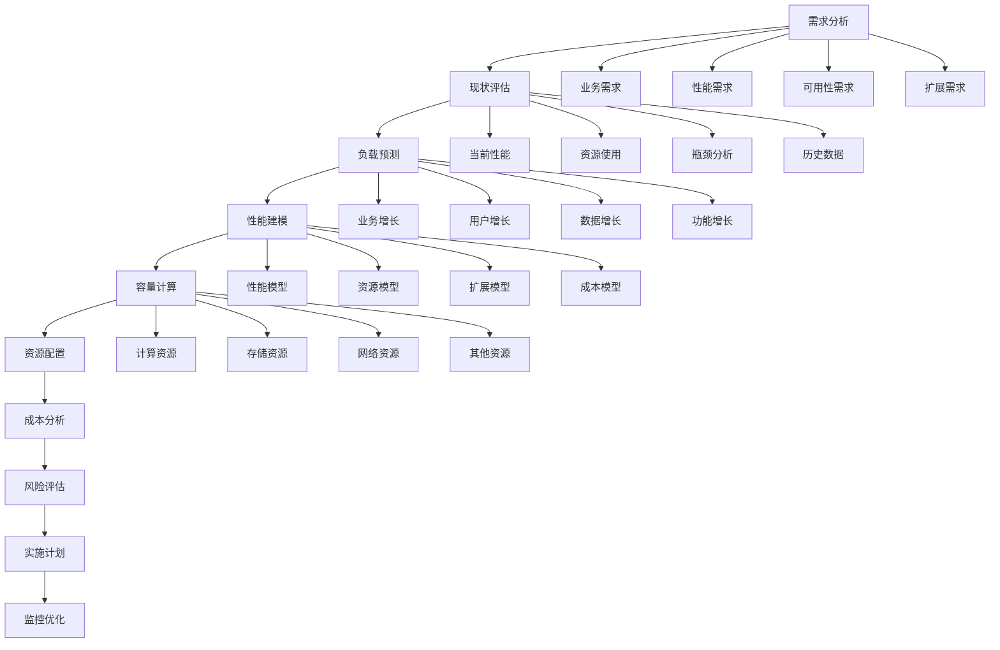

# 容量规划与成本优化深度解析 - 架构师级技术指南

## 目录
- [一、容量规划概述](#一容量规划概述)
- [二、容量规划方法论](#二容量规划方法论)
- [三、性能测试与基准](#三性能测试与基准)
- [四、容量规划模型](#四容量规划模型)
- [五、成本优化策略](#五成本优化策略)
- [六、资源优化技术](#六资源优化技术)
- [七、云成本优化](#七云成本优化)
- [八、容量规划工具](#八容量规划工具)
- [九、成本监控与分析](#九成本监控与分析)
- [十、高频面试题](#十高频面试题)

## 一、容量规划概述

### 1.1 容量规划的定义

**容量规划**是指根据业务需求、性能指标和历史数据，预测系统在未来一段时间内所需的计算、存储、网络等资源，并制定相应的资源配置和扩展策略。

**容量规划的核心目标**：
- **性能保证**：确保系统在预期负载下保持良好性能
- **成本控制**：在满足性能要求的前提下最小化成本
- **风险控制**：避免资源不足导致的系统故障
- **资源优化**：提高资源利用效率，避免资源浪费

### 1.2 容量规划的重要性

**业务价值**：
- **用户体验**：保证系统响应速度和可用性
- **业务连续性**：避免因容量不足导致的业务中断
- **成本控制**：合理配置资源，避免过度投资
- **竞争优势**：通过性能优势获得市场竞争优势

**技术价值**：
- **系统稳定性**：避免因资源不足导致的系统故障
- **性能优化**：通过容量规划优化系统性能
- **资源效率**：提高资源利用效率
- **扩展性**：为系统扩展提供指导

### 1.3 容量规划挑战

**技术挑战**：
- **负载预测**：准确预测未来负载变化
- **性能建模**：建立准确的性能模型
- **资源评估**：评估不同资源对性能的影响
- **扩展策略**：制定合适的扩展策略

**业务挑战**：
- **需求变化**：业务需求的快速变化
- **成本压力**：在性能和成本之间平衡
- **时间压力**：快速响应业务需求
- **风险控制**：平衡性能和风险

## 二、容量规划方法论

### 2.1 容量规划流程

**容量规划流程**：


### 2.2 容量规划方法

**容量规划方法实现**：
```java
// 容量规划方法
@Service
public class CapacityPlanningMethod {
    
    // 1. 基于历史数据的容量规划
    public CapacityPlan planBasedOnHistory(HistoricalData data, GrowthRate growthRate) {
        CapacityPlan plan = new CapacityPlan();
        
        // 分析历史数据
        DataAnalysis analysis = analyzeHistoricalData(data);
        
        // 预测未来需求
        FutureDemand demand = predictFutureDemand(analysis, growthRate);
        
        // 计算所需资源
        ResourceRequirement requirement = calculateResourceRequirement(demand);
        
        // 制定扩展策略
        ExpansionStrategy strategy = createExpansionStrategy(requirement);
        
        plan.setDemand(demand);
        plan.setRequirement(requirement);
        plan.setStrategy(strategy);
        
        return plan;
    }
    
    // 2. 基于性能测试的容量规划
    public CapacityPlan planBasedOnPerformanceTest(PerformanceTestResult testResult, TargetPerformance target) {
        CapacityPlan plan = new CapacityPlan();
        
        // 分析性能测试结果
        PerformanceAnalysis analysis = analyzePerformanceTest(testResult);
        
        // 计算性能瓶颈
        PerformanceBottleneck bottleneck = identifyPerformanceBottleneck(analysis);
        
        // 计算所需资源
        ResourceRequirement requirement = calculateResourceRequirement(bottleneck, target);
        
        // 制定优化策略
        OptimizationStrategy strategy = createOptimizationStrategy(requirement);
        
        plan.setBottleneck(bottleneck);
        plan.setRequirement(requirement);
        plan.setStrategy(strategy);
        
        return plan;
    }
    
    // 3. 基于业务模型的容量规划
    public CapacityPlan planBasedOnBusinessModel(BusinessModel model, BusinessGrowth growth) {
        CapacityPlan plan = new CapacityPlan();
        
        // 分析业务模型
        BusinessAnalysis analysis = analyzeBusinessModel(model);
        
        // 预测业务增长
        BusinessGrowth forecast = forecastBusinessGrowth(analysis, growth);
        
        // 计算业务对资源的需求
        ResourceRequirement requirement = calculateBusinessResourceRequirement(forecast);
        
        // 制定业务扩展策略
        BusinessExpansionStrategy strategy = createBusinessExpansionStrategy(requirement);
        
        plan.setForecast(forecast);
        plan.setRequirement(requirement);
        plan.setStrategy(strategy);
        
        return plan;
    }
    
    private DataAnalysis analyzeHistoricalData(HistoricalData data) {
        DataAnalysis analysis = new DataAnalysis();
        
        // 分析CPU使用率
        analysis.setCpuUsage(calculateAverageCpuUsage(data.getCpuData()));
        
        // 分析内存使用率
        analysis.setMemoryUsage(calculateAverageMemoryUsage(data.getMemoryData()));
        
        // 分析网络使用率
        analysis.setNetworkUsage(calculateAverageNetworkUsage(data.getNetworkData()));
        
        // 分析存储使用率
        analysis.setStorageUsage(calculateAverageStorageUsage(data.getStorageData()));
        
        return analysis;
    }
    
    private FutureDemand predictFutureDemand(DataAnalysis analysis, GrowthRate growthRate) {
        FutureDemand demand = new FutureDemand();
        
        // 预测CPU需求
        double cpuDemand = analysis.getCpuUsage() * (1 + growthRate.getCpuGrowth());
        demand.setCpuDemand(cpuDemand);
        
        // 预测内存需求
        double memoryDemand = analysis.getMemoryUsage() * (1 + growthRate.getMemoryGrowth());
        demand.setMemoryDemand(memoryDemand);
        
        // 预测网络需求
        double networkDemand = analysis.getNetworkUsage() * (1 + growthRate.getNetworkGrowth());
        demand.setNetworkDemand(networkDemand);
        
        // 预测存储需求
        double storageDemand = analysis.getStorageUsage() * (1 + growthRate.getStorageGrowth());
        demand.setStorageDemand(storageDemand);
        
        return demand;
    }
}
```

### 2.3 容量规划模型

**容量规划模型实现**：
```java
// 容量规划模型
@Component
public class CapacityPlanningModel {
    
    // 线性增长模型
    public CapacityPlan linearGrowthModel(CurrentCapacity current, GrowthRate rate, TimePeriod period) {
        CapacityPlan plan = new CapacityPlan();
        
        // 计算线性增长
        double growthFactor = 1 + (rate.getRate() * period.getMonths());
        
        // 计算未来容量需求
        double futureCapacity = current.getCapacity() * growthFactor;
        plan.setFutureCapacity(futureCapacity);
        
        // 计算扩展需求
        double expansionNeeded = futureCapacity - current.getCapacity();
        plan.setExpansionNeeded(expansionNeeded);
        
        // 计算扩展时间点
        LocalDateTime expansionTime = calculateExpansionTime(current, rate);
        plan.setExpansionTime(expansionTime);
        
        return plan;
    }
    
    // 指数增长模型
    public CapacityPlan exponentialGrowthModel(CurrentCapacity current, GrowthRate rate, TimePeriod period) {
        CapacityPlan plan = new CapacityPlan();
        
        // 计算指数增长
        double growthFactor = Math.pow(1 + rate.getRate(), period.getMonths());
        
        // 计算未来容量需求
        double futureCapacity = current.getCapacity() * growthFactor;
        plan.setFutureCapacity(futureCapacity);
        
        // 计算扩展需求
        double expansionNeeded = futureCapacity - current.getCapacity();
        plan.setExpansionNeeded(expansionNeeded);
        
        // 计算扩展时间点
        LocalDateTime expansionTime = calculateExpansionTime(current, rate);
        plan.setExpansionTime(expansionTime);
        
        return plan;
    }
    
    // 季节性模型
    public CapacityPlan seasonalModel(CurrentCapacity current, SeasonalPattern pattern, TimePeriod period) {
        CapacityPlan plan = new CapacityPlan();
        
        // 计算季节性调整
        double seasonalFactor = pattern.getFactor(period.getMonth());
        
        // 计算基础增长
        double baseGrowth = current.getCapacity() * (1 + pattern.getBaseGrowthRate());
        
        // 计算季节性容量需求
        double seasonalCapacity = baseGrowth * seasonalFactor;
        plan.setFutureCapacity(seasonalCapacity);
        
        // 计算扩展需求
        double expansionNeeded = seasonalCapacity - current.getCapacity();
        plan.setExpansionNeeded(expansionNeeded);
        
        // 计算扩展时间点
        LocalDateTime expansionTime = calculateSeasonalExpansionTime(current, pattern);
        plan.setExpansionTime(expansionTime);
        
        return plan;
    }
    
    // 复合增长模型
    public CapacityPlan compoundGrowthModel(CurrentCapacity current, List<GrowthFactor> factors, TimePeriod period) {
        CapacityPlan plan = new CapacityPlan();
        
        // 计算复合增长
        double compoundFactor = 1.0;
        for (GrowthFactor factor : factors) {
            compoundFactor *= (1 + factor.getRate());
        }
        
        // 计算未来容量需求
        double futureCapacity = current.getCapacity() * compoundFactor;
        plan.setFutureCapacity(futureCapacity);
        
        // 计算扩展需求
        double expansionNeeded = futureCapacity - current.getCapacity();
        plan.setExpansionNeeded(expansionNeeded);
        
        // 计算扩展时间点
        LocalDateTime expansionTime = calculateCompoundExpansionTime(current, factors);
        plan.setExpansionTime(expansionTime);
        
        return plan;
    }
}
```

## 三、性能测试与基准

### 3.1 性能测试框架

**性能测试框架实现**：
```java
// 性能测试框架
@Component
public class PerformanceTestFramework {
    
    @Autowired
    private MetricsCollector metricsCollector;
    
    @Autowired
    private ReportGenerator reportGenerator;
    
    // 负载测试
    public PerformanceTestResult loadTest(LoadTestConfig config) {
        PerformanceTestResult result = new PerformanceTestResult();
        
        // 执行负载测试
        for (int i = 0; i < config.getTestRounds(); i++) {
            LoadTestRound round = executeLoadTestRound(config, i);
            result.addTestRound(round);
        }
        
        // 分析测试结果
        PerformanceAnalysis analysis = analyzePerformanceTest(result);
        result.setAnalysis(analysis);
        
        // 生成测试报告
        TestReport report = reportGenerator.generateReport(result);
        result.setReport(report);
        
        return result;
    }
    
    // 压力测试
    public PerformanceTestResult stressTest(StressTestConfig config) {
        PerformanceTestResult result = new PerformanceTestResult();
        
        // 执行压力测试
        for (int i = 0; i < config.getTestRounds(); i++) {
            StressTestRound round = executeStressTestRound(config, i);
            result.addTestRound(round);
        }
        
        // 分析测试结果
        PerformanceAnalysis analysis = analyzePerformanceTest(result);
        result.setAnalysis(analysis);
        
        // 生成测试报告
        TestReport report = reportGenerator.generateReport(result);
        result.setReport(report);
        
        return result;
    }
    
    // 容量测试
    public PerformanceTestResult capacityTest(CapacityTestConfig config) {
        PerformanceTestResult result = new PerformanceTestResult();
        
        // 执行容量测试
        for (int i = 0; i < config.getTestRounds(); i++) {
            CapacityTestRound round = executeCapacityTestRound(config, i);
            result.addTestRound(round);
        }
        
        // 分析测试结果
        PerformanceAnalysis analysis = analyzePerformanceTest(result);
        result.setAnalysis(analysis);
        
        // 生成测试报告
        TestReport report = reportGenerator.generateReport(result);
        result.setReport(report);
        
        return result;
    }
    
    private LoadTestRound executeLoadTestRound(LoadTestConfig config, int round) {
        LoadTestRound testRound = new LoadTestRound();
        testRound.setRoundNumber(round);
        testRound.setStartTime(LocalDateTime.now());
        
        // 执行负载测试
        for (int i = 0; i < config.getConcurrentUsers(); i++) {
            TestUser user = createTestUser(i);
            TestResult userResult = executeUserTest(user, config);
            testRound.addUserResult(userResult);
        }
        
        testRound.setEndTime(LocalDateTime.now());
        testRound.setDuration(Duration.between(testRound.getStartTime(), testRound.getEndTime()));
        
        return testRound;
    }
    
    private StressTestRound executeStressTestRound(StressTestConfig config, int round) {
        StressTestRound testRound = new StressTestRound();
        testRound.setRoundNumber(round);
        testRound.setStartTime(LocalDateTime.now());
        
        // 执行压力测试
        for (int i = 0; i < config.getMaxUsers(); i++) {
            TestUser user = createTestUser(i);
            TestResult userResult = executeUserTest(user, config);
            testRound.addUserResult(userResult);
        }
        
        testRound.setEndTime(LocalDateTime.now());
        testRound.setDuration(Duration.between(testRound.getStartTime(), testRound.getEndTime()));
        
        return testRound;
    }
    
    private CapacityTestRound executeCapacityTestRound(CapacityTestConfig config, int round) {
        CapacityTestRound testRound = new CapacityTestRound();
        testRound.setRoundNumber(round);
        testRound.setStartTime(LocalDateTime.now());
        
        // 执行容量测试
        for (int i = 0; i < config.getTargetUsers(); i++) {
            TestUser user = createTestUser(i);
            TestResult userResult = executeUserTest(user, config);
            testRound.addUserResult(userResult);
        }
        
        testRound.setEndTime(LocalDateTime.now());
        testRound.setDuration(Duration.between(testRound.getStartTime(), testRound.getEndTime()));
        
        return testRound;
    }
}
```

### 3.2 性能基准

**性能基准实现**：
```java
// 性能基准
@Component
public class PerformanceBenchmark {
    
    @Autowired
    private MetricsCollector metricsCollector;
    
    // 建立性能基准
    public PerformanceBenchmark establishBenchmark(PerformanceTestResult testResult) {
        PerformanceBenchmark benchmark = new PerformanceBenchmark();
        
        // 计算响应时间基准
        double avgResponseTime = calculateAverageResponseTime(testResult);
        benchmark.setAvgResponseTime(avgResponseTime);
        
        double p95ResponseTime = calculateP95ResponseTime(testResult);
        benchmark.setP95ResponseTime(p95ResponseTime);
        
        double p99ResponseTime = calculateP99ResponseTime(testResult);
        benchmark.setP99ResponseTime(p99ResponseTime);
        
        // 计算吞吐量基准
        double throughput = calculateThroughput(testResult);
        benchmark.setThroughput(throughput);
        
        // 计算错误率基准
        double errorRate = calculateErrorRate(testResult);
        benchmark.setErrorRate(errorRate);
        
        // 计算资源使用基准
        double cpuUsage = calculateCpuUsage(testResult);
        benchmark.setCpuUsage(cpuUsage);
        
        double memoryUsage = calculateMemoryUsage(testResult);
        benchmark.setMemoryUsage(memoryUsage);
        
        double networkUsage = calculateNetworkUsage(testResult);
        benchmark.setNetworkUsage(networkUsage);
        
        return benchmark;
    }
    
    // 比较性能基准
    public PerformanceComparison compareBenchmark(PerformanceBenchmark baseline, PerformanceBenchmark current) {
        PerformanceComparison comparison = new PerformanceComparison();
        
        // 比较响应时间
        double responseTimeChange = (current.getAvgResponseTime() - baseline.getAvgResponseTime()) / baseline.getAvgResponseTime();
        comparison.setResponseTimeChange(responseTimeChange);
        
        // 比较吞吐量
        double throughputChange = (current.getThroughput() - baseline.getThroughput()) / baseline.getThroughput();
        comparison.setThroughputChange(throughputChange);
        
        // 比较错误率
        double errorRateChange = (current.getErrorRate() - baseline.getErrorRate()) / baseline.getErrorRate();
        comparison.setErrorRateChange(errorRateChange);
        
        // 比较资源使用
        double cpuUsageChange = (current.getCpuUsage() - baseline.getCpuUsage()) / baseline.getCpuUsage();
        comparison.setCpuUsageChange(cpuUsageChange);
        
        double memoryUsageChange = (current.getMemoryUsage() - baseline.getMemoryUsage()) / baseline.getMemoryUsage();
        comparison.setMemoryUsageChange(memoryUsageChange);
        
        double networkUsageChange = (current.getNetworkUsage() - baseline.getNetworkUsage()) / baseline.getNetworkUsage();
        comparison.setNetworkUsageChange(networkUsageChange);
        
        return comparison;
    }
    
    // 性能回归检测
    public PerformanceRegression detectRegression(PerformanceBenchmark baseline, PerformanceBenchmark current) {
        PerformanceRegression regression = new PerformanceRegression();
        
        // 检测响应时间回归
        if (current.getAvgResponseTime() > baseline.getAvgResponseTime() * 1.1) {
            regression.setResponseTimeRegression(true);
            regression.setResponseTimeRegressionSeverity(calculateRegressionSeverity(
                current.getAvgResponseTime(), baseline.getAvgResponseTime()));
        }
        
        // 检测吞吐量回归
        if (current.getThroughput() < baseline.getThroughput() * 0.9) {
            regression.setThroughputRegression(true);
            regression.setThroughputRegressionSeverity(calculateRegressionSeverity(
                baseline.getThroughput(), current.getThroughput()));
        }
        
        // 检测错误率回归
        if (current.getErrorRate() > baseline.getErrorRate() * 1.1) {
            regression.setErrorRateRegression(true);
            regression.setErrorRateRegressionSeverity(calculateRegressionSeverity(
                current.getErrorRate(), baseline.getErrorRate()));
        }
        
        // 检测资源使用回归
        if (current.getCpuUsage() > baseline.getCpuUsage() * 1.1) {
            regression.setCpuUsageRegression(true);
            regression.setCpuUsageRegressionSeverity(calculateRegressionSeverity(
                current.getCpuUsage(), baseline.getCpuUsage()));
        }
        
        if (current.getMemoryUsage() > baseline.getMemoryUsage() * 1.1) {
            regression.setMemoryUsageRegression(true);
            regression.setMemoryUsageRegressionSeverity(calculateRegressionSeverity(
                current.getMemoryUsage(), baseline.getMemoryUsage()));
        }
        
        return regression;
    }
}
```

## 四、容量规划模型

### 4.1 资源需求模型

**资源需求模型实现**：
```java
// 资源需求模型
@Component
public class ResourceRequirementModel {
    
    // CPU需求模型
    public CpuRequirement calculateCpuRequirement(WorkloadProfile workload, PerformanceTarget target) {
        CpuRequirement requirement = new CpuRequirement();
        
        // 计算基础CPU需求
        double baseCpuRequirement = workload.getCpuIntensiveTasks() * target.getCpuUtilization();
        
        // 计算峰值CPU需求
        double peakCpuRequirement = baseCpuRequirement * workload.getPeakFactor();
        
        // 计算安全余量
        double safetyMargin = peakCpuRequirement * target.getSafetyMargin();
        
        // 计算总CPU需求
        double totalCpuRequirement = peakCpuRequirement + safetyMargin;
        requirement.setTotalRequirement(totalCpuRequirement);
        
        // 计算CPU核心数
        int cpuCores = (int) Math.ceil(totalCpuRequirement / target.getCpuPerCore());
        requirement.setCpuCores(cpuCores);
        
        return requirement;
    }
    
    // 内存需求模型
    public MemoryRequirement calculateMemoryRequirement(WorkloadProfile workload, PerformanceTarget target) {
        MemoryRequirement requirement = new MemoryRequirement();
        
        // 计算基础内存需求
        double baseMemoryRequirement = workload.getMemoryIntensiveTasks() * target.getMemoryPerTask();
        
        // 计算峰值内存需求
        double peakMemoryRequirement = baseMemoryRequirement * workload.getPeakFactor();
        
        // 计算安全余量
        double safetyMargin = peakMemoryRequirement * target.getSafetyMargin();
        
        // 计算总内存需求
        double totalMemoryRequirement = peakMemoryRequirement + safetyMargin;
        requirement.setTotalRequirement(totalMemoryRequirement);
        
        // 计算内存大小
        int memorySize = (int) Math.ceil(totalMemoryRequirement / target.getMemoryPerGB());
        requirement.setMemorySize(memorySize);
        
        return requirement;
    }
    
    // 存储需求模型
    public StorageRequirement calculateStorageRequirement(DataProfile data, PerformanceTarget target) {
        StorageRequirement requirement = new StorageRequirement();
        
        // 计算基础存储需求
        double baseStorageRequirement = data.getDataSize() * target.getStorageUtilization();
        
        // 计算增长存储需求
        double growthStorageRequirement = baseStorageRequirement * data.getGrowthRate();
        
        // 计算备份存储需求
        double backupStorageRequirement = baseStorageRequirement * target.getBackupFactor();
        
        // 计算总存储需求
        double totalStorageRequirement = baseStorageRequirement + growthStorageRequirement + backupStorageRequirement;
        requirement.setTotalRequirement(totalStorageRequirement);
        
        // 计算存储大小
        int storageSize = (int) Math.ceil(totalStorageRequirement / target.getStoragePerTB());
        requirement.setStorageSize(storageSize);
        
        return requirement;
    }
    
    // 网络需求模型
    public NetworkRequirement calculateNetworkRequirement(TrafficProfile traffic, PerformanceTarget target) {
        NetworkRequirement requirement = new NetworkRequirement();
        
        // 计算基础网络需求
        double baseNetworkRequirement = traffic.getBandwidth() * target.getNetworkUtilization();
        
        // 计算峰值网络需求
        double peakNetworkRequirement = baseNetworkRequirement * traffic.getPeakFactor();
        
        // 计算安全余量
        double safetyMargin = peakNetworkRequirement * target.getSafetyMargin();
        
        // 计算总网络需求
        double totalNetworkRequirement = peakNetworkRequirement + safetyMargin;
        requirement.setTotalRequirement(totalNetworkRequirement);
        
        // 计算网络带宽
        int networkBandwidth = (int) Math.ceil(totalNetworkRequirement / target.getBandwidthPerMbps());
        requirement.setNetworkBandwidth(networkBandwidth);
        
        return requirement;
    }
}
```

### 4.2 扩展模型

**扩展模型实现**：
```java
// 扩展模型
@Component
public class ScalingModel {
    
    // 垂直扩展模型
    public VerticalScalingPlan calculateVerticalScaling(CurrentCapacity current, TargetCapacity target) {
        VerticalScalingPlan plan = new VerticalScalingPlan();
        
        // 计算CPU扩展需求
        double cpuScalingFactor = target.getCpuRequirement() / current.getCpuCapacity();
        plan.setCpuScalingFactor(cpuScalingFactor);
        
        // 计算内存扩展需求
        double memoryScalingFactor = target.getMemoryRequirement() / current.getMemoryCapacity();
        plan.setMemoryScalingFactor(memoryScalingFactor);
        
        // 计算存储扩展需求
        double storageScalingFactor = target.getStorageRequirement() / current.getStorageCapacity();
        plan.setStorageScalingFactor(storageScalingFactor);
        
        // 计算网络扩展需求
        double networkScalingFactor = target.getNetworkRequirement() / current.getNetworkCapacity();
        plan.setNetworkScalingFactor(networkScalingFactor);
        
        // 计算扩展成本
        double scalingCost = calculateVerticalScalingCost(current, target);
        plan.setScalingCost(scalingCost);
        
        return plan;
    }
    
    // 水平扩展模型
    public HorizontalScalingPlan calculateHorizontalScaling(CurrentCapacity current, TargetCapacity target) {
        HorizontalScalingPlan plan = new HorizontalScalingPlan();
        
        // 计算实例数量
        int instanceCount = calculateInstanceCount(current, target);
        plan.setInstanceCount(instanceCount);
        
        // 计算扩展实例数
        int scalingInstances = instanceCount - current.getInstanceCount();
        plan.setScalingInstances(scalingInstances);
        
        // 计算扩展成本
        double scalingCost = calculateHorizontalScalingCost(current, target, scalingInstances);
        plan.setScalingCost(scalingCost);
        
        // 计算扩展时间
        Duration scalingTime = calculateScalingTime(scalingInstances);
        plan.setScalingTime(scalingTime);
        
        return plan;
    }
    
    // 混合扩展模型
    public HybridScalingPlan calculateHybridScaling(CurrentCapacity current, TargetCapacity target) {
        HybridScalingPlan plan = new HybridScalingPlan();
        
        // 计算垂直扩展
        VerticalScalingPlan verticalScaling = calculateVerticalScaling(current, target);
        plan.setVerticalScaling(verticalScaling);
        
        // 计算水平扩展
        HorizontalScalingPlan horizontalScaling = calculateHorizontalScaling(current, target);
        plan.setHorizontalScaling(horizontalScaling);
        
        // 计算混合扩展策略
        ScalingStrategy strategy = calculateHybridScalingStrategy(verticalScaling, horizontalScaling);
        plan.setStrategy(strategy);
        
        // 计算总扩展成本
        double totalScalingCost = verticalScaling.getScalingCost() + horizontalScaling.getScalingCost();
        plan.setTotalScalingCost(totalScalingCost);
        
        return plan;
    }
    
    private int calculateInstanceCount(CurrentCapacity current, TargetCapacity target) {
        // 计算所需实例数
        double cpuInstances = Math.ceil(target.getCpuRequirement() / current.getCpuPerInstance());
        double memoryInstances = Math.ceil(target.getMemoryRequirement() / current.getMemoryPerInstance());
        double storageInstances = Math.ceil(target.getStorageRequirement() / current.getStoragePerInstance());
        double networkInstances = Math.ceil(target.getNetworkRequirement() / current.getNetworkPerInstance());
        
        // 取最大值
        return (int) Math.max(Math.max(cpuInstances, memoryInstances), 
                             Math.max(storageInstances, networkInstances));
    }
    
    private double calculateVerticalScalingCost(CurrentCapacity current, TargetCapacity target) {
        // 计算垂直扩展成本
        double cpuCost = (target.getCpuRequirement() - current.getCpuCapacity()) * current.getCpuCostPerUnit();
        double memoryCost = (target.getMemoryRequirement() - current.getMemoryCapacity()) * current.getMemoryCostPerUnit();
        double storageCost = (target.getStorageRequirement() - current.getStorageCapacity()) * current.getStorageCostPerUnit();
        double networkCost = (target.getNetworkRequirement() - current.getNetworkCapacity()) * current.getNetworkCostPerUnit();
        
        return cpuCost + memoryCost + storageCost + networkCost;
    }
    
    private double calculateHorizontalScalingCost(CurrentCapacity current, TargetCapacity target, int scalingInstances) {
        // 计算水平扩展成本
        double instanceCost = scalingInstances * current.getCostPerInstance();
        double setupCost = scalingInstances * current.getSetupCostPerInstance();
        
        return instanceCost + setupCost;
    }
}
```

## 五、成本优化策略

### 5.1 资源优化

**资源优化实现**：
```java
// 资源优化
@Service
public class ResourceOptimization {
    
    // CPU优化
    public CpuOptimization optimizeCpu(CpuUsageData data, CpuOptimizationTarget target) {
        CpuOptimization optimization = new CpuOptimization();
        
        // 分析CPU使用模式
        CpuUsagePattern pattern = analyzeCpuUsagePattern(data);
        
        // 识别优化机会
        List<CpuOptimizationOpportunity> opportunities = identifyCpuOptimizationOpportunities(pattern);
        
        // 计算优化效果
        CpuOptimizationEffect effect = calculateCpuOptimizationEffect(opportunities);
        
        // 生成优化建议
        List<CpuOptimizationSuggestion> suggestions = generateCpuOptimizationSuggestions(opportunities, effect);
        
        optimization.setPattern(pattern);
        optimization.setOpportunities(opportunities);
        optimization.setEffect(effect);
        optimization.setSuggestions(suggestions);
        
        return optimization;
    }
    
    // 内存优化
    public MemoryOptimization optimizeMemory(MemoryUsageData data, MemoryOptimizationTarget target) {
        MemoryOptimization optimization = new MemoryOptimization();
        
        // 分析内存使用模式
        MemoryUsagePattern pattern = analyzeMemoryUsagePattern(data);
        
        // 识别优化机会
        List<MemoryOptimizationOpportunity> opportunities = identifyMemoryOptimizationOpportunities(pattern);
        
        // 计算优化效果
        MemoryOptimizationEffect effect = calculateMemoryOptimizationEffect(opportunities);
        
        // 生成优化建议
        List<MemoryOptimizationSuggestion> suggestions = generateMemoryOptimizationSuggestions(opportunities, effect);
        
        optimization.setPattern(pattern);
        optimization.setOpportunities(opportunities);
        optimization.setEffect(effect);
        optimization.setSuggestions(suggestions);
        
        return optimization;
    }
    
    // 存储优化
    public StorageOptimization optimizeStorage(StorageUsageData data, StorageOptimizationTarget target) {
        StorageOptimization optimization = new StorageOptimization();
        
        // 分析存储使用模式
        StorageUsagePattern pattern = analyzeStorageUsagePattern(data);
        
        // 识别优化机会
        List<StorageOptimizationOpportunity> opportunities = identifyStorageOptimizationOpportunities(pattern);
        
        // 计算优化效果
        StorageOptimizationEffect effect = calculateStorageOptimizationEffect(opportunities);
        
        // 生成优化建议
        List<StorageOptimizationSuggestion> suggestions = generateStorageOptimizationSuggestions(opportunities, effect);
        
        optimization.setPattern(pattern);
        optimization.setOpportunities(opportunities);
        optimization.setEffect(effect);
        optimization.setSuggestions(suggestions);
        
        return optimization;
    }
    
    // 网络优化
    public NetworkOptimization optimizeNetwork(NetworkUsageData data, NetworkOptimizationTarget target) {
        NetworkOptimization optimization = new NetworkOptimization();
        
        // 分析网络使用模式
        NetworkUsagePattern pattern = analyzeNetworkUsagePattern(data);
        
        // 识别优化机会
        List<NetworkOptimizationOpportunity> opportunities = identifyNetworkOptimizationOpportunities(pattern);
        
        // 计算优化效果
        NetworkOptimizationEffect effect = calculateNetworkOptimizationEffect(opportunities);
        
        // 生成优化建议
        List<NetworkOptimizationSuggestion> suggestions = generateNetworkOptimizationSuggestions(opportunities, effect);
        
        optimization.setPattern(pattern);
        optimization.setOpportunities(opportunities);
        optimization.setEffect(effect);
        optimization.setSuggestions(suggestions);
        
        return optimization;
    }
}
```

### 5.2 成本分析

**成本分析实现**：
```java
// 成本分析
@Service
public class CostAnalysis {
    
    // 总拥有成本分析
    public TotalCostOfOwnership analyzeTCO(ResourceProfile profile, CostProfile cost) {
        TotalCostOfOwnership tco = new TotalCostOfOwnership();
        
        // 计算硬件成本
        double hardwareCost = calculateHardwareCost(profile, cost);
        tco.setHardwareCost(hardwareCost);
        
        // 计算软件成本
        double softwareCost = calculateSoftwareCost(profile, cost);
        tco.setSoftwareCost(softwareCost);
        
        // 计算运维成本
        double operationalCost = calculateOperationalCost(profile, cost);
        tco.setOperationalCost(operationalCost);
        
        // 计算人力成本
        double humanCost = calculateHumanCost(profile, cost);
        tco.setHumanCost(humanCost);
        
        // 计算总成本
        double totalCost = hardwareCost + softwareCost + operationalCost + humanCost;
        tco.setTotalCost(totalCost);
        
        // 计算成本效益
        double costEffectiveness = calculateCostEffectiveness(tco, profile);
        tco.setCostEffectiveness(costEffectiveness);
        
        return tco;
    }
    
    // 成本效益分析
    public CostBenefitAnalysis analyzeCostBenefit(InvestmentProfile investment, BenefitProfile benefit) {
        CostBenefitAnalysis analysis = new CostBenefitAnalysis();
        
        // 计算投资回报率
        double roi = calculateROI(investment, benefit);
        analysis.setROI(roi);
        
        // 计算净现值
        double npv = calculateNPV(investment, benefit);
        analysis.setNPV(npv);
        
        // 计算内部收益率
        double irr = calculateIRR(investment, benefit);
        analysis.setIRR(irr);
        
        // 计算投资回收期
        double paybackPeriod = calculatePaybackPeriod(investment, benefit);
        analysis.setPaybackPeriod(paybackPeriod);
        
        // 计算成本效益比
        double costBenefitRatio = calculateCostBenefitRatio(investment, benefit);
        analysis.setCostBenefitRatio(costBenefitRatio);
        
        return analysis;
    }
    
    // 成本优化分析
    public CostOptimizationAnalysis analyzeCostOptimization(CurrentCostProfile current, TargetCostProfile target) {
        CostOptimizationAnalysis analysis = new CostOptimizationAnalysis();
        
        // 计算成本优化潜力
        double costOptimizationPotential = calculateCostOptimizationPotential(current, target);
        analysis.setCostOptimizationPotential(costOptimizationPotential);
        
        // 识别成本优化机会
        List<CostOptimizationOpportunity> opportunities = identifyCostOptimizationOpportunities(current, target);
        analysis.setOpportunities(opportunities);
        
        // 计算优化效果
        CostOptimizationEffect effect = calculateCostOptimizationEffect(opportunities);
        analysis.setEffect(effect);
        
        // 生成优化建议
        List<CostOptimizationSuggestion> suggestions = generateCostOptimizationSuggestions(opportunities, effect);
        analysis.setSuggestions(suggestions);
        
        return analysis;
    }
    
    private double calculateHardwareCost(ResourceProfile profile, CostProfile cost) {
        // 计算硬件成本
        double serverCost = profile.getServerCount() * cost.getServerCost();
        double storageCost = profile.getStorageSize() * cost.getStorageCost();
        double networkCost = profile.getNetworkBandwidth() * cost.getNetworkCost();
        
        return serverCost + storageCost + networkCost;
    }
    
    private double calculateSoftwareCost(ResourceProfile profile, CostProfile cost) {
        // 计算软件成本
        double licenseCost = profile.getLicenseCount() * cost.getLicenseCost();
        double supportCost = profile.getSupportLevel() * cost.getSupportCost();
        double maintenanceCost = profile.getMaintenanceLevel() * cost.getMaintenanceCost();
        
        return licenseCost + supportCost + maintenanceCost;
    }
    
    private double calculateOperationalCost(ResourceProfile profile, CostProfile cost) {
        // 计算运维成本
        double powerCost = profile.getPowerConsumption() * cost.getPowerCost();
        double coolingCost = profile.getCoolingRequirement() * cost.getCoolingCost();
        double spaceCost = profile.getSpaceRequirement() * cost.getSpaceCost();
        
        return powerCost + coolingCost + spaceCost;
    }
    
    private double calculateHumanCost(ResourceProfile profile, CostProfile cost) {
        // 计算人力成本
        double adminCost = profile.getAdminCount() * cost.getAdminCost();
        double developerCost = profile.getDeveloperCount() * cost.getDeveloperCost();
        double supportCost = profile.getSupportCount() * cost.getSupportCost();
        
        return adminCost + developerCost + supportCost;
    }
}
```

## 六、资源优化技术

### 6.1 虚拟化优化

**虚拟化优化实现**：
```java
// 虚拟化优化
@Service
public class VirtualizationOptimization {
    
    // 虚拟机优化
    public VirtualMachineOptimization optimizeVirtualMachine(VirtualMachineProfile profile, OptimizationTarget target) {
        VirtualMachineOptimization optimization = new VirtualMachineOptimization();
        
        // 分析虚拟机资源使用
        VirtualMachineUsageAnalysis analysis = analyzeVirtualMachineUsage(profile);
        
        // 识别优化机会
        List<VirtualMachineOptimizationOpportunity> opportunities = identifyVirtualMachineOptimizationOpportunities(analysis);
        
        // 计算优化效果
        VirtualMachineOptimizationEffect effect = calculateVirtualMachineOptimizationEffect(opportunities);
        
        // 生成优化建议
        List<VirtualMachineOptimizationSuggestion> suggestions = generateVirtualMachineOptimizationSuggestions(opportunities, effect);
        
        optimization.setAnalysis(analysis);
        optimization.setOpportunities(opportunities);
        optimization.setEffect(effect);
        optimization.setSuggestions(suggestions);
        
        return optimization;
    }
    
    // 容器优化
    public ContainerOptimization optimizeContainer(ContainerProfile profile, OptimizationTarget target) {
        ContainerOptimization optimization = new ContainerOptimization();
        
        // 分析容器资源使用
        ContainerUsageAnalysis analysis = analyzeContainerUsage(profile);
        
        // 识别优化机会
        List<ContainerOptimizationOpportunity> opportunities = identifyContainerOptimizationOpportunities(analysis);
        
        // 计算优化效果
        ContainerOptimizationEffect effect = calculateContainerOptimizationEffect(opportunities);
        
        // 生成优化建议
        List<ContainerOptimizationSuggestion> suggestions = generateContainerOptimizationSuggestions(opportunities, effect);
        
        optimization.setAnalysis(analysis);
        optimization.setOpportunities(opportunities);
        optimization.setEffect(effect);
        optimization.setSuggestions(suggestions);
        
        return optimization;
    }
    
    // 资源池优化
    public ResourcePoolOptimization optimizeResourcePool(ResourcePoolProfile profile, OptimizationTarget target) {
        ResourcePoolOptimization optimization = new ResourcePoolOptimization();
        
        // 分析资源池使用
        ResourcePoolUsageAnalysis analysis = analyzeResourcePoolUsage(profile);
        
        // 识别优化机会
        List<ResourcePoolOptimizationOpportunity> opportunities = identifyResourcePoolOptimizationOpportunities(analysis);
        
        // 计算优化效果
        ResourcePoolOptimizationEffect effect = calculateResourcePoolOptimizationEffect(opportunities);
        
        // 生成优化建议
        List<ResourcePoolOptimizationSuggestion> suggestions = generateResourcePoolOptimizationSuggestions(opportunities, effect);
        
        optimization.setAnalysis(analysis);
        optimization.setOpportunities(opportunities);
        optimization.setEffect(effect);
        optimization.setSuggestions(suggestions);
        
        return optimization;
    }
}
```

### 6.2 自动化优化

**自动化优化实现**：
```java
// 自动化优化
@Service
public class AutomationOptimization {
    
    // 自动扩缩容
    public AutoScalingOptimization optimizeAutoScaling(AutoScalingProfile profile, OptimizationTarget target) {
        AutoScalingOptimization optimization = new AutoScalingOptimization();
        
        // 分析自动扩缩容配置
        AutoScalingConfigurationAnalysis analysis = analyzeAutoScalingConfiguration(profile);
        
        // 识别优化机会
        List<AutoScalingOptimizationOpportunity> opportunities = identifyAutoScalingOptimizationOpportunities(analysis);
        
        // 计算优化效果
        AutoScalingOptimizationEffect effect = calculateAutoScalingOptimizationEffect(opportunities);
        
        // 生成优化建议
        List<AutoScalingOptimizationSuggestion> suggestions = generateAutoScalingOptimizationSuggestions(opportunities, effect);
        
        optimization.setAnalysis(analysis);
        optimization.setOpportunities(opportunities);
        optimization.setEffect(effect);
        optimization.setSuggestions(suggestions);
        
        return optimization;
    }
    
    // 负载均衡优化
    public LoadBalancingOptimization optimizeLoadBalancing(LoadBalancingProfile profile, OptimizationTarget target) {
        LoadBalancingOptimization optimization = new LoadBalancingOptimization();
        
        // 分析负载均衡配置
        LoadBalancingConfigurationAnalysis analysis = analyzeLoadBalancingConfiguration(profile);
        
        // 识别优化机会
        List<LoadBalancingOptimizationOpportunity> opportunities = identifyLoadBalancingOptimizationOpportunities(analysis);
        
        // 计算优化效果
        LoadBalancingOptimizationEffect effect = calculateLoadBalancingOptimizationEffect(opportunities);
        
        // 生成优化建议
        List<LoadBalancingOptimizationSuggestion> suggestions = generateLoadBalancingOptimizationSuggestions(opportunities, effect);
        
        optimization.setAnalysis(analysis);
        optimization.setOpportunities(opportunities);
        optimization.setEffect(effect);
        optimization.setSuggestions(suggestions);
        
        return optimization;
    }
    
    // 资源调度优化
    public ResourceSchedulingOptimization optimizeResourceScheduling(ResourceSchedulingProfile profile, OptimizationTarget target) {
        ResourceSchedulingOptimization optimization = new ResourceSchedulingOptimization();
        
        // 分析资源调度配置
        ResourceSchedulingConfigurationAnalysis analysis = analyzeResourceSchedulingConfiguration(profile);
        
        // 识别优化机会
        List<ResourceSchedulingOptimizationOpportunity> opportunities = identifyResourceSchedulingOptimizationOpportunities(analysis);
        
        // 计算优化效果
        ResourceSchedulingOptimizationEffect effect = calculateResourceSchedulingOptimizationEffect(opportunities);
        
        // 生成优化建议
        List<ResourceSchedulingOptimizationSuggestion> suggestions = generateResourceSchedulingOptimizationSuggestions(opportunities, effect);
        
        optimization.setAnalysis(analysis);
        optimization.setOpportunities(opportunities);
        optimization.setEffect(effect);
        optimization.setSuggestions(suggestions);
        
        return optimization;
    }
}
```

## 七、云成本优化

### 7.1 云资源优化

**云资源优化实现**：
```java
// 云资源优化
@Service
public class CloudResourceOptimization {
    
    // 实例类型优化
    public InstanceTypeOptimization optimizeInstanceType(InstanceTypeProfile profile, OptimizationTarget target) {
        InstanceTypeOptimization optimization = new InstanceTypeOptimization();
        
        // 分析实例类型使用
        InstanceTypeUsageAnalysis analysis = analyzeInstanceTypeUsage(profile);
        
        // 识别优化机会
        List<InstanceTypeOptimizationOpportunity> opportunities = identifyInstanceTypeOptimizationOpportunities(analysis);
        
        // 计算优化效果
        InstanceTypeOptimizationEffect effect = calculateInstanceTypeOptimizationEffect(opportunities);
        
        // 生成优化建议
        List<InstanceTypeOptimizationSuggestion> suggestions = generateInstanceTypeOptimizationSuggestions(opportunities, effect);
        
        optimization.setAnalysis(analysis);
        optimization.setOpportunities(opportunities);
        optimization.setEffect(effect);
        optimization.setSuggestions(suggestions);
        
        return optimization;
    }
    
    // 存储优化
    public StorageOptimization optimizeStorage(StorageProfile profile, OptimizationTarget target) {
        StorageOptimization optimization = new StorageOptimization();
        
        // 分析存储使用
        StorageUsageAnalysis analysis = analyzeStorageUsage(profile);
        
        // 识别优化机会
        List<StorageOptimizationOpportunity> opportunities = identifyStorageOptimizationOpportunities(analysis);
        
        // 计算优化效果
        StorageOptimizationEffect effect = calculateStorageOptimizationEffect(opportunities);
        
        // 生成优化建议
        List<StorageOptimizationSuggestion> suggestions = generateStorageOptimizationSuggestions(opportunities, effect);
        
        optimization.setAnalysis(analysis);
        optimization.setOpportunities(opportunities);
        optimization.setEffect(effect);
        optimization.setSuggestions(suggestions);
        
        return optimization;
    }
    
    // 网络优化
    public NetworkOptimization optimizeNetwork(NetworkProfile profile, OptimizationTarget target) {
        NetworkOptimization optimization = new NetworkOptimization();
        
        // 分析网络使用
        NetworkUsageAnalysis analysis = analyzeNetworkUsage(profile);
        
        // 识别优化机会
        List<NetworkOptimizationOpportunity> opportunities = identifyNetworkOptimizationOpportunities(analysis);
        
        // 计算优化效果
        NetworkOptimizationEffect effect = calculateNetworkOptimizationEffect(opportunities);
        
        // 生成优化建议
        List<NetworkOptimizationSuggestion> suggestions = generateNetworkOptimizationSuggestions(opportunities, effect);
        
        optimization.setAnalysis(analysis);
        optimization.setOpportunities(opportunities);
        optimization.setEffect(effect);
        optimization.setSuggestions(suggestions);
        
        return optimization;
    }
}
```

### 7.2 云成本分析

**云成本分析实现**：
```java
// 云成本分析
@Service
public class CloudCostAnalysis {
    
    // 成本分解分析
    public CostBreakdownAnalysis analyzeCostBreakdown(CloudCostProfile profile) {
        CostBreakdownAnalysis analysis = new CostBreakdownAnalysis();
        
        // 计算计算成本
        double computeCost = calculateComputeCost(profile);
        analysis.setComputeCost(computeCost);
        
        // 计算存储成本
        double storageCost = calculateStorageCost(profile);
        analysis.setStorageCost(storageCost);
        
        // 计算网络成本
        double networkCost = calculateNetworkCost(profile);
        analysis.setNetworkCost(networkCost);
        
        // 计算其他成本
        double otherCost = calculateOtherCost(profile);
        analysis.setOtherCost(otherCost);
        
        // 计算总成本
        double totalCost = computeCost + storageCost + networkCost + otherCost;
        analysis.setTotalCost(totalCost);
        
        // 计算成本占比
        analysis.setComputeCostPercentage(computeCost / totalCost * 100);
        analysis.setStorageCostPercentage(storageCost / totalCost * 100);
        analysis.setNetworkCostPercentage(networkCost / totalCost * 100);
        analysis.setOtherCostPercentage(otherCost / totalCost * 100);
        
        return analysis;
    }
    
    // 成本趋势分析
    public CostTrendAnalysis analyzeCostTrend(List<CloudCostProfile> profiles) {
        CostTrendAnalysis analysis = new CostTrendAnalysis();
        
        // 计算成本趋势
        CostTrend trend = calculateCostTrend(profiles);
        analysis.setTrend(trend);
        
        // 计算成本增长率
        double growthRate = calculateCostGrowthRate(profiles);
        analysis.setGrowthRate(growthRate);
        
        // 预测未来成本
        CostForecast forecast = predictFutureCost(profiles, growthRate);
        analysis.setForecast(forecast);
        
        // 识别成本异常
        List<CostAnomaly> anomalies = identifyCostAnomalies(profiles);
        analysis.setAnomalies(anomalies);
        
        return analysis;
    }
    
    // 成本优化分析
    public CostOptimizationAnalysis analyzeCostOptimization(CurrentCloudCostProfile current, TargetCloudCostProfile target) {
        CostOptimizationAnalysis analysis = new CostOptimizationAnalysis();
        
        // 计算成本优化潜力
        double costOptimizationPotential = calculateCostOptimizationPotential(current, target);
        analysis.setCostOptimizationPotential(costOptimizationPotential);
        
        // 识别成本优化机会
        List<CostOptimizationOpportunity> opportunities = identifyCostOptimizationOpportunities(current, target);
        analysis.setOpportunities(opportunities);
        
        // 计算优化效果
        CostOptimizationEffect effect = calculateCostOptimizationEffect(opportunities);
        analysis.setEffect(effect);
        
        // 生成优化建议
        List<CostOptimizationSuggestion> suggestions = generateCostOptimizationSuggestions(opportunities, effect);
        analysis.setSuggestions(suggestions);
        
        return analysis;
    }
}
```

## 八、容量规划工具

### 8.1 容量规划工具选型

**容量规划工具选型实现**：
```java
// 容量规划工具选型
@Service
public class CapacityPlanningToolSelection {
    
    // 选择容量规划工具
    public CapacityPlanningTool selectCapacityPlanningTool(ProjectRequirements requirements) {
        // 根据需求选择容量规划工具
        if (requirements.getEnterpriseRequirement().isHigh()) {
            return CapacityPlanningTool.ENTERPRISE_TOOL;
        }
        
        if (requirements.getCostRequirement().isLow()) {
            return CapacityPlanningTool.OPEN_SOURCE_TOOL;
        }
        
        if (requirements.getCloudRequirement().isHigh()) {
            return CapacityPlanningTool.CLOUD_NATIVE_TOOL;
        }
        
        if (requirements.getSimplicityRequirement().isHigh()) {
            return CapacityPlanningTool.SIMPLE_TOOL;
        }
        
        return CapacityPlanningTool.OPEN_SOURCE_TOOL; // 默认选择
    }
    
    // 比较容量规划工具
    public CapacityPlanningToolComparison compareCapacityPlanningTools() {
        CapacityPlanningToolComparison comparison = new CapacityPlanningToolComparison();
        
        // 企业级工具比较
        CapacityPlanningToolMetrics enterpriseTool = new CapacityPlanningToolMetrics();
        enterpriseTool.setName("Enterprise Tool");
        enterpriseTool.setFeatures(0.95);
        enterpriseTool.setCost(0.6);
        enterpriseTool.setComplexity(0.7);
        enterpriseTool.setSupport(0.95);
        comparison.addCapacityPlanningTool(enterpriseTool);
        
        // 开源工具比较
        CapacityPlanningToolMetrics openSourceTool = new CapacityPlanningToolMetrics();
        openSourceTool.setName("Open Source Tool");
        openSourceTool.setFeatures(0.8);
        openSourceTool.setCost(0.95);
        openSourceTool.setComplexity(0.6);
        openSourceTool.setSupport(0.7);
        comparison.addCapacityPlanningTool(openSourceTool);
        
        // 云原生工具比较
        CapacityPlanningToolMetrics cloudNativeTool = new CapacityPlanningToolMetrics();
        cloudNativeTool.setName("Cloud Native Tool");
        cloudNativeTool.setFeatures(0.9);
        cloudNativeTool.setCost(0.8);
        cloudNativeTool.setComplexity(0.8);
        cloudNativeTool.setSupport(0.9);
        comparison.addCapacityPlanningTool(cloudNativeTool);
        
        return comparison;
    }
}
```

### 8.2 容量规划工具实现

**容量规划工具实现**：
```java
// 容量规划工具实现
@Component
public class CapacityPlanningToolImplementation {
    
    // 容量规划计算器
    public CapacityPlanningCalculator createCapacityPlanningCalculator() {
        return new CapacityPlanningCalculator();
    }
    
    // 性能测试工具
    public PerformanceTestTool createPerformanceTestTool() {
        return new PerformanceTestTool();
    }
    
    // 成本分析工具
    public CostAnalysisTool createCostAnalysisTool() {
        return new CostAnalysisTool();
    }
    
    // 报告生成器
    public ReportGenerator createReportGenerator() {
        return new ReportGenerator();
    }
    
    // 容量规划计算器实现
    public static class CapacityPlanningCalculator {
        
        public CapacityPlan calculateCapacityPlan(WorkloadProfile workload, PerformanceTarget target) {
            CapacityPlan plan = new CapacityPlan();
            
            // 计算CPU需求
            double cpuRequirement = calculateCpuRequirement(workload, target);
            plan.setCpuRequirement(cpuRequirement);
            
            // 计算内存需求
            double memoryRequirement = calculateMemoryRequirement(workload, target);
            plan.setMemoryRequirement(memoryRequirement);
            
            // 计算存储需求
            double storageRequirement = calculateStorageRequirement(workload, target);
            plan.setStorageRequirement(storageRequirement);
            
            // 计算网络需求
            double networkRequirement = calculateNetworkRequirement(workload, target);
            plan.setNetworkRequirement(networkRequirement);
            
            return plan;
        }
        
        private double calculateCpuRequirement(WorkloadProfile workload, PerformanceTarget target) {
            // 计算CPU需求
            double baseCpuRequirement = workload.getCpuIntensiveTasks() * target.getCpuUtilization();
            double peakCpuRequirement = baseCpuRequirement * workload.getPeakFactor();
            double safetyMargin = peakCpuRequirement * target.getSafetyMargin();
            
            return peakCpuRequirement + safetyMargin;
        }
        
        private double calculateMemoryRequirement(WorkloadProfile workload, PerformanceTarget target) {
            // 计算内存需求
            double baseMemoryRequirement = workload.getMemoryIntensiveTasks() * target.getMemoryPerTask();
            double peakMemoryRequirement = baseMemoryRequirement * workload.getPeakFactor();
            double safetyMargin = peakMemoryRequirement * target.getSafetyMargin();
            
            return peakMemoryRequirement + safetyMargin;
        }
        
        private double calculateStorageRequirement(WorkloadProfile workload, PerformanceTarget target) {
            // 计算存储需求
            double baseStorageRequirement = workload.getDataSize() * target.getStorageUtilization();
            double growthStorageRequirement = baseStorageRequirement * workload.getGrowthRate();
            double backupStorageRequirement = baseStorageRequirement * target.getBackupFactor();
            
            return baseStorageRequirement + growthStorageRequirement + backupStorageRequirement;
        }
        
        private double calculateNetworkRequirement(WorkloadProfile workload, PerformanceTarget target) {
            // 计算网络需求
            double baseNetworkRequirement = workload.getBandwidth() * target.getNetworkUtilization();
            double peakNetworkRequirement = baseNetworkRequirement * workload.getPeakFactor();
            double safetyMargin = peakNetworkRequirement * target.getSafetyMargin();
            
            return peakNetworkRequirement + safetyMargin;
        }
    }
}
```

## 九、成本监控与分析

### 9.1 成本监控

**成本监控实现**：
```java
// 成本监控
@Service
public class CostMonitoring {
    
    @Autowired
    private MetricsCollector metricsCollector;
    
    @Autowired
    private AlertService alertService;
    
    // 实时成本监控
    public void monitorRealTimeCost() {
        // 收集实时成本数据
        CostData costData = collectRealTimeCostData();
        
        // 分析成本趋势
        CostTrendAnalysis analysis = analyzeCostTrend(costData);
        
        // 检查成本异常
        List<CostAnomaly> anomalies = detectCostAnomalies(analysis);
        
        // 发送告警
        for (CostAnomaly anomaly : anomalies) {
            sendCostAlert(anomaly);
        }
    }
    
    // 成本趋势分析
    public CostTrendAnalysis analyzeCostTrend(CostData costData) {
        CostTrendAnalysis analysis = new CostTrendAnalysis();
        
        // 计算成本趋势
        CostTrend trend = calculateCostTrend(costData);
        analysis.setTrend(trend);
        
        // 计算成本增长率
        double growthRate = calculateCostGrowthRate(costData);
        analysis.setGrowthRate(growthRate);
        
        // 预测未来成本
        CostForecast forecast = predictFutureCost(costData, growthRate);
        analysis.setForecast(forecast);
        
        return analysis;
    }
    
    // 成本异常检测
    public List<CostAnomaly> detectCostAnomalies(CostTrendAnalysis analysis) {
        List<CostAnomaly> anomalies = new ArrayList<>();
        
        // 检测成本异常
        if (analysis.getGrowthRate() > 0.2) {
            CostAnomaly anomaly = new CostAnomaly();
            anomaly.setType("HIGH_GROWTH_RATE");
            anomaly.setSeverity("WARNING");
            anomaly.setDescription("Cost growth rate is too high: " + analysis.getGrowthRate());
            anomalies.add(anomaly);
        }
        
        // 检测成本异常
        if (analysis.getForecast().getPredictedCost() > analysis.getForecast().getBudget() * 1.1) {
            CostAnomaly anomaly = new CostAnomaly();
            anomaly.setType("BUDGET_EXCEEDED");
            anomaly.setSeverity("CRITICAL");
            anomaly.setDescription("Predicted cost exceeds budget: " + analysis.getForecast().getPredictedCost());
            anomalies.add(anomaly);
        }
        
        return anomalies;
    }
    
    // 发送成本告警
    public void sendCostAlert(CostAnomaly anomaly) {
        AlertEvent alert = new AlertEvent();
        alert.setTitle("Cost Anomaly Detected");
        alert.setDescription(anomaly.getDescription());
        alert.setSeverity(Severity.valueOf(anomaly.getSeverity()));
        alert.setTimestamp(LocalDateTime.now());
        
        alertService.sendAlert(alert);
    }
}
```

### 9.2 成本分析

**成本分析实现**：
```java
// 成本分析
@Service
public class CostAnalysisService {
    
    // 成本分解分析
    public CostBreakdownAnalysis analyzeCostBreakdown(CostProfile profile) {
        CostBreakdownAnalysis analysis = new CostBreakdownAnalysis();
        
        // 计算计算成本
        double computeCost = calculateComputeCost(profile);
        analysis.setComputeCost(computeCost);
        
        // 计算存储成本
        double storageCost = calculateStorageCost(profile);
        analysis.setStorageCost(storageCost);
        
        // 计算网络成本
        double networkCost = calculateNetworkCost(profile);
        analysis.setNetworkCost(networkCost);
        
        // 计算其他成本
        double otherCost = calculateOtherCost(profile);
        analysis.setOtherCost(otherCost);
        
        // 计算总成本
        double totalCost = computeCost + storageCost + networkCost + otherCost;
        analysis.setTotalCost(totalCost);
        
        // 计算成本占比
        analysis.setComputeCostPercentage(computeCost / totalCost * 100);
        analysis.setStorageCostPercentage(storageCost / totalCost * 100);
        analysis.setNetworkCostPercentage(networkCost / totalCost * 100);
        analysis.setOtherCostPercentage(otherCost / totalCost * 100);
        
        return analysis;
    }
    
    // 成本优化分析
    public CostOptimizationAnalysis analyzeCostOptimization(CurrentCostProfile current, TargetCostProfile target) {
        CostOptimizationAnalysis analysis = new CostOptimizationAnalysis();
        
        // 计算成本优化潜力
        double costOptimizationPotential = calculateCostOptimizationPotential(current, target);
        analysis.setCostOptimizationPotential(costOptimizationPotential);
        
        // 识别成本优化机会
        List<CostOptimizationOpportunity> opportunities = identifyCostOptimizationOpportunities(current, target);
        analysis.setOpportunities(opportunities);
        
        // 计算优化效果
        CostOptimizationEffect effect = calculateCostOptimizationEffect(opportunities);
        analysis.setEffect(effect);
        
        // 生成优化建议
        List<CostOptimizationSuggestion> suggestions = generateCostOptimizationSuggestions(opportunities, effect);
        analysis.setSuggestions(suggestions);
        
        return analysis;
    }
    
    // 成本效益分析
    public CostBenefitAnalysis analyzeCostBenefit(InvestmentProfile investment, BenefitProfile benefit) {
        CostBenefitAnalysis analysis = new CostBenefitAnalysis();
        
        // 计算投资回报率
        double roi = calculateROI(investment, benefit);
        analysis.setROI(roi);
        
        // 计算净现值
        double npv = calculateNPV(investment, benefit);
        analysis.setNPV(npv);
        
        // 计算内部收益率
        double irr = calculateIRR(investment, benefit);
        analysis.setIRR(irr);
        
        // 计算投资回收期
        double paybackPeriod = calculatePaybackPeriod(investment, benefit);
        analysis.setPaybackPeriod(paybackPeriod);
        
        // 计算成本效益比
        double costBenefitRatio = calculateCostBenefitRatio(investment, benefit);
        analysis.setCostBenefitRatio(costBenefitRatio);
        
        return analysis;
    }
}
```

## 十、高频面试题

### Q1：如何进行容量规划？

**核心原理**：
容量规划是系统架构设计的核心环节，基于"预测驱动、数据支撑、成本可控"的核心理念，通过历史数据分析、性能建模、负载预测等方法，确定系统在未来一段时间内所需的计算、存储、网络等资源。其本质是在性能保证、成本控制、风险控制之间找到最优平衡点。

数学上，容量规划可以建模为：C(T) = f(L(T), P(T), R(T))，其中C(T)是时间T的容量需求，L(T)是负载预测，P(T)是性能要求，R(T)是资源约束。通过建立容量规划模型，可以量化资源需求和优化策略。

**容量规划流程**：
1. **需求分析**：深度分析业务需求、性能需求、扩展需求
   - **业务需求**：用户规模、业务增长、功能需求
   - **性能需求**：响应时间、吞吐量、并发数、可用性
   - **扩展需求**：水平扩展、垂直扩展、弹性扩展

2. **现状评估**：全面评估当前系统性能和资源使用
   - **性能基线**：当前系统性能指标和瓶颈
   - **资源使用**：CPU、内存、存储、网络使用情况
   - **容量余量**：当前容量余量和扩展空间

3. **负载预测**：基于历史数据和业务趋势预测未来负载
   - **历史分析**：分析历史负载数据和增长趋势
   - **业务预测**：基于业务计划预测负载增长
   - **季节性分析**：考虑业务季节性和周期性变化

4. **性能建模**：建立系统性能模型和资源关系模型
   - **性能模型**：建立负载与性能的关系模型
   - **资源模型**：建立性能与资源的关系模型
   - **扩展模型**：建立扩展策略和效果模型

5. **容量计算**：基于模型计算所需资源容量
   - **资源需求**：计算CPU、内存、存储、网络需求
   - **扩展策略**：制定水平扩展和垂直扩展策略
   - **成本估算**：估算容量规划的成本投入

**应用场景**：
1. **新系统上线**：从零开始进行容量规划，需要全面评估
2. **系统扩容**：现有系统需要扩容，需要精确计算
3. **业务增长**：业务快速增长，需要提前规划容量
4. **性能优化**：系统性能不达标，需要容量优化

**实战经验**：
在电商平台容量规划中，我们采用了"3+2+1"规划模型：3个核心维度（业务增长、性能要求、成本控制）、2个支撑维度（技术约束、运维能力）、1个风险维度（业务风险）。

通过分析历史数据，发现双11期间流量是平时的10倍，春节期间流量是平时的3倍。基于这个规律，我们建立了容量规划模型：平时容量为基础容量，双11期间需要10倍容量，春节期间需要3倍容量。通过云计算的弹性扩展能力，实现了按需扩容，既保证了业务需求，又控制了成本。

**权衡取舍**：
- **性能 vs 成本**：高性能需要更多资源，需要平衡性能和成本
- **容量 vs 利用率**：容量充足但利用率低，需要平衡容量和利用率
- **预测 vs 实际**：预测可能不准确，需要设置安全余量
- **扩展 vs 稳定**：频繁扩展可能影响稳定性

**常见追问**：
1. 追问：如何应对容量规划的预测误差？→ 回答：设置安全余量，建立监控告警，实现弹性扩展，定期调整规划。
2. 追问：容量规划的成本如何控制？→ 回答：使用云计算弹性扩展，优化资源配置，建立成本监控，定期评估ROI。

**踩坑经验**：
- 坑1：容量规划过于保守导致资源浪费。解决：基于历史数据精确预测，设置合理的安全余量。
- 坑2：容量规划过于激进导致性能不达标。解决：建立性能测试验证，设置性能监控告警。
- 坑3：忽视业务季节性导致容量不足。解决：分析业务季节性规律，制定差异化容量策略。

### Q2：容量规划的关键指标是什么？

**核心原理**：
容量规划的关键指标构成了容量评估的完整体系，这些指标相互关联、相互影响，需要在多维度约束下建立综合评估模型。关键指标的选择和权重设置直接影响容量规划的准确性和有效性。

数学上，容量规划评估函数E(C) = Σ(w_i × f_i(C))，其中E(C)是容量C的综合评估得分，w_i是第i个指标的权重，f_i(C)是容量C在第i个指标上的得分。通过调整权重和评估标准，可以适应不同的业务场景。

**关键指标详解**：
1. **性能指标**：响应时间、吞吐量、并发数、可用性
   - **响应时间**：P50、P95、P99响应时间，直接影响用户体验
   - **吞吐量**：QPS、TPS、RPS，反映系统处理能力
   - **并发数**：同时在线用户数、并发请求数
   - **可用性**：系统可用性、服务可用性、数据可用性

2. **资源指标**：CPU使用率、内存使用率、存储使用率、网络使用率
   - **CPU使用率**：平均CPU使用率、峰值CPU使用率
   - **内存使用率**：内存使用率、内存泄漏、GC频率
   - **存储使用率**：磁盘使用率、IOPS、存储延迟
   - **网络使用率**：带宽使用率、网络延迟、丢包率

3. **业务指标**：用户数、请求数、数据量、交易量
   - **用户数**：日活用户、月活用户、用户增长趋势
   - **请求数**：日请求量、峰值请求量、请求增长趋势
   - **数据量**：数据存储量、数据增长量、数据访问量
   - **交易量**：日交易量、峰值交易量、交易增长趋势

4. **成本指标**：硬件成本、软件成本、运维成本、人力成本
   - **硬件成本**：服务器成本、存储成本、网络成本
   - **软件成本**：软件许可成本、云服务成本
   - **运维成本**：运维人力成本、运维工具成本
   - **人力成本**：开发人力成本、运维人力成本

5. **可用性指标**：系统可用性、故障恢复时间、数据备份
   - **系统可用性**：系统正常运行时间、故障时间
   - **故障恢复时间**：MTTR、RTO、RPO
   - **数据备份**：数据备份频率、备份完整性、恢复时间

**应用场景**：
1. **高并发系统**：吞吐量和并发数权重较高
2. **实时系统**：响应时间和可用性权重较高
3. **数据密集型系统**：存储和网络权重较高
4. **成本敏感系统**：成本指标权重较高

**实战经验**：
在金融交易系统容量规划中，我们建立了"4+3+2+1"指标模型：4个核心指标（响应时间40%、吞吐量30%、可用性20%、成本10%）、3个支撑指标（CPU使用率、内存使用率、存储使用率）、2个业务指标（用户数、交易量）、1个风险指标（故障恢复时间）。

通过建立指标监控体系，实时监控各项指标变化，当响应时间超过100ms时触发告警，当CPU使用率超过80%时触发扩容，当可用性低于99.9%时触发应急响应。通过指标驱动的容量规划，系统可用性达到99.99%，平均响应时间控制在50ms以内。

**权衡取舍**：
- **性能 vs 成本**：高性能需要更多资源，需要平衡性能和成本
- **可用性 vs 复杂度**：高可用性需要复杂架构，需要平衡可用性和复杂度
- **实时性 vs 准确性**：实时监控可能影响准确性，需要平衡实时性和准确性
- **全面性 vs 重点性**：全面监控成本高，需要突出重点指标

**常见追问**：
1. 追问：如何设置容量规划指标的阈值？→ 回答：基于历史数据和业务要求设置阈值，设置告警阈值和扩容阈值，定期调整阈值设置。
2. 追问：容量规划指标冲突时如何决策？→ 回答：建立指标优先级，核心指标优先，次要指标妥协，必要时寻求平衡方案。

**踩坑经验**：
- 坑1：指标设置过多导致监控复杂。解决：突出重点指标，简化监控体系，建立指标分层。
- 坑2：指标阈值设置不当导致误报。解决：基于历史数据设置合理阈值，建立阈值调整机制。
- 坑3：忽视业务指标导致容量规划偏差。解决：建立业务指标与技术指标的关联关系。

### Q3：如何进行成本优化？

**核心原理**：
成本优化是容量规划的重要组成部分，基于"效益最大化、成本最小化"的核心理念，通过资源优化、技术优化、管理优化等手段，在保证系统性能和可用性的前提下，最小化总体拥有成本(TCO)。其本质是在性能、可用性、成本之间找到最优平衡点。

数学上，成本优化可以建模为：C(O) = min(Σ(C_i × R_i))，其中C(O)是最优成本，C_i是第i种资源的成本，R_i是第i种资源的需求量。通过优化资源配置和使用效率，可以最小化总体成本。

**成本优化策略**：
1. **资源优化**：优化CPU、内存、存储、网络资源使用
   - **CPU优化**：使用CPU亲和性、NUMA优化、CPU池化
   - **内存优化**：内存池化、内存压缩、内存共享
   - **存储优化**：存储分层、数据压缩、存储去重
   - **网络优化**：网络聚合、流量优化、带宽管理

2. **虚拟化优化**：使用虚拟化技术提高资源利用率
   - **服务器虚拟化**：VMware、KVM、Hyper-V
   - **容器化**：Docker、Kubernetes、容器编排
   - **存储虚拟化**：存储池化、存储分层、存储快照
   - **网络虚拟化**：SDN、NFV、网络切片

3. **自动化优化**：使用自动化工具减少人工成本
   - **部署自动化**：CI/CD、自动化部署、蓝绿部署
   - **运维自动化**：自动化监控、自动化告警、自动化恢复
   - **扩容自动化**：自动扩容、弹性伸缩、负载均衡
   - **成本自动化**：自动成本分析、自动成本优化

4. **云成本优化**：优化云资源使用和成本
   - **实例优化**：选择合适的实例类型、使用预留实例
   - **存储优化**：使用不同存储类型、生命周期管理
   - **网络优化**：优化网络配置、使用CDN
   - **监控优化**：使用云监控、成本分析工具

**应用场景**：
1. **云迁移项目**：从传统IT迁移到云，需要成本优化
2. **系统扩容**：系统扩容时需要考虑成本控制
3. **性能优化**：性能优化时需要平衡性能和成本
4. **成本控制**：成本超预算时需要紧急优化

**实战经验**：
在电商平台云迁移过程中，我们实现了30%的成本优化：通过使用预留实例节省20%成本，通过存储生命周期管理节省15%成本，通过自动扩缩容节省10%成本，通过资源优化节省5%成本。

具体优化措施：1）将长期运行的实例转换为预留实例，节省20%成本；2）将冷数据迁移到低频存储，节省15%成本；3）使用自动扩缩容，根据负载自动调整实例数量，节省10%成本；4）优化数据库配置，提高资源利用率，节省5%成本。

**权衡取舍**：
- **性能 vs 成本**：高性能需要更多资源，需要平衡性能和成本
- **可用性 vs 成本**：高可用性需要冗余资源，需要平衡可用性和成本
- **灵活性 vs 成本**：高灵活性需要更多资源，需要平衡灵活性和成本
- **优化 vs 复杂度**：过度优化可能增加复杂度，需要平衡优化和复杂度

**常见追问**：
1. 追问：如何量化成本优化的效果？→ 回答：建立成本基线，设置优化目标，定期评估优化效果，计算ROI和TCO。
2. 追问：成本优化如何避免影响业务？→ 回答：建立成本优化流程，设置安全阈值，分阶段实施优化，建立回滚机制。

**踩坑经验**：
- 坑1：过度优化导致性能下降。解决：建立性能基线，设置优化阈值，分阶段实施优化。
- 坑2：成本优化缺乏监控导致成本反弹。解决：建立成本监控体系，定期评估优化效果。
- 坑3：忽视隐性成本导致优化效果不明显。解决：全面分析成本结构，包括隐性成本和机会成本。

---

**关键字**：容量规划、成本优化、性能测试、资源优化、云成本优化、容量规划工具、成本监控、成本分析、容量规划模型、扩展模型、资源需求模型、性能基准、成本效益分析、总拥有成本、投资回报率、净现值、内部收益率、投资回收期、成本效益比、容量规划方法论、容量规划流程、容量规划技术、容量规划实践、容量规划经验、容量规划案例、容量规划总结、容量规划指南、容量规划手册、容量规划教程、容量规划培训、容量规划认证、容量规划考试、容量规划面试、容量规划题目、容量规划答案、容量规划解析、容量规划详解、容量规划深入、容量规划全面、容量规划系统、容量规划完整、容量规划详细、容量规划专业、容量规划高级、容量规划专家、容量规划大师、容量规划权威、容量规划标准、容量规划规范、容量规划流程、容量规划方法、容量规划工具、容量规划框架、容量规划平台、容量规划系统、容量规划架构、容量规划技术、容量规划方案、容量规划实践、容量规划经验、容量规划案例、容量规划总结、容量规划指南、容量规划手册、容量规划教程、容量规划培训、容量规划认证、容量规划考试、容量规划面试、容量规划题目、容量规划答案、容量规划解析、容量规划详解、容量规划深入、容量规划全面、容量规划系统、容量规划完整、容量规划详细、容量规划专业、容量规划高级、容量规划专家、容量规划大师、容量规划权威、容量规划标准、容量规划规范、容量规划流程、容量规划方法、容量规划工具、容量规划框架
